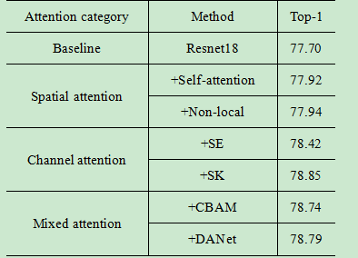

# 注意力机制

## 1.介绍

注意力机制（Attention Mechanism）是机器学习中的一种数据处理方法，广泛应用在自然语言处理（NLP）、图像处理（CV）及语音识别等各种不同类型的机器学习任务中。根据注意力机制应用于域的不同，即注意力权重施加的方式和位置不同，将注意力机制分为空间域、通道域和混合域三种。

### 1.1 空间域注意力方法

对于卷积神经网络，CNN每一层都会输出一个$C \times H \times W$的特征图，C就是通道，同时也代表卷积核的数量，亦为特征的数量，H 和W就是原始图片经过压缩后的图的高度和宽度，而空间注意力就是对于所有的通道，在二维平面上，对H x W尺寸的特征图学习到一个权重矩阵，对应每个像素都会学习到一个权重。而这些权重代表的就是某个空间位置信息的重要程度 ，将该空间注意力矩阵附加在原来的特征图上，增大有用的特征，弱化无用特征，从而起到特征筛选和增强的效果。代表的Self-Attention、Non-local Attention以及Spatial Transformer等。

### 1.2 通道域注意力方法

不同与空间注意力，通道域注意力类似于给每个通道上的特征图都施加一个权重，来代表该通道与关键信息的相关度的话，这个权重越大，则表示相关度越高。在神经网络中，越高的维度特征图尺寸越小，通道数越多，通道就代表了整个图像的特征信息。如此多的通道信息，对于神经网络来说，要甄别筛选有用的通道信息是很难的，这时如果用一个通道注意力告诉该网络哪些是重要的，往往能起到很好的效果，这时CV领域做通道注意力往往比空间好的一个原因。代表的是SENet、SKNet、ECANet等。

### 1.3混合域注意力方法

除了前面两章提到的空间域和通道域注意力，在CV领域应用更广的还有它们之间的结合，即空间与通道结合的混合域注意力机制。思想也是很简单，通道和空间对网络都有提升作用，那么它们间的有效结合必定会给网络带来更大的促进作用。根据DL任务的不同，它们结合方式也存在区别，有代表性的是CBAM、DANet、CCNet、Residual Attention等

## 2.相关论文

### 空间与注意力方法

[自注意力：Self-Attention](doc/Self-Attention.md)

[非局部注意力：Non-local Attention]()

### 通道域注意力方法

[SENet](doc/SENet.md "SENet")

[SKNet]( "SKNet")

[ECANet](doc/ECANet.md "ECANet")

### 混合域注意力方法

[CBAM](doc/CBAM.md "CBAM")

[DANet]( "DANet")

# 3.实验测试

[图像处理注意力机制Attention汇总（附代码,SE、SK、ECA、CBAM、DA、CA等） (qq.com)](https://mp.weixin.qq.com/s/Df1Q2OGx64wE2SsK8pCd7Q "图像处理注意力机制Attention汇总（附代码,SE、SK、ECA、CBAM、DA、CA等） (qq.com)")

为了评估各种注意力机制的性能，我们在CIFAR-100上进行了的实验。对每组实验，我们都以Resnet18为Baseline，训练160epoch，初始学习率为0.1,80epoch调整到0.01,160epoch时调整到0.001。Batch size设置为128，实验带momentum的SGD优化器。读取输入时，首先进行随机裁剪和随机翻转的数据增强。特别地，为最大化注意力效果，实验开始时我们都进行1个epoch的warm-up操作，取最好5个epoch的平均作为最后结果。

可以看出，综合性能混合域注意力表现出较好的性能，空间域注意力的表现是最差的，其中一个原因是空间注意力应用与空间特征图上，但cifar100图像分辨有限（32\*32），因此空间注意力并没有表现出很好的增强效果。通道注意力表现出很好的普适性，其中SKNet在这几组实验中获得了最好表现，这归因与其动态卷积核的设置，但相比其他轻量级的注意力，它需要占据更多的内存和参数量，而且组卷积的并行设置会导致训练速度变慢。

代码附件：

[https://github.com/ZhugeKongan/Attention-mechanism-implementation](https://github.com/ZhugeKongan/Attention-mechanism-implementation "https://github.com/ZhugeKongan/Attention-mechanism-implementation")
