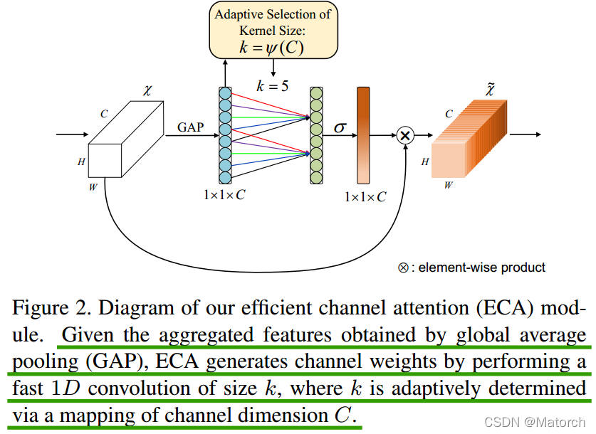

# ECANet

# 1.论文介绍

论文名称：ECA-Net: Efficient Channel Attention for Deep Convolutional Neural Networks

论文链接：[https://arxiv.org/pdf/1910.03151.pdf](https://arxiv.org/pdf/1910.03151.pdf "https://arxiv.org/pdf/1910.03151.pdf")

论文代码：[https://github.com/BangguWu/ECANet](https://github.com/BangguWu/ECANet "https://github.com/BangguWu/ECANet")

### 摘要

Recently, channel attention mechanism has demonstrated to offer great potential in improving the performance of deep convolutional neural networks (CNNs). However, most existing methods dedicate to developing more sophisticated attention modules for achieving better performance, which inevitably increase model complexity. **To overcome the paradox of performance and complexity trade-off**, this paper proposes an Efficient Channel Attention (ECA) module, which only involves a handful of parameters while bringing clear performance gain. **By dissecting the channel attention module in SENet, we empirically show avoiding dimensionality reduction is important for learning channel attention, and appropriate cross-channel interaction can preserve performance while significantly decreasing model complexity. Therefore, we propose a local crosschannel interaction strategy without dimensionality reduction, which can be efficiently implemented via 1D convolution.** Furthermore, we develop a method to adaptively select kernel size of 1D convolution, determining coverage of local cross-channel interaction. The proposed ECA module is efficient yet effective, e.g., the parameters and computations of our modules against backbone of ResNet50 are 80 vs. 24.37M and 4.7e-4 GFLOPs vs. 3.86 GFLOPs, respectively, and the performance boost is more than 2% in terms of Top-1 accuracy. We extensively evaluate our ECA module on image classification, object detection and instance segmentation with backbones of ResNets and MobileNetV2. The experimental results show our module is more efficient while performing favorably against its counterparts.

摘要重点：

近年来，通道注意机制在改善深度卷积神经网络（CNN）性能方面显示出巨大的潜力。然而，大多数现有方法致力于开发更复杂的注意模块，以获得更好的性能，这不可避免地增加了模型的复杂性。**为了克服性能和复杂性之间的矛盾**，本文提出了一种高效的通道注意（ECA）模块，该模块只涉及少量参数，同时带来明显的性能增益。**通过剖析SENet中的通道注意模块，我们实证地表明，避免维度缩减对于学习通道注意非常重要，适当的跨通道交互可以在显著降低模型复杂度的同时保持性能。因此，我们提出了一种无降维的局部交叉信道交互策略，该策略可以通过一维卷积有效地实现**。

### ECABlock创新点&#xA;

1.  针对SEBlock的步骤(3)，将MLP模块(FC->ReLU>FC->Sigmoid)，**转变为一维卷积的形**式，有效减少了参数计算量（我们都知道在CNN网络中，往往连接层是参数量巨大的，因此将全连接层改为一维卷积的形式）
2.  一维卷积自带的功效就是非全连接，每一次卷积过程只和部分通道的作用，即实现了适当的跨通道交互而不是像全连接层一样全通道交互。

# 2.算法解读



给定通过平均池化(average pooling)获得的聚合特征 ${[1,1, C]}$，ECA模块通过执行卷积核大小为k的一维卷积来生成通道权重，其中k通过通道维度C的映射自适应地确定。

图中与SEBlock不一样的地方仅在于SEBlock的步骤(3)，用一维卷积替换了全连接层，其中一维卷积核大小通过通道数C自适应确定。

**自适应确定卷积核大小公式**：$k=|\frac{log2(c)}{\gamma} + \frac{b}{\gamma}|_{odd}$，其中k表示卷积核大小，C表示通道数， ${| |_{odd}}$表示k只能取奇数，${\gamma}$和${b}$在论文中设置为2和1,用于改变通道数C和卷积核大小和之间的比例。

### 实现过程

1.  将输入特征图经过全局平均池化，特征图从 \[h,w,c] 的矩阵变成 \[1,1,c] 的向量
2.  根据特征图的通道数计算得到自适应的一维卷积核大小 kernel\_size
3.  将 kernel\_size 用于一维卷积中，得到对于特征图的每个通道的权重
4.  将归一化权重和原输入特征图逐通道相乘，生成加权后的特征图

# 3.代码实现

```python
class ECABlock(nn.Module):
    """ SE注意力机制类
    """
    def __init__(self, in_channel, gamma=2, b=1):
        """ 初始化
            - channel: 输入特征图的通道数
            - gamma: 公式中的两个系数
            - b: 公式中的两个系数
        """
        super(ECABlock, self).__init__()
        # 全局平均池化，输出的特征图的宽高=1
        self.avg_pooling = nn.AdaptiveAvgPool2d(1)

        kernel_size = int(abs((math.log(in_channel, 2) + b) / gamma))
        kernel_size = kernel_size if kernel_size % 2 else kernel_size + 1
        # 1D卷积，输入和输出通道数都=1，卷积核大小是自适应的
        self.conv = nn.Conv1d(1, 1, kernel_size=kernel_size, 
                              padding=(kernel_size-1)//2, bias=False)

        self.sigmoid = nn.Sigmoid()

    def forward(self, X):
        """ 前向传播
        """
        # v = self.avg_pooling(X)
        # v = self.conv(v.squeeze(-1).transpose(-1, -2)).transpose(-1, -2).unsqueeze(-1)
        # # 归一化处理
        # v = self.sigmoid(v)

        # 获得输入图像的shape
        b, c, h, w = X.shape
        
        # 全局平均池化 [b,c,h,w]==>[b,c,1,1]
        v = self.avg_pooling(X)
        # 维度调整，变成序列形式 [b,c,1,1]==>[b,1,c]
        v = v.view([b,1,c])
        # 1D卷积 [b,1,c]==>[b,1,c]
        v = self.conv(v)
        # 维度调整 [b,1,c]==>[b,c,1,1]
        v = v.view([b,c,1,1])
         # 权值归一化
        v = self.sigmoid(v)

        return X * v
```

构造输入层，查看一次前向传播的输出结果，打印网络结构

```python
# 构造输入层 [b,c,h,w]==[4,32,16,16]
inputs = torch.rand([4,32,16,16])
# 获取输入图像的通道数
in_channel = inputs.shape[1]
# 模型实例化
model = eca_block(in_channel=in_channel)
# 前向传播
outputs = model(inputs)
 
print(outputs.shape)  # 查看输出结果
print(model)    # 查看网络结构
stat(model, input_size=[32,16,16])  # 查看网络参数
```

输出

```bash
       module name  input shape output shape  params memory(MB) MAdd Flops  MemRead(B)  MemWrite(B) duration[%]  MemR+W(B)
0      avg_pooling   32  16  16   32   1   1     0.0       0.00  0.0   0.0         0.0          0.0       0.00%        0.0
1             conv        1  32        1  32     3.0       0.00  0.0   0.0         0.0          0.0      99.99%        0.0
2          sigmoid   32   1   1   32   1   1     0.0       0.00  0.0   0.0         0.0          0.0       0.00%        0.0
total                                            3.0       0.00  0.0   0.0         0.0          0.0      99.99%        0.0
==========================================================================================================================
Total params: 3
--------------------------------------------------------------------------------------------------------------------------
Total memory: 0.00MB
Total MAdd: 0MAdd
Total Flops: 0Flops
Total MemR+W: 0B
```
