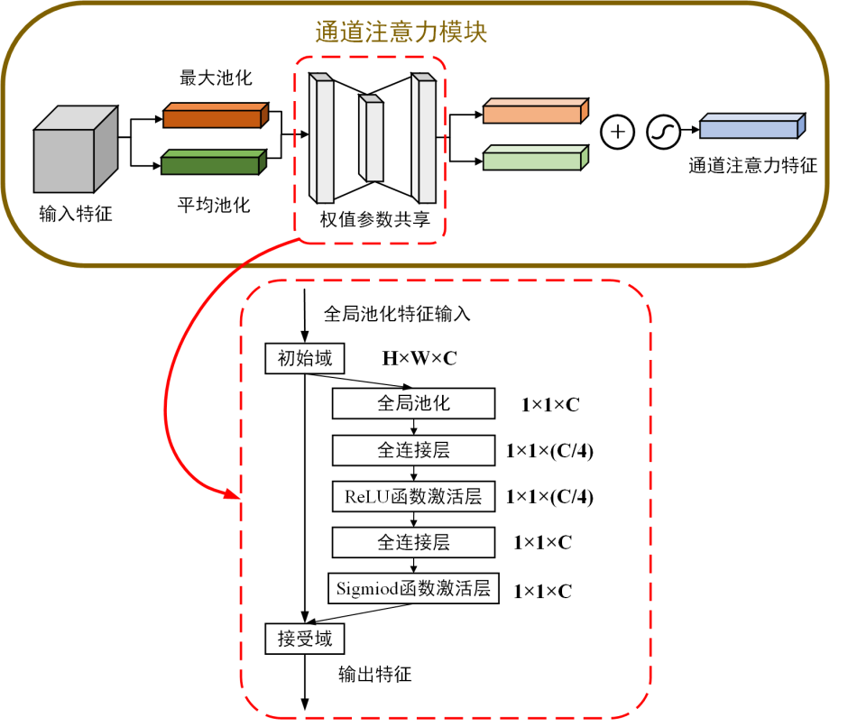

# CBAM

# 1.论文介绍

论文名称：CBAM: Convolutional Block Attention Module

论文链接：[https://arxiv.org/pdf/1807.06521v2.pdf](https://arxiv.org/pdf/1807.06521v2.pdf "https://arxiv.org/pdf/1807.06521v2.pdf")

论文代码：[https://github.com/luuuyi/CBAM.PyTorch(复现版本)](https://github.com/luuuyi/CBAM.PyTorch\(复现版本\) "https://github.com/luuuyi/CBAM.PyTorch(复现版本)")

### 摘要

We propose Convolutional Block Attention Module (CBAM), a simple yet effective attention module for feed-forward convolutional neural networks. **Given an intermediate feature map, our module sequentially infers attention maps along two separate dimensions, channel and spatial, then the attention maps are multiplied to the input feature map for adaptive feature refinement**. Because CBAM is a lightweight and general module, it can be integrated into any CNN architectures seamlessly with negligible overheads and is end-to-end trainable along with base CNNs. We validate our CBAM through extensive experiments on ImageNet-1K, MS COCO detection, and VOC 2007 detection datasets. Our experiments show consistent improvements in classification and detection performances with various models, demonstrating the wide applicability of CBAM. The code and models will be publicly available.

摘要重点：

我们提出了卷积块注意模块（CBAM），一种简单而有效的前馈卷积神经网络注意模块。**给定一个中间的特征图，我们的模块采用两个独立的注意力机制，通道注意力和空间注意力，然后将注意力机制得到的权重乘以输入特征图以进行自适应特征细化**。因为CBAM是一个轻量级的通用模块，它可以无缝地集成到任何CNN架构中，开销可以忽略不计，并且可以与基础CNN一起进行端到端培训。我们通过在ImageNet-1K、MS COCO检测和VOC 2007检测数据集上的大量实验来验证我们的CBAM。我们的实验表明，各种模型在分类和检测性能上都有一致的改进，证明了CBAM的广泛适用性。代码和模型将公开提供。

### CBAM创新点

**CBAM注意力机制**是由**通道注意力机制**（channel）和**空间注意力机制**（spatial）组成。**空间注意力可使神经网络更加关注图像中对分类起决定作用的像素区域而忽略无关紧要的区域**，**通道注意力则用于处理特征图通道的分配关系**，同时对两个维度进行注意力分配增强了注意力机制对模型性能的提升效果。


1.  在SENet或ECANet的基础上，在通道注意力模块后，接入空间注意力模块，实现了通道注意力和空间注意力的双机制
2.  选择SENet还是ECANet主要取决于通道注意力的连接是MLP还是一维卷积
3.  注意力模块不再采用单一的最大池化或平均池化，而是采用最大池化和平均池化的相加或堆叠。通道注意力模块采用相加，空间注意力模块采用堆叠方式。

# 2.算法解读

## 2.1 通道注意力机制

CBAM中的通道注意力机制模块流程图如下。先将输入特征图分别进行全局最大池化和全局平均池化，对特征映射基于两个维度压缩，获得两张不同维度的特征描述。池化后的特征图共用一个多层感知器网络，先通过一个全连接层下降通道数，再通过另一个全连接恢复通道数。将两张特征图在通道维度堆叠，经过 sigmoid 激活函数将特征图的每个通道的权重归一化到0-1之间。将归一化后的权重和输入特征图相乘。



**整体上和SENet基本一致，只是将单一的平均池化变为了同时采用最大池化和平均池化方法**。之后若将MLP稍加修改，改成一维卷积，就成为了ECANet的变形版本

## 2.2 空间注意力机制

CBAM中的空间注意力机制模块如下。对通道注意力机制的输出特征图进行空间域的处理。首先，对输入特征图在通道维度下做最大池化和平均池化，将池化后的两张特征图在通道维度堆叠。然后，使用 $7*7$（或$3*3$、$1*1$）大小的卷积核融合通道信息，特征图的shape从 $[b,2,h,w]$ 变成 $[b,1,h,w]$。最后，将卷积后的结果经过 sigmoid 函数对特征图的空间权重归一化，再将输入特征图和权重相乘。


## 2.3 **CBAM注意力机制**

CBAM的总体流程图如下。**输入特征图先经过通道注意力机制**，**将通道权重和输入特征图相乘**后**再送入空间注意力机制**，**将归一化后的空间权重和空间注意力机制的输入特征图相乘**，得到最终加权后的特征图。


# 3.代码实现

### 通道注意力：FC

```python
class ChannelAttentionFC(nn.Module):
    """ 通道注意力机制——全连接层版本
    """
    def __init__(self, in_channel, ratio):
        """ 初始化
            - channel：输入特征图的通道数
            - ratio：全连接层下降通道倍数
        """
        super(ChannelAttentionFC, self).__init__()
        # 全局最大池化 [b,c,h,w]==>[b,c,1,1]
        self.avg_pooling = nn.AdaptiveAvgPool2d(1)
        # 全局平均池化 [b,c,h,w]==>[b,c,1,1]
        self.max_pooling = nn.AdaptiveMaxPool2d(1)
        self.fc_layers = nn.Sequential(
            nn.Linear(in_features = in_channel, out_features = in_channel // ratio, bias = False),
            nn.ReLU(),
            nn.Linear(in_features = in_channel // ratio, out_features = in_channel, bias = False)
        )
        self.sigmoid = nn.Sigmoid()

    def forward(self, X):
        """ 前向传播
        """
        b, c, h, w = X.shape
        # 输入图像做全局最大池化 [b,c,h,w]==>[b,c,1,1]==>[b,c]
        avg_x = self.avg_pooling(X).view(b, c)
        # 输入图像的全局平均池化 [b,c,h,w]==>[b,c,1,1]==>[b,c]
        max_x = self.max_pooling(X).view(b, c)
        # [b,c]==>[b,c//4]==>[b,c]
        v = self.fc_layers(avg_x) + self.fc_layers(max_x)
        # sigmoid函数权值归一化, # 调整维度 [b,c]==>[b,c,1,1]
        v = self.sigmoid(v).view(b, c, 1, 1)
        # 输入特征图和通道权重相乘 [b,c,h,w]
        return X * v
```

### 通道注意力：Conv

```python
class ChannelAttentionConv(nn.Module):
    """ 通道注意力机制——一维卷积版本
    """
    def __init__(self, in_channel, gamma = 2, b = 1):
        """ 初始化
            - channel: 输入特征图的通道数
            - gamma: 公式中的两个系数
            - b: 公式中的两个系数
        """
        super(ChannelAttentionConv, self).__init__()
        # 根据输入通道数自适应调整卷积核大小
        kernel_size = int(abs((math.log(in_channel, 2) + b) / gamma))
        # 如果卷积核大小是奇数
        kernel_size = kernel_size if kernel_size % 2 else kernel_size + 1
        # 池化
        self.avg_pooling = nn.AdaptiveAvgPool2d(1)
        self.max_pooling = nn.AdaptiveMaxPool2d(1)
        # 一维卷积
        self.conv = nn.Conv1d(1, 1, kernel_size = kernel_size, 
                              padding = (kernel_size - 1) // 2, bias = False)
        self.sigmoid = nn.Sigmoid()

    def forward(self, X):
        """ 前向传播
        """
        # 全局池化 [b,c,h,w]==>[b,c,1,1]
        avg_x = self.avg_pooling(X)
        max_x = self.max_pooling(X)
        # [b,c,1,1]==>[b,1,c] =1D卷积=> [b,1,c]==>[b,c,1,1]
        avg_out = self.conv(avg_x.squeeze(-1).transpose(-1, -2)).transpose(-1, -2).unsqueeze(-1)
        max_out = self.conv(max_x.squeeze(-1).transpose(-1, -2)).transpose(-1, -2).unsqueeze(-1)
        # 权值归一化
        v = self.sigmoid(avg_out + max_out)
        # 输入特征图和通道权重相乘 [b,c,h,w]
        return X * v
```

### 空间注意力

```python
class SpatialAttention(nn.Module):
    """ 空间注意力机制
    """
    def __init__(self, k: int = 7):
        """初始化
            - k: 卷积核大小,只能为3, 5, 7
        """
        super(SpatialAttention, self).__init__()
        # 池化
        self.avg_pooling = torch.mean
        self.max_pooling = torch.max
        # In order to keep the size of the front and rear images consistent
        # with calculate, k = 1 + 2p, k denote kernel_size, and p denote padding number
        # so, when p = 1 -> k = 3; p = 2 -> k = 5; p = 3 -> k = 7, it works. when p = 4 -> k = 9, it is too big to use in network
        assert k in [3, 5, 7], "kernel size = 1 + 2 * padding, so kernel size must be 3, 5, 7"
        # 卷积融合通道信息 [b,2,h,w]==>[b,1,h,w]
        self.conv = nn.Conv2d(2, 1, kernel_size = (k, k), stride = (1, 1), 
                              padding = ((k - 1) // 2, (k - 1) // 2),
                              bias = False)
        self.sigmoid = nn.Sigmoid()

    def forward(self, X):
        """ 前向传播
        """
        # compress the C channel to 1 and keep the dimensions
        # 在通道维度上最大池化 [b,1,h,w]  keepdim保留原有深度
        # 返回值是在某维度的最大值和对应的索引
        avg_x = self.avg_pooling(X, dim = 1, keepdim = True)
        # 在通道维度上平均池化 [b,1,h,w]
        max_x, _ = self.max_pooling(X, dim = 1, keepdim = True)
        # 池化后的结果在通道维度上堆叠 [b,2,h,w]
        # 卷积融合通道信息 [b,2,h,w]==>[b,1,h,w]
        v = self.conv(torch.cat((max_x, avg_x), dim = 1))
        # 空间权重归一化
        v = self.sigmoid(v)
        # 输入特征图和空间权重相乘
        return X * v
```

### CBAM注意力

```python
class CBAMBlock(nn.Module):
    """ CBAM注意力机制
    """
    def __init__(self, channel_attention_mode: str = "Conv",
                 spatial_attention_kernel: int = 7, 
                 in_channel: int = None, 
                 ratio: int = 4,
                 gamma: int = 2, 
                 b: int = 1):
        """ 初始化
            - channel_attention_mode: 通道注意力机制模式，可选["FC", "Conv"]
            - spatial_attention_kernel: 空间注意力机制的卷积核大小
            - in_channel: 通道注意力机制的输入通道数
            - ratio: 通道注意力机制的全连接下降的通道数
            - gamma: 公式中的两个系数
            - b: 公式中的两个系数
        """
        super(CBAMBlock, self).__init__()
        if channel_attention_mode == "FC":
            assert in_channel != None \
                and ratio != None   \
                and channel_attention_mode == "FC", \
                "FC channel attention block need feature maps' channels, ratio"
            self.channel_attention_block = ChannelAttentionFC(in_channel = in_channel, ratio = ratio)
        elif channel_attention_mode == "Conv":
            assert in_channel != None \
                and gamma != None \
                and b != None \
                and channel_attention_mode == "Conv", \
                "Conv channel attention block need feature maps' channels, gamma, b"
            self.channel_attention_block = ChannelAttentionConv(in_channel = in_channel, gamma = gamma, b = b)
        else:
            assert channel_attention_mode in ["FC", "Conv"], \
                "channel attention block must be 'FC' or 'Conv'"
        self.spatial_attention_block = SpatialAttention(k = spatial_attention_kernel)

    def forward(self, X):
        """ 前向传播
        """
        # 先将输入图像经过通道注意力机制
        X = self.channel_attention_block(X)
        # 然后经过空间注意力机制
        X = self.spatial_attention_block(X)
        return X
```

### 测试

```python
# 构造输入层 [b,c,h,w]==[4,32,16,16]
  inputs = torch.rand([4,32,16,16])
  # 获取输入图像的通道数
  in_channel = inputs.shape[1]
  # 模型实例化
  # model = CBAMBlock("FC", in_channel=in_channel)
  model = CBAMBlock("Conv", in_channel=in_channel)
  # 前向传播
  outputs = model(inputs)
  
  print(outputs.shape)  # 查看输出结果
  print(model)    # 查看网络结构
  stat(model, input_size=[32,16,16])  # 查看网络参数
```

#### FC输出

```bash
                               module name  input shape output shape  params memory(MB)      MAdd     Flops  MemRead(B)  MemWrite(B) duration[%]  MemR+W(B)
0      channel_attention_block.avg_pooling   32  16  16   32   1   1     0.0       0.00       0.0       0.0         0.0          0.0       0.00%        0.0
1      channel_attention_block.max_pooling   32  16  16   32   1   1     0.0       0.00       0.0       0.0         0.0          0.0       0.00%        0.0
2      channel_attention_block.fc_layers.0           32            8   256.0       0.00     504.0     256.0      1152.0         32.0       0.00%     1184.0
3      channel_attention_block.fc_layers.1            8            8     0.0       0.00       8.0       8.0        32.0         32.0       0.00%       64.0
4      channel_attention_block.fc_layers.2            8           32   256.0       0.00     480.0     256.0      1056.0        128.0       0.00%     1184.0
5          channel_attention_block.sigmoid           32           32     0.0       0.00       0.0       0.0         0.0          0.0       0.00%        0.0
6             spatial_attention_block.conv    2  16  16    1  16  16    98.0       0.00  49,920.0  25,088.0      2440.0       1024.0       0.00%     3464.0
7          spatial_attention_block.sigmoid    1  16  16    1  16  16     0.0       0.00       0.0       0.0         0.0          0.0       0.00%        0.0
total                                                                  610.0       0.00  50,912.0  25,608.0         0.0          0.0       0.00%     5896.0
===========================================================================================================================================================
Total params: 610
-----------------------------------------------------------------------------------------------------------------------------------------------------------
Total memory: 0.00MB
Total MAdd: 50.91KMAdd
Total Flops: 25.61KFlops
Total MemR+W: 5.76KB
```

#### Conv输出

```bash
                               module name  input shape output shape  params memory(MB)      MAdd     Flops  MemRead(B)  MemWrite(B) duration[%]  MemR+W(B)
0      channel_attention_block.avg_pooling   32  16  16   32   1   1     0.0       0.00       0.0       0.0         0.0          0.0       0.00%        0.0
1      channel_attention_block.max_pooling   32  16  16   32   1   1     0.0       0.00       0.0       0.0         0.0          0.0       0.00%        0.0
2             channel_attention_block.conv        1  32        1  32     3.0       0.00       0.0       0.0         0.0          0.0       0.00%        0.0
3          channel_attention_block.sigmoid   32   1   1   32   1   1     0.0       0.00       0.0       0.0         0.0          0.0       0.00%        0.0
4             spatial_attention_block.conv    2  16  16    1  16  16    98.0       0.00  49,920.0  25,088.0      2440.0       1024.0      99.99%     3464.0
5          spatial_attention_block.sigmoid    1  16  16    1  16  16     0.0       0.00       0.0       0.0         0.0          0.0       0.00%        0.0
total                                                                  101.0       0.00  49,920.0  25,088.0         0.0          0.0      99.99%     3464.0
===========================================================================================================================================================
Total params: 101
-----------------------------------------------------------------------------------------------------------------------------------------------------------
Total memory: 0.00MB
Total MAdd: 49.92KMAdd
Total Flops: 25.09KFlops
Total MemR+W: 3.38KB
```
