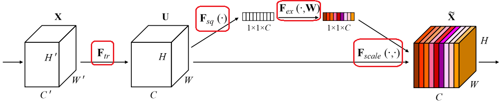
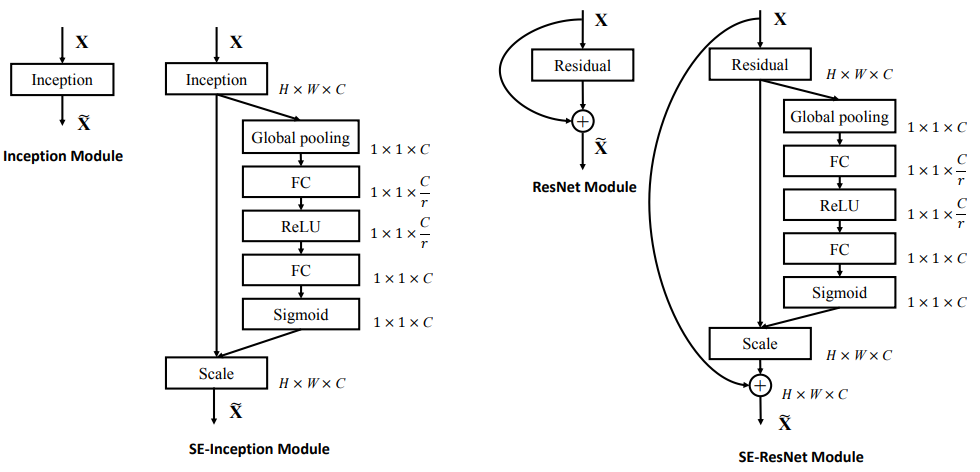

# SENet

# 1.论文介绍

论文名称：Squeeze-and-Excitation Networks

论文链接：[https://arxiv.org/pdf/1709.01507.pdf](https://arxiv.org/pdf/1709.01507.pdf "https://arxiv.org/pdf/1709.01507.pdf")

论文代码： [https://github.com/hujie-frank/SENet](https://github.com/hujie-frank/SENet "https://github.com/hujie-frank/SENet")

### 1.1 摘要

The central building block of convolutional neural networks (CNNs) is the convolution operator, which enables networks to construct informative features by fusing both spatial and channel-wise information within local receptive fields at each layer. A broad range of prior research has investigated the spatial component of this relationship, seeking to strengthen the representational power of a CNN by enhancing the quality of spatial encodings throughout its feature hierarchy. In this work, we focus instead on the channel relationship and propose a novel architectural unit, which we term the “Squeeze-and-Excitation” (SE) block, that adaptively recalibrates channel-wise feature responses by explicitly modelling interdependencies between channels. We show that these blocks can be stacked together to form SENet architectures that generalise extremely effectively across different datasets. We further demonstrate that SE blocks bring significant improvements in performance for existing state-of-the-art CNNs at slight additional computational cost. Squeeze-and-Excitation Networks formed the foundation of our ILSVRC 2017 classification submission which won first place and reduced the top-5 error to 2.251%, surpassing the winning entry of 2016 by a relative improvement of ∼25%. Models and code are available at [https://github.com/hujie-frank/SENet](https://github.com/hujie-frank/SENet "https://github.com/hujie-frank/SENet").

**摘要重点**：

卷积神经网络（CNN）的核心组成部分是卷积算子，它使网络能够通过融合每层局部感受野中的空间和通道信息来构建信息特征。之前的大量研究已经调查了这种关系的空间成分，并试图通过在CNN的特征层次中提高空间编码的质量来增强CNN。**在这项工作中，我们将重点放在通道(channel-wise)关系上，并提出了一个新的名为SE模块的架构单元，它通过显式地建模通道之间的相互依赖性，自适应地重新校准通道特征响应。这些模块可以堆叠在一起形成SENet网络结构，并在多个数据集上非常有效地推广**。

### 1.2 SEBlock创新点

1.  SEBlock会给每个通道一个权重，让不同通道对结果有不同的作用力。
2.  这个SE模块能够非常方便地添加进目前主流的神经网络当中。

# 2.算法解读

SE注意力机制（Squeeze-and-Excitation Networks）**在通道维度增加注意力机制**，关键操作是`squeeze`和`excitation`。

通过自动学习的方式，**使用另外一个新的神经网络，获取到特征图的每个通道的重要程度，然后用这个重要程度去给每个特征赋予一个权重值**，从而让神经网络重点关注某些特征通道。提升对当前任务有用的特征图的通道，并抑制对当前任务用处不大的特征通道。

如下图所示，在输入SE注意力机制之前（左侧图C），特征图的每个通道的重要程度都是一样的，通过SENet之后（右侧彩图C），不同颜色代表不同的权重，使每个特征通道的重要性变得不一样了，使神经网络重点关注某些权重值大的通道。



### 实现步骤

（1）**提取初始特征**：从单张图像开始，提取图像特征，当前特征层U的特征图维度为${[H,W,C]}$

（2）**Squeeze**：对特征图的${[H,W]}$维度进行平均池化或最大池化，池化过后的特征图大小从 ${[H,W, C]}$→$  {[1,1,C]} $。${[1,1,C]}$可理解为对于每一个通道C，都有一个数字和其一一对应。

（3）**Excitation**：给每个特征通道生成一个权重值，论文中通过两个全连接层（MLP）构建通道间的相关性，输出的权重值数目和输入特征图的通道数相同。$  {[1,1,C]} $ → $  {[1,1,C]} $

（4）**Scale**：将前面得到的归一化权重加权到每个通道的特征上。论文中使用的是乘法，逐通道乘以权重系数。$  {[H,W,C]} \times  {[1,1,C]}  $→ $  {[H,W,C]} $

### SENet

文中经过对比实验发现，r rr取16的时候效果最好，所以一般默认 r=16，但当通道数很小的时候，需要自己再调整



### 总结

（1）**SENet的核心思想是通过全连接网络根据loss损失来自动学习特征权重**，而不是直接根据特征通道的数值分配来判断，使有效的特征通道的权重大。当然SE注意力机制不可避免的增加了一些参数和计算量，但性价比还是挺高的。

（2）论文认为excitation操作中使用**两个全连接层**相比直接使用一个全连接层，它的好处在于，具有更多的非线性，可以更好地拟合通道间的复杂关联。

# 3.代码实现

```python
class SEBlock(nn.Module):
    """ SE注意力机制类
    """
    def __init__(self, channels, ratio=4, mode="avg"):
        """ 初始化
            - model：池化方法
            - channel：输入特征图的通道数
            - ratio：全连接层下降通道倍数
        """
        super(SEBlock, self).__init__()

        self.avg_pooling = nn.AdaptiveAvgPool2d(1)
        self.max_polling = nn.AdaptiveMaxPool2d(1)

        if mode == "max":
            self.global_pooling = self.max_polling
        elif mode == "avg":
            self.global_pooling = self.avg_pooling

        self.fc_layers = nn.Sequential(
            nn.Linear(in_features=channels, out_features=channels // ratio, bias=False),
            nn.ReLU(),
            nn.Linear(in_features=channels // ratio, out_features=channels, bias=False),
        )
        self.sigmoid = nn.Sigmoid()

    def forward(self, X):
        """ 前向传播
        """
        b, c, h, w = X.shape
        # 全局池化 + 维度调整：[b,c,h,w]==>[b,c,1,1] ==> [b,c]
        v = self.global_pooling(X).view(b, c)
        # MLP + 维度调整
        v = self.fc_layers(v).view(b, c, 1, 1)
        # 归一化处理
        v = self.sigmoid(v)

        return X * v

```

构造输入层

```python
if __name__ == "__main__":
    # 构造输入层shape==[4,32,16,16]
    inputs = torch.rand(4,32,16,16)
    # 获取输入通道数
    in_channel = inputs.shape[1]
    # 模型实例化
    model = SEBlock(channels=in_channel)
    
    # 前向传播查看输出结果
    outputs = model(inputs)
    print(outputs.shape)  # [4,32,16,16])
    
    print(model) # 查看模型结构
    stat(model, input_size=[32,16,16])  # 查看参数，不需要指定batch维度
```

网络输出

```bash
       module name  input shape output shape  params memory(MB)   MAdd  Flops  MemRead(B)  MemWrite(B) duration[%]  MemR+W(B)
0      avg_pooling   32  16  16   32   1   1     0.0       0.00    0.0    0.0         0.0          0.0       0.00%        0.0
1      max_polling    0   0   0    0   0   0     0.0       0.00    0.0    0.0         0.0          0.0       0.00%        0.0
2      fc_layers.0           32            8   256.0       0.00  504.0  256.0      1152.0         32.0      99.99%     1184.0
3      fc_layers.1            8            8     0.0       0.00    8.0    8.0        32.0         32.0       0.00%       64.0
4      fc_layers.2            8           32   256.0       0.00  480.0  256.0      1056.0        128.0       0.00%     1184.0
5          sigmoid   32   1   1   32   1   1     0.0       0.00    0.0    0.0         0.0          0.0       0.00%        0.0
total                                          512.0       0.00  992.0  520.0         0.0          0.0      99.99%     2432.0
=============================================================================================================================
Total params: 512
-----------------------------------------------------------------------------------------------------------------------------
Total memory: 0.00MB
Total MAdd: 992MAdd
Total Flops: 520Flops
Total MemR+W: 2.38KB
```
