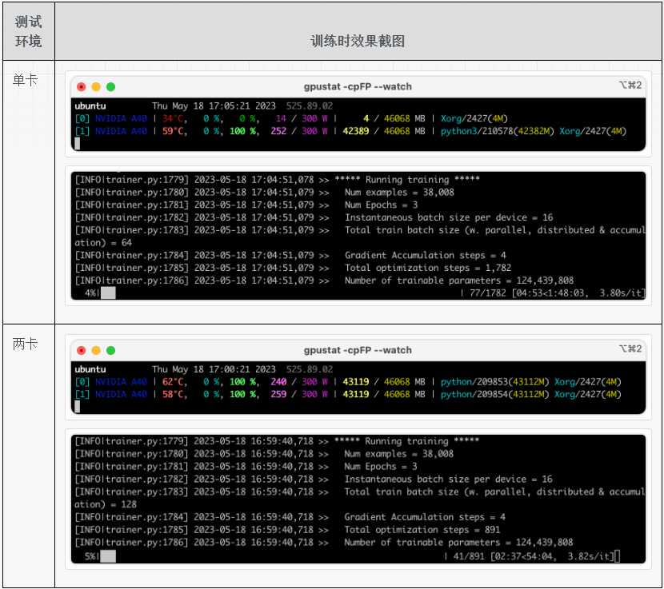

# 1、生成配置文件: config

> 参考资料：
> 
> https://huggingface.co/docs/accelerate/quicktour#launching-your-distributed-script

生成配置文件命令如下所示，其中 `path_to_config.yaml` 是生成的配置文件的存储路径：

```shell
accelerate config --config_file path_to_config.yaml
```

比如生成的一个配置文件的样例为（单节点，2个GPU）：

```shell
compute_environment: LOCAL_MACHINE
distributed_type: MULTI_GPU
downcast_bf16: 'no'
gpu_ids: all
machine_rank: 0
main_training_function: main
mixed_precision: fp16
num_machines: 1
num_processes: 2
rdzv_backend: static
same_network: true
tpu_env: []
tpu_use_cluster: false
tpu_use_sudo: false
use_cpu: false
```
# 2.运行（两卡数据并行）

> 参考资料：
> 
> https://huggingface.co/docs/accelerate/quicktour#launching-your-distributed-script
> 
> https://huggingface.co/docs/accelerate/basic_tutorials/launch

## 2.1 启动命令说明

运行的命令模版如下所示，首先指定上一步骤生成的 accelerate 的配置文件，然后指定训练的脚本，最后一部分是训练脚本中所需的参数：

```shell
accelerate launch --config_file path_to_config.yaml \
  path_to_script.py \
  --args_for_the_script
```

下面直接使用 accelerate 执行一下训练流程，一方面熟悉一下如何启动，另一方面看一下两卡时的加速效果。使用的机器是有2张 A40 显卡的机器，模型采用 gpt2，数据是某个开源数据，大概3W+条数据，使用的代码是 transformers 库中的样例代码，链接为：[run_clm](https://github.com/huggingface/transformers/blob/main/examples/pytorch/language-modeling/run_clm.py) 。

## 2.2 单卡与两卡速度对比

分别测试单卡训练和两卡训练，单卡训练和两卡训练的启动命令如下所示。单卡训练没有使用 accelerate 启动，而是直接使用 python 启动；两卡训练使用 accelerate 启动。

```shell
# 单卡训练的启动命令
CUDA_VISIBLE_DEVICES=1 python3 examples/pytorch/language-modeling/run_clm.py \
  --model_name_or_path gpt2 \
  --train_file ./data/data.json \
  --output_dir ./outputs \
  --do_train \
  --do_eval \
  --fp16 \
  --per_device_train_batch_size 16 \
  --per_device_eval_batch_size 16 \
  --gradient_accumulation_steps 4 \
  --overwrite_output_dir

# 两卡训练的启动命令
accelerate launch \
  --config_file ./accelerate/default_accelerate_config.yaml \
  examples/pytorch/language-modeling/run_clm.py \
  --model_name_or_path gpt2 \
  --train_file ./data/data.json \
  --output_dir ./outputs \
  --do_train \
  --do_eval \
  --fp16 \
  --per_device_train_batch_size 16 \
  --per_device_eval_batch_size 16 \
  --gradient_accumulation_steps 4 \
  --overwrite_output_dir
```


训练过程中的截图如下表所示，可以看出无论是单卡还是双卡，GPU的利用率都是比较高的，单卡和两卡的耗时也比较接近两倍关系，加速效果还是比较可观的。



## 3、暂时略过的一些功能

- 如果要在自己的训练代码中使用 accelerate 库，需要修改哪些代码：[参考链接1](https://huggingface.co/docs/accelerate/quicktour#main-use)、[参考链接2](https://huggingface.co/docs/accelerate/basic_tutorials/migration)
- 评估部分如果要做分布式评估，代码需要做哪些修改：[参考链接](https://huggingface.co/docs/accelerate/quicktour#distributed-evaluation)
- 只在主进程中执行某些代码，比如打印进度条，代码要如何写：[参考链接](https://huggingface.co/docs/accelerate/quicktour#execute-a-statement-only-on-one-processes)
- 模型的加载和存储：[参考链接](https://huggingface.co/docs/accelerate/quicktour#savingloading-a-model)
- 训练过程中整个状态的存储和加载：[参考链接1](https://huggingface.co/docs/accelerate/quicktour#savingloading-entire-states)、[参考链接2](https://huggingface.co/docs/accelerate/usage_guides/checkpoint)
- 模型很大而显存不足时如何推理：[参考链接](https://huggingface.co/docs/accelerate/usage_guides/big_modeling)
- 使用 accelerate 库之后如何实现梯度累积功能：[参考链接](https://huggingface.co/docs/accelerate/usage_guides/gradient_accumulation)


## DeepSpeed

这个 accelerate 的文档里为什么说对 deepspeed 的支持还在试验中，接口随时会改变，链接: [https://huggingface.co/docs/accelerate/quicktour#deepspeed](https://huggingface.co/docs/accelerate/quicktour#deepspeed)

## 其他

在阅读 accelerate 的文档时，有一个地方很细节，就是在使用混合精度训练时，如果某一次的梯度溢出了，那么会跳过这个 step，在这个 step 中不对权重进行更新。

到下一个 step 时，根据一定的策略调小参数 `loss scaling factor`，下一个 step 就可能梯度不再溢出了，然后就继续训练。这个细节的文档为: [参考链接](https://huggingface.co/docs/accelerate/quicktour#mixed-precision-training)