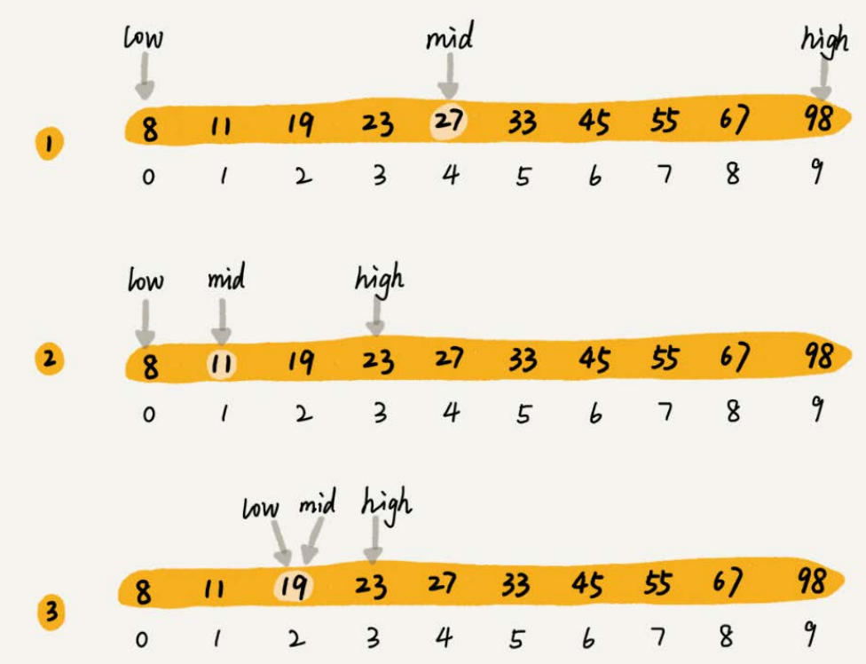

# 1.二分查找（Binary Search）

## 1.无处不在的二分查找思想

二分查找是一种非常简单易懂的快速查找算法，生活中到处可见。

举一个例子，假设只有10个订单，订单金额分别是： 8， 11， 19， 23， 27， 33， 45， 55， 67， 98。从中查找到金额等于19元的订单。

利用二分思想，每次都与区间的中间数据比对大小，缩小查找区间的范围。



二分查找针对的是一个**有序的数据集合**，查找思想有点类似**分治思想**。每次都通过跟区间的中间元素对比，将待查找的区间缩小为之前的一半，直到找到要查找的元素，或者区间被缩小为0。

## 2.`O(logn)`惊人的查找速度

二分查找是一种非常高效的查找算法。

假设数据大小是n，每次查找后数据都会缩小为原来的一半，也就是会除以2。最坏情况下，直到查找区间被缩小为空，才停止。


可以看出来，这是一个等比数列。其中`n/2k=1`时， k的值就是总共缩小的次数。而每一次缩小操作只涉及两个数据的大小比较，所以，经过了k次区间缩小操作，时间复杂度就是`O(k)`。通过`n/2k=1`，可以求得`k=log2n`，所以时间复杂度就是`O(logn)`。

## 3.二分查找的实现

**简单**的二分查找并不难写，注意这里的“简单”二字

最简单的情况就是**有序数组中不存在重复元素**，在其中用二分查找值等于给定值的数据。

```c++
int bsearch(std::vector<int>& nums, int value) {
    int low = 0;
    int high = nums.size() - 1;
    while (low <= high) {
        int mid = (low + high) / 2;
        if (nums[mid] == value) {
            return mid;
        } else if (nums[mid] < value) {
            low = mid + 1;
        } else {
            high = mid - 1;
        }
    }

    return -1;
}
```

着重强调容易出错的三个地方：

1.  **循环退出条件**：注意是`low<=high`，而不是`low<high`。
2.  **mid的取值**：`mid=(low+high)/2`这种写法是有问题的。因为如果low和high比较大的话，两者之和就有可能会溢出。改进的方法是将mid的计算方式写成`low+(high - low)/2`。更进一步，如果要将性能优化到极致的话，可以将这里的除以2操作转化成位运算`low+((high-low)>>1`)。因为相比除法运算来说，计算机处理位运算要快得多。
3.  **low和high的更新**：`low=mid+1`，`high=mid-1`。注意这里的+1和-1，如果直接写成`low=mid`或者`high=mid`，就可能会发生死循环。比如，当high=3， low=3时，如果a\[3]不等于value，就会导致一直循环不退出。

二分查找递归代码的实现

```c++
int bsearch_internally(std::vector<int>& nums, int low, int high, int value) {
    if (low > high) {
        return -1;
    }
    int mid = low + (high - low) / 2;
    if (nums[mid] == value) {
        return mid;
    } else if (nums[mid] < value) {
        return bsearch_internally(nums, mid + 1, high, value);
    } else {
        return bsearch_internally(nums, low, high - 1, value);
    }

    return -2;
}

int bsearch(std::vector<int>& nums, int value) {
    return bsearch_internally(nums, 0, nums.size() - 1, value);
}
```

## 4.二分查找变形问题

注意：以下示例是从小到大排列为前提的

### 4.1 查找第一个值等于给定值的元素

比如下面这样一个有序数组，其中，`a[5]`，`a[6]`，`a[7]`的值都等于8，是重复的数据。希望查找第一个等于8的数据，也就是下标是5的元素。


如果用简单二分查找的代码实现，首先拿8与区间的中间值`a[4] `比较， 8比6大，于是在下标5到9之间继续查找。下标5和9的中间位置是下标7， `a[7]` 正好等于8，所以代码就返回了。

```c++
int bsearch_first(std::vector<int>& nums, int value) {
    int low = 0;
    int high = nums.size() - 1;
    while (low <= high) {
        int mid = low + (high - low) / 2;
        if (nums[mid] > value) {
            high = mid - 1;
        } else if (nums[mid] < value) {
            low = mid + 1;
        } else {
            if ((mid == 0) || (nums[mid - 1] != value)) {
                return mid;
            } else {
                high = mid - 1;
            }
        }
    }

    return -1;
}
```

`nums[mid]`跟要查找的value的大小关系有三种情况：大于、小于、等于。对于`nums[mid]>value`的情况，需要更新`high= mid-1`；对于`nums[mid]<value`的情况，需要更新`low=mid+1`。

`nums[mid]=value`时，a\[mid]就是要找的元素。但是，如果求解的是第一个值等于给定值的元素，当`nums[mid]`等于要查找的值时，就需要确认一下这个`nums[mid]`是不是第一个值等于给定值的元素。

重点看`if((mid == 0) || (nums[mid - 1] != value))`。如果`mid`等于0，那这个元素已经是数组的第一个元素，那它肯定是要找的；如果`mid`不等于0，但`nums[mid]`的前一个元素`nums[mid-1]`不等于value，那也说明`nums[mid]`就是要找的第一个值等于给定值的元素。

如果经过检查之后发现`nums[mid]`前面的一个元素`nums[mid-1]`也等于value，那说明此时的`nums[mid]`肯定不是要查找的第一个值等于给定值的元素。那就更新`high=mid-1`，因为要找的元素肯定出现在`[low,mid-1]`之间。

### 4.2 查找最后一个值等于给定值的元素

```c++
int bsearch_last(std::vector<int>& nums, int value) {
    int low = 0;
    int high = nums.size() - 1;
    while (low <= high) {
        int mid = low + (high - low) / 2;
        if (nums[mid] > value) {
            high = mid - 1;
        } else if (nums[mid] < value) {
            low = mid + 1;
        } else {
            if ((mid == nums.size() - 1) || (nums[mid + 1] != value)) {
                return mid;
            } else {
                low = mid + 1;
            }
        }
    }

    return -1;
}
```

重点看 `if((mid == n -1) || (nums[mid + 1] != value))`。如果`nums[mid]`这个元素已经是数组中的最后一个元素了，那它肯定是要找的；如果`nums[mid]`的后一个元素`nums[mid+1]`不等于value，那也说明`nums[mid]`就是要找的最后一个值等于给定值的元素。

如果经过检查之后，发现`nums[mid]`后面的一个元素`nums[mid+1]`也等于value，那说明当前的这个`nums[mid]`并不是最后一个值等于给定值的元素。就更新`low=mid+1`，因为要找的元素肯定出现在`[mid+1,high]`之间。

### 4.3 查找第一个大于等于给定值的元素

在有序数组中，**查找第一个大于等于给定值的元素**。比如，数组中存储的这样一个序列： 3， 4， 6， 7， 10。如果查找第一个大于等于5的元素，那就是6。

```c++
int bsearch_up(std::vector<int>& nums, int value) {
    int low = 0;
    int high = nums.size() - 1;
    while (low <= high) {
        int mid = low + (high - low) / 2;
        if (nums[mid] >= value) {
            if ((mid == 0) || (nums[mid - 1] < value)) {
                return mid;
            } else {
                high = mid - 1;
            }
        } else {
            low = mid + 1;
        }
    }

    return -1;
}

```

如果`nums[mid]`小于要查找的值value，那要查找的值肯定在`[mid+1,high]`之间，所以，更新`low=mid+1`。

对于`nums[mid]`大于等于给定值value的情况，要先看下这个`nums[mid]`是不是要找的第一个值大于等于给定值的元素。如果`nums[mid]`前面已经没有元素，或者前面一个元素小于要查找的值value，那`nums[mid]`就是我们要找的元素。

如果`nums[mid-1]`也大于等于要查找的值value，那说明要查找的元素在`[low,mid-1]`之间，所以，将high更新为`mid-1`。

### 4.4 查找最后一个小于等于给定值的元素

最后一种二分查找的变形问题，**查找最后一个小于等于给定值的元素**。比如，数组中存储了这样一组数据： 3， 5， 6， 8， 9， 10。最后一个小于等于7的元素就是6

```c++
int bsearch_down(std::vector<int>& nums, int value) {
    int low = 0;
    int high = nums.size() - 1;
    while (low <= high) {
        int mid = low + (high - low) / 2;
        if (nums[mid] > value) {
            high = mid - 1;
        } else {
            if ((mid == nums.size() - 1) || (nums[mid + 1] > value)) {
                return mid;
            } else {
                low = mid + 1;
            }
        }
    }

    return -1;
}
```

## 5.二分查找的局限性

**二分查找的时间复杂度是**\*\*`O(logn)`，查找数据的效率非常高 \*\*。不过，并不是什么情况下都可以用二分查找，它的应用场景是有很大局限性的。

1.  **二分查找依赖的是顺序表结构，简单点说就是数组**。二分查找只能用在**数据是通过顺序表来存储的数据结构上**。如果你的数据是通过其他数据结构存储的，则无法应用二分查找。
2.  **二分查找针对的是有序数据**。二分查找**只能用在插入、删除操作不频繁**，一次排序多次查找的场景中。针对动态变化的数据集合，二分查找将不再适用。
3.  **数据量太小不适合二分查找**。只有数据量比较大的时候，二分查找的优势才会比较明显。
4.  **数据量太大也不适合二分查找**。二分查找的底层需要依赖数组这种数据结构，而**数组为了支持随机访问的特性，要求内存空间连续，对内存的要求比较苛刻**。比如，有1GB大小的数据，如果希望用数组来存储，那就需要1G的连续内存空间。

## 6.总结

二分查找，一种针对有序数据的高效查找算法，它的时间复杂度是`O(logn)`。

二分查找的核心思想理解起来非常简单，有点类似**分治思想**。即**每次都通过跟区间中的中间元素对比，将待查找的区间缩小为一半，直到找到要查找的元素，或者区间被缩小为0**。但是二分查找的代码实现比较容易写错。你需要着重掌握它的三个容易出错的地方：**循环退出条件、 mid的取值， low和high的更新**。

二分查找虽然性能比较优秀，但应用场景也比较有限。底层必须依赖数组，并且还要求数据是有序的。对于较小规模的数据查找，直接使用顺序遍历就可以了，二分查找的优势并不明显。二分查找更适合处理静态数据，也就是没有频繁的数据插入、删除操作。

实际上，求“值等于给定值”的二分查找确实不怎么会被用到，**二分查找更适合用在“近似”查找问题**，在这类问题上，二分查找的优势更加明显。
