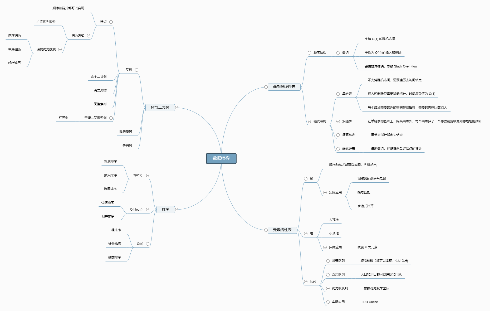
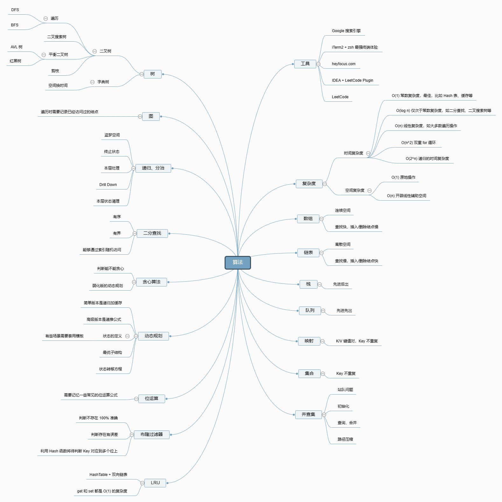

# 1.数据结构与算法总览

# 1.数据结构

[百度脑图－便捷的思维工具 (baidu.com)](https://naotu.baidu.com/file/b832f043e2ead159d584cca4efb19703?token=7a6a56eb2630548c "百度脑图－便捷的思维工具 (baidu.com)")

一维

-   基础：数组 array (string)，链表 linked list
-   高级：栈 stack, 队列 queue，双端队列 deque，集合 set，映射 map (hash or map)，etc

二维

-   基础：树tree，图 graph
-   高级：二叉搜索树 binary search tree (red-black tree, AVL)，堆 heap，并查集 disjoint set，字典树 Trie

特殊

-   位运算 Bitwise，布隆过滤器 BloomFilter
-   LRU Cache

# 2.算法

[百度脑图－便捷的思维工具 (baidu.com)](https://naotu.baidu.com/file/0a53d3a5343bd86375f348b2831d3610?token=5ab1de1c90d5f3ec "百度脑图－便捷的思维工具 (baidu.com)")

-   if-else, switch → branch
-   for, while loop → iteration
-   递归 Recursion（Divide & Conquer, Backtrace）
-   搜索 Search：DFS， BFS， A\*
-   动态规划 Dynamic Programming
-   二分查找 Binary Search
-   贪心 Greedy
-   数学 Math， 集合 Geometry

# 3.如何做题

## 3.1 切题四件套

1.  **Clarification**：看清题目
2.  **Possible solutions**：想到所有可能的想法，都过一遍
    1.  compare (time / space) ：对比事项复杂度和空间复杂度
    2.  optimal
3.  **Coding**：写代码
4.  \*\*Test cases \*\*： 多写写测试样例

## 3.2 刷题（五毒神掌）

1.  第一遍刷题
    1.  5分钟：读题 + 思考
    2.  直接看解法：注意！多解法，比较解法优劣
    3.  背诵、默写好的解法
2.  第二遍刷题：
    1.  立即自己写 → LeetCode上提交
    2.  多种解法比较、体会 → 优化！
3.  第三遍刷题
    1.  过了一天后，再重复做题
    2.  不同解法的熟练程度 → 专项练习
4.  第四遍刷题
    1.  过了一周：反复回来练习相同题目
5.  第五遍刷题
    1.  面试前一周，恢复性训练
