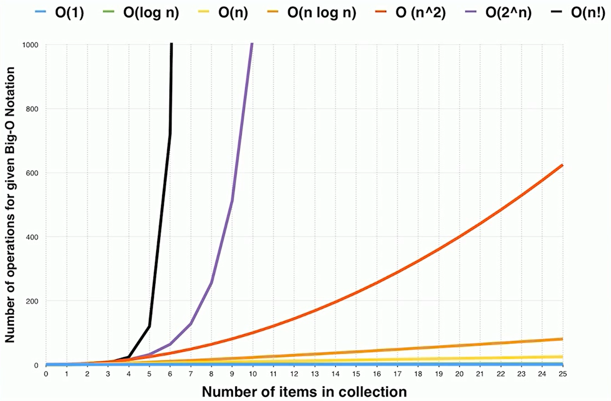
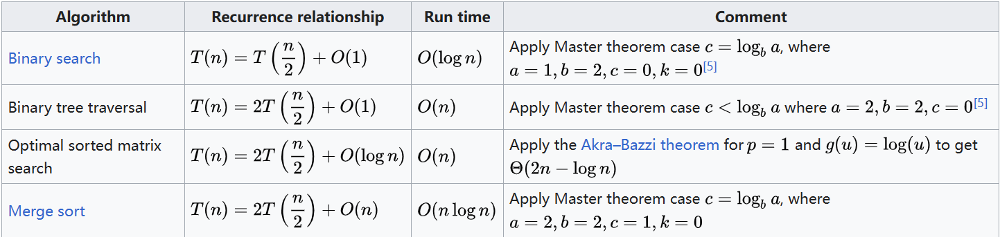

# 2.复杂度分析

# 1.常用工具配置

## 1.1 电脑设置

-   Google
-   Mac：iTerm2 + zsh (or my zsh)
-   Windows :&#x20;
-   VsCode :&#x20;

    [VS Code Themes](https://vscodethemes.com/ "VS Code Themes")

    [炫酷的VS Code毛玻璃效果 - 掘金 (juejin.cn)](https://juejin.cn/post/6844903846871842823 "炫酷的VS Code毛玻璃效果 - 掘金 (juejin.cn)")
-   LeetCode plugin (VsCode)

## 1.2 Code Style

## 1.3 LeetCode

-   国内版：刷题联系
-   国际版：最高票的题解，

## 1.4 指法操作

-   `ctrl+left/right`：选择单词
-   IDE自动补全
-   Top tips for \<IDE-name>

## 1.5自定向下的编程方式

[Clean Code: Book Review | Mark Needham (markhneedham.com)](https://www.markhneedham.com/blog/2008/09/15/clean-code-book-review/ "Clean Code: Book Review | Mark Needham (markhneedham.com)")

> The best idea in this book for me was the **newspaper metaphor** that is mentioned with regards to formatting your code. This describes the idea of making code read like a newspaper article. We should be able to get a general idea of how it works near the top of the class before reading more and more details further down. This can be achieved by breaking the code out into lots of small methods. It was strange how involved I got with the newspaper metaphor. Having read about it early on I started looking at all code after that to be in that format and when it wasn’t (when showing examples of not such clean code) I became disappointed.

最开始，思考大的逻辑，而不是细节；以高层次主干逻辑为主

例题：[125. 验证回文串 - 力扣（LeetCode）](https://leetcode.cn/problems/valid-palindrome/description/ "125. 验证回文串 - 力扣（LeetCode）")

```c++
class Solution {
public:
    bool isPalindrome(string s) {
        // 高层次（主干）逻辑
        // 1. filter out number & char  2. reverse and compare

        // 过滤
        std::string filtered_str = this->filter_number_char(s);

        std::string reverse_str = this->reverse_str(filtered_str);

        return filtered_str == reverse_str;

    }
private:
    std::string filter_number_char(std::string s) {
        std::string filter_str;
        for (auto ch : s) {
            if (isalnum(ch)) {
                filter_str += tolower(ch);
            }
        }

        return filter_str;
    }

    std::string reverse_str(std::string s) {
        std::string rever_str(s.rbegin(), s.rend());
        return rever_str;
    }
};
```

# 2.时间复杂度和空间复杂度

[如何理解算法时间复杂度的表示法，例如 O(n²)、O(n)、O(1)、O(nlogn) 等？ - 知乎 (zhihu.com)](https://www.zhihu.com/question/21387264 "如何理解算法时间复杂度的表示法，例如 O(n²)、O(n)、O(1)、O(nlogn) 等？ - 知乎 (zhihu.com)")

## 2.1 Big O notation

-   $O(1)$ : Constant Complexity 常数复杂度
-   $O(log n)$ : Logarithmic Complexity 对数复杂度
-   $O(n)$ : Linear Complexity 线性时间复杂度
-   $O(n^2)$ : N square Complexity 平方
-   $O(n^3)$ : N square Complexity 立方
-   $O(2^n)$ : Exponential Growth 指数
-   $O(n!)$ : Factorial 阶乘

注意 : 只看最高复杂度的运算

#### $O(1)$

```c++
int n = 1000;
std::cout << "Hey - you input is: " + n << std::endl;
```

```c++
int n = 1000;
std::cout << "Hey - you input is: " + n << std::endl;
std::cout << "Hmm... I'm doing more stuff with: " + n << std::endl;
std::cout << "And more: " + n << std::endl;

```

#### $O(n)$

```c++
for (int i = 1; i <= n; i++) {
  std::cout << "Hey - I'm busy looking at: " + i << std::endl;
}
```

#### $O(n^2)$

```c++
for (int i = 1; i <= n; i++) {
  for (int j = 1; j <= n; j++) {
    std::cout << "Hey - I'm busy looking at: " + i + "and " + j << std::endl;
  }
}
```

#### $O(log ~ n)$

```c++
for (int i = 1; i < n; i = i * 2) {
  std::cout << "Hey - I'm busy looking at: " + i << std::endl;
}
```

#### $O(k^n)$

```c++
int fib(int n) {
  if (n > 2) return n;
  return fib(n - 1) + fib(n - 2);
}
```

## 2.2 时间复杂度曲线



-   对自己写的程序的时间复杂度和空间复杂度有所了解；
-   用最简洁的时间和空间复杂度完成是顶尖选手的职业素养。

## 2.2 计算 1+2+3+... + n

#### 方法一：从1到n循环累加 `O(n)`

```c++
y = 0
for i = 1 to n:
    y += i

```

#### 方法二：求和公式 $sum=n(n+1)/2$ `O(1)`

```c++
y = n * (n + 1) / 2
```

## 2.3 递归

画出递归树

题目：Fib : 0, 1, 1, 2, 3, 5, 8, 13, 21, ..., $F(n)=F(n-1) + F(n-2)$

直接用递归，时间复杂度$O(2^n)$

```c++
int fib(int n) {
  if (n <= 2) return n;
  return fib(n - 1) + fib(n - 2);
}
```


### 主定理

[Master theorem (analysis of algorithms) - Wikipedia](https://en.wikipedia.org/wiki/Master_theorem_\(analysis_of_algorithms\) "Master theorem (analysis of algorithms) - Wikipedia")

[主定理 - 维基百科，自由的百科全书 (wikipedia.org)](https://zh.wikipedia.org/wiki/主定理 "主定理 - 维基百科，自由的百科全书 (wikipedia.org)")

常用算法中的应用：



1.  二分查找：有序数列中，查找目标树；时间复杂度 $O(log n)$
2.  二叉树遍历：时间复杂度 $O(n)$，每次一分为二，以相等的时间复杂度下去；二叉树遍历，每个节点仅访问一次，所以时间复杂度为$O(n)$
3.  排序后的二维矩阵中查找：$O(n)$
4.  归并排序：$O(nlog~n)$

## 2.4 思考题

1、二叉树遍历：前序、中序、后序遍历的时间复杂度？

> 每个节点只访问一次，线性正比于节点数，所以为$O(n)$

2、图的遍历：时间复杂度？

> 每个节点只访问一次，线性正比于节点数，所以为$O(n)$

3、搜索算法：DFS、BFS时间复杂度？

> 每个节点只访问一次，线性正比于节点数，所以为$O(n)$

4、二分查找：时间复杂度？

> 时间复杂度 $O(log n)$
