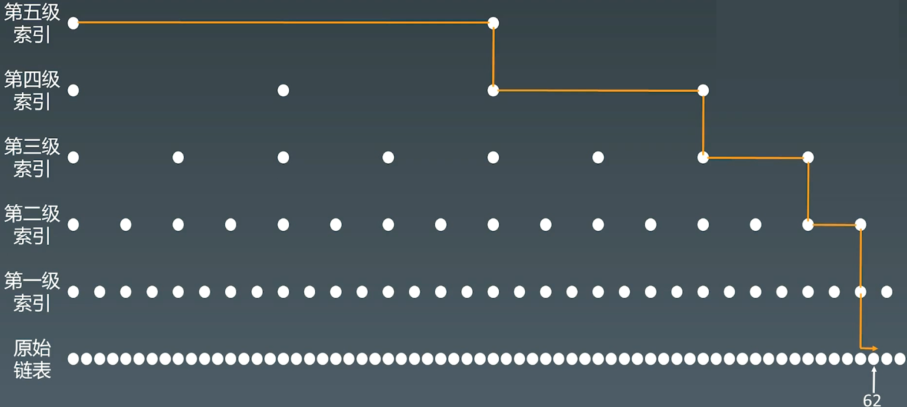
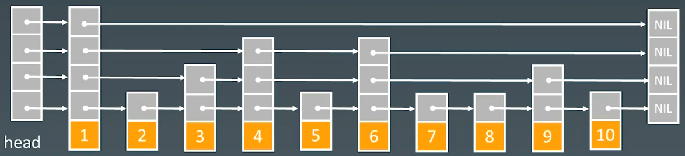

# 3.数组、链表、跳表

# 1.基本实现和特性

## 1.1 数组

-   [Java 源码分析（ArrayList）](http://developer.classpath.org/doc/java/util/ArrayList-source.html "Java 源码分析（ArrayList）")

内存中，一段连续的地址，可以通过内存管理器直接访问，时间复杂度为$O(1)$，访问时间比较快；

增加删除元素比较麻烦，时间复杂度为 $O(n)$

## 1.2 链表

-   [Linked List 的标准实现代码](http://www.geeksforgeeks.org/implementing-a-linked-list-in-java-using-class/ "Linked List 的标准实现代码")
-   [Linked List 示例代码](<http://www.cs.cmu.edu/~adamchik/15-121/lectures/Linked Lists/code/LinkedList.java> "Linked List 示例代码")
-   [Java 源码分析（LinkedList）](http://developer.classpath.org/doc/java/util/LinkedList-source.html "Java 源码分析（LinkedList）")
-   LRU Cache - Linked list： [LRU 缓存机制](http://leetcode-cn.com/problems/lru-cache "LRU 缓存机制")


-   增加删除结点时间复杂度：$O(1)$
-   访问结点时间复杂度：$O(n)$

## 1.3 跳表 SkipList

-   Redis - Skip List：[跳跃表](http://redisbook.readthedocs.io/en/latest/internal-datastruct/skiplist.html "跳跃表")
-   [为啥 Redis 使用跳表（Skip List）而不是使用 Red-Black？](http://www.zhihu.com/question/20202931 "为啥 Redis 使用跳表（Skip List）而不是使用 Red-Black？")

主要在Redis中使用

链表的缺陷：访问时间复杂度比较高 $O(n)$

给链表进行加速中心思想：**升维（空间换时间）**

跳表：**索引**，增加索引，链表next速度为1，一级索引速度为2，二级索引速度为4，


实际使用中，可以增加多级索引，实际增加 $log~2n$级索引



#### 跳表查询的时间复杂度 $O(logn)$

n/2, n/4, n/8, 第k级索引结点的个数就是 $n/(2^k)$

假设索引有h级，最高级的索引有2个结点。$n(2^h)=2$，从而求得$h=log2(n)-1$


#### 现实中跳表的形态

-   维护成本比较高，
-   增加和删除的时间复杂度 $O(logn)$



#### 跳表空间复杂度$O(n)$

# 2.例题

## 2.1零移动

[https://leetcode.cn/problems/move-zeroes/description/](https://leetcode.cn/problems/move-zeroes/description/ "https://leetcode.cn/problems/move-zeroes/description/")

```bash
给定一个数组 nums，编写一个函数将所有 0 移动到数组的末尾，同时保持非零元素的相对顺序。

请注意 ，必须在不复制数组的情况下原地对数组进行操作。
```

```c++
class Solution {
public:
    // 用一个指针，记录0元素的位置，每次循环到非零元素，
    // 将非零元素放置到记录0元素的位置，并移动记录0元素位置指针
    void moveZeroes(vector<int>& nums) {
        // j 记录每次循环中的非零元素下标
        int j = 0;
        for (int i = 0; i < nums.size(); i++) {
            if (nums[i] != 0) {
                nums[j] = nums[i];
                // 处理最后一个数
                if (i != j) {
                    nums[i] = 0;
                }
                j++;
            }
        }
    }

    void moveZeroes_swap(vector<int>& nums) {
        // j 记录每次循环中的非零元素下标
        int j = 0;
        for (int i = 0; i < nums.size(); i++) {
            if (nums[i] != 0) {
                int tmp = nums[j];
                nums[j] = nums[i];
                nums[i] = tmp;
                j++;
            }
        }
    }
};
```

## 2.2 盛水最多的容器

[11. 盛最多水的容器 - 力扣（LeetCode）](https://leetcode.cn/problems/container-with-most-water/description/ "11. 盛最多水的容器 - 力扣（LeetCode）")

```bash
给定一个长度为 n 的整数数组 height 。有 n 条垂线，第 i 条线的两个端点是 (i, 0) 和 (i, height[i]) 。

找出其中的两条线，使得它们与 x 轴共同构成的容器可以容纳最多的水。

返回容器可以储存的最大水量。

说明：你不能倾斜容器。
```

```c++
class Solution {
public:
    // 1.枚举： left bar x, right bar y, (x-y)*height_diff
    // 超出时间限制
    // O(n^2)
    int maxArea1(vector<int>& height) {
        int max_water = 0;
        for (int i = 0; i < height.size() - 1; i++) {
            for (int j = i + 1; j < height.size(); j++) {
                int tmp = std::min(height[i], height[j]) * (j - i);
                max_water = std::max(max_water, tmp);
            }
        }

        return max_water;
    }

    // 2.双指针
    // left和right两个指针，那么bar的高度小，那个往里面移动
    // O(n)
    int maxArea2(vector<int>& height) {
        int left = 0;
        int right = height.size() - 1;
        int max_water = 0;

        while(left < right) {
            int tmp = std::min(height[left], height[right]) * (right - left);
            max_water = tmp > max_water ? tmp : max_water;

            if (height[left] < height[right]) {
                left++;
            } else {
                right--;
            }
        }

        return max_water;
    }
    // 另一种双指针简单的写法
    int maxArea(vector<int>& height) {
        int max_water = 0;
        for (int i = 0, j = height.size() - 1; i < j; ) {
            int min_height = height[i] < height[j] ? height[i ++] : height[j --];
            max_water = std::max(max_water, (j - i + 1) * min_height);
        }

        return max_water;
    }

};
```

## 2.3 爬楼梯

[70. 爬楼梯 - 力扣（LeetCode）](https://leetcode.cn/problems/climbing-stairs/description/?utm_source=LCUS\&utm_medium=ip_redirect\&utm_campaign=transfer2china "70. 爬楼梯 - 力扣（LeetCode）")

```bash
假设你正在爬楼梯。需要 n 阶你才能到达楼顶。

每次你可以爬 1 或 2 个台阶。你有多少种不同的方法可以爬到楼顶呢？
```

```c++

// 1 : 1
// 2 : 2
// 3 : f(1) + f(2)
// 4 : f(2) + f(3)
// n : f(n) = f(n-1) + f(n-2)
class Solution {
public:
    int climbStairs(int n) {
        if (n <= 2) {
            return n;
        }

        int f1 = 1;
        int f2 = 2;
        int f3 = 3;

        for (int i = 3; i <= n; i++) {
            f3 = f1 + f2;
            f1 = f2;
            f2 = f3;
        }

        return f3;
    }
};
```

## 2.4 三数之和

[15. 三数之和 - 力扣（LeetCode）](https://leetcode.cn/problems/3sum/description/ "15. 三数之和 - 力扣（LeetCode）")

```bash
给你一个整数数组 nums ，判断是否存在三元组 [nums[i], nums[j], nums[k]] 满足 i != j、i != k 且 j != k ，同时还满足 nums[i] + nums[j] + nums[k] == 0 。请

你返回所有和为 0 且不重复的三元组。

注意：答案中不可以包含重复的三元组。
```

```c++
```
