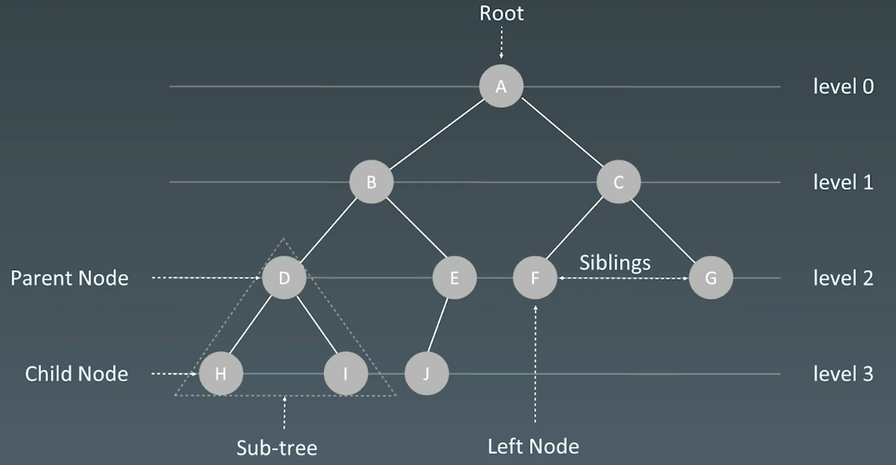

# 6.树

# 1.树

## 1.1 树的概念

树和图的区别：有没有环；

Linked List是特殊化的Tree；Tree是特殊化的Graph



## 1.2 二叉树

结点定义

```python
class TreeNode:
  def __init__(self, val):
    self.val = val
    self.left, self.right = None, None

```

```c++
struct TreeNode {
  int val;
  TreeNode* left;
  TreeNode* right;
  TreeNode(int x) : val(x), left(NULL), right(NULL) {}
}
```

```java
public class TreeNode {
  public int val;
  public TreeNode left, right;
  public TreeNode(int val) {
    this.val = val;
    this.left = null;
    this.right = null;
  }
}
```

## 1.3 二叉树的遍历

-   前序（pre-order）：根 → 左 → 右
-   中序（in-order）：左 → 根 → 右
-   后序（post-order）：左 → 右 → 根

```python
def preorder(self, root):
  if root:
    self.traverse_path.append(root, val)
    self.preorder(root.left)
    self.preorder(root.right)

```

```python
def inorder(self, root):
  if root:
    self.inorder(root.left)
    self.traverse_path.append(root, val)
    self.inorder(root.right)
```

```python
def postorder(self, root):
  if root:
    self.postorder(root.left)
    self.postorder(root.right)
    self.traverse_path.append(root, val)
```

## 1.4 二叉搜索树 Binary Search Tree

-   [二叉搜索树 Demo](https://visualgo.net/zh/bst "二叉搜索树 Demo")

二叉搜索树，也称二叉搜索树、有序二叉树 (Ordered Binary Tree) 、排序二叉树 (Sorted Binary Tree) ，是指一棵空树或者具有下列性质的二又树:

1.  左子树上**所有结点**的值均小于它的根结点的值
2.  右子树上**所有结点**的值均大于它的根结点的值
3.  以此类推: 左、右子树也分别为二又查找树。(这就是 重复性!)

中序遍历：升序排列

-   查询、删除、插入：$O(log~n)$

# 2.示例

## 2.1 前序遍历

```c++
class Solution {
public:
    vector<int> preorderTraversal1(TreeNode* root) {
        std::vector<int> ans;
        this->preorder(root, ans);

        return ans;
    }

    vector<int> preorderTraversal(TreeNode* root) {
        std::vector<int> ans;
        
        if (root == nullptr) {
            return ans;
        }

        std::stack<TreeNode*> stack;

        while (!stack.empty() || root != nullptr) {
            while (root != nullptr) {
                ans.emplace_back(root->val);
                stack.push(root);
                root = root->left;
            }

            root = stack.top();
            stack.pop();

            root = root->right;
        }

        return ans;
    }

private:
    void preorder(TreeNode* root, std::vector<int>& ans) {
        if (!root) {
            return;
        }
        ans.push_back(root->val);
        this->preorder(root->left, ans);
        this->preorder(root->right, ans);
    }
};
```

## 2.2 中序遍历

```c++
class Solution {
public:
    // 1.递归
    vector<int> inorderTraversal1(TreeNode* root) {
        std::vector<int> ans;
        this->inorder(root, ans);

        return ans;
    }

    // 2.手动维护栈
    vector<int> inorderTraversal(TreeNode* root) {
        std::vector<int> ans;

        if (root == nullptr) {
            return ans;
        }
        
        std::stack<TreeNode*> stack;

        while (root != nullptr || !stack.empty()) {
            // 左子树加入栈
            while (root != nullptr) {
                stack.push(root);
                root = root->left;
            }

            // 栈中取出
            root = stack.top();
            stack.pop();
            ans.push_back(root->val);

            // 遍历右子树
            root = root->right;
        }

        return ans;
    }

private:
    void inorder(TreeNode* root, std::vector<int>& ans) {
        if (!root) {
            return;
        }
        this->inorder(root->left, ans);
        ans.push_back(root->val);
        this->inorder(root->right, ans);
    }
};
```

## 2.3 后序遍历

```c++
class Solution {
public:
    vector<int> postorderTraversal1(TreeNode* root) {
        std::vector<int> ans;
        this->postorder(root, ans);

        return ans;
    }

    vector<int> postorderTraversal(TreeNode* root) {
        std::vector<int> ans;
        
        if (root == nullptr) {
            return ans;
        }

        std::stack<TreeNode*> stack;
        TreeNode* prev = nullptr;

        while (!stack.empty() || root != nullptr) {
            while (root != nullptr) {
                stack.push(root);
                root = root->left;
            }

            root = stack.top();
            stack.pop();

            if (root->right == nullptr || root->right == prev) {
                ans.emplace_back(root->val);
                prev = root;
                root = nullptr;
            } else {
                stack.push(root);
                root = root->right;
            }
        }

        return ans;
    }

private:
    void postorder(TreeNode* root, std::vector<int>& ans) {
        if (!root) {
            return;
        }
        this->postorder(root->left, ans);
        this->postorder(root->right, ans);
        ans.push_back(root->val);
    }
};
```
