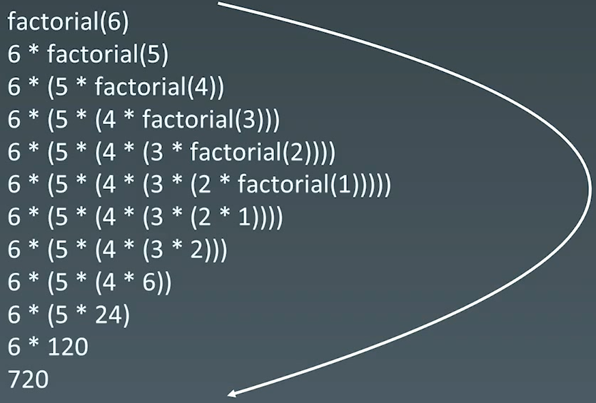

# 7.递归

递归 - 循环：通过函数体来进行循环

**重复性**

# 1.递归：盗梦空间

## 1.1 特点

-   向下进入到不同梦境；向上又回到原来的一层；
-   通过声音同步回到上一层
-   每一层的环境和周围的人都是一份拷贝、主角等几人穿越不同层级的梦境（发生和携带变化）

## 1.2 计算 n!

```python
def Factorial(n):
  if n <= 1:
    return 1
  return n * Factorial(n - 1)

```

递归栈



## 1.3 递归代码模板

```python
def recursion(level, param1, param2, ...):
  # 1.recursion terminator (递归终止条件)
  if level > MAX_LeVEL:
    process_result
    return

  # 2.process logic in current level (处理当前层逻辑)
  process(level, data, ...)
  
  # 3.drill down (下探到下一层)
  self.recursion(level + 1, p1, ...)
  
  # 4.reverse the current level status if needed (清理当前层)
```

## 1.4 思维要点

1.  不要人肉递归（最大误区）
2.  找到最近最简方法，将其拆解成课重复解决的问题（重复子问题）
3.  数学归纳法思维 (n=1, n=2成立，若n成立，能推到出n+1成立)

# 2.习题

## 2.1 爬楼梯

[https://leetcode.cn/problems/climbing-stairs/](https://leetcode.cn/problems/climbing-stairs/ "https://leetcode.cn/problems/climbing-stairs/")

```c++
class Solution {
public:
    // 1 : 1
    // 2 : 2
    // f(1) + f(2)
    // f(2) + f(3)

    // f(n) = f(n-1) + f(n-2)
    int climbStairs(int n) {
        if (n <= 2) {
            return n;
        }

        int f1 = 1;
        int f2 = 2;
        int f3 = 3;

        for (int i = 3; i <= n; i++) {
            f3 = f1 + f2;
            f1 = f2;
            f2 = f3;
        }

        return f3;
    }
};
```

## 2.2 生成括号

[https://leetcode.cn/problems/generate-parentheses](https://leetcode.cn/problems/generate-parentheses "https://leetcode.cn/problems/generate-parentheses")

```c++
class Solution {
public:
    // 递归
    // 左括号: 随时加，只要不超标
    // 右括号 : 必须之前有左括号，且左括号个数 > 右括号个数
    vector<string> generateParenthesis(int n) {
        result.clear();
        rhis->_generate(0, 0, n, "");
        return result;
    }

    void _generate(int left, int right, int num, std::string s) {
        // 1.terminator
        if (left == num && right == num) {
            result.emplace_back(s);
            // std::cout << s << std::endl;
            return;
        }

        // 2.process current logic

        // 3.drill down
        if (left < num)
            this->_generate(left + 1, right, num, s + "(");
        
        if (left > right)
            this->_generate(left, right + 1, num, s + ")");

        // 4.reverse states
    }
private:
    std::vector<std::string> result;
};
```

## 2.3 验证二叉搜索树

[98. 验证二叉搜索树 - 力扣（LeetCode）](https://leetcode.cn/problems/validate-binary-search-tree/ "98. 验证二叉搜索树 - 力扣（LeetCode）")

```c++
// 给你一个二叉树的根节点 root ，判断其是否是一个有效的二叉搜索树。

// 有效 二叉搜索树定义如下：

// 节点的左子树只包含 小于 当前节点的数。
// 节点的右子树只包含 大于 当前节点的数。
// 所有左子树和右子树自身必须也是二叉搜索树。

class Solution {
public:
    // BST --> 中序遍历是递增的
    bool isValidBST(TreeNode* root) {
        if (root == nullptr) {
            return true;
        }

        // 遍历左子树
        if (!this->isValidBST(root->left)) {
            return false;
        }

        // 当前结点不大于父节点，不是排序二叉树
        if (root->val <= m_last) {
            return false;
        } else {
            // 记录父节点值
            m_last = root->val;
        }
        // 遍历右子树
        if (!this->isValidBST(root->right)) {
            return false;
        }

        // 子树遍历完成，或者不是二叉排序树，退出
        return true;
    }
private:
    // 用于存储最新遍历的父亲结点值
    long m_last = LONG_MIN;
};
```

## 2.4 二叉树最大深度

[104. 二叉树的最大深度 - 力扣（LeetCode）](https://leetcode.cn/problems/maximum-depth-of-binary-tree/description/ "104. 二叉树的最大深度 - 力扣（LeetCode）")

```c++
class Solution {
public:
    // 左子树和左子树最大深度 + 1
    int maxDepth(TreeNode* root) {
        if (!root) {
            return 0;
        }

        return std::max(maxDepth(root->left), maxDepth(root->right)) + 1;
    }
};
```

## 2.5 二叉树的最小深度

[111. 二叉树的最小深度 - 力扣（LeetCode）](https://leetcode.cn/problems/minimum-depth-of-binary-tree/description/ "111. 二叉树的最小深度 - 力扣（LeetCode）")

```bash
给定一个二叉树，找出其最小深度。
最小深度是从根节点到最近叶子节点的最短路径上的节点数量。
说明：叶子节点是指没有子节点的节点。
```

```c++
class Solution {
public:
    int minDepth(TreeNode* root) {
        // 当 root 为空时，返回 0
        if (!root) {
            return 0;
        }

        int deep = 0;
        int left_deep = minDepth(root->left);
        int right_deep = minDepth(root->right);
        // 当 root 节点左右孩子有一个为空时，返回不为空的孩子节点的深度
        // 当 root 节点左右孩子都不为空时，返回左右孩子较小深度的节点值
        if (!root->left || !root->right) {
            deep = left_deep + right_deep + 1;
        } else {
            deep = std::min(left_deep, right_deep) + 1;
        }

        return deep;
    }
};
```

## 2.6 二叉树的序列化和反序列化

[297. 二叉树的序列化与反序列化 - 力扣（LeetCode）](https://leetcode.cn/problems/serialize-and-deserialize-binary-tree/description/ "297. 二叉树的序列化与反序列化 - 力扣（LeetCode）")

```bash
序列化是将一个数据结构或者对象转换为连续的比特位的操作，进而可以将转换后的数据存储在一个文件或者内存中，同时也可以通过网络传输到另一个计算机环境，采取相反方式重构得到原数据。

请设计一个算法来实现二叉树的序列化与反序列化。这里不限定你的序列 / 反序列化算法执行逻辑，你只需要保证一个二叉树可以被序列化为一个字符串并且将这个字符串反序列化为原始的树结构。

提示: 输入输出格式与 LeetCode 目前使用的方式一致，详情请参阅 LeetCode 序列化二叉树的格式。你并非必须采取这种方式，你也可以采用其他的方法解决这个问题。
```

```c++
class Codec {
public:

    // Encodes a tree to a single string.
    string serialize(TreeNode* root) {
        std::string ans;
        this->pre_order(root, ans);
        return ans;
    }

    // 先序遍历输出
    void pre_order(TreeNode* root, std::string& str) {
        if (root == nullptr) {
            str += "None,";
            return;
        }
        str += std::to_string(root->val) + ",";
        this->pre_order(root->left, str);
        this->pre_order(root->right, str);

    }

    // Decodes your encoded data to tree.
    TreeNode* deserialize(string data) {
        std::list<std::string> data_array;
        std::string str;
        // 将字符串分割，存在list中
        for (auto& ch : data) {
            if (ch == ',') {
                data_array.push_back(str);
                str.clear();
            } else {
                str.push_back(ch);
            }
        }

        // 处理最后一个
        if (!str.empty()) {
            data_array.push_back(str);
            str.clear();
        }

        // 先序遍历创建树
        return this->pre_create_tree(data_array);
    }

    // 先序遍历创建树，创建一棵树
    TreeNode* pre_create_tree(std::list<std::string>& data_array) {
        // 如果碰到 None 返回
        if (data_array.front() == "None") {
            data_array.erase(data_array.begin());
            return nullptr;
        }

        // 新建结点
        TreeNode* root = new TreeNode(std::stoi(data_array.front().c_str()));
        data_array.erase(data_array.begin());

        // 创建左子树
        root->left = this->pre_create_tree(data_array);
        // 创建右子树
        root->right = this->pre_create_tree(data_array);

        return root;
    }
};

```

## 2.7 公共祖先

[236. 二叉树的最近公共祖先 - 力扣（LeetCode）](https://leetcode.cn/problems/lowest-common-ancestor-of-a-binary-tree/description/ "236. 二叉树的最近公共祖先 - 力扣（LeetCode）")

```bash
给定一个二叉树, 找到该树中两个指定节点的最近公共祖先。

百度百科中最近公共祖先的定义为：“对于有根树 T 的两个节点 p、q，最近公共祖先表示为一个节点 x，满足 x 是 p、q 的祖先且 x 的深度尽可能大（一个节点也可以是它自己的祖先）。”
```

```c++
class Solution {
public:
    TreeNode* lowestCommonAncestor(TreeNode* root, TreeNode* p, TreeNode* q) {
        TreeNode* father = nullptr;
        this->dfs(root, p, q, father);

        return father;
    }
private:
    bool dfs(TreeNode* root, TreeNode* p, TreeNode* q, TreeNode*& father) {
        // 到达叶子结点，返回false
        if (root == nullptr) {
            return false;
        }

        // 搜索左右子树是否是公共根节点
        bool left = dfs(root->left, p, q, father);
        bool right = dfs(root->right, p, q, father);

        // 判断条件
        // 1.左子树存在 p 或 q，右子树存在p或q，则此结点是公共祖先
        // 2.左子树或右子树其中一方存在p和q，另一方没有，那这个结点就是公共祖先
        if ((left && right) || ((root->val == p->val || root->val == q->val) && (left || right))) {
            father = root;
        }

        // 公共祖先条件
        return left || right || (root->val == p->val || root->val == q->val);
    }
};
```

## 2.8 先序中序遍历构造树

[105. 从前序与中序遍历序列构造二叉树 - 力扣（LeetCode）](https://leetcode.cn/problems/construct-binary-tree-from-preorder-and-inorder-traversal/description/ "105. 从前序与中序遍历序列构造二叉树 - 力扣（LeetCode）")

```bash
给定两个整数数组 preorder 和 inorder ，其中 preorder 是二叉树的先序遍历， inorder 是同一棵树的中序遍历，请构造二叉树并返回其根节点。
```

一颗树的先序序列和中序序列能确定这棵树。

-   先序序列：根，左，右
-   中序序列：左，根，右
-   后序序列：左，右，根

**表示子树不存在：**

-   序列长度为零，代表子树不存在
-   给定起始位置索引和终止位置索引。起始位置和终止位置不合法，也就是终止位置大于起始位置来代表序列不存在，即代表字数不存在

```c++
class Solution {
public:
    TreeNode* buildTree(vector<int>& preorder, vector<int>& inorder) {
        return this->pre_inorder_build_tree(preorder, 0, preorder.size() - 1, inorder, 0, inorder.size() - 1);
    }

private:
    TreeNode* pre_inorder_build_tree(std::vector<int>& preorder, int pre_start_idx, int pre_end_idx,
                                    std::vector<int>& inorder, int in_start_idx, int in_end_idx) {
        if (pre_start_idx > pre_end_idx) {
            return nullptr;
        }

        // 创建根节点，根节点的值使用前序遍历的第一个
        TreeNode* root = new TreeNode(preorder[pre_start_idx]);

        // 在中序遍历中找到根节点，划分为两个数组，分别是左右子树的，
        int root_idx = in_start_idx;
        for (; root_idx <= in_end_idx; root_idx++) {
            if (root->val == inorder[root_idx]) {
                break;
            }
        }

        // 左子树的长度
        int left_lens = root_idx - in_start_idx;

        // 创建左子树
        root->left = this->pre_inorder_build_tree(preorder, pre_start_idx + 1, pre_start_idx + left_lens, 
                                                  inorder, in_start_idx, root_idx - 1);
        // 创建右子树
        root->right = this->pre_inorder_build_tree(preorder, pre_start_idx + left_lens + 1, pre_end_idx, 
                                                  inorder, root_idx + 1, in_end_idx);

        return root;
    }
};
```

## 2.9 组合

[77. 组合 - 力扣（LeetCode）](https://leetcode.cn/problems/combinations/description/ "77. 组合 - 力扣（LeetCode）")

```bash
给定两个整数 n 和 k，返回范围 [1, n] 中所有可能的 k 个数的组合。
你可以按 任何顺序 返回答案。
```

```c++
class Solution {
public:
    vector<vector<int>> combine(int n, int k) {
        std::vector<std::vector<int>> ans;
        this->dfs(1, n, k, ans);
        return ans;
    }

private:
    void dfs(int curr, int n, int k, std::vector<std::vector<int>>& ans) {
        // 终止条件
        // tmp长度加上区间[cur, n]的长度小于k，不可能构造出长度k的tmp
        if (m_tmp.size() + (n - curr + 1) < k) {
            return;
        }
        // 记录合法的答案
        if (m_tmp.size() == k) {
            ans.push_back(m_tmp);
            return;
        }

        // 处理当前层
        m_tmp.push_back(curr);
        this->dfs(curr + 1, n, k, ans);
        m_tmp.pop_back();
        this->dfs(curr + 1, n, k, ans);
    }

    std::vector<int> m_tmp;
};
```
