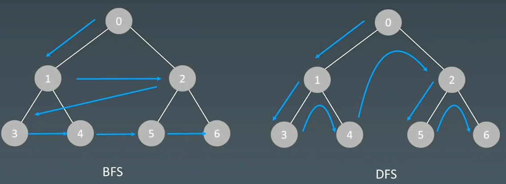

# 9.深度优先、广度优先

# 1.搜索

## 1.1 遍历搜索

在树（图/状态集）中虚招特定结点

-   每个结点都要访问一次
-   每个结点仅仅要访问一次
-   对于结点的访问顺序不同，分为DFS，BFS


## 1.2 深度优先搜索 (Depth First Search)


示例代码：

```python
def dfs (node):
  if node in visited:
    # already visited
    return 
    
  visited.add(node)
  
  # process current node
  # ...
  dfs(node.left)
  dfs(node.right)

```

递归写法

```python
visited = set()

def dfs(node, visited):
  visited.add(node)
  
  # process currend node here
  ...
  
  for next_node in node.children():
    if not next_node in visited:
      dfs(next_node, visited)

```

非递归写法

```python
def dfs(self, tree):
  if tree.root is None:
    return []
  visited, stack = [], [tree.root]
  
  while stack:
    node = stack.pop()
    visited.add(node)
    
    process(node)
    nodes = generate_related_nodes(node)
    stack.push(nodes)
    
  # other processing work
  ...

```

C++代码示例

```c++
// 递归写法
map<int, int> visited;
void dfs(Node* root) {
    // terminator
    if (!root) 
        return ;
        
    if (visited.count(root->val)) {
        // already visited
        return ;
    }
    visited[root->val] = 1;
    
    // process current node here.
    ...
    
    for (int i = 0; i < root->children.size(); ++i) {
        dfs(root->children[i]);
    }
    
    return ;
}


//非递归写法：
void dfs(Node* root) {
    map<int, int> visited;
    if(!root) 
        return ;
        
    stack<Node*> stackNode;
    stackNode.push(root);
    
    while (!stackNode.empty()) {
        Node* node = stackNode.top();
        stackNode.pop();
        if (visited.count(node->val)) 
            continue;
        visited[node->val] = 1;
        
        for (int i = node->children.size() - 1; i >= 0; --i) {
            stackNode.push(node->children[i]);
        }
    }
    return ;
}
```

## 1.3 广度优先搜索 (Breadth First Search)

BFS与DFS对比



BFS示例代码

```python
def bfs(graph, start, end):
  
  queue = []
  queue.append([start])
  visited.add(start)
  
  while queue:
    node = queue.pop()
    visited.add(node)
    
    process(node)
    nodes = generate_related_nodes(node)
    queue.push(nodes)
    
  # other processing work
  ...

```

C++代码

```c++
void bfs(Node* root) 
{
    map<int, int> visited;
    if(!root) 
        return ;
        
    queue<Node*> queueNode;
    queueNode.push(root);
    
    while (!queueNode.empty())  {
        Node* node = queueNode.top();
        queueNode.pop();
        if (visited.count(node->val)) 
            continue;
        visited[node->val] = 1;
        
        for (int i = 0; i < node->children.size(); ++i)  {
            queueNode.push(node->children[i]);
        }
    }
    
    return ;
}
```

# 2.示例题目

## 2.1 二叉树层序遍历

[102. 二叉树的层序遍历 - 力扣（LeetCode）](https://leetcode.cn/problems/binary-tree-level-order-traversal/description/ "102. 二叉树的层序遍历 - 力扣（LeetCode）")

```bash
给你二叉树的根节点 root ，返回其节点值的 层序遍历 。 （即逐层地，从左到右访问所有节点）。

```

```c++
// 1.BFS
// 2.DFS， 遍历时，增加深度信息，最后输出按照深度来分类
class Solution {
public:
    // 1.BFS
    vector<vector<int>> levelOrder1(TreeNode* root) {
        std::vector<std::vector<int>> ans;
        if (root == nullptr) {
            return ans;
        }

        std::queue<TreeNode*> queue;
        queue.push(root);
        TreeNode* node = nullptr;

        while (!queue.empty()) {
            std::vector<int> level_node;
            int node_count = queue.size();
            for (int i = 0; i < node_count; i++) {
                node = queue.front();
                queue.pop();
                level_node.push_back(node->val);

                if (node->left) {
                    queue.push(node->left);
                }

                if (node->right) {
                    queue.push(node->right);
                }
            }
            ans.push_back(std::move(level_node));
        }

        return ans;
    }

    // DFS
    vector<vector<int>> levelOrder(TreeNode* root) {
        std::vector<std::vector<int>> ans;
        if (root == nullptr) {
            return ans;
        }

        this->dfs(root, 0, ans);

        return ans;
    }
private:
    void dfs(TreeNode* root, int depth, std::vector<std::vector<int>>& ans) {
        if (root == nullptr) {
            return;
        }

        // 说明该添加下一层了
        if (depth >= ans.size()) {
            ans.push_back(std::vector<int>{});
        }
        ans[depth].push_back(root->val);

        this->dfs(root->left, depth + 1, ans);
        this->dfs(root->right, depth + 1, ans);
    }
};
```

## 2.2 最小基因变化

[433. 最小基因变化 - 力扣（LeetCode）](https://leetcode.cn/problems/minimum-genetic-mutation/ "433. 最小基因变化 - 力扣（LeetCode）")

```bash
基因序列可以表示为一条由 8 个字符组成的字符串，其中每个字符都是 'A'、'C'、'G' 和 'T' 之一。

假设我们需要调查从基因序列 start 变为 end 所发生的基因变化。一次基因变化就意味着这个基因序列中的一个字符发生了变化。

例如，"AACCGGTT" --> "AACCGGTA" 就是一次基因变化。
另有一个基因库 bank 记录了所有有效的基因变化，只有基因库中的基因才是有效的基因序列。（变化后的基因必须位于基因库 bank 中）

给你两个基因序列 start 和 end ，以及一个基因库 bank ，请你找出并返回能够使 start 变化为 end 所需的最少变化次数。如果无法完成此基因变化，返回 -1 。

注意：起始基因序列 start 默认是有效的，但是它并不一定会出现在基因库中。
```

```c++
class Solution {
public:
    // BFS
    // 经过分析可知，题目要求将一个基因序列 A 变化至另一个基因序列 B，需要满足以下条件：
    // 1.序列 A 与 序列 B 之间只有一个字符不同；
    // 2.变化字符只能从 ‘A’, ‘C’, ‘G’, ‘T’中进行选择；
    // 3.变换后的序列 B 一定要在字符串数组 bank中。

    // 步骤如下：
    // 1.如果 start 与 end相等，此时直接返回 0；如果最终的基因序列不在 bank中，则此时按照题意要求，无法生成，直接返回 −1；
    // 2.首先我们将可能变换的基因 s 从队列中取出，按照上述的变换规则，尝试所有可能的变化后的基因，
    //   比如一个 AACCGGTA，我们依次尝试改变基因 s 的一个字符，并尝试所有可能的基因变化序列 s0,s1,s2,⋯ ,si,⋯ ,s23，
    //   变化一次最多可能会生成 3×8=24 种不同的基因序列。
    // 3.需要检测当前生成的基因序列的合法性 si，首先利用哈希表检测 si 是否在数组 bank 中，
    //   如果是则认为该基因合法，否则改变化非法直接丢弃；其次还需要用哈希表记录已经遍历过的基因序列，
    //   如果该基因序列已经遍历过，则此时直接跳过；如果合法且未遍历过的基因序列，则将其加入到队列中。
    // 4.如果当前变换后的基因序列与 end 相等，则此时我们直接返回最小的变化次数即可；
    //   如果队列中所有的元素都已经遍历完成还无法变成 end，则此时无法实现目标变化，返回 −1。
    int minMutation(string startGene, string endGene, vector<string>& bank) {
        std::unordered_set<std::string> cnt;
        std::unordered_set<std::string> visited;
        char keys[4] = {'A', 'C', 'G', 'T'};

        for (auto& b : bank) {
            cnt.emplace(b);
        }

        if (startGene == endGene) {
            return 0;
        }

        if (!cnt.count(endGene)) {
            return -1;
        }

        std::queue<std::string> queue;
        queue.emplace(startGene);
        int step = 1;

        while (!queue.empty()) {
            int size = queue.size();

            for (int i = 0; i < size; i++) {
                std::string curr = queue.front();
                queue.pop();

                for (int j = 0; j < 8; j++) {
                    for (int k = 0; k < 4; k++) {
                        if (keys[k] != curr[j]) {
                            std::string next = curr;
                            next[j] = keys[k];

                            if (!visited.count(next) && cnt.count(next)) {
                                if (next == endGene) {
                                    return step;
                                }
                                queue.emplace(next);
                                visited.emplace(next);
                            }
                        }
                    }
                }
            }

            step++;
        }

        return -1;
    }
};
```

## 2.3 BFS括号生成

```c++
class SolutionDFS {
public:
    // DFS
    vector<string> generateParenthesis(int n) {
        std::vector<std::string> ans;
        if (n == 0) {
            return ans;
        }

        this->dfs("", n, n, ans);

        return ans;
    }

private:
    void dfs(std::string curr_str, int left, int right, std::vector<std::string>& ans) {
        // 终止条件，
        if (left == 0 && right == 0) {
            ans.emplace_back(curr_str);
            return;
        }

        // 注意剪枝，（左括号个数严格大于右括号个数）
        if (left > right) {
            return;
        }

        if (left > 0) {
            this->dfs(curr_str + "(", left - 1, right, ans);
        }

        if (right > 0) {
            this->dfs(curr_str + "(", left, right - 1, ans);
        }
    }
};
```

```c++
// BFS实现，需要手动构造结点类
class Node {
public:
    Node (std::string str, int left, int right) {
        m_str = str;
        m_left = left;
        m_right = right;
    }

    // 当前得到的字符串
    std::string m_str;
    // 左括号剩余个数
    int m_left;
    // 右括号剩余个数
    int m_right;
};

class Solution {
public:
    // BFS
    vector<string> generateParenthesis(int n) {
        std::vector<std::string> ans;
        if (n == 0) {
            return ans;
        }

        std::queue<Node> queue;
        queue.push(Node("", n, n));

        while(!queue.empty()) {
            Node curr_node = queue.front();
            queue.pop();

            if (curr_node.m_left == 0 && curr_node.m_right == 0) {
                ans.emplace_back(curr_node.m_str);
            }

            if (curr_node.m_left > 0) {
                queue.push(Node(curr_node.m_str + "(", curr_node.m_left - 1, curr_node.m_right));
            }

            if (curr_node.m_right > 0 && curr_node.m_left < curr_node.m_right) {
                queue.push(Node(curr_node.m_str + ")", curr_node.m_left, curr_node.m_right - 1));
            }
        }

        return ans;
    }

};
```

## 2.4 岛屿数量（高频）

[200. 岛屿数量 - 力扣（LeetCode）](https://leetcode.cn/problems/number-of-islands/description/ "200. 岛屿数量 - 力扣（LeetCode）")

```bash
给你一个由 '1'（陆地）和 '0'（水）组成的的二维网格，请你计算网格中岛屿的数量。

岛屿总是被水包围，并且每座岛屿只能由水平方向和或竖直方向上相邻的陆地连接形成。

此外，你可以假设该网格的四条边均被水包围。
```

```c++
class Solution {
public:
    // 1.洪水算法(填海造陆)
    //   遍历地图，遇到一个1，将1进行BFS/DFS遍历，将周围的1全部变为0，操作一次记为1
    //   操作次数，就是岛屿的数量
    int numIslands(vector<vector<char>>& grid) {
        int island_num = 0;
        m_grid = grid;

        for (int i = 0; i < m_grid.size(); i++) {
            for (int j = 0; j < m_grid[i].size(); j++) {
                if (m_grid[i][j] == '0') {
                    continue;
                }
                // if (this->sink(i, j)) {
                //     island_num++;
                // }
                island_num += this->sink(i, j);
            }
        }

        return island_num;
    }
private:
    int sink(int i, int j) {
        if (m_grid[i][j] == '0') {
            return 0;
        }

        // i, j = "1"
        m_grid[i][j] = '0';

        for (int k = 0; k < 4; k++) {
            int x = i + m_dx[k];
            int y = j + m_dy[k];

            if (x >= 0 && x < m_grid.size() && y >= 0 && y < m_grid[i].size()) {
                if (m_grid[x][y] == '0') {
                    continue;
                }
                this->sink(x, y);
            }
        }

        return 1;
    }

    // 方向
    int m_dx[4] = {-1, 1, 0, 0};
    int m_dy[4] = {0, 0, -1, 1};

    std::vector<std::vector<char>> m_grid;
};
```

