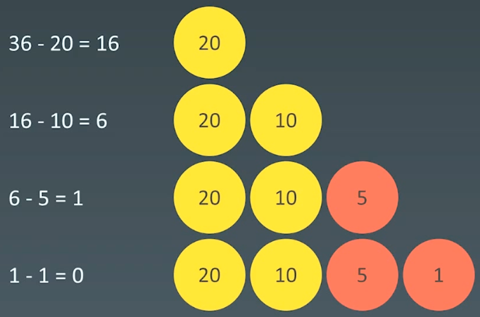
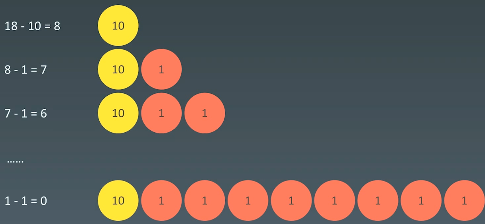

# 10.贪心算法

# 1.贪心算法

## 1.1 概念

贪心算法是一种在每一步选择中都采取在当前状态下最好或最优 (即最有利)的选择，从而希望导致结果是全局最好或最优的算法。

贪心算法与动态规划的不同在于它对每个子问题的解决方案都做出选择不能回退。动态规划则会保存以前的运算结果，并根据以前的结果对当前进行选择，有回退功能。

-   贪心：当下做局部最优判断
-   回溯：能够回退
-   动态规划：最有判断 + 回退

贪心法可以解决一些最优化问题，如: 求图中的最小生成树、求哈夫曼编码等。然而对于工程和生活中的问题，贪心法一般不能得到我们所要求的答案

一旦一个问题可以通过贪心法来解决，那么贪心法一般是解决这个问题的最好办法。由于贪心法的高效性以及其所求得的答案比较接近最优结果，贪心法也可以用作辅助算法或者直接解决一些要求结果不特别精确的问题。

## 1.2 举例：coin change

[322. 零钱兑换 - 力扣（LeetCode）](https://leetcode.cn/problems/coin-change/description/ "322. 零钱兑换 - 力扣（LeetCode）")

```bash
给你一个整数数组 coins ，表示不同面额的硬币；以及一个整数 amount ，表示总金额。

计算并返回可以凑成总金额所需的 最少的硬币个数 。如果没有任何一种硬币组合能组成总金额，返回 -1 。

你可以认为每种硬币的数量是无限的。
```

当硬币可选集合固定 : coins = \[20, 10, 5, 1]，求最少可以几个硬币拼出综述，比如 total=36



**贪心法反例**：

非整除关系的硬币，可选集合: coins=\[10, 9, 1]，求评出总数为18最少需要几个硬币？



## 1.3 适用贪心算法的场景

简单地说，**问题能够分解成子问题来解决，子问题的最优解能递推到最终问题的最优解**。这种子问题最优解称为最优子结构。

贪心算法与动态规划的不同在于它对每个子问题的解决方案**都做出选择不能回退**。**动态规划则会保存以前的运算结果，并根据以前的结果对当前进行选择，有回退功能**。

# 2.示例

## 2.1 分发饼干

[455. 分发饼干 - 力扣（LeetCode）](https://leetcode.cn/problems/assign-cookies/description/ "455. 分发饼干 - 力扣（LeetCode）")

```bash
假设你是一位很棒的家长，想要给你的孩子们一些小饼干。但是，每个孩子最多只能给一块饼干。

对每个孩子 i，都有一个胃口值 g[i]，这是能让孩子们满足胃口的饼干的最小尺寸；并且每块饼干 j，都有一个尺寸 s[j] 。如果 s[j] >= g[i]，我们可以将这个饼干 j 分配给孩子 i ，这个孩子会得到满足。你的目标是尽可能满足越多数量的孩子，并输出这个最大数值。
```

```c++
class Solution {
public:
    // 贪心算法，先排序，然后匹配两个升序的数组
    int findContentChildren(vector<int>& g, vector<int>& s) {
        int res = 0;
        if (g.size() == 0 || s.size() == 0) {
            return res;
        }

        // 排序
        std::sort(g.begin(), g.end());
        std::sort(s.begin(), s.end());

        // 遍历，匹配两个升序数组
        for (int i = 0, j = 0; i < g.size() && j < s.size(); ) {
            // 可以满足胃口，把小饼干喂给小朋友
            if (g[i] <= s[j]) {
                res++;

                i++;
                j++;
            } else {
                // 不满足胃口，查看下一块小饼干
                j++;
            }
        }

        return res;
    }
};
```

## 2.2 最佳买卖股票时机

[122. 买卖股票的最佳时机 II - 力扣（LeetCode）](https://leetcode.cn/problems/best-time-to-buy-and-sell-stock-ii/description/ "122. 买卖股票的最佳时机 II - 力扣（LeetCode）")

```bash
给你一个整数数组 prices ，其中 prices[i] 表示某支股票第 i 天的价格。

在每一天，你可以决定是否购买和/或出售股票。你在任何时候 最多 只能持有 一股 股票。你也可以先购买，然后在 同一天 出售。

返回 你能获得的 最大 利润 。
```

```c++
class Solution {
public:
    // 贪心，如果第二个数字大于第一个数字，拿获得的总利润将是最大的
    int maxProfit(vector<int>& prices) {
        int max_profit = 0;

        for (int i = 1; i < prices.size(); i++) {
            if (prices[i] > prices[i - 1]) {
                max_profit += prices[i] - prices[i - 1];
            }
        }

        return max_profit;
    }
};
```

## 2.3 跳跃游戏

[55. 跳跃游戏 - 力扣（LeetCode）](https://leetcode.cn/problems/jump-game/description/ "55. 跳跃游戏 - 力扣（LeetCode）")

```bash
给你一个非负整数数组 nums ，你最初位于数组的 第一个下标 。数组中的每个元素代表你在该位置可以跳跃的最大长度。

判断你是否能够到达最后一个下标，如果可以，返回 true ；否则，返回 false 。
```

```c++
// 2.贪心算法
// 从后往前贪心
bool canJump(vector<int>& nums) {
    if (nums.size() == 0) {
        return false;
    }

    int end_reachalbe = nums.size() - 1;
    for (int i = nums.size() - 1; i >= 0; i--) {
        if (nums[i] + i >= end_reachalbe) {
            end_reachalbe = i;
        }
    }

    return end_reachalbe == 0;
}
```
