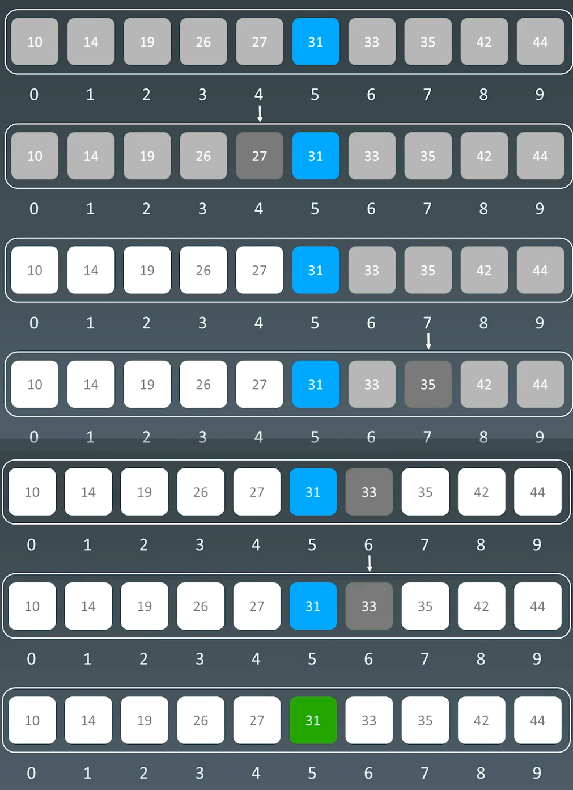
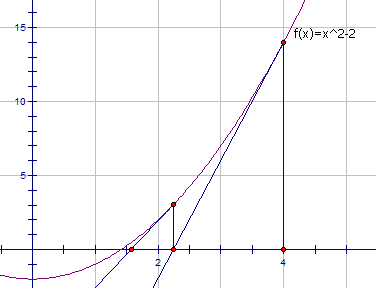

# 11.二分查找

# 1.二分查找

## 1.1二分查找的前提

1.  目标函数单调性（单调递增或递减）
2.  存在上下界（bounded）
3.  能够通过索引访问（index accessible）

## 1.2 代码模板

```python
left, right = 0, len(array) - 1
while left <= right:
  mid = (left + right) / 2
  if array[mid] == target:
    # find the target
    break or return result
  elif array[mid] < target:
    left = mid + 1
  else:
    right = mid - 1

```

## 1.3 示例

在递增数组里 `[10,14,19,26,27,31,33,35,42,44]` 中， 查找`31`



# 2.题目

## 2.1 x的平方根

[69. x 的平方根 - 力扣（LeetCode）](https://leetcode.cn/problems/sqrtx/description/ "69. x 的平方根 - 力扣（LeetCode）")

```bash
给你一个非负整数 x ，计算并返回 x 的 算术平方根 。

由于返回类型是整数，结果只保留 整数部分 ，小数部分将被 舍去 。

注意：不允许使用任何内置指数函数和算符，例如 pow(x, 0.5) 或者 x ** 0.5 。
```

### 二分查找

```c++
// 1.二分查找
int mySqrt1(int x) {
    if (x == 0 || x == 1) {
        return x;
    }

    int left = 1;
    int right = x;
    int ans = -1;
    while (left <= right) {
        // 注意此处，主要是为了防止数据溢出
        int mid = left + (right - left) / 2;
        if ((long long)mid * mid > x) {
            right = mid - 1;
        } else {
            left = mid + 1;
            ans = mid;
        }
    }

    return ans;
}
```

### 牛顿迭代法

[Beyond3D - Origin of Quake3's Fast InvSqrt()](https://www.beyond3d.com/content/articles/8/ "Beyond3D - Origin of Quake3's Fast InvSqrt()")

牛顿迭代法是一种可以用来快速求解函数零点的方法。

为了方便，用 $C$ 表示待求出平方根的那个整数。显然，$C$ 的平方根就是函数$y = f(x) = x^2 - C$的零点。

牛顿迭代法的本质是借助泰勒级数，从初始值开始快速向零点逼近。我们任取一个 $x_0$作为初始值，在每一步的迭代中，我们找到函数图像上的点$(x_i, f(x_i))$，过该点作一条斜率为该点导数 $f'(x_i)$的直线，与横轴的交点记为 $x_{i+1}$。$x_{i+1}$相较于 $x_i$而言距离零点更近。在经过多次迭代后，我们就可以得到一个距离零点非常接近的交点。下图给出了从 $x_0$开始迭代两次，得到 x\_1和 $x_2$的过程。



```c++
// 2.牛顿迭代法
int mySqrt(int x) {
    if (x == 0 || x == 1) {
        return x;
    }

    long ans = x;
    while (ans * ans > x) {
        ans = (ans + x / ans) / 2;
    }

    return ans;
}
```

## 2.2 搜索选择排序数组

[33. 搜索旋转排序数组 - 力扣（LeetCode）](https://leetcode.cn/problems/search-in-rotated-sorted-array/description/ "33. 搜索旋转排序数组 - 力扣（LeetCode）")

```bash
整数数组 nums 按升序排列，数组中的值 互不相同 。

在传递给函数之前，nums 在预先未知的某个下标 k（0 <= k < nums.length）上进行了 旋转，使数组变为 [nums[k], nums[k+1], ..., nums[n-1], nums[0], nums[1], ..., nums[k-1]]（下标 从 0 开始 计数）。例如， [0,1,2,4,5,6,7] 在下标 3 处经旋转后可能变为 [4,5,6,7,0,1,2] 。

给你 旋转后 的数组 nums 和一个整数 target ，如果 nums 中存在这个目标值 target ，则返回它的下标，否则返回 -1 。

你必须设计一个时间复杂度为 O(log n) 的算法解决此问题。
```

使用二分查找：

-   如果`target`在`[mid+1, high]`序列中，则`low=mid+1`，否则，`high=mid`，关键是如何判断`target`在`[mid+1, high]`序列中，具体判断如下：
-   当`[0, mid]`序列是升序：`nums[0] ≤ nums[mid]`，当t`arget>nums[mid] || target <nums[0]`，则向后规约；
-   当`[0, mid]`序列存在旋转位：`nums[0] > nums[mid]`，当`target<nums[0] && target >nums[mid]`，则向后规约；
-   其他情况就是向前规约了

循环判断，直到排除到只剩一个元素时，退出循环，如果该元素和target相同，直接返回下标，否则返回-1.

```c++
class Solution {
public:
    int search(vector<int>& nums, int target) {

        int left = 0;
        int right = nums.size() - 1;
        int ans = -1;
        while (left < right) {
            // 注意此处，主要是为了防止数据溢出
            int mid = left + (right - left) / 2;
            if (nums[mid] == target) {
                ans = mid;
            } 
            // 当[0,mid]有序时，向后规约条件
            if (nums[0] <= nums[mid] && (target > nums[mid] || target < nums[0])) {
                left = mid + 1;
            
            // 当[0, mid]发生旋转时，向后规约条件
            } else if (target > nums[mid] && target < nums[0]) {
                left = mid + 1;
            } else {
                right = mid;
            }
        }

        return left == right && nums[left] == target ? left : -1;
    }
};
```
