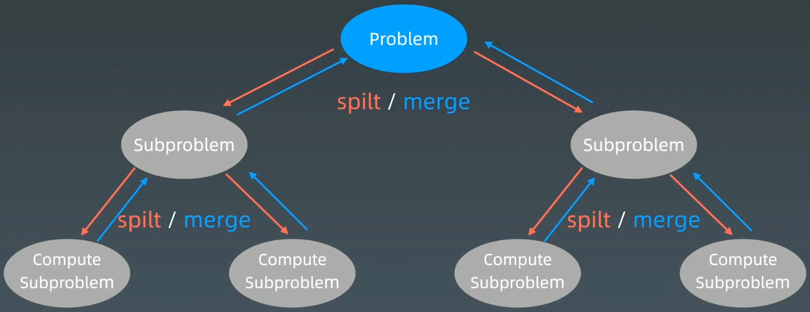
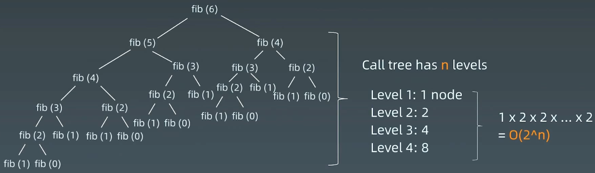
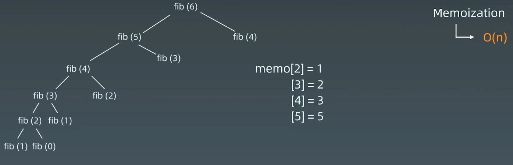
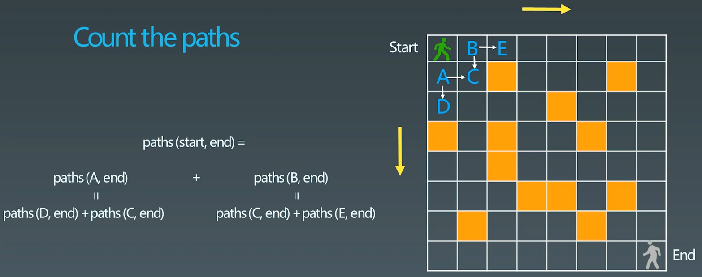
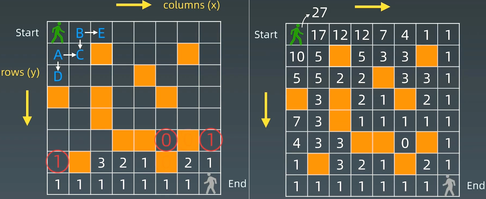
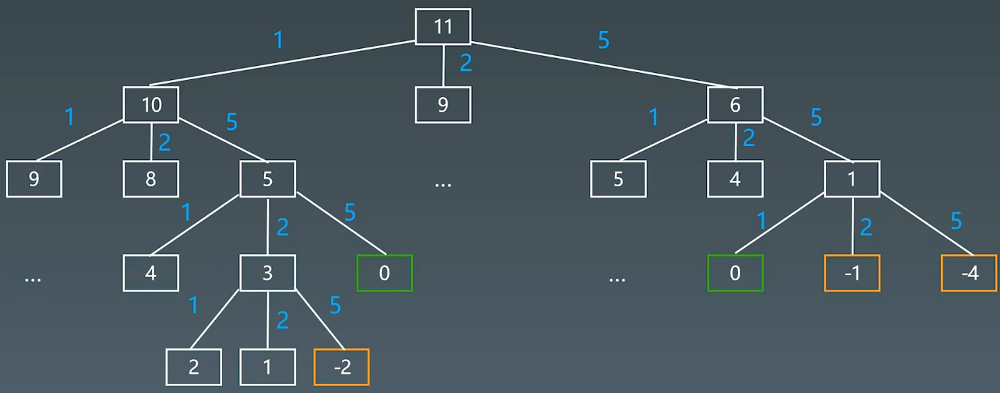

# 12.动态规划

# 1.复习

分治、回溯、递归、动态规划，没有本质上的区别，主要是一些小细节不一样

## 1.1 递归

递归代码模板：

```python
def recursion(level, param1, param2, ...):
  # 1.recursion terminator (递归终止条件)
  if level > MAX_LeVEL:
    process_result
    return

  # 2.process logic in current level (处理当前层逻辑)
  process(level, data, ...)
  
  # 3.drill down (下探到下一层)
  self.recursion(level + 1, p1, ...)
  
  # 4.reverse the current level status if needed (清理当前层)
```

## 1.2 分治



分治代码模板：

```python
def divide_conquer(problem, param1, param2, ...):
  # 1.recursion terminator (递归终止条件)
  if problem is None:
    print_result
    return
  
  # 2.prepare data (拆分问题)
  data = prepare_data(problem)
  subproblems = split_problem(problem, data)
  
  # 3.conquer subproblems (调字问题的递归函数)
  subresult1 = self.divide_conquer(subproblems[0], p1, ...)
  subresult1 = self.divide_conquer(subproblems[0], p1, ...)
  subresult1 = self.divide_conquer(subproblems[0], p1, ...)
  ...
  
  # 4.process and generate the final result (合并结果)
  result = process_result(subresult1, subresult2, subresult3, ...)
  
  # 5.revert the current level status (回复当前层状态)
```

## 1.3 感触

**本质**：**寻找重复性 → 计算机指令集**

1.  人肉递归低效、很累
2.  找到最近最简方法，将其拆解成可重复解决的问题
3.  数学归纳法思维 （抵制人肉递归的诱惑）

# 2.动态规划 (Dynamic Programming)

## 2.1 定义

1.  Wiki定义：[Dynamic programming - Wikipedia](https://en.wikipedia.org/wiki/Dynamic_programming "Dynamic programming - Wikipedia")
2.  In both contexts it refers to\*\* simplifying a complicated problem by breaking it down into simpler sub-problems\*\* in a [recursive](https://en.wikipedia.org/wiki/Recursion "recursive") manner. While some decision problems cannot be taken apart this way, decisions that span several points in time do often break apart recursively.
3.  Divide & Conquer + Optimal substructure （分治 + 最优子结构）

## 2.2 关键点

1.  动态规划 和 递归或者分治 没有根本上的区别（关键看有无最优子结构）
2.  **共性：找到重复问题**
3.  差异性：最优子结构、中途可以**淘汰**次优结构

## 2.3 DP关键点

1.  **化繁为简**：最优子结构，分成各种子问题：$opt[n]= best\_of(opt [n-1], opt[n-2], \ldots)$
2.  **定义状态空间**：**存储中间过程**：$opt[i]$
3.  **递推公式**（状态转移方程或DP方程）
    1.  Fib : $opt[i] = opt[n-1] + opt[n-2]$
    2.  二位路径 : $\operatorname{opt}[i, j]=\operatorname{opt}[i+1][j]+\operatorname{opt}[i][j+1]$(且判断$a[i, j]$ 是否空地)

## 2.4 动态规划小结

1.  打破自己的思维惯性，形成机器思维
2.  理解复杂逻辑的关键
3.  也是职业进阶的要点要领

# 3.例题

## 3.1 Fibonacci数列

[509. 斐波那契数 - 力扣（LeetCode）](https://leetcode.cn/problems/fibonacci-number/ "509. 斐波那契数 - 力扣（LeetCode）")

```bash
斐波那契数 （通常用 F(n) 表示）形成的序列称为 斐波那契数列 。该数列由 0 和 1 开始，后面的每一项数字都是前面两项数字的和。也就是：

F(0) = 0，F(1) = 1
F(n) = F(n - 1) + F(n - 2)，其中 n > 1
给定 n ，请计算 F(n) 。
```

### （1）递归



```c++
int fib(int n) {
    return n <= 1 ? n : this->fib(n - 1) + this->fib(n - 2);
}
```

### （2）记忆化搜索



```c++
int fib(int n) {
    if (n <= 1) {
        return n;
    }

    std::vector<int> memo(n+1, 0);
    return this->fib2(n, memo);
}
int fib2(int n, std::vector<int>& memo) {
    if (n <= 1) {
        return n;
    }

    if (memo[n] == 0) {
        memo[n] = this->fib2(n - 1, memo) + fib2(n -2, memo);
    }

    return memo[n];
}
```

### （3）自底向上（Bottom up）

```c++
int fib(int n) {
    if (n <= 1) {
        return n;
    }

    std::vector<int> memo(n+1, 0);
    memo[0] = 0;
    memo[1] = 1;
    for (int i = 2; i <= n; i++) {
        memo[i] = memo[i - 1] + memo[i - 2];
    }

    return memo[n];
}
```

## 3.2 不同路径

[62. 不同路径 - 力扣（LeetCode）](https://leetcode.cn/problems/unique-paths/description/ "62. 不同路径 - 力扣（LeetCode）")

[63. 不同路径 II - 力扣（LeetCode）](https://leetcode.cn/problems/unique-paths-ii/description/ "63. 不同路径 II - 力扣（LeetCode）")

[980. 不同路径 III - 力扣（LeetCode）](https://leetcode.cn/problems/unique-paths-iii/description/ "980. 不同路径 III - 力扣（LeetCode）")

```bash
一个机器人位于一个 m x n 网格的左上角 （起始点在下图中标记为 “Start” ）。

机器人每次只能向下或者向右移动一步。机器人试图达到网格的右下角（在下图中标记为 “Finish”）。

现在考虑网格中有障碍物。那么从左上角到右下角将会有多少条不同的路径？

网格中的障碍物和空位置分别用 1 和 0 来表示。
```

### （1）递归

绿色小人只能走到A或B，所以，可以分解成 $paths(start, end) = paths(A, end) + paths(B, end)$，转为子问题



```c++
int coutPaths(boolean[][], int row, int col) {
  if (!vaildSquare(grid, row, col))
    return 0;
  if (isAtEnd(grid, row, col)) 
    return 1;
  return coutPaths(grid, row+1, col) + coutPaths(grid, row, col+1);
}
```

```c++
class Solution {
public:
    int uniquePathsWithObstacles(vector<vector<int>>& obstacleGrid) {
        int m = obstacleGrid.size();
        int n = obstacleGrid[0].size();
        std::vector<int> cache(n * m, -1);

        return this->count_path(cache, obstacleGrid, 0, 0);
    }

    int count_path(std::vector<int>& cache, 
            std::vector<std::vector<int>>& grid, int row, int col) {
        // 边界
        if (row >= grid.size() || col >= grid[0].size()) {
            return 0;
        }

        // 障碍
        if (grid[row][col] == 1) {
            return 0;
        }

        // 到达终点
        if (row == grid.size() - 1 && col == grid[0].size() - 1) {
            return 1;
        }

        // 继续往右、往下递归调用
        if (cache[col * grid.size() + row] != -1) {
            return cache[col * grid.size() + row];
        } else {
            int res = this->count_path(cache, grid, row + 1, col) + this->count_path(cache, grid, row, col + 1);
            cache[col * grid.size() + row] = res;
            return res;
        }  
    }
};
```

### 状态转移方程（DP方程）

$opt[i, j] = opt[i + 1, j] + opt[i, j+1]$

完整逻辑：

```bash
if a[i, j] = '空地':
  opt[i, j] = opt[i + 1, j] + opt[i, j+1]
else:
  opt[i,j] = 0

```



```c++
int uniquePathsWithObstacles(vector<vector<int>>& obstacleGrid) {
    int row = obstacleGrid.size();
    int col = obstacleGrid[0].size();

    std::vector<std::vector<long long>> dp(row, std::vector<long long>(col, 0));

    // 判断终点是否有障碍物
    dp[row - 1][col - 1] = (obstacleGrid[row - 1][col - 1] == 1) ? 0 : 1;

    // 处理最后一列
    for (int i = row - 2; i >= 0; i--) {
        if (obstacleGrid[i][col - 1] == 1 || dp[i + 1][col - 1] == 0) {
            dp[i][col - 1] = 0;
        } else {
            dp[i][col - 1] = 1;
        }
    }

    // 处理最后一行
    for (int j = col - 2; j >= 0; j--) {
        if (obstacleGrid[row - 1][j] == 1 || dp[row - 1][j + 1] == 0) {
            dp[row - 1][j] = 0;
        } else {
            dp[row - 1][j] = 1;
        }
    }

    for (int i = row - 2; i >= 0; i--) {
        for (int j = col - 2; j >= 0; j--) {
            // 如果当前格子是障碍物
            if (obstacleGrid[i][j] == 1) {
                dp[i][j] = 0;
            } else {
                // 路径总和: opt[i, j] = opt[i + 1, j] + opt[i, j+1]
                dp[i][j] = dp[i + 1][j] + dp[i][j + 1];
            }
        }
    }

    return dp[0][0];
}
```

## 3.3 最长公共子序列

[1143. 最长公共子序列 - 力扣（LeetCode）](https://leetcode.cn/problems/longest-common-subsequence/description/ "1143. 最长公共子序列 - 力扣（LeetCode）")

```bash
给定两个字符串 text1 和 text2，返回这两个字符串的最长 公共子序列 的长度。如果不存在 公共子序列 ，返回 0 。

一个字符串的 子序列 是指这样一个新的字符串：它是由原字符串在不改变字符的相对顺序的情况下删除某些字符（也可以不删除任何字符）后组成的新字符串。

例如，"ace" 是 "abcde" 的子序列，但 "aec" 不是 "abcde" 的子序列。
两个字符串的 公共子序列 是这两个字符串所共同拥有的子序列。
```

方法1：暴力方法：生成字符串一的所有子序列，在字符串二中验证；生成方式：递归判断每一个字符是取还是不取

方法2：找重复性：

两个字符串分别为一个二维数组的行和列，数组中的数组为当前行列之前字符串的公共子串个数；

-   初始时，第一行和第一列可以先求出来；
-   如3行6列的数值3，表示"ABAZDC" 和 "BAC" 的最长子序列， 发现两个字符串的最后一个字符是一样的，可以转换成求 "ABAZD" 和 "BA" 这两个序列的最长子序列 `+1`，即 `2+1=3`
-   DP方程：
-   $if(s_1[n-1] ≠ s_2[n-1]) ~:~ LCS[s_1, s_2] = Max(LSC[s_1 - 1, s_2], LSC[s_1, s_2-1])$
-   $if(s_1[n-1] == s_2[n-1]) ~:~ LCS[s_1, s_2] = LSC[s_1 - 1, s_2 - 1] + 1$


```python
class Solution:
    def longestCommonSubsequence(self, text1: str, text2: str) -> int:
        if not text1 or not text2:
            return 0
        m = len(text1)
        n = len(text2)
        dp = [[0]*(n + 1) for _ in range(m + 1)]

        for i in range(1, m + 1):
            for j in range(1, n + 1):
                if text1[i - 1] == text2[j - 1]:
                    dp[i][j] = dp[i - 1][j - 1] + 1
                else:
                    dp[i][j] = max(dp[i][j - 1], dp[i - 1][j])

        return dp[m][n]
```

```c++
class Solution {
public:
    int longestCommonSubsequence(string text1, string text2) {
        int m = text1.size();
        int n = text2.size();

        if (m == 0 || n == 0) {
            return 0;
        }

        std::vector<std::vector<int>> dp(m + 1, std::vector<int>(n + 1, 0));

        for (int i = 1; i <= m; i++) {
            for (int j = 1; j <= n; j++) {
                if (text1.at(i - 1) == text2.at(j - 1)) {
                    dp[i][j] = dp[i - 1][j - 1] + 1;
                } else {
                    dp[i][j] = std::max(dp[i][j - 1], dp[i - 1][j]);
                }
            }
        }

        return dp[m][n];
    }
};
```

# 4.实战题目

## 4.1 爬楼梯问题

### （1）一次可以上1个或2个台阶

> 有一个楼梯，总共有n个台阶。每一次，可以上一个台阶，也可以上两个台阶。问：爬上这样一个楼梯，一共有多少种不同的方法？

dp方程：$f(n) = f(n-1) + f(n-2)$

```python
def climbStairs(n):
  if n <= 2:
    return n
  dp = [0 for i in range(n + 1)]
  dp[0], dp[1] = 0, 1
  for i in range(2, n+1):
    dp[i] = dp[i - 1] + dp[i - 2]
  return dp[-1]

```

时间复杂度O(n), 空间复杂度O(n)。  空间复杂度可以优化成O(1)，如下：

```python
def climbStairs(n):
  if n <= 2:
    return n
  a, b, c = 0, 1, 0
  for i in range(2, n+1):
    c = a + b
    a = b
    b = c
  return a
```

### （2）一次可以上1个、2个和3个台阶

> 有一个楼梯，总共有n个台阶。每一次，可以上一个台阶，可以上二个台阶，也可以上三个台阶。问：爬上这样一个楼梯，一共有多少种不同的方法？

dp方程：$f(n) = f(n-1) + f(n-2) + f(n-3)$

```python
def climbStairs(n):
  if n <= 2:
    return n
  dp = [0 for i in range(n + 1)]
  dp[0], dp[1], dp[2] = 0, 1, 2 
  for i in range(3, n+1):
    dp[i] = dp[i - 1] + dp[i - 2] + dp[i - 3]
  return dp[-1]
```

时间复杂度O(n), 空间复杂度O(n)。  空间复杂度可以优化成O(1)，如下：

```python
def climbStairs(n):
  if n <= 2:
    return n
  a, b, c, d, e = 0, 0, 1, 2, 0
  for i in range(2, n+1):
    e = b + c + d
    a = b
    b = c
    c = d
    d = e
  return a
```

### （3）爬任意台阶

> 有一个楼梯，总共有n个台阶。每次可以走任意台阶。问：爬上这样一个楼梯，一共有多少种不同的方法？

dp方程：

-   $f(n) = f(n-1) + f(n-2) + … + f(3) + f(2) + f(1)$
-   $ f(n-1) = f(n-2) + … + f(3) + f(2) + f(1)  $
-   则，$ f(n) - f(n-1) = f(n-1)  $→$f(n) = 2 * f(n-1)$

```python
def climbStairs(n):
  if n <= 2:
    return n
  dp = [0 for i in range(n + 1)]
  dp[0], dp[1] = 0, 1
  for i in range(2, n+1):
    dp[i] = 2 * dp[i - 1]
  return dp[-1]

```

时间复杂度O(n), 空间复杂度O(n)。

继续推导：$f(n) = 2 * f(n-1) = 2 * 2 * f(n-2) = 2 * 2 * 2 * f(n-3) = 2^{(n-1)} * f(1) = 2^{(n-1)}$

```python
def climbStairs(n):
  if n <= 2:
    return n
  return 2**(n - 1)
```

## 4.2 三角形最小路径和

[120. 三角形最小路径和 - 力扣（LeetCode）](https://leetcode.cn/problems/triangle/description/ "120. 三角形最小路径和 - 力扣（LeetCode）")

```bash
给定一个三角形 triangle ，找出自顶向下的最小路径和。

每一步只能移动到下一行中相邻的结点上。相邻的结点 在这里指的是 下标 与 上一层结点下标 相同或者等于 上一层结点下标 + 1 的两个结点。也就是说，如果正位于当前行的下标 i ，那么下一步可以移动到下一行的下标 i 或 i + 1 。
```

求解方法：

1.  暴力方法：递归，n层 : left or right，$O(2^n)$
2.  DP
    1.  重复性（分治）：$problem(i, j) = min(sub(i+1, j) + sub(i+1, j+1)) + a(i, j)$
    2.  定义状态数组：$f[i, j]$
    3.  DP方程：$f(i, j) = min(f(i+1, j), f(i + 1, j + 1)) + a[i, j]$

DP python

```python
class Solution:
    def minimumTotal(self, triangle: List[List[int]]) -> int:
        # 注意初始化，不开新的数组也可以，直接将 triangle 当作 dp
        dp = triangle
        for i in range(len(triangle)-2, -1, -1):
            for j in range(len(triangle[i])):
                # 之前依据初始化过了，直接累加
                dp[i][j] += min(dp[i + 1][j], dp[i + 1][j + 1])
        
        return dp[0][0]
```

DP C++

```c++
class Solution {
public:
    int minimumTotal(vector<vector<int>>& triangle) {
        // 注意初始化，不开新的数组也可以，直接将 triangle 当作 dp
        std::vector<std::vector<int>> dp(triangle);

        for (int i = dp.size() - 2; i >= 0; i--) {
            for (int j = dp[i].size() - 1; j >= 0; j--) {
                // 之前依据初始化过了，直接累加
                dp[i][j] += std::min(dp[i + 1][j], dp[i + 1][j + 1]);
            }
        }

        return dp[0][0];
    }
};
```

暴力递归

```c++
class Solution {
public:
    // 2. 暴力方法：递归，n层 : left or right，2^n
    int minimumTotal(vector<vector<int>>& triangle) {
        int size = triangle.size();
        std::vector<std::vector<int>> memo(size, std::vector<int>(size, -1));

        return this->bfs(0, 0, memo, triangle);
    }

private:
    int bfs(int level, int c, std::vector<std::vector<int>>& memo, 
        std::vector<std::vector<int>>& triangle) {
        if (memo[level][c] != -1) {
            return memo[level][c];
        }

        if (level == triangle.size() - 1) {
            return memo[level][c] = triangle[level][c];
        }

        int left = this->bfs(level + 1, c, memo, triangle);
        int right = this->bfs(level + 1, c + 1, memo, triangle);

        return memo[level][c] = std::min(left, right) + triangle[level][c];
    }
};
```

## 4.3 最大子序列和

[53. 最大子数组和 - 力扣（LeetCode）](https://leetcode.cn/problems/maximum-subarray/description/ "53. 最大子数组和 - 力扣（LeetCode）")

```bash
给你一个整数数组 nums ，请你找出一个具有最大和的连续子数组（子数组最少包含一个元素），返回其最大和。

子数组 是数组中的一个连续部分。
```

求解方法：

1.  暴力：枚举起点和终点，复杂度为 O(n^2)，其中优化点：起点和终点必须是正数，不可能是负数；
2.  DP求解：
    1.  分治（子问题）：如果第i个元素，则子序列和是多少？$max_sum(i) = Max(max_sum(i-1), 0) + a[i]$
    2.  状态数组定义：$f[1]$
    3.  DP方程：$f(i) = Max(f(i-1), 0) + a[i]$

```python
class Solution:
    def maxSubArray(self, nums: List[int]) -> int:
        """
            1. dp问题，公式为: dp[i] = max(nums[i], nums[i] + dp[i - 1])
            2. 最大子序列和 = 当前元素自身最大，或者 包含之前后最大
        """
        for i in range(1, len(nums)):
            # nums[i - 1]代表dp[i - 1]
            nums[i] = max(nums[i], nums[i] + nums[i - 1])

        return max(nums)
```

```c++
class Solution {
public:
    // 1. DP求解：
    //     1. 分治（子问题）：如果第i个元素，则子序列和是多少？$max_sum(i) = Max(max_sum(i-1), 0) + a[i]$
    //     2. 状态数组定义：$f[1]$
    //     3. DP方程：$f(i) = Max(f(i-1), 0) + a[i]$
    int maxSubArray(vector<int>& nums) {
        std::vector<int> dp(nums);
        int max_sum = dp[0];

        for (int i = 1; i < nums.size(); i++) {
            dp[i] = std::max(dp[i], dp[i] + dp[i - 1]);
            max_sum = dp[i] >= max_sum ? dp[i] : max_sum;
        }

        return max_sum;
    }
};
```

#### 扩展：乘积最大数组

[152. 乘积最大子数组 - 力扣（LeetCode）](https://leetcode.cn/problems/maximum-product-subarray/description/ "152. 乘积最大子数组 - 力扣（LeetCode）")

```bash
给你一个整数数组 nums ，请你找出数组中乘积最大的非空连续子数组（该子数组中至少包含一个数字），并返回该子数组所对应的乘积。

测试用例的答案是一个 32-位 整数。

子数组 是数组的连续子序列。
```

```python
class Solution:
    def maxProduct(self, nums: List[int]) -> int:
        # 记录绝对值最大的两个数
        # mi ： 负数中最小的
        # ma ： 正数中最大的
        mi = ma = res = nums[0]
        for i in range(1, len(nums)):
            if nums[i] < 0 :
                mi, ma = ma, mi
            ma = max(ma * nums[i], nums[i])
            mi = min(mi * nums[i], nums[i])
            res = max(res, ma)

        return res
```

```c++
class Solution {
public:
    int maxProduct(vector<int>& nums) {
        int mi = nums[0];
        int ma = nums[0];
        int res = nums[0];

        for (int i = 1; i < nums.size(); i++) {
            if (nums[i] < 0) {
                int tmp = ma;
                ma = mi;
                mi = tmp;
            }
            ma = std::max(ma * nums[i], nums[i]);
            mi = std::min(mi * nums[i], nums[i]);

            res = std::max(res, ma);
        }

        return res;
    }
};
```

## 4.4 Coin change

[322. 零钱兑换 - 力扣（LeetCode）](https://leetcode.cn/problems/coin-change/?utm_source=LCUS\&utm_medium=ip_redirect\&utm_campaign=transfer2china "322. 零钱兑换 - 力扣（LeetCode）")

```bash
给你一个整数数组 coins ，表示不同面额的硬币；以及一个整数 amount ，表示总金额。

计算并返回可以凑成总金额所需的 最少的硬币个数 。如果没有任何一种硬币组合能组成总金额，返回 -1 。

你可以认为每种硬币的数量是无限的。
```

1.  暴力方法，递归，第几层表示用了几个硬币，层数最小 → 广度优先遍历，数字为0的结点



```c++
class Solution {
public:
    // 2.递归方法
    int coinChange(vector<int>& coins, int amount) {
        if (amount < 1) {
            return 0;
        }

        std::vector<int> count(amount, 0);
        return this->dp(coins, amount, count);
    }

private:
    // rem : 剩余的价值
    // count[rem] 最小到达的数量
    int dp(std::vector<int>& coins, int rem, std::vector<int>& count) {
        // 无效数据
        if (rem < 0) {
            return -1;
        }
        // 终止条件
        if (rem == 0) {
            return 0;
        }
        if (count[rem - 1] != 0) {
            return count[rem - 1];
        }
        int min = INT_MAX;
        for (int& coin : coins) {
            int res = this->dp(coins, rem - coin, count);
            if (res >= 0 && res < min) {
                min = res + 1;
            }
        }
        count[rem - 1] = (min == INT_MAX) ? -1 : min;
        return count[rem - 1];
    }
};
```

1.  DP方法
    1.  分治（子问题）：$f[n] = min {f(n-k), for k in [1, 2, 5]} + 1$
    2.  状态数组定义：$f(n)$
    3.  DP方程：$f[n] = min {f(n-k), for k in [1, 2, 5]} + 1$

```c++
class Solution {
public:
    // 1.动态规划
    int coinChange(vector<int>& coins, int amount) {
        int max_amount = amount + 1;
        std::vector<int> dp(amount + 1, max_amount);
        dp[0] = 0;
        for (int i = 1; i <= amount; i++) {
            for (int j = 0; j < coins.size(); j++) {
                if (coins[j] <= i) {
                    dp[i] = std::min(dp[i], dp[i - coins[j]] + 1);
                }
            }
        }

        return dp[amount] > amount ? -1 : dp[amount];
    }
};
```

## 4.5 打家劫舍

### （1） 打家劫舍

[198. 打家劫舍 - 力扣（LeetCode）](https://leetcode.cn/problems/house-robber/description/ "198. 打家劫舍 - 力扣（LeetCode）")

```bash
你是一个专业的小偷，计划偷窃沿街的房屋。每间房内都藏有一定的现金，影响你偷窃的唯一制约因素就是相邻的房屋装有相互连通的防盗系统，如果两间相邻的房屋在同一晚上被小偷闯入，系统会自动报警。

给定一个代表每个房屋存放金额的非负整数数组，计算你 不触动警报装置的情况下 ，一夜之内能够偷窃到的最高金额。
```

DP方法：

1.  分治子问题：
2.  状态数组定义：
3.  DP方程：

分析：

-   `a[i]` ： 0\~i 能偷盗的最大数量，结果为`a[n-1]`
-   `a[i][0, 1]` ： 增加一个维度，其中，0表示i偷，1表示i不偷
-   $a[i][0] = max(a[i-1][0], a[i-1][1])$：当前不偷，前一个偷还是不偷的最大值
-   $a[i][1] = a[i-1][0] + nums[i]$ ： 当前偷，等于前一个的值 + 当前的值

```c++
class Solution {
public:
    // 二维动态规划
    int rob(vector<int>& nums) {
        int n = nums.size();
        if (n == 0) {
            return 0;
        }

        // 增加一个维度，其中，0表示i偷，1表示i不偷
        std::vector<std::vector<int>> dp(n, std::vector<int>(2, 0));

        dp[0][0] = 0;
        dp[0][1] = nums[0];

        for (int i = 1; i < n; i++) {
            // 当前不偷，前一个偷还是不偷的最大值
            dp[i][0] = std::max(dp[i - 1][0], dp[i - 1][1]);
            //  当前偷，等于前一个的值 + 当前的值
            dp[i][1] = dp[i - 1][0] + nums[i];
        }

        return std::max(dp[n-1][0], dp[n-1][1]);
    }
};
```

进一步简化：

-   `a[i]` ： 0\~i 能偷盗的最大数量，结果为`max(a)`
-   `a[i]` ： 0\~i 能偷盗的最大数量，且`nums[i] `必须偷的最大值
-   $a[i] = max(a[i-1] + 0, a[i-2] + nums[i])$：当前的最大值等于，上一次偷的最大值 + 0(今天不偷) 和 上上一次偷的最大值 + 偷今天

```c++
class Solution {
public:
    // 简化为一维动态规划
    int rob(vector<int>& nums) {
        int n = nums.size();
        if (n == 0) {
            return 0;
        }
        if (n == 1) {
            return nums[0];
        }

        std::vector<int> dp(n,0);

        dp[0] = nums[0];
        dp[1] = std::max(nums[0], nums[1]);

        int res = dp[1];

        for (int i = 2; i < n; i++) {
            dp[i] = std::max(dp[i - 1] + 0, dp[i - 2] + nums[i]);

            res = std::max(res, dp[i]);
        }

        return res;
    }
};
```

### （2）打家劫舍2

[213. 打家劫舍 II - 力扣（LeetCode）](https://leetcode.cn/problems/house-robber-ii/ "213. 打家劫舍 II - 力扣（LeetCode）")

```bash
你是一个专业的小偷，计划偷窃沿街的房屋，每间房内都藏有一定的现金。这个地方所有的房屋都 围成一圈 ，这意味着第一个房屋和最后一个房屋是紧挨着的。同时，相邻的房屋装有相互连通的防盗系统，如果两间相邻的房屋在同一晚上被小偷闯入，系统会自动报警 。

给定一个代表每个房屋存放金额的非负整数数组，计算你 在不触动警报装置的情况下 ，今晚能够偷窃到的最高金额。
```

如何才能保证第一间房屋和最后一间房屋不同时偷窃呢？如果偷窃了第一间房屋，则不能偷窃最后一间房屋，因此偷窃房屋的范围是第一间房屋到最后第二间房屋；如果偷窃了最后一间房屋，则不能偷窃第一间房屋，因此偷窃房屋的范围是第二间房屋到最后一间房屋。

假设数组 nums 的长度为 n。

-   如果不偷窃最后一间房屋，则偷窃房屋的下标范围是 `[0,n−2]`；
-   如果不偷窃第一间房屋，则偷窃房屋的下标范围是 `[1,n−1]`。

在确定偷窃房屋的下标范围之后，即可用第 198 题的方法解决。对于两段下标范围分别计算可以偷窃到的最高总金额，其中的最大值即为在 n 间房屋中可以偷窃到的最高总金额。

```c++
class Solution {
public:
    int rob(vector<int>& nums) {
        int n = nums.size();
        if (n == 0) {
            return 0;
        } else if (n == 1) {
            return nums[0];
        } else if (n == 2) {
            return std::max(nums[0], nums[1]);
        }

        return std::max(this->rob_range(nums, 0, n - 2), this->rob_range(nums, 1, n - 1));
    }
private:
    int rob_range(std::vector<int>& nums, int start, int end) {
        std::vector<int> dp(nums.size(), 0);

        dp[start] = nums[start];
        dp[start + 1] = std::max(nums[start], nums[start + 1]);
        int res = dp[start + 1];
        for (int i = start + 2; i <= end; i++) {
            dp[i] = std::max(dp[i - 1] + 0, dp[i - 2] + nums[i]);

            res = std::max(res, dp[i]);
        }

        return res;
    }
};
```
