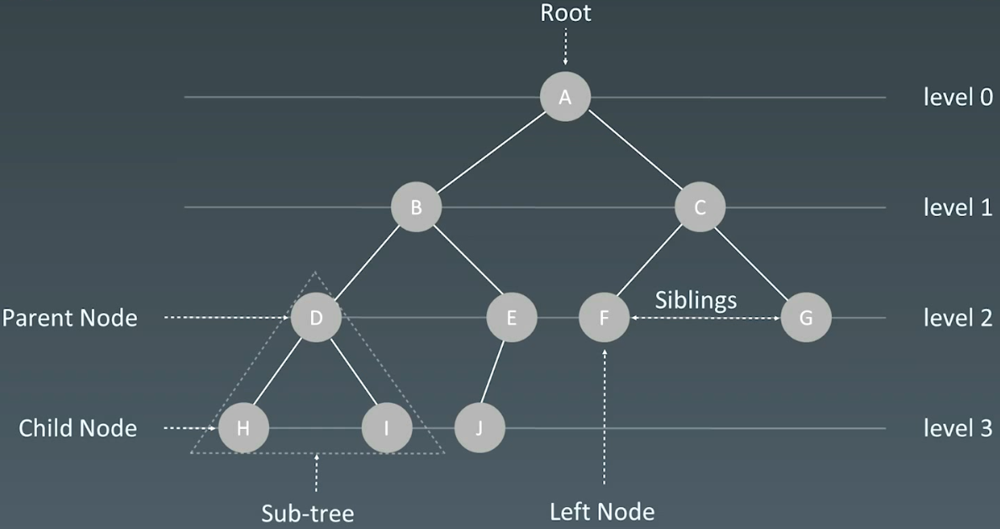
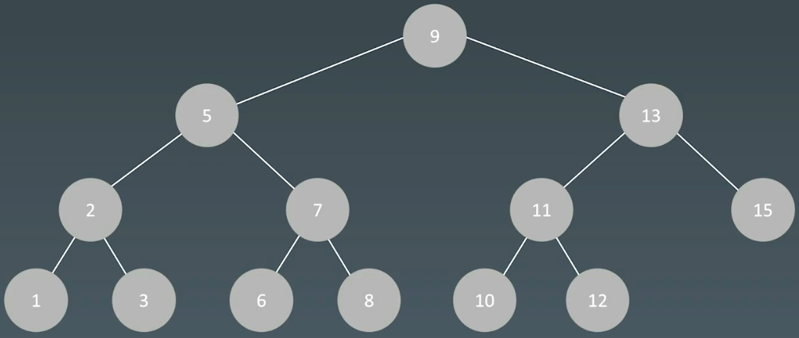
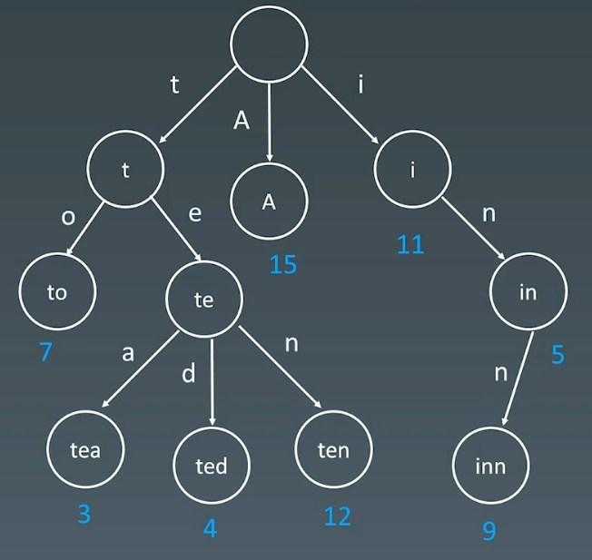
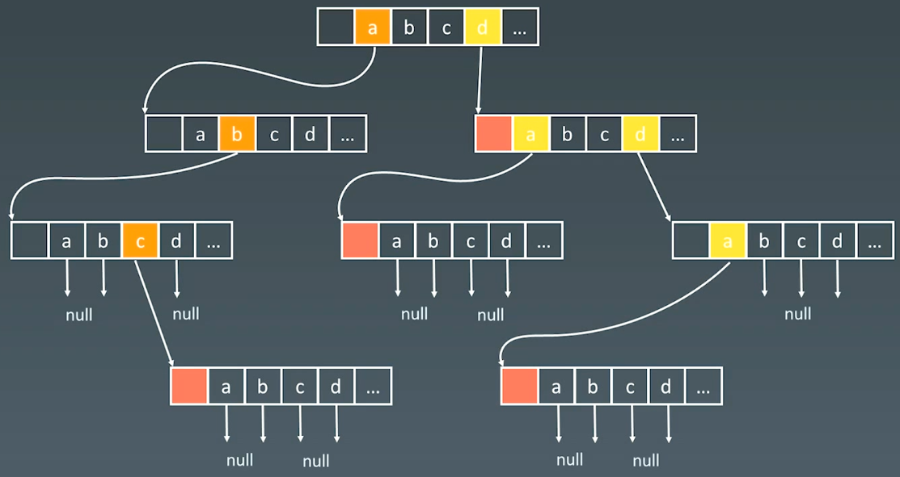
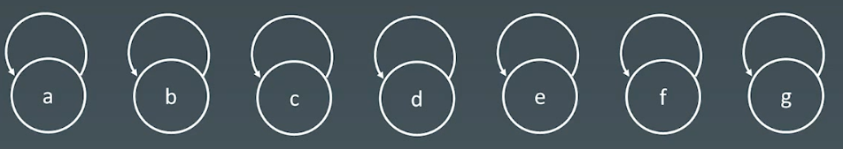
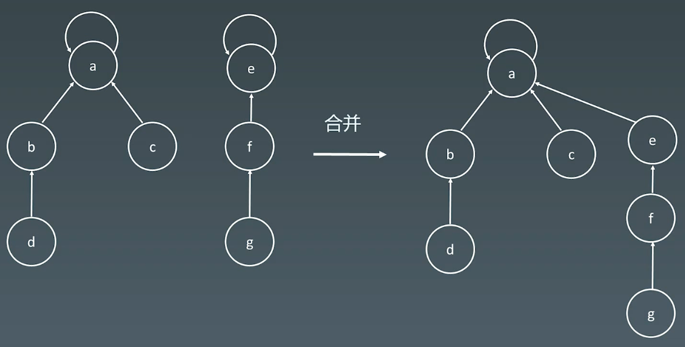

# 13.字典树和并查集

# 1.字典树（Trie）

## 1.1 字典树数据结构

### （1）树 Tree



### （2）二叉搜索树

注意：是根节点大于左子树中的全部结点，小于右子树的全部结点，不是左儿子和右儿子。



### （3）字典树

字典树，即 Trie 树，又称单词查找树或键树，是一种树形结构。典型应用是用于统计和排序大量的字符串(但不仅限于字符串)，所以经常被搜索引擎系统用于文本词频统计。

它的优点是：**最大限度地减少无谓的字符串比较，查询效率比哈希表高**。

结点可以存储额外信息：

-   如下图中，数字表示单词出现的频次



### （4）结点的内部实现



## 1.2 核心思想

Trie树的核心思想：空间换时间

利用字符串的公共前缀来降低查询时间的开销，以达到提高效率的目的

## 1.3 基本性质

1.  结点本身不存完整单词
2.  从根结点到某一结点，路径上经过的字符连接起来，为该结点对应的字符串
3.  每个结点的所有子结点路径代表的字符都不相同

## 1.4 字典树实现

python代码模板

```python
class Trie:
    """ 字典树
    """
    def __init__(self):
        # 指向子节点的指针数组 children。数组长度为 26，即小写英文字母的数量
        self.children = [None] * 26
        # 表示该节点是否为字符串的结尾
        self.is_end = False

    def insert(self, word: str) -> None:
        """ 插入字符串，从根开始，判断下面两种情况
            1.子节点存在。沿着指针移动到子节点，继续处理下一个字符。
            2.子节点不存在。创建一个新的子节点，记录在 children数组的对应位置上，
            然后沿着指针移动到子节点，继续搜索下一个字符。
        """
        node = self
        for ch in word:
            ch = ord(ch) - ord("a")
            if not node.children[ch]:
                node.children[ch] = Trie()
            node = node.children[ch]
        node.is_end = True

    def search(self, word: str) -> bool:
        """ 搜索字符串是否存在
            若搜索到了前缀的末尾，就说明字典树中存在该前缀。
            此外，若前缀末尾对应节点的 isEnd为真，则说明字典树中存在该字符串。
        """
        node = self._search_prefix(word)
        return node is not None and node.is_end

    def startsWith(self, prefix: str) -> bool:
        return self._search_prefix(prefix) is not None


    def _search_prefix(self, prefix : str) -> "Trie":
        """ 查找前缀，对于当前字符对应的子节点，有两种情况：
            1.子节点存在。沿着指针移动到子节点，继续搜索下一个字符。
            2.子节点不存在。说明字典树中不包含该前缀，返回空指针。
        """
        node = self
        for ch in prefix:
            ch = ord(ch) - ord("a")
            if not node.children[ch]:
                return None
            node = node.children[ch]
        return node
```

C++实现

```c++
class Trie {
public:
    Trie() : m_children(26), m_is_end(false) {

    }
    
    // 插入字符串，从根开始，判断下面两种情况
    // 1.子节点存在。沿着指针移动到子节点，继续处理下一个字符。
    // 2.子节点不存在。创建一个新的子节点，记录在 children数组的对应位置上，
    //   然后沿着指针移动到子节点，继续搜索下一个字符。
    void insert(string word) {
        Trie* node = this;
        for (auto ch : word) {
            ch -= 'a';
            if (node->m_children[ch] == nullptr) {
                node->m_children[ch] = new Trie();
            }
            node = node->m_children[ch];
        }
        node->m_is_end = true;
    }
    
    // 搜索字符串是否存在
    // 若搜索到了前缀的末尾，就说明字典树中存在该前缀。
    // 此外，若前缀末尾对应节点的 isEnd为真，则说明字典树中存在该字符串。
    bool search(string word) {
        Trie* node = this->search_prefix(word);
        return node != nullptr && node->m_is_end;
    }
    
    bool startsWith(string prefix) {
        Trie* node = this->search_prefix(prefix);
        return node != nullptr;
    }
private:
    // 指向子节点的指针数组 children。数组长度为 26，即小写英文字母的数量
    std::vector<Trie*> m_children;
    // 表示该节点是否为字符串的结尾
    bool m_is_end;

    // 查找前缀，对于当前字符对应的子节点，有两种情况：
    // 1.子节点存在。沿着指针移动到子节点，继续搜索下一个字符。
    // 2.子节点不存在。说明字典树中不包含该前缀，返回空指针。
    Trie* search_prefix(std::string& prefix) {
        Trie* node = this;
        for (auto ch : prefix) {
            ch -= 'a';
            if (node->m_children[ch] == nullptr) {
                return nullptr;
            }
            node = node->m_children[ch];
        }
        return node;
    }
};
```

# 2.Tire实战题目

## 2.1 单词搜索2

[212. 单词搜索 II - 力扣（LeetCode）](https://leetcode.cn/problems/word-search-ii/description/ "212. 单词搜索 II - 力扣（LeetCode）")

```bash
给定一个 m x n 二维字符网格 board 和一个单词（字符串）列表 words， 返回所有二维网格上的单词 。

单词必须按照字母顺序，通过 相邻的单元格 内的字母构成，其中“相邻”单元格是那些水平相邻或垂直相邻的单元格。同一个单元格内的字母在一个单词中不允许被重复使用。
```

1.  words中遍历 → board search，$  O(N*m*n*4^k)  $(4表示4个联通区域，k表示单词的平均长度)
2.  Trie
    1.  all words  → Trie 构建起 prefix
    2.  board， DFS，遍历每一个字符

```python
class Trie:
    def __init__(self):
        # 指向子节点的指针数组 children。数组长度为 26，即小写英文字母的数量
        self.children = [None] * 26
        # 表示该节点是否为字符串的结尾
        self.is_end = False

    def insert(self, word: str) -> None:
        """ 插入字符串，从根开始，判断下面两种情况
            1.子节点存在。沿着指针移动到子节点，继续处理下一个字符。
            2.子节点不存在。创建一个新的子节点，记录在 children数组的对应位置上，
            然后沿着指针移动到子节点，继续搜索下一个字符。
        """
        node = self
        for ch in word:
            ch = ord(ch) - ord("a")
            if not node.children[ch]:
                node.children[ch] = Trie()
            node = node.children[ch]
        node.is_end = True

class Solution:
    def findWords(self, board: List[List[str]], words: List[str]) -> List[str]:
        if not board or not board[0]:
            return []
        if not words:
            return []

        self.result = set()

        # 构建trie
        trie = Trie()
        for word in words:
            trie.insert(word)

        self.m, self.n = len(board), len(board[0])
        for i in range(self.m):
            for j in range(self.n):
                if trie.children[ord(board[i][j]) - ord("a")] is not None:
                    self._dfs(board, i, j, "", trie.children[ord(board[i][j]) - ord("a")] )

        return list(self.result)

    def _dfs(self, board, i, j, curr_word, trie):
        curr_word += board[i][j]

        if trie.is_end:
            self.result.add(curr_word)

        tmp, board[i][j] = board[i][j], '@'
        dx = [-1, 1, 0, 0]
        dy = [0, 0, -1, 1]
        for k in range(len(dx)):
            x, y = i + dx[k], j + dy[k]
            if 0 <= x < self.m and 0 <= y < self.n and board[x][y] != '@' \
                and trie.children[ord(board[x][y]) - ord('a')] is not None:
                self._dfs(board, x, y, curr_word, trie.children[ord(board[x][y]) - ord('a')])
        board[i][j] = tmp
```

# 3.并查集（Disjoint Set）

## 3.1 使用场景

-   组团、配对问题
-   Group or not ?

## 3.2 基本操作

-   `makeSte(s) `: 建立一个新的并查集，其中包含s个单元集合
-   `unionSet(x, y) `: 把元素x和y所在的集合合并，要求x和y所在的集合不相交，如果相交则不合并
-   `find(x)` : 找到元素x所在的集合的代表，该操作也可以用于判断两个元素是否位于同一个集合，只要将它们各自的代表比较一下就可以了。

### （1）初始化

每个集合的领头元素 `i = parent[i]`



### （2）查询、合并



### （3）路径压缩


## 3.3 代码模板

```java
class UnionFind {
    private int count = 0;
    private int[] parent;
    public UnionFind(int n) {
        count = n;
        parent = new int[n];
        // parent初始化
        for (int i = 0; i < n; i++) {
            parent[i] = [i];
        }
    }

    public int find(int p) {
        while (p != parent[p]) {
            parent[p] = parent[parent[p]];
            p = parent[p];
        }

        return p;
    }

    public void union(int p, int q) {
        int rootP = find(p);
        int rootQ = find(q);
        if (rootP == rootQ) 
            return;
        parent[rootP] = rootQ;
        count--;
    }
}
```

python实现

```python
class UnionFind:
    def __init__(n):
        p = [i for i in range(n)]
    
    def union(self, p, i, j):
        p1 = self.parent(p, i)
        p2 = self.parent(p, j)
        p[p1] = p2

    def parent(self, p, i):
        root = i
        while p[root] != root:
            root = p[root]
        # 路径压缩
        while p[i] != i:
            x = i
            i = p[i]
            p[x] = root
        return root
```

## 3.4例题

### （1）省份数量

[547. 省份数量 - 力扣（LeetCode）](https://leetcode.cn/problems/number-of-provinces/description/ "547. 省份数量 - 力扣（LeetCode）")

```bash
有 n 个城市，其中一些彼此相连，另一些没有相连。如果城市 a 与城市 b 直接相连，且城市 b 与城市 c 直接相连，那么城市 a 与城市 c 间接相连。

省份 是一组直接或间接相连的城市，组内不含其他没有相连的城市。

给你一个 n x n 的矩阵 isConnected ，其中 isConnected[i][j] = 1 表示第 i 个城市和第 j 个城市直接相连，而 isConnected[i][j] = 0 表示二者不直接相连。

返回矩阵中 省份 的数量。
```

转化为“岛屿数目”问题

1.  DFS，从一个点出发，将相邻的1变为0，最后看需要多少次DFS
2.  BFS，从一个点出发，将相邻的1变为0，最后看需要多少次BFS
3.  并查集，
    1.  N个人 → 各自独立集合
    2.  遍历好友关系矩阵 M ：` M[i][j] == 1` ?  → 并查集集合合并
    3.  最后，看有多少孤立的集合

#### DFS

遍历所有城市，对于每个城市，如果该城市尚未被访问过，则从该城市开始深度优先搜索，通过矩阵 isConnected得到与该城市直接相连的城市有哪些，这些城市和该城市属于同一个连通分量，然后对这些城市继续深度优先搜索，直到同一个连通分量的所有城市都被访问到，即可得到一个省份。遍历完全部城市以后，即可得到连通分量的总数，即省份的总数。

```c++
class Solution {
public:
    int findCircleNum(vector<vector<int>>& isConnected) {
        std::vector<int> visited(isConnected.size(), 0);
        int count = 0;
        for (int i = 0; i < isConnected.size(); i++) {
            if (visited[i] == 0) {
                this->dfs(isConnected, visited, i);
                count++;
            }
        }

        return count;
    }
private:

    void dfs(vector<vector<int>>& isConnected, std::vector<int>& visited, int i) {
        for (int j = 0; j < isConnected.size(); j++) {
            if (isConnected[i][j] == 1 && visited[j] == 0) {
                visited[j] = 1;
                this->dfs(isConnected, visited, j);
            }
        }
    }
};
```

#### BFS

```c++
class Solution {
public:
    int findCircleNum(vector<vector<int>>& isConnected) {
        vector<int> visited(isConnected.size(), 0);
        int count = 0;
        std::queue<int> Q;
        for (int i = 0; i < isConnected.size(); i++) {
            if (!visited[i]) {
                Q.push(i);
                while (!Q.empty()) {
                    int j = Q.front(); Q.pop();
                    visited[j] = 1;
                    for (int k = 0; k < isConnected.size(); k++) {
                        if (isConnected[j][k] == 1 && !visited[k]) {
                            Q.push(k);
                        }
                    }
                }
                count++;
            }
        }
        return count;
    }
};
```

#### 并查集

计算连通分量数的另一个方法是使用并查集。初始时，每个城市都属于不同的连通分量。遍历矩阵 isConnected，如果两个城市之间有相连关系，则它们属于同一个连通分量，对它们进行合并。

遍历矩阵 isConnected 的全部元素之后，计算连通分量的总数，即为省份的总数。

```python
class Solution:
    def findCircleNum(self, isConnected: List[List[int]]) -> int:
        if not isConnected:
            return 0
        
        n = len(isConnected)
        p = [i for i in range(n)]

        for i in range(n):
            for j in range(n):
                if isConnected[i][j] == 1:
                    self._union(p, i, j)
        
        return len(set([self._parent(p, i) for i in range(n)]))

    def _union(self, p, i, j):
        p1 = self._parent(p, i)
        p2 = self._parent(p, j)
        p[p1] = p2

    def _parent(self, p, i):
        root = i
        while p[root] != root:
            root = p[root]
        # 路径压缩
        while p[i] != i:
            x = i
            i = p[i]
            p[x] = root
        return root
```

```c++
class Solution {
public:
    int findCircleNum(vector<vector<int>>& isConnected) {
        int n = isConnected.size();
        m_count = n;
        m_parent.resize(n);
        for (int i = 0; i < n; i++) {
            this->m_parent[i] = i;
        }

        for (int i = 0; i < n; i++) {
            for (int j = 0; j < n; j++) {
                if (isConnected[i][j] == 1) {
                    this->union_set(i, j);
                }
            }
        }

        return m_count;
    }

    void union_set(int p, int q) {
        int root_p = this->parent_set(p);
        int root_q = this->parent_set(q);
        if (root_p == root_q) {
            return;
        }
        m_parent[root_p] = root_q;
        m_count--;
    }

    int parent_set(int i) {
        int p = i;
        while(p != m_parent[p]) {
            p = m_parent[p];
        }

        return p;
    }
private:
    int m_count;
    std::vector<int> m_parent;
};
```
### （2）岛屿数量

[200. 岛屿数量 - 力扣（LeetCode）](https://leetcode.cn/problems/number-of-islands/description/)

```Bash
给你一个由 '1'（陆地）和 '0'（水）组成的的二维网格，请你计算网格中岛屿的数量。

岛屿总是被水包围，并且每座岛屿只能由水平方向和/或竖直方向上相邻的陆地连接形成。

此外，你可以假设该网格的四条边均被水包围。
```

```Python
class Solution:
    def numIslands(self, grid: List[List[str]]) -> int:
        """
        为了求出岛屿的数量，可以扫描整个二维网格。如果一个位置为 1，
        则将其与相邻四个方向上的 111 在并查集中进行合并。

        最终岛屿的数量就是并查集中连通分量的数目。
        """
        if not grid:
            return 0
        
        m = len(grid)
        n = len(grid[0])
        # 初始化并查集
        self.parent = [i for i in range(m * n)]
        self.count =0
        for i in range(m):
            for j in range(n):
                if grid[i][j] == "1":
                    self.parent[i * n + j] = i * n + j
                    self.count += 1

        # 合并
        dx = [-1, 1, 0, 0]
        dy = [0, 0, -1, 1]
        for i in range(m):
            for j in range(n):
                if grid[i][j] == "1":
                    grid[i][j] = "0"
                    for k in range(len(dx)):
                        x, y = i + dx[k], j + dy[k]
                        if 0 <= x < m and 0 <= y < n and grid[x][y] == "1":
                            self._union(i * n + j, x * n + y)

        return self.count

    def _union(self, i, j):
        p1 = self._parent(i)
        p2 = self._parent(j)
        if p1 == p2:
            return
        self.parent[p1] = p2
        self.count -= 1

    def _parent(self, i):
        root = i
        while self.parent[root] != root:
            root = self.parent[root]
        # 路径压缩
        while self.parent[i] != i:
            x = i
            i = self.parent[i]
            self.parent[x] = root
        return root
```

### （3）被围绕的区域

[130. 被围绕的区域 - 力扣（LeetCode）](https://leetcode.cn/problems/surrounded-regions/description/)

```Bash
给你一个 m x n 的矩阵 board ，由若干字符 'X' 和 'O' ，找到所有被 'X' 围绕的区域，并将这些区域里所有的 'O' 用 'X' 填充。
```

```Python
class Solution:
    """
    把所有边界上的 O 看做一个连通区域。遇到 O 就执行并查集合并操作，这样所有的 O 就会被分成两类
        1.和边界上的 O 在一个连通区域内的。这些 O 保留。
        2.不和边界上的 O 在一个连通区域内的。这些 O 就是被包围的，替换。
    由于并查集一般用一维数组来记录，方便查找 parants，所以将二维坐标用 node 函数转化为一维坐标。
    """
    def solve(self, board: List[List[str]]) -> None:
        """
        Do not return anything, modify board in-place instead.
        """
        if not board:
            return
        
        m = len(board)
        n = len(board[0])
        # 初始化并查集, 最后增加一个虚拟结点，用于比较
        self.parent = [i for i in range(m * n + 1)]
        self.count =0
        for i in range(m):
            for j in range(n):
                self.parent[i * n + j] = i * n + j
                self.count += 1
        # 用一个虚拟节点, 边界上的O 的父节点都是这个虚拟节点
        dummy_node = m * n
        self.parent[dummy_node] = dummy_node

        # 合并
        dx = [-1, 1, 0, 0]
        dy = [0, 0, -1, 1]
        for i in range(m):
            for j in range(n):
                # 遇到O进行并查集操作合并
                if board[i][j] == 'O':
                    # 边界上的O,把它和dummy_node 合并成一个连通区域.
                    if i == 0 or i == m - 1 or j == 0 or j == n - 1:
                        self._union(i * n + j, dummy_node)
                    else:
                        # 和上下左右合并成一个连通区域.
                        for k in range(len(dx)):
                            x, y = i + dx[k], j + dy[k]
                            if board[x][y] == 'O':
                                self._union(i * n + j, x * n + y)

        for i in range(m):
            for j in range(n):
                # 和dummy_node 在一个连通区域的,那么就是O
                if self._parent(i * n + j) == self._parent(dummy_node):
                    board[i][j] = 'O'
                else:
                    board[i][j] = 'X'

    def _union(self, i, j):
        p1 = self._parent(i)
        p2 = self._parent(j)
        if p1 == p2:
            return
        self.parent[p1] = p2
        self.count -= 1

    def _parent(self, i):
        root = i
        while self.parent[root] != root:
            root = self.parent[root]
        # 路径压缩
        while self.parent[i] != i:
            x = i
            i = self.parent[i]
            self.parent[x] = root
        return root
```