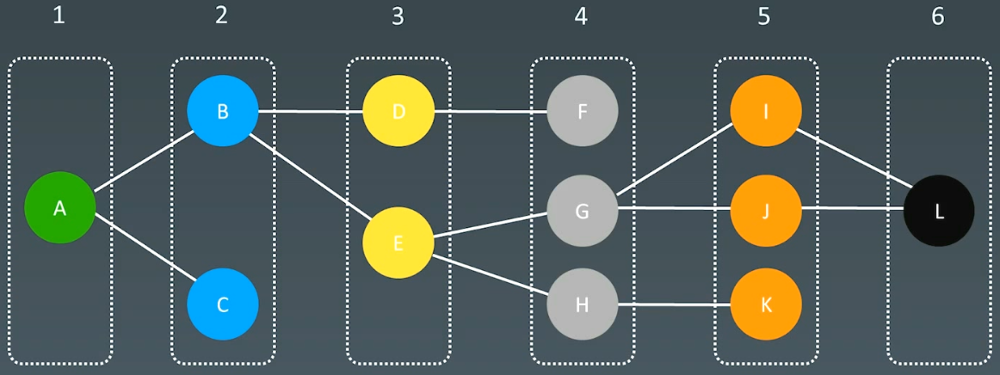

# 14.高级搜索

# 1.初级搜索

1.  朴素搜索
2.  优化方式：**不重复（fibonacci）**、**剪枝（生成括号问题）**
3.  搜索方向：
    1.  BFS：深度优先搜索  (depth first search)，栈
    2.  BFS：广度优先搜索 (breadth first search)，队列
4.  高级搜索：双向搜索、启发式搜索（优先队列）

Coin change（零钱置换）的状态树


DFS代码 - 递归写法

```python
visited = set()

def dfs(node, visited):
  # terminator
  if node in visited:
    return
    
  visited.add(node)
  
  # process currend node here
  ...
  
  for next_node in node.children():
    if not next_node in visited:
      dfs(next_node, visited)
```

DFS代码 - 非递归写法

```python
def dfs(self, tree):
  if tree.root is None:
    return []
    
  visited, stack = [], [tree.root]
  
  while stack:
    node = stack.pop()
    visited.add(node)
    
    process(node)
    nodes = generate_related_nodes(node)
    stack.push(nodes)
    
  # other processing work
  ...

```

BFS代码&#x20;

```python
def bfs(graph, start, end):
  
  queue = []
  queue.append([start])
  visited.add(start)
  
  while queue:
    node = queue.pop()
    visited.add(node)
    
    process(node)
    nodes = generate_related_nodes(node)
    queue.push(nodes)
    
  # other processing work
  ...
```

# 2.剪枝

-   [AlphaZero Explained](https://nikcheerla.github.io/deeplearningschool/2018/01/01/AlphaZero-Explained/ "AlphaZero Explained")
-   [棋类复杂度](https://en.wikipedia.org/wiki/Game_complexity "棋类复杂度")

## 2.1回溯法

回溯法采用试错的思想，它尝试分步的去解决一个问题。在分步解决问题的过程中，当它通过尝试发现现有的分步答案不能得到有效的正确的解答的时候，它将取消上一步甚至是上几步的计算，再通过其它的可能的分步解答再次尝试寻找问题的答案.

回溯法通常用最简单的递归方法来实现，在反复重复上述的步骤后可能出现两种情况

-   找到一个可能存在的正确的答案
-   在尝试了所有可能的分步方法后宣告该问题没有答案

在最坏的情况下，回溯法会导致一次复杂度为指数时间的计算

## 2.2 实战题目

### （1）括号生成

[22. 括号生成 - 力扣（LeetCode）](https://leetcode.cn/problems/generate-parentheses/ "22. 括号生成 - 力扣（LeetCode）")

```bash
数字 n 代表生成括号的对数，请你设计一个函数，用于能够生成所有可能的并且 有效的 括号组合。
```

```c++
class Solution {
public:
    // 递归
    // 左括号: 随时加，只要不超标
    // 右括号 : 必须之前有左括号，且左括号个数 > 右括号个数
    vector<string> generateParenthesis(int n) {
        result.clear();
        this->_generate(0, 0, n, "");
        return result;
    }

    void _generate(int left, int right, int num, std::string s) {
        // 1.terminator
        if (left == num && right == num) {
            result.emplace_back(s);
            // std::cout << s << std::endl;
            return;
        }

        // 2.process current logic

        // 3.drill down
        // 剪枝
        if (left < num)
            this->_generate(left + 1, right, num, s + "(");
        
        if (left > right)
            this->_generate(left, right + 1, num, s + ")");

        // 4.reverse states
    }
private:
    std::vector<std::string> result;
};
```

### （2）有效数独

[36. 有效的数独 - 力扣（LeetCode）](https://leetcode.cn/problems/valid-sudoku/description/ "36. 有效的数独 - 力扣（LeetCode）")

```bash
请你判断一个 9 x 9 的数独是否有效。只需要 根据以下规则 ，验证已经填入的数字是否有效即可。

- 数字 1-9 在每一行只能出现一次。
- 数字 1-9 在每一列只能出现一次。
- 数字 1-9 在每一个以粗实线分隔的 3x3 宫内只能出现一次。（请参考示例图）
 

注意：

一个有效的数独（部分已被填充）不一定是可解的。
只需要根据以上规则，验证已经填入的数字是否有效即可。
空白格用 '.' 表示。

```

可以使用哈希表记录每一行、每一列和每一个小九宫格中，每个数字出现的次数。只需要遍历数独一次，在遍历的过程中更新哈希表中的计数，并判断是否满足有效的数独的条件即可。

对于数独的第 i 行第 j 列的单元格，其中 $0≤i,j<9$，该单元格所在的行下标和列下标分别为 i 和 j，该单元格所在的小九宫格的行数和列数分别为 $i/3$和 $j/3$，其中 $0 ≤  i/3, j/3 < 3.$

```c++
class Solution {
public:
    bool isValidSudoku(vector<vector<char>>& board) {
        // 使用哈希表记录每一行、每一列和每一个小九宫格中，每个数字出现的次数
        // 只需要遍历数独一次，在遍历的过程中更新哈希表中的计数，并判断是否满足有效的数独条件即可

        // 每一行的hash表
        int rows[9][9];
        // 每一列的hash表
        int columns[9][9];
        // 每一个小方格的hash表
        int subboxes[3][3][9];

        memset(rows, 0, sizeof(rows));
        memset(columns, 0, sizeof(columns));
        memset(subboxes, 0, sizeof(subboxes));

        for (int i = 0; i < 9; i++) {
            for (int j = 0; j < 9; j++) {
                char c = board[i][j];
                if (c != '.') {
                    int idx = c - '0' - 1;
                    rows[i][idx]++;
                    columns[j][idx]++;
                    subboxes[i / 3][j / 3][idx]++;

                    if (rows[i][idx] > 1 || columns[j][idx] > 1 || subboxes[i / 3][j / 3][idx] > 1) {
                        return false;
                    }
                }
            }
        }

        return true;
    }
};
```

### （3）解数独

[37. 解数独 - 力扣（LeetCode）](https://leetcode.cn/problems/sudoku-solver/description/ "37. 解数独 - 力扣（LeetCode）")

```c++
编写一个程序，通过填充空格来解决数独问题。

数独的解法需 遵循如下规则：

数字 1-9 在每一行只能出现一次。
数字 1-9 在每一列只能出现一次。
数字 1-9 在每一个以粗实线分隔的 3x3 宫内只能出现一次。（请参考示例图）
数独部分空格内已填入了数字，空白格用 '.' 表示。
```

DFS + 回溯

```c++
class Solution {
public:
    void solveSudoku(vector<vector<char>>& board) {
        if (board.size() == 0) {
            return;
        }

        this->dfs(board);
    }
private:
    bool dfs(vector<vector<char>>& board) {
        for (int i = 0; i < board.size(); i++) {
            for (int j = 0; j < board[0].size(); j++) {
                if (board[i][j] == '.') {
                    // 尝试放入 1~9
                    for (char c = '1'; c <= '9'; c++) {
                        // i, j位置放入c
                        board[i][j] = c;
                        // 判断数独是否有效
                        if (this->isValidSudoku(board) && this->dfs(board))
                            return true;
                        // 回溯
                        board[i][j] = '.';
                    }

                    return false;
                }
            }
        }

        return true;
    }


    bool isValidSudoku(vector<vector<char>>& board) {
        // 使用哈希表记录每一行、每一列和每一个小九宫格中，每个数字出现的次数
        // 只需要遍历数独一次，在遍历的过程中更新哈希表中的计数，并判断是否满足有效的数独条件即可

        // 每一行的hash表
        int rows[9][9];
        // 每一列的hash表
        int columns[9][9];
        // 每一个小方格的hash表
        int subboxes[3][3][9];

        memset(rows, 0, sizeof(rows));
        memset(columns, 0, sizeof(columns));
        memset(subboxes, 0, sizeof(subboxes));

        for (int i = 0; i < 9; i++) {
            for (int j = 0; j < 9; j++) {
                char c = board[i][j];
                if (c != '.') {
                    int idx = c - '0' - 1;
                    rows[i][idx]++;
                    columns[j][idx]++;
                    subboxes[i / 3][j / 3][idx]++;

                    if (rows[i][idx] > 1 || columns[j][idx] > 1 || subboxes[i / 3][j / 3][idx] > 1) {
                        return false;
                    }
                }
            }
        }

        return true;
    }
};
```

# 3.双向BFS

BFS


BFS Levels



Two-ended BFS 双向BFS


# 4.启发式搜索  Heuristic Search（A \*）

本质：通过优先级不断的找

## 4.1 代码模板

BFS代码：

```python
def bfs(graph, start, end):
  
  queue = []
  queue.append([start])
  visited.add(start)
  
  while queue:
    # can we add more intelligence here?
    node = queue.pop()
    visited.add(node)
    
    process(node)
    nodes = generate_related_nodes(node)
    queue.push(nodes)
    
  # other processing work
  ...
```

A\* search

```python
def AstarSearch(graph, start, end):
  
  pq = collections.priority_queue()   # 优先级 -> 估价函数
  queue.append([start])
  visited.add(start)
  
  while queue:
    # can we add more intelligence here?
    node = pq.pop()
    visited.add(node)
    
    process(node)
    nodes = generate_related_nodes(node)
    unvisited = [node for node in nodes if node not in visited]
    pq.push(unvisited)
    
  # other processing work
  ...
```

## 4.2 估价函数

启发式函数 ： `h(n)`，它用来评价哪些结点最有希望的是一个我们要找的结点，`h(n)` 会返回一个非负实数,也可以认为是从结点n的目标结点路径的估计成本。

启发式函数是一种**告知搜索方向**的方法。它提供了一种明智的方法来猜测哪个邻居结点会导向一个目标。

## 4.3 例题

### （1）二进制矩阵中的最短路径

[1091. 二进制矩阵中的最短路径 - 力扣（LeetCode）](https://leetcode.cn/problems/shortest-path-in-binary-matrix/description/ "1091. 二进制矩阵中的最短路径 - 力扣（LeetCode）")

```bash
给你一个 n x n 的二进制矩阵 grid 中，返回矩阵中最短 畅通路径 的长度。如果不存在这样的路径，返回 -1 。

二进制矩阵中的 畅通路径 是一条从 左上角 单元格（即，(0, 0)）到 右下角 单元格（即，(n - 1, n - 1)）的路径，该路径同时满足下述要求：

- 路径途经的所有单元格的值都是 0 。
- 路径中所有相邻的单元格应当在 8 个方向之一 上连通（即，相邻两单元之间彼此不同且共享一条边或者一个角）。

畅通路径的长度 是该路径途经的单元格总数。
```

1.  DP
2.  BFS
3.  A\*

#### BFS实现

```python
class Solution:
    def shortestPathBinaryMatrix(self, grid: List[List[int]]) -> int:
        # q ： row, col, 步数
        q, n = [(0, 0, 2)], len(grid)
        if grid[0][0] or grid[-1][-1]:
            return -1
        elif n <= 2:
            return n
        
        dx = [-1, -1, -1, 0, 0, 1, 1, 1]
        dy = [-1, 0, 1, -1, 1, -1, 0, 1]
        for i, j ,d in q:
            # current node : i, j, distance = d
            for k in range(len(dx)):
                x = i + dx[k]
                y = j + dy[k]
                if 0 <= x < n and 0 <= y < n and not grid[x][y]:
                    if x == n - 1 and y == n - 1:
                        return d
                    q += [(x, y, d + 1)]
                    # 点已经被访问过了
                    grid[x][y] = 1

        return -1
```

#### A\* search

-   [相似度测量方法](https://dataaspirant.com/2015/04/11/five-most-popular-similarity-measures-implementation-in-python/ "相似度测量方法")
-   [二进制矩阵中的最短路径的 A\* 解法](https://leetcode.com/problems/shortest-path-in-binary-matrix/discuss/313347/A*-search-in-Python "二进制矩阵中的最短路径的 A* 解法")
-   [8 puzzles 解法比较](https://zxi.mytechroad.com/blog/searching/8-puzzles-bidirectional-astar-vs-bidirectional-bfs/ "8 puzzles 解法比较")

估值函数

```bash
h(current_point) = dist(curr_point, desttination_point)
```

### （2）滑动谜题

[8 puzzles 解法比较](https://zxi.mytechroad.com/blog/searching/8-puzzles-bidirectional-astar-vs-bidirectional-bfs/ "8 puzzles 解法比较")

[773. 滑动谜题 - 力扣（LeetCode）](https://leetcode.cn/problems/sliding-puzzle/description/ "773. 滑动谜题 - 力扣（LeetCode）")

```bash
在一个 2 x 3 的板上（board）有 5 块砖瓦，用数字 1~5 来表示, 以及一块空缺用 0 来表示。一次 移动 定义为选择 0 与一个相邻的数字（上下左右）进行交换.

最终当板 board 的结果是 [[1,2,3],[4,5,0]] 谜板被解开。

给出一个谜板的初始状态 board ，返回最少可以通过多少次移动解开谜板，如果不能解开谜板，则返回 -1 。
```

1.  DFS
2.  BFS - 更快找到最优解
3.  A\*

#### BFS代码

```python
class Solution:
    def slidingPuzzle(self, board: List[List[int]]) -> int:
        # 方向向量
        # 如果0位于下标0位置，则可以向下标1和下标3互换位置
        # 如果0位于下标1位置，则可以向下标0、下标2和下标4互换位置
        moves = [[1, 3], [0, 2, 4], [1, 5], [0, 4], [1, 3, 5], [2, 4]]
    
        initial = "".join(str(c) for row in board for c in row)
        if initial == "123450":
            return 0
        # 访问过的字符串
        used = set()
        # [字符，步数] [s, cnt]
        q = deque([(initial, 0)])
        used.add(initial)
        while q:
            s, cnt = q.popleft()
            used.add(s)
            if s == "123450":
                return cnt
            # 将字符串变为列表，方便交换
            arr = [c for c in s]
            # 开始移动0
            zero_idx = s.index('0')
            for move in moves[zero_idx]:
                # copy一份
                new_arr = arr[:]
                # 交换
                new_arr[zero_idx], new_arr[move] = new_arr[move], new_arr[zero_idx]
                new_s = "".join(new_arr)
                if new_s not in used:
                    q.append((new_s, cnt + 1))

        return -1
```

```c++
class Solution {
public:
    int slidingPuzzle(vector<vector<int>>& board) {
        std::string init_str;
        for (auto& b : board) {
            for (auto& c : b) {
                init_str += char(c + '0');
            }
        }
        std::string end_str = "123450";

        // [string, count]
        std::queue<std::pair<std::string, int>> queue;
        queue.emplace(init_str, 0);
        // 访问过的字符串
        std::unordered_set<std::string> used = {init_str};

        while (!queue.empty()) {
            auto [str, cnt] = queue.front();
            queue.pop();
            used.insert(str);
            if (str == end_str) {
                return cnt;
            }
            // 字符串变为列表，方便操作
            std::vector<int> arr_str;
            int zero_idx = -1;
            for (int i = 0; i < str.size(); i++) {
                char c = str[i];
                if (c == '0') {
                    zero_idx = i;
                }
                arr_str.push_back(int(c - '0'));
            }
            // 开始移动0
            for (auto& move : m_moves[zero_idx]) {
                std::vector<int> new_arr = arr_str;
                // 交换
                int tmp = new_arr[zero_idx];
                new_arr[zero_idx] = new_arr[move];
                new_arr[move] = tmp;

                // 移动完成，变为字符串
                std::string new_s;
                for (auto& c : new_arr) {
                    new_s += char(c + '0');
                }
                
                // 如果在访问字符串中没有，则加入队列
                if (!used.count(new_s)) {
                    queue.emplace(new_s, cnt + 1);
                }

            }
        }

        return -1;
    }
private:
    // 方向向量
    // 如果0位于下标0位置，则可以向下标1和下标3互换位置
    // 如果0位于下标1位置，则可以向下标0、下标2和下标4互换位置
    std::vector<std::vector<int>> m_moves = {{1, 3}, {0, 2, 4}, {1, 5}, {0, 4}, {1, 3, 5}, {2, 4}};

};
```

#### A\*

```python
class AStar:
    DIST = [
        [0, 1, 2, 1, 2, 3],
        [1, 0, 1, 2, 1, 2],
        [2, 1, 0, 3, 2, 1],
        [1, 2, 3, 0, 1, 2],
        [2, 1, 2, 1, 0, 1],
        [3, 2, 1, 2, 1, 0],
    ]
    # 计算启发函数
    @staticmethod
    def get_h(s : str) -> int:
        ret = 0
        for i in range(6):
            if s[i] != "0":
                ret += AStar.DIST[i][int(s[i]) - 1]
        return ret
    
    def __init__(self, s : str, cnt : str) -> None:
        self.s = s
        self.cnt = cnt
        self.h = AStar.get_h(s)
        self.f = self.cnt + self.h
    
    def __lt__(self, other:"AStar") -> bool:
        return self.f < other.f

class Solution:
    # BFS
    def slidingPuzzle(self, board: List[List[int]]) -> int:
        # 方向向量
        # 如果0位于下标0位置，则可以向下标1和下标3互换位置
        # 如果0位于下标1位置，则可以向下标0、下标2和下标4互换位置
        moves = [[1, 3], [0, 2, 4], [1, 5], [0, 4], [1, 3, 5], [2, 4]]
    
        initial = "".join(str(c) for row in board for c in row)
        end_state = "123450"
        if initial == end_state:
            return 0
        # 访问过的字符串
        used = set()
        # [字符，步数] [s, cnt]
        q = [AStar(initial, 0)]
        used.add(initial)
        while q:
            node = heapq.heappop(q)
            s = node.s
            cnt = node.cnt
            used.add(s)
            if s == end_state:
                return cnt
            # 将字符串变为列表，方便交换
            arr = [c for c in s]
            # 开始移动0
            zero_idx = s.index('0')
            for move in moves[zero_idx]:
                # copy一份
                new_arr = arr[:]
                # 交换
                new_arr[zero_idx], new_arr[move] = new_arr[move], new_arr[zero_idx]
                new_s = "".join(new_arr)
                if new_s not in used:
                    # q.append((new_s, cnt + 1))
                    heapq.heappush(q, AStar(new_s, cnt + 1))

        return -1
```
