# 15.红黑树和AVL树

# 0.复习

### 树

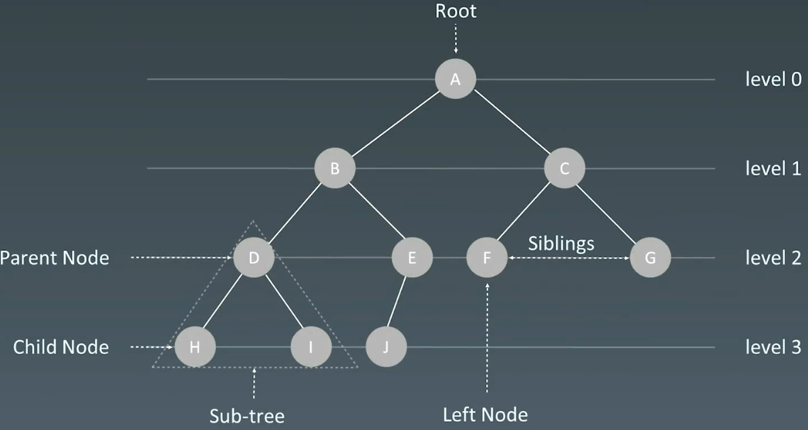

### 二叉树

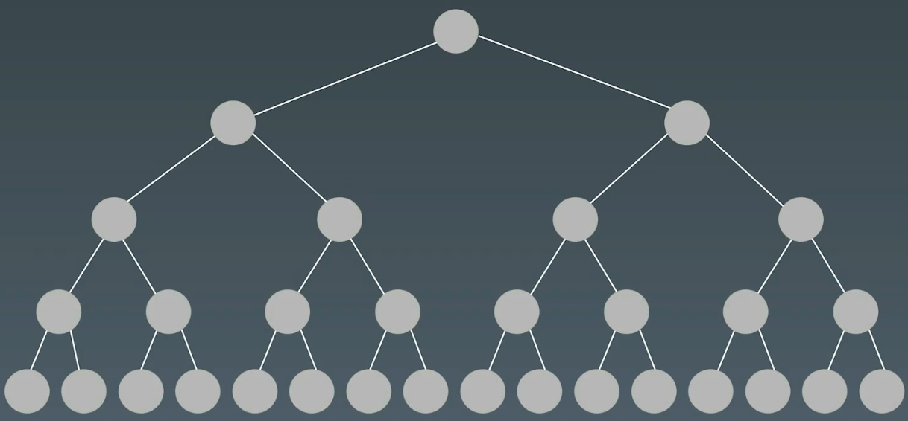

### 二叉树遍历

-   前序（pre-order）：根 → 左 → 右
-   中序（in-order）：左 → 根 → 右
-   后序（post-order）：左 → 右 → 根

```python
def preorder(self, root):
  if root:
    self.traverse_path.append(root, val)
    self.preorder(root.left)
    self.preorder(root.right)

```

```python
def inorder(self, root):
  if root:
    self.inorder(root.left)
    self.traverse_path.append(root, val)
    self.inorder(root.right)
```

```python
def postorder(self, root):
  if root:
    self.postorder(root.left)
    self.postorder(root.right)
    self.traverse_path.append(root, val)
```

### 二叉搜索树 Binary Search Tree

二叉搜索树，也称二又搜索树、有序二叉树 (Ordered Binary Tree) 、排序二叉树 (Sorted Binary Tree) ，是指一棵空树或者具有下列性质的二叉树:

1.  左子树上**所有结点**的值均小于它的根结点的值
2.  右子树上**所有结点**的值均大于它的根结点的值
3.  以此类推:左、右子树也分别为二叉查找树。(这就是 重复性!)

中序遍历: 升序排列

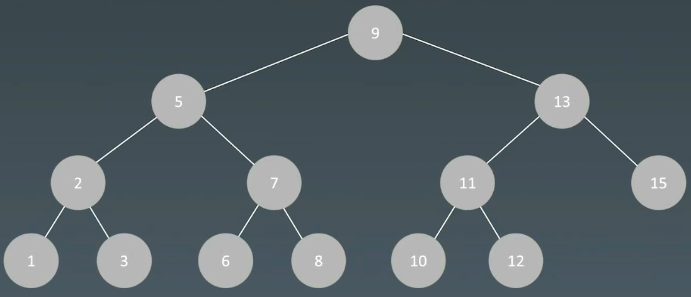

### 保证性能的关键

[Self-balancing binary search tree - Wikipedia](https://en.wikipedia.org/wiki/Self-balancing_binary_search_tree "Self-balancing binary search tree - Wikipedia")

1.  保证二维维度  → 左右子树结点平衡 （recursively）
2.  Balanced（平衡二叉树有很多种，面试主要AVL和红黑树，还有treap及伸展树）

# 1.AVL树

发明者 G.M.Adelson-Velsky 和 Evgenii Landis

## 1.1 概念

1.  Balance Factor（平衡因子）：是它的左右子树的高度减去它的右子树高度（有时相反）。$balance ~factor = \{-1, 0, 1\}$
2.  通过旋转操作来进行平衡（四种）

记录左右子树高度

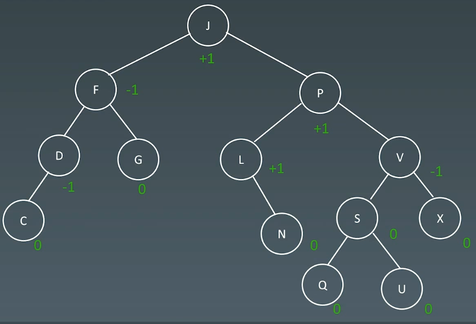

增加14

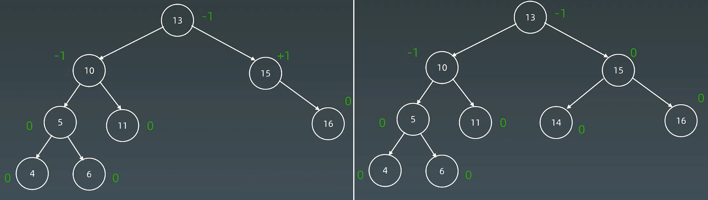

增加3

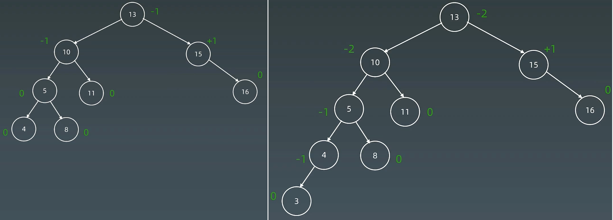

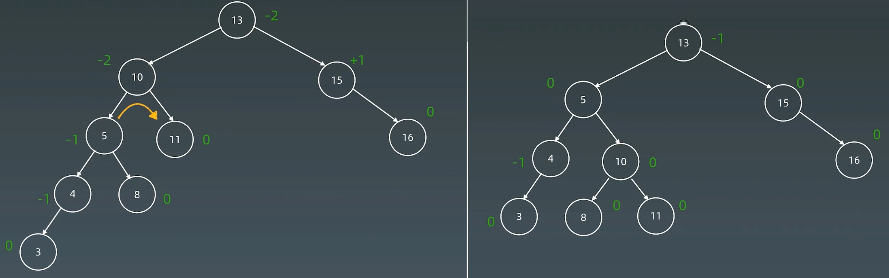

## 1.2 旋转操作

1.  左旋
2.  右旋
3.  左右旋
4.  右左旋

**关键技巧：**

-   中值为根，然后将子树拆分挂到对应位置，
-   最后再根据二叉排序树的左小右大的规则拼凑起来。

**最关键核心的操作就是****让失衡根结点转换成中间值的孩子****。拆的时候是根据做小右大的规则进行拆，挂的时候也是根左小右大的规则进行挂。**

**LR和RL进行转换，将其利用LL和RR将其转换成LL或者RR。**

### （1） 右右子树 → 左旋

插入位置是失衡根结点的左子树的左子树。

**调整方法**：**最小子树A的左孩子右上旋转**。

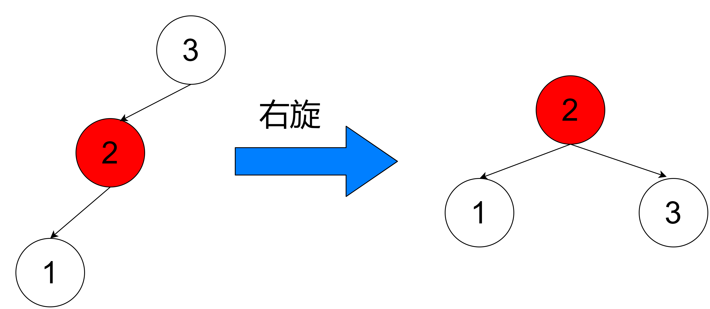

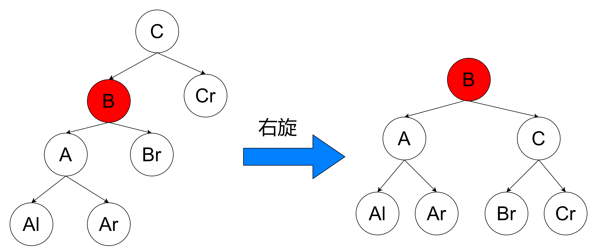

### （2）左左子树 → 右旋

插入位置是失衡结点的右子树的右子树。

**调整方法**：**最小子树A的右孩子左上旋转**。

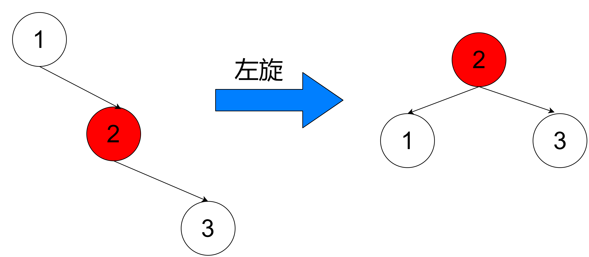

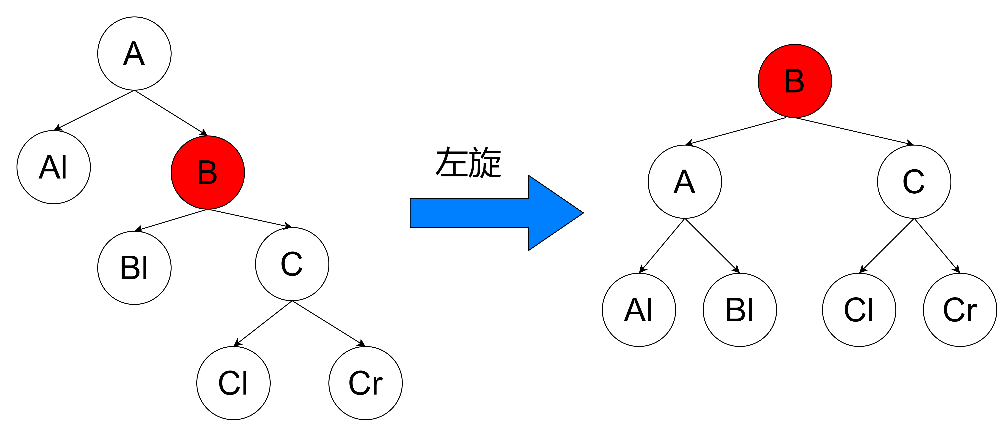

### （3）左右子树 → 左右旋

插入位置是失衡结点的左子树的右子树。**（****关键是将R变成L,LL****）**

**调整方法**：**最小子树A的左孩子的右孩子，先左上旋转再右上旋转**。

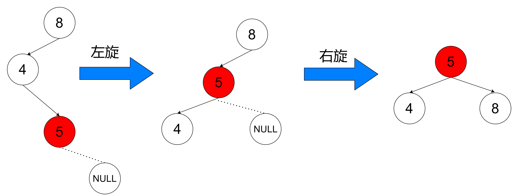

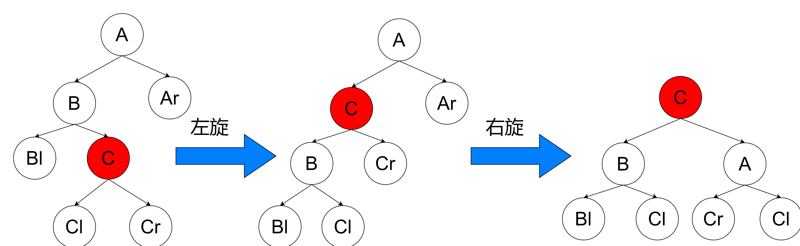

### （4）右左子树 → 右左旋

插入位置是失衡结点的右子树的左子树。**(****关键是将L变成R，RR****)**

**调整方法**：**最小子树A的右孩子的左孩子，先****右上****旋转再左上旋转**。

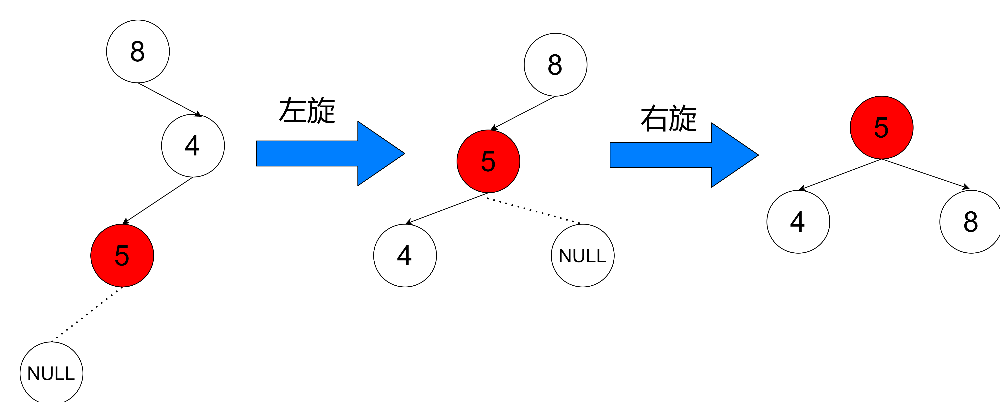

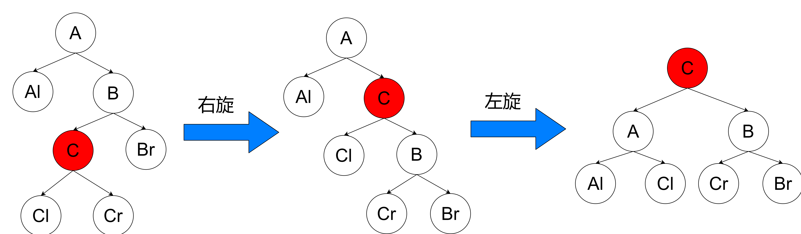

## 1.3 AVL总结

1.  平衡二又搜索树
2.  每个结点存 $balance ~factor =\{-1,0,1\}$
3.  四种旋转操作

不足 :  结点需要存储额外信息、且调整次数频繁

# 3.红黑树（Red-black Tree）

近似平衡二叉树

## 3.1 概念

红黑树是一种**近似平衡**的二又搜索树( Binary Search Tree)，它能够确保任何一个结点的左右子树的**高度差小于两倍**。具体来说，红黑树是满足如下条件的二叉搜索树：

-   每个结点要么是红色，要么是黑色
-   根结点是黑色
-   每个叶结点 (NIL结点，空结点) 是黑色的。
-   不能有相邻接的两个红色结点
-   从任一结点到其每个叶子的所有路径都包含相同数目的黑色结点。

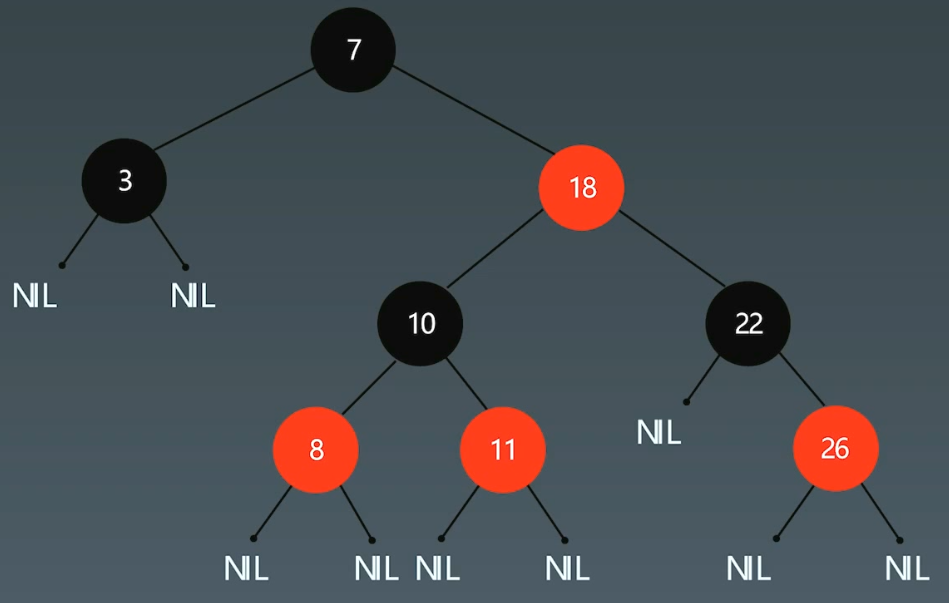

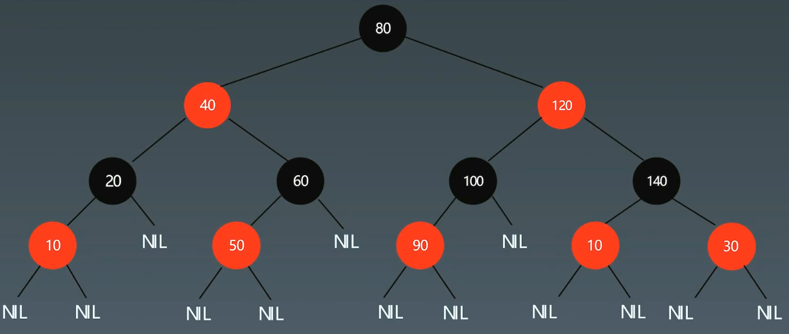

## 3.2 关键性质

从根到叶子的最长的可能路径不多于最短的可能路径的两倍长。

# 4.对比

-   AVL trees provide **faster lookups** than Red Black Trees because they are **more strictl
    balanced**
-   Red Black Trees provide **faster insertion and removal** operations than AVL trees as
    fewer rotations are done due to relatively relaxed balancing.
-   AVL trees store balance **factors or heights** with each node, thus requires storage for
    an integer per node whereas Red Black Tree requires only 1 bit of information per
    node.
-   Red Black Trees are used in most of the **language libraries**. like **map, multimap, multisetin C++** whereas AVL trees are used in **databases** where faster retrievals are required.
