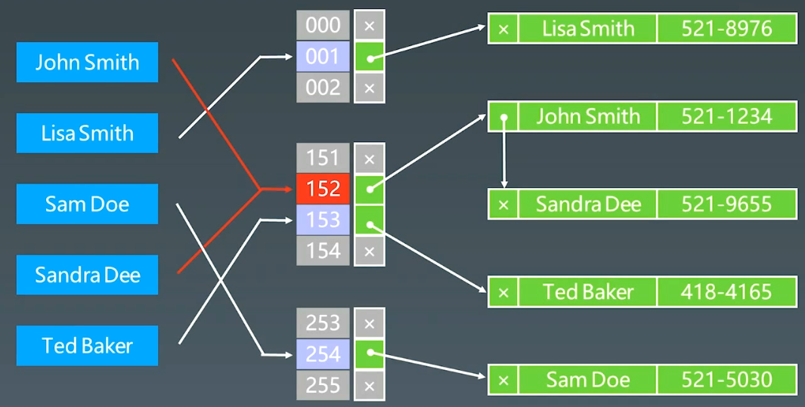
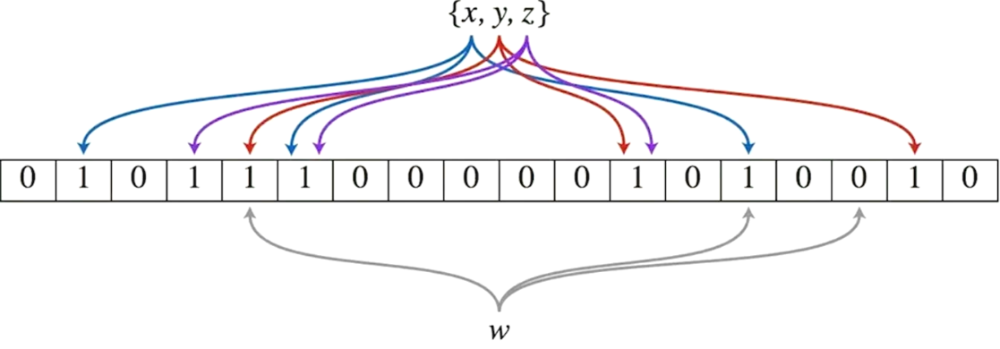
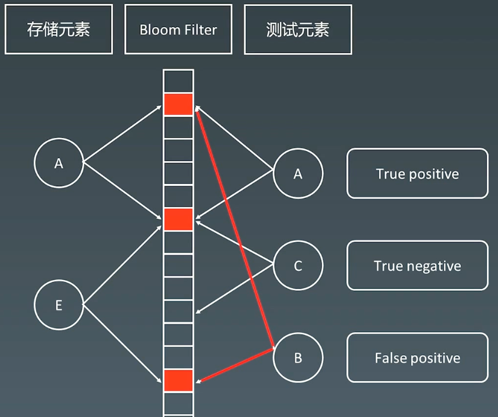
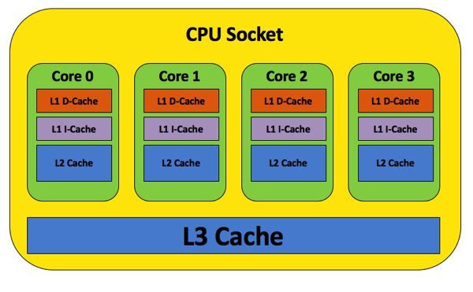
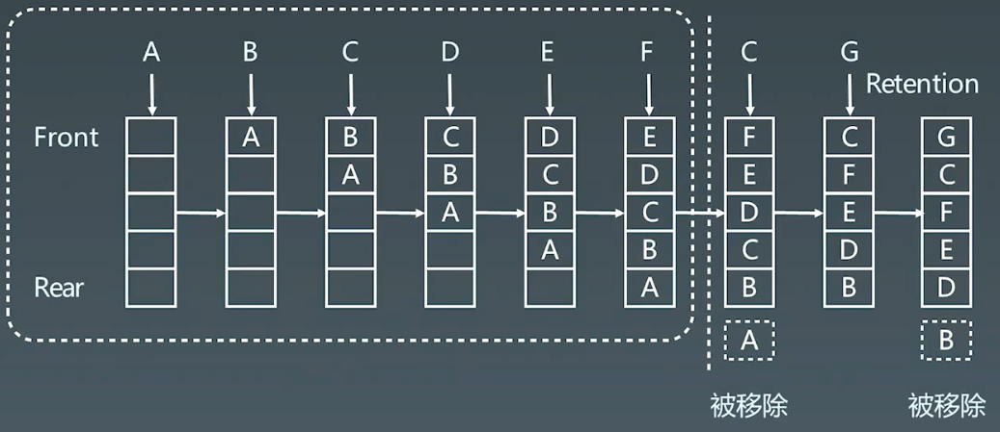
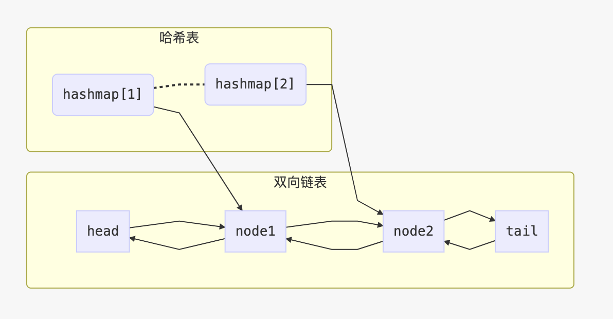

# 17.布隆过滤器和LRU缓存

# 1.布隆过滤器（Bloom Filter）

## 1.1 HashTable + 拉链存储重复元素



实际应用时，更多需要存储 **有还是没有**，hashtable中存储有大量信息，比较占内存

## 1.2 Bloom Filter

一个很长的二进制向量和一系列随机映射函数。布隆过滤器可以**用于检索一个元素是否在一个集合中。**

优点是**空间效率和查询时间都远远超过一般的算法**

缺点是有一定的误识别率和删除困难



插入AE元素，当测试B元素时，发现映射的二进制位为1，出现误识别；

-   当元素对应的二进制位为1时，此元素可能存在在布隆过滤器中；
-   当元素对应的二进制位有一个为0时，此元素不可能在布隆过滤器中；



布隆**过滤器一般放在外面当一个缓存使用，做一个快速的判断**；当B在布隆过滤器中查询到，会到DB中去查找数据。

## 1.3 案例

1.  比特币
2.  分布式系统（Map-Reduce） - Hadoop、search engin
3.  Redis缓存
4.  垃圾邮件、评论过滤

-   [布隆过滤器的原理和实现](https://www.cnblogs.com/cpselvis/p/6265825.html "布隆过滤器的原理和实现")
-   [使用布隆过滤器解决缓存击穿、垃圾邮件识别、集合判重](https://blog.csdn.net/tianyaleixiaowu/article/details/74721877 "使用布隆过滤器解决缓存击穿、垃圾邮件识别、集合判重")

## 1.4 实现

-   [布隆过滤器 Python 实现示例](https://www.geeksforgeeks.org/bloom-filters-introduction-and-python-implementation/ "布隆过滤器 Python 实现示例")
-   [高性能布隆过滤器 Python 实现示例](https://github.com/jhgg/pybloof "高性能布隆过滤器 Python 实现示例")
-   [布隆过滤器 Java 实现示例 1](https://github.com/lovasoa/bloomfilter/blob/master/src/main/java/BloomFilter.java "布隆过滤器 Java 实现示例 1")
-   [布隆过滤器 Java 实现示例 2](https://github.com/Baqend/Orestes-Bloomfilter "布隆过滤器 Java 实现示例 2")

**python实现**

```python
from bitarray import bitarray
import mmh3

class BloomFilter:
    def __init__(self, size, hash_num):
        self.size = size
        self.hash_num = hash_num
        self.bit_array = bitarray(size)
        self.bit_array.setall(0)

    def add(self, s):
        for seed in range(self.hash_num):
            result = mmh3.hash(s, seed) % self.size
            self.bit_array[result] = 1


    def lookup(self, s):
        for seed in range(self.hash_num):
            result = mmh3.hash(s, seed) % self.size
            if self.bit_array[result] == 0:
                return "None"
        return "Probably"
    

bf = BloomFilter(500000, 7)
bf.add("12345")
print(bf.lookup("12345"))
print(bf.lookup("123456"))
```

# 2.LRU cache

## 2.1 Cache缓存

-   [Understanding the Meltdown exploit](https://www.sqlpassion.at/archive/2018/01/06/understanding-the-meltdown-exploit-in-my-own-simple-words/ "Understanding the Meltdown exploit")

cpu socket



## 2.2 LRU Cache

-   两个要素：大小、替换策略
-   Hash Table + Double Linklist
-   `O(1)`查询
-   `O(1)`修改、更新



## 2.2 替换策略

-   [替换算法总揽](https://en.wikipedia.org/wiki/Cache_replacement_policies "替换算法总揽")
-   LFU - least frequently used
-   LRU - least recently used

## 2.3 实战题目

### （1）LRU缓存

[146. LRU 缓存 - 力扣（LeetCode）](https://leetcode.cn/problems/lru-cache/ "146. LRU 缓存 - 力扣（LeetCode）")

```bash
请你设计并实现一个满足  LRU (最近最少使用) 缓存 约束的数据结构。
实现 LRUCache 类：
- LRUCache(int capacity) 以 正整数 作为容量 capacity 初始化 LRU 缓存
- int get(int key) 如果关键字 key 存在于缓存中，则返回关键字的值，否则返回 -1 。
- void put(int key, int value) 如果关键字 key 已经存在，则变更其数据值 value ；如果不存在，则向缓存中插入该组 key-value 。如果插入操作导致关键字数量超过 capacity ，则应该 逐出 最久未使用的关键字。
函数 get 和 put 必须以 O(1) 的平均时间复杂度运行。
```



```c++
class LRUCache {
public:
    using Pair = std::pair<int, int>;
    using List = std::list<Pair>;
    using Map = std::unordered_map<int, typename List::iterator>;

    LRUCache(int capacity) {
        m_capacity = capacity;
    }
    
    int get(int key) {
        // 查找key是否在哈希表中
        typename Map::iterator map_itor = m_map.find(key);
        // 不存在，返回-1
        if (map_itor == m_map.end())
            return -1;

        // 如果存在
        // 1.链表要将数据删除
        // 2.在将数据加入到链表队头
        // 目的是为了维护链表队头的hi最近访问的数据

        // 取出哈希表的value值，也就是链表节点
        typename List::iterator list_itor = map_itor->second;

        // 创建新的键值对
        std::pair<int, int> list_pair = std::make_pair(list_itor->first, list_itor->second);

        // 从链表中删除该节点
        m_list.erase(list_itor);

        // 将数据加入到队头
        m_list.push_front(list_pair);

        // 更新哈希表
        m_map[key] = m_list.begin();

        return list_pair.second;
    }
    
    void put(int key, int value) {
        // 查找key是否在哈希表中
        typename Map::iterator itor = m_map.find(key);
        // 如果存在，则要将老数据从哈希表和链表中移除
        if (itor != m_map.end())
        {
            m_list.erase(itor->second);
            m_map.erase(itor);
        }

        // 插入到链表头
        m_list.push_front(std::make_pair(key, value));
        // 将链表头放入hash表中
        m_map[key] = m_list.begin();

        // 当链表大小超过阈值后，删除
        if (m_list.size() > m_capacity)
        {
            int end_key = m_list.back().first;
            m_list.pop_back();
            m_map.erase(end_key);
        }
    }
private:
    int m_capacity;
    List m_list;
    Map m_map;
};
```

```python
class DLinkedNode:
    def __init__(self, key=0, value=0):
        self.key = key
        self.value = value
        self.prev = None
        self.next = None


class LRUCache:

    def __init__(self, capacity: int):
        self.cache = dict()
        # 使用伪头部和伪尾部节点    
        self.head = DLinkedNode()
        self.tail = DLinkedNode()
        self.head.next = self.tail
        self.tail.prev = self.head
        self.capacity = capacity
        self.size = 0

    def get(self, key: int) -> int:
        if key not in self.cache:
            return -1
        # 如果 key 存在，先通过哈希表定位，再移到头部
        node = self.cache[key]
        self.moveToHead(node)
        return node.value

    def put(self, key: int, value: int) -> None:
        if key not in self.cache:
            # 如果 key 不存在，创建一个新的节点
            node = DLinkedNode(key, value)
            # 添加进哈希表
            self.cache[key] = node
            # 添加至双向链表的头部
            self.addToHead(node)
            self.size += 1
            if self.size > self.capacity:
                # 如果超出容量，删除双向链表的尾部节点
                removed = self.removeTail()
                # 删除哈希表中对应的项
                self.cache.pop(removed.key)
                self.size -= 1
        else:
            # 如果 key 存在，先通过哈希表定位，再修改 value，并移到头部
            node = self.cache[key]
            node.value = value
            self.moveToHead(node)
    
    def addToHead(self, node):
        node.prev = self.head
        node.next = self.head.next
        self.head.next.prev = node
        self.head.next = node
    
    def removeNode(self, node):
        node.prev.next = node.next
        node.next.prev = node.prev

    def moveToHead(self, node):
        self.removeNode(node)
        self.addToHead(node)

    def removeTail(self):
        node = self.tail.prev
        self.removeNode(node)
        return node

```
