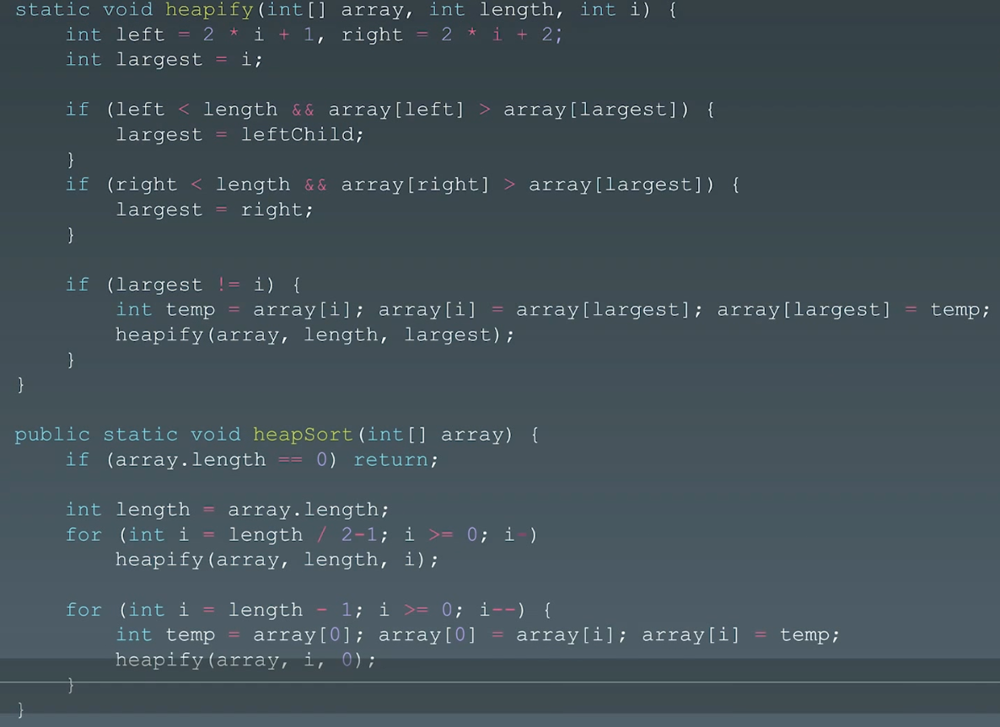

# 18.排序算法

# 1.排序算法

[912. 排序数组 - 力扣（LeetCode）](https://leetcode.cn/problems/sort-an-array/description/ "912. 排序数组 - 力扣（LeetCode）")

-   [十大经典排序算法](https://www.cnblogs.com/onepixel/p/7674659.html "十大经典排序算法")
-   [9 种经典排序算法可视化动画](https://www.bilibili.com/video/av25136272 "9 种经典排序算法可视化动画")
-   [6 分钟看完 15 种排序算法动画展示](https://www.bilibili.com/video/av63851336 "6 分钟看完 15 种排序算法动画展示")

## 1.1 算法分类

### （1）比较类排序：

通过比较来决定元素间的相对次序，由于其时间复杂度不能突破 `O(nlogn)`，因此也称为非线性时间比较类排序。

### （2）非比较类排序：

不通过比较来决定元素间的相对次序，它可以突破基于比较类排序的时间下界，以线性时间运行，因此也被称为线性时间非比较类排序


## 1.2复杂度分析


# 2.初级排序 O(n^2)

1.  **选择排序（Selection Sort)** : 每次找最小值，然后放到待排序数组的起始位置
2.  \*\*插入排序 (Insertion Sort) \*\*: 从前到后逐步构建有序序列；对于未排序数据，在已排序序列中从后向前扫描，找到相应位置并插入。
3.  \*\*冒泡排序  (Bubble Sort) \*\*: 嵌套循环，每次查看相邻的元素如果逆序，则交换

## 2.1 选择排序

### （1）算法原理

-   每一趟在待排序元素中选取关键字最小（或最大）的元素加入有序子序列中
-   必须进行总共n-1趟处理


### （2）性能分析

**空间复杂度**：O(1)

**时间复杂度**

-   **最好**：原本有序O(n)
-   **最坏**：原本逆序O(n^2)
-   **平均**：O(n^2)

**稳定性**：稳定

### （3）代码实现

```c++
// 1. 选择排序 O(n^2)  超出时间限制
// 每一趟在待排序元素中选取关键字最小的元素加入有序子序列中
void select_sort(std::vector<int>& nums) {
    int len = nums.size();
    // 记录最小元素位置
    int min_idx = -1;
    // 遍历
    for (int i = 0; i < len; i++) {
        min_idx = i;
        // 选择最小元素
        for (int j = i + 1; j < len; j++) {
            if (nums[j] < nums[min_idx]) {
                min_idx = j;
            }
        }
        // 交换元素
        if (min_idx != i) {
            int tmp = nums[min_idx];
            nums[min_idx] = nums[i];
            nums[i] = tmp;
        }
    }
}
```

### （4）算法分析

表现最稳定的排序算法之一，因为无论什么数据进去都是O(n2)的时间复杂度，所以用到它的时候，数据规模越小越好。唯一的好处可能就是不占用额外的内存空间了吧。

## 2.2 插入排序

每次将一个待排序的记录按其关键字大小插入到前面已排好序的子序列中，直到全部记录插入完成。

### （1）性能分析

**空间复杂度**：O(1)

**时间复杂度**

-   **最好**：原本有序O(n)
-   **最坏**：原本逆序O(n^2)
-   **平均**：O(n^2)

**稳定性**：稳定


### （2）直接插入排序

顺序查找插入位置，**适用于顺序表、链表**

#### 算法思想

-   将0号位置放哨兵：要插入的元素
-   **每次将一个待排序的记录按其关键字插入到前面已排号的序列中**


#### 代码实现

```c++
// 2.1 直接插入排序 超时
// 将0号位置放哨兵：要插入的元素
// 每次将一个待排序的记录按其关键字插入到前面已排号的序列中
void inert_sort(std::vector<int>& nums) {
    int len = nums.size();
    if (len <= 1) {
        return;
    }
    // 依次将 2~n 插入到前面已排序的序列
    for (int i = 1; i < len; i++) {
        // i 小于前驱，将 i 插入有序表
        if (nums[i] < nums[i - 1]) {
            int tmp = nums[i];
            int j = i - 1;
            // 从后往前查找待插入得位置
            for (; j >=0 && tmp < nums[j]; j--) {
                // 向后移动元素
                nums[j + 1] = nums[j];
            }
            // 插入数据
            nums[j + 1] = tmp;
        }
    }
}
```

### （3）折半插入排序

折半查找找到应插入的位置，**仅适用于顺序表**

#### 算法思想

**折半查找**

-   在\[low, high]之间找目标关键字，每次检查 mid = (low + high)/2
-   根据mid所指示元素与目标关键字的大小调整low或high，不断缩小low和high的范围
-   若low > high，则查找失败

**注意**

一直到low>high时才停止折半查找。**当mid所指元素等于当前元素时，应继续令low=mid+1，以保证“稳定性”。** 最终应将当前元素插入到low所指的位置，即high+1.

#### 代码实现

```c++
// 2.2 折半插入排序 超时
void bin_insert_sort(std::vector<int>& nums) {
    int left, mid, right;
    for (int i = 1; i < nums.size(); i++) {
        int tmp = nums[i];

        left = 0;
        right = i - 1;
        // 查找
        while (left <= right) {
            mid = left + (right - left) / 2;
            // 查找左半部分
            if (nums[mid] > tmp) {
                right = mid - 1;
            } else {
                left = mid + 1;
            }
        }

        // 后移元素，空出插入位置
        // 注意范围，left指针指向选中的元素
        for (int j = i - 1; j >= left; j--) {
            nums[j + 1] = nums[j];
        }
        // 插入
        nums[left] = tmp;
    }
}
```

### （4）希尔排序

#### 算法思想

-   **先将排序表分割成若干如L\[i, i+d, i+2d, ..., i+kd] 的“特殊”子表，对各个子表进行直接插入排序**。
-   缩小增量d，重复上述过程，直到d=1为止。


#### 性能

-   **空间复杂度**：O(1)
-   **时间复杂度**：未知，但优于直接插入排序
-   **稳定性**：不稳定
-   **适应性**：仅可适用于顺序表


#### 代码实现

```c++
// 2.3 希尔排序
// 先将排序表分割成若干如L[i, i+d, i+2d, ..., i+kd] 的“特殊”子表，
// 对各个子表进行直接插入排序。
// 缩小增量d，重复上述过程，直到d=1为止。
void shell_sort(std::vector<int>& nums) {
    int len = nums.size();
    // 步长
    for (int dk = len / 2; dk >= 1; dk = dk / 2) {
        for (int i = dk + 1; i < len; i++) {
            if (nums[i] < nums[i - dk]) {
                // 将i插入有序增量子表
                int tmp = nums[i];
                // 元素后移
                int j = i - dk;
                for (; i > 0 && tmp < nums[j]; j -= dk) {
                    nums[j + dk] = nums[j];
                }
                // 插入
                nums[j + dk] = tmp;
            }
        }
    }
    }
```

## 2.3 冒泡排序

### （1）算法原理

-   从后往前（或从前往后）两两比较相邻元素的值，若为逆序，则交换它们，直到序列比较完。称这个过程为“一趟”冒泡排序，最多只需n-1趟排序
-   每一趟排序后都可以使一个元素的移动到最终位置，以确定最终位置的元素在之后的处理中无需对比
-   如果某一趟排序过程中未发生“交换”，则算法可以提前结束

    

### （2）性能

-   **空间复杂度**：O(1)
-   **时间复杂度**：
    -   最好（有序）：O(n)
    -   最差（逆序）：O(n^2)
    -   平均：O(n^2)
-   **稳定性**：稳定
-   **适用性**：顺序表、链表都可以


### （3）代码实现

```c++
// 2.4 冒泡排序 超时
// 从后往前（或从前往后）两两比较相邻元素的值，若为逆序，
// 则交换它们，直到序列比较完。称这个过程为“一趟”冒泡排序，
// 最多只需n-1趟排序

// 每一趟排序后都可以使一个元素的移动到最终位置，
// 以确定最终位置的元素在之后的处理中无需对比

// 如果某一趟排序过程中未发生“交换”，则算法可以提前结束
void bulle_sort(std::vector<int>& nums) {
    int len = nums.size();
    if (len <= 1) {
        return;
    }
    // 提前退出标志位
    bool flag = false;
    for (int i = 0; i < len; i++)
    {
        flag = false;
        for (int j = 0; j < len - i - 1; j++)
        {
            // 前面的元素比后面的大，交换顺序
            if (nums[j] > nums[j + 1])
            {
                int tmp = nums[j];
                nums[j] = nums[j + 1];
                nums[j + 1] = tmp;
                // 数据交换标志位
                flag = true;
            }
        }
        // 若没有数据交换，提前退出
        if (!flag)
            break;
    }
}
```

# 3.高级排序 O(N\*LogN)

## 3.1 快速排序 （Quick Sort）

### （1）算法思想

-   从待排序序列中任取一个元素为基准（枢轴）pivot
-   比它小的往前放，比它大的往后放，则pivot放在最中间位置，这个过程称为一趟快速排序
-   一次划分为左右两个子表，再分别递归两个子表重复上述过程，直到每个部分只有一个元素为止


### （2）实现

-   right直至指向表尾，left指针指向表头，left指向元素存为基准元素pivot
-   从right开始，向前比较，比基准大，right--，继续比较
-   若比基准小，则right所指元素移动到left的位置
-   再从left指针所指元素和基准元素比较，比基准小，left++，继续比较
-   若比基准大，则left所指元素移动到right位置
-   ......

当dk=1时，就是直接插入排序

### （3）性能

#### 空间复杂度

**最好情况**：树的高度与递归调用深度一样：$O(log_2n)$

**最坏情况**：n-1次调用，栈深度 n-1

**平均情况**：$O(log_2n)$

**空间复杂度 = 递归调用层数**

#### 时间复杂度

快速排序的时间复杂度 = O(n \* 递归层数)，运行时间与划分是否对称有关

**最好情况**：做平衡划分：$O(nlog_2n)$

**最坏情况**：发生在两个区域分别包括n-1个元素和0个元素

-   优化思路：尽量选取数组在中间的元素，从头尾各去一个，它们的中间值作为枢轴元素；或从表中随机选取；

**平均情况**：$O(nlog_2n)$

**快速排序是所有内部排序算法中平均性能最优的**

#### 稳定性

不稳定

#### 适用性

仅适用于线性表为顺序存储的情况

#### 说明

-   一次划分：确定一个元素的最终位置
-   一趟排序：可能确定多个元素的最终位置


### （4）代码实现

```c++
// 3.1 快速排序
// 一次划分区间
int partite_region(std::vector<int>& nums, int left, int right)
{
    // 当前表的第一个元素作为枢轴，对其划分
    int pivot = nums[left];
    // 循环条件
    while (left < right)
    {
        // high向前寻找比枢轴点小的元素
        while (left < right && nums[right] > pivot)
            right--;
        // 将此小的元素移动到枢轴点左端
        nums[left] = nums[right];
        // low向后寻找比枢轴点大的元素
        while (left < right && nums[left] <= pivot)
            left++;
        // 将此大的元素移动到枢轴点右端
        nums[right] = nums[left];
    }
    // 枢轴点元素放到最终位置
    nums[left] = pivot;
    // 放回枢轴点元素
    return left;
}
void quick_sort(std::vector<int>& nums, int left, int right)
{
    if (left < right)
    {
        // 划分区间
        int pivot_pos = partite_region(nums, left, right);
        // 一次对两个子表进行递归排序
        this->quick_sort(nums, left, pivot_pos - 1);
        this->quick_sort(nums, pivot_pos + 1, right);
    }
}
```

## 3.2 归并排序（Merge Sort） - 分治

把两个或多个有序的子序列合并为一个

2路归并（二合一）

-   n个元素2路归并排序，归并趟数 =$ceil(log_2n)$
-   每趟归并的时间复杂度为O(n)，则算法的时间复杂度为 O(nlogn)
-   空间复杂度：O(n)，来自于辅助数组

k路归并（K合一）

m路归并，每选一个元素需要对比关键字 n-1次


### （1）算法思想

-   若low\<high，则将序列从中间 mid=(low+high)/2分开
-   对左半部分 \[low, mid] 递归进行归并排序
-   对有半部分 \[mid+1, high] 递归进行归并排序
-   将左右两个有序序列Merge为一个


### （2）性能

-   **空间复杂度**：O(n)
-   **时间复杂度**：O(nlogn)
-   **稳定性**：稳定

### （3）代码实现

```c++
// 3.1 归并排序
// 先排序左右子数组，然后合并两个有序子数组
// 1. 把长度为n的输入序列分成两个长度为n/2的子序列
// 2. 对这两个子序列分别采用归并排序:
// 3. 将两个排序好的子序列合并成一个最终的排序序列
void merge(std::vector<int>& nums, int left, int mid, int right)
{
    // 辅助数组
    std::vector<int> tmp(right - left + 1);
    // // 表nums中的元素，全部复制到tmp中
    // for (int k = left; k <= right; k++)
    //     tmp[k] = nums[k];
    int left_idx = left;
    int right_idx = mid + 1;
    int tmp_index = 0;
    // 比较tmp的左右两段中的元素,将较小值复制到L中
    while (left_idx <= mid && right_idx <= right)
    {
        // 两个元素相等时，优先使用靠前的那个（稳定性）
        if (nums[left_idx] <= nums[right_idx])
            tmp[tmp_index++] = nums[left_idx++];
        else
            tmp[tmp_index++] = nums[right_idx++];
    }

    // 若第一个表未检测完，复制
    while(left_idx <= mid)
        tmp[tmp_index++] = nums[left_idx++];
    // 若第二个表未检测完，复制
    while (right_idx <= right)
        tmp[tmp_index++] = nums[right_idx++];

    // 复制tmp到nums
    for (int k = 0; k < tmp.size(); k++) {
        nums[left + k] = tmp[k];
    }

}
void merge_sort(std::vector<int>& nums, int left, int right)
{
    if (left < right)
    {
        int mid = left + (right - left) / 2;
        this->merge_sort(nums, left, mid);
        this->merge_sort(nums, mid + 1, right);
        this->merge(nums, left, mid, right);
    }
}
```

## 3.3 堆排序（Heap Sort）

堆插入O(log N)，取最大/小值 O(1)

### （1）堆

堆是一种特殊的树，只要满足这两点，它就是一个堆

-   堆是一个**完全二叉树**；
-   堆中每一个节点的值都必须大于等于（或小于等于）其子树中每个节点的值。

对于每个节点的值都**大于等于**子树中每个节点值的堆，叫作“**大顶堆**”。对于每个节点的值都**小于等于**子树中每个节点值的堆，叫作“**小顶堆**”。


其中第1个和第2个是大顶堆，第3个是小顶堆，第4个不是堆。除此之外，从图中还可以看出来，对于同一组数据，可以构建多种不同形态的堆。

### （2）实现一个堆

**完全二叉树比较适合用数组来存储**。用数组来存储完全二叉树是非常节省存储空间的。因为不需要存储左右子节点的指针，单纯地通过数组的下标，就可以找到一个节点的左右子节点和父节点。

数组中下标为`i`的节点，左子节点就是下标为`i*2`的节点，右子节点就是下标为`i*2+1`的节点，父节点就是下标为`i/2`的节点。

#### **结构体定义及初始化**

```c++
#define MaxSize 200
typedef int ElemType;
// 采用动态数组定义
// 注意：0号不存储元素
typedef struct
{
    ElemType* data;
    int length;
    int maxSize;
}HeapList;
```

```c++
// 注意：0号不存储元素
void initHeap(HeapList& L, int initSize)
{
    L.data = (ElemType*)malloc(sizeof(ElemType) * (initSize+1));
    L.length = initSize;
    L.maxSize = MaxSize;
}
```

#### 插入元素 - 堆化（ heapify）

不满足堆要求，就需要进行调整，让其重新满足堆的特性，这个过程就叫做堆化。

堆化两种，从下往上和从上往下。

堆化方法：**顺着节点所在的路径，向上或者向下，对比，然后交换**。

**从下往上堆化****：** 以让新插入的节点与父节点对比大小。如果不满足子节点小于等于父节点的大小关系，就互换两个节点。


堆化（插入）代码实现

```c++
// 从下往上堆化
void insertElemHeap(HeapList& L, ElemType data)
{
    if (L.length >= L.maxSize)
        return;
    // 将新插入数据放到最后
    L.length++;
    L.data[L.length] = data;
    // 自下往上堆化
    // 让新插入的结点与父节点比对大小，
    // 如果不满足子结点小于等于父结点的大小关系，就互换两个结点
    int i = L.length;
    while (i / 2 > 0 && L.data[i] > L.data[i / 2])
    {
        // 交换两个元素
        ElemType tmpElem = L.data[i];
        L.data[i] = L.data[i / 2];
        L.data[i / 2] = tmpElem;
        // 更新i下标
        i = i / 2;
    }
}
```

#### 删除堆顶元素

任何节点的值都大于等于（或小于等于）子树节点的值，可以发现，**堆顶元素存储的就是堆中数据的最大值或者最小值。**

**1）数组空洞**

当删除堆顶元素之后，就需要把第二大的元素放到堆顶，那第二大元素肯定会出现在左右子节点中。然后再迭代地删除第二大节点，以此类推，直到叶子节点被删除。


**2）从上往下堆化**

-   把最后一个节点放到堆顶，然后利用同样的父子节点对比方法。
-   对于不满足父子节点大小关系的，互换两个节点，
-   并且重复进行这个过程，直到父子节点之间满足大小关系为止。


**3）代码**

```c++
// 从上往下堆化,从标号为k的元素开始堆化
void heapify(HeapList& L, int k, int len)
{
    while (true)
    {
        // 寻找父结点的两个子结点中最大的一个
        int maxPos = k;
        if (k * 2 <= len && L.data[k] < L.data[2 * k])
            maxPos = k * 2;
        if (k * 2 + 1 <= len && L.data[maxPos] < L.data[2 * k + 1])
            maxPos = k * 2 + 1;
        // 若子结点比自己都小，父结点就是最大的
        if (maxPos == k)
            break;
        // 交换元素
        ElemType tmpElem = L.data[k];
        L.data[k] = L.data[maxPos];
        L.data[maxPos] = tmpElem;
        // 更新
        k = maxPos;
    }
}
```

```c++
void removeHeapTopElem(HeapList& L, ElemType& elem)
{
    if (L.length == 0)
        return;
    elem = L.data[1];
    L.data[1] = L.data[L.length];
    L.length--;
    heapify(L, 1, L.length);
}
```

### （3）堆排序

可以把堆排序的过程大致分解成两个大的步骤，\*\* 建堆和排序\*\*。

#### 1）建堆

首先将数组原地建成一个堆。所谓“原地”就是，不借助另一个数组，就在原数组上操作。

-   是从后往前处理数组，并且每个数据都是从上往下堆化。


#### 2）排序

-   建堆结束之后，**数组中的数据已经是按照大顶堆的特性来组织的**。
-   数组中的第一个元素就是堆顶，也就是最大的元素。
-   把它跟最后一个元素交换，那最大元素就放到了下标为n的位置。


代码

```c++
// 3.3 堆排序
// 从下往上堆化
void heapify(std::vector<int>& nums, int n, int k) {
    while (true)
    {
        // 寻找父结点的两个子结点中最大的一个
        int max_pos = k;
        if (k * 2 < n && nums[k] < nums[k * 2])
            max_pos = k * 2;
        if (k * 2 + 1 < n && nums[max_pos] < nums[k * 2 + 1])
            max_pos = k * 2 + 1;
        // 若子结点比自己都小，父结点就是最大的
        if (max_pos == k)
            break;
        // 交换元素
        int tmp_elem = nums[k];
        nums[k] = nums[max_pos];
        nums[max_pos] = tmp_elem;
        // 更新
        k = max_pos;
    }
}

void heap_sort(std::vector<int>& nums) {
    int len = nums.size();
    if (len == 0) {
        return;
    }

    // 建堆
    for (int i = len / 2 - 1; i >= 0; i--) {
        heapify(nums,len, i);
    }

    // 排序
    for (int i = len - 1; i >= 0; i--) {
        int tmp = nums[i];
        nums[i] = nums[0];
        nums[0] = tmp;

        heapify(nums, i, 0);
    }
}
```

使用优先队列实现




### （4）复杂度

-   整个堆排序的过程，都只需要极个别临时存储空间，所以**堆排序是原地排序算法**。
-   堆排序包括建堆和排序两个操作，**建堆过程的时间复杂度是O(n)**，**排序过程的时间复杂度是O(nlog n)，** 所以，**堆排序整体的时间复杂度是O(nlog n)。**
-   **堆排序不是稳定的排序算法**，因为在排序的过程，存在将堆的最后一个节点跟堆顶节点互换的操作，所以就有可能改变值相同数据的原始相对顺序。

# 4.特殊排序 - O(n)

1.  \*\*计数排序 (Counting Sort) \*\*: 计数排序要求输入的数据必须是有确定范围的整数。将输入的数据值转化为键存储在额外开辟的数组空间中；然后依次把计数大于 1的填充回原数组
2.  **桶排序 (Bucket Sort)** : 假设输入数据服从均匀分布，将数据分到有限数量的桶里，每个桶再分别排序(有可能再使用别的排序算法或是以递归方式继续使用桶排序进行排)。
3.  \*\*基数排序 (Radix Sort) \*\*: 基数排序是按照低位先排序，然后收集；再按照高位排序，然后再收集，依次类推，直到最高位。有时候有些属性是有优先级顺序的，先按低优先级排序，再按高优先级排序。

# 5.实战题目

## 5.1 合并区间

[56. 合并区间 - 力扣（LeetCode）](https://leetcode.cn/problems/merge-intervals/description/ "56. 合并区间 - 力扣（LeetCode）")

```bash
以数组 intervals 表示若干个区间的集合，其中单个区间为 intervals[i] = [starti, endi] 。请你合并所有重叠的区间，并返回 一个不重叠的区间数组，该数组需恰好覆盖输入中的所有区间 。
```

首先，将列表中的区间按照左端点升序排序。然后将第一个区间加入 merged 数组中，并按顺序依次考虑之后的每个区间：

1.  如果当前区间的左端点在数组 merged 中最后一个区间的右端点之后，那么它们不会重合，可以直接将这个区间加入数组 merged 的末尾；
2.  否则，它们重合，需要用当前区间的右端点更新数组 merged 中最后一个区间的右端点，将其置为二者的较大值。

```c++
class Solution {
public:
    vector<vector<int>> merge(vector<vector<int>>& intervals) {
        if (intervals.size() == 0) {
            return {};
        }
        sort(intervals.begin(), intervals.end());
        vector<vector<int>> merged;
        for (int i = 0; i < intervals.size(); ++i) {
            int L = intervals[i][0], R = intervals[i][1];
            if (!merged.size() || merged.back()[1] < L) {
                merged.push_back({L, R});
            }
            else {
                merged.back()[1] = max(merged.back()[1], R);
            }
        }
        return merged;
    }
};

```

## 5.2 翻转对

[493. 翻转对 - 力扣（LeetCode）](https://leetcode.cn/problems/reverse-pairs/description/ "493. 翻转对 - 力扣（LeetCode）")

```bash
给定一个数组 nums ，如果 i < j 且 nums[i] > 2*nums[j] 我们就将 (i, j) 称作一个重要翻转对。

你需要返回给定数组中的重要翻转对的数量。
```

1.  暴力：两个嵌套循环 : O(n^2)
2.  merge-sort : O(nlogn)
3.  树状数组（竞赛时用的多）

```c++
class Solution {
public:
    int reversePairs(vector<int>& nums) {
        if (nums.size() == 0) {
            return 0;
        }
        return this->merge_sort(nums, 0, nums.size() - 1);
    }
private:
    int merge_sort(std::vector<int>& nums, int left, int right) {
        if (left >= right) {
            return 0;
        }

        int mid = left + (right - left) / 2;
        int count = this->merge_sort(nums, left, mid) + this->merge_sort(nums, mid + 1, right);

        // 临时数组，排序后使用
        std::vector<int> sorted(right - left + 1);
        int i = left;
        int t = left;
        int c = 0;
        for (int j = mid + 1; j <= right; j++, c++) {
            while (i <= mid && (long long)nums[i] <= 2 * (long long)nums[j]) {
                i++;
            }
            while (t <= mid && nums[t] < nums[j]) {
                sorted[c++] = nums[t++];
            }
            sorted[c] = nums[j];
            count += (mid - i + 1);
        }

        while (t <= mid) {
            sorted[c++] = nums[t++];
        }

        for (int k = 0; k < sorted.size(); k++) {
            nums[left + k] = sorted[k];
        }

        return count;
    }
};
```
