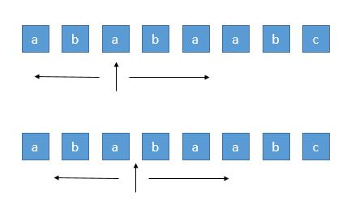
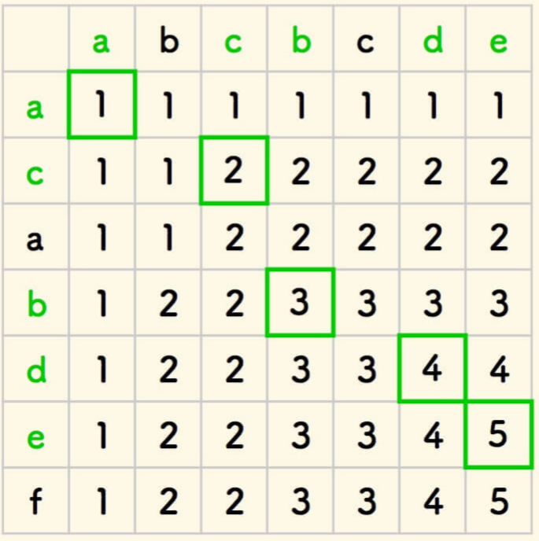
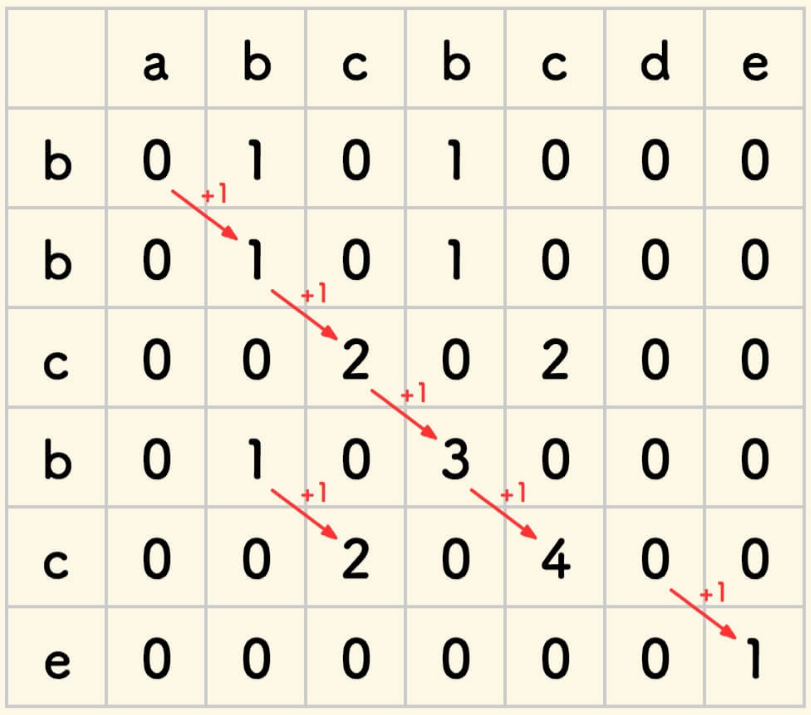
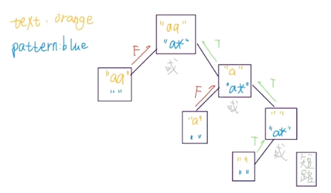
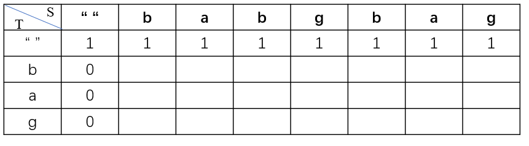

# 20.字符串算法

# 1.字符串基础知识

## 1.1 字符串定义

[Are your strings immutable? – Daniel Lemire's blog](https://lemire.me/blog/2017/07/07/are-your-strings-immutable/ "Are your strings immutable? – Daniel Lemire's blog")

[Reading 9: Mutability & Immutability (mit.edu)](https://web.mit.edu/6.005/www/fa16/classes/09-immutability/#summary "Reading 9: Mutability & Immutability (mit.edu)")

Python和Java的String是immutable的；immutable指不可变的，即定义了String后，就是不可变的，当增加字符和删减字母时，是新生成了一个字符串。

C++的String是可变的。

immutable优点：线程安全的，可以在多线程环境中使用

Python

```python
x = 'abbc'
x = "abbc"
```

Java

```c++
String x = "abbc";
```

C++

```c++
std::string x("abbc");
```

## 1.2 遍历字符串

python

```python
for ch in "abbc":
  print(ch)

```

Java

```java
String x = "abbc";
for (int i = 0; i < x.size(); i++) {
  char ch = x.charAt(i);
}

for ch in x.toCharArray() {
  System.out.println(ch);
}
```

C++

```c++
std::string x("abbc")
for (int i = 0; i < s1.length(); i++) {
  cout << x[i];
}

for (auto& ch : x) {
  std::cout << ch;
}

for (std::string::iterator it = x.begin(); it != str.end(); it++) {
  std::cout << *it;
}
```

## 1.3 基础题目

### （1）字符串中的第一个唯一字符

[387. 字符串中的第一个唯一字符 - 力扣（LeetCode）](https://leetcode.cn/problems/first-unique-character-in-a-string/description/ "387. 字符串中的第一个唯一字符 - 力扣（LeetCode）")

```bash
给定一个字符串 s ，找到 它的第一个不重复的字符，并返回它的索引 。如果不存在，则返回 -1 。

```

1.  暴力方法：for i 0→len  for j 0→len  $O(n^2)$
2.  map（hashmap, treemap）
3.  hash array，使用一个简单数组

```c++
class Solution {
public:
    int firstUniqChar(string s) {
        std::unordered_map<int, int> str_map;

        for (auto& ch : s) {
            str_map[ch]++;
        }

        for (int i = 0; i < s.size(); i++) {
            char ch = s[i];
            if (str_map[ch] == 1) {
                return i;
            }
        }

        return -1;
    }
};
```

### （2）字符串转换整数

[8. 字符串转换整数 (atoi) - 力扣（LeetCode）](https://leetcode.cn/problems/string-to-integer-atoi/description/ "8. 字符串转换整数 (atoi) - 力扣（LeetCode）")

```bash
请你来实现一个 myAtoi(string s) 函数，使其能将字符串转换成一个 32 位有符号整数（类似 C/C++ 中的 atoi 函数）。

函数 myAtoi(string s) 的算法如下：

1.读入字符串并丢弃无用的前导空格
2.检查下一个字符（假设还未到字符末尾）为正还是负号，读取该字符（如果有）。 确定最终结果是负数还是正数。 如果两者都不存在，则假定结果为正。
3.读入下一个字符，直到到达下一个非数字字符或到达输入的结尾。字符串的其余部分将被忽略。
4.将前面步骤读入的这些数字转换为整数（即，"123" -> 123， "0032" -> 32）。如果没有读入数字，则整数为 0 。必要时更改符号（从步骤 2 开始）。
5.如果整数数超过 32 位有符号整数范围 [−231,  231 − 1] ，需要截断这个整数，使其保持在这个范围内。具体来说，小于 −231 的整数应该被固定为 −231 ，大于 231 − 1 的整数应该被固定为 231 − 1 。
6.返回整数作为最终结果。

注意：
- 本题中的空白字符只包括空格字符 ' ' 。
- 除前导空格或数字后的其余字符串外，请勿忽略 任何其他字符。
```

```c++
class Solution {
public:
    int myAtoi(string s) {
        int len = s.size();
        if (len == 0) {
            return 0;
        }

        int idx = 0;
        int is_negative = false;
        int num_abs = 0;

        // 删除空格
        while (idx <= len && s[idx] == ' ') {
            idx++;
        }

        // 处理符号
        if (idx <= len && (s[idx] == '-' || s[idx] == '+')) {
            is_negative = s[idx] == '-' ? true : false;
            idx++;
        }

        // 转换数字
        while (idx < len) {
            int tmp = s[idx] - '0';
            if (tmp < 0 || tmp > 9) {
                break;
            }

            // overflow
            if (INT_MAX / 10 < num_abs || INT_MAX / 10 == num_abs && INT_MAX % 10 < tmp) {
                return is_negative ? INT_MIN : INT_MAX;
            }

            num_abs = num_abs * 10 + tmp;
            idx++;
        }

        return is_negative ? -num_abs : num_abs;
    }
};
```

### （3）最长公共前缀

[14. 最长公共前缀 - 力扣（LeetCode）](https://leetcode.cn/problems/longest-common-prefix/description/ "14. 最长公共前缀 - 力扣（LeetCode）")

```bash
编写一个函数来查找字符串数组中的最长公共前缀。

如果不存在公共前缀，返回空字符串 ""。
```

```c++
class Solution {
public:
    string longestCommonPrefix(vector<string>& strs) {
        int word_num = strs.size();
        if (word_num == 0) {
            return "";
        }

        // 扫描第一个单词的字符
        for (int i = 0; i < strs[0].size(); i++) {
            // 取出第一个单词字符
            char ch = strs[0][i];
            // 依次扫面后续单词的字符
            // 依次和第一个单词的字符匹配
            for (int j = 1; j < word_num; j++) {
                if (i == strs[j].size() || ch != strs[j][i]) {
                    return strs[0].substr(0, i);
                }
            }
        }

        return strs[0];
    }
};
```

### （4）字符串翻转

[344. 反转字符串 - 力扣（LeetCode）](https://leetcode.cn/problems/reverse-string/description/ "344. 反转字符串 - 力扣（LeetCode）")

[541. 反转字符串 II - 力扣（LeetCode）](https://leetcode.cn/problems/reverse-string-ii/solutions/946553/fan-zhuan-zi-fu-chuan-ii-by-leetcode-sol-ua7s/ "541. 反转字符串 II - 力扣（LeetCode）")

```bash
给定一个字符串 s 和一个整数 k，从字符串开头算起，每计数至 2k 个字符，就反转这 2k 字符中的前 k 个字符。

如果剩余字符少于 k 个，则将剩余字符全部反转。
如果剩余字符小于 2k 但大于或等于 k 个，则反转前 k 个字符，其余字符保持原样。
```

```c++
class Solution {
public:
    string reverseStr(string s, int k) {
        int n = s.length();
        for (int i = 0; i < n; i += 2 * k) {
            reverse(s.begin() + i, s.begin() + min(i + k, n));
        }
        return s;
    }
};

```

### （5）翻转字符串中的单词

[151. 反转字符串中的单词 - 力扣（LeetCode）](https://leetcode.cn/problems/reverse-words-in-a-string/description/ "151. 反转字符串中的单词 - 力扣（LeetCode）")

[557. 反转字符串中的单词 III - 力扣（LeetCode）](https://leetcode.cn/problems/reverse-words-in-a-string-iii/description/ "557. 反转字符串中的单词 III - 力扣（LeetCode）")

```bash
给你一个字符串 s ，请你反转字符串中 单词 的顺序。

单词 是由非空格字符组成的字符串。s 中使用至少一个空格将字符串中的 单词 分隔开。

返回 单词 顺序颠倒且 单词 之间用单个空格连接的结果字符串。

注意：输入字符串 s中可能会存在前导空格、尾随空格或者单词间的多个空格。返回的结果字符串中，单词间应当仅用单个空格分隔，且不包含任何额外的空格。

示例 1：

输入：s = "the sky is blue"
输出："blue is sky the"
```

```bash
给定一个字符串 s ，你需要反转字符串中每个单词的字符顺序，同时仍保留空格和单词的初始顺序。
示例 1：

输入：s = "Let's take LeetCode contest"
输出："s'teL ekat edoCteeL tsetnoc"

```

1.  split， reverse，join
2.  reverse整个string，然后在单独reverse每个单词

```c++
class Solution {
public:
    string reverseWords(string s) {
        int str_len = s.size();
        if (str_len == 0) {
            return "";
        }

        int left = 0;
        int right = s.size() - 1;
        std::string result;
        std::string word;

        // 删除前面的空格
        while (left < str_len && s[left] == ' ') {
            left++;
        }

        // 删除后面的空格
        while (right < str_len && s[right] == ' ') {
            right--;
        }

        // 切分单词
        while (left <= right) {
            char ch = s[left];
            // 如果单词不为空，且ch字符为空，则到下一个单词了，开始处理
            if (word.size() != 0 && ch == ' ') {
                // reslut为空的时候，特殊处理
                if (result.size() == 0) {
                    result = word;
                } else {
                    result = word +  " " + result;;
                }
                
                word = "";
            } else if (ch != ' ') {
                word += ch;
            }
            left++;
        }
        // reslut为空的时候，特殊处理
        if (result.size() == 0) {
            result = word;
        } else {
            result = word +  " " + result;;
        }

        return result;
    }
};
```

```c++
class Solution {
public:
    string reverseWords(string s) {
        int str_len = s.size();
        if (str_len == 0) {
            return "";
        }

        int left = 0;
        int right = s.size() - 1;
        std::string result;
        std::string word;

        // 删除前面的空格
        while (left < str_len && s[left] == ' ') {
            left++;
        }

        // 删除后面的空格
        while (right < str_len && s[right] == ' ') {
            right--;
        }

        // 切分单词
        while (left <= right) {
            char ch = s[left];
            // 如果单词不为空，且ch字符为空，则到下一个单词了，开始处理
            if (word.size() != 0 && ch == ' ') {
                // 翻转单词
                this->resver_str(word);
                result = result + word +  " ";
                word = "";
            } else if (ch != ' ') {
                word += ch;
            }
            left++;
        }
        // 处理最后一个单词
        this->resver_str(word);
        result = result + word;

        return result;
    }

    void resver_str(std::string& word) {
        int low = 0;
        int high = word.size() - 1;
        while (low <= high) {
            char tmp = word[low];
            word[low] = word[high];
            word[high] = tmp;
            low++;
            high--;
        }
    }
};
```

### （6）找到字符串中所有字母异位词

[438. 找到字符串中所有字母异位词 - 力扣（LeetCode）](https://leetcode.cn/problems/find-all-anagrams-in-a-string/description/ "438. 找到字符串中所有字母异位词 - 力扣（LeetCode）")

```bash
给定两个字符串 s 和 p，找到 s 中所有 p 的 异位词 的子串，返回这些子串的起始索引。不考虑答案输出的顺序。

异位词 指由相同字母重排列形成的字符串（包括相同的字符串）。


输入: s = "cbaebabacd", p = "abc"
输出: [0,6]
解释:
起始索引等于 0 的子串是 "cba", 它是 "abc" 的异位词。
起始索引等于 6 的子串是 "bac", 它是 "abc" 的异位词。

```

滑动窗口，看窗口中的单词是不是某个单词的异位词

```c++
class Solution {
public:
    // 构造两个相同的滑动窗口，在滑动窗口中维护每个字母的数量
    // 如果字母数量相同，则说明是 异位词
    vector<int> findAnagrams(string s, string p) {
        int s_len = s.size();
        int p_len = p.size();

        // 如果s的长度小于p的，则直接返回
        if (s_len < p_len) {
            return std::vector<int>();
        }

        // 结果
        std::vector<int> ans;
        // s字符串字母统计
        std::vector<int> s_count(26);
        // p字符串字母统计
        std::vector<int> p_count(26);

        // 首先统计前p_len个字符串中的字符数量
        for (int i = 0; i < p_len; i++) {
            s_count[s[i] - 'a']++;
            p_count[p[i] - 'a']++;
        }

        // 最开始如果相等，加入0
        if (s_count == p_count) {
            ans.emplace_back(0);
        }

        // 再遍历s中剩余的字符串
        for (int i = 0; i < s_len - p_len; i++) {
            s_count[s[i] - 'a']--;
            s_count[s[i + p_len] - 'a']++;

            if (s_count == p_count) {
                ans.emplace_back(i + 1);
            }
        }

        return ans;
    }
};
```

### （7）回文词判断

[125. 验证回文串 - 力扣（LeetCode）](https://leetcode.cn/problems/valid-palindrome/ "125. 验证回文串 - 力扣（LeetCode）")

[680. 验证回文串 II - 力扣（LeetCode）](https://leetcode.cn/problems/valid-palindrome-ii/description/ "680. 验证回文串 II - 力扣（LeetCode）")

```bash
如果在将所有大写字符转换为小写字符、并移除所有非字母数字字符之后，短语正着读和反着读都一样。则可以认为该短语是一个 回文串 。

字母和数字都属于字母数字字符。

给你一个字符串 s，如果它是 回文串 ，返回 true ；否则，返回 false 。
```

```bash
给你一个字符串 s，最多 可以从中删除一个字符。

请你判断 s 是否能成为回文字符串：如果能，返回 true ；否则，返回 false 。
```

```c++
class Solution {
public:
    bool isPalindrome(string s) {
        if (s.empty()) {
            return 0;
        }

        int left = 0;
        int right = s.size() - 1;

        while (left < right) {
            // 左侧移除非字母数字
            while (left < right && !(std::isdigit(s[left]) || std::isalpha(s[left]))) {
                left++;
            }
            // 右侧移除非字母数字
            while (left < right && !(std::isdigit(s[right]) || std::isalpha(s[right]))) {
                right--;
            }
            // 判断左右两侧字母是否相同
            if (std::tolower(s[left]) == std::tolower(s[right])) {
                left++;
                right--;
            } else {
                return false;
            }
        }

        return true;
    }
};
```

在允许最多删除一个字符的情况下，同样可以使用双指针，通过贪心实现。初始化两个指针 left 和 right 分别指向字符串的第一个字符和最后一个字符。每次判断两个指针指向的字符是否相同，如果相同，则更新指针，将left + 1，right - 1，然后判断更新后的指针范围内的子串是否是回文字符串。

如果两个指针指向的字符不同，则两个字符中必须有一个被删除，此时就分成两种情况：

-   删除左指针对应的字符，留下子串 s\[left+1 : right]
-   删除右指针对应的字符，留下子串 s\[left : right−1]

当这两个子串中至少有一个是回文串时，就说明原始字符串删除一个字符之后就以成为回文串。

```c++
class Solution {
public:
    bool validPalindrome(string s) {
        if (s.size() == 0) {
            return true;
        }
        int left = 0;
        int right = s.size() - 1;

        while (left < right) {
            if (s[left] == s[right]) {
                left++;
                right--;
            } else {
                return this->check_palindrome(s, left + 1, right)  || this->check_palindrome(s, left, right - 1);
            }
        }

        return true;
    }

    // 检查字符串子串是不是回文串
    bool check_palindrome(std::string s, int left, int right) {
        for (int i = left, j = right; i < j; i++, j--) {
            if (s[i] != s[j]) {
                return false;
            }
        }

        return true;
    }
};
```

### （8）最长回文子串

[5. 最长回文子串 - 力扣（LeetCode）](https://leetcode.cn/problems/longest-palindromic-substring/description/ "5. 最长回文子串 - 力扣（LeetCode）")

```bash
给你一个字符串 s，找到 s 中最长的回文子串。

如果字符串的反序与原始字符串相同，则该字符串称为回文字符串。

输入：s = "babad"
输出："bab"
解释："aba" 同样是符合题意的答案。

```

#### 暴力求解

```c++
// 1.暴力求解，列举所有的子串，判断是否为回文串
class Solution {
public:
    string longestPalindrome(string s) {
        if (s.size() <= 1) {
            return s;
        }
        std::string ans;
        int max_len = 0;
        
        for (int i = 0; i < s.size() - 1; i++) {
            for (int j = i + 1; j < s.size(); j++) {
                std::string tmp_str = s.substr(i, j - i + 1);
                if (this->check_palindrome(tmp_str) && tmp_str.size() > max_len) {
                    ans = tmp_str;
                    max_len = tmp_str.size();
                }
            }
        }

        return ans;
    }

    // 检查字符串子串是不是回文串
    bool check_palindrome(std::string& s) {
        for (int i = 0, j = s.size() - 1; i < j; i++, j--) {
            if (s[i] != s[j]) {
                return false;
            }
        }

        return true;
    }
};
```

#### 暴力 + 动态规划

去掉一些暴力解法中重复的判断。可以基于下边的发现，进行改进。

状态定义：`P(i, j) = true,` `s[i,j]`是回文串；`P(i, j) = false`, `s[i,j]`不是是回文串；

接下来$P(i,j)=(P(i+1,j−1) ~ \&\& ~ S[i]==S[j])$

所以如果想知道$P（i,j）$的情况，不需要调用判断回文串的函数了，只需要知道$P（i + 1，j - 1）$的情况就可以了，这样时间复杂度就少了 O(n)。因此可以用动态规划的方法，空间换时间，把已经求出的$  P（i，j） $存储起来。

```c++
// 2.暴力 + 动态规划
class Solution {
public:
    string longestPalindrome(string s) {
        int str_len = s.size();
        if (str_len < 2) {
            return s;
        }

        std::vector<std::vector<bool>> dp(str_len, std::vector<bool>(str_len));
        // 最长子串的开始位置和最大长度
        int max_len = 0;
        int begin = 0;

        // 遍历所有长度
        for (int len = 1; len <= str_len; len++) {
            // 枚举左边界
            for (int start = 0; start < str_len; start++) {
                // 根据左边界和长度，确定结束位置
                int end = start + len - 1;
                // 下标越界
                if (end >= str_len) {
                    break;
                }
                // dp[i][j] = dp[i + 1][j - 1] && s[i] == s[j]
                dp[start][end] = s[start] == s[end] && (len == 1 || len == 2 || dp[start + 1][end - 1]);

                if (dp[start][end] && len > max_len)  {
                    max_len = len;
                    begin = start;
                }
            }
        }

        return s.substr(begin, max_len);
    }
};
```

#### 中心扩散

回文串一定是对称的，所以可以每次循环选择一个中心，进行左右扩展，判断左右字符是否相等即可。



由于存在奇数的字符串和偶数的字符串，所以需要从一个字符开始扩展，或者从两个字符之间开始扩展，所以总共有 `n+n-1` 个中心。&#x20;

```c++
class Solution {
public:
    string longestPalindrome(string s) {
        int len = s.size();
        if (len < 2) {
            return s;
        }

        for (int i = 0; i < len - 1; i++) {
            // 奇数长度
            this->extend_palindrome(s, i, i);
            // 偶数长度
            this->extend_palindrome(s, i, i + 1);
        }

        return s.substr(m_start, m_max_len);
    }

    void extend_palindrome(std::string& s, int left, int right) {
        while (left >= 0 && right < s.size() && s[left] == s[right]) {
            left--;
            right++;
        }

        if (m_max_len < right - left - 1) {
            m_start = left + 1;
            m_max_len = right - left - 1;
        }
    }
private:
    int m_start;
    int m_max_len;
};
```

# 2.高级字符串算法

## 2.1 最长子串、子序列

### （1）编辑距离

[72. 编辑距离 - 力扣（LeetCode）](https://leetcode.cn/problems/edit-distance/description/ "72. 编辑距离 - 力扣（LeetCode）")

```bash
给你两个单词 word1 和 word2， 请返回将 word1 转换成 word2 所使用的最少操作数  。

你可以对一个单词进行如下三种操作：

- 插入一个字符
- 删除一个字符
- 替换一个字符
```

1.  BFS + 剪枝（单词的长度范围）
2.  DP
    1.  状态定义：`dp[0..i][0..j]`， i表示第一个字符串匹配到第二个字符串的长度；j表示第二个字符串匹配到第一个字符串的长度；`word1.substr(0, i)` 与 `word2.substr(0, j)`之间的编辑距离
    2.

**w1和w2的最后一个字符一样**

> w1 : ...x (i)
> w2 : ...x (j)&#x20;

`edit_dist(w1, w2) = edit_dist(w1[0 : i -1], w2[0, j - 1])`

`edit_dist(i, j) = edit_dist(i - 1, j - 1)`

**w1和w2的最后一个字符不一样**

> w1 : ...x (i)
> w2 : ...y (j)&#x20;

`edit_dist(i, j) = ``min``(edit_dist(i - 1, j - 1) + 1 , edit_dist(i - 1, j ) + 1, edit_dist(i, j - 1) + 1)`

-   `edit_dist(i - 1, j - 1) + 1` :  替换，编辑距离 + 1
-   `edit_dist(i - 1, j) + 1` : 删除word1最后一个字符， 编辑距离 + 1
-   `edit_dist(i , j - 1) + 1` : 删除 word2最后一个字符，编辑距离 + 1

注意，针对第一行，第一列要单独考虑，我们引入 `''` 下图所示：


第一行，是 `word1` 为空变成 `word2` 最少步数，就是插入操作

第一列，是 `word2` 为空，需要的最少步数，就是删除操作

### （2）最长公共子序列

[1143. 最长公共子序列 - 力扣（LeetCode）](https://leetcode.cn/problems/longest-common-subsequence/description/ "1143. 最长公共子序列 - 力扣（LeetCode）")

```c++
给定两个字符串 text1 和 text2，返回这两个字符串的最长 公共子序列 的长度。如果不存在 公共子序列 ，返回 0 。

一个字符串的 子序列 是指这样一个新的字符串：它是由原字符串在不改变字符的相对顺序的情况下删除某些字符（也可以不删除任何字符）后组成的新字符串。

- 例如，"ace" 是 "abcde" 的子序列，但 "aec" 不是 "abcde" 的子序列。
两个字符串的 公共子序列 是这两个字符串所共同拥有的子序列。
```

注意分区子序列和子串：子序列可以有间隔，子串没有间隔



状态定义：`dp[0..i][0..j]`， i表示第一个字符串匹配到第二个字符串的长度；j表示第二个字符串匹配到第一个字符串的长度；`word1.substr(0, i)` 与 `word2.substr(0, j)`之间的最长公共子序列

状态方程：

```python
if s1[i - 1] == s2[i - 1]:
  dp[i][j] = dp[i - 1][j - 1] + 1
else:
  dp[i][j] = max(dp[i - 1][j], dp[i][j - 1])

```

```c++
class Solution {
public:
    int longestCommonSubsequence(string text1, string text2) {
        int m = text1.size();
        int n = text2.size();

        if (m == 0 || n == 0) {
            return 0;
        }

        std::vector<std::vector<int>> dp(m + 1, std::vector<int>(n + 1, 0));

        for (int i = 1; i <= m; i++) {
            for (int j = 1; j <= n; j++) {
                if (text1.at(i - 1) == text2.at(j - 1)) {
                    dp[i][j] = dp[i - 1][j - 1] + 1;
                } else {
                    dp[i][j] = std::max(dp[i][j - 1], dp[i - 1][j]);
                }
            }
        }

        return dp[m][n];
    }
};
```

### （3）最长公共子串

LeetCode没有题目

```bash
最长公共子串，是指两个字符串中最长连续相同的子串长度。
例如：str1=“1AB2345CD”,str2=”12345EF”,则str1，str2的最长公共子串为2345。
```



状态定义：`dp[0..i][0..j]`， i表示第一个字符串匹配到第二个字符串的长度；j表示第二个字符串匹配到第一个字符串的长度；`word1.substr(0, i)` 与 `word2.substr(0, j)`之间的最长公共子串

状态方程：

```python
if s1[i - 1] == s2[i - 1]:
  dp[i][j] = dp[i - 1][j - 1] + 1
else:
  dp[i][j] = 0

```

```c++
class Solution {
public:
    int longestCommonSubstring(string text1, string text2) {
        int m = text1.size();
        int n = text2.size();

        if (m == 0 || n == 0) {
            return 0;
        }

        std::vector<std::vector<int>> dp(m + 1, std::vector<int>(n + 1, 0));

        for (int i = 1; i <= m; i++) {
            for (int j = 1; j <= n; j++) {
                if (text1.at(i - 1) == text2.at(j - 1)) {
                    dp[i][j] = dp[i - 1][j - 1] + 1;
                } else {
                    dp[i][j] = 0;
                }
            }
        }

        // 在dp数组中找到最大值，而不是dp[m][n]
        return *max_elemen(dp.begin(),dp.end())
    }
};
```

## 2.2 字符串 + 递归 or DP&#x20;

### （1）正则表达式匹配

[10. 正则表达式匹配 - 力扣（LeetCode）](https://leetcode.cn/problems/regular-expression-matching/description/ "10. 正则表达式匹配 - 力扣（LeetCode）")

[动态规划解法，只需关注「匹配」和「不匹配」即可](https://leetcode.cn/problems/regular-expression-matching/solutions/6673/ji-yu-guan-fang-ti-jie-gen-xiang-xi-de-jiang-jie-b/ "动态规划解法，只需关注「匹配」和「不匹配」即可")

```bash
给你一个字符串 s 和一个字符规律 p，请你来实现一个支持 '.' 和 '*' 的正则表达式匹配。

- '.' 匹配任意单个字符
- '*' 匹配零个或多个前面的那一个元素
所谓匹配，是要涵盖 整个 字符串 s的，而不是部分字符串。

示例 2:

输入：s = "aa", p = "a*"
输出：true
解释：因为 '*' 代表可以匹配零个或多个前面的那一个元素, 在这里前面的元素就是 'a'。因此，字符串 "aa" 可被视为 'a' 重复了一次。

```

#### 1）两个字符串匹配

如果是两个普通字符串，如何进行匹配？

```c++
bool isMatch(string text, string pattern) {
  if (text.size() != pattern.size()) 
    return false;
  for (int j = 0; j < pattern.size(); j++) {
    if (pattern[j] != text[j])
      return false;
  }
  return true;
}
```

将上述改写为递归的形式：

```python
def isMatch(text, pattern) -> bool:
  if pattern is empty:
    return text is empty
  first_match = (text not empty) and pattern[0] == text[0]
  return first_match and isMatch(text[1:], pattern[1:])

```

#### 2）处理点号 `·`通配符

点号可以匹配任意一个字符，修改上面伪代码：

```python
def isMatch(text, pattern) -> bool:
  if not pattern:
    return not next
  first_match = bool(text) and pattern[0] in {text[0], '.'}
  return first_match and isMatch(text[1:], pattern[1:])

```

#### 3）处理 `*` 通配符

星号通配符可以让前一个字符重复任意次数，那到底重复几次？

```python
def isMatch(text, pattern) -> bool:
  if not pattern:
    return not next
  first_match = bool(text) and pattern[0] in {text[0], '.'}
  if len(pattern) >= 2 and pattern[1] == '*':
    # 发现 * 通配符
  return first_match and isMatch(text[1:], pattern[1:])
```

星号前面的字符到底要重复几次呢？不管重复几次，当前的选择只有两个：匹配0次、匹配1次，所以可以这样处理：

```python
if len(pattern) >= 2 and pattern[1] == '*':
  return isMatch(test, pattern[2:]) or \
         first_mactch and isMatch(text[1:], pattern)
# 解释：如果发现有字符和 ‘*’ 结合
# 1.匹配该字符0次，然后跳过该字符
# 2.当pattern[0]和text[0]匹配后，移动text 


```

可以看到，通过保留pattern中的`*`，同时向后推移text，来实现`*`将字符重复多次的功能。



#### 4）动态规划

选择使用备忘录的递归方法来降低复杂度

```c++
class Solution {
public:
    bool isMatch(string s, string p) {
        // 大小+1的目的是因为memo有边界限制
        m_memo = std::vector<std::vector<int>>(s.size() + 1, std::vector<int>(p.size() + 1, -1));
        return this->recur(s, p, 0, 0);
    }

    bool recur(std::string& s, std::string& p, int s_idx, int p_idx) {
        // 递归出口
        // 当 s_idx == s.size()，且 p_idx < p.size()
        // 可能p中还有*通配符
        if (p_idx == p.size()) {
            return s_idx == s.size();
        }

        // 如果在memo中有存储，直接返回结果
        if (m_memo[s_idx][p_idx] != -1) {
            return m_memo[s_idx][p_idx];
        }
        // 整个结果是否匹配
        bool res = false;
        // 当前第一个字符是否匹配
        bool first_match = false;

        // 处理 . 通配符
        if (s_idx < s.size()) {
            if(s[s_idx] == p[p_idx] || p[p_idx] == '.') {
                first_match = true;
            }
        }

        // 处理 * 通配符
        if ((p_idx + 1) < p.size() && p[p_idx + 1] == '*') {
            // 考虑只需两种情况：
            // 情况1：当前字符出现0次：跳过pattern中的当前字符和下一个"*"==>helper(s, p, si, pi + 2)
            // 情况2：当前字符出现1次：当前是否匹配 && 将字符s向后移动一位是否匹配==>cur_match && helper(s, p, si + 1, pi)

            res = this->recur(s, p, s_idx, p_idx + 2) || (first_match && this->recur(s, p, s_idx + 1, p_idx));
        } else {
            // //下一个不是"*"正常向后匹配就好
            res = first_match && this->recur(s, p, s_idx + 1, p_idx + 1);
        }

        m_memo[s_idx][p_idx] = res;

        return res;
    }

private:
    std::vector<std::vector<int>> m_memo;
};
```

### （2）不同的子序列

[115. 不同的子序列 - 力扣（LeetCode）](https://leetcode.cn/problems/distinct-subsequences/description/ "115. 不同的子序列 - 力扣（LeetCode）")

```bash
给你两个字符串 s 和 t ，统计并返回在 s 的 子序列 中 t 出现的个数，结果需要对 10^9 + 7 取模。

输入：s = "rabbbit", t = "rabbit"
输出：3
解释：
如下所示, 有 3 种可以从 s 中得到 "rabbit" 的方案。
rabbbit
rabbbit
rabbbit

```

状态定义：`dp[i][j]`代表`T`的前i字符可以由`S`前j字符串组成的最多个数

动态方程：

-   当`s[j] == t[i]`，` dp[i][j] = dp[i-1][j-1] + dp[i][j-1]`
-   当`s[j] != t[i]`， `dp[i][j] = dp[i][j-1]`



对于第一行, `T` 为空,因为空集是所有字符串子集, 所以我们第一行都是 `1`

对于第一列, `S` 为空,这样组成 `T` 个数当然为 0\` 了

```c++
class Solution {
public:
    int numDistinct(string s, string t) {
        int m = t.size();
        int n = s.size();

        std::vector<std::vector<int>> dp(m + 1, std::vector<int>(n + 1, 0));

        for (int j = 0; j <= n; j++) {
            dp[0][j] = 1;
        }

        for (int i = 1; i <= m; i++) {
            for (int j = 1; j <= n; j++) {
                if (t[i - 1] == s[j - 1]) {
                    dp[i][j] = dp[i - 1][j - 1] + dp[i][j - 1];
                } else {
                    dp[i][j] = dp[i][j - 1];
                }
            }
        }

        return dp[m][n];
    }
};
```

# 3.字符串匹配算法

## 3.1 暴力法

```c++
int forceSearch(std::string txt, std::string pat) {
    int M = txt.size();
    int N = pat.size();
    
    for (int i = 0; i <= M - N; i++) {
        int j;
        for (j = 0; j < N; j++) {
            if (txt[i + j] != pat[j])
                break;
        }
        if (j == N) {
            return i;
        }
    }
    
    return -1;
}
```

更加聪明？

1.  Rabin-Karp：预先判断 `hash(txt.substr(i, M)) == hash(pat)`
2.  KMP：已经匹配的片段中，它的最大前缀和最大后缀

## 3.2 Rabin-Karp算法

在朴素算法中，我们需要挨个比较所有字符，才知道目标字符串中是否包含子串。那么，是否有别的方法可以用来判断目标字符串是否包含子串呢?

答案是肯定的，确实存在一种更快的方法。为了避免挨个字符对目标字符串和子串进行比较，我们可以**尝试一次性判断两者是否相等**。因此，我们需要一个好的**哈希函数 (hash function)**。 通过哈希函数，我们可以算出子串的哈希值，然后将**它和目标字符串中的子串的哈希值进行比较**。 这个新方法在速度上比暴力法有显著提升。

算法思想：

1.  假设子串的长度为 `M(pat)`，目标字符串的长度为 `N(txt)`
2.  计算子串的hash值`hash_pat`
3.  计算目标字符串txt中每个长度为M的子串的hash值（共需要计算 `N-M+1`次）
4.  比较hash值：如果hash值不同，字符串必然不匹配；如果hash值相同，还需要使用朴素算法再次判断

```java
public final static int D = 256;
public final static int Q = 9997;

static int RabinKarpSerach(String txt, String pat) {
  int M = pat.length();
  int N = txt.length();
  int i, j;
  int patHash = 0, txtHash = 0;
  
  for (int i = 0; i < M; i++) {
    pathHash = (D * patHash + pat.charAt(i)) % Q;
    txtHash = (D * txtHash + txt.charAt(i)) % Q;
  }
  
  int highestPow = 1;  // pow(256, M-1)
  for (i = 0; i < M - 1; i++)
    highestPow = (highestPow * D) % Q;
  
  for (i = 0; i <= N - M; i++) {  // 枚举起点
    if (pathHash == txtHash) {
      for (j = 0; j < M; j++) {
        if (txt.charAt(i + j) != pat.charAt(j))
          break;
      }
      if (j == M)
        return i;
    }
    if (i < N - M) {
      txtHash = (D * (txtHash - txt.charAt(i) * highestPow) + txt.charAt(i + m)) % Q;
      if (txtHash < 0)
        txtHash += Q;
    }
  }
  return -1;
}
```

## 3.3 KMP算法

-   [KMP 字符串匹配算法视频](https://www.bilibili.com/video/av11866460?from=search\&seid=17425875345653862171 "KMP 字符串匹配算法视频")
-   [字符串匹配的 KMP 算法](http://www.ruanyifeng.com/blog/2013/05/Knuth–Morris–Pratt_algorithm.html "字符串匹配的 KMP 算法")

KMP算法 (Knuth-Morris-Pratt) 的思想就是，当子串与目标字符串不匹配时，其实你已经知道了前面已经匹配成功那 一部分的字符 (包括子串与目标字符串)。以阮一峰的文章为例，当空格与 D 不匹配时，你其实 知道前面六个字符是“ABCDAB”。

KMP 算法的想法是，**设法利用这个已知信息，不要把“搜索位置”移回已经比较过的位置，继续把它向后移，这样就提高了效率**。

## 3.4 其他

### （1）Boyer-Moore算法

BM算法核心思想是，**利用模式串本身的特点，在模式串中某个字符与主串不能匹配的时候，将模式串往后多滑动几位，以此来减少不必要的字符比较，提高匹配的效率。**&#x20;

### （2）Sunday算法

-   [Sunday 算法](https://blog.csdn.net/u012505432/article/details/52210975 "Sunday 算法")
