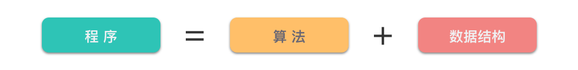
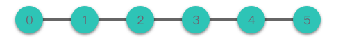
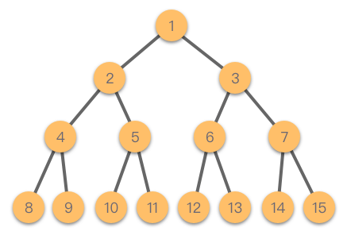
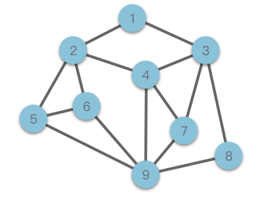
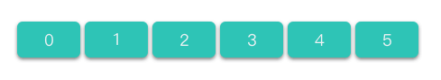
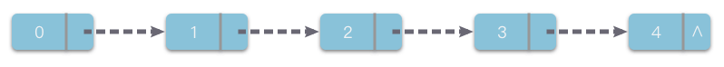

# 1.数据结构与算法



> 数据结构是程序的骨架，而算法则是程序的灵魂。

**《算法 + 数据结构 = 程序》** 是 Pascal 语言之父 [Niklaus Emil Wirth](https://zh.wikipedia.org/wiki/尼克劳斯·维尔特 "Niklaus Emil Wirth") 写过的一本非常著名的书。而作为书名的这句话也成为了计算机科学的经典名句。可见，对于程序设计来说，算法和数据结构的关系密不可分。

简单来说，**「算法」就是解决问题的方法或者过程**。如果我们把问题看成是函数，那么算法就是将输入转换为输出的过程。**「数据结构」是数据的计算机表示和相应的一组操作**。**「程序」则是算法和数据结构的具体实现**。

## 1.数据结构

> **数据结构（Data Structure）**：带有结构特性的数据元素的集合。

简单而言，**「数据结构」**指的是：**数据的组织结构，用来组织、存储数据**。

展开来讲，数据结构研究的是数据的逻辑结构、物理结构以及它们之间的相互关系，并对这种结构定义相应的运算，设计出相应的算法，并确保经过这些运算以后所得到的新结构仍保持原来的结构类型。

对于数据结构，我们可以按照数据的 **「逻辑结构」** 和 **「物理结构」** 来进行分类。

### 1.1 数据的逻辑结构

> **逻辑结构（Logical Structure）**：数据元素之间的相互关系。

根据元素之间具有的不同关系，通常我们可以将数据的逻辑结构分为以下四种：

#### （1）集合结构

> **集合结构**：**数据元素同属于一个集合，除此之外无其他关系**。

集合结构中的数据元素是无序的，并且每个数据元素都是唯一的，集合中没有相同的数据元素。集合结构很像数学意义上的「集合」。

#### （2）线性结构

> **线性结构**：**数据元素之间是「一对一」关系**。

线性结构中的数据元素（除了第一个和最后一个元素），左侧和右侧分别只有一个数据与其相邻。线性结构类型包括：数组、链表，以及由它们衍生出来的栈、队列、哈希表。



#### （3）树形结构

> **树形结构**：**数据元素之间是「一对多」的层次关系**。

最简单的树形结构是二叉树。这种结构可以简单的表示为：根， 左子树， 右子树。 左子树和右子树又有自己的子树。当然除了二叉树，树形结构类型还包括：多叉树、字典树等。



#### （4）图形结构

> **图形结构**：**数据元素之间是「多对多」的关系**。

图形结构是一种比树形结构更复杂的非线性结构，用于表示物件与物件之间的关系。一张图由一些小圆点（称为 **「****顶点****」** 或 **「****结点****」**）和连结这些圆点的直线或曲线（称为 **「****边****」**）组成。

在图形结构中，任意两个结点之间都可能相关，即结点之间的邻接关系可以是任意的。图形结构类型包括：无向图、有向图、连通图等。



### 1.2 数据的物理结构

> **物理结构（Physical Structure）**：数据的逻辑结构在计算机中的存储方式。

计算机内有多种存储结构，采用最多的是这两种结构：**「顺序存储结构」**、**「链式存储结构」**。

#### （1）顺序存储结构

> **顺序存储结构（Sequential Storage Structure）**：将数据元素存放在一片地址连续的存储单元里，数据元素之间的逻辑关系通过数据元素的存储地址来直接反映。



在顺序存储结构中，逻辑上相邻的数据元素在物理地址上也必然相邻 。

这种结构的优点是：**简单、易理解，且实际占用最少的存储空间**。

缺点是：**需要占用一片地址连续的存储单元；并且存储分配要事先进行；另外对于一些操作的时间效率较低**（移动、删除元素等操作）。

#### （2）链式存储结构

> **链式存储结构（Linked Storage Structure）**：将数据元素存放在任意的存储单元里，存储单元可以连续，也可以不连续。



链式存储结构中，逻辑上相邻的数据元素在物理地址上可能相邻，可也能不相邻。其在物理地址上的表现是随机的。链式存储结构中，一般将每个数据元素占用的若干单元的组合称为一个链结点。每个链结点不仅要存放一个数据元素的数据信息，还要存放一个指出这个数据元素在逻辑关系的直接后继元素所在链结点的地址，该地址被称为指针。换句话说，数据元素之间的逻辑关系是通过指针来间接反映的。

这种结构的优点是：**存储空间不必事先分配，在需要存储空间的时候可以临时申请**，不会造成空间的浪费；一些操作的时间效率远比顺序存储结构高（插入、移动、删除元素）。

缺点是：不仅数据元素本身的数据信息要占用存储空间，指针也需要占用存储空间，**链式存储结构比顺序存储结构的空间开销大**。

## 2.算法

> **算法（Algorithm）**：解决特定问题求解步骤的准确而完整的描述，在计算机中表现为一系列指令的集合，算法代表着用系统的方法描述解决问题的策略机制。

简单而言，**「算法」 指的就是解决问题的方法**。

展开来讲，算法是某一系列运算步骤，它表达解决某一类计算问题的一般方法，对这类方法的任何一个输入，它可以按步骤一步一步计算，最终产生一个输出。它不依赖于任何一种语言，可以用 **自然语言、编程语言（Python、C、C++、Java 等）描述**，也可以用 **伪代码、流程图** 来表示。

### 2.1 算法基本特性

算法其实就是一系列的运算步骤，这些运算步骤可以解决特定的问题。除此之外，**算法** 应必须具备以下特性：

1.  **输入**：对于待解决的问题，都要以某种方式交给对应的算法。在算法开始之前最初赋给算法的参数称为输入。一个算法可以有多个输入，也可以没有输入。
2.  **输出**：算法是为了解决问题存在的，最终总需要返回一个结果。所以至少需要一个或多个参数作为算法的输出。
3.  **有穷性**：算法必须在有限的步骤内结束，并且应该在一个可接受的时间内完成。
4.  **确定性**：组成算法的每一条指令必须有着清晰明确的含义，不能令读者在理解时产生二义性或者多义性。就是说，算法的每一个步骤都必须准确定义而无歧义。
5.  **可行性**：算法的每一步操作必须具有可执行性，在当前环境条件下可以通过有限次运算实现。也就是说，每一步都能通过执行有限次数完成，并且可以转换为程序在计算机上运行并得到正确的结果。

### 2.2 算法追求的目标

研究算法的作用，就是为了使解决问题的方法变得更加高效。对于给定的问题，往往会有多种算法来解决。而不同算法的 **成本** 也是不同的。总体而言，一个优秀的算法至少应该追求以下两个目标：

1.  **所需运行时间更少（时间复杂度更低）**；
2.  **占用内存空间更小（空间复杂度更低）**。

当然，除了对运行时间和占用内存空间的追求外，一个好的算法还应该追求以下目标：

1.  **正确性**：正确性是指算法能够满足具体问题的需求，程序运行正常，无语法错误，能够通过典型的软件测试，达到预期的需求。
2.  **可读性**：可读性指的是算法遵循标识符命名规则，简洁易懂，注释语句恰当，方便自己和他人阅读，便于后期修改和调试。
3.  **健壮性**：健壮性指的是算法对非法数据以及操作有较好的反应和处理。

这 3 个目标是算法的基本标准，是所有算法所必须满足的。一般我们对好的算法的评判标准就是上边提到的 **所需运行时间更少（时间复杂度更低）**、**占用内存空间更小（空间复杂度更低）**。

## 3.复杂度

> **算法复杂度（Algorithm complexity）**：在问题的输入规模为 `n` 的条件下，程序的时间使用情况和空间使用情况。

比较两个算法的优劣通常有两种方法：

-   **事后统计**：将两个算法各编写一个可执行程序，交给计算机执行，记录下各自的运行时间和占用存储空间的实际大小，从中挑选出最好的算法。
-   **预先估算**：在算法设计出来之后，根据算法中包含的步骤，估算出算法的运行时间和占用空间。比较两个算法的估算值，从中挑选出最好的算法。

大多数情况下，我们会选择第 2 种方式。因为第 1 种方式的工作量实在太大，得不偿失。

这里的 **「问题规模 n」** 指的是：算法问题输入的数据量大小。对于不同的算法，定义也不相同。

-   排序算法中：n 表示需要排序的元素数量。
-   查找算法中：n 表示查找范围内的元素总数：比如数组大小、二维矩阵大小、字符串长度、二叉树节点数、图的节点数、图的边界点等。
-   二进制计算相关算法中：n 表示二进制的展开宽度。

一般来说，问题的输入规模越接近，相应的计算成本也越接近。而随着问题输入规模的扩大，计算成本也呈上升趋势。

### 3.1 时间复杂度

> **时间复杂度（Time Complexity）**：在问题的输入规模为 n 的条件下，算法运行所需要花费的时间，可以记作为 $T(n)$。

将 **基本操作次数** 作为时间复杂度的度量标准。换句话说，时间复杂度跟算法中基本操作次数的数量正相关。

#### （1）求解时间复杂度

求解时间复杂度一般分为以下几个步骤：

-   **找出算法中的基本操作（基本语句）**：算法中执行次数最多的语句就是基本语句，通常是最内层循环的循环体部分。
-   **计算基本语句执行次数的数量级**：只需要计算基本语句执行次数的数量级，即保证函数中的最高次幂正确即可。像最高次幂的系数和低次幂可以忽略。
-   **用大 O 表示法表示时间复杂度**：将上一步中计算的数量级放入 O 渐进上界符号中。

同时，在求解时间复杂度还要注意一些原则：

-   **加法原则**：总的时间复杂度等于量级最大的基本语句的时间复杂度。

如果 $T_1(n) = O(f_1(n))$，$T_2(n) = O(f_2(n))$，$T(n) = T_1(n) + T_2(n)$，则 $T(n) = O(f(n)) = max(O(f_1(n)), O(f_2(n))) = O(max(f_1(n), f_2(n)))$。

-   **乘法原则**：循环嵌套代码的复杂度等于嵌套内外基本语句的时间复杂度乘积。

如果 $T_1 = O(f_1(n))$，$T_2 = O(f_2(n))$，$T(n) = T_1(n)T_2(n)$，则 $T(n) = O(f(n)) = O(f_1(n))O(f_2(n)) = O(f_1(n)f_2(n))$。

#### （2）常见时间复杂度关系

根据从小到大排序，常见的时间复杂度主要有：$O(1)$ < $O(\log n)$ < $O(n)$ < $O(n \times \log n)$ < $O(n^2)$ < $O(n^3)$ < $O(2^n)$ < $O(n!)$ < $O(n^n)$。

#### （3）最佳、最坏、平均时间复杂度

时间复杂度是一个关于输入问题规模 $n$ 的函数。但是因为输入问题的内容不同，习惯将「时间复杂度」分为「最佳」、「最坏」、「平均」三种情况。这三种情况的具体含义如下：

-   **最佳时间复杂度**：每个输入规模下用时最短的输入所对应的时间复杂度。
-   **最坏时间复杂度**：每个输入规模下用时最长的输入所对应的时间复杂度。
-   **平均时间复杂度**：每个输入规模下所有可能的输入所对应的平均用时复杂度（随机输入下期望用时的复杂度）。

### 3.2 空间复杂度

> **空间复杂度（Space Complexity）**：在问题的输入规模为 $n$ 的条件下，算法所占用的空间大小，可以记作为 $S(n)$。一般将 **算法的辅助空间** 作为衡量空间复杂度的标准。

根据从小到大排序，常见的算法复杂度主要有：$O(1)$ < $O(\log n)$ < $O(n)$ < $O(n^2)$ < $O(2^n)$ 等。

## 4.实战题目

### 4.1 两数相加

[2235. 两整数相加 - 力扣（LeetCode）](https://leetcode.cn/problems/add-two-integers/description/ "2235. 两整数相加 - 力扣（LeetCode）")

```.properties
给你两个整数 num1 和 num2，返回这两个整数的和。

```

```c++
class Solution {
public:
    int sum(int num1, int num2) {
        return num1 + num2;
    }
};
```

### 4.2 数组串联

[1929. 数组串联 - 力扣（LeetCode）](https://leetcode.cn/problems/concatenation-of-array/description/ "1929. 数组串联 - 力扣（LeetCode）")

```.properties
给你一个长度为 n 的整数数组 nums 。请你构建一个长度为 2n 的答案数组 ans ，数组下标 从 0 开始计数 ，对于所有 0 <= i < n 的 i ，满足下述所有要求：

- ans[i] == nums[i]
- ans[i + n] == nums[i]
具体而言，ans 由两个 nums 数组 串联 形成。

返回数组 ans 。


示例 1：

输入：nums = [1,2,1]
输出：[1,2,1,1,2,1]
解释：数组 ans 按下述方式形成：
- ans = [nums[0],nums[1],nums[2],nums[0],nums[1],nums[2]]
- ans = [1,2,1,1,2,1]
```

```c++
class Solution1 {
public:
    vector<int> getConcatenation(vector<int>& nums) {
        std::vector<int> ans;
        for (auto& n : nums) {
            ans.push_back(n);
        }
        for (auto& n : nums) {
            ans.push_back(n);
        }

        return ans;
    }
};

class Solution {
public:
    vector<int> getConcatenation(vector<int>& nums) {
        int n = nums.size();
        for (int i = 0; i < n; ++i){
            nums.push_back(nums[i]);
        }
        return nums;
    }
};
```

### 4.3 宝石与石头

[771. 宝石与石头 - 力扣（LeetCode）](https://leetcode.cn/problems/jewels-and-stones/description/ "771. 宝石与石头 - 力扣（LeetCode）")

```.properties
给你一个字符串 jewels 代表石头中宝石的类型，另有一个字符串 stones 代表你拥有的石头。 stones 中每个字符代表了一种你拥有的石头的类型，你想知道你拥有的石头中有多少是宝石。

字母区分大小写，因此 "a" 和 "A" 是不同类型的石头。

示例 1：

输入：jewels = "aA", stones = "aAAbbbb"
输出：3
```

哈希表：

1.  用 count来维护石头中的宝石个数。
2.  先使用哈希表或者集合存储宝石。
3.  再遍历数组 stones，并统计每块石头是否在哈希表中或集合中。
    1.  如果当前石头在哈希表或集合中，则令 count 加 1。
    2.  如果当前石头不在哈希表或集合中，则不统计。
4.  最后返回 count。

```c++
class Solution {
public:
    int numJewelsInStones(string jewels, string stones) {
        int count = 0;
        std::unordered_set<int> set;
        
        for (auto& j : jewels) {
            set.insert(j);
        }

        for (auto& s : stones) {
            if (set.count(s)) {
                count++;
            }
        }

        return count;
    }
};
```

### 4.4 一维数组的动态和

[1480. 一维数组的动态和 - 力扣（LeetCode）](https://leetcode.cn/problems/running-sum-of-1d-array/description/ "1480. 一维数组的动态和 - 力扣（LeetCode）")

```.properties
给你一个数组 nums 。数组「动态和」的计算公式为：runningSum[i] = sum(nums[0]…nums[i]) 。

请返回 nums 的动态和。


示例 1：

输入：nums = [1,2,3,4]
输出：[1,3,6,10]
解释：动态和计算过程为 [1, 1+2, 1+2+3, 1+2+3+4] 。
```

```c++
class Solution {
public:
    vector<int> runningSum(vector<int>& nums) {
        std::vector<int> ans;
        int sum = 0;

        for (int& n : nums) {
            sum += n;
            ans.push_back(sum);
        }

        return ans;
    }
};
```

### 4.5 转换成小写字母

[709. 转换成小写字母 - 力扣（LeetCode）](https://leetcode.cn/problems/to-lower-case/description/ "709. 转换成小写字母 - 力扣（LeetCode）")

```.properties
给你一个字符串 s ，将该字符串中的大写字母转换成相同的小写字母，返回新的字符串。

 

示例 1：

输入：s = "Hello"
输出："hello"
```

-   大写字母`A∼Z` 的 ASCII 码范围为 `[65,90]`。
-   小写字母 `a∼z` 的 ASCII 码范围为 `[97,122]`。

```c++
class Solution {
public:
    string toLowerCase1(string s) {
        for (auto& ch : s) {
            ch = std::tolower(ch);
        }
        return s;
    }

    string toLowerCase(string s) {
        for (auto& ch : s) {
            if (ch >= 'A' && ch <= 'Z') {
                ch = ch + 32;
            };
        }
        return s;
    }
};
```

### 4.6 最富有客户的资产总量

[1672. 最富有客户的资产总量 - 力扣（LeetCode）](https://leetcode.cn/problems/richest-customer-wealth/description/ "1672. 最富有客户的资产总量 - 力扣（LeetCode）")

```.properties
给你一个 m x n 的整数网格 accounts ，其中 accounts[i][j] 是第 i​​​​​​​​​​​​ 位客户在第 j 家银行托管的资产数量。返回最富有客户所拥有的 资产总量 。

客户的 资产总量 就是他们在各家银行托管的资产数量之和。最富有客户就是 资产总量 最大的客户。

 

示例 1：

输入：accounts = [[1,2,3],[3,2,1]]
输出：6
解释：
第 1 位客户的资产总量 = 1 + 2 + 3 = 6
第 2 位客户的资产总量 = 3 + 2 + 1 = 6
两位客户都是最富有的，资产总量都是 6 ，所以返回 6 。
```

可以调用`accumulate`函数对`vector`求和。

```c++
class Solution {
public:
    int maximumWealth1(vector<vector<int>>& accounts) {
        int max_wealth = 0;
        int sum = 0;
        for (auto& acc : accounts) {
            sum = 0;
            for (auto& n : acc) {
                sum += n;
            }
            max_wealth = std::max(max_wealth, sum);
        }

        return max_wealth;
    }

    int maximumWealth(vector<vector<int>>& accounts) {
        int max_wealth = 0;
        for(auto& account : accounts) {
            max_wealth = max(max_wealth, accumulate(account.begin(), account.end(), 0));
        }
        return max_wealth;
    }
};
```


