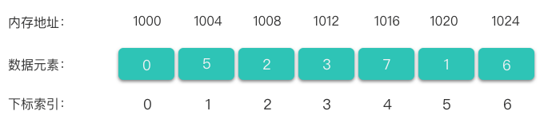
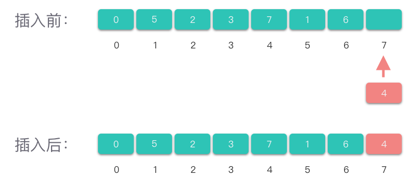
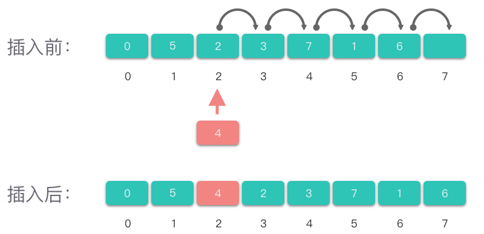
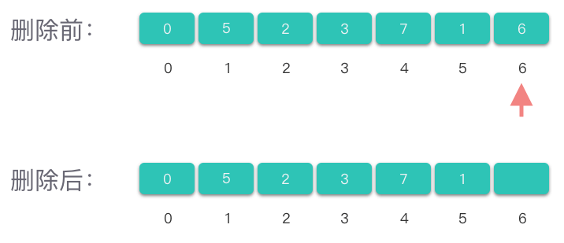
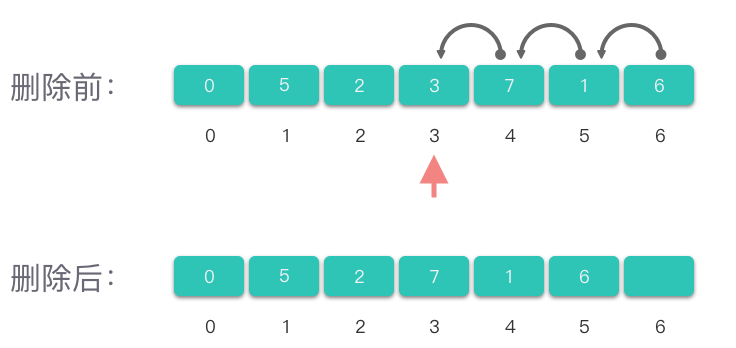
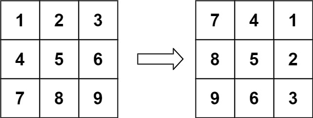
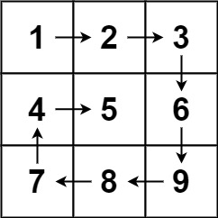
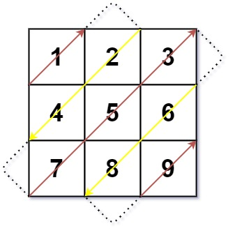

# 2.数组基础

## 1.数据简介

### 1.1 数组定义

> **数组（Array）**：一种线性表数据结构。它使用一组连续的内存空间，来存储一组具有相同类型的数据。

简单来说，**「数组」** 是实现线性表的顺序结构存储的基础。



如上图所示，假设数据元素个数为n，则数组中的每一个数据元素都由自己下标索引，下标索引从0开始，到n-1结束。数组中的每一个「下标索引」，都有一个与之相对应的「数据元素」。

还可以从两个方面来解释一下数组的定义。

1.  **线性表**：线性表就是所有数据元素排成像一条线一样的结构，线性表上的数据元素都是相同类型，且每个数据元素最多只有前、后两个方向。数组就是一种线性表结构，此外，栈、队列、链表都是线性表结构。
2.  &#x20;**连续的内存空间**：线性表有两种存储结构：「顺序存储结构」和「链式存储结构」。其中，「顺序存储结构」是指占用的内存空间是连续的，相邻数据元素之间，物理内存上的存储位置也相邻。数组也是采用了顺序存储结构，并且存储的数据都是相同类型的。

综合这两个角度，数组就可以看做是：使用了「顺序存储结构」的「线性表」的一种实现方式。

### 1.2 随机访问数据元素

数组的一个最大特点是：**可以进行随机访问**。即数组可以根据下标，直接定位到某一个元素存放的位置。

寻址公式：$下标i对应的数据元素地址=数据首地址 + i \times 单个数据元素所占内存大小$

### 1.3 多维数组

二维数据是一个由m行n列数据元素构成的特殊结构，其本质上是以数组作为数据元素的数组，即 「数组的数组」。**二维数组的第一维度表示行，第二维度表示列**。

## 2.数组基本操作

### 2.1 访问元素

1.  检查i的范围是否在合法区间内
2.  当位置合法时，得到元素值。

### 2.2 查找元素

查找数组中元素值为val的位置：

1.  建立一个基于下标的循环，每次将val与当前数据元素nums\[i]进行比较
2.  在找到元素的时候，返回元素下标；
3.  遍历完找不到时，可以返回一个特殊值。

### 2.3 插入元素

#### （1）在数组尾部插入元素

在数组尾部插入值为val的元素：

1.  如果数组尾部容量不满，则直接把 val放在数组尾部的空闲位置，并更新数组的元素计数值。
2.  如果数组容量满了，则插入失败。不过，Python 中的 list 列表做了其他处理，当数组容量满了，则会开辟新的空间进行插入。



#### （2）在数组中间插入元素

在数组的第i个位置插入值为val的元素

1.  检查插入下标是否合法
2.  确定合法位置后，通常情况下第 i个位置上已经有数据了，要把后面位置上的元素依次向后移动；
3.  然后再在第i个元素位置赋值为val，并更新数组的元素计数值



### 2.4 改变元素

将数组中第i个元素值改为val：

1.  检查下标是否合法
2.  赋值

### 2.5 删除元素

#### （1）删除尾部元素



#### （2）删除数组第i个位置上的元素

1.  检查下标i是否合法
2.  如果下标合法，则将i+1后面的元素依次向左移动
3.  修改数组元素计数



## 3.实战题目

### 3.1 加一

[66. 加一 - 力扣（LeetCode）](https://leetcode.cn/problems/plus-one/ "66. 加一 - 力扣（LeetCode）")

```.properties
给定一个由 整数 组成的 非空 数组所表示的非负整数，在该数的基础上加一。

最高位数字存放在数组的首位， 数组中每个元素只存储单个数字。

你可以假设除了整数 0 之外，这个整数不会以零开头。

 

示例 1：

输入：digits = [1,2,3]
输出：[1,2,4]
解释：输入数组表示数字 123。
```

模拟，利用数组模拟加法运算，如果个位数部位9的话，直接把个位数加1就好。如果个位数为9的话，需要考虑进位。

具体步骤：

1.  数组前补 0 位。
2.  将个位数字进行加 1 计算。
3.  遍历数组
    1.  如果该位数字大于等于 10，则向下一位进 1，继续下一位判断进位。
    2.  如果该位数字小于 10，则跳出循环。

```c++
class Solution {
public:
    vector<int> plusOne(vector<int>& digits) {
        int n = digits.size();
        for (int i = n -1; i >= 0; i--) {
            if (digits[i] != 9) {
                digits[i]++;
                for (int j = i + 1; j < n; j++) {
                    digits[j] = 0;
                }
                return digits;
            }
        }

        // 所有元素均为9
        std::vector<int> ans(n + 1);
        ans[0] = 1;
        return ans;
    }
};
```

### 3.2 寻找数组的中心下标

[724. 寻找数组的中心下标 - 力扣（LeetCode）](https://leetcode.cn/problems/find-pivot-index/description/ "724. 寻找数组的中心下标 - 力扣（LeetCode）")

```.properties
给你一个整数数组 nums ，请计算数组的 中心下标 。

数组 中心下标 是数组的一个下标，其左侧所有元素相加的和等于右侧所有元素相加的和。

如果中心下标位于数组最左端，那么左侧数之和视为 0 ，因为在下标的左侧不存在元素。这一点对于中心下标位于数组最右端同样适用。

如果数组有多个中心下标，应该返回 最靠近左边 的那一个。如果数组不存在中心下标，返回 -1 。


示例 1：

输入：nums = [1, 7, 3, 6, 5, 6]
输出：3
解释：
中心下标是 3 。
左侧数之和 sum = nums[0] + nums[1] + nums[2] = 1 + 7 + 3 = 11 ，
右侧数之和 sum = nums[4] + nums[5] = 5 + 6 = 11 ，二者相等。
```

两次遍历，第一次遍历先求出数组全部元素和。第二次遍历找到左侧元素和恰好为全部元素和一半的位置。

```c++
class Solution {
public:
    int pivotIndex(vector<int>& nums) {
        int sum = accumulate(nums.begin(), nums.end(), 0);
        // int sum = 0;
        // for (auto& n : nums) {
        //     sum += n;
        // }
        int sum_curr = 0;
        for (int i = 0; i < nums.size(); i++) {
            if (sum_curr * 2 + nums[i] == sum) {
                return i;
            }
            sum_curr += nums[i];
        }

        return -1;
    }
};
```

### 3.3 轮转数组

[189. 轮转数组 - 力扣（LeetCode）](https://leetcode.cn/problems/rotate-array/description/ "189. 轮转数组 - 力扣（LeetCode）")

```.properties
给定一个整数数组 nums，将数组中的元素向右轮转 k 个位置，其中 k 是非负数。


示例 1:

输入: nums = [1,2,3,4,5,6,7], k = 3
输出: [5,6,7,1,2,3,4]
解释:
向右轮转 1 步: [7,1,2,3,4,5,6]
向右轮转 2 步: [6,7,1,2,3,4,5]
向右轮转 3 步: [5,6,7,1,2,3,4]
```

我们可以先将所有元素翻转，这样尾部的 `k mod n` 个元素就被移至数组头部，然后我们再翻转 `[0,k mod n−1]`区间的元素和 `[k mod n,n−1] `区间的元素即能得到最后的答案。

```c++
class Solution {
public:
    // 我们可以先将所有元素翻转，这样尾部的 k mod n 个元素就被移至数组头部，
    // 然后我们再翻转 [0,k mod n−1]区间的元素和 [k mod n,n−1] 区间的元素即能得到最后的答案。
    void rotate(vector<int>& nums, int k) {
        // 如果数组大小为1，直接返回
        if (nums.size() == 1) {
            return;
        }

        k = k % nums.size();

        // 翻转全部数组
        this->reverse(nums, 0, nums.size() - 1);
        // 翻转前k个
        this->reverse(nums, 0, k - 1);
        // 翻转后面的
        this->reverse(nums, k, nums.size() - 1);
    }

    // 翻转数组
    void reverse(std::vector<int>& nums, int start, int end) {
        int tmp = 0;
        while (start < end) {
            tmp = nums[start];
            nums[start] = nums[end];
            nums[end] = tmp;

            start++;
            end--;
        }
    }
};
```

### 3.4 旋转图像

[48. 旋转图像 - 力扣（LeetCode）](https://leetcode.cn/problems/rotate-image/description/ "48. 旋转图像 - 力扣（LeetCode）")

```.properties
给定一个 n × n 的二维矩阵 matrix 表示一个图像。请你将图像顺时针旋转 90 度。

你必须在 原地 旋转图像，这意味着你需要直接修改输入的二维矩阵。请不要 使用另一个矩阵来旋转图像。

输入：matrix = [[1,2,3],[4,5,6],[7,8,9]]
输出：[[7,4,1],[8,5,2],[9,6,3]]

```



由于矩阵中的行列从 0 开始计数，因此对于矩阵中的元素 `matrix[row][col]`，在旋转后，它的新位置为 `matrixnew[col][n−row−1]`

使用临时变量交换四个元素位置

$$
\left\{\begin{array}{ll}\operatorname{temp} & =\text { matrix }[\operatorname{row}][\operatorname{col}] \\ \operatorname{matrix}[\operatorname{row}][\text { col }] & =\operatorname{matrix}[n-\operatorname{col}-1][\operatorname{row}] \\ \operatorname{matrix}[n-\operatorname{col}-1][\operatorname{row}] & =\operatorname{matrix}[n-\operatorname{row}-1][n-\operatorname{col}-1] \\ \operatorname{matrix}[n-\operatorname{row}-1][n-\operatorname{col}-1] & =\operatorname{matrix}[\operatorname{col}][n-\operatorname{row}-1] \\ \operatorname{matrix}[\operatorname{col}][n-\operatorname{row}-1] & =\text { temp }\end{array}\right.
$$

```c++
class Solution {
public:
    // matrix[i][j]←matrix[n−1−j][i]←matrix[n−1−i][n−1−j]←matrix[j][n−1−i]←tmp
    // 当矩阵大小 n 为偶数时，取前 n/2 行、前 n/2列的元素为起始点；
    // 当矩阵大小 n 为奇数时，取前 n/2 行、前 (n+1)/2列的元素为起始点

    void rotate(vector<vector<int>>& matrix) {
        int n = matrix.size();

        for (int i = 0; i < n / 2; i++)
        {
            for (int j = 0; j < (n+1) / 2; j++)
            {
                int tmp = matrix[i][j];
                matrix[i][j] = matrix[n -j - 1][i];
                matrix[n - j -1][i] = matrix[n - i - 1][n - j - 1];
                matrix[n - i - 1][n - j - 1] = matrix[j][n - i - 1];
                matrix[j][n - i - 1] = tmp;
            }
        }

    }
};
```

### 3.5螺旋矩阵

[54. 螺旋矩阵 - 力扣（LeetCode）](https://leetcode.cn/problems/spiral-matrix/description/?envType=study-plan-v2\&envId=top-100-liked "54. 螺旋矩阵 - 力扣（LeetCode）")

```bash
给你一个 m 行 n 列的矩阵 matrix ，请按照 顺时针螺旋顺序 ，返回矩阵中的所有元素。

```



**按层模拟**：**可以将矩阵看成若干层，首先输出最外层的元素，其次输出次外层的元素，直到输出最内层的元素**。

对于每层，从左上方开始以顺时针的顺序遍历所有元素。假设当前层的左上角位于` (top,left`)，右下角位于` (bottom,right)`，按照如下顺序遍历当前层的元素。

1.  从左到右遍历上侧元素，依次为 `(top,left) `到 (top,right)。
2.  从上到下遍历右侧元素，依次为 `(top+1,right)`到` (bottom,right)`。
3.  如果 `left<right`且 `top<bottom`，则从右到左遍历下侧元素，依次为 `(bottom,right−1) `到` (bottom,left+1)`，以及从下到上遍历左侧元素，依次为 `(bottom,left) `到 (`top+1,left)`。

遍历完当前层的元素之后，将 left和 top 分别增加 1，将 right 和 bottom分别减少 1，进入下一层继续遍历，直到遍历完所有元素为止。

```c++
class Solution {
public:
    // 按层模拟：可以将矩阵看成若干层，首先输出最外层的元素，
    // 其次输出次外层的元素，直到输出最内层的元素。
    vector<int> spiralOrder(vector<vector<int>>& matrix) {
        if (matrix.size() == 0 || matrix[0].size() == 0) {
            return {};
        }

        int rows = matrix.size();
        int cols = matrix[0].size();
        std::vector<int> order;

        int left = 0;
        int right = cols - 1;
        int top = 0;
        int bottom = rows - 1;

        while (left <= right && top <= bottom) {
            // 从左到右
            for (int col = left; col <= right; col++) {
                order.push_back(matrix[top][col]);
            }
            // 从上到下
            for (int row = top + 1; row <= bottom; row++) {
                order.push_back(matrix[row][right]);
            }
            // 现在idx在右下角
            if (left < right && top < bottom) {
                // 从右到左
                for (int col = right - 1; col > left; col--) {
                    order.push_back(matrix[bottom][col]);
                }
                // 从下到上
                for (int row = bottom; row > top; row--) {
                    order.push_back(matrix[row][left]);
                }
            }

            left++;
            right--;
            top++;
            bottom--;
        }

        return order;
    }
};
```

### 3.6 对角线遍历

[498. 对角线遍历 - 力扣（LeetCode）](https://leetcode.cn/problems/diagonal-traverse/description/ "498. 对角线遍历 - 力扣（LeetCode）")

```.properties
给你一个大小为 m x n 的矩阵 mat ，请以对角线遍历的顺序，用一个数组返回这个矩阵中的所有元素。

输入：mat = [[1,2,3],[4,5,6],[7,8,9]]
输出：[1,2,4,7,5,3,6,8,9]

```



这道题的关键是「找规律」和「考虑边界问题」。

找规律：

1.  当「行号 + 列号」为偶数时，遍历方向为从左下到右上。可以记为右上方向 (−1,+1)，即行号减 1，列号加 1。
2.  当「行号 + 列号」为奇数时，遍历方向为从右上到左下。可以记为左下方向 (+1,−1)，即行号加 1，列号减 1。

边界情况：

1.  向右上方向移动时：
    1.  如果在最后一列，则向下方移动，即 `x += 1`。
    2.  如果在第一行，则向右方移动，即 `y += 1`。
    3.  其余情况想右上方向移动，即 `x -= 1`、`y += 1`。
2.  向左下方向移动时：
    1.  如果在最后一行，则向右方移动，即 `y += 1`。
    2.  如果在第一列，则向下方移动，即 `x += 1`。
    3.  其余情况向左下方向移动，即 `x += 1`、`y -= 1`。

```c++
class Solution {
public:
    vector<int> findDiagonalOrder(vector<vector<int>>& mat) {
        int row = mat.size();
        int col = mat[0].size();
        int count = row * col;
        std::vector<int> ans;

        // 起点
        int x = 0;
        int y = 0;

        for (int i = 0; i < row * col; i++) {
            ans.push_back(mat[x][y]);
            // 当「行号 + 列号」为偶数时，遍历方向为从左下到右上。
            // 可以记为右上方向 (−1,+1)，即行号减 1，列号加 1。
            if ((x + y) % 2 == 0) {
                // 最后一列，向下方移动
                if (y == col - 1) {
                    x++;
                // 第一行，向右方移动
                } else if (x == 0) {
                    y++;
                // 右上
                } else {
                    x--;
                    y++;
                }
            // 当「行号 + 列号」为奇数时，遍历方向为从右上到左下。
            // 可以记为左下方向 (+1,−1)，即行号加 1，列号减 1。
            } else {
                // 最后一行，向右方移动
                if (x == row - 1) {
                    y++;
                // 第一列，向下方移动
                } else if (y == 0) {
                    x++;
                // 左下方向
                } else {
                    x++;
                    y--;
                }
            }
        }

        return ans;
    }
};
```
