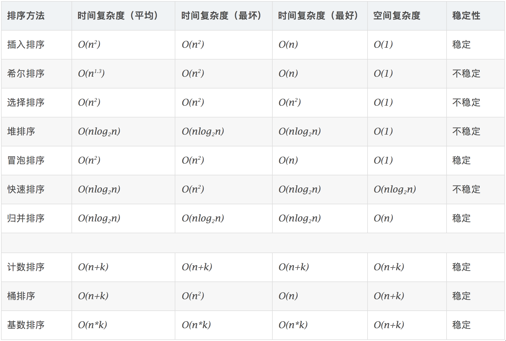

# 3.数组排序

## 1.排序算法




[https://dongnian.icu/dsa/leetcode/18\_sort/README/](https://dongnian.icu/dsa/leetcode/18_sort/README/ "https://dongnian.icu/dsa/leetcode/18_sort/README/")

## 2.实战题目

### 2.1 破解闯关密码

[LCR 164. 破解闯关密码 - 力扣（LeetCode）](https://leetcode.cn/problems/ba-shu-zu-pai-cheng-zui-xiao-de-shu-lcof/ "LCR 164. 破解闯关密码 - 力扣（LeetCode）")

```c++
闯关游戏需要破解一组密码，闯关组给出的有关密码的线索是：

- 一个拥有密码所有元素的非负整数数组 password
- 密码是 password 中所有元素拼接后得到的最小的一个数

请编写一个程序返回这个密码。

示例 1:

输入: password = [15, 8, 7]
输出: "1578"
```

自定义排序：

-   如果拼接字符串 $x + y > y + x$，则 $x$ 大于 $y$，$y$ 应该排在 $x$ 前面，从而使拼接起来的数字尽可能的小。
-   反之，如果拼接字符串 $x + y < y + x$，则 $x$ 小于$  y $ ，$x$ 应该排在 $y$ 前面，从而使拼接起来的数字尽可能的小。

按照上述规则，对原数组进行排序。


```c++
class Solution {
public:
    string crackPassword(vector<int>& password) {
        std::vector<std::string> strs;
        std::string ans;
        // 变换为字符串
        for (auto& pw : password) {
            strs.push_back(std::to_string(pw));
        }
        // 自定义排序
        std::sort(strs.begin(), strs.end(), [](std::string& x, std::string& y){
            return x + y < y + x;
        });
        // 组成答案
        for (auto& s : strs) {
            ans.append(s);
        }
        return ans;
    }
};
```

### 2.2 移动零

[283. 移动零 - 力扣（LeetCode）](https://leetcode.cn/problems/move-zeroes/ "283. 移动零 - 力扣（LeetCode）")

```c++
给定一个数组 nums，编写一个函数将所有 0 移动到数组的末尾，同时保持非零元素的相对顺序。

请注意 ，必须在不复制数组的情况下原地对数组进行操作。

 

示例 1:

输入: nums = [0,1,0,3,12]
输出: [1,3,12,0,0]
```

```c++
class Solution {
public:
    // 用一个指针，记录0元素的位置，每次循环到非零元素，
    // 将非零元素放置到记录0元素的位置，并移动记录0元素位置指针
    void moveZeroes(vector<int>& nums) {
        // j 记录每次循环中的非零元素下标
        int j = 0;
        for (int i = 0; i < nums.size(); i++) {
            if (nums[i] != 0) {
                nums[j] = nums[i];
                // 处理最后一个数
                if (i != j) {
                    nums[i] = 0;
                }
                j++;
            }
        }
    }

    void moveZeroes_swap(vector<int>& nums) {
        // j 记录每次循环中的非零元素下标
        int j = 0;
        for (int i = 0; i < nums.size(); i++) {
            if (nums[i] != 0) {
                int tmp = nums[j];
                nums[j] = nums[i];
                nums[i] = tmp;
                j++;
            }
        }
    }
};
```

### 2.3 排序数组

[912. 排序数组 - 力扣（LeetCode）](https://leetcode.cn/problems/sort-an-array/description/ "912. 排序数组 - 力扣（LeetCode）")

```c++
给你一个整数数组 nums，请你将该数组升序排列。


示例 1：

输入：nums = [5,2,3,1]
输出：[1,2,3,5]

```

```c++
class Solution {
public:
    vector<int> sortArray(vector<int>& nums) {
        if (nums.size() == 0) {
            return {};
        }
        // // 1. 插入排序
        // this->select_sort(nums);

        // // // 2.1 直接插入排序
        // this->inert_sort(nums);

        // // 2.2 折半插入排序
        // this->bin_insert_sort(nums);

        // // 2.3 希尔排序
        // this->shell_sort(nums);

        // 2.4 冒泡
        // this->bulle_sort(nums);

        // 3.1 快速排序
        // this->quick_sort(nums, 0, nums.size() - 1);

        // 3.2 归并排序
        this->merge_sort(nums, 0, nums.size() - 1);

        // 3.3 堆排序
        // this->heap_sort(nums);

        return nums;
    }
private:
    // 1. 选择排序 O(n^2)  超出时间限制
    // 每一趟在待排序元素中选取关键字最小的元素加入有序子序列中
    void select_sort(std::vector<int>& nums) {
        int len = nums.size();
        // 记录最小元素位置
        int min_idx = -1;
        // 遍历
        for (int i = 0; i < len; i++) {
            min_idx = i;
            // 选择最小元素
            for (int j = i + 1; j < len; j++) {
                if (nums[j] < nums[min_idx]) {
                    min_idx = j;
                }
            }
            // 交换元素
            if (min_idx != i) {
                int tmp = nums[min_idx];
                nums[min_idx] = nums[i];
                nums[i] = tmp;
            }
        }
    }

    // 2.1 直接插入排序 超时
    // 将0号位置放哨兵：要插入的元素
    // 每次将一个待排序的记录按其关键字插入到前面已排号的序列中
    void inert_sort(std::vector<int>& nums) {
        int len = nums.size();
        if (len <= 1) {
            return;
        }
        // 依次将 2~n 插入到前面已排序的序列
        for (int i = 1; i < len; i++) {
            // i 小于前驱，将 i 插入有序表
            if (nums[i] < nums[i - 1]) {
                int tmp = nums[i];
                int j = i - 1;
                // 从后往前查找待插入得位置
                for (; j >=0 && tmp < nums[j]; j--) {
                    // 向后移动元素
                    nums[j + 1] = nums[j];
                }
                // 插入数据
                nums[j + 1] = tmp;
            }
        }
    }

    // 2.2 折半插入排序 超时
    void bin_insert_sort(std::vector<int>& nums) {
        int left, mid, right;
        for (int i = 1; i < nums.size(); i++) {
            int tmp = nums[i];

            left = 0;
            right = i - 1;
            // 查找
            while (left <= right) {
                mid = left + (right - left) / 2;
                // 查找左半部分
                if (nums[mid] > tmp) {
                    right = mid - 1;
                } else {
                    left = mid + 1;
                }
            }

            // 后移元素，空出插入位置
            // 注意范围，left指针指向选中的元素
            for (int j = i - 1; j >= left; j--) {
                nums[j + 1] = nums[j];
            }
            // 插入
            nums[left] = tmp;
        }
    }

    // 2.3 希尔排序 超时
    // 先将排序表分割成若干如L[i, i+d, i+2d, ..., i+kd] 的“特殊”子表，
    // 对各个子表进行直接插入排序。
    // 缩小增量d，重复上述过程，直到d=1为止。
    void shell_sort(std::vector<int>& nums) {
        int len = nums.size();
        // 步长
        for (int dk = len / 2; dk >= 1; dk = dk / 2) {
            for (int i = dk + 1; i < len; i++) {
                if (nums[i] < nums[i - dk]) {
                    // 将i插入有序增量子表
                    int tmp = nums[i];
                    // 元素后移
                    int j = i - dk;
                    for (; i >= 0 && tmp < nums[j]; j -= dk) {
                        nums[j + dk] = nums[j];
                    }
                    // 插入
                    nums[j + dk] = tmp;
                }
            }
        }
    }

    // 2.4 冒泡排序 超时
    // 从后往前（或从前往后）两两比较相邻元素的值，若为逆序，
    // 则交换它们，直到序列比较完。称这个过程为“一趟”冒泡排序，
    // 最多只需n-1趟排序

    // 每一趟排序后都可以使一个元素的移动到最终位置，
    // 以确定最终位置的元素在之后的处理中无需对比

    // 如果某一趟排序过程中未发生“交换”，则算法可以提前结束
    void bulle_sort(std::vector<int>& nums) {
        int len = nums.size();
        if (len <= 1) {
            return;
        }
        // 提前退出标志位
        bool flag = false;
        for (int i = 0; i < len; i++)
        {
            flag = false;
            for (int j = 0; j < len - i - 1; j++)
            {
                // 前面的元素比后面的大，交换顺序
                if (nums[j] > nums[j + 1])
                {
                    int tmp = nums[j];
                    nums[j] = nums[j + 1];
                    nums[j + 1] = tmp;
                    // 数据交换标志位
                    flag = true;
                }
            }
            // 若没有数据交换，提前退出
            if (!flag)
                break;
        }
    }

    // 3.1 快速排序
    // 一次划分区间
    int partite_region(std::vector<int>& nums, int left, int right)
    {
        // 当前表的第一个元素作为枢轴，对其划分
        int pivot = nums[left];
        // 循环条件
        while (left < right)
        {
            // high向前寻找比枢轴点小的元素
            while (left < right && nums[right] > pivot)
                right--;
            // 将此小的元素移动到枢轴点左端
            nums[left] = nums[right];
            // low向后寻找比枢轴点大的元素
            while (left < right && nums[left] <= pivot)
                left++;
            // 将此大的元素移动到枢轴点右端
            nums[right] = nums[left];
        }
        // 枢轴点元素放到最终位置
        nums[left] = pivot;
        // 放回枢轴点元素
        return left;
    }
    void quick_sort(std::vector<int>& nums, int left, int right)
    {
        if (left < right)
        {
            // 划分区间
            int pivot_pos = partite_region(nums, left, right);
            // 一次对两个子表进行递归排序
            this->quick_sort(nums, left, pivot_pos - 1);
            this->quick_sort(nums, pivot_pos + 1, right);
        }
    }

    // 3.1 归并排序
    // 先排序左右子数组，然后合并两个有序子数组
    // 1. 把长度为n的输入序列分成两个长度为n/2的子序列
    // 2. 对这两个子序列分别采用归并排序:
    // 3. 将两个排序好的子序列合并成一个最终的排序序列
    void merge(std::vector<int>& nums, int left, int mid, int right)
    {
        // 辅助数组
        std::vector<int> tmp(right - left + 1);
        // // 表nums中的元素，全部复制到tmp中
        // for (int k = left; k <= right; k++)
        //     tmp[k] = nums[k];
        int left_idx = left;
        int right_idx = mid + 1;
        int tmp_index = 0;
        // 比较tmp的左右两段中的元素,将较小值复制到L中
        while (left_idx <= mid && right_idx <= right)
        {
            // 两个元素相等时，优先使用靠前的那个（稳定性）
            if (nums[left_idx] <= nums[right_idx])
                tmp[tmp_index++] = nums[left_idx++];
            else
                tmp[tmp_index++] = nums[right_idx++];
        }

        // 若第一个表未检测完，复制
        while(left_idx <= mid)
            tmp[tmp_index++] = nums[left_idx++];
        // 若第二个表未检测完，复制
        while (right_idx <= right)
            tmp[tmp_index++] = nums[right_idx++];

        // 复制tmp到nums
        for (int k = 0; k < tmp.size(); k++) {
            nums[left + k] = tmp[k];
        }

    }
    void merge_sort(std::vector<int>& nums, int left, int right)
    {
        if (left < right)
        {
            int mid = left + (right - left) / 2;
            this->merge_sort(nums, left, mid);
            this->merge_sort(nums, mid + 1, right);
            this->merge(nums, left, mid, right);
        }
    }


    // 3.3 堆排序
    // 从下往上堆化
    void heapify(std::vector<int>& nums, int n, int k) {
        //std::cout << "2222";
        while (true)
        {
            // 寻找父结点的两个子结点中最大的一个
            int max_pos = k;
            if (k * 2 < n && nums[k] < nums[k * 2])
                max_pos = k * 2;
            if (k * 2 + 1 < n && nums[max_pos] < nums[k * 2 + 1])
                max_pos = k * 2 + 1;
            // 若子结点比自己都小，父结点就是最大的
            if (max_pos == k)
                break;
            // 交换元素
            int tmp_elem = nums[k];
            nums[k] = nums[max_pos];
            nums[max_pos] = tmp_elem;
            // 更新
            k = max_pos;
        }
    }

    void heap_sort(std::vector<int>& nums) {
        int len = nums.size();
        if (len == 0) {
            return;
        }

        // 建堆
        for (int i = len / 2 - 1; i >= 0; i--) {
            heapify(nums,len, i);
        }

        // 排序
        for (int i = len - 1; i >= 0; i--) {
            int tmp = nums[i];
            nums[i] = nums[0];
            nums[0] = tmp;

            heapify(nums, i, 0);
        }
    }

};
```

### 2.4 相对名次

[506. 相对名次 - 力扣（LeetCode）](https://leetcode.cn/problems/relative-ranks/description/ "506. 相对名次 - 力扣（LeetCode）")

```c++
给你一个长度为 n 的整数数组 score ，其中 score[i] 是第 i 位运动员在比赛中的得分。所有得分都 互不相同 。

运动员将根据得分 决定名次 ，其中名次第 1 的运动员得分最高，名次第 2 的运动员得分第 2 高，依此类推。运动员的名次决定了他们的获奖情况：

- 名次第 1 的运动员获金牌 "Gold Medal" 。
- 名次第 2 的运动员获银牌 "Silver Medal" 。
- 名次第 3 的运动员获铜牌 "Bronze Medal" 。
- 从名次第 4 到第 n 的运动员，只能获得他们的名次编号（即，名次第 x 的运动员获得编号 "x"）。

使用长度为 n 的数组 answer 返回获奖，其中 answer[i] 是第 i 位运动员的获奖情况。 

示例 1：

输入：score = [5,4,3,2,1]
输出：["Gold Medal","Silver Medal","Bronze Medal","4","5"]
解释：名次为 [1st, 2nd, 3rd, 4th, 5th] 。
```

1.  先对数组 `score `进行排序。
2.  再将对应前三个位置上的元素替换成对应的字符串：`"Gold Medal"`, `"Silver Medal"`, `"Bronze Medal"`。

```c++
class Solution {
public:
    vector<string> findRelativeRanks(vector<int>& score) {
        int n = score.size();
        std::string desc[3] = {"Gold Medal","Silver Medal","Bronze Medal"};
        std::vector<std::pair<int, int>> arr;

        for (int i = 0; i < n; i++) {
            arr.push_back(std::make_pair(-score[i], i));
        }

        std::sort(arr.begin(), arr.end());
        std::vector<string> ans(n);

        for (int i = 0; i < n; i++) {
            if (i >= 3) {
                ans[arr[i].second] = to_string(i + 1);
            } else {
                ans[arr[i].second] = desc[i];
            }
        }

        return ans;
    }
};
```

### 2.5 合并两个有序数组

[88. 合并两个有序数组 - 力扣（LeetCode）](https://leetcode.cn/problems/merge-sorted-array/description/ "88. 合并两个有序数组 - 力扣（LeetCode）")

```c++
给你两个按 非递减顺序 排列的整数数组 nums1 和 nums2，另有两个整数 m 和 n ，分别表示 nums1 和 nums2 中的元素数目。

请你 合并 nums2 到 nums1 中，使合并后的数组同样按 非递减顺序 排列。

注意：最终，合并后数组不应由函数返回，而是存储在数组 nums1 中。为了应对这种情况，nums1 的初始长度为 m + n，其中前 m 个元素表示应合并的元素，后 n 个元素为 0 ，应忽略。nums2 的长度为 n 。

 

示例 1：

输入：nums1 = [1,2,3,0,0,0], m = 3, nums2 = [2,5,6], n = 3
输出：[1,2,2,3,5,6]
解释：需要合并 [1,2,3] 和 [2,5,6] 。
合并结果是 [1,2,2,3,5,6] ，其中斜体加粗标注的为 nums1 中的元素。
```

```c++
class Solution {
public:
    // nums1的后半部分是空的，可以直接覆盖而不会影响结果。
    // 因此可以指针设置为从后向前遍历，每次取两者之中的较大者放进nums1的最后面。
    void merge(vector<int>& nums1, int m, vector<int>& nums2, int n) {
        int curr_idx = m + n - 1;
        int nums1_idx = m - 1;
        int nums2_idx = n - 1;

        while(nums1_idx >= 0)
        {
            int num1 = nums1[nums1_idx--];
            while (nums2_idx >= 0 && num1 < nums2[nums2_idx])
            {
                nums1[curr_idx--] = nums2[nums2_idx--];
            }
            nums1[curr_idx--] = num1;
        }

        while (nums2_idx >= 0)
        {
            nums1[curr_idx--] = nums2[nums2_idx--];
        }
    }
};
```

### 2.6 交易逆序对的总数

[LCR 170. 交易逆序对的总数 - 力扣（LeetCode）](https://leetcode.cn/problems/shu-zu-zhong-de-ni-xu-dui-lcof/ "LCR 170. 交易逆序对的总数 - 力扣（LeetCode）")

```c++
在股票交易中，如果前一天的股价高于后一天的股价，则可以认为存在一个「交易逆序对」。请设计一个程序，输入一段时间内的股票交易记录 record，返回其中存在的「交易逆序对」总数。

 

示例 1:

输入：record = [9, 7, 5, 4, 6]
输出：8
解释：交易中的逆序对为 (9, 7), (9, 5), (9, 4), (9, 6), (7, 5), (7, 4), (7, 6), (5, 4)。
```


每当遇到 左子数组当前元素 > 右子树组当前元素时，意味着「左子数组从当前元素开始，一直到左子数组末尾元素」与「右子树组当前元素」构成了若干个逆序对。

比如上图中的左子数组 $[0, 3, 5, 7]$ 与右子树组 $[1, 4, 6, 8]$，遇到左子数组中元素 $3$ 大于右子树组中元素 $1$。则左子数组从 $3$ 开始，经过 $5$ 一直到 $7$，与右子数组当前元素 $1$ 都构成了逆序对。即 $[3, 1]$、$[5, 1]$、$[7, 1]$ 都构成了逆序对。

因此，可以在合并两个有序数组的时候计算逆序对。具体做法如下：

1.  使用全局变量 $cnt$ 来存储逆序对的个数。然后进行归并排序。
2.  **分割过程**：先递归地将当前序列平均分成两半，直到子序列长度为 $1$。
    1.  找到序列中心位置 $mid$，从中心位置将序列分成左右两个子序列 $left\underline{}arr$、$right\underline{}arr$。
    2.  对左右两个子序列 $left\underline{}arr$、$right\underline{}arr$ 分别进行递归分割。
    3.  最终将数组分割为 $n$ 个长度均为 $1$ 的有序子序列。
3.  **归并过程**：从长度为 $1$ 的有序子序列开始，依次进行两两归并，直到合并成一个长度为 $n$ 的有序序列。
    1.  使用临时数组tmp存储合并后的数组；
    2.  使用两个指针，left\_idx和right\_idx分别指向两个待合并序列的初始位置
    3.  比较两个指针指向的元素，如果存在逆序，则更新count，即`count += (mid - left_idx + 1);`
    4.  重复步骤 $c$，直到某一指针到达子序列末尾。
    5.  将另一个子序列中的剩余元素存入到结果数组 $ tmp
          $ 中。
    6.  将`tmp`更新到原始数组中。
4.  返回数组中的逆序对的总数，即 `count`

```c++
class Solution {
public:
    int reversePairs(vector<int>& record) {
        m_count = 0;
        this->merge_sort(record, 0, record.size() - 1);
        for (auto& r : record) {
            std::cout << r << " ";
        }
        std::cout << std::endl;
        return m_count;
    }

    void merge_sort(std::vector<int>& arr, int left, int right) {
        if (left >= right) {
            return;
        }
        int mid = left + (right - left) / 2;
        this->merge_sort(arr, left, mid);
        this->merge_sort(arr, mid + 1, right);
        this->merge(arr, left, mid, right);
    }

    void merge(std::vector<int>& nums, int left, int mid, int right) {
        // 辅助数组
        std::vector<int> tmp(right - left + 1);
        int left_idx = left;
        int right_idx = mid + 1;
        int tmp_idx = 0;

        // 比较元素
        while (left_idx <= mid && right_idx <= right) {
            // 将两个有序子序列中较小元素依次插入到结果数组中
            if (nums[left_idx] <= nums[right_idx]) {
                tmp[tmp_idx++] = nums[left_idx++];
            } else {
                // 存在逆序
                this->m_count += (mid - left_idx + 1);
                tmp[tmp_idx++] = nums[right_idx++];
            }
        }

        // 如果左侧有剩余元素，插入结果数组中
        while (left_idx <= mid) {
            tmp[tmp_idx++] = nums[left_idx++];
        }

        // 如果右侧有剩余元素，插入结果数组中
        while (right_idx <= right) {
             tmp[tmp_idx++] = nums[right_idx++];
        }

        // 复制tmp到nums
        for (int k = 0; k < tmp.size(); k++) {
            nums[left + k] = tmp[k];
        }
    }

private:
    int m_count = 0;
};
```

### 2.7 颜色分类

[75. 颜色分类 - 力扣（LeetCode）](https://leetcode.cn/problems/sort-colors/description/ "75. 颜色分类 - 力扣（LeetCode）")

```c++
给定一个包含红色、白色和蓝色、共 n 个元素的数组 nums ，原地对它们进行排序，使得相同颜色的元素相邻，并按照红色、白色、蓝色顺序排列。

我们使用整数 0、 1 和 2 分别表示红色、白色和蓝色。

必须在不使用库内置的 sort 函数的情况下解决这个问题。

 

示例 1：

输入：nums = [2,0,2,1,1,0]
输出：[0,0,1,1,2,2]
```

借鉴快速排序算法中的 $partition$ 过程，将 $1$ 作为基准数 $pivot$，然后将序列分为三部分：$0$（即比 $1$ 小的部分）、等于 $1$ 的部分、$2$（即比 $1$ 大的部分）。具体步骤如下：

1.  使用两个指针 $left$、$right$，分别指向数组的头尾。$left$ 表示当前处理好红色元素的尾部，$right$ 表示当前处理好蓝色的头部。
2.  再使用一个下标 $index$ 遍历数组，如果遇到 $nums[index] == 0$，就交换 $nums[index]$ 和 $nums[left]$，同时将 $left$ 右移。如果遇到 $nums[index] == 2$，就交换 $nums[index]$ 和 $nums[right]$，同时将 $right$ 左移。
3.  直到 $index$ 移动到 $right$ 位置之后，停止遍历。遍历结束之后，此时 $left$ 左侧都是红色，$right$ 右侧都是蓝色。

注意：移动的时候需要判断 $index$ 和 $left$ 的位置，因为 $left$ 左侧是已经处理好的数组，所以需要判断 $index$ 的位置是否小于 $left$，小于的话，需要更新 $index$ 位置。

```c++
class Solution {
public:
    void sortColors(vector<int>& nums) {
        int left = 0;
        int right = nums.size() - 1;
        int idx = 0;

        while (idx <= right) {
            if (idx < left) {
                idx++;
            } else if (nums[idx] == 0) {
                swap(nums[idx], nums[left]);
                left++;
            } else if (nums[idx] == 2) {
                swap(nums[idx], nums[right]);
                right--;
            } else {
                idx++;
            }
        }
    }
};
```

### 2.8 数组中的第k个最大元素

[215. 数组中的第K个最大元素 - 力扣（LeetCode）](https://leetcode.cn/problems/kth-largest-element-in-an-array/description/ "215. 数组中的第K个最大元素 - 力扣（LeetCode）")

```c++
给定整数数组 nums 和整数 k，请返回数组中第 k 个最大的元素。

请注意，你需要找的是数组排序后的第 k 个最大的元素，而不是第 k 个不同的元素。

你必须设计并实现时间复杂度为 O(n) 的算法解决此问题。


示例 1:

输入: [3,2,1,5,6,4], k = 2
输出: 5
```

1、快排：先对原数组排序，再返回倒数第 k 个位置，这样平均时间复杂度是 $O(n \log n)$，但其实可以做的更快。

在分解的过程当中，我们会对子数组进行划分，如果划分得到的 q 正好就是我们需要的下标，就直接返回 $a[q]$；否则，如果 q 比目标下标小，就递归右子区间，否则递归左子区间。这样就可以把原来递归两个区间变成只递归一个区间，提高了时间效率。这就是「快速选择」算法。

```c++
class Solution {
public:
    // 1.快速排序
    int findKthLargest(vector<int>& nums, int k) {
        return this->quick_select(nums, 0, nums.size() - 1, nums.size() - k);
    }
    int quick_select(std::vector<int>& nums, int left, int right, int k) {
        if (left == right) {
            return nums[k];
        }

        int pivot = nums[left];
        int i = left - 1;
        int j = right + 1;
        while (i < j)
        {
            do {
                i++;
            } while (nums[i] < pivot);

            do {
                j--;
            } while (nums[j] > pivot);

            if (i < j) {
                swap(nums[i], nums[j]);
            }
        }
        if (k <= j) {
            return this->quick_select(nums, left, j, k);
        } else {
            return this->quick_select(nums, j + 1, right, k);
        }
    }
};
```

2、建立一个大根堆，做`k - 1`次删除操作后堆顶元素就是我们要找的答案。

```c++
class Solution {
public:
    int findKthLargest(vector<int>& nums, int k) {
        int heap_size = nums.size();
        this->build_max_heap(nums, heap_size);
        for (int i = nums.size() - 1; i >= nums.size() - k + 1; i--) {
            swap(nums[0], nums[i]);
            heap_size--;
            this->max_heapify(nums, 0, heap_size);
        }

        return nums[0];
    }
    
    // 从上往下堆化
    void max_heapify(std::vector<int>& nums, int i, int heap_size) {
        // 父节点，左子树，右子树
        int largest_idx = i;
        int left_idx = 2 * i + 1;
        int right_idx = 2 * i + 2;
        
        // 寻找左右子树两个子节点中最大的一个
        if (left_idx < heap_size && nums[left_idx] > nums[largest_idx]) {
            largest_idx = left_idx;
        }
        if (right_idx < heap_size && nums[right_idx] > nums[largest_idx]) {
            largest_idx = right_idx;
        }
        // 如果能找到子节点比自己大
        // 交换元素，继续堆化
        if (largest_idx != i) {
            swap(nums[i], nums[largest_idx]);
            this->max_heapify(nums, largest_idx, heap_size);
        }
    }

    void build_max_heap(std::vector<int>& nums, int heap_size) {
        for (int i = heap_size / 2; i >= 0; i--) {
            this->max_heapify(nums, i, heap_size);
        }
    }
};
```

### 2.9 库存管理Ⅲ

[LCR 159. 库存管理 III - 力扣（LeetCode）](https://leetcode.cn/problems/zui-xiao-de-kge-shu-lcof/description/ "LCR 159. 库存管理 III - 力扣（LeetCode）")

```c++
仓库管理员以数组 stock 形式记录商品库存表，其中 stock[i] 表示对应商品库存余量。请返回库存余量最少的 cnt 个商品余量，返回 顺序不限。

 

示例 1：

输入：stock = [2,5,7,4], cnt = 1
输出：[2]
示例 2：

输入：stock = [0,2,3,6], cnt = 2
输出：[0,2] 或 [2,0]
```

1、调用系统函数，对数组排序，取出前n个

```c++
class Solution {
public:
    // 1.对原数组排序，取出前n个
    vector<int> inventoryManagement(vector<int>& stock, int cnt) {
        std::vector<int> ans(cnt, 0);
        std::sort(stock.begin(), stock.end());
        for (int i = 0; i < cnt; i++) {
            ans[i] = stock[i];
        }
        return ans;
    }
};
```

2、堆排序

```c++
class Solution {
public:
    // 2.堆排序，取出前n个
    vector<int> inventoryManagement(vector<int>& stock, int cnt) {
        int heap_size = stock.size();
        this->build_max_heap(stock, heap_size);
        for (int i = stock.size() - 1; i >= 0; i--) {
            swap(stock[0], stock[i]);
            heap_size--;
            this->max_heapify(stock, 0, heap_size);
        }

        std::vector<int> ans(cnt, 0);
        for (int i = 0; i < cnt; i++) {
            ans[i] = stock[i];
        }
        return ans;
    }
    
    // 从上往下堆化
    void max_heapify(std::vector<int>& nums, int i, int heap_size) {
        // 父节点，左子树，右子树
        int largest_idx = i;
        int left_idx = 2 * i + 1;
        int right_idx = 2 * i + 2;
        
        // 寻找左右子树两个子节点中最大的一个
        if (left_idx < heap_size && nums[left_idx] > nums[largest_idx]) {
            largest_idx = left_idx;
        }
        if (right_idx < heap_size && nums[right_idx] > nums[largest_idx]) {
            largest_idx = right_idx;
        }
        // 如果能找到子节点比自己大
        // 交换元素，继续堆化
        if (largest_idx != i) {
            swap(nums[i], nums[largest_idx]);
            this->max_heapify(nums, largest_idx, heap_size);
        }
    }

    void build_max_heap(std::vector<int>& nums, int heap_size) {
        for (int i = heap_size / 2; i >= 0; i--) {
            this->max_heapify(nums, i, heap_size);
        }
    }
};
```

### 2.10 数组的相对排序

[1122. 数组的相对排序 - 力扣（LeetCode）](https://leetcode.cn/problems/relative-sort-array/description/ "1122. 数组的相对排序 - 力扣（LeetCode）")

```c++
给你两个数组，arr1 和 arr2，arr2 中的元素各不相同，arr2 中的每个元素都出现在 arr1 中。

对 arr1 中的元素进行排序，使 arr1 中项的相对顺序和 arr2 中的相对顺序相同。未在 arr2 中出现过的元素需要按照升序放在 arr1 的末尾。

 

示例 1：

输入：arr1 = [2,3,1,3,2,4,6,7,9,2,19], arr2 = [2,1,4,3,9,6]
输出：[2,2,2,1,4,3,3,9,6,7,19]
```

1、自定义排序

由于数组 `arr2`规定了比较顺序，因此可以使用哈希表对该顺序进行映射：即对于数组 `arr2`中的第 i 个元素，将 `(arr2[i],i)`这一键值对放入哈希表 rank中，就可以很方便地对数组 `arr1`中的元素进行比较。

比较函数的写法有很多种，例如可以使用最基础的比较方法，对于元素 x 和 y：

-   如果 `x` 和 `y` 都出现在哈希表中，那么比较它们对应的值 `rank[x]` 和 `rank[y]`；
-   果 `x` 和 `y` 都没有出现在哈希表中，那么比较它们本身；
-   剩余的情况，出现在哈希表中的那个元素较小。

```c++
class Solution {
public:
    vector<int> relativeSortArray(vector<int>& arr1, vector<int>& arr2) {
        std::unordered_map<int, int> rank;
        for (int i = 0; i < arr2.size(); i++) {
            rank[arr2[i]] = i;
        }

        std::sort(arr1.begin(), arr2.begin(), [&](int x, int y) {
            // 两个都出现在哈希表中，比较他们对应的值
            if (rank.count(x)) {
                return rank.count(y) ? rank[x] < rank[y] : true;
            // 不在哈希表中，比较本省
            } else {
                return rank.count(y) ? false : x < y;
            }
        });

        return arr1;
    }
};
```

2、计数排序

因为元素值范围在 $[0, 1000]$，所以可以使用计数排序的思路来解题。

1.  使用数组 $count$ 统计 $arr1$ 各个元素个数。
2.  遍历 $arr2$ 数组，将对应元素$num2$ 按照个数 $count[num2]$ 添加到答案数组 $ans$ 中，同时在 $count$ 数组中减去对应个数。
3.  然后在处理 $count$ 中剩余元素，将 $count$ 中大于 $0$ 的元素下标依次添加到答案数组 $ans$ 中。
4.  最后返回答案数组 $ans$。

```c++
class Solution {
public:
    vector<int> relativeSortArray(vector<int>& arr1, vector<int>& arr2) {
        // 计算待排序序列中最大元素
        int upper = *max_element(arr1.begin(), arr1.end());
        // 统计数组
        std::vector<int> counts(upper + 1);
        for (int x: arr1) {
            counts[x]++;
        }
        std::vector<int> ans;
        for (int x: arr2) {
            for (int i = 0; i < counts[x]; i++) {
                ans.push_back(x);
            }
            counts[x] = 0;
        }
        for (int x = 0; x <= upper; x++) {
            for (int i = 0; i < counts[x]; i++) {
                ans.push_back(x);
            }
        }
        return ans;
    }

};
```

### 2.11 存在重复元素Ⅲ

[220. 存在重复元素 III - 力扣（LeetCode）](https://leetcode.cn/problems/contains-duplicate-iii/description/ "220. 存在重复元素 III - 力扣（LeetCode）")

```c++
给你一个整数数组 nums 和两个整数 indexDiff 和 valueDiff 。

找出满足下述条件的下标对 (i, j)：

- i != j,
- abs(i - j) <= indexDiff
- abs(nums[i] - nums[j]) <= valueDiff

如果存在，返回 true ；否则，返回 false 。

 

示例 1：

输入：nums = [1,2,3,1], indexDiff = 3, valueDiff = 0
输出：true
解释：可以找出 (i, j) = (0, 3) 。
满足下述 3 个条件：
i != j --> 0 != 3
abs(i - j) <= indexDiff --> abs(0 - 3) <= 3
abs(nums[i] - nums[j]) <= valueDiff --> abs(1 - 1) <= 0
```

1.  利用桶排序的思想，将桶的大小设置为 $t + 1$。只需要使用一重循环遍历位置 $i$，然后根据 $\lfloor \frac{nums[i]}{t + 1} \rfloor$，从而决定将 $nums[i]$ 放入哪个桶中。
2.  这样在同一个桶内各个元素之间的差值绝对值都小于等于 $t$。而相邻桶之间的元素，只需要校验一下两个桶之间的差值是否不超过 $t$。这样就可以以 $O(1)$ 的时间复杂度检测相邻 $2 \times k$ 个元素是否满足 $abs(nums[i] - nums[j]) \le t$。
3.  而 $abs(i - j) \le k$ 条件则可以通过在一重循环遍历时，将超出范围的 $nums[i - k]$ 从对应桶中删除，从而保证桶中元素一定满足 $abs(i - j) \le k$。

```c++
class Solution {
public:
    // 1.桶排序
    int get_id(int x, int w) {
        return x < 0 ? (x + 1) / w - 1 : x / w;
    }
    bool containsNearbyAlmostDuplicate(vector<int>& nums, int k, int t) {
        std::unordered_map<int, int> map;
        for (int i = 0; i < nums.size(); i++) {
            // 将 nums[i] 划分到 t + 1个桶中
            int id = get_id(nums[i], (t + 1));
            // 桶中已经有元素
            if (map.count(id)) {
                return true;
            }

            // 把nums[i]放入桶中
            map[id] = nums[i];

            //判断左侧桶是否满足条件
            if (map.count(id - 1) && abs(nums[i] - map[id - 1]) <= t) {
                return true;
            }
            // 判断右侧桶是否满足条件
            if (map.count(id + 1) && abs(nums[i] - map[id + 1]) <= t) {
                return true;
            }

            // 将 i - indexDiff 之前的桶清除，因为之前的桶已经不满足条件了
            if (i >= k) {
                map.erase(get_id(nums[i - k] , (t + 1)));
            }
        }
        return false;
    }
};
```

### 2.12最大间距

[164. 最大间距 - 力扣（LeetCode）](https://leetcode.cn/problems/maximum-gap/description/ "164. 最大间距 - 力扣（LeetCode）")

```c++
给定一个无序的数组 nums，返回 数组在排序之后，相邻元素之间最大的差值 。如果数组元素个数小于 2，则返回 0 。

您必须编写一个在「线性时间」内运行并使用「线性额外空间」的算法。

 

示例 1:

输入: nums = [3,6,9,1]
输出: 3
解释: 排序后的数组是 [1,3,6,9], 其中相邻元素 (3,6) 和 (6,9) 之间都存在最大差值 3。
```

基数排序。基数排序的步骤如下：

-   遍历数组元素，获取数组最大值元素，并取得位数。
-   以个位元素为索引，对数组元素排序。
-   合并数组。
-   之后依次以十位，百位，…，直到最大值元素的最高位处值为索引，进行排序，并合并数组，最终完成排序。

最后，还要注意数组元素个数小于 2 的情况需要特别判断一下。

```c++
class Solution {
public:
    int maximumGap(vector<int>& nums) {
        if (nums.size() < 2) {
            return 0;
        }
        std::vector<int> sort_nums = this->radix_sort(nums);
        int max_gap = 0;
        for (int i = 1; i < sort_nums.size(); i++) {
            max_gap = std::max(max_gap, sort_nums[i] - sort_nums[i-1]);
        }

        // for (auto& n : sort_nums) {
        //     std::cout << n << " " ;
        // }
        // std::cout << std::endl;

        return max_gap;
    }

    std::vector<int> radix_sort(std::vector<int>& nums) {
        int max_val = *max_element(nums.begin(), nums.end());
        int max_size = std::to_string(max_val).size();

        std::vector<int> sort_nums;
        for (int i = 0; i < max_size; i++) {
            std::vector<std::vector<int>> buckets(10, std::vector<int>());
            for (auto& n : nums) {
                buckets[int(n / pow(10, i)) % 10].push_back(n);
            }
            nums.clear();
            for (auto& bucket : buckets) {
                for (auto& n : bucket) {
                    nums.push_back(n);
                }
            }
        }

        return nums;
    }
};
```
