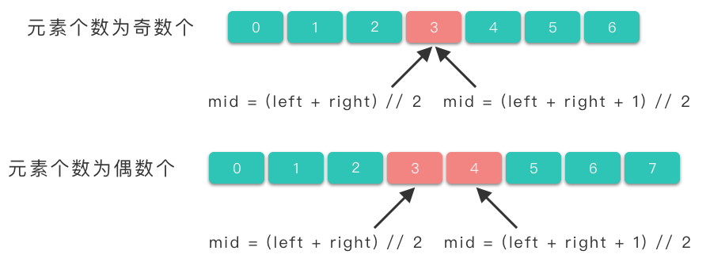

# 4.数组二分查找

## 1.二分查找

> **二分查找算法（Binary Search Algorithm）**：也叫做折半查找算法、对数查找算法，是一种用于在有序数组中查找特定元素的高效搜索算法。

二分查找的基本算法思想为：通过确定目标元素所在的区间范围，反复将查找范围减半，直到找到元素或找不到该元素为止。

### 1.1 算法步骤

1.  **初始化**：首先，确定要查找的有序数据集合。可以是一个数组或列表，确保其中的元素按照升序或者降序排列。
2.  **确定查找范围**：将整个有序数组集合的查找范围确定为整个数组范围区间，即左边界 $left$ 和右边界 $right$。
3.  **计算中间元素**：根据 $mid = \lfloor (left + right) / 2 \rfloor$ 计算出中间元素下标位置 $mid$。
4.  **比较中间元素**：将目标元素 $target$ 与中间元素 $nums[mid]$ 进行比较：
    1.  如果 $target == nums[mid]$，说明找到 $target$，因此返回中间元素的下标位置 $mid$。
    2.  如果 $target < nums[mid]$，说明目标元素在左半部分（$[left, mid - 1]$），更新右边界为中间元素的前一个位置，即 $right = mid - 1$。
    3.  如果 $target > nums[mid]$，说明目标元素在右半部分（$[mid + 1, right]$），更新左边界为中间元素的后一个位置，即 $left = mid + 1$。
5.  重复步骤 $3 \sim 4$，直到找到目标元素时返回中间元素下标位置，或者查找范围缩小为空（左边界大于右边界），表示目标元素不存在，此时返回 $-1$。

### 1.2 代码模板

最简单的情况就是有序数组中不存在重复元素，在其中用二分查找值等于给定值的数据。

```c++
int bsearch(std::vector<int>& nums, int value) {
    int left = 0;
    int right = nums.size() - 1;
    // 在区间 [left, right] 内查找 target
    while (left <= right) {
        // 取区间中间节点
        int mid = left + (right - left) / 2;
        // 如果找到目标值，则直接返回中心位置
        if (nums[mid] == value) {
            return mid;
        // 如果 nums[mid] 小于目标值，则在 [mid + 1, right] 中继续搜索
        } else if (nums[mid] < value) {
            left = mid + 1;
        // 如果 nums[mid] 大于目标值，则在 [left, mid - 1] 中继续搜索
        } else {
            right = mid - 1;
        }
    }

    // 未搜索到元素，返回 -1
    return -1;
}

```

## 2.二分查找细节

### 2.1 区间开闭问题

**全部使用「左闭右闭区间」这种写法**

-   初始化时，$left = 0$，$right = len(nums) - 1$。
-   $left$ 为数组第一个元素位置，$right$ 为数组最后一个元素位置。
-   区间 $[left, right]$ 左右边界上的点都能取到。

### 2.2 mid的取值问题

在二分查找的实际问题中，最常见的 $mid$ 取值公式有两个：

1.  `mid = left + (right - left) // 2`
2.  `mid = left + (right - left + 1) // 2`

式子中 `//` 所代表的含义是「中间数向下取整」。当待查找区间中的元素个数为奇数个，使用这两种取值公式都能取到中间元素的下标位置。

而当待查找区间中的元素个数为偶数时，使用 `mid = (left + right) // 2` 式子我们能取到中间靠左边元素的下标位置，使用 `mid = (left + right + 1) // 2` 式子我们能取到中间靠右边元素的下标位置。



### 2.3 出界条件问题

二分查找算法的写法中，`while` 语句出界判断条件通常有两种：

1.  `left <= right`
2.  `left < right`

先来判断一下导致 `while` 语句出界的条件是什么。

1.  如果判断语句为 `left <= right`，并且查找的元素不在有序数组中，则 `while` 语句的出界条件是 `left > right`，也就是 `left == right + 1`，写成区间形式就是 $[right + 1, right]$，此时待查找区间为空，待查找区间中没有元素存在，此时终止循环时，可以直接返回 $-1$。
    -   比如说区间 $[3, 2]$， 此时左边界大于右边界，直接终止循环，返回 $-1$ 即可。
2.  如果判断语句为`left < right`，并且查找的元素不在有序数组中，则 `while` 语句出界条件是 `left == right`，写成区间形式就是 $[right, right]$。此时区间不为空，待查找区间还有一个元素存在，我们并不能确定查找的元素不在这个区间中，此时终止循环时，如果直接返回 $-1$ 就是错误的。
    -   比如说区间  $[2, 2]$，如果元素 $nums[2]$ 刚好就是目标元素 $target$，此时终止循环，返回 $-1$ 就漏掉了这个元素。

### 2.4 搜索区间范围选择

#### （1）直接法

> 如上述代码模板所示

-   一旦在循环体中找到元素就直接返回
-   循环可以继续的条件是 `left <= right`
-   如果一旦退出循环，则说明这个区间内一定不存在目标元素

#### （2）排除法

1.  设定左右边界为数组两端，即 $left = 0$，$right = len(nums) - 1$，代表待查找区间为 $[left, right]$（左闭右闭区间）。
2.  取两个节点中心位置 $mid$，比较目标元素和中间元素的大小，先将目标元素一定不存在的区间排除。
3.  然后在剩余区间继续查找元素，继续根据条件排除目标元素一定不存在的区间。
4.  直到区间中只剩下最后一个元素，然后再判断这个元素是否是目标元素。

根据排除法的思路，可以写出来两种代码。

**代码 1**

```python
class Solution:
    def search(self, nums: List[int], target: int) -> int:
        left, right = 0, len(nums) - 1
        
        # 在区间 [left, right] 内查找 target
        while left < right:
            # 取区间中间节点
            mid = left + (right - left) // 2
            # nums[mid] 小于目标值，排除掉不可能区间 [left, mid]，在 [mid + 1, right] 中继续搜索
            if nums[mid] < target:
                left = mid + 1 
            # nums[mid] 大于等于目标值，目标元素可能在 [left, mid] 中，在 [left, mid] 中继续搜索
            else:
                right = mid
        # 判断区间剩余元素是否为目标元素，不是则返回 -1
        return left if nums[left] == target else -1
```

**代码 2**

```python
class Solution:
    def search(self, nums: List[int], target: int) -> int:
        left, right = 0, len(nums) - 1
        
        # 在区间 [left, right] 内查找 target
        while left < right:
            # 取区间中间节点
            mid = left + (right - left + 1) // 2
            # nums[mid] 大于目标值，排除掉不可能区间 [mid, right]，在 [left, mid - 1] 中继续搜索
            if nums[mid] > target:
                right = mid - 1 
            # nums[mid] 小于等于目标值，目标元素可能在 [mid, right] 中，在 [mid, right] 中继续搜索
            else:
                left = mid
        # 判断区间剩余元素是否为目标元素，不是则返回 -1
        return left if nums[left] == target else -1
```

**细节**

-   判断语句是 `left < right`。这样在退出循环时，一定有`left == right` 成立，就不用判断应该返回 $left$ 还是 $right$ 了。此时只需要判断 $nums[left]$ 是否为目标元素即可。
-   在循环体中，比较目标元素和中间元素的大小之后，优先将目标元素一定不存在的区间排除，然后再从剩余区间中确定下一次查找区间的范围。
-   在将目标元素一定不存在的区间排除之后，它的对立面（即 `else` 部分）一般就不需要再考虑区间范围了，直接取上一个区间的相反区间。如果上一个区间是 $[mid + 1, right]$，那么相反区间就是 $[left, mid]$。如果上一个区间是  $[left, mid - 1]$，那么相反区间就是 $[mid, right]$。
-   为了避免陷入死循环，当区分被划分为 $[left, mid - 1]$ 与 $[mid, right]$ 两部分时，$mid$\*\* 取值要向上取整\*\*。即 `mid = left + (right - left + 1) // 2`。因为如果当区间中只剩下两个元素时（此时 `right = left + 1`），一旦进入 `left = mid` 分支，区间就不会再缩小了，下一次循环的查找区间还是 $[left, right]$，就陷入了死循环。
    -   比如左边界 $left = 5$，右边界 $right = 6$，此时查找区间为 $[5, 6]$，$mid = 5 + (6 - 5) // 2 = 5$，如果进入 $left = mid$ 分支，那么下次查找区间仍为 $[5, 6]$，区间不再缩小，陷入死循环。
    -   这种情况下，$mid$ 应该向上取整，$mid = 5 + (6 - 5 + 1) // 2 = 6$，如果进入 $left = mid$ 分支，则下次查找区间为 $[6, 6]$。
-   关于边界设置可以记忆为：只要看到 `left = mid` 就向上取整。或者记为：
    -   `left = mid + 1`、`right = mid` 和 `mid = left + (right - left) // 2` 一定是配对出现的。
    -   `right = mid - 1`、`left = mid` 和 `mid = left + (right - left + 1) // 2` 一定是配对出现的。

## 3.实战题目

### 3.1 二分查找

[704. 二分查找 - 力扣（LeetCode）](https://leetcode.cn/problems/binary-search/description/ "704. 二分查找 - 力扣（LeetCode）")

```c++
给定一个 n 个元素有序的（升序）整型数组 nums 和一个目标值 target  ，写一个函数搜索 nums 中的 target，如果目标值存在返回下标，否则返回 -1。


示例 1:

输入: nums = [-1,0,3,5,9,12], target = 9
输出: 4
解释: 9 出现在 nums 中并且下标为 4
```

```c++
class Solution {
public:
    int search(vector<int>& nums, int target) {
        int left = 0;
        int right = nums.size() - 1;
        // 在区间 [left, right] 内查找 target
        while (left <= right) {
            // 取区间中间节点
            int mid = left + (right - left) / 2;
            // 如果找到目标值，则直接返回中心位置
            if (nums[mid] == target) {
                return mid;
            // 如果 nums[mid] 小于目标值，则在 [mid + 1, right] 中继续搜索
            } else if (nums[mid] < target) {
                left = mid + 1;
            // 如果 nums[mid] 大于目标值，则在 [left, mid - 1] 中继续搜索
            } else {
                right = mid - 1;
            }
        }

        // 未搜索到元素，返回 -1
        return -1;
    }
};
```

### 3.2 搜索插入位置

[35. 搜索插入位置 - 力扣（LeetCode）](https://leetcode.cn/problems/search-insert-position/description/ "35. 搜索插入位置 - 力扣（LeetCode）")

```c++
给定一个排序数组和一个目标值，在数组中找到目标值，并返回其索引。如果目标值不存在于数组中，返回它将会被按顺序插入的位置。

请必须使用时间复杂度为 O(log n) 的算法。

 

示例 1:

输入: nums = [1,3,5,6], target = 5
输出: 2
```

```c++
class Solution {
public:
    int searchInsert(vector<int>& nums, int target) {
        int left = 0;
        int right = nums.size() - 1;
        while (left <= right) {
            int mid = left + (right - left) / 2;
            if (nums[mid] == target) {
                return mid;
            } else if (nums[mid] < target) {
                left = mid + 1;
            } else {
                right = mid - 1;
            }
        }

        return left;
    }
};
```

### 3.3 猜数字大小

[374. 猜数字大小 - 力扣（LeetCode）](https://leetcode.cn/problems/guess-number-higher-or-lower/description/ "374. 猜数字大小 - 力扣（LeetCode）")

```c++
猜数字游戏的规则如下：

- 每轮游戏，我都会从 1 到 n 随机选择一个数字。 请你猜选出的是哪个数字。
- 如果你猜错了，我会告诉你，你猜测的数字比我选出的数字是大了还是小了。

你可以通过调用一个预先定义好的接口 int guess(int num) 来获取猜测结果，返回值一共有 3 种可能的情况（-1，1 或 0）：

- -1：我选出的数字比你猜的数字小 pick < num
- 1：我选出的数字比你猜的数字大 pick > num
- 0：我选出的数字和你猜的数字一样。恭喜！你猜对了！pick == num
返回我选出的数字。

 

示例 1：

输入：n = 10, pick = 6
输出：6
```

二分查找

```c++
class Solution {
public:
    int guessNumber(int n) {
        int left = 1;
        int right = n;

        while (left <= right) {
            int mid = left + (right - left) / 2;
            int pick_flag = guess(mid);
            if (pick_flag == 0) {
                return mid;
            } else if (pick_flag == -1) {
                right = mid - 1;
            } else {
                left = mid + 1;
            }
        }
        
        return -1;
    }
};
```

### 3.4 x的平方根

[69. x 的平方根 - 力扣（LeetCode）](https://leetcode.cn/problems/sqrtx/description/ "69. x 的平方根 - 力扣（LeetCode）")

```c++
给你一个非负整数 x ，计算并返回 x 的 算术平方根 。

由于返回类型是整数，结果只保留 整数部分 ，小数部分将被 舍去 。

注意：不允许使用任何内置指数函数和算符，例如 pow(x, 0.5) 或者 x ** 0.5 。

 

示例 1：

输入：x = 4
输出：2
```

二分查找

```c++
class Solution {
public:
    int mySqrt(int x) {
        if (x == 0 || x == 1) {
            return x;
        }
        
        int left = 1;
        int right = x / 2;
        int ans = -1;
        while (left <= right) {
            int mid = left + (right - left) / 2;
            if ((long)mid * mid <= x) {
                ans = mid;
                left = mid + 1;
                
            } else {
                right = mid - 1;
            }
        }

        return ans;
    }
};
```

### 3.5 两数之和Ⅱ-输入有序数组

[167. 两数之和 II - 输入有序数组 - 力扣（LeetCode）](https://leetcode.cn/problems/two-sum-ii-input-array-is-sorted/description/ "167. 两数之和 II - 输入有序数组 - 力扣（LeetCode）")

```c++
给你一个下标从 1 开始的整数数组 numbers ，该数组已按 非递减顺序排列  ，请你从数组中找出满足相加之和等于目标数 target 的两个数。如果设这两个数分别是 numbers[index1] 和 numbers[index2] ，则 1 <= index1 < index2 <= numbers.length 。

以长度为 2 的整数数组 [index1, index2] 的形式返回这两个整数的下标 index1 和 index2。

你可以假设每个输入 只对应唯一的答案 ，而且你 不可以 重复使用相同的元素。

你所设计的解决方案必须只使用常量级的额外空间。

 
示例 1：

输入：numbers = [2,7,11,15], target = 9
输出：[1,2]
解释：2 与 7 之和等于目标数 9 。因此 index1 = 1, index2 = 2 。返回 [1, 2] 。
```

双指针：使用两个指针 left，right。left 指向数组第一个值最小的元素位置，right 指向数组值最大元素位置。

```c++
class Solution {
public:
    vector<int> twoSum(vector<int>& numbers, int target) {
        int left = 0;
        int right = numbers.size() - 1;

        while (left <= right) {
            int sum = numbers[left] + numbers[right];
            if (sum == target) {
                return {left + 1, right + 1};
            } else if (sum > target) {
                right --;
            } else {
                left++;
            }
        }

        return {-1, -1};
    }
};
```

### 3.6 在D天内送达包裹的能力

[1011. 在 D 天内送达包裹的能力 - 力扣（LeetCode）](https://leetcode.cn/problems/capacity-to-ship-packages-within-d-days/description/ "1011. 在 D 天内送达包裹的能力 - 力扣（LeetCode）")

```c++
传送带上的包裹必须在 days 天内从一个港口运送到另一个港口。

传送带上的第 i 个包裹的重量为 weights[i]。每一天，我们都会按给出重量（weights）的顺序往传送带上装载包裹。我们装载的重量不会超过船的最大运载重量。

返回能在 days 天内将传送带上的所有包裹送达的船的最低运载能力。

 

示例 1：

输入：weights = [1,2,3,4,5,6,7,8,9,10], days = 5
输出：15
解释：
船舶最低载重 15 就能够在 5 天内送达所有包裹，如下所示：
第 1 天：1, 2, 3, 4, 5
第 2 天：6, 7
第 3 天：8
第 4 天：9
第 5 天：10

请注意，货物必须按照给定的顺序装运，因此使用载重能力为 14 的船舶并将包装分成 (2, 3, 4, 5), (1, 6, 7), (8), (9), (10) 是不允许的。 
```

船最小的运载能力，最少也要等于或大于最重的那件包裹，即 max(weights)。最多的话，可以一次性将所有包裹运完，即 sum(weights)。船的运载能力介于 \[max(weights), sum(weights)] 之间。

现在要做的就是从这个区间内，找到满足可以在 D 天内运送完所有包裹的最小载重量。

可以通过二分查找的方式，找到满足要求的最小载重量。

```c++
class Solution {
public:
    int shipWithinDays(vector<int>& weights, int days) {
        // 确定二分查找左右边界
        int left = *max_element(weights.begin(), weights.end());
        int right = accumulate(weights.begin(), weights.end(), 0);

        while (left < right) {
            int mid = left + (right - left) / 2;
            int count_days  = 1;
            int curr_weight = 0;
            for (auto& weight : weights) {
                if (curr_weight + weight > mid) {
                    count_days++;
                    curr_weight = 0;
                }
                curr_weight += weight;
            }

            if (count_days <= days) {
                right = mid;
            } else {
                left = mid + 1;
            }
        }

        return left;
    }
};
```

### 3.7 第一个错误的版本

[278. 第一个错误的版本 - 力扣（LeetCode）](https://leetcode.cn/problems/first-bad-version/description/ "278. 第一个错误的版本 - 力扣（LeetCode）")

```c++
你是产品经理，目前正在带领一个团队开发新的产品。不幸的是，你的产品的最新版本没有通过质量检测。由于每个版本都是基于之前的版本开发的，所以错误的版本之后的所有版本都是错的。

假设你有 n 个版本 [1, 2, ..., n]，你想找出导致之后所有版本出错的第一个错误的版本。

你可以通过调用 bool isBadVersion(version) 接口来判断版本号 version 是否在单元测试中出错。实现一个函数来查找第一个错误的版本。你应该尽量减少对调用 API 的次数。

 
示例 1：

输入：n = 5, bad = 4
输出：4
解释：
调用 isBadVersion(3) -> false 
调用 isBadVersion(5) -> true 
调用 isBadVersion(4) -> true
所以，4 是第一个错误的版本。
```

如果检测某个版本不是错误版本时，则该版本之前的所有版本都不是错误版本。而当某个版本是错误版本时，则该版本之后的所有版本都是错误版本。我们可以利用这样的性质，在 `[1, n]` 的区间内使用二分查找方法，从而在 `O(log n)` 时间复杂度内找到第一个出错误的版本。

```c++
class Solution {
public:
    int firstBadVersion(int n) {
        int left = 1;
        int right = n;

        while (left < right) {
            int mid = left + (right - left) / 2;
            if (isBadVersion(mid)) {
                right = mid;
            } else {
                left = mid + 1;
            }
        }

        return left;
    }
};
```

### 3.8 搜索旋转排序数组

[33. 搜索旋转排序数组 - 力扣（LeetCode）](https://leetcode.cn/problems/search-in-rotated-sorted-array/description/ "33. 搜索旋转排序数组 - 力扣（LeetCode）")

```c++
整数数组 nums 按升序排列，数组中的值 互不相同 。

在传递给函数之前，nums 在预先未知的某个下标 k（0 <= k < nums.length）上进行了 旋转，使数组变为 [nums[k], nums[k+1], ..., nums[n-1], nums[0], nums[1], ..., nums[k-1]]（下标 从 0 开始 计数）。例如， [0,1,2,4,5,6,7] 在下标 3 处经旋转后可能变为 [4,5,6,7,0,1,2] 。

给你 旋转后 的数组 nums 和一个整数 target ，如果 nums 中存在这个目标值 target ，则返回它的下标，否则返回 -1 。

你必须设计一个时间复杂度为 O(log n) 的算法解决此问题。

 

示例 1：

输入：nums = [4,5,6,7,0,1,2], target = 0
输出：4
```

创建两个指针 $left$、$right$，分别指向数组首尾。计算出两个指针中间值 $mid$。将 $mid$ 与两个指针做比较，并考虑与 $target$ 的关系。

-   如果 $mid[mid] == target$，说明找到了 $target$，直接返回下标。
-   如果 $nums[mid] \ge nums[left]$，则 $mid$ 在左半部分（因为右半部分值都比 $nums[left]$ 小）。
    -   如果 $nums[mid] \ge target$，并且 $target \ge nums[left]$，则 $target$ 在左半部分，并且在 $mid$ 左侧，此时应将 $right$ 左移到 $mid - 1$ 位置。
    -   否则如果 $nums[mid] \le target$，则 $target$ 在左半部分，并且在 $mid$ 右侧，此时应将 $left$ 右移到 $mid + 1$ 位置。
    -   否则如果 $nums[left] > target$，则 $target$ 在右半部分，应将 $left$ 移动到 $mid + 1$ 位置。
-   如果 $nums[mid] < nums[left]$，则 $mid$ 在右半部分（因为右半部分值都比 $nums[left]$ 小）。
    -   如果 $nums[mid] < target$，并且 $target \le nums[right]$，则 $target$ 在右半部分，并且在 $mid$ 右侧，此时应将 $left$ 右移到 $mid + 1$ 位置。
    -   否则如果 $nums[mid] \ge target$，则 $target$ 在右半部分，并且在 $mid$ 左侧，此时应将 $right$ 左移到 $mid - 1$ 位置。
    -   否则如果 $nums[right] < target$，则 $target$ 在左半部分，应将 $right$ 左移到 $mid - 1$ 位置。

```c++
class Solution {
public:
    int search(vector<int>& nums, int target) {
        int left = 0;
        int right = nums.size() - 1;
        while (left <= right) {
            int mid = left + (right - left) / 2;
            if (nums[mid] == target) {
                return mid;
            }

            if (nums[mid] >= nums[left]) {
                if (nums[mid] > target && target >= nums[left]) {
                    right = mid - 1;
                } else {
                    left = mid + 1;
                }
            } else {
                if (nums[mid] < target && target <= nums[right]) {
                    left = mid + 1;
                } else {
                    right = mid - 1;
                }
            }
        }

        return -1;
    }
};
```

### 3.9 寻找旋转数组中的最小值

[153. 寻找旋转排序数组中的最小值 - 力扣（LeetCode）](https://leetcode.cn/problems/find-minimum-in-rotated-sorted-array/description/ "153. 寻找旋转排序数组中的最小值 - 力扣（LeetCode）")

```c++
已知一个长度为 n 的数组，预先按照升序排列，经由 1 到 n 次 旋转 后，得到输入数组。例如，原数组 nums = [0,1,2,4,5,6,7] 在变化后可能得到：
- 若旋转 4 次，则可以得到 [4,5,6,7,0,1,2]
- 若旋转 7 次，则可以得到 [0,1,2,4,5,6,7]
注意，数组 [a[0], a[1], a[2], ..., a[n-1]] 旋转一次 的结果为数组 [a[n-1], a[0], a[1], a[2], ..., a[n-2]] 。

给你一个元素值 互不相同 的数组 nums ，它原来是一个升序排列的数组，并按上述情形进行了多次旋转。请你找出并返回数组中的 最小元素 。

你必须设计一个时间复杂度为 O(log n) 的算法解决此问题。

 

示例 1：

输入：nums = [3,4,5,1,2]
输出：1
解释：原数组为 [1,2,3,4,5] ，旋转 3 次得到输入数组。
```

创建两个指针 $left$、$right$，分别指向数组首尾。让后计算出两个指针中间值 $mid$。将 $mid$ 与两个指针做比较。

1.  如果 $nums[mid] > nums[right]$，则最小值不可能在 $mid$ 左侧，一定在 $mid$ 右侧，则将 $left$ 移动到 $mid + 1$ 位置，继续查找右侧区间。
2.  如果 $nums[mid] \le nums[right]$，则最小值一定在 $mid$ 左侧，或者 $mid$ 位置，将 $right$ 移动到 $mid$ 位置上，继续查找左侧区间。

```c++
class Solution {
public:
    int findMin(vector<int>& nums) {
        int left = 0;
        int right = nums.size() - 1;
        while (left < right) {
            int mid = left + (right - left) / 2;
            if (nums[mid] > nums[right]) {
                left = mid + 1;
            } else {
                right = mid;
            }
        }

        return nums[left];
    }
};
```
