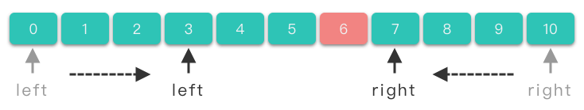
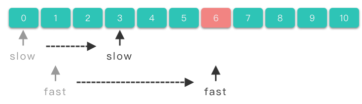
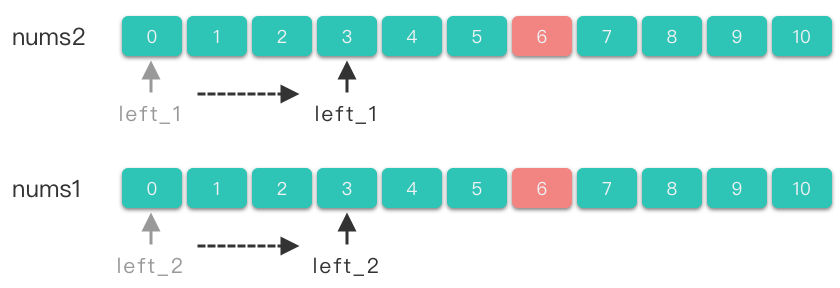
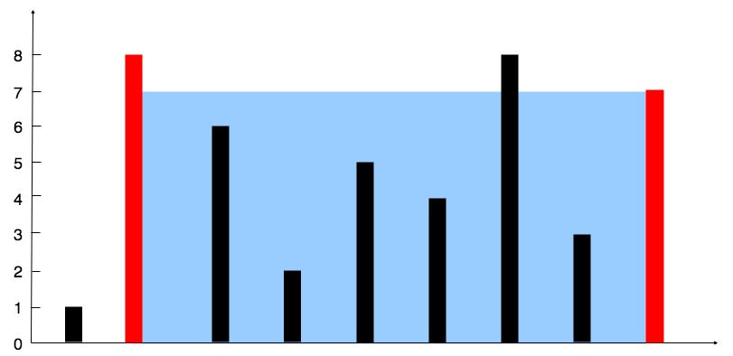

# 5.数组双指针

## 1.双指针简介

> **双指针（Two Pointers）**：指的是在遍历元素的过程中，不是使用单个指针进行访问，而是使用两个指针进行访问，从而达到相应的目的。如果两个指针方向相反，则称为「**对撞指针**」。如果两个指针方向相同，则称为「**快慢指针**」。如果两个指针分别属于不同的数组 / 链表，则称为「**分离双指针**」。

在数组的区间问题上，暴力算法的时间复杂度往往是 $O(n^2)$。而双指针利用了区间「单调性」的性质，可以将时间复杂度降到 $O(n)$。

## 2.对撞指针

> **对撞指针**：指的是两个指针 $left$、$right$ 分别指向序列第一个元素和最后一个元素，然后 $left$ 指针不断递增，$right$ 不断递减，直到两个指针的值相撞（即 $left == right$），或者满足其他要求的特殊条件为止。



### 2.1 对撞指针求解步骤

1.  使用两个指针 $left$，$right$。$left$ 指向序列第一个元素，即：$left = 0$，$right$ 指向序列最后一个元素，即：$right = len(nums) - 1$。
2.  在循环体中将左右指针相向移动，当满足一定条件时，将左指针右移，$left += 1$。当满足另外一定条件时，将右指针左移，$right -= 1$。
3.  直到两指针相撞（即 $left == right$），或者满足其他要求的特殊条件时，跳出循环体。

伪代码模板：

```python
left, right = 0, len(nums) - 1

while left < right:
    if 满足要求的特殊条件:
        return 符合条件的值 
    elif 一定条件 1:
        left += 1
    elif 一定条件 2:
        right -= 1

return 没找到 或 找到对应值

```

### 2.2 对撞指针适用范围

对撞指针一般用来解决有序数组或者字符串问题：

-   查找有序数组中满足某些约束条件的一组元素问题：比如**二分查找、数字之和**等问题。
-   **字符串反转问题**：反转字符串、回文数、颠倒二进制等问题。

## 3.快慢指针

> **快慢指针**：指的是两个指针从同一侧开始遍历序列，且移动的步长一个快一个慢。移动快的指针被称为 「快指针（fast）」，移动慢的指针被称为「慢指针（slow）」。**两个指针以不同速度、不同策略移动**，直到快指针移动到数组尾端，或者两指针相交，或者满足其他特殊条件时为止。



### 3.1 快慢指针求解步骤

1.  使用两个指针 $slow$、$fast$。$slow$ 一般指向序列第一个元素，即：$slow = 0$，$fast$ 一般指向序列第二个元素，即：$fast = 1$。
2.  在循环体中将左右指针向右移动。当满足一定条件时，将慢指针右移，即 $slow += 1$。当满足另外一定条件时（也可能不需要满足条件），将快指针右移，即 $fast += 1$。
3.  到快指针移动到数组尾端（即 $fast == len(nums) - 1$），或者两指针相交，或者满足其他特殊条件时跳出循环体。

伪代码

```python
slow = 0
fast = 1
while 没有遍历完：
    if 满足要求的特殊条件:
        slow += 1
    fast += 1
return 合适的值
```

### 3.2 快慢指针使用范围

快慢指针一般用于处理**数组中的移动、删除元素问题**，或者链表中的**判断是否有环、长度问题**。关于链表相关的双指针做法我们到链表章节再详细讲解。

## 4.分离双指针

> **分离双指针**：两个指针分别属于不同的数组，两个指针分别在两个数组中移动。



### 4.1 分离双指针求解步骤

1.  使用两个指针 $left\underline{}1$、$left\underline{}2$。$left\underline{}1$ 指向第一个数组的第一个元素，即：$left\underline{}1 = 0$，$left\underline{}2$ 指向第二个数组的第一个元素，即：$left\underline{}2 = 0$。
2.  当满足一定条件时，两个指针同时右移，即 $left\underline{}1 += 1$、$left\underline{}2 += 1$。
3.  当满足另外一定条件时，将 $left\underline{}1$ 指针右移，即 $left\underline{}1 += 1$。
4.  当满足其他一定条件时，将 $left\underline{}2$ 指针右移，即 $left\underline{}2 += 1$。
5.  当其中一个数组遍历完时或者满足其他特殊条件时跳出循环体。

伪代码模板：

```python
left_1 = 0
left_2 = 0

while left_1 < len(nums1) and left_2 < len(nums2):
    if 一定条件 1:
        left_1 += 1
        left_2 += 1
    elif 一定条件 2:
        left_1 += 1
    elif 一定条件 3:
        left_2 += 1
```

### 4.2 分离双指针使用范围

分离双指针一般用于处理**有序数组合并，求交集、并集**问题。

## 5.实战题目

### 5.1 两数之和Ⅱ-输入有序数组

[167. 两数之和 II - 输入有序数组 - 力扣（LeetCode）](https://leetcode.cn/problems/two-sum-ii-input-array-is-sorted/description/ "167. 两数之和 II - 输入有序数组 - 力扣（LeetCode）")

```c++
给你一个下标从 1 开始的整数数组 numbers ，该数组已按 非递减顺序排列  ，请你从数组中找出满足相加之和等于目标数 target 的两个数。如果设这两个数分别是 numbers[index1] 和 numbers[index2] ，则 1 <= index1 < index2 <= numbers.length 。

以长度为 2 的整数数组 [index1, index2] 的形式返回这两个整数的下标 index1 和 index2。

你可以假设每个输入 只对应唯一的答案 ，而且你 不可以 重复使用相同的元素。

你所设计的解决方案必须只使用常量级的额外空间。

 
示例 1：

输入：numbers = [2,7,11,15], target = 9
输出：[1,2]
解释：2 与 7 之和等于目标数 9 。因此 index1 = 1, index2 = 2 。返回 [1, 2] 。
```

双指针 - 对撞指针

```c++
class Solution {
public:
    vector<int> twoSum(vector<int>& numbers, int target) {
        int left = 0;
        int right = numbers.size() - 1;
        while (left < right) {
            int sum = numbers[left] + numbers[right];
            if (sum == target) {
                return {left + 1, right + 1};
            } else if (sum > target) {
                right--;
            } else {
                left++;
            }
        }

        return {-1, -1};
    }
};
```

### 5.2 验证回文串

[125. 验证回文串 - 力扣（LeetCode）](https://leetcode.cn/problems/valid-palindrome/ "125. 验证回文串 - 力扣（LeetCode）")

```c++
如果在将所有大写字符转换为小写字符、并移除所有非字母数字字符之后，短语正着读和反着读都一样。则可以认为该短语是一个 回文串 。

字母和数字都属于字母数字字符。

给你一个字符串 s，如果它是 回文串 ，返回 true ；否则，返回 false 。

 

示例 1：

输入: s = "A man, a plan, a canal: Panama"
输出：true
解释："amanaplanacanalpanama" 是回文串。
```

双指针 - 对撞指针

```c++
class Solution {
public:
    bool isPalindrome(string s) {
        if (s.empty()) {
            return true;
        }
        int left = 0;
        int right = s.size() - 1;

        while (left < right) {
            while (left < right && !(isdigit(s[left]) || isalpha(s[left]))) {
                left++;
            }
            while (left < right && !(isdigit(s[right]) || isalpha(s[right]))) {
                right--;
            }

            if (tolower(s[left]) == tolower(s[right])) {
                left++;
                right--;
            } else {
                return false;
            }

        }

        return true;
    }
};
```

### 5.3 盛最多水的容器

[11. 盛最多水的容器 - 力扣（LeetCode）](https://leetcode.cn/problems/container-with-most-water/description/ "11. 盛最多水的容器 - 力扣（LeetCode）")

```c++
给定一个长度为 n 的整数数组 height 。有 n 条垂线，第 i 条线的两个端点是 (i, 0) 和 (i, height[i]) 。

找出其中的两条线，使得它们与 x 轴共同构成的容器可以容纳最多的水。

返回容器可以储存的最大水量。

输入：[1,8,6,2,5,4,8,3,7]
输出：49 
解释：图中垂直线代表输入数组 [1,8,6,2,5,4,8,3,7]。在此情况下，容器能够容纳水（表示为蓝色部分）的最大值为 49。

```



从示例中可以看出，如果确定好左右两端的直线，容纳的水量是由「左右两端直线中较低直线的高度 \* 两端直线之间的距离」所决定的。所以我们应该使得「」，这样才能使盛水面积尽可能的大。

可以使用对撞指针求解。移动较低直线所在的指针位置，从而得到不同的高度和面积，最终获取其中最大的面积。具体做法如下：

1.  使用两个指针 $left$，$right$。$left$ 指向数组开始位置，$right$ 指向数组结束位置。
2.  计算 $left$ 和 $right$ 所构成的面积值，同时维护更新最大面积值。
3.  判断 $left$ 和 $right$ 的高度值大小。
    1.  如果 $left$ 指向的直线高度比较低，则将 $left$ 指针右移。
    2.  如果 $right$ 指向的直线高度比较低，则将 $right$ 指针左移。
4.  如果遇到 $left == right$，跳出循环，最后返回最大的面积。

```c++
class Solution {
public:
    // 1.枚举： left bar x, right bar y, (x-y)*height_diff
    // 超出时间限制
    // O(n^2)
    int maxArea1(vector<int>& height) {
        int max_water = 0;
        for (int i = 0; i < height.size(); i++) {
            for (int j = i + 1; j < height.size(); j++) {
                int tmp = std::min(height[i], height[j]) * (j - i);
                max_water = std::max(max_water, tmp);
            }
        }

        return max_water;
    }

    // 2.双指针
    // left和right两个指针，那么bar的高度小，那个往里面移动
    // O(n)
    int maxArea(vector<int>& height) {
        int left = 0;
        int right = height.size() - 1;
        int max_water = 0;

        while (left < right) {
            int tmp = std::min(height[left], height[right]) * (right - left);
            max_water = std::max(max_water, tmp);

            if (height[left] < height[right]) {
                left++;
            } else {
                right--;
            }
        }

        return max_water;
    }
};
```

### 5.4 删除有序数组中的重复项

[26. 删除有序数组中的重复项 - 力扣（LeetCode）](https://leetcode.cn/problems/remove-duplicates-from-sorted-array/description/ "26. 删除有序数组中的重复项 - 力扣（LeetCode）")

```c++
给你一个 非严格递增排列 的数组 nums ，请你 原地 删除重复出现的元素，使每个元素 只出现一次 ，返回删除后数组的新长度。元素的 相对顺序 应该保持 一致 。然后返回 nums 中唯一元素的个数。

考虑 nums 的唯一元素的数量为 k ，你需要做以下事情确保你的题解可以被通过：

更改数组 nums ，使 nums 的前 k 个元素包含唯一元素，并按照它们最初在 nums 中出现的顺序排列。nums 的其余元素与 nums 的大小不重要。
返回 k 。
判题标准:

系统会用下面的代码来测试你的题解:

int[] nums = [...]; // 输入数组
int[] expectedNums = [...]; // 长度正确的期望答案

int k = removeDuplicates(nums); // 调用

assert k == expectedNums.length;
for (int i = 0; i < k; i++) {
    assert nums[i] == expectedNums[i];
}
如果所有断言都通过，那么您的题解将被 通过。

 

示例 1：

输入：nums = [1,1,2]
输出：2, nums = [1,2,_]
解释：函数应该返回新的长度 2 ，并且原数组 nums 的前两个元素被修改为 1, 2 。不需要考虑数组中超出新长度后面的元素。
```

快慢指针

因为数组是有序的，那么重复的元素一定会相邻。

删除重复元素，实际上就是将不重复的元素移到数组左侧。考虑使用双指针。具体算法如下：

1.  定义两个快慢指针 $slow$，$fast$。其中 $slow$ 指向去除重复元素后的数组的末尾位置。$fast$ 指向当前元素。
2.  令 $slow$ 在后， $fast$ 在前。令 $slow = 0$，$fast = 1$。
3.  比较 $slow$ 位置上元素值和 $fast$ 位置上元素值是否相等。
    -   如果不相等，则将 $slow$ 右移一位，将 $fast$ 指向位置的元素复制到 $slow$ 位置上。
4.  将 $fast$ 右移 $1$ 位。
5.  重复上述 $3 \sim 4$ 步，直到 $fast$ 等于数组长度。
6.  返回 $slow + 1$ 即为新数组长度。

```c++
class Solution {
public:
    int removeDuplicates(vector<int>& nums) {
        if (nums.size() <= 1) {
            return nums.size();
        }

        int slow = 0;
        int fast = 1;
        while (fast < nums.size()) {
            if (nums[slow] != nums[fast]) {
                slow++;
                nums[slow] = nums[fast];
            }
            fast++;
        }

        return slow + 1;
    }
};
```

### 5.5 两个数组的交集

[349. 两个数组的交集 - 力扣（LeetCode）](https://leetcode.cn/problems/intersection-of-two-arrays/description/ "349. 两个数组的交集 - 力扣（LeetCode）")

```c++
给定两个数组 nums1 和 nums2 ，返回 它们的交集 。输出结果中的每个元素一定是 唯一 的。我们可以 不考虑输出结果的顺序 。

示例 1：

输入：nums1 = [1,2,2,1], nums2 = [2,2]
输出：[2]
```

分离双指针

1.  对数组 $nums1$、$nums2$ 先排序。
2.  使用两个指针 $left\underline{}1$、$left\underline{}2$。$left\underline{}1$ 指向第一个数组的第一个元素，即：$left\underline{}1 = 0$，$left\underline{}2$ 指向第二个数组的第一个元素，即：$left\underline{}2 = 0$。
3.  如果 $nums1[left\underline{}1] == nums2[left\underline{}2]$，则将其加入答案数组（注意去重），并将 $left\underline{}1$ 和 $left\underline{}2$ 右移。
4.  如果 $nums1[left\underline{}1] < nums2[left\underline{}2]$，则将 $left\underline{}1$ 右移。
5.  如果 $nums1[left\underline{}1] > nums2[left\underline{}2]$，则将 $left\underline{}2$ 右移。
6.  最后返回答案数组。

```c++
class Solution {
public:
    vector<int> intersection(vector<int>& nums1, vector<int>& nums2) {
        // 排序
        std::sort(nums1.begin(), nums1.end());
        std::sort(nums2.begin(), nums2.end());

        std::vector<int> ans;

        int idx_1 = 0;
        int idx_2 = 0;
        while (idx_1 < nums1.size() && idx_2 < nums2.size()) {
            if (nums1[idx_1] == nums2[idx_2]) {
                // 保证加入元素的唯一性
                if (!ans.size() || nums1[idx_1] != ans.back()) {
                    ans.push_back(nums1[idx_1]);
                }
                idx_1++;
                idx_2++;
            } else if (nums1[idx_1] < nums2[idx_2]) {
                idx_1++;
            } else {
                idx_2++;
            }
        }

        return ans;
    }
};
```

### 5.6 反转字符串

[344. 反转字符串 - 力扣（LeetCode）](https://leetcode.cn/problems/reverse-string/ "344. 反转字符串 - 力扣（LeetCode）")

```c++
编写一个函数，其作用是将输入的字符串反转过来。输入字符串以字符数组 s 的形式给出。

不要给另外的数组分配额外的空间，你必须原地修改输入数组、使用 O(1) 的额外空间解决这一问题。


示例 1：

输入：s = ["h","e","l","l","o"]
输出：["o","l","l","e","h"]
```

对撞指针

```c++
class Solution {
public:
    void reverseString(vector<char>& s) {
        int left = 0;
        int right = s.size() - 1;
        while (left < right) {
            swap(s[left], s[right]);
            left++;
            right--;
        }
    }
};
```

### 5.7 反转字符串中的元音字母

[345. 反转字符串中的元音字母 - 力扣（LeetCode）](https://leetcode.cn/problems/reverse-vowels-of-a-string/description/ "345. 反转字符串中的元音字母 - 力扣（LeetCode）")

```c++
给你一个字符串 s ，仅反转字符串中的所有元音字母，并返回结果字符串。

元音字母包括 'a'、'e'、'i'、'o'、'u'，且可能以大小写两种形式出现不止一次。

示例 1：

输入：s = "hello"
输出："holle"
```

对撞指针

```c++
class Solution {
public:
    string reverseVowels(string s) {
        int left = 0;
        int right = s.size() - 1;
        while (left < right) {
            while (left < right &&!isVowel(s[left])) {
                left++;
            }
            while (left < right &&!isVowel(s[right])) {
                right--;
            }
            swap(s[left], s[right]);
            left++;
            right--;
        }

        return s;
    }

    bool isVowel(char ch) {
        bool lower = ch == 'a' || ch == 'e' || ch == 'i' || ch == 'o' || ch == 'u';
        bool upper = ch == 'A' || ch == 'E' || ch == 'I' || ch == 'O' || ch == 'U';
        return lower || upper;
    }
};
```

### 5.8 三数之和

[15. 三数之和 - 力扣（LeetCode）](https://leetcode.cn/problems/3sum/description/ "15. 三数之和 - 力扣（LeetCode）")

```c++
给你一个整数数组 nums ，判断是否存在三元组 [nums[i], nums[j], nums[k]] 满足 i != j、i != k 且 j != k ，同时还满足 nums[i] + nums[j] + nums[k] == 0 。请

你返回所有和为 0 且不重复的三元组。

注意：答案中不可以包含重复的三元组。

 

 

示例 1：

输入：nums = [-1,0,1,2,-1,-4]
输出：[[-1,-1,2],[-1,0,1]]
解释：
nums[0] + nums[1] + nums[2] = (-1) + 0 + 1 = 0 。
nums[1] + nums[2] + nums[4] = 0 + 1 + (-1) = 0 。
nums[0] + nums[3] + nums[4] = (-1) + 2 + (-1) = 0 。
不同的三元组是 [-1,0,1] 和 [-1,-1,2] 。
注意，输出的顺序和三元组的顺序并不重要。
```

对撞指针

```c++
class Solution {
public:
    vector<vector<int>> threeSum(vector<int>& nums) {
        int size = nums.size();
        if (size < 3)
            return {};
        std::vector<std::vector<int>> res;
        // 排序
        std::sort(nums.begin(), nums.end());
        // 固定第一个数，转化为求两数之和
        for(int i = 0; i < size; i++)
        {
            // 如果第一个数为正数，因为是递增的，后面你的数不可能为0了
            if (nums[i] > 0)
                return res;
            // 去重，如果被选过了，跳过
            if (i > 0 && nums[i] == nums[i-1])
                continue;
            // 双指针在nums[i]后面的区间中寻找和为0-nums[i]的另外两个数
            int left = i + 1;
            int right = size - 1;
            while(left < right)
            {
                // 两数之和太大，右指针左移
                if (nums[left] + nums[right] > -nums[i])
                    right--;
                // 两数之和太小，左指针右移
                else if(nums[left] + nums[right] < -nums[i])
                    left++;
                else
                {
                    // 找到一个和为零的三元组，添加到结果中，左右指针内缩，继续寻找
                    res.push_back(std::vector<int>{nums[i], nums[left], nums[right]});
                    left++;
                    right--;

                    // 去重：第二个数和第三个数也不重复选取
                    // 例如：[-4,1,1,1,2,3,3,3], i=0, left=1, right=5
                    while (left < right && nums[left] == nums[left-1])  left++;
                    while (left < right && nums[right] == nums[right+1])    right--;
                }
            }
        }

        return res;
    }
};
```

### 5.9 移除元素

[27. 移除元素 - 力扣（LeetCode）](https://leetcode.cn/problems/remove-element/ "27. 移除元素 - 力扣（LeetCode）")

```c++
给你一个数组 nums 和一个值 val，你需要 原地 移除所有数值等于 val 的元素，并返回移除后数组的新长度。

不要使用额外的数组空间，你必须仅使用 O(1) 额外空间并 原地 修改输入数组。

元素的顺序可以改变。你不需要考虑数组中超出新长度后面的元素。

 

说明:

为什么返回数值是整数，但输出的答案是数组呢?

请注意，输入数组是以「引用」方式传递的，这意味着在函数里修改输入数组对于调用者是可见的。

你可以想象内部操作如下:

// nums 是以“引用”方式传递的。也就是说，不对实参作任何拷贝
int len = removeElement(nums, val);

// 在函数里修改输入数组对于调用者是可见的。
// 根据你的函数返回的长度, 它会打印出数组中 该长度范围内 的所有元素。
for (int i = 0; i < len; i++) {
    print(nums[i]);
}
 

示例 1：

输入：nums = [3,2,2,3], val = 3
输出：2, nums = [2,2]
解释：函数应该返回新的长度 2, 并且 nums 中的前两个元素均为 2。你不需要考虑数组中超出新长度后面的元素。例如，函数返回的新长度为 2 ，而 nums = [2,2,3,3] 或 nums = [2,2,0,0]，也会被视作正确答案。
```

```c++
class Solution {
public:
    // 一次遍历
    int removeElement1(vector<int>& nums, int val) {
        int len = 0;
        for(int i = 0; i < nums.size(); i++) {
            if (nums[i] != val) {
                nums[len] = nums[i];
                len++;
            }
        }

        return len;
    }
    // 对撞指针
    int removeElement(vector<int>& nums, int val) {
        int start = 0;
        int end = nums.size();
        while(start < end) {
            if (nums[start] == val) {
                nums[start] = nums[end - 1];
                end--;
            } else {
                start++;
            }
        }

        return start;
    }
};
```

### 5.10 删除有序数组中的重复项Ⅱ

[80. 删除有序数组中的重复项 II - 力扣（LeetCode）](https://leetcode.cn/problems/remove-duplicates-from-sorted-array-ii/description/ "80. 删除有序数组中的重复项 II - 力扣（LeetCode）")

```c++
给你一个有序数组 nums ，请你 原地 删除重复出现的元素，使得出现次数超过两次的元素只出现两次 ，返回删除后数组的新长度。

不要使用额外的数组空间，你必须在 原地 修改输入数组 并在使用 O(1) 额外空间的条件下完成。

 

说明：

为什么返回数值是整数，但输出的答案是数组呢？

请注意，输入数组是以「引用」方式传递的，这意味着在函数里修改输入数组对于调用者是可见的。

你可以想象内部操作如下:

// nums 是以“引用”方式传递的。也就是说，不对实参做任何拷贝
int len = removeDuplicates(nums);

// 在函数里修改输入数组对于调用者是可见的。
// 根据你的函数返回的长度, 它会打印出数组中 该长度范围内 的所有元素。
for (int i = 0; i < len; i++) {
    print(nums[i]);
}
 

示例 1：

输入：nums = [1,1,1,2,2,3]
输出：5, nums = [1,1,2,2,3]
解释：函数应返回新长度 length = 5, 并且原数组的前五个元素被修改为 1, 1, 2, 2, 3。 不需要考虑数组中超出新长度后面的元素。
```

快慢指针

```c++
class Solution {
public:
    // 一次遍历
    int removeDuplicates1(vector<int>& nums) {
        if (nums.size() < 2) {
            return nums.size();
        }
        int idx = 2;
        for (int i = 2; i < nums.size(); i++) {
            if (nums[i]!= nums[idx - 2]) {
                nums[idx] = nums[i];
                idx++;
            }
        }

        return idx;
    }

    // 快慢指针
    int removeDuplicates(vector<int>& nums) {
        if (nums.size() <= 2) {
            return nums.size();
        }
        int slow = 2;
        int fast = 2;
        while (fast < nums.size()) {
            if (nums[slow - 2] != nums[fast]) {
                nums[slow] = nums[fast];
                slow++;
            }
            fast++;
        }

        return slow;
    }
};
```

### 5.11 长按键入

[925. 长按键入 - 力扣（LeetCode）](https://leetcode.cn/problems/long-pressed-name/description/ "925. 长按键入 - 力扣（LeetCode）")

```c++
你的朋友正在使用键盘输入他的名字 name。偶尔，在键入字符 c 时，按键可能会被长按，而字符可能被输入 1 次或多次。

你将会检查键盘输入的字符 typed。如果它对应的可能是你的朋友的名字（其中一些字符可能被长按），那么就返回 True。


示例 1：

输入：name = "alex", typed = "aaleex"
输出：true
解释：'alex' 中的 'a' 和 'e' 被长按。


```

分离双指针

在typed中匹配name，同时考虑字符重复问题，以及不匹配问题。

```c++
class Solution {
public:
    // 分离双指针
    bool isLongPressedName(string name, string typed) {
        int idx_name = 0;
        int idx_typed = 0;

        while (idx_name < name.length() && idx_typed < typed.length()) {
            if (name[idx_name] == typed[idx_typed]) {
                idx_name++;
                idx_typed++;
            } else if (typed[idx_typed] == typed[idx_typed - 1]) {
                // typed出现重复元素，后移
                idx_typed++;
            } else {
                // typed出现不匹配元素，多余的，直接返回false
                return false;
            }
        }

        // 过滤type末尾的元素
        while ((0 < idx_typed && idx_typed < typed.length())
              || (typed[idx_typed] == typed[idx_typed - 1])) {
            idx_typed++;
        }

        if (idx_name == name.length() && idx_typed == typed.length()) {
            return true;
        } else {
            return false;
        }
    }
};
```
