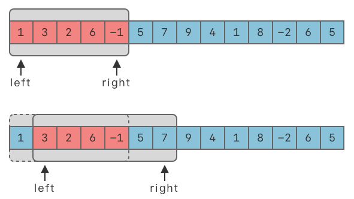
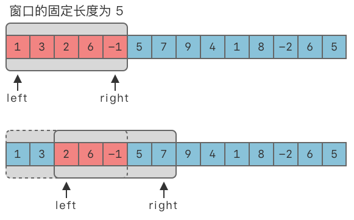
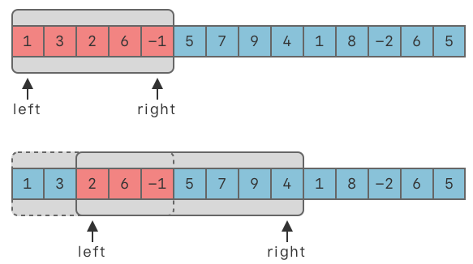

# 6.滑动窗口

## 1.滑动窗口算法

### 1.1 滑动窗口介绍

> **滑动窗口算法（Sliding Window）**：在给定数组 / 字符串上维护一个固定长度或不定长度的窗口。可以对窗口进行滑动操作、缩放操作，以及维护最优解操作。

-   **滑动操作**：窗口可按照一定方向进行移动。最常见的是向右侧移动。
-   **缩放操作**：对于不定长度的窗口，可以从左侧缩小窗口长度，也可以从右侧增大窗口长度。

滑动窗口**利用了双指针中的快慢指针技巧**，可以将滑动窗口看做是快慢指针两个指针中间的区间，也可以将滑动窗口看做是快慢指针的一种特殊形式。



### 1.2 适用范围

滑动窗口算法一般用来解决一些查找满足一定条件的连续区间的性质（长度等）的问题。该算法可以将一部分问题中的嵌套循环转变为一个单循环，因此它可以减少时间复杂度。

按照窗口长度的固定情况，可以将滑动窗口题目分为以下两种：

-   **固定长度窗口**：窗口大小是固定的。
-   **不定长度窗口**：窗口大小是不固定的。
    -   求解最大的满足条件的窗口。
    -   求解最小的满足条件的窗口。

## 2.固定长度的滑动窗口

> **固定长度滑动窗口算法（Fixed Length Sliding Window）**：在给定数组 / 字符串上维护一个固定长度的窗口。可以对窗口进行滑动操作、缩放操作，以及维护最优解操作。



### 2.1 算法步骤

假设窗口的固定大小为 $window\_size$。

1.  使用两个指针 $left$、$right$。初始时，$left$、$right$ 都指向序列的第一个元素，即：$left = 0$，$right = 0$，区间 $[left, right]$ 被称为一个「窗口」。
2.  当窗口未达到 $window\_{}size$ 大小时，不断移动 $right$，先将数组前 $window\_{}size$ 个元素填入窗口中，即 `window.append(nums[right])`。
3.  当窗口达到 $window\_{}size$ 大小时，即满足 `right - left + 1 >= window_size` 时，判断窗口内的连续元素是否满足题目限定的条件。
    1.  如果满足，再根据要求更新最优解。
    2.  然后向右移动 $left$，从而缩小窗口长度，即 `left += 1`，使得窗口大小始终保持为 $window\_{}size$。
4.  向右移动 $right$，将元素填入窗口中，即 `window.append(nums[right])`。
5.  重复 $2 \sim 4$ 步，直到 $right$ 到达数组末尾。

### 2.2 代码模板

```python
left = 0
right = 0

while right < len(nums):
    window.append(nums[right])
    
    # 超过窗口大小时，缩小窗口，维护窗口中始终为 window_size 的长度
    if right - left + 1 >= window_size:
        # ... 维护答案
        window.popleft()
        left += 1
    
    # 向右侧增大窗口
    right += 1

```

## 3.不定长度滑动窗口

> **不定长度滑动窗口算法（Sliding Window）**：在给定数组 / 字符串上维护一个不定长度的窗口。可以对窗口进行滑动操作、缩放操作，以及维护最优解操作。



### 3.1 算法步骤

1.  使用两个指针 $left$、$right$。初始时，$left$、$right$ 都指向序列的第一个元素。即：$left = 0$，$right = 0$，区间 $[left, right]$ 被称为一个「窗口」。
2.  将区间最右侧元素添加入窗口中，即 `window.add(s[right])`。
3.  然后向右移动 $right$，从而增大窗口长度，即 `right += 1`。直到窗口中的连续元素满足要求。
4.  此时，停止增加窗口大小。转向不断将左侧元素移出窗口，即 `window.popleft(s[left])`。
5.  然后向右移动 $left$，从而缩小窗口长度，即 `left += 1`。直到窗口中的连续元素不再满足要求。
6.  重复 2 \~ 5 步，直到 $right$ 到达序列末尾。

### 3.2 代码模板

```python
left = 0
right = 0

while right < len(nums):
    window.append(nums[right])
    
    while 窗口需要缩小:
        # ... 可维护答案
        window.popleft()
        left += 1
    
    # 向右侧增大窗口
    right += 1
```

## 4.实战题目

### 4.1 大小为k且平均值大于等于阈值的子数组数目

[1343. 大小为 K 且平均值大于等于阈值的子数组数目 - 力扣（LeetCode）](https://leetcode.cn/problems/number-of-sub-arrays-of-size-k-and-average-greater-than-or-equal-to-threshold/description/ "1343. 大小为 K 且平均值大于等于阈值的子数组数目 - 力扣（LeetCode）")

```c++
给你一个整数数组 arr 和两个整数 k 和 threshold 。

请你返回长度为 k 且平均值大于等于 threshold 的子数组数目。


示例 1：

输入：arr = [2,2,2,2,5,5,5,8], k = 3, threshold = 4
输出：3
解释：子数组 [2,5,5],[5,5,5] 和 [5,5,8] 的平均值分别为 4，5 和 6 。其他长度为 3 的子数组的平均值都小于 4 （threshold 的值)。
```

1.  $ans$ 用来维护答案数目。$window\underline{}sum$ 用来维护窗口中元素的和。
2.  $left$ 、$right$ 都指向序列的第一个元素，即：$left = 0$，$right = 0$。
3.  向右移动 $right$，先将 $k$ 个元素填入窗口中，即 `window_sum += arr[right]`。
4.  当窗口元素个数为 $k$ 时，即满足 `right - left + 1 >= k` 时，判断窗口内的元素和平均值是否大于等于阈值 $threshold$。
    1.  如果满足，则答案数目加 $1$。
    2.  然后向右移动 $left$，从而缩小窗口长度，即 `left += 1`，使得窗口大小始终保持为 $k$。
5.  重复 $3 \sim 4$ 步，直到 $right$ 到达数组末尾。
6.  最后输出答案数目。

```c++
class Solution {
public:
    int numOfSubarrays(vector<int>& arr, int k, int threshold) {
        // int slide_windows 
        int left = 0;
        int right = 0;
        int ans = 0;

        int window_sum = 0;

        while (right < arr.size()) {
            window_sum += arr[right];
            if (right - left + 1 >= k) {
                if (window_sum >= k * threshold) {
                    ans++;
                }
                window_sum -= arr[left];
                left++;
            }

            right++;
        }
        return ans;
    }
};
```

### 4.2 无重复字符的最长子串

[3. 无重复字符的最长子串 - 力扣（LeetCode）](https://leetcode.cn/problems/longest-substring-without-repeating-characters/description/ "3. 无重复字符的最长子串 - 力扣（LeetCode）")

```c++
给定一个字符串 s ，请你找出其中不含有重复字符的 最长子串 的长度。

示例 1:

输入: s = "abcabcbb"
输出: 3 
解释: 因为无重复字符的最长子串是 "abc"，所以其长度为 3。
```

1.  一开始，$left$、$right$ 都指向 $0$。
2.  向右移动 $right$，将最右侧元素加入当前窗口和 $window\underline{}sum$ 中。
3.  如果 $window\underline{}sum \ge target$，则不断右移 $left$，缩小滑动窗口长度，并更新窗口和的最小值，直到 $window\underline{}sum < target$。
4.  然后继续右移 $right$，直到 $right \ge len(nums)$ 结束。
5.  输出窗口和的最小值作为答案。

```c++
class Solution {
public:
    // 滑动窗口 + hash
    int lengthOfLongestSubstring(string s) {
        // 哈希集合，记录每个字符是否出现过
        std::unordered_set<char> occ;
        int n = s.size();
        // 初始化右指针，初始值为-1，还没开始移动
        int right = -1;
        // 最长子串的长度
        int max_len = 0;

        // 开始遍历左指针位置
        for (int left = 0; left < n; left++) {
            if (left != 0) {
                // 左指针向右移动一格，一处一个字符
                occ.erase(s[left - 1]);
            }

            // 不断移动右指针，直到出现重复的字符，或是到达最后一个字符
            while (right + 1 < n && !occ.count(s[right + 1])) {
                occ.insert(s[right + 1]);
                right++;
            }

            // 更新max_len
            max_len = std::max(max_len, right - left + 1);
        }

        return max_len;
    }
};
```

### 4.3 长度最小的子数组

[209. 长度最小的子数组 - 力扣（LeetCode）](https://leetcode.cn/problems/minimum-size-subarray-sum/description/ "209. 长度最小的子数组 - 力扣（LeetCode）")

```c++
给定一个含有 n 个正整数的数组和一个正整数 target 。

找出该数组中满足其总和大于等于 target 的长度最小的 连续子数组 [numsl, numsl+1, ..., numsr-1, numsr] ，并返回其长度。如果不存在符合条件的子数组，返回 0 。

示例 1：

输入：target = 7, nums = [2,3,1,2,4,3]
输出：2
解释：子数组 [4,3] 是该条件下的长度最小的子数组。

```

用滑动窗口来记录连续子数组的和，设定两个指针：$left$、$right$，分别指向滑动窗口的左右边界，保证窗口中的和刚好大于等于 $target$。

1.  一开始，$left$、$right$ 都指向 $0$。
2.  向右移动 $right$，将最右侧元素加入当前窗口和 $window\underline{}sum$ 中。
3.  如果 $window\underline{}sum \ge target$，则不断右移 $left$，缩小滑动窗口长度，并更新窗口和的最小值，直到 $window\underline{}sum < target$。
4.  然后继续右移 $right$，直到 $right \ge len(nums)$ 结束。
5.  输出窗口和的最小值作为答案。

```c++
class Solution {
public:
    // 滑动窗口
    int minSubArrayLen(int target, vector<int>& nums) {
        if (nums.size() == 0) {
            return 0;
        }
        int left = 0;
        int right = 0;
        int window_sum = 0;
        int ans = nums.size() + 1;

        while (right < nums.size()) {
            window_sum += nums[right];
            // 如果连续数组之和超过target
            // 更新ans为right - left + 1
            // 从sum中移除 nums[left]
            // left后移一位
            while (window_sum >= target) {
                ans = std::min(ans, right - left + 1);
                window_sum -= nums[left];
                left++;
            } 
            right++;
        }

        if (ans == nums.size() + 1) {
            ans = 0;
        }

        return ans == nums.size() + 1 ? 0 : ans;
    }

    // 暴力解法，两层循环, 超出时间限制
    int minSubArrayLen_nonono(int target, vector<int>& nums) {
        int n = nums.size();
        if (n == 0) {
            return 0;
        }

        int ans = INT_MAX;
        // 对于每个开始下标i，需要找到大于或等于i的最小下标j
        // 使得 nums[i]到nums[j]的元素之和大于或等于s
        // 最后更新数组的最小长度，j - i + 1
        for (int i = 0; i < n; i++) {
            int sum = 0;
            for (int j = i; j < n; j++) {
                sum += nums[j];
                if (sum >= target) {
                    ans = std::min(ans, j - i + 1);
                    break;
                }
            }
        }
        return ans == INT_MAX ? 0 : ans;
    }
};
```

### 4.4 乘积小于k的子数组

[713. 乘积小于 K 的子数组 - 力扣（LeetCode）](https://leetcode.cn/problems/subarray-product-less-than-k/ "713. 乘积小于 K 的子数组 - 力扣（LeetCode）")

```c++
给你一个整数数组 nums 和一个整数 k ，请你返回子数组内所有元素的乘积严格小于 k 的连续子数组的数目。

示例 1：

输入：nums = [10,5,2,6], k = 100
输出：8
解释：8 个乘积小于 100 的子数组分别为：[10]、[5]、[2],、[6]、[10,5]、[5,2]、[2,6]、[5,2,6]。
需要注意的是 [10,5,2] 并不是乘积小于 100 的子数组。
```

1.  设定两个指针：$left$、$right$，分别指向滑动窗口的左右边界，保证窗口内所有数的乘积 $window\_{}product$ 都小于 $k$。使用 $window\_product$ 记录窗口中的乘积值，使用 $count$ 记录符合要求的子数组个数。
2.  一开始，$left$、$right$ 都指向 $0$。
3.  向右移动 $right$，将最右侧元素加入当前子数组乘积 $window\_{}product$ 中。
4.  如果 $window\_{}product \ge k$，则不断右移 $left$，缩小滑动窗口长度，并更新当前乘积值 $window\_{}product$  直到 $window\_{}product < k$。
5.  记录累积答案个数加 $1$，继续右移 $right$，直到 $right \ge len(nums)$ 结束。
6.  输出累积答案个数。

```c++
class Solution {
public:
    int numSubarrayProductLessThanK(vector<int>& nums, int k) {
        if (k <= 1) {
            return 0;
        }
        
        int left = 0;
        int right = 0;
        int count = 0;
        int window_product = 1;
        while (right < nums.size()) {
            window_product = nums[right];

            while (window_product >= k) {
                window_product /= nums[left];
                left++;
            }
            count += (right - left + 1);
            right++;
        }
        
        return count;
    }
};
```

### 4.5 子数组最大平均数Ⅰ

[643. 子数组最大平均数 I - 力扣（LeetCode）](https://leetcode.cn/problems/maximum-average-subarray-i/ "643. 子数组最大平均数 I - 力扣（LeetCode）")

```c++
给你一个由 n 个元素组成的整数数组 nums 和一个整数 k 。

请你找出平均数最大且 长度为 k 的连续子数组，并输出该最大平均数。

任何误差小于 10-5 的答案都将被视为正确答案。

 

示例 1：

输入：nums = [1,12,-5,-6,50,3], k = 4
输出：12.75
解释：最大平均数 (12-5-6+50)/4 = 51/4 = 12.75
```

固定窗口大小，

1.  $max\_sum$ 用来维护子数组最大和，初始值为负无穷。$window\_sum$ 用来维护窗口中元素的和。
2.  $left$ 、$right$ 都指向序列的第一个元素，即：`left = 0`，`right = 0`。
3.  向右移动 $right$，先将 $k$ 个元素填入窗口中。
4.  当窗口元素个数为 $k$ 时，即：$right - left + 1 >= k$ 时，计算窗口内的和，并维护子数组最大和。
5.  然后向右移动 $left$，从而缩小窗口长度，即 `left += 1`，使得窗口大小始终保持为 $k$。
6.  重复 $4 \sim 5$ 步，直到 $right$ 到达数组末尾。
7.  最后输出答案 $ans$。

```c++
class Solution {
public:
    double findMaxAverage(vector<int>& nums, int k) {
        int left = 0;
        int right = 0;
        int windows_sum = 0;
        int max_sum = INT_MIN;
        while (right < nums.size()) {
            windows_sum += nums[right];
            if (right - left + 1 >= k) {
                max_sum = std::max(max_sum, windows_sum);
                windows_sum -= nums[left];
                left++;
            }
            
            right++;
        }

        return (double)max_sum/k;
    }
};
```

### 4.6 最长连续递序列

[674. 最长连续递增序列 - 力扣（LeetCode）](https://leetcode.cn/problems/longest-continuous-increasing-subsequence/ "674. 最长连续递增序列 - 力扣（LeetCode）")

```c++
给定一个未经排序的整数数组，找到最长且 连续递增的子序列，并返回该序列的长度。

连续递增的子序列 可以由两个下标 l 和 r（l < r）确定，如果对于每个 l <= i < r，都有 nums[i] < nums[i + 1] ，那么子序列 [nums[l], nums[l + 1], ..., nums[r - 1], nums[r]] 就是连续递增子序列。


示例 1：

输入：nums = [1,3,5,4,7]
输出：3
解释：最长连续递增序列是 [1,3,5], 长度为3。
尽管 [1,3,5,7] 也是升序的子序列, 但它不是连续的，因为 5 和 7 在原数组里被 4 隔开。 
```

1、动态规划

-   状态定义：`dp[i]` , 以`nums[i]`结尾的最长且连续递增子序列长度
-   状态转移方程：`dp[i] = dp[i - 1] + 1`， `nums[i - 1] < nums[i]`

2、滑动窗口，不定长度

```c++
class Solution {
public:
    // 1、动态规划
    int findLengthOfLCIS1(vector<int>& nums) {
        int size = nums.size();
        // 注意，初始化为1，而不是0
        std::vector<int> dp(size, 1);
        int max_len = 1;
        for (int i = 1; i < size; i++) {
            // 不连续递增子序列
            if (nums[i] > nums[i - 1]) {
                dp[i] = dp[i - 1] + 1;
                max_len = std::max(dp[i], max_len);
            }
        }
        return max_len;
    }

    // 2.滑动窗口
    int findLengthOfLCIS(vector<int>& nums) {
        int size = nums.size();
        int left = 0;
        int right = 0;
        int window_len = 0;
        int max_len = 0;

        while (right < size) {
            window_len++;

            // 如果不满足连续递增序列，将left移动到窗口最右侧，重置当前窗口长度
            if (right > 0 && nums[right - 1] >= nums[right]) {
                left = right;
                window_len = 1;
            }
            max_len = std::max(max_len, window_len);
            right++;
        }

        return max_len;
    }
};
```

### 4.7 最大连续1的个数Ⅲ

[1004. 最大连续1的个数 III - 力扣（LeetCode）](https://leetcode.cn/problems/max-consecutive-ones-iii/description/ "1004. 最大连续1的个数 III - 力扣（LeetCode）")

```c++
给定一个二进制数组 nums 和一个整数 k，如果可以翻转最多 k 个 0 ，则返回 数组中连续 1 的最大个数 。

示例 1：

输入：nums = [1,1,1,0,0,0,1,1,1,1,0], K = 2
输出：6
解释：[1,1,1,0,0, 1 ,1,1,1,1, 1 ]
粗体数字从 0 翻转到 1，最长的子数组长度为 6。
```

不定滑动窗口

```c++
class Solution {
public:
    int longestOnes(vector<int>& nums, int k) {
        int max_count = 0;
        int zero_count = 0;
        int left = 0;
        int right = 0;

        while (right < nums.size()) {
            // 统计0的个数
            if (nums[right] == 0) {
                zero_count++;
            } 
            right++;
            // 如果0的个数超过k时，将left开始右移，缩小滑动窗口范围，并减小0元素个数
            // 同时维护 max_count
            if (zero_count > k) {
               if (nums[left] == 0) {
                    zero_count--;
               }
               left++;
            }
            max_count = std::max(max_count, right - left);
        }

        return max_count;
    }
};
```
