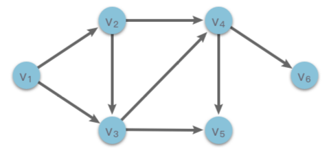

# 10.拓扑排序

## 1.拓扑排序简介

> **拓扑排序（Topological Sorting）**：一种对有向无环图（DAG）的所有顶点进行线性排序的方法，使得图中任意一点$u$和$v$，如果存在有向边$<u,v>$，则 $u$ 必须在 $v$ 之前出现。对有向图进行拓扑排序产生的线性序列称为满足拓扑次序的序列，简称拓扑排序。

图的拓扑排序是针对有向无环图（DAG）来说的，无向图和有向有环图没有拓扑排序，或者说不存在拓扑排序。



如上图中的有向无环图（DAG）所示，$v_1 \rightarrow v_2 \rightarrow v_3 \rightarrow v_4 \rightarrow v_5 \rightarrow v_6$ 是该图的一个拓扑序列。与此同时，$v_1 \rightarrow v_2 \rightarrow v_3 \rightarrow v_4 \rightarrow v_6 \rightarrow v_5$ 也是该图的一个拓扑序列。也就是说，对于一个有向无环图来说，拓扑序列可能不止一个。

## 2.拓扑排序实现方法

拓扑排序有两种实现方法，分别是「Kahn 算法」和「DFS 深度优先搜索算法」。接下来我们依次来看下它们是如何实现的。

### 2.1 Kahn 算法

**Kahn 算法的基本思想**：

1.  不断找寻有向图中入度为 $0$ 的顶点，将其输出。
2.  然后删除入度为 $0$ 的顶点和从该顶点出发的有向边。
3.  重复上述操作直到图为空，或者找不到入度为 $0$ 的节点为止。

**Kahn 算法的实现步骤**

1.  使用数组 $indegrees$ 用于记录图中各个顶点的入度。
2.  维护一个入度为 $0$ 的顶点集合 $S$（可使用栈、队列、优先队列）。
3.  每次从集合中选择任何一个没有前驱（即入度为 $0$）的顶点 $u$，将其输出到拓扑序列 $order$ 中。
4.  从图中删除该顶点 $u$，并且删除从该顶点出发的有向边 $<u, v>$（也就是把该顶点可达的顶点入度都减 $1$）。如果删除该边后顶点 $v$ 的入度变为 $0$，则将顶点 $v$ 放入集合 $S$ 中。
5.  重复上述过程，直到集合 $S$ 为空，或者图中还有顶点未被访问（说明一定存在环路，无法形成拓扑序列）。
6.  如果不存在环路，则 $order$ 中顶点的顺序就是拓扑排序的结果。

```python
class TopologicalSort:
    """ 拓扑排序
    """
    def kahn(self, graph:dict):
        """ Kahn 算法实现拓扑排序，graph中包含所有顶点的有向边关系
            1. 不断找寻有向图中入度为 $0$ 的顶点，将其输出。
            2. 然后删除入度为 $0$ 的顶点和从该顶点出发的有向边。
            3. 重复上述操作直到图为空，或者找不到入度为 $0$ 的节点为止。
        """
        # indegrees用于记录所有顶点的入度
        indegrees = {u : 0 for u in graph}
        for u in graph:
            for v in graph[u]:
                indegrees[v] += 1

        # 将入度为0的顶点存入集合S中
        S = collections.deque([u for u in indegrees if indegrees[u] == 0])
        # order用于存储拓扑排序序列
        order = []

        while S:
            u = S.pop()                     # 从集合中选择一个没有前驱的顶点 0
            order.append(u)                 # 将其输出到拓扑序列 order 中
            for v in graph[u]:              # 遍历顶点 u 的邻接顶点 v
                indegrees[v] -= 1           # 删除从顶点 u 出发的有向边
                if indegrees[v] == 0:       # 如果删除该边后顶点 v 的入度变为 0
                    S.append(v)             # 将其放入集合 S 中
        
        if len(indegrees) != len(order):    # 还有顶点未遍历（存在环），无法构成拓扑序列
            return []
        return order                        # 返回拓扑序列


    def find_order(self, n:int, edges):
        """ 构建图
        """
        graph = dict()
        for i in range(n):
            graph[i] = []

        for u, v in edges:
            graph[u].append(v)

        return graph
```

### 2.2 DFS 实现

**基于 DFS 实现拓扑排序算法的基本思想**：

1.  对于一个顶点$u$，深度优先遍历从该顶点出发的有向边$<u,v>$。如果从该顶点 $u$ 出发的所有相邻顶点 $v$ 都已经搜索完毕，则回溯到顶点 $u$ 时，该顶点 $u$ 应该位于其所有相邻顶点 $v$ 的前面（拓扑序列中）。
2.  这样一来，当对每个顶点进行深度优先搜索，在回溯到该顶点时将其放入栈中，则最终从栈顶到栈底的序列就是一种拓扑排序。

基于 DFS 实现拓扑排序算法实现步骤

1.  使用集合 $visited$ 用于记录当前顶点是否被访问过，避免重复访问。
2.  使用集合 $onStack$ 用于记录同一次深度优先搜索时，当前顶点是否被访问过。如果当前顶点被访问过，则说明图中存在环路，无法构成拓扑序列。
3.  使用布尔变量 $hasCycle$ 用于判断图中是否存在环。
4.  从任意一个未被访问的顶点 $u$ 出发。
    1.  如果顶点 $u$ 在同一次深度优先搜索时被访问过，则说明存在环。
    2.  如果当前顶点被访问或者有环时，则无需再继续遍历，直接返回。
5.  将顶点 $u$ 标记为被访问过，并在本次深度优先搜索中标记为访问过。然后深度优先遍历从顶点 $u$ 出发的有向边 $<u, v>$。
6.  当顶点 $u$ 的所有相邻顶点 $v$ 都被访问后，回溯前记录当前节点 $u$（将当前节点 $u$ 输出到拓扑序列 $order$ 中）。
7.  取消本次深度优先搜索时，顶点 $u$ 的访问标记。
8.  对其他未被访问的顶点重复 $4 \sim 7$ 步过程，直到所有节点都遍历完，或者出现环。
9.  如果不存在环路，则将 $order$ 逆序排序后，顶点的顺序就是拓扑排序的结果。

```python
class TopologicalSort:
    """ 拓扑排序
    """    
    def topological_sort_dfs(self, graph:dict):
        """ DFS实现拓扑排序，graph中包含所有顶点的有向边关系
            1. 对于一个顶点$u$，深度优先遍历从该顶点出发的有向边$<u,v>$。
               如果从该顶点 $u$ 出发的所有相邻顶点 $v$ 都已经搜索完毕，则回溯到顶点 $u$ 时，
               该顶点 $u$ 应该位于其所有相邻顶点 $v$ 的前面（拓扑序列中）。
            2. 这样一来，当对每个顶点进行深度优先搜索，在回溯到该顶点时将其放入栈中，
               则最终从栈顶到栈底的序列就是一种拓扑排序。
        """
        visited = set()                     # 记录当前顶点是否被访问过
        on_stack = set()                    # 记录同一次深搜时，当前顶点是否被访问过
        order = []                          # 用于存储拓扑序列
        has_cycle = False                   # 用于判断是否存在环
        
        def dfs(u):
            nonlocal has_cycle
            if u in on_stack:               # 同一次深度优先搜索时，当前顶点被访问过，说明存在环
                has_cycle = True
            if u in visited or has_cycle:   # 当前节点被访问或者有环时直接返回
                return
            
            visited.add(u)                  # 标记节点被访问
            on_stack.add(u)                 # 标记本次深搜时，当前顶点被访问
    
            for v in graph[u]:              # 遍历顶点 u 的邻接顶点 v
                dfs(v)                      # 递归访问节点 v
                    
            order.append(u)                 # 后序遍历顺序访问节点 u
            on_stack.remove(u)              # 取消本次深搜时的 顶点访问标记
        
        for u in graph:
            if u not in visited:
                dfs(u)                      # 递归遍历未访问节点 u
        
        if has_cycle:                       # 判断是否存在环
            return []                       # 存在环，无法构成拓扑序列
        order.reverse()                     # 将后序遍历转为拓扑排序顺序
        return order                        # 返回拓扑序列


    def find_order(self, n:int, edges):
        """ 构建图
        """
        graph = dict()
        for i in range(n):
            graph[i] = []

        for u, v in edges:
            graph[u].append(v)

        return graph
```

## 3.实战题目

### 3.1 课程表

[207. 课程表 - 力扣（LeetCode）](https://leetcode.cn/problems/course-schedule/description/ "207. 课程表 - 力扣（LeetCode）")

```python
你这个学期必须选修 numCourses 门课程，记为 0 到 numCourses - 1 。

在选修某些课程之前需要一些先修课程。 先修课程按数组 prerequisites 给出，其中 prerequisites[i] = [ai, bi] ，表示如果要学习课程 ai 则 必须 先学习课程  bi 。

例如，先修课程对 [0, 1] 表示：想要学习课程 0 ，你需要先完成课程 1 。
请你判断是否可能完成所有课程的学习？如果可以，返回 true ；否则，返回 false 。

示例 1：

输入：numCourses = 2, prerequisites = [[1,0]]
输出：true
解释：总共有 2 门课程。学习课程 1 之前，你需要完成课程 0 。这是可能的。
```

1.  使用哈希表 graph 存放课程关系图，并统计每门课程节点的入度，存入入度列表 indegrees。
2.  借助队列 `S`，将所有入度为 0 的节点入队。
3.  从队列中选择一个节点 `u`，并令课程数减 1。
4.  从图中删除该顶点 `u`，并且删除从该顶点出发的有向边 `<u,v>`（也就是把该顶点可达的顶点入度都减 1）。如果删除该边后顶点 `u` 的入度变为 0，则将其加入队列 `v` 中。
5.  重复上述步骤 3∼4，直到队列中没有节点。
6.  最后判断剩余课程数是否为 0，如果为 0，则返回 `True`，否则，返回 `False`。

```c++
class Solution {
public:
    // 1.广度优先遍历，拓扑排序
    bool canFinish1(int numCourses, vector<vector<int>>& prerequisites) {
        // 入度表
        std::vector<int> indegrees(numCourses, 0);
        // 邻接矩阵
        std::vector<std::vector<int>> adjacency(numCourses);
        // 队列
        std::queue<int> que;
        
        // 构造邻接矩阵
        for (auto& vec : prerequisites) {
            // 入度++
            indegrees[vec[0]]++;
            adjacency[vec[1]].push_back(vec[0]);
        }

        // 将入度为0的结点加入队列，表示没有任何前置课程
        for (int i = 0; i < numCourses; i++) {
            if (indegrees[i] == 0) {
                que.push(i);
            }
        }

        // BFS遍历，
        while (!que.empty()) {
            int pre = que.front();
            que.pop();
            numCourses--;

            // 遍历邻接矩阵，将入度为0的结点加入队列
            for (auto curr : adjacency[pre]) {
                indegrees[curr]--;
                if (indegrees[curr] == 0) {
                    que.push(curr);
                }
            }
            
        }

        return numCourses == 0;
    }

    // 2.DPS判环
    bool canFinish(int numCourses, vector<vector<int>>& prerequisites) {
        // 邻接表
        std::vector<std::vector<int>> adjacency(numCourses);
        
        // 构造邻接表
        for (auto& vec : prerequisites) {
            adjacency[vec[1]].push_back(vec[0]);
        }

        // 访问状态表
        // 0 : 未被访问过
        // 1 : 正在被当前结点访问
        // 2 ：已经访问过
        std::vector<int> visited(numCourses, 0);

        // dfs遍历
        for (int i = 0; i < numCourses; i++) {
            if (!this->dfs(adjacency, visited, i)) {
                return false;
            }
        }

        return true;
    }
    
    bool dfs(std::vector<std::vector<int>>& adjacency, std::vector<int>& visited, int i) {
        if (visited[i] == 1) {
            return false;
        }

        if (visited[i] == 2) {
            return true;
        }

        visited[i] = 1;
        // 遍历邻接矩阵
        for (auto curr : adjacency[i]) {
            if (!this->dfs(adjacency, visited, curr)) {
                return false;
            }
        }
        visited[i] = 2;
        return true;
    }
};
```

### 3.2 课程表Ⅱ

[210. 课程表 II - 力扣（LeetCode）](https://leetcode.cn/problems/course-schedule-ii/ "210. 课程表 II - 力扣（LeetCode）")

```python
现在你总共有 numCourses 门课需要选，记为 0 到 numCourses - 1。给你一个数组 prerequisites ，其中 prerequisites[i] = [ai, bi] ，表示在选修课程 ai 前 必须 先选修 bi 。

例如，想要学习课程 0 ，你需要先完成课程 1 ，我们用一个匹配来表示：[0,1] 。
返回你为了学完所有课程所安排的学习顺序。可能会有多个正确的顺序，你只要返回 任意一种 就可以了。如果不可能完成所有课程，返回 一个空数组 。

示例 1：

输入：numCourses = 2, prerequisites = [[1,0]]
输出：[0,1]
解释：总共有 2 门课程。要学习课程 1，你需要先完成课程 0。因此，正确的课程顺序为 [0,1] 。
```

1.  使用哈希表 $graph$ 存放课程关系图，并统计每门课程节点的入度，存入入度列表 $indegrees$。
2.  借助队列 $S$，将所有入度为 $0$ 的节点入队。
3.  从队列中选择一个节点 $u$，并将其加入到答案数组 $order$ 中。
4.  从图中删除该顶点 $u$，并且删除从该顶点出发的有向边 $<u, v>$（也就是把该顶点可达的顶点入度都减 $1$）。如果删除该边后顶点 $v$ 的入度变为 $0$，则将其加入队列 $S$ 中。
5.  重复上述步骤 $3 \sim 4$，直到队列中没有节点。
6.  最后判断总的顶点数和拓扑序列中的顶点数是否相等，如果相等，则返回答案数组 $order$，否则，返回空数组。

```c++
class Solution {
public:
    // 1.广度优先遍历，拓扑排序
    vector<int> findOrder(int numCourses, vector<vector<int>>& prerequisites) {
        // 入度表
        std::vector<int> indegrees(numCourses, 0);
        // 邻接矩阵
        std::vector<std::vector<int>> adjacency(numCourses);
        // 队列
        std::queue<int> que;

        std::vector<int> ans;
        
        // 构造邻接矩阵
        for (auto& vec : prerequisites) {
            // 入度++
            indegrees[vec[0]]++;
            adjacency[vec[1]].push_back(vec[0]);
        }

        // 将入度为0的结点加入队列，表示没有任何前置课程
        for (int i = 0; i < numCourses; i++) {
            if (indegrees[i] == 0) {
                que.push(i);
            }
        }

        // BFS遍历，
        while (!que.empty()) {
            int pre = que.front();
            que.pop();
            ans.push_back(pre);

            // 遍历邻接矩阵，将入度为0的结点加入队列
            for (auto curr : adjacency[pre]) {
                indegrees[curr]--;
                if (indegrees[curr] == 0) {
                    que.push(curr);
                }
            }
            
        }

        // 还有顶点未遍历（存在环），无法构成拓扑序列
        if (indegrees.size() != ans.size()) {
            return {};
        } 

        return ans;
    }
};
```

### 3.3 找到最终的安全状态

[802. 找到最终的安全状态 - 力扣（LeetCode）](https://leetcode.cn/problems/find-eventual-safe-states/description/ "802. 找到最终的安全状态 - 力扣（LeetCode）")

```python
有一个有 n 个节点的有向图，节点按 0 到 n - 1 编号。图由一个 索引从 0 开始 的 2D 整数数组 graph表示， graph[i]是与节点 i 相邻的节点的整数数组，这意味着从节点 i 到 graph[i]中的每个节点都有一条边。

如果一个节点没有连出的有向边，则该节点是 终端节点 。如果从该节点开始的所有可能路径都通向 终端节点 ，则该节点为 安全节点 。

返回一个由图中所有 安全节点 组成的数组作为答案。答案数组中的元素应当按 升序 排列。


输入：graph = [[1,2],[2,3],[5],[0],[5],[],[]]
输出：[2,4,5,6]
解释：示意图如上。
节点 5 和节点 6 是终端节点，因为它们都没有出边。
从节点 2、4、5 和 6 开始的所有路径都指向节点 5 或 6 。

```

拓扑排序

1.  根据题意可知，安全节点所对应的终点，一定是出度为 $0$ 的节点。而安全节点一定能在有限步内到达终点，则说明安全节点一定不在「环」内。
2.  可以利用拓扑排序来判断顶点是否在环中。
3.  为了找出安全节点，可以采取逆序建图的方式，将所有边进行反向。这样出度为 $0$ 的终点就变为了入度为 $0$ 的点。
4.  然后通过拓扑排序不断移除入度为 $0$ 的点之后，如果不在「环」中的点，最后入度一定为 $0$，这些点也就是安全节点。而在「环」中的点，最后入度一定不为 $0$。
5.  最后将所有安全的起始节点存入数组作为答案返回。

```c++
class Solution {
public:
    vector<int> eventualSafeNodes(vector<vector<int>>& graph) {
        // 入度表
        std::vector<int> indegrees(graph.size(), 0);
        // 邻接矩阵
        std::vector<std::vector<int>> adjacency(graph.size());
        // 队列
        std::queue<int> que;

        // 构造邻接矩阵
        for (int i = 0; i < graph.size(); i++) {
            for (auto& v : graph[i]) {
                adjacency[v].push_back(i);
            }
            indegrees[i] = graph[i].size();
        }

        // 将入度为0的结点加入队列
        for (int i = 0; i < graph.size(); i++) {
            if (indegrees[i] == 0) {
                que.push(i);
            }
        }

        // BFS遍历
        while (!que.empty()) {
            int pre = que.front();
            que.pop();
            
            // 遍历邻接矩阵，将入度为0的节点加入队列
            for (auto curr : adjacency[pre]) {
                indegrees[curr]--;
                if (indegrees[curr] == 0) {
                    que.push(curr);
                }
            }
        }

        std::vector<int> ans;
        for (int i = 0; i < graph.size(); i++) {
            if (indegrees[i] == 0) {
                ans.push_back(i);
            }
        }

        return ans;
    }
};
```
