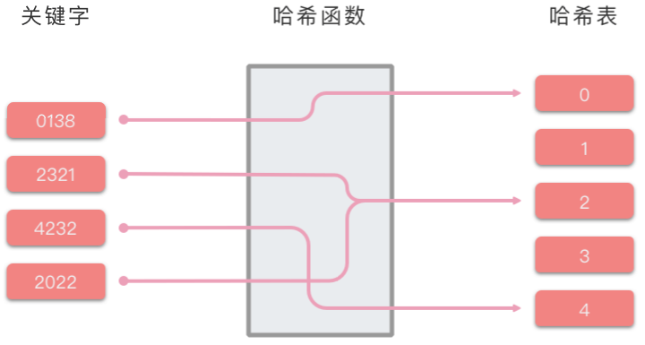
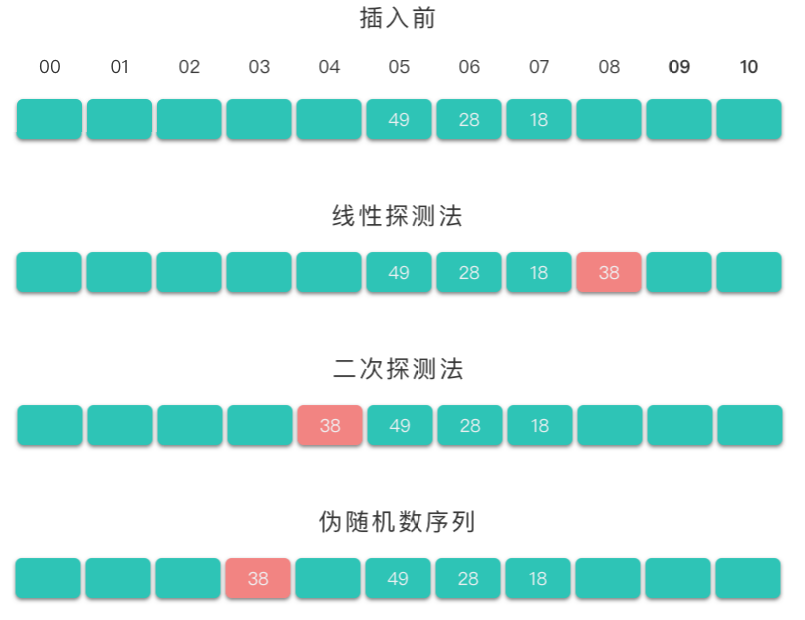
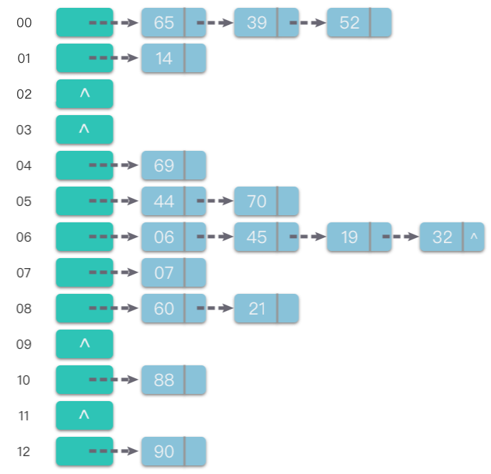

# 11.哈希表

## 1.哈希表

> **哈希表（Hash Table）**：也叫做散列表。是根据关键码值（Key Value）直接进行访问的数据结构。

哈希表通过「键 `key`」和「映射函数 `Hash(key)`」计算出对应的「值 `value`」，把关键码值映射到表中一个位置来访问记录，以加快查找的速度。这个映射函数叫做「哈希函数（散列函数）」，存放记录的数组叫做「哈希表（散列表）」。

哈希表的关键思想是使用哈希函数，将键 `key `映射到对应表的某个区块中。可以将算法思想分为两个部分：

-   **向哈希表中插入一个关键码值**：哈希函数决定该关键字的对应值应该存放到表中的哪个区块，并将对应值存放到该区块中。
-   **在哈希表中搜索一个关键码值**：使用相同的哈希函数从哈希表中查找对应的区块，并在特定的区块搜索该关键字对应的值。



## 2.哈希函数

> **哈希函数（Hash Function）**：将哈希表中元素的关键键值映射为元素存储位置的函数。

哈希函数是哈希表中最重要的部分。一般来说，哈希函数会满足以下几个条件：

-   哈希函数应该易于计算，并且尽量使计算出来的索引值均匀分布。
-   哈希函数计算得到的哈希值是一个固定长度的输出值。
-   如果 `Hash(key1)` 不等于 `Hash(key2)`，那么 `key1`、`key2` 一定不相等。
-   如果 `Hash(key1)` 等于 `Hash(key2)`，那么 `key1`、`key2` 可能相等，也可能不相等（会发生哈希碰撞）。

在哈希表的实际应用中，关键字的类型除了数字类，还有可能是字符串类型、浮点数类型、大整数类型，甚至还有可能是几种类型的组合。一般会将各种类型的关键字先转换为整数类型，再通过哈希函数，将其映射到哈希表中。

而关于整数类型的关键字，通常用到的哈希函数方法有：直接定址法、除留余数法、平方取中法、基数转换法、数字分析法、折叠法、随机数法、乘积法、点积法等。下面介绍几个常用的哈希函数方法。

### 2.1 直接定址法

> **直接定址法**：**取关键字本身 / 关键字的某个线性函数值作为哈希地址**。即：`Hash(key) = key` 或者 `Hash(key) = a * key + b`，其中 `a` 和 `b` 为常数。

这种方法计算最简单，且不会产生冲突。适合于关键字分布基本连续的情况，如果关键字分布不连续，空位较多，则会造成存储空间的浪费。

举一个例子，假设我们有一个记录了从 `1` 岁到 `100` 岁的人口数字统计表。其中年龄为关键字，哈希函数取关键字自身，如下表所示。

| 年龄 | 1    | 2    | 3    | ... | 25   | 26  | 27  | ... | 100 |
| -- | ---- | ---- | ---- | --- | ---- | --- | --- | --- | --- |
| 人数 | 3000 | 2000 | 5000 | ... | 1050 | ... | ... | ... | ... |

比如想要查询 `25` 岁的人有多少，则只要查询表中第 `25` 项即可。

### 2.2 除留余数法

> **除留余数法**：假设**哈希表的表长为 ****`m`****，取一个不大于 ****`m`**** 但接近或等于 ****`m`**** 的质数 ****`p`****，利用取模运算，将关键字转换为哈希地址**。即：`Hash(key) = key % p`，其中 `p` 为不大于 `m` 的质数。

这也是一种简单且常用的哈希函数方法。其关键点在于 `p` 的选择。根据经验而言，一般 `p` 取素数或者 `m`，这样可以尽可能的减少冲突。

比如需要将 `7` 个数 `[432, 5, 128, 193, 92, 111, 88]` 存储在 `11` 个区块中（长度为 `11` 的数组），通过除留余数法将这 `7` 个数应分别位于如下地址：

| 索引 | 00 | 01  | 02 | 03  | 04 | 05 | 06  | 07 | 08  | 09 | 10 |
| -- | -- | --- | -- | --- | -- | -- | --- | -- | --- | -- | -- |
| 数据 | 88 | 111 |    | 432 | 92 | 5  | 193 |    | 128 |    |    |

### 2.3 平方取中法

> **平方取中法**：先通过求关键字平方值的方式扩大相近数之间的差别，然后根据表长度取关键字平方值的中间几位数为哈希地址。

-   比如：`Hash(key) = (key * key) // 100 % 1000`，先计算平方，去除末尾的 2 位数，再取中间 3 位数作为哈希地址。

这种方法因为关键字平方值的中间几位数和原关键字的每一位数都相关，所以产生的哈希地址也比较均匀，有利于减少冲突的发生。

### 2.4 基数转换法

> **基数转换法**：将关键字看成另一种进制的数再转换成原来进制的数，然后选其中几位作为哈希地址。

-   比如，将关键字看做是 `13` 进制的数，再将其转变为 `10` 进制的数，将其作为哈希地址。

以 `343246` 为例，哈希地址计算方式如下：

$343246_{13} = 3 \times 13^5 + 4 \times 13^4 + 3 \times 13^3 + 2 \times 13^2 + 4 \times 13^1 + 6 \times 13^0 = 1235110_{10}$

## 3.哈希冲突

> **哈希冲突（Hash Collision）**：**不同的关键字通过同一个哈希函数可能得到同一哈希地址**，即 `key1 ≠ key2`，而 `Hash(key1) = Hash(key2)`，这种现象称为哈希冲突。

理想状态下，哈希函数是完美的一对一映射，即一个关键字（key）对应一个值（value），不需要处理冲突。但是一般情况下，不同的关键字 `key` 可能对应了同一个值 `value`，这就发生了哈希冲突。

设计再好的哈希函数也无法完全避免哈希冲突。所以就需要通过一定的方法来解决哈希冲突问题。常用的哈希冲突解决方法主要是两类：**「****开放地址法（Open Addressing）****」** 和 **「****链地址法（Chaining）****」**。

### 3.1 开放地址法

> **开放地址法（Open Addressing）**：指的是将哈希表中的「空地址」向处理冲突开放。当哈希表未满时，处理冲突时需要尝试另外的单元，直到找到空的单元为止。

当发生冲突时，开放地址法按照下面的方法求得后继哈希地址：`H(i) = (Hash(key) + F(i)) % m`，`i = 1, 2, 3, ..., n (n ≤ m - 1)`。

-   `H(i)` 是在处理冲突中得到的地址序列。即在第 1 次冲突（`i = 1`）时经过处理得到一个新地址 `H(1)`，如果在 `H(1)` 处仍然发生冲突（`i = 2`）时经过处理时得到另一个新地址 `H(2)` …… 如此下去，直到求得的 `H(n)` 不再发生冲突。
-   `Hash(key)` 是哈希函数，`m` 是哈希表表长，对哈希表长取余的目的是为了使得到的下一个地址一定落在哈希表中。
-   `F(i)` 是冲突解决方法，取法可以有以下几种：
    -   线性探测法：$F(i) = 1, 2, 3, ..., m - 1$。
    -   二次探测法：$F(i) = 1^2, -1^2, 2^2, -2^2, ..., \pm n^2(n \le m / 2)$。
    -   伪随机数序列：$F(i) = 伪随机数序列$。

举个例子说说明一下如何用以上三种冲突解决方法处理冲突，并得到新地址 `H(i)`。例如，在长度为 `11` 的哈希表中已经填有关键字分别为 `28`、`49`、`18` 的记录（哈希函数为 `Hash(key) = key % 11`）。现在将插入关键字为 `38` 的新纪录。根据哈希函数得到的哈希地址为 `5`，产生冲突。接下来分别使用这三种冲突解决方法处理冲突。

-   使用线性探测法：得到下一个地址 `H(1) = (5 + 1) % 11 = 6`，仍然冲突；继续求出 `H(2) = (5 + 2) % 11 = 7`，仍然冲突；继续求出 `H(3) = (5 + 3) % 11 = 8`，`8` 对应的地址为空，处理冲突过程结束，记录填入哈希表中序号为 `8` 的位置。
-   使用二次探测法：得到下一个地址 `H(1) = (5 + 1*1) % 11 = 6`，仍然冲突；继续求出 `H(2) = (5 - 1*1) % 11 = 4`，`4` 对应的地址为空，处理冲突过程结束，记录填入哈希表中序号为 `4` 的位置。
-   使用伪随机数序列：假设伪随机数为 `9`，则得到下一个地址 `H(1) = (9 + 5) % 11 = 3`，`3` 对应的地址为空，处理冲突过程结束，记录填入哈希表中序号为 `3` 的位置。

使用这三种方法处理冲突的结果如下图所示：



### 3.2 链地址法

> **链地址法（Chaining）**：将具有相同哈希地址的元素（或记录）存储在同一个线性链表中。

链地址法是一种更加常用的哈希冲突解决方法。相比于开放地址法，链地址法更加简单。

假设哈希函数产生的哈希地址区间为 `[0, m - 1]`，哈希表的表长为 `m`。则可以将哈希表定义为一个有 `m` 个头节点组成的链表指针数组 `T`。

-   这样在插入关键字的时候，只需要通过哈希函数 `Hash(key)` 计算出对应的哈希地址 `i`，然后将其以链表节点的形式插入到以 `T[i]` 为头节点的单链表中。在链表中插入位置可以在表头或表尾，也可以在中间。如果每次插入位置为表头，则插入操作的时间复杂度为 $O(1)$。
-   而在在查询关键字的时候，只需要通过哈希函数 `Hash(key)` 计算出对应的哈希地址 `i`，然后将对应位置上的链表整个扫描一遍，比较链表中每个链节点的键值与查询的键值是否一致。查询操作的时间复杂度跟链表的长度 `k` 成正比，也就是 $O(k)$。对于哈希地址比较均匀的哈希函数来说，理论上讲，`k = n // m`，其中 `n` 为关键字的个数，`m` 为哈希表的表长。

举个例子来说明如何使用链地址法处理冲突。假设现在要存入的关键字集合 `keys = [88, 60, 65, 69, 90, 39, 07, 06, 14, 44, 52, 70, 21, 45, 19, 32]`。再假定哈希函数为 `Hash(key) = key % 13`，哈希表的表长 `m = 13`，哈希地址范围为 `[0, m - 1]`。将这些关键字使用链地址法处理冲突，并按顺序加入哈希表中（图示为插入链表表尾位置），最终得到的哈希表如下图所示。



相对于开放地址法，采用链地址法处理冲突要多占用一些存储空间（主要是链节点占用空间）。但它可以减少在进行插入和查找具有相同哈希地址的关键字的操作过程中的平均查找长度。这是因为在链地址法中，待比较的关键字都是具有相同哈希地址的元素，而在开放地址法中，待比较的关键字不仅包含具有相同哈希地址的元素，而且还包含哈希地址不相同的元素。

## 4.实战题目

### 4.1 存在重复元素

[217. 存在重复元素 - 力扣（LeetCode）](https://leetcode.cn/problems/contains-duplicate/description/ "217. 存在重复元素 - 力扣（LeetCode）")

```python
给你一个整数数组 nums 。如果任一值在数组中出现 至少两次 ，返回 true ；如果数组中每个元素互不相同，返回 false 。
 

示例 1：

输入：nums = [1,2,3,1]
输出：true
示例 2：

输入：nums = [1,2,3,4]
输出：false
```

-   使用一个 `set` 集合存储数组中所有元素。
-   如果集合中元素个数与数组元素个数不同，则说明出现了重复元素，返回 `True`。
-   如果集合中元素个数与数组元素个数相同，则说明没有出现了重复元素，返回 `False`。

```c++
class Solution {
public:
    bool containsDuplicate(vector<int>& nums) {
        std::unordered_set<int> set;
        // 如果之前存在，直接返回true
        for (auto& n : nums) {
            if (set.count(n) > 0) {
                return true;
            } else {
                set.insert(n);
            }
        }
        return false;
    }
};
```

### 4.2 存在重复元素

[219. 存在重复元素 II - 力扣（LeetCode）](https://leetcode.cn/problems/contains-duplicate-ii/description/ "219. 存在重复元素 II - 力扣（LeetCode）")

```python
给你一个整数数组 nums 和一个整数 k ，判断数组中是否存在两个 不同的索引 i 和 j ，满足 nums[i] == nums[j] 且 abs(i - j) <= k 。如果存在，返回 true ；否则，返回 false 。

 

示例 1：

输入：nums = [1,2,3,1], k = 3
输出：true
```

1、暴力求解，超时

2、哈希表

维护一个最多有 `k` 个元素的哈希表。遍历 `nums`，对于数组中的每个整数 `nums[i]`，判断哈希表中是否存在这个整数。

-   如果存在，则说明出现了两次，且 长度不超过k，直接返回 `True`。
-   如果不存在，则将 `nums[i]` 加入哈希表。
-   如果遍历完仍旧找不到，则返回 `False`。

```c++
class Solution {
public:
    // 1.暴力求解，超时
    bool containsNearbyDuplicate1(vector<int>& nums, int k) {
        for (int i = 0; i < nums.size(); i++) {
            for (int j = i + 1; j < nums.size(); j++) {
                if (nums[i] == nums[j] && abs(i - j) <= k) {
                    return true;
                }
            }
        }
        return false;
    }

    // 2.哈希表
    bool containsNearbyDuplicate(vector<int>& nums, int k) {
        std::unordered_map<int, int> map;
        for (int i = 0; i < nums.size(); i++) {
            if (map.count(nums[i]) && (i - map[nums[i]]) <= k) {
                return true;
            }
            map[nums[i]] = i;
        } 
        return false;
    }
};
```

### 4.3 有效数独

[36. 有效的数独 - 力扣（LeetCode）](https://leetcode.cn/problems/valid-sudoku/description/ "36. 有效的数独 - 力扣（LeetCode）")

```python
请你判断一个 9 x 9 的数独是否有效。只需要 根据以下规则 ，验证已经填入的数字是否有效即可。

数字 1-9 在每一行只能出现一次。
数字 1-9 在每一列只能出现一次。
数字 1-9 在每一个以粗实线分隔的 3x3 宫内只能出现一次。（请参考示例图）
 

注意：

一个有效的数独（部分已被填充）不一定是可解的。
只需要根据以上规则，验证已经填入的数字是否有效即可。
空白格用 '.' 表示。


输入：board = 
[["5","3",".",".","7",".",".",".","."]
,["6",".",".","1","9","5",".",".","."]
,[".","9","8",".",".",".",".","6","."]
,["8",".",".",".","6",".",".",".","3"]
,["4",".",".","8",".","3",".",".","1"]
,["7",".",".",".","2",".",".",".","6"]
,[".","6",".",".",".",".","2","8","."]
,[".",".",".","4","1","9",".",".","5"]
,[".",".",".",".","8",".",".","7","9"]]
输出：true

```

判断数独有效，需要分别看每一行、每一列、每一个 `3 * 3` 的小方格是否出现了重复数字，如果都没有出现重复数字就是一个有效的数独，如果出现了重复数字则不是有效的数独。

-   用 `3` 个 `9 * 9` 的数组分别来表示该数字是否在所在的行，所在的列，所在的方格出现过。其中方格角标的计算用 `box[(i / 3) * 3 + (j / 3)][n]` 来表示。
-   双重循环遍历数独矩阵。如果对应位置上的数字如果已经在在所在的行 / 列 / 方格出现过，则返回 `False`。
-   遍历完没有重复出现，则返回 `Ture`。

```c++
class Solution {
public:
    bool isValidSudoku(vector<vector<char>>& board) {
        // 使用哈希表记录每一行、每一列和每一个小九宫格中，每个数字出现的次数
        // 只需要遍历数独一次，在遍历的过程中更新哈希表中的计数，并判断是否满足有效的数独条件即可

        // 每一行的hash表
        int rows[9][9];
        // 每一列的hash表
        int columns[9][9];
        // 每一个小方格的hash表
        int subboxes[3][3][9];

        memset(rows, 0, sizeof(rows));
        memset(columns, 0, sizeof(columns));
        memset(subboxes, 0, sizeof(subboxes));

        for (int i = 0; i < 9; i++) {
            for (int j = 0; j < 9; j++) {
                char c = board[i][j];
                if (c != '.') {
                    int idx = c - '0' - 1;
                    rows[i][idx]++;
                    columns[j][idx]++;
                    subboxes[i / 3][j / 3][idx]++;

                    if (rows[i][idx] > 1 || columns[j][idx] > 1 || subboxes[i / 3][j / 3][idx] > 1) {
                        return false;
                    }
                }
            }
        }

        return true;
    }
};
```

### 4.4 两个数组的交集

[349. 两个数组的交集 - 力扣（LeetCode）](https://leetcode.cn/problems/intersection-of-two-arrays/description/ "349. 两个数组的交集 - 力扣（LeetCode）")

```python
给定两个数组 nums1 和 nums2 ，返回 它们的交集 。输出结果中的每个元素一定是 唯一 的。我们可以 不考虑输出结果的顺序 。

示例 1：

输入：nums1 = [1,2,2,1], nums2 = [2,2]
输出：[2]
```

1、哈希表

1.  先遍历第一个数组，利用哈希表来存放第一个数组的元素，对应字典值设为 `1`。
2.  然后遍历第二个数组，如果哈希表中存在该元素，则将该元素加入到答案数组中，并且将该键值清空。

2、分离双指针

-   排序，再合并

```c++
class Solution {
public:
    // 1.哈希表
    // 
    vector<int> intersection(vector<int>& nums1, vector<int>& nums2) {
        std::unordered_map<int, int> map;
        std::vector<int> ans;
        for (auto& n : nums1) {
            if (!map.count(n)) {
                map[n] = 1;
            }
        }

        for (auto& n : nums2) {
            if (map.count(n) && map[n] != 0) {
                ans.push_back(n);
                map[n]--;
            }
        }

        return ans;
    }

    // 2.分离双指针
    vector<int> intersection2(vector<int>& nums1, vector<int>& nums2) {
        // 排序
        std::sort(nums1.begin(), nums1.end());
        std::sort(nums2.begin(), nums2.end());

        std::vector<int> ans;

        int idx_1 = 0;
        int idx_2 = 0;
        while (idx_1 < nums1.size() && idx_2 < nums2.size()) {
            if (nums1[idx_1] == nums2[idx_2]) {
                // 保证加入元素的唯一性
                if (!ans.size() || nums1[idx_1] != ans.back()) {
                    ans.push_back(nums1[idx_1]);
                }
                idx_1++;
                idx_2++;
            } else if (nums1[idx_1] < nums2[idx_2]) {
                idx_1++;
            } else {
                idx_2++;
            }
        }

        return ans;
    }
};
```

### 4.5 两个数组的交集

[350. 两个数组的交集 II - 力扣（LeetCode）](https://leetcode.cn/problems/intersection-of-two-arrays-ii/description/ "350. 两个数组的交集 II - 力扣（LeetCode）")

```python
给你两个整数数组 nums1 和 nums2 ，请你以数组形式返回两数组的交集。返回结果中每个元素出现的次数，应与元素在两个数组中都出现的次数一致（如果出现次数不一致，则考虑取较小值）。可以不考虑输出结果的顺序。

示例 1：

输入：nums1 = [1,2,2,1], nums2 = [2,2]
输出：[2,2]
示例 2:
```

哈希表：

1.  先遍历第一个数组，利用字典来存放第一个数组的元素出现次数。
2.  然后遍历第二个数组，如果字典中存在该元素，则将该元素加入到答案数组中，并减少字典中该元素出现的次数。
3.  遍历完之后，返回答案数组。

```c++
class Solution {
public:
    vector<int> intersect(vector<int>& nums1, vector<int>& nums2) {
        std::unordered_map<int, int> map;
        std::vector<int> ans;
        for (auto& n : nums1) {
            map[n]++;
        }

        for (auto& n : nums2) {
            if (map.count(n) && map[n] != 0) {
                ans.push_back(n);
                map[n]--;
            }
        }

        return ans;
    }
};
```

### 3.6 设计哈希集合

[705. 设计哈希集合 - 力扣（LeetCode）](https://leetcode.cn/problems/design-hashset/description/ "705. 设计哈希集合 - 力扣（LeetCode）")

```python
不使用任何内建的哈希表库设计一个哈希集合（HashSet）。

实现 MyHashSet 类：

- void add(key) 向哈希集合中插入值 key 。
- bool contains(key) 返回哈希集合中是否存在这个值 key 。
- void remove(key) 将给定值 key 从哈希集合中删除。如果哈希集合中没有这个值，什么也不做。
 
示例：

输入：
["MyHashSet", "add", "add", "contains", "contains", "add", "contains", "remove", "contains"]
[[], [1], [2], [1], [3], [2], [2], [2], [2]]
输出：
[null, null, null, true, false, null, true, null, false]

解释：
MyHashSet myHashSet = new MyHashSet();
myHashSet.add(1);      // set = [1]
myHashSet.add(2);      // set = [1, 2]
myHashSet.contains(1); // 返回 True
myHashSet.contains(3); // 返回 False ，（未找到）
myHashSet.add(2);      // set = [1, 2]
myHashSet.contains(2); // 返回 True
myHashSet.remove(2);   // set = [1]
myHashSet.contains(2); // 返回 False ，（已移除）
```

设哈希表的大小为 base，则可以设计一个简单的哈希函数：$\text{hash}(x) = x \bmod \textit{base}$。

开辟一个大小为 base 的数组，数组的每个位置是一个链表。当计算出哈希值之后，就插入到对应位置的链表当中。

由于使用整数除法作为哈希函数，为了尽可能避免冲突，应当将 base 取为一个质数。在这里，我们取 base=769。

```c++
class MyHashSet {
public:
    MyHashSet() {
        m_data.resize(m_base);
    }
    
    void add(int key) {
        int h = this->hash(key);
        for (auto it = m_data[h].begin(); it != m_data[h].end(); it++) {
            if ((*it) == key) {
                return;
            }
        }
        m_data[h].push_back(key);
    }
    
    void remove(int key) {
        int h = this->hash(key);
        for (auto it = m_data[h].begin(); it != m_data[h].end(); it++) {
            if ((*it) == key) {
                m_data[h].erase(it);
                return;
            }
        }
    }
    
    bool contains(int key) {
        int h = this->hash(key);
        for (auto it = m_data[h].begin(); it != m_data[h].end(); it++) {
            if ((*it) == key) {
                return true; 
            }
        }
        return false;
    }
private:
    std::vector<std::list<int>> m_data;
    static const int m_base = 769;
    static int hash(int key) {
        return key % m_base;
    }
};
```

### 3.7 设计哈希映射

[706. 设计哈希映射 - 力扣（LeetCode）](https://leetcode.cn/problems/design-hashmap/description/ "706. 设计哈希映射 - 力扣（LeetCode）")

```python
不使用任何内建的哈希表库设计一个哈希映射（HashMap）。

实现 MyHashMap 类：

MyHashMap() 用空映射初始化对象
- void put(int key, int value) 向 HashMap 插入一个键值对 (key, value) 。如果 key 已经存在于映射中，则更新其对应的值 value 。
- int get(int key) 返回特定的 key 所映射的 value ；如果映射中不包含 key 的映射，返回 -1 。
- void remove(key) 如果映射中存在 key 的映射，则移除 key 和它所对应的 value 。


输入：
["MyHashMap", "put", "put", "get", "get", "put", "get", "remove", "get"]
[[], [1, 1], [2, 2], [1], [3], [2, 1], [2], [2], [2]]
输出：
[null, null, null, 1, -1, null, 1, null, -1]

解释：
MyHashMap myHashMap = new MyHashMap();
myHashMap.put(1, 1); // myHashMap 现在为 [[1,1]]
myHashMap.put(2, 2); // myHashMap 现在为 [[1,1], [2,2]]
myHashMap.get(1);    // 返回 1 ，myHashMap 现在为 [[1,1], [2,2]]
myHashMap.get(3);    // 返回 -1（未找到），myHashMap 现在为 [[1,1], [2,2]]
myHashMap.put(2, 1); // myHashMap 现在为 [[1,1], [2,1]]（更新已有的值）
myHashMap.get(2);    // 返回 1 ，myHashMap 现在为 [[1,1], [2,1]]
myHashMap.remove(2); // 删除键为 2 的数据，myHashMap 现在为 [[1,1]]
myHashMap.get(2);    // 返回 -1（未找到），myHashMap 现在为 [[1,1]]

```

「设计哈希映射」与「设计哈希集合」解法接近，唯一的区别在于我们存储的不是 `key `本身，而是 `(key,value)`对。除此之外，代码基本是类似的。

```c++
class MyHashMap {
public:
    MyHashMap() {
        m_data.resize(m_base);
    }
    
    void put(int key, int value) {
        int h = this->hash(key);
        for (auto it = m_data[h].begin(); it != m_data[h].end(); it++) {
            if ((*it).first == key) {
                (*it).second = value;
                return;
            }
        }
        m_data[h].push_back({key, value});
    }
    
    int get(int key) {
        int h = this->hash(key);
        for (auto it = m_data[h].begin(); it != m_data[h].end(); it++) {
            if ((*it).first == key) {
                return (*it).second;
            }
        }
        return -1;
    }
    
    void remove(int key) {
        int h = this->hash(key);
        for (auto it = m_data[h].begin(); it != m_data[h].end(); it++) {
            if ((*it).first == key) {
                m_data[h].erase(it);
                return;
            }
        }
    }
private:
    std::vector<std::list<std::pair<int, int>>> m_data;
    static const int m_base = 769;
    static int hash(int key) {
        return key % m_base;
    }
};
```
