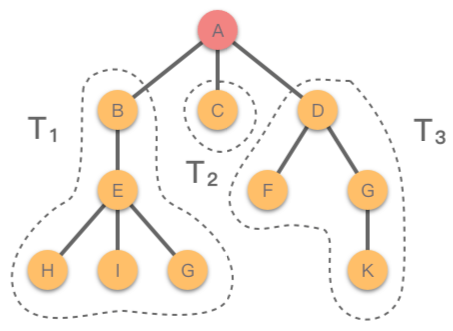
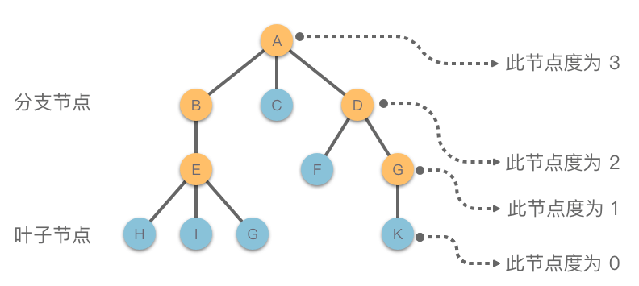
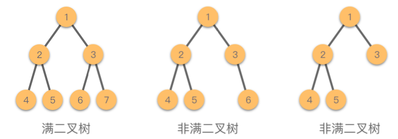
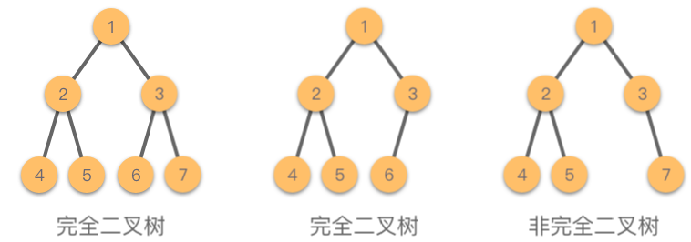
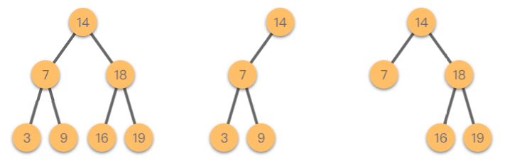
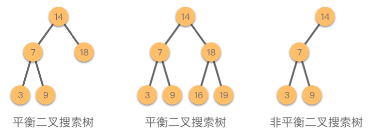
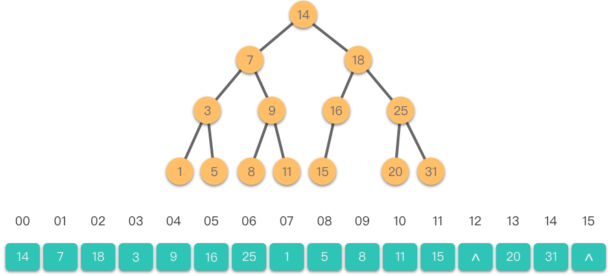
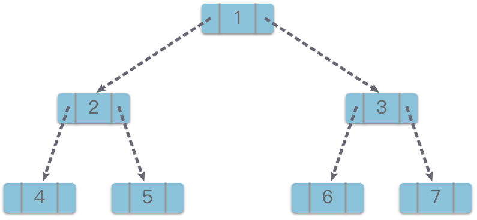

# 12.二叉树

## 1.树

### 1.1定义

**树（Tree）**：由 $n \ge 0$ 个节点与节点之间的关系组成的有限集合。当 $n = 0$ 时称为空树，当 $n > 0$ 时称为非空树。

「树」具有以下的特点：

-   有且仅有一个节点没有前驱节点，该节点被称为树的 **「根节点（Root）」** 。
-   除了根节点以之，每个节点有且仅有一个直接前驱节点。
-   包括根节点在内，每个节点可以有多个后继节点。
-   当 $n > 1$ 时，除了根节点之外的其他节点，可分为 $m(m > 0)$ 个互不相交的有限集合 $T_1, T_2, ..., T_m$，其中每一个集合本身又是一棵树，并且被称为根的 **「子树（SubTree）」**。

如下图所示，红色节点 $A$ 是根节点，除了根节点之外，还有 `3` 棵互不相交的子树 $T_1(B、E、H、I、G)$、$T_2(C)$、$T_3(D、F、G、K)$。



### 1.2 相关术语

#### （1）节点分类

**「树的节点」** 由一个数据元素和若干个指向其子树的树的分支组成。而节点所含有的子树个数称为 **「节点的度」**。度为 $0$ 的节点称为 **「叶子节点」** 或者 **「终端节点」**，度不为 $0$ 的节点称为 **「分支节点」** 或者 **「非终端节点」**。树中各节点的最大度数称为 **「树的度」**。

-   **树的节点**：由一个数据元素和若干个指向其子树的树的分支组成。
-   **节点的度**：一个节点所含有的子树个数。
-   **叶子节点（终端节点）**：度为 $0$ 的节点。例如图中叶子节点为 `C`、`H`、`I`、`G`、`F`、`K`。
-   **分支节点（非终端节点）**：度不为 $0$ 的节点。例如图中分支节点为 `A`、`B`、`D`、`E`、`G`。
-   **树的度**：树中节点的最大度数。例如图中树的度为 $3$。



#### （2）节点之间的关系

一个节点的子树的根节点称为该节点的 **「孩子节点」**，相应的，该节点称为孩子的 **「父亲节点」**。同一个父亲节点的孩子节点之间互称为 **「兄弟节点」**。

-   **孩子节点（子节点）**：一个节点含有的子树的根节点称为该节点的子节点。例如图中 `B` 是 `A` 的孩子节点。
-   **父亲节点（父节点）**：如果一个节点含有子节点，则这个节点称为其子节点的父节点。例如图中 `B` 是 `E` 的父亲节点。
-   **兄弟节点**：具有相同父节点的节点互称为兄弟节点。例如图中 `F`、`G` 互为兄弟节点。

#### （3）其他

**「节点的层次」** 是从根节点开始定义，将根节点作为第 1 层，根的孩子节点作为第 2 层，以此类推，如果某个节点在第 `i` 层，则其孩子节点在第 `i + 1` 层。而父亲节点在同一层的节点互为 **「堂兄弟节点」**。树中所有节点最大的层数称为 **「树的深度」** 或 **「树的高度」**。树中，两个节点之间所经过节点序列称为 **「路径」**，两个节点之间路径上经过的边数称为 **「路径长度」**。

-   **节点的层次**：从根节点开始定义，根为第 $1$ 层，根的子节点为第 $2$ 层，以此类推。
-   **树的深度（高度）**：所有节点中最大的层数。例如图中树的深度为 $4$。
-   **堂兄弟节点**：父节点在同一层的节点互为堂兄弟。例如图中 `G`、`K` 互为堂兄弟节点。
-   **路径**：树中两个节点之间所经过的节点序列。例如图中 `E` 到 `G` 的路径为 `E - B - A - D - G`。
-   **路径长度**：两个节点之间路径上经过的边数。例如图中 `E` 到 `G` 的路径长度为 $4$。
-   **节点的祖先**：从该节点到根节点所经过的所有节点，被称为该节点的祖先。例如图中 `H` 的祖先为 `E`、`B`、`A`。
-   **节点的子孙**：节点的子树中所有节点被称为该节点的子孙。例如图中 `D` 的子孙为 `F`、`G`、`K`。

### 1.3 树的分类

根据节点的子树是否可以互换位置，可以将树分为两种类型：**「有序树」** 和 **「无序树」**。

如果将树中节点的各个子树看做是从左到右是依次有序的（即不能互换），则称该树为 **「有序树」**。反之，如果节点的各个子树可以互换位置，则成该树为 **「无序树」**。

-   **有序树**：节点的各个⼦树从左⾄右有序， 不能互换位置。
-   **无序树**：节点的各个⼦树可互换位置。

## 2.二叉树

**二叉树（Binary Tree）**：树中各个节点的度不大于 `2` 个的有序树，称为二叉树。通常树中的分支节点被称为 **「左子树」** 或 **「右子树」**。二叉树的分支具有左右次序，不能随意互换位置。

二叉树也可以使用递归方式来定义，即二叉树满足以下两个要求之一：

-   **空树**：二叉树是一棵空树。
-   **非空树**：二叉树是由一个根节点和两棵互不相交的子树  $T_1$、$T_2$，分别称为根节点的左子树、右子树组成的非空树；并且 $T_1$、$T_2$ 本身都是二叉树。

⼆叉树是种特殊的树，它最多有两个⼦树，分别为左⼦树和右⼦树，并且两个子树是有序的，不可以互换。也就是说，在⼆叉树中不存在度⼤于 $2$ 的节点。

### 2.1 特殊的二叉树

#### （1）满二叉树

> **满二叉树（Full Binary Tree）**：如果所有分支节点都存在左子树和右子树，并且所有叶子节点都在同一层上，则称该二叉树为满二叉树。

满二叉树满足以下特点：

-   叶子节点只出现在最下面一层。
-   非叶子节点的度一定为 $2$。
-   在同等深度的二叉树中，满二叉树的节点个数最多，叶子节点个数最多。

如果我们对满二叉树的节点进行编号，根结点编号为 $1$，然后按照层次依次向下，每一层从左至右的顺序进行编号。则深度为 $k$ 的满二叉树最后一个节点的编号为 $2^k - 1$。



#### （2）完全二叉树

> **完全二叉树（Complete Binary Tree）**：如果叶子节点只能出现在最下面两层，并且最下层的叶子节点都依次排列在该层最左边的位置上，具有这种特点的二叉树称为完全二叉树。

完全二叉树满足以下特点：

-   叶子节点只能出现在最下面两层。
-   最下层的叶子节点一定集中在该层最左边的位置上。
-   倒数第二层如果有叶子节点，则该层的叶子节点一定集中在右边的位置上。
-   如果节点的度为 `1`，则该节点只偶遇左孩子节点，即不存在只有右子树的情况。
-   同等节点数的二叉树中，完全二叉树的深度最小。

完全二叉树也可以使用类似满二叉树的节点编号的方式来定义。即从根节点编号为 $1$ 开始，按照层次从上至下，每一层从左至右进行编号。对于深度为 $i$ 且有 $n$ 个节点的二叉树，当且仅当每一个节点都与深度为 $k$ 的满二叉树中编号从 $1$ 至 $n$ 的节点意义对应时，该二叉树为完全二叉树。



#### （3）二叉搜索树

> **二叉搜索树（Binary Search Tree）**：也叫做二叉查找树、有序二叉树或者排序二叉树。

二叉搜索树是指一棵空树或者具有下列性质的二叉树：

-   如果任意节点的左子树不为空，则左子树上所有节点的值均小于它的根节点的值。
-   如果任意节点的右子树不为空，则右子树上所有节点的值均大于它的根节点的值。
-   任意节点的左子树、右子树均为二叉搜索树。



#### （4）平衡二叉搜索树

> **平衡二叉搜索树（Balanced Binary Tree）**：一种结构平衡的二叉搜索树。即叶节点高度差的绝对值不超过 $1$，并且左右两个子树都是一棵平衡二叉搜索树。平衡二叉树可以在 $O(logn)$ 内完成插入、查找和删除操作。最早被发明的平衡二叉搜索树为 **「AVL 树（Adelson-Velsky and Landis Tree））」**。

AVL 树满足以下性质：

-   空二叉树是一棵 AVL 树。
-   如果 T 是一棵 AVL 树，那么其左右子树也是 AVL 树，并且 $|h(ls) - h(rs)| \le 1$，$h(ls)$ 是左子树的高度，$h(rs)$ 是右子树的高度。
-   AVL 树的高度为 $O(log n)$。

如图所示，前 $2$ 棵树是平衡二叉搜索树，最后一棵树不是平衡二叉搜索树，因为这棵树的左右子树的高度差的绝对值超过了 $1$。



### 2.2 二叉树存储结构

二叉树的存储结构分为两种：「**顺序存储结构**」和「**链式存储结构**」，下面进行一一讲解。

#### （1）二叉树的顺序存储结构

其实，堆排序、优先队列中的二叉堆结构，采用的就是二叉树的顺序存储结构。

二叉树的顺序存储结构使用一维数组来存储二叉树中的节点，节点存储位置则采用完全二叉树的节点层次编号，按照层次从上至下，每一层从左至右的顺序依次存放二叉树的数据元素。在进行顺序存储时，如果对应的二叉树节点不存在，则设置为「空节点」。

下图为二叉树的顺序存储结构。



从图中也可以看出节点之间的逻辑关系。

-   如果某二叉树节点（非叶子节点）的下标为 $i$，那么其左孩子节点下标为 $2 * i + 1$，右孩子节点下标为 $2 * i + 2$。
-   如果某二叉树节点（非根结点）的下标为 $i$，那么其根节点下标为 $(i - 1) // 2$。$//$ 表示整除。

对于完全二叉树（尤其是满二叉树）来说，采用顺序存储结构比较合适，它能充分利用存储空间；而对于一般二叉树，如果需要设置很多的「空节点」，则采用顺序存储结构就会浪费很多存储空间。并且，由于顺序存储结构固有的一些缺陷，会使得二叉树的插入、删除等操作不方便，效率也比较低。对于二叉树来说，当树的形态和大小经常发生动态变化时，更适合采用链式存储结构。

#### 2.3.2 二叉树的链式存储结构

二叉树采用链式存储结构时，每个链节点包含一个用于数据域 `val`，存储节点信息；还包含两个指针域 `left` 和 `right`，分别指向左右两个孩子节点，当左孩子或者右孩子不存在时，相应指针域值为空。

二叉链节点结构的对应代码为：

```python
class TreeNode:
    def __init__(self, val=0, left=None, right=None):
        self.val = val
        self.left = left
        self.right = right
```

下面我们将值为 `1、2、3、4、5、6、7` 的二叉树使用链式存储结构进行存储，即为下图所示。



二叉树的链表存储结构具有灵活、方便的特点。节点的最大数目只受系统最大可存储空间的限制。一般情况下，二叉树的链表存储结构比顺序存储结构更省空间（用于存储指针域的空间开销只是二叉树中节点数的线性函数），而且对于二叉树实施相关操作也很方便，因此，一般我们使用链式存储结构来存储二叉树。

## 3.二叉树遍历

> **二叉树的遍历**：指的是从根节点出发，按照某种次序依次访问二叉树中所有节点，使得每个节点被访问一次且仅被访问一次。

### 3.1 前序遍历

二叉树的前序遍历规则为：

-   如果二叉树为空，则返回。
-   如果二叉树不为空，则：
    1.  访问根节点。
    2.  以前序遍历的方式遍历根节点的左子树。
    3.  以前序遍历的方式遍历根节点的右子树。

#### （1）递归实现

1.  判断二叉树是否为空，为空则直接返回。
2.  先访问根节点。
3.  然后递归遍历左子树。
4.  最后递归遍历右子树。

```python
class Preorder:
    """ 二叉树前序遍历
    """
    def preorder_recu(self, root : TreeNode):
        ans = []

        def preorder(root):
            if not root:
                return
            ans.append(root.val)
            preorder(root.left)
            preorder(root.right)

        preorder(root)
        return ans
```

#### （2）显示栈实现

二叉树的前序遍历递归实现的过程，实际上就是调用系统栈的过程。也可以使用一个显式栈 `stack` 来模拟递归的过程。

1.  判断二叉树是否为空，为空则直接返回。
2.  初始化维护一个栈，将根节点入栈。
3.  当栈不为空时：
    1.  弹出栈顶元素 `node`，并访问该元素。
    2.  如果 `node` 的右子树不为空，则将 `node` 的右子树入栈。
    3.  如果 `node` 的左子树不为空，则将 `node` 的左子树入栈。

```python
class Preorder:
    """ 二叉树前序遍历
    """
    def preorder_stack(self, root : TreeNode):
        """ 使用显式栈实现
        """
        if not root:
            return []
        ans = []
        stack = [root]

        while stack:                        # 栈不为空
            node = stack.pop()              # 弹出根节点
            ans.append(node.val)            # 访问根节点
            if node.right:
                stack.append(node.right)    # 右子树入栈
            if node.left:
                stack.append(node.left)     # 左子树入栈

        return ans
```

### 3.2 中序遍历

二叉树的中序遍历规则为：

-   如果二叉树为空，则返回。
-   如果二叉树不为空，则：
    1.  以中序遍历的方式遍历根节点的左子树。
    2.  访问根节点。
    3.  以中序遍历的方式遍历根节点的右子树。

#### （1）递归实现

1.  判断二叉树是否为空，为空则直接返回。
2.  先递归遍历左子树。
3.  然后访问根节点。
4.  最后递归遍历右子树。

```python
class Inorder:
    """ 二叉树中序遍历
    """
    def inorder_recu(self, root : TreeNode):
        """ 使用递归实现
        """
        ans = []

        def inorder(root):
            if not root:
                return
            inorder(root.left)
            ans.append(root.val)
            inorder(root.right)

        inorder(root)
        return ans
```

#### （2）显式栈实现

可以使用一个显式栈 `stack` 来模拟二叉树的中序遍历递归的过程。

与前序遍历不同，访问根节点要放在左子树遍历完之后。因此需要保证：**在左子树访问之前，当前节点不能提前出栈**。

应该从根节点开始，循环遍历左子树，不断将当前子树的根节点放入栈中，直到当前节点无左子树时，从栈中弹出该节点并进行处理。

1.  判断二叉树是否为空，为空则直接返回。
2.  初始化维护一个空栈。
3.  当根节点或者栈不为空时：
    1.  如果当前节点不为空，则循环遍历左子树，并不断将当前子树的根节点入栈。
    2.  如果当前节点为空，说明当前节点无左子树，则弹出栈顶元素 `node`，并访问该元素，然后尝试访问该节点的右子树。

```python
class Inorder:
    """ 二叉树中序遍历
    """    
    def inorder_stack(self, root : TreeNode):
        """ 使用显式栈实现
        """
        if not root:                # 二叉树为空直接返回
            return []
        
        ans = []
        stack = []

        while root or stack:        # 根节点或栈不为空
            while root:             
                stack.append(root)  # 将当前树的根节点入栈
                root = root.left    # 找到最左侧节点
            
            node = stack.pop()      # 遍历到最左侧，当前节点无左子树时，将最左侧节点弹出
            ans.append(node.val)    # 访问该节点
            root = node.right       # 尝试访问该节点的右子树
        return ans
```

### 3.3 后序遍历

二叉树的后序遍历规则为：

-   如果二叉树为空，则返回。
-   如果二叉树不为空，则：
    1.  以后序遍历的方式遍历根节点的左子树。
    2.  以后序遍历的方式遍历根节点的右子树。
    3.  访问根节点。

#### （1）递归实现

1.  判断二叉树是否为空，为空则直接返回。
2.  先递归遍历左子树。
3.  然后递归遍历右子树。
4.  最后访问根节点。

```python
class Postorder:
    """ 二叉树中序遍历
    """
    def postorder_recu(self, root : TreeNode):
        """ 使用递归实现
        """
        ans = []

        def postorder(root):
            if not root:
                return
            postorder(root.left)
            postorder(root.right)
            ans.append(root.val)

        postorder(root)
        return ans
```

#### （2）显式栈实现

可以使用一个显式栈 `stack` 来模拟二叉树的后序遍历递归的过程。

与前序、中序遍历不同，在后序遍历中，根节点的访问要放在左右子树访问之后。因此，我们要保证：**在左右孩子节点访问结束之前，当前节点不能提前出栈**。

应该从根节点开始，先将根节点放入栈中，然后依次遍历左子树，不断将当前子树的根节点放入栈中，直到遍历到左子树最左侧的那个节点，从栈中弹出该元素，并判断该元素的右子树是否已经访问完毕，如果访问完毕，则访问该元素。如果未访问完毕，则访问该元素的右子树。

1.  判断二叉树是否为空，为空则直接返回。
2.  初始化维护一个空栈，使用 `prev` 保存前一个访问的节点，用于确定当前节点的右子树是否访问完毕。
3.  当根节点或者栈不为空时，从当前节点开始：
    1.  如果当前节点有左子树，则不断遍历左子树，并将当前根节点压入栈中。
    2.  如果当前节点无左子树，则弹出栈顶元素 `node`。
    3.  如果栈顶元素 `node` 无右子树（即 `not node.right`）或者右子树已经访问完毕（即 `node.right == prev`），则访问该元素，然后记录前一节点，并将当前节点标记为空节点。
    4.  如果栈顶元素有右子树，则将栈顶元素重新压入栈中，继续访问栈顶元素的右子树。

```python
class Postorder:
    """ 二叉树中序遍历
    """
    def postorder_stack(self, root : TreeNode):
        """ 使用显式栈实现
        """
        ans = []
        stack = []
        prev = None                 # 保存前一个访问的节点，用于确定当前节点的右子树是否访问完毕
        
        while root or stack:        # 根节点或栈不为空
            while root:
                stack.append(root)  # 将当前树的根节点入栈
                root = root.left    # 继续访问左子树，找到最左侧节点

            node = stack.pop()      # 遍历到最左侧，当前节点无左子树时，将最左侧节点弹出

            # 如果当前节点无右子树或者右子树访问完毕
            if not node.right or node.right == prev:
                ans.append(node.val)# 访问该节点
                prev = node         # 记录前一节点
                root = None         # 将当前根节点标记为空
            else:
                stack.append(node)  # 右子树尚未访问完毕，将当前节点重新压回栈中
                root = node.right   # 继续访问右子树
                
        return ans
```

### 3.4 层序遍历

叉树的层序遍历规则为：

-   如果二叉树为空，则返回。
-   如果二叉树不为空，则：
    1.  先依次访问二叉树第 1 层的节点。
    2.  然后依次访问二叉树第 2 层的节点。
    3.  ……
    4.  依次下去，最后依次访问二叉树最下面一层的节点。

二叉树的层序遍历是通过队列来实现的。具体步骤如下：

1.  判断二叉树是否为空，为空则直接返回。
2.  令根节点入队。
3.  当队列不为空时，求出当前队列长度 $s_i$。
4.  依次从队列中取出这 $s_i$ 个元素，并对这 $s_i$ 个元素依次进行访问。然后将其左右孩子节点入队，然后继续遍历下一层节点。
5.  当队列为空时，结束遍历。

```python
class LevelOrder:
    def levelorder(self, root: TreeNode):
        """ 队列实现层序遍历
        """
        if not root:
            return []
        queue = [root]
        order = []
        while queue:
            level = []
            size = len(queue)
            for _ in range(size):
                curr = queue.pop(0)
                level.append(curr.val)
                if curr.left:
                    queue.append(curr.left)
                if curr.right:
                    queue.append(curr.right)
            if level:
                order.append(level)
        return order
```

## 4.构造二叉树

-   **如果已知一棵二叉树的****前序****序列和****中序****序列，可以唯一地确定这棵二叉树。**
-   **如果已知一棵二叉树的****中序****序列和****后序****序列，也可以唯一地确定这棵二叉树。**
-   **已知二叉树的「****中序****遍历序列」和「****层序****遍历序列」，也可以唯一地确定一棵二叉树。**

**注意**：**如果已知二叉树的「前序遍历序列」和「后序遍历序列」，是不能****唯一****地确定一棵二叉树的。** 这是因为没有中序遍历序列无法确定左右部分，也就无法进行子序列的分割。

### 4.1 前序中序构造二叉树

根据前序遍历的顺序，可以找到根节点位置。然后在中序遍历的结果中可以找到对应的根节点位置，就可以从根节点位置将二叉树分割成左子树、右子树。同时能得到左右子树的节点个数。

此时构建当前节点，并递归建立左右子树，在左右子树对应位置继续递归遍历进行上述步骤，直到节点为空，具体操作步骤如下：

1.  从前序遍历顺序中得到当前根节点的位置在 `postorder[0]`。
2.  通过在中序遍历中查找上一步根节点对应的位置 `inorder[k]`，从而将二叉树的左右子树分隔开，并得到左右子树节点的个数。
3.  从上一步得到的左右子树个数将前序遍历结果中的左右子树分开。
4.  构建当前节点，并递归建立左右子树，在左右子树对应位置继续递归遍历并执行上述三步，直到节点为空。

```python
def prein_build_tree(self, preorder: List[int], inorder: List[int]) -> TreeNode:
    """ 前序中序构造二叉树
    """
    def create_tree(preorder, inorder, n):
        """
            - preorder
            - inorder
            - n : 中序的长度
        """
        if n == 0:
            return None
        
        # 拆分中序序列，以根节点为中心，拆分为左右节点
        k = 0
        while preorder[0] != inorder[k]:
            k += 1
        
        node = TreeNode(inorder[k])
        node.left = create_tree(preorder[1:k + 1], inorder[0, k], k)
        node.right = create_tree(preorder[k + 1:], inorder[k+1:], n-k-1)
        return node
    
    return create_tree(preorder, inorder, len(inorder))
```

### 4.2 中序后序构造二叉树

根据后序遍历的顺序，可以找到根节点位置。然后在中序遍历的结果中可以找到对应的根节点位置，就可以从根节点位置将二叉树分割成左子树、右子树。同时能得到左右子树的节点个数。

此时构建当前节点，并递归建立左右子树，在左右子树对应位置继续递归遍历进行上述步骤，直到节点为空，具体操作步骤如下：

1.  从后序遍历顺序中当前根节点的位置在 `postorder[n-1]`。
2.  通过在中序遍历中查找上一步根节点对应的位置 `inorder[k]`，从而将二叉树的左右子树分隔开，并得到左右子树节点的个数。
3.  从上一步得到的左右子树个数将后序遍历结果中的左右子树分开。
4.  构建当前节点，并递归建立左右子树，在左右子树对应位置继续递归遍历并执行上述三步，直到节点为空。

```python
def postin_build_tree(self, inorder: List[int], postorder: List[int]) -> TreeNode:
    """ 后序中序构建二叉树
    """
    def create_tree(inorder, postorder, n):
        """
            - preorder
            - inorder
            - n : 中序的长度
        """
        if n == 0:
            return None
        
        # 拆分中序序列，以根节点为中心，拆分为左右节点
        k = 0
        while postorder[n-1] != inorder[k]:
            k += 1
        
        node = TreeNode(inorder[k])
        node.left = create_tree(inorder[0, k], postorder[0:k], k)
        node.right = create_tree(inorder[k+1:n], postorder[k:n-1], n-k-1)
        return node
    
    return create_tree(inorder, postorder, len(postorder))
```

### 4.3 前序后序构造二叉树

前边说过：**已知二叉树的前序遍历序列和后序遍历序列，是****不能唯一地确定一棵二叉树的****。** 而如果不要求构造的二叉树是唯一的，只要求构造出一棵二叉树，还是可以进行构造的。

可以默认指定前序遍历序列的第 `2` 个值为左子树的根节点，由此递归划分左右子序列。具体操作步骤如下：

1.  从前序遍历序列中可知当前根节点的位置在 `preorder[0]`。
2.  前序遍历序列的第 `2` 个值为左子树的根节点，即 `preorder[1]`。通过在后序遍历中查找上一步根节点对应的位置 `postorder[k]`（该节点右侧为右子树序列），从而将二叉树的左右子树分隔开，并得到左右子树节点的个数。
3.  从上一步得到的左右子树个数将后序遍历结果中的左右子树分开。
4.  构建当前节点，并递归建立左右子树，在左右子树对应位置继续递归遍历并执行上述三步，直到节点为空。

```python
class Solution:
    def constructFromPrePost(self, preorder: List[int], postorder: List[int]) -> TreeNode:
        def createTree(preorder, postorder, n):
            if n == 0:
                return None
            node = TreeNode(preorder[0])
            if n == 1:
                return node
            k = 0
            while postorder[k] != preorder[1]:
                k += 1
            node.left = createTree(preorder[1: k + 2], postorder[: k + 1], k + 1)
            node.right = createTree(preorder[k + 2: ], postorder[k + 1: -1], n - k - 2)
            return node
        return createTree(preorder, postorder, len(preorder))
```

## 5.实战题目

### 5.1 二叉树最大深度

[104. 二叉树的最大深度 - 力扣（LeetCode）](https://leetcode.cn/problems/maximum-depth-of-binary-tree/ "104. 二叉树的最大深度 - 力扣（LeetCode）")

```python
给定一个二叉树 root ，返回其最大深度。

二叉树的 最大深度 是指从根节点到最远叶子节点的最长路径上的节点数。

输入：root = [3,9,20,null,null,15,7]
输出：3

```

```c++
class Solution {
public:
    // 1.递归, 深度优先搜索
    int maxDepth1(TreeNode* root) {
        if (root == nullptr) {
            return 0;
        }
        return std::max(this->maxDepth(root->left), this->maxDepth(root->right)) + 1;
    }
    
    // 2.迭代，广度优先搜索
    int maxDepth(TreeNode* root) {
        if (root == nullptr) {
            return 0;
        }

        std::queue<TreeNode*> que;
        que.push(root);
        int count_num = 0;

        while (!que.empty()) {
            int size = que.size();
            while (size > 0) {
                TreeNode* tmp_node = que.front();
                que.pop();

                if (tmp_node->left != nullptr) {
                    que.push(tmp_node->left);
                }
                if (tmp_node->right != nullptr) {
                    que.push(tmp_node->right);
                }

                size -= 1;
            }
            count_num += 1;
        }

        return count_num;
    }
};
```

### 5.2 路径总和

[112. 路径总和 - 力扣（LeetCode）](https://leetcode.cn/problems/path-sum/ "112. 路径总和 - 力扣（LeetCode）")

```python
给你二叉树的根节点 root 和一个表示目标和的整数 targetSum 。判断该树中是否存在 根节点到叶子节点 的路径，这条路径上所有节点值相加等于目标和 targetSum 。如果存在，返回 true ；否则，返回 false 。

叶子节点 是指没有子节点的节点。

输入：root = [5,4,8,11,null,13,4,7,2,null,null,null,1], targetSum = 22
输出：true
解释：等于目标和的根节点到叶节点路径如上图所示。
```

递归

```c++
class Solution {
public:
    bool hasPathSum(TreeNode *root, int sum) {
        if (root == nullptr) {
            return false;
        }
        if (root->left == nullptr && root->right == nullptr) {
            return sum == root->val;
        }
        return hasPathSum(root->left, sum - root->val) ||
               hasPathSum(root->right, sum - root->val);
    }
};
```

### 5.3 前序中序构造二叉树

[105. 从前序与中序遍历序列构造二叉树 - 力扣（LeetCode）](https://leetcode.cn/problems/construct-binary-tree-from-preorder-and-inorder-traversal/description/ "105. 从前序与中序遍历序列构造二叉树 - 力扣（LeetCode）")

```c++
给定两个整数数组 preorder 和 inorder ，其中 preorder 是二叉树的先序遍历， inorder 是同一棵树的中序遍历，请构造二叉树并返回其根节点。
```

```c++
class Solution {
public:
    TreeNode* buildTree(vector<int>& preorder, vector<int>& inorder) {
        return this->pre_inorder_build_tree(preorder, 0, preorder.size() - 1, inorder, 0, inorder.size() - 1);
    }

private:
    TreeNode* pre_inorder_build_tree(std::vector<int>& preorder, int pre_start_idx, int pre_end_idx,
                                    std::vector<int>& inorder, int in_start_idx, int in_end_idx) {
        if (pre_start_idx > pre_end_idx) {
            return nullptr;
        }

        // 创建根节点，根节点的值使用前序遍历的第一个
        TreeNode* root = new TreeNode(preorder[pre_start_idx]);

        // 在中序遍历中找到根节点，划分为两个数组，分别是左右子树的，
        int root_idx = in_start_idx;
        for (; root_idx <= in_end_idx; root_idx++) {
            if (root->val == inorder[root_idx]) {
                break;
            }
        }

        // 左子树的长度
        int left_lens = root_idx - in_start_idx;

        // 创建左子树
        root->left = this->pre_inorder_build_tree(preorder, pre_start_idx + 1, pre_start_idx + left_lens, 
                                                  inorder, in_start_idx, root_idx - 1);
        // 创建右子树
        root->right = this->pre_inorder_build_tree(preorder, pre_start_idx + left_lens + 1, pre_end_idx, 
                                                  inorder, root_idx + 1, in_end_idx);

        return root;
    }
};
```

### 5.4 中序后序构造二叉树

[106. 从中序与后序遍历序列构造二叉树 - 力扣（LeetCode）](https://leetcode.cn/problems/construct-binary-tree-from-inorder-and-postorder-traversal/ "106. 从中序与后序遍历序列构造二叉树 - 力扣（LeetCode）")

```python
给定两个整数数组 inorder 和 postorder ，其中 inorder 是二叉树的中序遍历， postorder 是同一棵树的后序遍历，请你构造并返回这颗 二叉树 。
```

```c++
class Solution {
public:
    TreeNode* buildTree(vector<int>& inorder, vector<int>& postorder) {
        return this->postin_build_tree(inorder, 0, inorder.size() - 1, postorder, 0, postorder.size() - 1);
    }

private:
    TreeNode* postin_build_tree(std::vector<int>& inorder, int in_start_idx, int in_end_idx,
        std::vector<int>& postorder, int post_start_idx, int post_end_idx) {
        if (post_start_idx > post_end_idx) {
            return nullptr;
        }

        // 创建根节点，后序便利的最后一个
        TreeNode* root = new TreeNode(postorder[post_end_idx]);

        // 在中序遍历中找到根节点，划分为两个数组，分别是左右子树的，
        int root_idx = in_start_idx;
        for (; root_idx <= in_end_idx; root_idx++) {
            if (root->val == inorder[root_idx]) {
                break;
            }
        }

        // 左子树的长度
        int left_lens = root_idx - in_start_idx;

        // 创建左子树
        root->left = this->postin_build_tree(inorder, in_start_idx, root_idx - 1, 
                                            postorder, post_start_idx, post_start_idx + left_lens - 1);
        // 创建右子树
        root->right = this->postin_build_tree(inorder, root_idx + 1, in_end_idx, 
                                            postorder, post_start_idx + left_lens, post_end_idx - 1);

        return root;

    }
};
```
