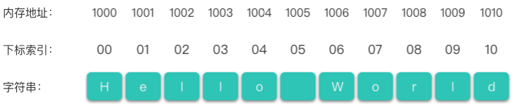
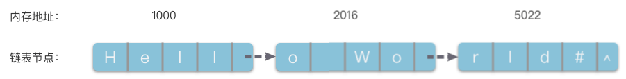

# 15.字符串基础知识

## 1.字符串简介

> **字符串（String）**：简称为串，是由零个或多个字符组成的有限序列。一般记为 $s = a_1a_2…a_n (0 \le n ⪇ \infty)$。

下面介绍一下字符串相关的一些重要概念。

-   **字符串名称**：字符串定义中的 `s` 就是字符串的名称。
-   **字符串的值**：$a_1a_2…a_n$ 组成的字符序列就是字符串的值，一般用双引号括起来。
-   **字符变量**：字符串每一个位置上的元素都是一个字符变量。字符 $a_i$ 可以是字母、数字或者其他字符。$i$ 是该字符在字符串中的位置。
-   **字符串的长度**：字符串中字符的数目 $n$ 称为字符串的长度。
-   **空串**：零个字符构成的串也成为 **「空字符串（Null String）」**，它的长度为 $0$，可以表示为 `""`。
-   **子串**：字符串中任意个连续的字符组成的子序列称为该字符串的 **「子串（Substring）」**。并且有两种特殊子串，起始于位置为 `0`、长度为 `k` 的子串称为 **「前缀（Prefix）」**。而终止于位置 `n - 1`、长度为 `k` 的子串称为 **「后缀（Suffix）」**。
-   **主串**：包含子串的字符串相应的称为 **「主串」**。

根据字符串的特点，我们可以将字符串问题分为以下几种：

-   字符串匹配问题。
-   子串相关问题。
-   前缀 / 后缀相关问题；
-   回文串相关问题。
-   子序列相关问题。

## 2.字符串比较

### 2.1 字符串的比较操作

两个数字之间很容易比较大小，例如 `1 < 2`。而字符串之间的比较相对来说复杂一点。字符串之间的大小取决于它们**按顺序排列字符的前后顺序**。

字符串之间的比较是通过组成字符串的字符之间的「字符编码」来决定的。而字符编码指的是字符在对应字符集中的序号。

先来考虑一下如何判断两个字符串是否相等。

如果说两个字符串 `str1` 和 `str2` 相等，则必须满足两个条件：

1.  字符串 `str1` 和字符串 `str2` 的长度相等。
2.  字符串 `str1` 和字符串 `str2` 对应位置上的各个字符都相同

而对于两个不相等的字符串，可以以下面的规则定义两个字符串的大小：

-   从两个字符串的第 `0` 个位置开始，依次比较对应位置上的字符编码大小。
    -   如果 `str1[i]` 对应的字符编码等于 `str2[i]` 对应的字符编码，则比较下一位字符。
    -   如果 `str1[i]` 对应的字符编码小于 `str2[i]` 对应的字符编码，则说明 `str1 < str2`。比如：`"abc" < "acc"`。
    -   如果 `str1[i]` 对应的字符编码大于 `str2[i]` 对应的字符编码，则说明 `str1 > str2`。比如：`"bcd" > "bad"`。
-   如果比较到某一个字符串末尾，另一个字符串仍有剩余：
    -   如果字符串 `str1` 的长度小于字符串 `str2`，即 `len(str1) < len(str2)`。则 `str1 < str2`。比如：`"abc" < "abcde"`。
    -   如果字符串 `str1` 的长度大于字符串 `str2`，即 `len(str1) > len(str2)`。则 `str1 > str2`。比如：`"abcde" > "abc"`。
-   如果两个字符串每一个位置上的字符对应的字符编码都相等，且长度相同，则说明 `str1 == str2`，比如：`"abcd" == "abcd"`。

按照上面的规则，可以定义一个 `strcmp` 方法，并且规定：

-   当 `str1 < str2` 时，`strcmp` 方法返回 `-1`。
-   当 `str1 == str2` 时，`strcmp` 方法返回 `0`。
-   当 `str1 > str2` 时，`strcmp` 方法返回 `1`。

`strcmp` 方法对应的具体代码如下：

```python
def strcmp(str1:str, str2:str):
    """ 字符串比较
    """
    idx1 = 0
    idx2 = 0
    # ord 返回字符的 ASCII 数值
    while idx1 < len(str1) and idx2 < len(str2):
        if ord(str1[idx1]) == ord(str2[idx2]):
            idx1 += 1
            idx2 += 1
        elif ord(str1[idx1]) < ord(str2[idx2]):
            return -1
        else:
            return 1
        
    if len(str1) < len(str2):
        return -1
    elif len(str1) > len(str2):
        return 1
    else:
        return 0

```

### 2.2 字符串的字符编码

刚才提到了字符编码，这里也稍微介绍一下字符串中常用的字符编码标准。

以计算机中常用字符使用的 `ASCII` 编码为例。最早的时候，人们制定了一个包含 `127` 个字符的编码表 `ASCII` 到计算机系统中。`ASCII` 编码表中的字符包含了大小写的英文字母、数字和一些符号。每个字符对应一个编码，比如**大写字母 ****`A`**** 的编码是 ****`65`****，小写字母 ****`a`****的编码是`97`**。

`ASCII` 编码可以解决以英语为主的语言，可是无法满足中文编码。为了解决中文编码，我国制定了 `GB2312`、`GBK`、`GB18030` 等中文编码标准，将中文编译进去。但是世界上有上百种语言和文字，各国有各国的标准，就会不可避免的产生冲突，于是就有了 `Unicode` 编码。`Unicode` 编码最常用的就是 `UTF-8` 编码，`UTF-8` 编码把一个 `Unicode` 字符根据不同的数字大小编码成 `1` \~ `6` 个字节，常用的英文字母被编码成 `1` 个字节，汉字通常是 `3` 个字节。

## 3.字符串存储结构

字符串的存储结构跟线性表相同，分为「顺序存储结构」和「链式存储结构」。

### 3.1 顺序存储结构

与线性表的顺序存储结构相似，字符串的顺序存储结构也是使用一组地址连续的存储单元依次存放串中的各个字符。按照预定义的大小，为每个定义的字符串变量分配一个固定长度的存储区域。一般是用定长数组来定义。

字符串的顺序存储结构如下图所示。



如上图所示，字符串的顺序存储中每一个字符元素都有自己的下标索引，下标所以从 `0` 开始，到 `字符串长度 - 1` 结束。字符串中每一个「下标索引」，都有一个与之对应的「字符元素」。

跟数组类似，字符串也支持随机访问。即字符串可以根据下标，直接定位到某一个字符元素存放的位置。

### 3.2 链式存储结构

字符串的存储也可以采用链式存储结构，即采用一个线性链表来存储一个字符串。字符串的链节点包含一个用于存放字符的 `data` 变量，和指向下一个链节点的指针变量 `next`。这样，一个字符串就可以用一个线性链表来表示。

在字符串的链式存储结构中，每个链节点可以仅存放一个字符，也可以存放多个字符。通常情况下，链节点的字符长度为 `1` 或者  `4`，这是为了避免浪费空间。当链节点的字符长度为 `4` 时，由于字符串的长度不一定是 `4` 的倍数，因此字符串所占用的链节点中最后那个链节点的 `data` 变量可能没有占满，可以用 `#` 或其他不属于字符集的特殊字符将其补全。

字符串的链式存储结构图下图所示。



如上图所示，字符串的链式存储将一组任意的存储单元串联在一起。链节点之间的逻辑关系是通过指针来间接反映的。

### 3.3 不同语言的字符串

-   C 语言中的字符串是使用空字符 `\0` 结尾的字符数组。`\0` 符号用于标记字符串的结束。C 语言的标准库 `string.h`  头文件中提供了各种操作字符串的函数。
-   C++ 语言中除了提供 C 风格的字符串，还引入了 `string` 类类型。`string` 类处理起字符串来会方便很多，完全可以代替 C 语言中的字符数组或字符串指针。
-   Java 语言的标准库中也提供了 `String` 类作为字符串库。
-   Python 语言中使用 `str` 对象来代表字符串。`str` 对象一种不可变类型对象。即 `str` 类型创建的字符串对象在定义之后，无法更改字符串的长度，也无法改变或删除字符串中的字符。

## 4.字符串匹配问题

> **字符串匹配（String Matching）**：又称模式匹配（Pattern Matching）。可以简单理解为，给定字符串 `T` 和 `p`，在主串 `T` 中寻找子串 `p`。主串 `T` 又被称为文本串，子串 `p` 又被称为模式串（`Pattern`）。

在字符串问题中，最重要的问题之一就是字符串匹配问题。而按照模式串的个数，可以将字符串匹配问题分为：「**单模式串匹配问题**」和「**多模式串匹配问题**」。

### 4.1 单模式串匹配问题

> **单模式匹配问题（Single Pattern Matching）**：给定一个文本串 $T = t_1t_2...t_n$，再给定一个特定模式串 $p = p_1p_2...p_n$。要求从文本串 $T$ 找出特定模式串 $p$ 的所有出现位置。

有很多算法可以解决单模式匹配问题。而根据在文本中搜索模式串方式的不同，可以将单模式匹配算法分为以下几种：

-   **基于前缀搜索方法**：在搜索窗口内从前向后（沿着文本的正向）逐个读入文本字符，搜索窗口中文本和模式串的最长公共前缀。
    -   著名的 `Knuth-Morris-Pratt (KMP)` 算法和更快的 `Shift-Or` 算法使用的就是这种方法。
-   **基于后缀搜索方法**：在搜索窗口内从后向前（沿着文本的反向）逐个读入文本字符，搜索窗口中文本和模式串的最长公共后缀。使用这种搜索算法可以跳过一些文本字符，从而具有亚线性的平均时间复杂度。
    -   最著名的 `Boyer-Moore` 算法，以及 `Horspool` 算法、`Sunday (Boyer-Moore 算法的简化)` 算法都使用了这种方法。
-   **基于子串搜索方法**：在搜索窗口内从后向前（沿着文本的反向）逐个读入文本字符，搜索满足「既是窗口中文本的后缀，也是模式串的子串」的最长字符串。与后缀搜索方法一样，使用这种搜索方法也具有亚线性的平均时间复杂度。这种方法的主要缺点在于需要识别模式串的所有子串，这是一个非常复杂的问题。
    -   `Rabin-Karp` 算法、`Backward Dawg Matching (BDM)` 算法、`Backward Nondeterministtic Dawg Matching (BNDM)` 算法和 `Backward Oracle Matching (BOM)` 算法使用的就是这种思想。其中，`Rabin-Karp` 算法使用了基于散列的子串搜索算法。

### 4.2 多模式串匹配问题

> **多模式匹配问题（Multi Pattern Matching）**：给定一个文本串 $T = t_1t_2...t_n$，再给定一组模式串 $P = {p^1, p^2, ... ,p^r}$，其中每个模式串 $p^i$ 是定义在有限字母表上的字符串 $p^i = p^i_1p^i_2...p^i_n$。要求从文本串 $T$ 中找到模式串集合 $P$ 中所有模式串 $p^i$ 的所有出现位置。

模式串集合 $P$ 中的一些字符串可能是集合中其他字符串的子串、前缀、后缀，或者完全相等。解决多模式串匹配问题最简单的方法是利用「单模式串匹配算法」搜索 `r` 遍。这将导致预处理阶段的最坏时间复杂度为 $O(|P|)$，搜索阶段的最坏时间复杂度为 $O(r * n)$。

如果使用「单模式串匹配算法」解决多模式匹配问题，那么根据在文本中搜索模式串方式的不同，也可以将多模式串匹配算法分为以下三种：

-   **基于前缀搜索方法**：搜索从前向后（沿着文本的正向）进行，逐个读入文本字符，使用在 $P$ 上构建的自动机进行识别。对于每个文本位置，计算既是已读入文本的后缀，同时也是 $P$ 中某个模式串的前缀的最长字符串。
    -   著名的 `Aho-Corasick Automaton (AC 自动机)` 算法、`Multiple Shift-And` 算法使用的这种方法。
-   **基于后缀搜索方法**：搜索从后向前（沿着文本的反向）进行，搜索模式串的后缀。根据后缀的下一次出现位置来移动当前文本位置。这种方法可以避免读入所有的文本字符。
    -   `Commentz-Walter` 算法（`Boyer-Moore` 算法的扩展算法）、`Set Horspool` 算法（`Commentz-Walter` 算法的简化算法）、`Wu-Manber` 算法都使用了这种方法。
-   **基于子串搜索方法**：搜索从后向前（沿着文本的反向）进行，在模式串的长度为 $min(len(p^i))$ 的前缀中搜索子串，以此决定当前文本位置的移动。这种方法也可以避免读入所有的文本字符。
    -   `Multiple BNDM` 算法、`Set Backward Dawg Matching (SBDM)` 算法、`Set Backwrad Oracle Matching (SBOM)` 算法都使用了这种方法。

需要注意的是，以上所介绍的多模式串匹配算法大多使用了一种基本的数据结构：**「****字典树（Trie Tree）****」**。著名的 **「Aho-Corasick Automaton (AC 自动机) 算法」** 就是在 `KMP` 算法的基础上，与「字典树」结构相结合而诞生的。而「AC 自动机算法」也是多模式串匹配算法中最有效的算法之一。

所以学习多模式匹配算法，重点是要掌握 **「字典树」** 和 **「AC 自动机算法」** 。

## 5.实战题目

### 5.1 验证回文串

[125. 验证回文串 - 力扣（LeetCode）](https://leetcode.cn/problems/valid-palindrome/description/ "125. 验证回文串 - 力扣（LeetCode）")

```python
如果在将所有大写字符转换为小写字符、并移除所有非字母数字字符之后，短语正着读和反着读都一样。则可以认为该短语是一个 回文串 。

字母和数字都属于字母数字字符。

给你一个字符串 s，如果它是 回文串 ，返回 true ；否则，返回 false 。

 

示例 1：

输入: s = "A man, a plan, a canal: Panama"
输出：true
解释："amanaplanacanalpanama" 是回文串。
```

```c++
class Solution {
public:
    bool isPalindrome(string s) {
        if (s.empty()) {
            return true;
        }
        int start = 0;
        int end = s.size() - 1;
        // 对撞指针
        while (start < end)
        {
            // 移除非数字，字符串部分
            while (start < end && !(isdigit(s[start]) || isalpha(s[start]))) {
                start++;
            }
            while (start < end && !(isdigit(s[end]) || isalpha(s[end]))) {
                end--;
            }
            if (tolower(s[start]) == tolower(s[end])) {
                start++;
                end--;
            } else {
                return false;
            }
        }
        
        return true;
    }
};
```

### 5.2 反转字符串

[344. 反转字符串 - 力扣（LeetCode）](https://leetcode.cn/problems/reverse-string/description/ "344. 反转字符串 - 力扣（LeetCode）")

```python
编写一个函数，其作用是将输入的字符串反转过来。输入字符串以字符数组 s 的形式给出。

不要给另外的数组分配额外的空间，你必须原地修改输入数组、使用 O(1) 的额外空间解决这一问题。

示例 1：

输入：s = ["h","e","l","l","o"]
输出：["o","l","l","e","h"]

```

```c++
class Solution {
public:
    // 对撞指针
    void reverseString(vector<char>& s) {
        if (s.empty()) {
            return;
        }

        for (int start = 0, end = s.size() - 1; start < end; start++, end--) {
            char tmp = s[start];
            s[start] = s[end];
            s[end] = tmp;

            // swap(s[start], s[end]);
        }
    }
};
```

### 5.3 反转字符串中的单词Ⅲ

[557. 反转字符串中的单词 III - 力扣（LeetCode）](https://leetcode.cn/problems/reverse-words-in-a-string-iii/ "557. 反转字符串中的单词 III - 力扣（LeetCode）")

```python
给定一个字符串 s ，你需要反转字符串中每个单词的字符顺序，同时仍保留空格和单词的初始顺序。
 

示例 1：

输入：s = "Let's take LeetCode contest"
输出："s'teL ekat edoCteeL tsetnoc"
```

1、新建空字符串，从头到尾遍历源字符串，直到找到空格为止

2、原地方法

```c++
class Solution {
public:
    string reverseWords(string s) {
        string ret;
        int length = s.length();
        int i = 0;
        while (i < length) {
            int start = i;
            while (i < length && s[i] != ' ') {
                i++;
            }
            for (int p = start; p < i; p++) {
                ret.push_back(s[start + i - 1 - p]);
            }
            while (i < length && s[i] == ' ') {
                i++;
                ret.push_back(' ');
            }
        }
        return ret;
    }
};

```

```c++
class Solution {
public:
    string reverseWords(string s) {
        if (s.empty()) {
            return s;
        }

        int start = 0;
        int end = s.size() - 1;

        // 去除字符串前后的空格
        while (start < s.size() && s[start] == ' ') {
            start++;
        }
        while (start < s.size() && s[end] == ' ') {
            end--;
        }
        // 切分出来的单词
        std::string word;
        // 结果
        std::string ans;

        // 开始遍历字符串，切分单词
        while (start <= end) {
            char ch = s[start];
            // 如果单词不为空，且ch字符串为空，则到了下一个单词，开始处理
            if (!word.empty() && ch == ' ') {
                this->revserse_str(word);
                ans = ans + word + " ";
                word = "";
            } else if (ch != ' ') {
                word += s[start];
            }

            start++;
        }
        // 处理最后一个单词
        this->revserse_str(word);
        ans = ans + word;
        
        return ans;
    }

private:
    void revserse_str(std::string& str) {
        for (int start = 0, end = str.size() - 1; start < end; start++, end--) {
            char tmp = str[start];
            str[start] = str[end];
            str[end] = tmp;
        }
    }
};
```
