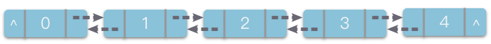

# 1.链表基础

## 1.链表基础

### 1.1 链表定义

> **链表（Linked List）**：一种线性表数据结构。它使用一组任意的存储单元（可以是连续的，也可以是不连续的），来存储一组具有相同类型的数据。

简单来说，**「链表」** 是实现线性表链式存储结构的基础。


如上图所示，链表通过将一组任意的存储单元串联在一起。其中，每个数据元素占用若干存储单元的组合称为一个「链节点」。为了将所有的节点串起来，每个链节点不仅要存放一个数据元素的值，还要存放一个指出这个数据元素在逻辑关系上的直接后继元素所在链节点的地址，该地址被称为「后继指针 `next`」。

在链表中，数据元素之间的逻辑关系是通过指针来间接反映的。逻辑上相邻的数据元素在物理地址上可能相邻，可也能不相邻。其在物理地址上的表现是随机的。

先来简单介绍一下链表结构的优缺点：

-   **优点**：存储空间不必事先分配，在需要存储空间的时候可以临时申请，不会造成空间的浪费；一些操作的时间效率远比数组高（插入、移动、删除元素等）。
-   **缺点**：不仅数据元素本身的数据信息要占用存储空间，指针也需要占用存储空间，链表结构比数组结构的空间开销大。

### 1.2 双向链表

> **双向链表（Doubly Linked List）**：链表的一种，也叫做双链表。它的每个链节点中有两个指针，分别指向直接后继和直接前驱。

-   **双向链表特点**：从双链表的任意一个节点开始，都可以很方便的访问它的前驱节点和后继节点。



### 1.3 循环链表

> **循环链表（Circular linked list）**：链表的一种。它的最后一个链节点指向头节点，形成一个环。

-   **循环链表特点**：从循环链表的任何一个节点出发都能找到任何其他节点。


## 2.链表基础操作

数据结构的操作一般涉及到增、删、改、查 4 种情况，链表的操作也基本上是这 4 种情况。

### 2.1 链表的结构定义

链表是由链节点通过 `next` 链接而构成的，可以先定义一个简单的「链节点类」，再来定义完整的「链表类」。

-   **链节点类（即 ListNode 类）**：使用成员变量 `val` 表示数据元素的值，使用指针变量 `next`表示后继指针。
-   **链表类（即 LinkedList 类）**：使用一个链节点变量 `head`来表示链表的头节点。

在创建空链表时，只需要把相应的链表头节点变量设置为空链接即可。在 Python 里可以将其设置为 `None`，其他语言也有类似的惯用值，比如 `NULL`、`nil`、`0` 等。

**「链节点以及链表结构定义」** 的代码如下：

```python
# 链节点类
class ListNode:
    def __init__(self, val=0, next=None):
        self.val = val
        self.next = next

# 链表类
class LinkedList:
    def __init__(self):
        self.head = None

```

### 2.2 建立一个线性链表

**建立一个线性链表**：根据线性表的数据元素动态生成链节点，并依次将其连接到链表中。

1.  从所给线性表的第 1 个数据元素开始依次获取表中的数据元素。
2.  每获取一个数据元素，就为该数据元素生成一个新节点，将新节点插入到链表的尾部。
3.  插入完毕之后返回第 1 个链节点的地址。

```python
# 根据 data 初始化一个新链表
def create(self, data):
    self.head = ListNode(0)
    cur = self.head
    for i in range(len(data)):
        node = ListNode(data[i])
        cur.next = node
        cur = cur.next

```

建立一个线性链表的操作依赖于线性表的元素个数，因此，时间复杂度为`O(n)`,  `n`为线性表长度。

### 2.3 求线性链表的长度

**求线性链表长度**：使用指针变量 `cur` 顺着链表 `next` 指针进行移动，并使用计数器 `count` 记录元素个数。

1.  让指针变量 `cur` 指向链表的第 1 个链节点。
2.  顺着链节点的 `next` 指针遍历链表，指针变量 `cur` 每指向一个链节点，计数器就做一次计数。
3.  等 `cur` 指向为空时结束遍历，此时计数器的数值就是链表的长度，将其返回即可。

```python
# 获取线性链表的长度
def length(self):
    count = 0
    cur = self.head
    while cur:
        count += 1
        cur = cur.next
      
    return count

```

依赖于线性表的元素个数，因此，时间复杂度为`O(n)`,  `n`为线性表长度。

### 2.4 查找元素

**在链表中查找值为 val 的元素**：从头节点 `head` 开始，沿着链表节点逐一进行查找。如果查找成功，返回被查找节点的地址；否则返回 `None`。

1.  让指针变量 `cur` 指向链表的第 `1` 个链节点。
2.  顺着链节点的 `next` 指针遍历链表，如果遇到 `cur.val == val`，则返回当前指针变量 `cur`。
3.  如果 `cur` 指向为空时也未找到，则该链表中没有值为 `val` 的元素，则返回 `None`。

```python
# 查找元素：在链表中查找值为val的元素
def find(self, val):
    cur = self.head
    while cur:
        if val == cur.val:
            return val
        cur = cur.next
        
    return None

```

依赖于线性表的元素个数，因此，时间复杂度为`O(n)`,  `n`为线性表长度。

### 2.5 插入元素

链表中插入元素操作分为三种：

-   **链表头部插入元素**：在链表第 1 个链节点之前插入值为 `val` 的链节点。
-   **链表尾部插入元素**：在链表最后 1 个链节点之后插入值为 `val` 的链节点。
-   **链表中间插入元素**：在链表第 `i` 个链节点之前插入值为 `val` 的链节点。

#### （1）头插法

**链表头部插入元素**：在链表第 1 个链节点之前插入值为 `val` 的链节点。

1.  先创建一个值为 `val` 的链节点 `node`。
2.  然后将 `node` 的 next 指针指向链表的头节点 `head`。
3.  再将链表的头节点 `head` 指向 `node`。


```python
# 链表头部插入元素
def insert_front(self, val):
    node = ListNode(val)
    node.next = self.head
    self.head = node

```

头插法操作与链表长度无关，因此，时间复杂度为`O(1)`

#### （2）尾插法

**链表尾部插入元素**：在链表最后 1 个链节点之后插入值为 `val` 的链节点。

1.  先创建一个值为 `val` 的链节点 `node`。
2.  使用指针 `cur` 指向链表的头节点 `head`。
3.  通过链节点的 `next` 指针移动 `cur` 指针，从而遍历链表，直到 `cur.next` 为 `None。`
4.  令 `cur.next` 指向将新的链节点 node。


```python
# 链表尾部插入元素

def insert_rear(self, val):
    node = ListNode(val)
    cur = slef.head
    while cur.next:
        cur = cur.next
    cur.next = node

```

需要将`cur`从链表头部移动到尾部，操作次数为`n`，因此，时间复杂度为`O(n)`,  `n`为线性表长度。

#### （3）链表中间插入元素

**链表中间插入元素**：在链表第 `i`个链节点之前插入值为 `val` 的链节点。

1.  使用指针变量 `cur` 和一个计数器 `count`。令 `cur` 指向链表的头节点，`count` 初始值赋值为 0。
2.  沿着链节点的 `next` 指针遍历链表，指针变量 `cur` 每指向一个链节点，计数器就做一次计数。
3.  当遍历到第 `index-1` 个链节点时停止遍历。
4.  创建一个值为 `val `的链节点 `node`。
5.  将 `node.next` 指向 `cur.next`。
6.  然后令 `cur.next` 指向 `node`。


```python
# 链表中间插入元素

def inset_inside(self, index, val):
    count = 0
    cur = self.head
    while cur and count < index - 1:
        count += 1
        cur = cur.next
        
    if not cur:
        return "Error"
        
    node = ListNode(val)
    node.next = cur.next
    cur.next = node

```

需要将`cur`从链表头部移动到第i个节点之前，平均时间复杂度为`O(n)`,  `n`为线性表长度。

### 2.6 删除元素

链表的删除元素操作与链表的查找元素操作一样，同样分为三种情况：

-   **链表头部删除元素**：删除链表的第 1 个链节点。
-   **链表尾部删除元素**：删除链表末尾最后 1 个链节点。
-   **链表中间删除元素**：删除链表第 val 个链节点。

#### （1）删除链表头部元素

**链表头部删除元素**：删除链表的第 1 个链节点。

1.  直接将 `self.head` 沿着 `next` 指针向右移动一步即可。


```python
# 链表头部删除元素
def remove_front(self):
    if self.head:
        self.head = self.head.next
```

#### （2）删除链表尾部元素

**链表尾部删除元素**：删除链表末尾最后 1 个链节点。

1.  先使用指针变量 `cur` 沿着 `next` 指针移动到倒数第 2 个链节点。
2.  然后将此节点的 `next` 指针指向 `None` 即可。


```python
# 链表尾部删除元素
def removeRear(self):
    if not self.head or not self.head.next:
        return 'Error'

    cur = self.head
    while cur.next.next:
        cur = cur.next
    cur.next = None
```

#### （3）删除链表中间元素

**链表中间删除元素**：删除链表第 `i` 个链节点。

1.  先使用指针变量 `cur` 移动到第 `i−1` 个位置的链节点。
2.  然后将 `cur` 的 `next` 指针，指向要第 `i` 个元素的下一个节点即可。


```python
# 链表中间删除元素
def removeInside(self, index):
    count = 0
    cur = self.head
    
    while cur.next and count < index - 1:
        count += 1
        cur = cur.next
        
    if not cur:
        return 'Error'
        
    del_node = cur.next
    cur.next = del_node.next

```

## 3.实战题目

### 3.1 设计链表

[707. 设计链表 - 力扣（LeetCode）](https://leetcode.cn/problems/design-linked-list/description/ "707. 设计链表 - 力扣（LeetCode）")

```c++
你可以选择使用单链表或者双链表，设计并实现自己的链表。

单链表中的节点应该具备两个属性：val 和 next 。val 是当前节点的值，next 是指向下一个节点的指针/引用。

如果是双向链表，则还需要属性 prev 以指示链表中的上一个节点。假设链表中的所有节点下标从 0 开始。

实现 MyLinkedList 类：

- MyLinkedList() 初始化 MyLinkedList 对象。
- int get(int index) 获取链表中下标为 index 的节点的值。如果下标无效，则返回 -1 。
- void addAtHead(int val) 将一个值为 val 的节点插入到链表中第一个元素之前。在插入完成后，新节点会成为链表的第一个节点。
- void addAtTail(int val) 将一个值为 val 的节点追加到链表中作为链表的最后一个元素。
- void addAtIndex(int index, int val) 将一个值为 val 的节点插入到链表中下标为 index 的节点之前。如果 index 等于链表的长度，那么该节点会被追加到链表的末尾。如果 index 比长度更大，该节点将 不会插入 到链表中。
- void deleteAtIndex(int index) 如果下标有效，则删除链表中下标为 index 的节点。

示例：

输入
["MyLinkedList", "addAtHead", "addAtTail", "addAtIndex", "get", "deleteAtIndex", "get"]
[[], [1], [3], [1, 2], [1], [1], [1]]
输出
[null, null, null, null, 2, null, 3]

解释
MyLinkedList myLinkedList = new MyLinkedList();
myLinkedList.addAtHead(1);
myLinkedList.addAtTail(3);
myLinkedList.addAtIndex(1, 2);    // 链表变为 1->2->3
myLinkedList.get(1);              // 返回 2
myLinkedList.deleteAtIndex(1);    // 现在，链表变为 1->3
myLinkedList.get(1);              // 返回 3
```

```c++
class MyLinkedList {
public:
    MyLinkedList() {
        this->m_size = 0;
        this->m_head = new ListNode(0);
    }
    
    int get(int index) {
        if (index < 0 || index >= this->m_size) {
            return -1;
        }
        
        ListNode *curr = this->m_head;
        for (int i = 0; i <= index; i++) {
            curr = curr->next;
        }
        return curr->val;
    }
    
    void addAtHead(int val) {
        this->addAtIndex(0, val);
    }
    
    void addAtTail(int val) {
        this->addAtIndex(this->m_size, val);
    }
    
    void addAtIndex(int index, int val) {
        if (index > this->m_size) {
            return;
        }

        index = std::max(0, index);
        this->m_size++;
        ListNode* pred = this->m_head;
        for (int i = 0; i < index; i++) {
            pred = pred->next;
        }
        ListNode* node = new ListNode(val);
        node->next = pred->next;
        pred->next = node;
    }
    
    void deleteAtIndex(int index) {
        if (index < 0 || index >= this->m_size) {
            return;
        }
        this->m_size--;
        ListNode* pred = this->m_head;
        for (int i = 0; i < index; i++) {
            pred = pred->next;
        }
        ListNode* node = pred->next;
        pred->next = pred->next->next;
        delete node;
    }
private:
    int m_size;
    ListNode* m_head;
};
```

### 3.2 反转链表

[206. 反转链表 - 力扣（LeetCode）](https://leetcode.cn/problems/reverse-linked-list/description/ "206. 反转链表 - 力扣（LeetCode）")

```c++
给你单链表的头节点 head ，请你反转链表，并返回反转后的链表。

输入：head = [1,2,3,4,5]
输出：[5,4,3,2,1]

```

头插法

```c++
class Solution {
public:
    ListNode* reverseList(ListNode* head) {
        ListNode* head_node = new ListNode();
        head_node->next = nullptr;
        ListNode* p = head;
        while (p != nullptr) {
            ListNode* next = p->next;
            p->next = head_node->next;
            head_node->next = p;
            p = next;
        }

        return head_node->next;
    }
};
```

### 3.3 移除链表元素

[203. 移除链表元素 - 力扣（LeetCode）](https://leetcode.cn/problems/remove-linked-list-elements/description/ "203. 移除链表元素 - 力扣（LeetCode）")

```c++
给你一个链表的头节点 head 和一个整数 val ，请你删除链表中所有满足 Node.val == val 的节点，并返回 新的头节点 。

输入：head = [1,2,6,3,4,5,6], val = 6
输出：[1,2,3,4,5]

```

添加新的头节点，开始遍历移除

```c++
class Solution {
public:
    ListNode* removeElements(ListNode* head, int val) {
        ListNode* dummy_node = new ListNode();
        dummy_node->next = head;

        ListNode* pre = dummy_node;
        ListNode* curr = dummy_node->next;
        while(curr != nullptr){
            if (curr->val == val) {
                pre->next = curr->next;
                delete curr;
                curr = pre->next;
            } else {
                pre = curr;
                curr = curr->next;
            }
            
        }
        return dummy_node->next;
    }
};
```

### 3.4 奇偶链表

[328. 奇偶链表 - 力扣（LeetCode）](https://leetcode.cn/problems/odd-even-linked-list/ "328. 奇偶链表 - 力扣（LeetCode）")

```c++
给定单链表的头节点 head ，将所有索引为奇数的节点和索引为偶数的节点分别组合在一起，然后返回重新排序的列表。

第一个节点的索引被认为是 奇数 ， 第二个节点的索引为 偶数 ，以此类推。

请注意，偶数组和奇数组内部的相对顺序应该与输入时保持一致。

你必须在 O(1) 的额外空间复杂度和 O(n) 的时间复杂度下解决这个问题。

输入: head = [1,2,3,4,5]
输出: [1,3,5,2,4]

```

1.  使用两个指针 `odd`、`even` 分别表示奇数节点链表和偶数节点链表。
2.  先将奇数位置上的节点和偶数位置上的节点分成两个链表，再将偶数节点的链表接到奇数链表末尾。
3.  过程中需要使用几个必要指针用于保留必要位置（比如原链表初始位置、偶数链表初始位置、当前遍历节点位置）。

```c++
class Solution {
public:
    ListNode* oddEvenList(ListNode* head) {
        if (head == nullptr || head->next == nullptr 
            || head->next->next == nullptr) {
             return head;
        }
        // 偶数链表节点头指针
        ListNode* even_head = head->next;
        // 奇数链表节点头指针
        ListNode* odd = head;
        ListNode* even = even_head;
        
        bool is_odd = true;
        ListNode* curr_node = head->next->next;

        while (curr_node != nullptr) {
            // 奇数节点，添加奇数链表
            if (is_odd) {
                odd->next = curr_node;
                odd = curr_node;
            } else {
                // 偶数节点，添加偶数链表
                even->next = curr_node;
                even = curr_node;
            }
            is_odd = !is_odd;
            curr_node = curr_node->next;
        }
        odd->next = even_head;
        even->next = nullptr;

        return head;
    }
};
```

### 3.5 回文链表

[234. 回文链表 - 力扣（LeetCode）](https://leetcode.cn/problems/palindrome-linked-list/description/ "234. 回文链表 - 力扣（LeetCode）")

```c++
给你一个单链表的头节点 head ，请你判断该链表是否为回文链表。如果是，返回 true ；否则，返回 false 。

输入：head = [1,2,2,1]
输出：true

```

利用数组 + 双指针

1.  利用数组，将链表元素依次存入。
2.  然后再使用两个指针，一个指向数组开始位置，一个指向数组结束位置。
3.  依次判断首尾对应元素是否相等，如果都相等，则为回文链表。如果不相等，则不是回文链表。

```c++
class Solution {
public:
    bool isPalindrome(ListNode* head) {
        std::vector<int> vec_arr;
        while (head != nullptr) {
            vec_arr.push_back(head->val);
            head = head->next;
        }

        for (int i = 0, j = vec_arr.size() - 1; i < j; i++, j--) {
            if (vec_arr[i]!= vec_arr[j]) {
                return false;
            }
        }

        return true;
    }
};
```

### 3.6 随机链表的复制

[138. 随机链表的复制 - 力扣（LeetCode）](https://leetcode.cn/problems/copy-list-with-random-pointer/description/ "138. 随机链表的复制 - 力扣（LeetCode）")

```c++
给你一个长度为 n 的链表，每个节点包含一个额外增加的随机指针 random ，该指针可以指向链表中的任何节点或空节点。

构造这个链表的 深拷贝。 深拷贝应该正好由 n 个 全新 节点组成，其中每个新节点的值都设为其对应的原节点的值。新节点的 next 指针和 random 指针也都应指向复制链表中的新节点，并使原链表和复制链表中的这些指针能够表示相同的链表状态。复制链表中的指针都不应指向原链表中的节点 。

例如，如果原链表中有 X 和 Y 两个节点，其中 X.random --> Y 。那么在复制链表中对应的两个节点 x 和 y ，同样有 x.random --> y 。

返回复制链表的头节点。

用一个由 n 个节点组成的链表来表示输入/输出中的链表。每个节点用一个 [val, random_index] 表示：

- val：一个表示 Node.val 的整数。
- random_index：随机指针指向的节点索引（范围从 0 到 n-1）；如果不指向任何节点，则为  null 。

你的代码 只 接受原链表的头节点 head 作为传入参数。

输入：head = [[7,null],[13,0],[11,4],[10,2],[1,0]]
输出：[[7,null],[13,0],[11,4],[10,2],[1,0]]

```

1.  遍历链表，利用哈希表，以 `旧节点: 新节点` 为映射关系，将节点关系存储下来。
2.  再次遍历链表，将新链表的 `next` 和 `random` 指针设置好。

```c++
class Solution {
public:
    Node* copyRandomList(Node* head) {
        if (head == nullptr) {
            return nullptr;
        }
        std::unordered_map<Node*, Node*> cache_node;

        Node* curr_node = head;
        // 存储旧节点和新节点的映射关系
        while (curr_node != nullptr) {
            Node* new_node = new Node(curr_node->val, nullptr, nullptr);
            cache_node[curr_node] = new_node;
            curr_node = curr_node->next;
        }

        curr_node = head;
        // 遍历链表，设置新旧节点
        while (curr_node!= nullptr) {
            if (curr_node->next != nullptr) {
                cache_node[curr_node]->next = cache_node[curr_node->next];
            }
            if (curr_node->random != nullptr) {
                cache_node[curr_node]->random = cache_node[curr_node->random];
            }
            
            curr_node = curr_node->next;
        }

        return cache_node[head];
    }
};
```
