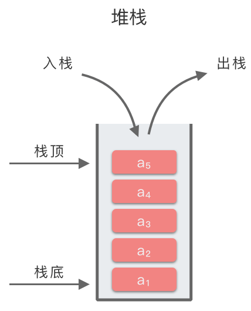
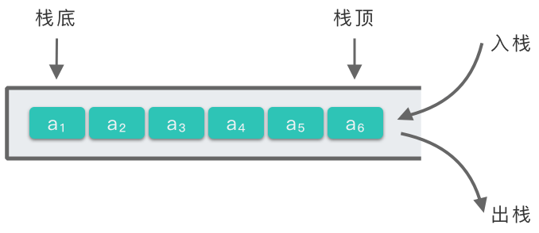
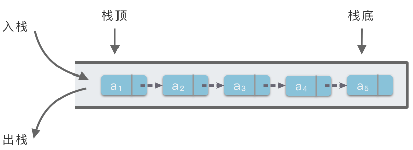

# 4.堆栈

## 1.堆栈简介

> **堆栈（Stack）**：简称为栈。一种线性表数据结构，是一种**只允许在表的一端进行插入和删除操作的线性表**。

-   **线性表**：栈中元素具有前驱后继的线性关系。
-   **后进先出原则**：

把栈中允许插入和删除的一端称为 **「****栈顶（top）****」**；另一端则称为 **「****栈底（bottom）****」**。当表中没有任何数据元素时，称之为 **「****空栈****」**。

堆栈有两种基本操作：**「插入操作」** 和 **「删除操作」**。

-   栈的插入操作又称为「入栈」或者「进栈」。
-   栈的删除操作又称为「出栈」或者「退栈」。



## 2.堆栈的顺序存储和链式存储

和线性表类似，栈有两种存储表示方法：**「****顺序栈****」** 和 **「****链式栈****」**。

-   **「顺序栈」**：即堆栈的**顺序存储结构**。利用一组地址连续的存储单元依次存放自栈底到栈顶的元素，同时使用指针 `top` 指示栈顶元素在顺序栈中的位置。
-   **「链式栈」**：即堆栈的**链式存储结构**。利用单链表的方式来实现堆栈。栈中元素按照插入顺序依次插入到链表的第一个节点之前，并使用栈顶指针 `top` 指示栈顶元素，`top`永远指向链表的头节点位置。

### 2.1 堆栈的基本操作

栈作为一种线性表来说，理论上应该具备线性表所有的操作特性，但由于「后进先出」的特殊性，所以针对栈的操作进行了一些变化。尤其是插入操作和删除操作，改为了入栈（push）和出栈（pop）。

堆栈的基本操作如下：

-   **初始化空栈**：创建一个空栈，定义栈的大小 `size`，以及栈顶元素指针 `top`。
-   **判断栈是否为空**：当堆栈为空时，返回 `true`。当堆栈不为空时，返回 `false`。一般只用于栈中删除操作和获取当前栈顶元素操作中。
-   **判断栈是否已满**：当堆栈已满时，返回 `true`，当堆栈未满时，返回 `false`。一般只用于顺序栈中插入元素和获取当前栈顶元素操作中。
-   **插入元素（进栈、入栈）**：相当于在线性表最后元素后面插入一个新的数据元素。并改变栈顶指针 `top` 的指向位置。
-   **删除元素（出栈、退栈）**：相当于在线性表最后元素后面删除最后一个数据元素。并改变栈顶指针 `top` 的指向位置。
-   **获取栈顶元素**：相当于获取线性表中最后一个数据元素。与插入元素、删除元素不同的是，该操作并不改变栈顶指针 `top` 的指向位置。

### 2.2 顺序栈的存储实现

python中可以借助list来实现。



`self.top`指向栈顶元素的位置

-   **初始化空栈**：使用列表创建一个空栈，定义栈的大小 `self.size`，并令栈顶元素指针 `self.top` 指向 `-1`，即 `self.top = -1`。
-   **判断栈是否为空**：当 `self.top == -1` 时，说明堆栈为空，返回 `True`，否则返回 `False`。
-   **判断栈是否已满**：当 `self.top == self.size - 1`，说明堆栈已满，返回 `True`，否则返回返回 `False`。
-   **插入元素（进栈、入栈）**：先判断堆栈是否已满，已满直接抛出异常。如果堆栈未满，则在 `self.stack` 末尾插入新的数据元素，并令 `self.top` 向右移动 `1` 位。
-   **删除元素（出栈、退栈）**：先判断堆栈是否为空，为空直接抛出异常。如果堆栈不为空，则删除 `self.stack` 末尾的数据元素，并令 `self.top` 向左移动 `1` 位。
-   **获取栈顶元素**：先判断堆栈是否为空，为空直接抛出异常。不为空则返回 `self.top` 指向的栈顶元素，即 `self.stack[self.top]`。

```python
class Stack:
    """ 顺序栈实现
    """
    def __init__(self, size=100) -> None:
        """ 初始化
        """
        self.stack = []
        self.size = size 
        self.top = -1

    def is_empty(self):
        """ 判断栈是否为空
        """
        return self.top == -1
    
    def is_full(self):
        """ 判断栈是否已满
        """
        return self.top + 1 == self.size
    
    def push(self, value):
        """ 入栈操作
        """
        if self.is_full():
            raise Exception("stack is full")
        else:
            self.stack.append(value)
            self.top += 1

    def pop(self):
        """ 出栈
        """
        if self.is_empty():
            raise Exception("stack is empty")
        else:
            self.stack.pop()
            self.top -= 1

    def peek(self):
        """ 获取栈顶元素
        """
        if self.is_empty():
            raise Exception("stack is empty")
        else:
            return self.stack[self.top]
```

### 2.3 **链式栈**的存储实现

堆栈的顺序存储结构保留着顺序存储分配空间的固有缺陷，即在栈满或者其他需要重新调整存储空间时需要移动大量元素



`self.top` 指向栈顶元素所在位置。

-   **初始化空栈**：使用列表创建一个空栈，并令栈顶元素指针 `self.top` 指向 `None`，即 `self.top = None`。
-   **判断栈是否为空**：当 `self.top == None` 时，说明堆栈为空，返回 `True`，否则返回 `False`。
-   **插入元素（进栈、入栈）**：创建值为 `value` 的链表节点，插入到链表头节点之前，并令栈顶指针 `self.top` 指向新的头节点。
-   **删除元素（出栈、退栈）**：先判断堆栈是否为空，为空直接抛出异常。如果堆栈不为空，则先使用变量 `cur` 存储当前栈顶指针 `self.top` 指向的头节点，然后令 `self.top` 沿着链表移动 `1` 位，然后再删除之前保存的 `cur` 节点。
-   **获取栈顶元素**：先判断堆栈是否为空，为空直接抛出异常。不为空则返回 `self.top` 指向的栈顶节点的值，即 `self.top.value`。

```python
class Node:
    """ 链表结点
    """
    def __init__(self, value) -> None:
        self.value = value
        self.next = None

class Stack:
    """ 链式栈实现
    """
    def __init__(self) -> None:
        """ 初始化空栈
        """
        self.top = None

    def is_empty(self):
        """ 判断栈是否为空
        """
        return self.top == None
    
    
    def push(self, value):
        """ 入栈操作
        """
        curr_node = Node(value)
        curr_node.next = self.top
        self.top = curr_node

    def pop(self):
        """ 出栈
        """
        if self.is_empty():
            raise Exception("stack is empty")
        else:
            curr_node = self.top
            self.top = self.top.next
            del curr_node

    def peek(self):
        """ 获取栈顶元素
        """
        if self.is_empty():
            raise Exception("stack is empty")
        else:
            return self.top.value
```

## 3.堆栈应用

堆栈是算法和程序中最常用的辅助结构，其的应用十分广泛。堆栈基本应用于两个方面：

-   使用堆栈可以很方便的保存和取用信息，因此长被用作算法和程序中的辅助存储结构，临时保存信息，供后面操作中使用。
    -   例如：操作系统中的函数调用栈，浏览器中的前进、后退功能。
-   堆栈的后进先出规则，可以保证特定的存取顺序。
    -   例如：翻转一组元素的顺序、铁路列车车辆调度。

### 3.1 有效的括号

[20. 有效的括号 - 力扣（LeetCode）](https://leetcode.cn/problems/valid-parentheses/description/ "20. 有效的括号 - 力扣（LeetCode）")

```python
给定一个只包括 '('，')'，'{'，'}'，'['，']' 的字符串 s ，判断字符串是否有效。

有效字符串需满足：

1.左括号必须用相同类型的右括号闭合。
2.左括号必须以正确的顺序闭合。
3.每个右括号都有一个对应的相同类型的左括号。
 

示例 1：

输入：s = "()"
输出：true
```

括号匹配是「栈」的经典应用。可以用栈来解决这道题。具体做法如下：

1.  先判断一下字符串的长度是否为偶数。因为括号是成对出现的，所以字符串的长度应为偶数，可以直接判断长度为奇数的字符串不匹配。如果字符串长度为奇数，则说明字符串 `s` 中的括号不匹配，直接返回 `False`。
2.  使用栈 `stack` 来保存未匹配的左括号。然后依次遍历字符串 `s` 中的每一个字符。
    1.  如果遍历到左括号时，将其入栈。
    2.  如果遍历到右括号时，先看栈顶元素是否是与当前右括号相同类型的左括号。
        1.  如果是与当前右括号相同类型的左括号，则令其出栈，继续向前遍历。
        2.  如果不是与当前右括号相同类型的左括号，则说明字符串 `s` 中的括号不匹配，直接返回 `False`。
3.  遍历完，还要再判断一下栈是否为空。
    1.  如果栈为空，则说明字符串 `s` 中的括号匹配，返回 `True`。
    2.  如果栈不为空，则说明字符串 `s` 中的括号不匹配，返回 `False`。

```c++
class Solution {
public:
    bool isValid(string s) {
        if (s.size() % 2 == 1) {
            return false;
        }
        std::stack<char> stk;

        for (auto ch : s) {
            if (ch == '(' || ch == '[' || ch == '{') {
                stk.push(ch);
            } else if (ch == ')' || ch == ']' || ch == '}') {
                if (!stk.empty() && this->judge_vaild(stk.top(), ch)) {
                    stk.pop();
                } else {
                    return false;
                }
            }
        }

        if (stk.empty()) {
            return true;
        } else {
            return false;
        }
    }

private:
    bool judge_vaild(char s, char d) {
        if ((s == '(' && d == ')')
            ||  (s == '[' && d == ']')
            ||  (s == '{' && d == '}')) {
            return true;
        } else {
            return false;
        }
    }
};
```

### 3.2 基本计算器Ⅱ

[227. 基本计算器 II - 力扣（LeetCode）](https://leetcode.cn/problems/basic-calculator-ii/ "227. 基本计算器 II - 力扣（LeetCode）")

```python
给你一个字符串表达式 s ，请你实现一个基本计算器来计算并返回它的值。

整数除法仅保留整数部分。

你可以假设给定的表达式总是有效的。所有中间结果将在 [-231, 231 - 1] 的范围内。

注意：不允许使用任何将字符串作为数学表达式计算的内置函数，比如 eval() 。

 

示例 1：

输入：s = "3+2*2"
输出：7
```

可以考虑使用一个栈来保存进行乘除运算后的整数值。正整数直接压入栈中，负整数，则将对应整数取负号，再压入栈中。这样最终计算结果就是栈中所有元素的和。

具体做法：

1.  遍历字符串 `s`，使用变量 `op` 来标记数字之前的运算符，默认为 `+`。
2.  如果遇到数字，继续向后遍历，将数字进行累积，得到完整的整数 num。判断当前 op 的符号。
    1.  如果 `op` 为 `+`，则将 `num` 压入栈中。
    2.  如果 `op` 为 `-`，则将 `-num` 压入栈中。
    3.  如果 `op` 为 `*`，则将栈顶元素 `top` 取出，计算 `top * num`，并将计算结果压入栈中。
    4.  如果 `op` 为 `/`，则将栈顶元素 `top` 取出，计算 `int(top / num)`，并将计算结果压入栈中。
3.  如果遇到 `+`、`-`、`*`、`/` 操作符，则更新

```c++
class Solution {
public:
    int calculate(string s) {
        int size = s.size();
        std::vector<int> stk;
        char pre_op = '+';
        int num = 0;
        for (int i = 0; i < size; i++) {
            if (isdigit(s[i])) {
                num = num * 10 + int(s[i] - '0');
            }
            if (!isdigit(s[i]) && s[i] != ' ' || i == size - 1) {
                switch (pre_op) {
                case '+':
                    stk.push_back(num);
                    break;
                case '-':
                    stk.push_back(-num);
                    break;
                case '*':
                    stk.back() *= num;
                    break;
                
                default:
                    stk.back() /= num;
                }
                pre_op = s[i];
                num = 0;
            }
        }

        return std::accumulate(stk.begin(), stk.end(), 0);
    }
};
```

### 3.3 最小栈

[155. 最小栈 - 力扣（LeetCode）](https://leetcode.cn/problems/min-stack/ "155. 最小栈 - 力扣（LeetCode）")

```python
设计一个支持 push ，pop ，top 操作，并能在常数时间内检索到最小元素的栈。

实现 MinStack 类:

- MinStack() 初始化堆栈对象。
- void push(int val) 将元素val推入堆栈。
- void pop() 删除堆栈顶部的元素。
- int top() 获取堆栈顶部的元素。
- int getMin() 获取堆栈中的最小元素。
 

示例 1:

输入：
["MinStack","push","push","push","getMin","pop","top","getMin"]
[[],[-2],[0],[-3],[],[],[],[]]

输出：
[null,null,null,null,-3,null,0,-2]

解释：
MinStack minStack = new MinStack();
minStack.push(-2);
minStack.push(0);
minStack.push(-3);
minStack.getMin();   --> 返回 -3.
minStack.pop();
minStack.top();      --> 返回 0.
minStack.getMin();   --> 返回 -2.
```

使用辅助栈保存当前栈中的最小值。在元素入栈出栈时，两个栈同步保持插入和删除。具体做法如下：

-   `push` 操作：当一个元素入栈时，取辅助栈的栈顶存储的最小值，与当前元素进行比较得出最小值，将最小值插入到辅助栈中；该元素也插入到正常栈中。
-   `pop` 操作：当一个元素要出栈时，将辅助栈的栈顶元素一起弹出。
-   `top` 操作：返回正常栈的栈顶元素值。
-   `getMin` 操作：返回辅助栈的栈顶元素值。

```c++
class MinStack {
public:
    MinStack() {
        m_min_stack.push(m_min);
    }
    
    void push(int val) {
        m_stack.push(val);
        m_min = std::min(m_min, val);
        m_min_stack.push(m_min);
    }
    
    void pop() {
        m_stack.pop();
        m_min_stack.pop();
        m_min = m_min_stack.top();
    }
    
    int top() {
        return m_stack.top();
    }
    
    int getMin() {
        return m_min;
    }
private:
    std::stack<int> m_stack;
    std::stack<int> m_min_stack;
    int m_min = INT_MAX;
};
```

### 3.4 逆波兰表达式求值

[150. 逆波兰表达式求值 - 力扣（LeetCode）](https://leetcode.cn/problems/evaluate-reverse-polish-notation/ "150. 逆波兰表达式求值 - 力扣（LeetCode）")

```python
给你一个字符串数组 tokens ，表示一个根据 逆波兰表示法 表示的算术表达式。

请你计算该表达式。返回一个表示表达式值的整数。

注意：

- 有效的算符为 '+'、'-'、'*' 和 '/' 。
- 每个操作数（运算对象）都可以是一个整数或者另一个表达式。
- 两个整数之间的除法总是 向零截断 。
- 表达式中不含除零运算。
- 输入是一个根据逆波兰表示法表示的算术表达式。
- 答案及所有中间计算结果可以用 32 位 整数表示。
 

示例 1：

输入：tokens = ["2","1","+","3","*"]
输出：9
解释：该算式转化为常见的中缀算术表达式为：((2 + 1) * 3) = 9

输入：tokens = ["10","6","9","3","+","-11","*","/","*","17","+","5","+"]
输出：22
解释：该算式转化为常见的中缀算术表达式为：
  ((10 * (6 / ((9 + 3) * -11))) + 17) + 5
= ((10 * (6 / (12 * -11))) + 17) + 5
= ((10 * (6 / -132)) + 17) + 5
= ((10 * 0) + 17) + 5
= (0 + 17) + 5
= 17 + 5
= 22

```

逆波兰表达式，也叫做后缀表达式，特点是：没有括号，运算符总是放在和它相关的操作数之后。 我们平常见到的表达式是中缀表达式，可写为：`A 运算符 B`。其中 `A`、`B` 都是操作数。 而后缀表达式可写为：`A B 运算符`。

逆波兰表达式的计算遵循从左到右的规律。我们在计算逆波兰表达式的值时，可以使用一个栈来存放当前的操作数，从左到右依次遍历逆波兰表达式，计算出对应的值。具体操作步骤如下：

1.  使用列表 `stack` 作为栈存放操作数，然后遍历表达式的字符串数组。
2.  如果当前字符为运算符，则取出栈顶两个元素，在进行对应的运算之后，再将运算结果入栈。
3.  如果当前字符为数字，则直接将数字入栈。
4.  遍历结束后弹出栈中最后剩余的元素，这就是最终结果。

```c++
class Solution {
public:
    int evalRPN(vector<string>& tokens) {
        std::stack<int> stk;


        for (int i = 0; i < tokens.size(); i++) {
            
            std:string& token = tokens[i];
            // 如果当前字符为数字，则直接将数字入栈。
            if (this->is_number(token)) {
                stk.push(atoi(token.c_str()));
            } else {
                // 如果当前字符为运算符，则取出栈顶两个元素，在进行对应的运算之后，再将运算结果入栈。
                int num2 = stk.top();
                stk.pop();
                int num1 = stk.top();
                stk.pop();
                switch (token[0]) {
                case '+':
                    stk.push(num1 + num2);
                    break;
                case '-':
                    stk.push(num1 - num2);
                    break;
                case '*':
                    stk.push(num1 * num2);
                    break;
                case '/':
                    stk.push(num1 / num2);
                    break;
                }
            }
        }

        return stk.top();
    }
private:
    bool is_number(std::string& token) {
        return !(token == "+" || token == "-" || token == "*" || token == "/" );
    }
};
```

### 3.5 字符串编码

[394. 字符串解码 - 力扣（LeetCode）](https://leetcode.cn/problems/decode-string/description/ "394. 字符串解码 - 力扣（LeetCode）")

```python
给定一个经过编码的字符串，返回它解码后的字符串。

编码规则为: k[encoded_string]，表示其中方括号内部的 encoded_string 正好重复 k 次。注意 k 保证为正整数。

你可以认为输入字符串总是有效的；输入字符串中没有额外的空格，且输入的方括号总是符合格式要求的。

此外，你可以认为原始数据不包含数字，所有的数字只表示重复的次数 k ，例如不会出现像 3a 或 2[4] 的输入。

 

示例 1：

输入：s = "3[a]2[bc]"
输出："aaabcbc"
```

```c++
class Solution {
public:
    string decodeString(string s) {
        std::stack<char> stk;
        std::string tmp_str = "";
        for (int i = 0; i < s.size(); i++) {
            if (s[i] != ']') {
                stk.push(s[i]);
            } else {
                // 取出字符串
                tmp_str = "";
                while (!stk.empty() && stk.top() != '[') {
                    tmp_str = tmp_str + stk.top();
                    stk.pop();
                }
                // 弹出 [
                stk.pop();

                // 取出数字
                int num = 0;    // 表示读取到的数字
                int n = 0;      // 表示第几位数字
                while (!stk.empty() && isdigit(stk.top())) {
                    int po = pow(10, n);
                    num = (stk.top() - '0') * po + num;
                    n++;

                    stk.pop();
                }

                // 把num个tmp_str放入栈中
                for (int j = 0; j < num; j++) {
                    for (int k = tmp_str.size() - 1; k >= 0; k--) {
                        stk.push(tmp_str[k]);
                    }
                }

            }
        }

        std::string ans;
        while (!stk.empty()) {
            char tmp_char = stk.top();
            stk.pop();
            ans = tmp_char + ans;
        }

        return ans;
    }
};
```

### 3.6 验证栈序列

[946. 验证栈序列 - 力扣（LeetCode）](https://leetcode.cn/problems/validate-stack-sequences/description/ "946. 验证栈序列 - 力扣（LeetCode）")

```python
给定 pushed 和 popped 两个序列，每个序列中的 值都不重复，只有当它们可能是在最初空栈上进行的推入 push 和弹出 pop 操作序列的结果时，返回 true；否则，返回 false 。

 

示例 1：

输入：pushed = [1,2,3,4,5], popped = [4,5,3,2,1]
输出：true
解释：我们可以按以下顺序执行：
push(1), push(2), push(3), push(4), pop() -> 4,
push(5), pop() -> 5, pop() -> 3, pop() -> 2, pop() -> 1
```

借助一个栈来模拟压入、压出的操作。检测最后是否能模拟成功。

```c++
class Solution {
public:
    bool validateStackSequences(vector<int>& pushed, vector<int>& popped) {
        std::stack<int> stk;
        int idx = 0;
        for (auto item : pushed) {
            stk.push(item);
            while (!stk.empty() && stk.top() == popped[idx]) {
                stk.pop();
                idx++;
            }
        }

        return stk.empty();
    }
};
```
