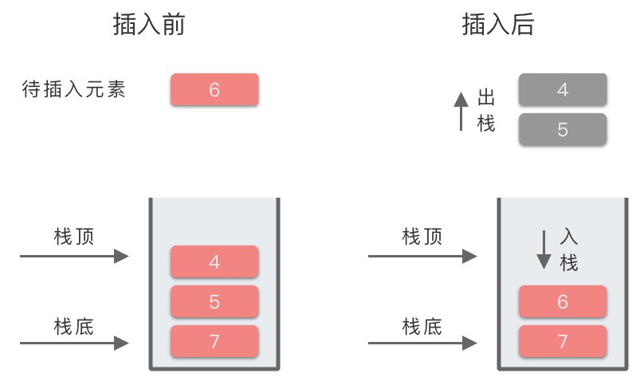
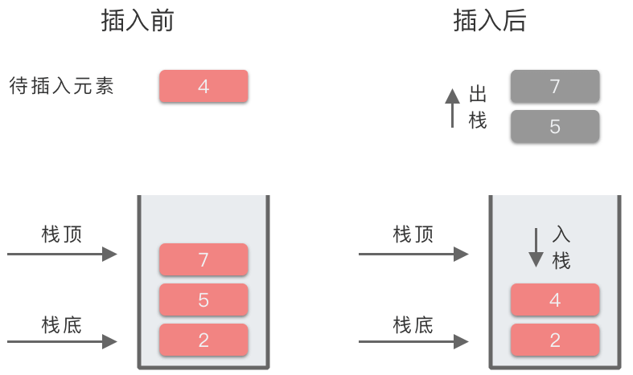

# 5.单调栈

## 1.单调栈简介

> **单调栈（Monotone Stack）**：一种特殊的栈。在栈的「先进后出」规则基础上，**要求「从 栈顶 到 栈底 的元素是单调递增（或者单调递减）」**。其中满足从栈顶到栈底的元素是单调递增的栈，叫做「单调递增栈」。满足从栈顶到栈底的元素是单调递减的栈，叫做「单调递减栈」。

注意：这里定义的顺序是从「栈顶」到「栈底」。有的文章里是反过来的。本文全文以「栈顶」到「栈底」的顺序为基准来描述单调栈。

### 1.1 单调递增栈

> **单调递增栈**：**只有比栈顶元素小的元素才能直接进栈**，否则需要先将栈中比当前元素小的元素出栈，再将当前元素入栈。

这样就保证了：栈中保留的都是比当前入栈元素大的值，并且从栈顶到栈底的元素值是单调递增的。

单调递增栈的入栈、出栈过程如下：

-   假设当前进栈元素为 `x`，如果 `x` 比栈顶元素小，则直接入栈。
-   否则从栈顶开始遍历栈中元素，把小于 `x` 或者等于 `x` 的元素弹出栈，直到遇到一个大于 `x` 的元素为止，然后再把 `x` 压入栈中。

下面我们以数组 `[2, 7, 5, 4, 6, 3, 4, 2]` 为例，模拟一下「单调递增栈」的进栈、出栈过程。具体过程如下：

-   数组元素：`[2, 7, 5, 4, 6, 3, 4, 2]`，遍历顺序为从左到右。

| 第 i 步 | 待插入元素 | 操 作            | 结 果（左侧为栈底）    | 作 用                    |
| ----- | ----- | -------------- | ------------- | ---------------------- |
| 1     | 2     | 2 入栈           | \[2]          | 元素 2 的左侧无比 2 大的元素      |
| 2     | 7     | 2 出栈，7 入栈      | \[7]          | 元素 7 的左侧无比 7 大的元素      |
| 3     | 5     | 5 入栈           | \[7, 5]       | 元素 5 的左侧第一个比 5 大的元素为：7 |
| 4     | 4     | 4 入栈           | \[7, 5, 4]    | 元素 4 的左侧第一个比 4 大的元素为：5 |
| 5     | 6     | 4 出栈，5 出栈，6 入栈 | \[7, 6]       | 元素 6 的左侧第一个比 6 大的元素为：7 |
| 6     | 3     | 3 入栈           | \[7, 6, 3]    | 元素 3 的左侧第一个比 3 大的元素为：6 |
| 7     | 4     | 3 出栈，4 入栈      | \[7, 6, 4]    | 元素 4 的左侧第一个比 4 大的元素为：6 |
| 8     | 2     | 2 入栈           | \[7, 6, 4, 2] | 元素 2 的左侧第一个比 2 大的元素为：4 |

最终栈中元素为 `[7, 6, 4, 2]`。因为从栈顶（右端）到栈底（左侧）元素的顺序为 `2, 4, 6, 7`，满足递增关系，所以这是一个单调递增栈。

以上述过程第 5 步为例，所对应的图示过程为：



### 1.2 单调递减栈

> **单调递减栈**：**只有比栈顶元素大的元素才能直接进栈**，否则需要先将栈中比当前元素大的元素出栈，再将当前元素入栈。

这样就保证了：栈中保留的都是比当前入栈元素小的值，并且从栈顶到栈底的元素值是单调递减的。

单调递减栈的入栈、出栈过程如下：

-   假设当前进栈元素为 `x`，如果 `x` 比栈顶元素大，则直接入栈。
-   否则从栈顶开始遍历栈中元素，把大于 `x` 或者等于 `x` 的元素弹出栈，直到遇到一个小于 `x` 的元素为止，然后再把 `x` 压入栈中。

下面我们以数组 `[4, 3, 2, 5, 7, 4, 6, 8]` 为例，模拟一下「单调递减栈」的进栈、出栈过程。具体过程如下：

-   数组元素：`[4, 3, 2, 5, 7, 4, 6, 8]`，遍历顺序为从左到右。

| 第 i 步 | 待插入元素 | 操 作            | 结 果（左侧为栈底）    | 作用                     |
| ----- | ----- | -------------- | ------------- | ---------------------- |
| 1     | 4     | 4 入栈           | \[4]          | 元素 4 的左侧无比 4 小的元素      |
| 2     | 3     | 4 出栈，3 入栈      | \[3]          | 元素 3 的左侧无比 3 小的元素      |
| 3     | 2     | 3 出栈，2 入栈      | \[2]          | 元素 2 的左侧无比 2 小的元素      |
| 4     | 5     | 5 入栈           | \[2, 5]       | 元素 5 的左侧第一个比 5 小的元素是：2 |
| 5     | 7     | 7 入栈           | \[2, 5, 7]    | 元素 7 的左侧第一个比 7 小的元素是：5 |
| 6     | 4     | 7 出栈，5 出栈，4 入栈 | \[2, 4]       | 元素 4 的左侧第一个比 4 小的元素是：2 |
| 7     | 6     | 6 入栈           | \[2, 4, 6]    | 元素 6 的左侧第一个比 6 小的元素是：4 |
| 8     | 8     | 8 入栈           | \[2, 4, 6, 8] | 元素 8 的左侧第一个比 8 小的元素是：6 |

最终栈中元素为 `[2, 4, 6, 8]`。因为从栈顶（右端）到栈底（左侧）元素的顺序为 `8, 6, 4, 2`，满足递减关系，所以这是一个单调递减栈。

以上述过程第 6 步为例，所对应的图示过程为：



## 2.单调栈的适用场景

单调栈可以在时间复杂度为 $O(n)$ 的情况下，求解出某个元素左边或者右边第一个比它大或者小的元素。

所以单调栈一般用于解决一下几种问题：

-   **寻找左侧第一个比当前元素大的元素**。
-   **寻找左侧第一个比当前元素小的元素**。
-   **寻找右侧第一个比当前元素大的元素**。
-   **寻找右侧第一个比当前元素小的元素**。

下面分别说一下这几种问题的求解方法。

### 2.1 寻找左侧第一个比当前元素大的元素

从左到右遍历元素，构造**单调递增栈**（从栈顶到栈底递增）：

-   一个元素左侧第一个比它大的元素就是将其「插入单调递增栈」时的栈顶元素。
-   如果插入时的栈为空，则说明左侧不存在比当前元素大的元素。

### 2.2 寻找左侧第一个比当前元素小的元素

从左到右遍历元素，构造**单调递减栈**（从栈顶到栈底递减）：

-   一个元素左侧第一个比它小的元素就是将其「插入单调递减栈」时的栈顶元素。
-   如果插入时的栈为空，则说明左侧不存在比当前元素小的元素。

### 2.3 寻找右侧第一个比当前元素大的元素

从左到右遍历元素，构造**单调递增栈**（从栈顶到栈底递增）：

-   一个元素右侧第一个比它大的元素就是将其「弹出单调递增栈」时即将插入的元素。
-   如果该元素没有被弹出栈，则说明右侧不存在比当前元素大的元素。

从右到左遍历元素，构造**单调递增栈**（从栈顶到栈底递增）：

-   一个元素右侧第一个比它大的元素就是将其「插入单调递增栈」时的栈顶元素。
-   如果插入时的栈为空，则说明右侧不存在比当前元素大的元素。

### 2.4 寻找右侧第一个比当前元素小的元素

从左到右遍历元素，构造**单调递减栈**（从栈顶到栈底递减）：

-   一个元素右侧第一个比它小的元素就是将其「弹出单调递减栈」时即将插入的元素。
-   如果该元素没有被弹出栈，则说明右侧不存在比当前元素小的元素。

从右到左遍历元素，构造**单调递减栈**（从栈顶到栈底递减）：

-   一个元素右侧第一个比它小的元素就是将其「插入单调递减栈」时的栈顶元素。
-   如果插入时的栈为空，则说明右侧不存在比当前元素小的元素。

上边的分类解法有点绕口，可以简单记为以下条规则：

-   无论哪种题型，都建议从左到右遍历元素。
-   查找 **「比当前元素大的元素」** 就用 **单调递增栈**，查找 **「比当前元素小的元素」** 就用 **单调递减栈**。
-   从 **「左侧」** 查找就看 **「插入栈」** 时的栈顶元素，从 **「右侧」** 查找就看 **「弹出栈」** 时即将插入的元素。

## 3. 单调栈模板

以从左到右遍历元素为例，介绍一下构造单调递增栈和单调递减栈的模板。

### 3.1 单调递增栈模板

```python
def monotoneIncreasingStack(nums):
    stack = []
    for num in nums:
        while stack and num >= stack[-1]:
            stack.pop()
        stack.append(num)
```

### 3.2 单调递减栈模板

```python
def monotoneDecreasingStack(nums):
    stack = []
    for num in nums:
        while stack and num <= stack[-1]:
            stack.pop()
        stack.append(num)
```

## 4.单调栈应用

### 4.1 下一个更大元素Ⅰ

[496. 下一个更大元素 I - 力扣（LeetCode）](https://leetcode.cn/problems/next-greater-element-i/description/ "496. 下一个更大元素 I - 力扣（LeetCode）")

```python
nums1 中数字 x 的 下一个更大元素 是指 x 在 nums2 中对应位置 右侧 的 第一个 比 x 大的元素。

给你两个 没有重复元素 的数组 nums1 和 nums2 ，下标从 0 开始计数，其中nums1 是 nums2 的子集。

对于每个 0 <= i < nums1.length ，找出满足 nums1[i] == nums2[j] 的下标 j ，并且在 nums2 确定 nums2[j] 的 下一个更大元素 。如果不存在下一个更大元素，那么本次查询的答案是 -1 。

返回一个长度为 nums1.length 的数组 ans 作为答案，满足 ans[i] 是如上所述的 下一个更大元素 。

 

示例 1：

输入：nums1 = [4,1,2], nums2 = [1,3,4,2].
输出：[-1,3,-1]
解释：nums1 中每个值的下一个更大元素如下所述：
- 4 ，用加粗斜体标识，nums2 = [1,3, 4 ,2]。不存在下一个更大元素，所以答案是 -1 。
- 1 ，用加粗斜体标识，nums2 = [ 1 ,3,4,2]。下一个更大元素是 3 。
- 2 ，用加粗斜体标识，nums2 = [1,3,4, 2 ]。不存在下一个更大元素，所以答案是 -1 。
```

第一种思路是根据题意直接暴力求解。遍历 `nums1` 中的每一个元素。对于 `nums1` 的每一个元素 `nums1[i]`，再遍历一遍 `nums2`，查找 `nums2` 中对应位置右边第一个比 `nums1[i]` 大的元素。这种解法的时间复杂度是 $O(n^2)$。

第二种思路是使用单调递增栈。因为 `nums1` 是 `nums2` 的子集，所以**可以先遍历一遍 ****`nums2`****，并构造单调递增栈**，求出 `nums2` 中每个元素右侧下一个更大的元素。然后将其存储到哈希表中。然后再遍历一遍 `nums1`，从哈希表中取出对应结果，存放到答案数组中。这种解法的时间复杂度是 $O(n)$。具体做法如下：

-   使用数组 `res` 存放答案。使用 `stack` 表示单调递增栈。使用哈希表 `num_map` 用于存储 `nums2` 中下一个比当前元素大的数值，映射关系为 `当前元素值：下一个比当前元素大的数值`。
-   遍历数组 `nums2`，对于当前元素：
    -   如果当前元素值较小，则直接让当前元素值入栈。
    -   如果当前元素值较大，则一直出栈，直到当前元素值小于栈顶元素。
        -   出栈时，出栈元素是第一个大于当前元素值的元素。则将其映射到 `num_map` 中。
-   遍历完数组 `nums2`，建立好所有元素下一个更大元素的映射关系之后，再遍历数组 `nums1`。
-   从 `num_map` 中取出对应的值，将其加入到答案数组中。
-   最终输出答案数组 `res`。

```c++
class Solution {
public:
    vector<int> nextGreaterElement(vector<int>& nums1, vector<int>& nums2) {
        std::vector<int> ans;
        std::stack<int> stk;
        std::unordered_map<int, int> map;

        for (int i = nums2.size() - 1; i>= 0; i--) {
            int num = nums2[i];
            while (!stk.empty() && (num >= stk.top())) {
                stk.pop();
            }
            map[num] = stk.empty() ? -1 : stk.top();
            stk.push(num);
        }

        for (auto& n : nums1) {
            ans.push_back(map[n]);
        }

        return ans;
    }
};
```

### 4.2 每日温度

[739. 每日温度 - 力扣（LeetCode）](https://leetcode.cn/problems/daily-temperatures/description/ "739. 每日温度 - 力扣（LeetCode）")

```python
给定一个整数数组 temperatures ，表示每天的温度，返回一个数组 answer ，其中 answer[i] 是指对于第 i 天，下一个更高温度出现在几天后。如果气温在这之后都不会升高，请在该位置用 0 来代替。

 

示例 1:

输入: temperatures = [73,74,75,71,69,72,76,73]
输出: [1,1,4,2,1,1,0,0]
```

单调栈

1.  首先，将答案数组 `ans` 全部赋值为 0。然后遍历数组每个位置元素。
2.  如果栈为空，则将当前元素的下标入栈。
3.  如果栈不为空，且当前数字大于栈顶元素对应数字，则栈顶元素出栈，并计算下标差。
4.  此时当前元素就是栈顶元素的下一个更高值，将其下标差存入答案数组 `ans` 中保存起来，判断栈顶元素。
5.  直到当前数字小于或等于栈顶元素，则停止出栈，将当前元素下标入栈。
6.  最后输出答案数组 `ans`。

```c++
class Solution {
public:
    // 1.暴力解法
    vector<int> dailyTemperatures1(vector<int>& temperatures) {
        int n = temperatures.size();
        std::vector<int> ans(n);
        // 记录每个温度第一次出现的下标
        std::vector<int> next(101, INT_MAX);

        // 反向遍历
        for (int i = n - 1; i >= 0; i--) {
            int warmer_idx = INT_MAX;
            // 对于每个元素 temperatures[i]，在数组 next 中找到从 
            // temperatures[i] + 1 到 100 中每个温度第一次出现的下标
            // warmer_index 为下一次温度比当天高的下标
            for (int t = temperatures[i] + 1; t <= 100; t++) {
                warmer_idx = std::min(warmer_idx, next[t]);
            }

            if (warmer_idx != INT_MAX) {
                ans[i] = warmer_idx - i;
            }

            next[temperatures[i]] = i;
        }

        return ans;
    }

    // 2.单调栈
    vector<int> dailyTemperatures(vector<int>& temperatures) {
        int n = temperatures.size();
        std::vector<int> ans(n);
        std::stack<int> stk;

        for (int i = 0; i < n; i++) {
            while (!stk.empty() && temperatures[i] > temperatures[stk.top()]) {
                int previous_idx = stk.top();
                ans[previous_idx] = i - previous_idx;
                stk.pop();
            }
            stk.push(i);
        }

        return ans;
    }
};
```

### 4.3 去除重复元素

[316. 去除重复字母 - 力扣（LeetCode）](https://leetcode.cn/problems/remove-duplicate-letters/description/ "316. 去除重复字母 - 力扣（LeetCode）")

```python
给你一个字符串 s ，请你去除字符串中重复的字母，使得每个字母只出现一次。需保证 返回结果的字典序最小（要求不能打乱其他字符的相对位置）。


示例 1：

输入：s = "bcabc"
输出："abc"
```

针对题目的三个要求：去重、不能打乱其他字符顺序、字典序最小。我们来一一分析。

1.  **去重**：可以通过 **「使用哈希表存储字母出现次数」** 的方式，将每个字母出现的次数统计起来，再遍历一遍，去除重复的字母。
2.  **不能打乱其他字符顺序**：按顺序遍历，将非重复的字母存储到答案数组或者栈中，最后再拼接起来，就能保证不打乱其他字符顺序。
3.  **字典序最小**：意味着字典序小的字母应该尽可能放在前面。
    1.  对于第 `i` 个字符 `s[i]` 而言，如果第 `0` \~ `i - 1` 之间的某个字符 `s[j]` 在 `s[i]` 之后不再出现了，那么 `s[j]` 必须放到 `s[i]` 之前。
    2.  而如果 `s[j]` 在之后还会出现，并且 `s[j]` 的字典序大于 `s[i]`，我们则可以先舍弃 `s[j]`，把 `s[i]` 尽可能的放到前面。后边再考虑使用 `s[j]` 所对应的字符。

要满足第 3 条需求，可以使用 **「单调栈」** 来解决。使用单调栈存储 `s[i]` 之前出现的非重复、并且字典序最小的字符序列。整个算法步骤如下：

1.  先遍历一遍字符串，用哈希表 `letter_counts` 统计出每个字母出现的次数。
2.  然后使用单调递减栈保存当前字符之前出现的非重复、并且字典序最小的字符序列。
3.  当遍历到 `s[i]` 时，如果 `s[i]` 没有在栈中出现过：
    1.  比较 `s[i]` 和栈顶元素 `stack[-1]` 的字典序。如果 `s[i]` 的字典序小于栈顶元素 `stack[-1]`，并且栈顶元素之后的出现次数大于 `0`，则将栈顶元素弹出。
    2.  然后继续判断 `s[i]` 和栈顶元素 `stack[-1]`，并且知道栈顶元素出现次数为 `0` 时停止弹出。此时将 `s[i]` 添加到单调栈中。
4.  从哈希表 `letter_counts` 中减去 `s[i]` 出现的次数，继续遍历。
5.  最后将单调栈中的字符依次拼接为答案字符串，并返回。

```c++
class Solution {
public:
    string removeDuplicateLetters(string s) {
        std::vector<char> stk;
        std::unordered_map<char, int> letter_counts;
        // 统计各单词出现的频率
        for (auto& ch : s) {
            letter_counts[ch]++;
        }

        for (auto& ch : s) {
            if (!count(stk.begin(), stk.end(), ch)) {
                while (!stk.empty() && ch < stk.back() && letter_counts[stk.back()] > 0) {
                    stk.pop_back();
                }
                stk.push_back(ch);
            }
            letter_counts[ch]--;
        }

        std::string ans(stk.begin(), stk.end());

        return ans;
    }
};
```
