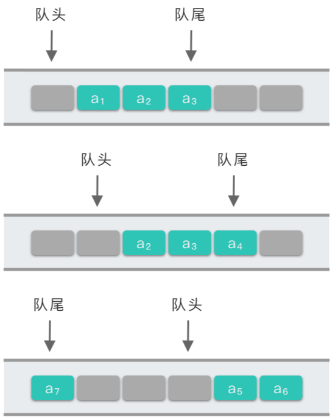

# 7.队列

## 1.队列

### 1.1 队列定义

> **队列（Queue）**：一种线性表数据结构，是一种只允许在表的一端进行插入操作，而在表的另一端进行删除操作的线性表。

把队列中允许插入的一端称为 **「队尾（rear）」**；把允许删除的另一端称为 **「队头（front）」**。当表中没有任何数据元素时，称之为 **「空队」**。

队列有两种基本操作：**「插入操作」** 和 **「删除操作」**。

-   队列的插入操作又称为「入队」。
-   队列的删除操作又称为「出队」。


简单来说，队列是一种 **「先进先出（First In First Out）」** 的线性表，简称为 **「FIFO 结构」**。

可以从两个方面来解释一下队列的定义：

-   第一个方面是 **「线性表」**。
-   第二个方面是 **「先进先出原则」**。

### 1.2 队列基本操作

-   **初始化空队列**：创建一个空队列，定义队列的大小 `size`，以及队头元素指针 `front`，队尾指针 `rear`。
-   **判断队列是否为空**：当队列为空时，返回 `True`。当队列不为空时，返回 `False`。一般只用于「出队操作」和「获取队头元素操作」中。
-   **判断队列是否已满**：当队列已满时，返回 `True`，当队列未满时，返回 `False`。一般只用于顺序队列中插入元素操作中。
-   **插入元素（入队）**：相当于在线性表最后一个数据元素后面插入一个新的数据元素。并改变队尾指针 `rear` 的指向位置。
-   **删除元素（出队）**：相当于在线性表中删除第一个数据元素。并改变队头指针 `front` 的指向位置。
-   **获取队头元素**：相当于获取线性表中第一个数据元素。与插入元素（入队）、删除元素（出队）不同的是，该操作并不改变队头指针 `front` 的指向位置。
-   **获取队尾元素**：相当于获取线性表中最后一个数据元素。与插入元素（入队）、删除元素（出队）不同的是，该操作并不改变队尾指针 `rear` 的指向位置。

## 2.队列实现

和线性表类似，队列有两种存储表示方法：**「顺序存储的队列」** 和 **「链式存储的队列」**。

-   **「****顺序存储的队列****」**：利用一组地址连续的存储单元依次存放队列中从队头到队尾的元素，同时使用指针 `front` 指向队头元素在队列中的位置，使用指针 `rear` 指示队尾元素在队列中的位置。
-   **「****链式存储的队列****」**：利用单链表的方式来实现队列。队列中元素按照插入顺序依次插入到链表的第一个节点之后，并使用队头指针 `front` 指向链表头节点位置，也就是队头元素，`rear` 指向链表尾部位置，也就是队尾元素。

注意：`front` 和 `rear` 的指向位置并不完全固定。有时候算法设计上的方便以及代码简洁，也会使 `front` 指向队头元素所在位置的前一个位置。`rear` 也可能指向队尾元素在队列位置的下一个位置。具体还是要看算法是如何实现的。

### 2.1 队列顺序存储实现

队头指针 `self.front` 指向队头元素所在位置的前一个位置，而队尾指针 `self.rear` 指向队尾元素所在位置。

-   **初始化空队列**：创建一个空队列 `self.queue`，定义队列大小 `self.size`。令队头指针 `self.front` 和队尾指针 `self.rear` 都指向 `-1`。即 `self.front = self.rear = -1`。
-   **判断队列是否为空**：根据 `self.front` 和 `self.rear` 的指向位置关系进行判断。如果队头指针 `self.front` 和队尾指针 `self.rear` 相等，则说明队列为空。否则，队列不为空。
-   **判断队列是否已满**：如果 `self.rear` 指向队列最后一个位置，即 `self.rear == self.size - 1`，则说明队列已满。否则，队列未满。
-   **插入元素（入队）**：先判断队列是否已满，已满直接抛出异常。如果队列不满，则将队尾指针 `self.rear` 向右移动一位，并进行赋值操作。此时 `self.rear` 指向队尾元素。
-   **删除元素（出队）**：先判断队列是否为空，为空直接抛出异常。如果队列不为空，则将队头指针 `self.front` 指向元素赋值为 `None`，并将 `self.front` 向右移动一位。
-   **获取队头元素**：先判断队列是否为空，为空直接抛出异常。如果队列不为空，因为 `self.front` 指向队头元素所在位置的前一个位置，所以队头元素在 `self.front` 后面一个位置上，返回 `self.queue[self.front + 1]`。
-   **获取队尾元素**：先判断队列是否为空，为空直接抛出异常。如果不为空，因为 `self.rear` 指向队尾元素所在位置，所以直接返回 `self.queue[self.rear]`。

```python
class Queue:
    """ 顺序队列实现
    """
    def __init__(self, size=100) -> None:
        """ 初始化空队列
        """
        self.size = size
        self.queue = [None for _ in range(size)]
        self.front = -1
        self.rear = -1

    def is_empty(self):
        """ 判断队列是否为空
        """
        return self.front == self.rear
    
    def is_full(self):
        """ 判断队列是否已满
        """
        return self.rear + 1 == self.size
    
    def enqueue(self, value) :
        """ 入队操作
        """
        if self.is_full():
            raise Exception('Queue is full')
        else:
            self.rear += 1
            self.queue[self.rear] = value
    
    def dequeue(self):
        """ 出队操作
        """
        if self.is_empty():
            raise Exception('Queue is empty')
        else:
            self.front += 1
            return self.queue[self.front]
        
    def front_value(self):
        """ 获取队头元素
        """
        if self.is_empty():
            raise Exception('Queue is empty')
        else:
            return self.queue[self.front + 1]
    
    def rear_value(self):
        """ 获取队尾元素
        """
        if self.is_empty():
            raise Exception('Queue is empty')
        else:
            return self.queue[self.rear]
```

### 2.2 循环队列的顺序存储实现

在「2.1 队列的顺序存储实现」中，如果队列中第 `0` \~ `size - 1` 位置均被队列元素占用时，此时队列已满（即 `self.rear == self.size - 1`），再进行入队操作就会抛出队列已满的异常。

可以将队列想象成为**头尾相连的循环表，利用数学中的求模运算，使得空间得以重复利用**，这样就解决了问题。

在进行插入操作时，如果队列的第 `self.size - 1` 个位置被占用之后，只要队列前面还有可用空间，新的元素加入队列时就可以从第 `0` 个位置开始继续插入。

我们约定：`self.size` 为循环队列的最大元素个数。队头指针 `self.front` 指向队头元素所在位置的前一个位置，而队尾指针 `self.rear` 指向队尾元素所在位置。则：

1.  **插入元素（入队）时**：队尾指针循环前进 `1` 个位置，即 `self.rear = (self.rear + 1) % self.size`。
2.  **删除元素（出队）时**：队头指针循环前进 `1` 个位置，即 `self.front = (self.front + 1) % self.size`。

> **注意**：
> \- 循环队列在一开始初始化，队列为空时，满足条件`self.front == self.rear`。
> \- 而当充满队列后，仍满足条件 `self.front == self.rear`。
> 这种情况下就无法判断「队列为空」还是「队列为满」了。

为了区分循环队列中「队列为空」还是「队列已满」的情况，有多种处理方式：

-   **方式 1**：增加表示队列中元素个数的变量 `self.count`，用来以区分队列已满还是队列为空。在入队、出队过程中不断更新元素个数 `self.count` 的值。
    -   队列已满条件为：队列中元素个数等于队列整体容量，即 `self.count == self.size`。
    -   队空为空条件为：队列中元素个数等于 `0`，即 `self.count == 0`。
-   **方式 2**：增加标记变量 `self.tag`，用来以区分队列已满还是队列为空。
    -   队列已满条件为：`self.tag == 1` 的情况下，因插入导致 `self.front == self.rear`。
    -   队列为空条件为：在 `self.tag == 0` 的情况下，因删除导致 `self.front == self.rear`。
-   **方式 3**：特意空出来一个位置用于区分队列已满还是队列为空。入队时少用一个队列单元，即约定以「队头指针在队尾指针的下一位置」作为队满的标志。
    -   队列已满条件为：队头指针在队尾指针的下一位置，即 `(self.rear + 1) % self.size == self.front`。
    -   队列为空条件为：队头指针等于队尾指针，即 `self.front == self.rear`。



使用「方式 3」处理队列已满，实现循环队列：

-   **初始化空队列**：创建一个空队列，定义队列大小为 `self.size + 1`。令队头指针 `self.front` 和队尾指针 `self.rear` 都指向 `0`。即 `self.front = self.rear = 0`。
-   **判断队列是否为空**：根据 `self.front` 和 `self.rear` 的指向位置进行判断。根据约定，如果队头指针 `self.front` 和队尾指针 `self.rear` 相等，则说明队列为空。否则，队列不为空。
-   **判断队列是否已满**：队头指针在队尾指针的下一位置，即 `(self.rear + 1) % self.size == self.front`，则说明队列已满。否则，队列未满。
-   **插入元素（入队）**：先判断队列是否已满，已满直接抛出异常。如果不满，则将队尾指针 `self.rear` 向右循环移动一位，并进行赋值操作。此时 `self.rear` 指向队尾元素。
-   **删除元素（出队）**：先判断队列是否为空，为空直接抛出异常。如果不为空，则将队头指针 `self.front` 指向元素赋值为 `None`，并将 `self.front` 向右循环移动一位。
-   **获取队头元素**：先判断队列是否为空，为空直接抛出异常。如果不为空，因为 `self.front` 指向队头元素所在位置的前一个位置，所以队头元素在 `self.front` 后一个位置上，返回 `self.queue[(self.front + 1) % self.size]`。
-   **获取队尾元素**：先判断队列是否为空，为空直接抛出异常。如果不为空，因为 `self.rear` 指向队尾元素所在位置，所以直接返回 `self.queue[self.rear]`。

```python
class Queue:
    """ 循环队列顺序实现
    """
    def __init__(self, size=100) -> None:
        """ 初始化空队列
        """
        self.size = size + 1
        self.queue = [None for _ in range(size + 1)]
        self.front = 0
        self.rear = 0

    def is_empty(self):
        """ 判断队列是否为空
        """
        return (self.front + 1) % self.size == self.rear
    
    def is_full(self):
        """ 判断队列是否已满
        """
        return self.rear + 1 == self.size
    
    def enqueue(self, value) :
        """ 入队操作
        """
        if self.is_full():
            raise Exception('Queue is full')
        else:
            self.rear = (self.rear + 1) % self.size
            self.queue[self.rear] = value
    
    def dequeue(self):
        """ 出队操作
        """
        if self.is_empty():
            raise Exception('Queue is empty')
        else:
            self.queue[self.front] = None
            self.front = (self.front + 1) % self.size
            return self.queue[self.front]
        
    def front_value(self):
        """ 获取队头元素
        """
        if self.is_empty():
            raise Exception('Queue is empty')
        else:
            value = self.queue[(self.front + 1) % self.size]
            return value
    
    def rear_value(self):
        """ 获取队尾元素
        """
        if self.is_empty():
            raise Exception('Queue is empty')
        else:
            value = self.queue[self.rear]
            return value

```

### 2.3 队列的链式实现

对于在使用过程中数据元素变动较大，或者说频繁进行插入和删除操作的数据结构来说，采用链式存储结构比顺序存储结构更加合适。

所以可以采用链式存储结构来实现队列。

1.  用一个线性链表来表示队列，队列中的每一个元素对应链表中的一个链节点。
2.  再把线性链表的第 `1` 个节点定义为队头指针 `front`，在链表最后的链节点建立指针 `rear` 作为队尾指针。
3.  最后限定只能在链表队头进行删除操作，在链表队尾进行插入操作，这样整个线性链表就构成了一个队列。


队头指针 `self.front` 指向队头元素所在位置的前一个位置，而队尾指针 `self.rear` 指向队尾元素所在位置。

-   **初始化空队列**：建立一个链表头节点 `self.head`，令队头指针 `self.front` 和队尾指针 `self.rear` 都指向 `head`。即 `self.front = self.rear = head`。
-   **判断队列是否为空**：根据 `self.front` 和 `self.rear` 的指向位置进行判断。根据约定，如果队头指针 `self.front` 等于队尾指针 `self.rear`，则说明队列为空。否则，队列不为空。
-   **插入元素（入队）**：创建值为 `value` 的链表节点，插入到链表末尾，并令队尾指针 `self.rear` 沿着链表移动 `1` 位到链表末尾。此时 `self.rear` 指向队尾元素。
-   **删除元素（出队）**：先判断队列是否为空，为空直接抛出异常。如果不为空，则获取队头指针 `self.front` 下一个位置节点上的值，并将 `self.front` 沿着链表移动 `1` 位。如果 `self.front` 下一个位置是 `self.rear`，则说明队列为空，此时，将 `self.rear` 赋值为 `self.front`，令其相等。
-   **获取队头元素**：先判断队列是否为空，为空直接抛出异常。如果不为空，因为 `self.front` 指向队头元素所在位置的前一个位置，所以队头元素在 `self.front` 后一个位置上，返回 `self.front.next.value`。
-   **获取队尾元素**：先判断队列是否为空，为空直接抛出异常。如果不为空，因为 `self.rear` 指向队尾元素所在位置，所以直接返回 `self.rear.value`。

```python
class Node:
    def __init__(self, value):
        self.value = value
        self.next = None

class Queue:
    """ 顺序队列实现
    """
    def __init__(self) -> None:
        """ 初始化空队列
        """
        head = None(0)
        self.front = head
        self.rear = head

    def is_empty(self):
        """ 判断队列是否为空
        """
        return self.front == self.rear
    
    def enqueue(self, value) :
        """ 入队操作
        """
        node = Node(value)
        self.rear.next = node
        self.rear = node
    
    def dequeue(self):
        """ 出队操作
        """
        if self.is_empty():
            raise Exception('Queue is empty')
        else:
            node = self.front.next
            self.front.next = node.next
            if self.rear == node:
                self.rear = self.front
            value = node.value
            del node
            return value
        
    def front_value(self):
        """ 获取队头元素
        """
        if self.is_empty():
            raise Exception('Queue is empty')
        else:
            return self.front.next.value
    
    def rear_value(self):
        """ 获取队尾元素
        """
        if self.is_empty():
            raise Exception('Queue is empty')
        else:
            return self.rear.value
```

## 3.实战题目

### 3.1 设计循环队列

[622. 设计循环队列 - 力扣（LeetCode）](https://leetcode.cn/problems/design-circular-queue/ "622. 设计循环队列 - 力扣（LeetCode）")

```python
设计你的循环队列实现。 循环队列是一种线性数据结构，其操作表现基于 FIFO（先进先出）原则并且队尾被连接在队首之后以形成一个循环。它也被称为“环形缓冲器”。

循环队列的一个好处是我们可以利用这个队列之前用过的空间。在一个普通队列里，一旦一个队列满了，我们就不能插入下一个元素，即使在队列前面仍有空间。但是使用循环队列，我们能使用这些空间去存储新的值。

你的实现应该支持如下操作：

- MyCircularQueue(k): 构造器，设置队列长度为 k 。
- Front: 从队首获取元素。如果队列为空，返回 -1 。
- Rear: 获取队尾元素。如果队列为空，返回 -1 。
- enQueue(value): 向循环队列插入一个元素。如果成功插入则返回真。
- deQueue(): 从循环队列中删除一个元素。如果成功删除则返回真。
- isEmpty(): 检查循环队列是否为空。
- isFull(): 检查循环队列是否已满。
```

```c++
class MyCircularQueue {
public:
    MyCircularQueue(int k) {
        m_size = k + 1;
        m_front = 0;
        m_rear = 0;
        m_queue.resize(k + 1);
    }
    
    bool enQueue(int value) {
        if (this->isFull()) {
            return false;
        } else {
            this->m_rear = (this->m_rear + 1) % this->m_size;
            this->m_queue[this->m_rear] = value;
            return true;
        }
    }
    
    bool deQueue() {
        if (this->isEmpty()) {
            return false;
        } else {
            // this->m_queue[this->m_front] = 0;
            this->m_front = (this->m_front + 1) % this->m_size;
            return true;
        }
    }
    
    int Front() {
        if (this->isEmpty()) {
            return -1;
        } else {
            int value = this->m_queue[(this->m_front + 1) % this->m_size];
            return value;
        }
    }
    
    int Rear() {
        if (this->isEmpty()) {
            return -1;
        } else {
            int value = this->m_queue[this->m_rear];
            return value;
        }
    }
    
    bool isEmpty() {
        return this->m_front== this->m_rear;
    }
    
    bool isFull() {
        return (this->m_rear + 1) % this->m_size == this->m_front;
    }
private:
    int m_size;
    std::vector<int> m_queue;
    int m_front;
    int m_rear;
};
```

### 3.2 数据流中的移动平均值

[LCR 041. 数据流中的移动平均值 - 力扣（LeetCode）](https://leetcode.cn/problems/qIsx9U/ "LCR 041. 数据流中的移动平均值 - 力扣（LeetCode）")

```python
给定一个窗口大小和一个整数数据流，根据该滑动窗口的大小，计算滑动窗口里所有数字的平均值。

实现 MovingAverage 类：

- MovingAverage(int size) 用窗口大小 size 初始化对象。
- double next(int val) 成员函数 next 每次调用的时候都会往滑动窗口增加一个整数，请计算并返回数据流中最后 size 个值的移动平均值，即滑动窗口里所有数字的平均值。
 

示例：

输入：
inputs = ["MovingAverage", "next", "next", "next", "next"]
inputs = [[3], [1], [10], [3], [5]]
输出：
[null, 1.0, 5.5, 4.66667, 6.0]

解释：
MovingAverage movingAverage = new MovingAverage(3);
movingAverage.next(1); // 返回 1.0 = 1 / 1
movingAverage.next(10); // 返回 5.5 = (1 + 10) / 2
movingAverage.next(3); // 返回 4.66667 = (1 + 10 + 3) / 3
movingAverage.next(5); // 返回 6.0 = (10 + 3 + 5) / 3
```

1.  使用队列保存滑动窗口的元素，并记录对应窗口大小和元素和。
2.  当队列长度小于窗口大小的时候，直接向队列中添加元素，并记录当前窗口中的元素和。
3.  当队列长度等于窗口大小的时候，先将队列头部元素弹出，再添加元素，并记录当前窗口中的元素和。
4.  然后根据元素和和队列中元素个数计算出平均值。

```c++
class MovingAverage {
public:
    /** Initialize your data structure here. */
    MovingAverage(int size) {
        m_size = size;
        m_sum = 0.0;
    }
    
    double next(int val) {
        if (m_queue.size() < m_size) {
            m_queue.push(val);
        } else {
            if (!m_queue.empty()) {
                m_sum -= m_queue.front();
                m_queue.pop();
            }
            m_queue.push(val);
        }
        m_sum += val;

        return m_sum / m_queue.size();
    }
private:
    std::queue<int> m_queue;
    int m_size;
    double m_sum;
};
```

### 3.3 用队列实现栈

[225. 用队列实现栈 - 力扣（LeetCode）](https://leetcode.cn/problems/implement-stack-using-queues/description/ "225. 用队列实现栈 - 力扣（LeetCode）")

```python
请你仅使用两个队列实现一个后入先出（LIFO）的栈，并支持普通栈的全部四种操作（push、top、pop 和 empty）。

实现 MyStack 类：

- void push(int x) 将元素 x 压入栈顶。
- int pop() 移除并返回栈顶元素。
- int top() 返回栈顶元素。
- boolean empty() 如果栈是空的，返回 true ；否则，返回 false 。
 

注意：

- 你只能使用队列的基本操作 —— 也就是 push to back、peek/pop from front、size 和 is empty 这些操作。
- 你所使用的语言也许不支持队列。 你可以使用 list （列表）或者 deque（双端队列）来模拟一个队列 , 只要是标准的队列操作即可。
 

示例：

输入：
["MyStack", "push", "push", "top", "pop", "empty"]
[[], [1], [2], [], [], []]
输出：
[null, null, null, 2, 2, false]

解释：
MyStack myStack = new MyStack();
myStack.push(1);
myStack.push(2);
myStack.top(); // 返回 2
myStack.pop(); // 返回 2
myStack.empty(); // 返回 False
```

使用两个队列。`pushQueue` 用作入栈，`popQueue` 用作出栈。

-   `push` 操作：将新加入的元素压入 `pushQueue` 队列中，并且将之前保存在 `popQueue` 队列中的元素从队头开始依次压入 `pushQueue` 中，此时 `pushQueue` 队列中头节点存放的是新加入的元素，尾部存放的是之前的元素。 而 `popQueue` 则为空。再将 `pushQueue` 和 `popQueue` 相互交换，保持 `pushQueue` 为空，`popQueue` 则用于 `pop`、`top` 等操作。
-   `pop` 操作：直接将 `popQueue` 队头元素取出。
-   `top` 操作：返回 `popQueue` 队头元素。
-   `empty`：判断 `popQueue` 是否为空。

```c++
class MyStack {
public:
    MyStack() {

    }
    
    void push(int x) {
        // 将新加入的元素压入 pushQueue 队列中，
        m_push_queue.push(x);
        // 并且将之前保存在 popQueue 队列中的元素从队头开始依次压入 pushQueue 中，
        // 此时 pushQueue 队列中头节点存放的是新加入的元素，
        // 尾部存放的是之前的元素。 而 popQueue 则为空。
        while (!m_pop_queue.empty()) {
            m_push_queue.push(m_pop_queue.front());
            m_pop_queue.pop();
        }
        // 再将 pushQueue 和 popQueue 相互交换，保持 pushQueue 为空，
        // popQueue 则用于 pop、top 等操作。
        swap(m_push_queue, m_pop_queue);
    }
    
    int pop() {
        int val = m_pop_queue.front();
        m_pop_queue.pop();
        return val;
    }
    
    int top() {
        int val = m_pop_queue.front();
        return val;
    }
    
    bool empty() {
        return m_pop_queue.empty();
    }
private:
    // 入栈
    std::queue<int> m_push_queue;
    // 出栈
    std::queue<int> m_pop_queue;
};
```
