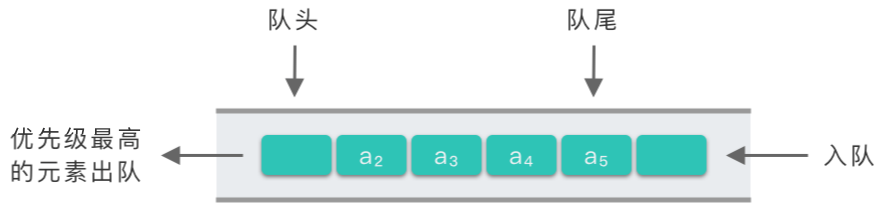

# 8.优先队列

## 1.优先队列

### 1.1 优先队列简介

> **优先队列（Priority Queue）**：一种特殊的队列。在优先队列中，元素被赋予优先级，当访问队列元素时，具有最高优先级的元素最先删除。

优先队列与普通队列最大的不同点在于 **出队顺序**。

-   普通队列的出队顺序跟入队顺序相关，符合「先进先出（First in, First out）」的规则。
-   优先队列的出队顺序跟入队顺序无关，优先队列是按照元素的优先级来决定出队顺序的。优先级高的元素优先出队，优先级低的元素后出队。优先队列符合 **「最高级先出（First in, Largest out）」** 的规则。

优先队列的示例图如下所示。



### 1.2 优先队列的适用场景

优先队列的应用场景非常多，比如：

-   **数据压缩**：赫夫曼编码算法；
-   **最短路径算法**：Dijkstra 算法；
-   **最小生成树算法**：Prim 算法；
-   **任务调度器**：根据优先级执行系统任务；
-   **事件驱动仿真**：顾客排队算法；
-   **排序问题**：查找第 k 个最小元素。

很多语言都提供了优先级队列的实现。比如，Java 的 `PriorityQueue`，C++ 的 `priority_queue` 等。Python 中也可以通过 `heapq` 来实现优先队列。下面我们来讲解一下优先队列的实现。

### 1.3 优先队列实现

优先队列所涉及的基本操作跟普通队列差不多，主要是 **「入队操作」** 和 **「出队操作」**。

而优先队列的实现方式也有很多种，除了使用「数组（顺序存储）实现」与「链表（链式存储）实现」之外，最常用的是使用 \*\*「二叉堆结构实现」\*\*优先队列。以下是三种方案的介绍和总结。

-   **数组（顺序存储）实现优先队列**：入队操作直接插入到数组队尾，时间复杂度为 $O(1)$。出队操作需要遍历整个数组，找到优先级最高的元素，返回并删除该元素，时间复杂度为 $O(n)$。
-   **链表（链式存储）实现优先队列**：链表中的元素按照优先级排序，入队操作需要为待插入元素创建节点，并在链表中找到合适的插入位置，时间复杂度为 $O(n)$。出队操作直接返回链表队头元素，并删除队头元素，时间复杂度为 $O(1)$。
-   **二叉堆结构实现优先队列**：构建一个二叉堆结构，二叉堆按照优先级进行排序。入队操作就是将元素插入到二叉堆中合适位置，时间复杂度为 $O(\log_2 n)$。吹对操作则返回二叉堆中优先级最大节点并删除，时间复杂度也是 $O(\log_2 n)$。

下面是三种结构实现的优先队列入队操作和出队操作的时间复杂度总结。

|    | 入队操作时间复杂度     | 出队操作（取出优先级最高的元素）时间复杂度 |
| -- | ------------- | --------------------- |
| 堆  | $O(\log_2 n)$ | $O(\log_2 n)$         |
| 数组 | $O(1)$        | $O(n)$                |
| 链表 | $O(n)$        | $O(1)$                |

从上面的表格可以看出，使用「二叉堆」这种数据结构来实现优先队列是比较高效的。下面讲解一下二叉堆实现的优先队列。

## 2.二叉堆实现优先队列

### 2.1 二叉堆的定义

二叉堆：符合以下两个条件之一的完全二叉树：

-   大顶堆：根节点值 ≥ 子节点值。
-   小顶堆：根节点值 ≤ 子节点值。

### 2.2 二叉堆的基本操作

二叉树主要涉及两个基本操作：「堆调整方法」和「将数组构建为二叉堆方法」。

-   **堆调整方法`heapAdjust`**：把移走了最大值元素以后的剩余元素组成的序列再构造为一个新的堆积。具体步骤如下：
    -   从根节点开始，自上而下地调整节点的位置，使其成为堆积。即把序号为 `i` 的节点与其左子树节点（序号为 `2 * i`）、右子树节点（序号为 `2 * i + 1`）中值最大的节点交换位置。
    -   因为交换了位置，使得当前节点的左右子树原有的堆积特性被破坏。于是，从当前节点的左右子树节点开始，自上而下继续进行类似的调整。
    -   如此下去直到整棵完全二叉树成为一个大顶堆。
-   **将数组构建为二叉堆方法（初始堆建立方法）`heapify`**：
    -   如果原始序列对应的完全二叉树（不一定是堆）的深度为 `d`，则从 `d - 1` 层最右侧分支节点（序号为 ⌊n/2⌋）开始，初始时令 `i = ⌊n/2⌋`，调用堆调整算法。
    -   每调用一次堆调整算法，执行一次 `i = i - 1`，直到 `i == 1` 时，再调用一次，就把原始数组构建为了一个二叉堆。

### 2.3 优先队列的基本操作

在「1.3. 优先队列的实现方式」中已经提到过，优先队列所涉及的基本操作主要是 **「入队操作」** 和 **「出队操作」**。

-   **入队操作`heappush`**：
    -   先将待插入元素 `value` 插入到数组 `nums` 末尾。
    -   如果完全二叉树的深度为 `d`，则从 `d - 1` 层开始最右侧分支节点（序号为 ⌊n/2⌋）开始，初始时令 `i = ⌊n/2⌋`，从下向上依次查找插入位置。
    -   遇到 `value` 小于当前根节点时，将其插入到当前位置。否则继续向上寻找插入位置。
    -   如果找到插入位置或者到达根位置，将 `value` 插入该位置。
-   **出队操作`heappop`**：
    -   交换数组 `nums` 首尾元素，此时 `nums` 尾部就是值最大（优先级最高）的元素，将其从 `nums` 中弹出，并保存起来。
    -   弹出后，对 `nums` 剩余元素调用堆调整算法，将其调整为大顶堆。

### 2.4 手写二叉堆实现优先队列

通过手写二叉堆的方式实现优先队列。主要实现了以下五种方法：

-   `heapAdjust`：将完全二叉树调整为二叉堆。
-   `heapify`： 将数组构建为二叉堆方法（初始堆建立方法）。
-   `heappush`：向堆中添加元素，也是优先队列的入队操作。
-   `heappop`：删除堆顶元素，也是优先队列的出队操作，弹出优先队列中优先级最高的元素。
-   `heapSort`：堆排序。

```python
class Heapq:
    # 堆调整方法：调整为大顶堆
    def heapAdjust(self, nums: [int], index: int, end: int):
        left = index * 2 + 1
        right = left + 1
        while left <= end:
            # 当前节点为非叶子结点
            max_index = index
            if nums[left] > nums[max_index]:
                max_index = left
            if right <= end and nums[right] > nums[max_index]:
                max_index = right
            if index == max_index:
                # 如果不用交换，则说明已经交换结束
                break
            nums[index], nums[max_index] = nums[max_index], nums[index]
            # 继续调整子树
            index = max_index
            left = index * 2 + 1
            right = left + 1
    
    # 将数组构建为二叉堆
    def heapify(self, nums: [int]):
        size = len(nums)
        # (size - 2) // 2 是最后一个非叶节点，叶节点不用调整
        for i in range((size - 2) // 2, -1, -1):
            # 调用调整堆函数
            self.heapAdjust(nums, i, size - 1)
    
    # 入队操作
    def heappush(self, nums: list, value):
        nums.append(value)
        size = len(nums)
        i = size - 1
        # 寻找插入位置
        while (i - 1) // 2 >= 0:
            cur_root = (i - 1) // 2
            # value 小于当前根节点，则插入到当前位置
            if nums[cur_root] > value:
                break
            # 继续向上查找
            nums[i] = nums[cur_root]
            i = cur_root
        # 找到插入位置或者到达根位置，将其插入
        nums[i] = value
                
    # 出队操作
    def heappop(self, nums: list) -> int:
        size = len(nums)
        nums[0], nums[-1] = nums[-1], nums[0]
        # 得到最大值（堆顶元素）然后调整堆
        top = nums.pop()
        if size > 0:
            self.heapAdjust(nums, 0, size - 2)
            
        return top
    
    # 升序堆排序
    def heapSort(self, nums: [int]):
        self.heapify(nums)
        size = len(nums)
        for i in range(size):
            nums[0], nums[size - i - 1] = nums[size - i - 1], nums[0]
            self.heapAdjust(nums, 0, size - i - 2)
        return nums
```

### 2.5 适用heapq模块实现优先队列

Python 中的 `heapq` 模块提供了优先队列算法。函数 `heapq.heappush()` 用于在队列 `queue`上插入一个元素。`heapq.heappop()` 用于在队列 `queue `上删除一个元素。

需要注意的是：`heapq.heappop()` 函数总是返回「最小的」的元素。所以在使用 `heapq.heappush()` 时，将优先级设置为负数，这样就使得元素可以按照优先级从高到低排序， 这个跟普通的按优先级从低到高排序的堆排序恰巧相反。这样做的目的是为了 `heapq.heappop()` 每次弹出的元素都是优先级最高的元素。

```python
import heapq

class PriorityQueue:
    def __init__(self):
        self.queue = []
        self.index = 0

    def push(self, item, priority):
        heapq.heappush(self.queue, (-priority, self.index, item))
        self.index += 1

    def pop(self):
        return heapq.heappop(self.queue)[-1]

```

## 3.实战题目

### 3.1 滑动窗口的最大值

[239. 滑动窗口最大值 - 力扣（LeetCode）](https://leetcode.cn/problems/sliding-window-maximum/description/ "239. 滑动窗口最大值 - 力扣（LeetCode）")

```c++
给你一个整数数组 nums，有一个大小为 k 的滑动窗口从数组的最左侧移动到数组的最右侧。你只可以看到在滑动窗口内的 k 个数字。滑动窗口每次只向右移动一位。

返回 滑动窗口中的最大值 。

 

示例 1：

输入：nums = [1,3,-1,-3,5,3,6,7], k = 3
输出：[3,3,5,5,6,7]
解释：
滑动窗口的位置                最大值
---------------               -----
[1  3  -1] -3  5  3  6  7       3
 1 [3  -1  -3] 5  3  6  7       3
 1  3 [-1  -3  5] 3  6  7       5
 1  3  -1 [-3  5  3] 6  7       5
 1  3  -1  -3 [5  3  6] 7       6
 1  3  -1  -3  5 [3  6  7]      7
```

1、暴力求解，超时

2、队列

-   初始时，将数组 `nums` 的前 k 个元素放入优先队列中。每当向右移动窗口时，就可以把一个新的元素放入优先队列中，此时堆顶的元素就是堆中所有元素的最大值。然而这个最大值可能并不在滑动窗口中，在这种情况下，这个值在数组 nums 中的位置出现在滑动窗口左边界的左侧。因此，当后续继续向右移动窗口时，这个值就永远不可能出现在滑动窗口中了，可以将其永久地从优先队列中移除。
-   不断地移除堆顶的元素，直到其确实出现在滑动窗口中。此时，堆顶元素就是滑动窗口中的最大值。为了方便判断堆顶元素与滑动窗口的位置关系，我们可以在优先队列中存储二元组 (num,index)，表示元素 num 在数组中的下标为 index。

```c++
// 1.暴力 O(n*k)
// 2.deque O(n)
class Solution {
public:
    // 1.暴力, 超时
    vector<int> maxSlidingWindow1(vector<int>& nums, int k) {
        std::vector<int> ans;
        if (nums.size() != 0) {
            int tmp_max = this->get_vector_max(nums, 0, k);
            for (int i = 0; i < nums.size() - (k - 1); i++) {
                tmp_max = this->get_vector_max(nums, i, i + k);
                ans.push_back(tmp_max);
            }
        }

        return ans;
    }

    // 2.队列
    vector<int> maxSlidingWindow(vector<int>& nums, int k) {
        int n = nums.size();
        std::deque<int> que;

        // 将前k个元素的下标加入队列中，其中队列头为最大值，队列尾为最小值
        for (int i = 0; i < k; i++) {
            // 将小于队列低的元素加在后面
            while (!que.empty() && nums[i] >= nums[que.back()]) {
                que.pop_back();
            }

            que.push_back(i);
        }

        // 将前k个元素的最大值加进去
        std::vector<int> ans = {nums[que.front()]};
        // 开始遍历
        for (int i = k; i < n; i++) {
            while (!que.empty() && nums[i] >= nums[que.back()]) {
                que.pop_back();
            }

            que.push_back(i);
            //
            while (que.front() <= i - k) {
                que.pop_front();
            }
            ans.push_back(nums[que.front()]);
        }

        return ans;        
    }

private:
    int get_vector_max(std::vector<int>& nums, int start, int end) {
        int max_val = INT_MIN;
        for (int i = start; i <= end; i++) {
            max_val = std::max(max_val, nums[i]);
        }

        return max_val;
    }
};
```

### 3.2 前k各高频元素

[347. 前 K 个高频元素 - 力扣（LeetCode）](https://leetcode.cn/problems/top-k-frequent-elements/description/ "347. 前 K 个高频元素 - 力扣（LeetCode）")

```python
给你一个整数数组 nums 和一个整数 k ，请你返回其中出现频率前 k 高的元素。你可以按 任意顺序 返回答案。

 

示例 1:

输入: nums = [1,1,1,2,2,3], k = 2
输出: [1,2]
```

哈希表 + 优先队列

1.  使用哈希表记录下数组中各个元素的频数。
2.  然后将哈希表中的元素去重，转换为新数组。
3.  构建优先队列，优先级为元素频数。此时堆顶元素即为频数最高的元素。
4.  将堆顶元素加入到答案数组中，进行出队操作。
    -   出队操作：交换堆顶元素与末尾元素，将末尾元素已移出堆。继续调整大顶堆。
5.  不断重复第 4 步，直到 `k` 次结束。

```c++
class Solution {
public:
    vector<int> topKFrequent(vector<int>& nums, int k) {
        // 1.map记录元素出现的次数 <元素，出现次数>
        std::unordered_map<int, int> map;
        for (const auto& n : nums) {
            map[n]++;
        }

        // 2.定义优先队列，将出现次数排序
        // 自定义优先队列方式，小顶堆
        struct fre_comparison {
            bool operator() (std::pair<int, int>& p1, std::pair<int, int>& p2) {
                // 小顶堆是大于号
                return p1.second > p2.second;
            }
        };

        // 创建优先队列
        std::priority_queue<std::pair<int, int>, std::vector<std::pair<int, int>>, fre_comparison> pq;
        // 遍历 map 中的元素
        // 1.管他是啥，先入队列，队列会自己排序将他放在合适的位置
        // 2.若队列元素个数超过k，则间栈顶元素出栈
        for (const auto& elem : map) {
            pq.push(elem);
            if (pq.size() > k) {
                pq.pop();
            }
        }

        // 将结果到处
        std::vector<int> ans;
        while (!pq.empty()) {
            ans.push_back(pq.top().first);
            pq.pop();
        }

        return ans;
    }
};
```

### 3.3 根据字符串出现频率排序

[451. 根据字符出现频率排序 - 力扣（LeetCode）](https://leetcode.cn/problems/sort-characters-by-frequency/description/ "451. 根据字符出现频率排序 - 力扣（LeetCode）")

```c++
给定一个字符串 s ，根据字符出现的 频率 对其进行 降序排序 。一个字符出现的 频率 是它出现在字符串中的次数。

返回 已排序的字符串 。如果有多个答案，返回其中任何一个。

 

示例 1:

输入: s = "tree"
输出: "eert"
解释: 'e'出现两次，'r'和't'都只出现一次。
因此'e'必须出现在'r'和't'之前。此外，"eetr"也是一个有效的答案。
```

1、哈希表 + 自定义排序  ： 使用哈希表记录每个字符出现的频率，将字符去重后存入列表，再将列表中的字符按照频率降序排序。

2、哈希表 + 优先队列

1.  使用哈希表 `map`统计字符频率。
2.  然后遍历哈希表 `map`，将字符以及字符频数存入优先队列中。
3.  将优先队列中频数最高的元素依次加入答案数组中。
4.  最后拼接答案数组为字符串，将其返回。

```c++
class Solution {
public:
    // 哈希表 + 自定义排序 ：根据词频自定义排序
    string frequencySort1(string s) {
        // 哈希表统计字符出现次数
        std::unordered_map<char, int> map;
        for (const auto& ch : s) {
            map[ch]++;
        }

        // 定义列表，准备排序
        std::vector<std::pair<char, int>> vec;
        for (auto& it : map) {
            vec.push_back(it);
        }
        // 依据词频排序
        std::sort(vec.begin(), vec.end(), [](std::pair<char, int>& p1, std::pair<char, int>& p2){
            // 小顶堆是大于号
            return p1.second > p2.second;
        });

        std::string ans;
        for (auto& [ch, num] : vec) {
            for (int i = 0; i <num; i++) {
                ans.push_back(ch);
            }
        }

        return ans;
    }

    // 哈希表 + 优先队列
    string frequencySort(string s) {
        // 哈希表统计字符出现次数
        std::unordered_map<char, int> map;
        for (const auto& ch : s) {
            map[ch]++;
        }

        // 2.定义优先队列，将出现次数排序
        struct fre_comparison {
            bool operator() (std::pair<char, int>& p1, std::pair<char, int>& p2) {
                // 小顶堆是大于号
                return p1.second < p2.second;
            }
        };

        // 创建优先队列
        std::priority_queue<std::pair<char, int>, std::vector<std::pair<char, int>>, fre_comparison> pq;


        // 遍历 map 中的元素
        // 1.管他是啥，先入队列，队列会自己排序将他放在合适的位置
        for (const auto& elem : map) {
            pq.push(elem);
        }

        // 处理结果
        std::string ans;
        while (!pq.empty()) {
            auto [ch, num] = pq.top();
            for (int i = 0; i <num; i++) {
                ans.push_back(ch);
            }
            pq.pop();
        }

        return ans;
    }
};
```
