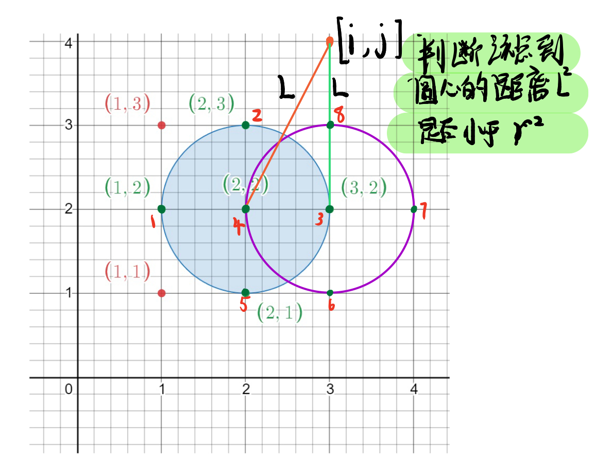

# 1.枚举算法

## 1.简介

> **枚举算法（Enumeration Algorithm）**：也称为**穷举算法**，指的是按照问题本身的性质，一一列举出该问题所有可能的解，并在逐一列举的过程中，将它们逐一与目标状态进行比较以得出满足问题要求的解。在列举的过程中，既不能遗漏也不能重复。

枚举算法的核心思想是：**通过列举问题的所有状态，将它们逐一与目标状态进行比较，从而得到满足条件的解。**

由于枚举算法要通过列举问题的所有状态来得到满足条件的解，因此，**在问题规模变大时，其效率一般是比较低的**。但是枚举算法也有自己特有的优点：

1.  多数情况下容易编程实现，也容易调试。
2.  建立在考察大量状态、甚至是穷举所有状态的基础上，所以算法的正确性比较容易证明。

所以，枚举算法通常用于求解问题规模比较小的问题，或者作为求解问题的一个子算法出现，通过枚举一些信息并进行保存，而这些消息的有无对主算法效率的高低有着较大影响。

## 2.解题思路

枚举算法是设计最简单、最基本的搜索算法。是在遇到问题时，最应该优先考虑的算法。

因为其实现足够简单，所以在遇到问题时，往往可以先通过枚举算法尝试解决问题，然后在此基础上，再去考虑其他优化方法和解题思路。

采用枚举算法解题的一般思路如下：

1.  确定枚举对象、枚举范围和判断条件，并判断条件设立的正确性。
2.  一一枚举可能的情况，并验证是否是问题的解。
3.  考虑提高枚举算法的效率。

可以从下面几个方面考虑提高算法的效率：

1.  抓住问题状态的本质，尽可能缩小问题状态空间的大小。
2.  加强约束条件，缩小枚举范围。
3.  根据某些问题特有的性质，例如对称性等，避免对本质相同的状态重复求解。

## 3.练习题目

### 3.1 两数之和

[1. 两数之和 - 力扣（LeetCode）](https://leetcode.cn/problems/two-sum/description/ "1. 两数之和 - 力扣（LeetCode）")

```.properties
给定一个整数数组 nums 和一个整数目标值 target，请你在该数组中找出 和为目标值 target  的那 两个 整数，并返回它们的数组下标。

你可以假设每种输入只会对应一个答案。但是，数组中同一个元素在答案里不能重复出现。

你可以按任意顺序返回答案。

示例 1：

输入：nums = [2,7,11,15], target = 9
输出：[0,1]
解释：因为 nums[0] + nums[1] == 9 ，返回 [0, 1] 。
```

1.  **暴力搜索**：两重循环枚举数组中每一个数 `nums[i]`、`nums[j]`，判断所有的 `nums[i] + nums[j]` 是否等于 `target`。
2.  **哈希表**：哈希表中键值对信息为 `target-nums[i] ：i`。`i` 为下标。遍历数组，对于每一个数 `nums[i]`：
    1.  先查找字典中是否存在 `target - nums[i]`，存在则输出 `target - nums[i]` 对应的下标和当前数组的下标 `i`。
    2.  不存在则在字典中存入 `target-nums[i]` 的下标 `i`。

```c++
class Solution {
public:
    // 1.暴力求解
    vector<int> twoSum1(vector<int>& nums, int target) {
        int n = nums.size();
        for (int i = 0; i < n; i++) {
            for (int j = i + 1; j < n; j++) {
                if (nums[i] + nums[j] == target) {
                    return {i, j};
                }
            }
        }

        return {};
    }

    // 2.哈希表
    // 创建一个哈希表，对于每一个x，首先查询哈希表中是否存在 target - x，
    // 然后将 x 插入道哈希表中，即可保证不会让x和自己匹配
    vector<int> twoSum(vector<int>& nums, int target) {
        std::unordered_map<int, int> hash_table;
        for (int i = 0; i < nums.size(); i++) {
            auto it = hash_table.find(target - nums[i]);
            if (it != hash_table.end()) {
                return {i, it->second};
            }
            hash_table[nums[i]] = i;
        }

        return {};
    }
};
```

### 3.2 计数质数

[204. 计数质数 - 力扣（LeetCode）](https://leetcode.cn/problems/count-primes/description/ "204. 计数质数 - 力扣（LeetCode）")

```.properties
给定整数 n ，返回 所有小于非负整数 n 的质数的数量 。

示例 1：

输入：n = 10
输出：4
解释：小于 10 的质数一共有 4 个, 它们是 2, 3, 5, 7 。
```

考虑质数的定义：在大于 1 的自然数中，除了 1 和它本身以外不再有其他因数的自然数。

1.  **枚举**：对于每个数 `x`，可以从小到大枚举 `[2,x-1]` 中的每个数 `i`，判断 `i` 是否为 `x` 的因数。考虑到如果i时x得因数，则x/i 必然是x的因数，只需要校验这两个因数中较小数即可。而较小数一定会落在 $[2, \sqrt x]$中，故将范围缩小。
2.  **埃氏筛法**：具体步骤如下：
    -   使用长度为 n 的数组 `is_prime` 来判断一个数是否是质数。如果 `is_prime[i] == True` ，则表示 n是质数，如果 `is_prime[i] == False`，则表示 n 不是质数。并使用变量 `count` 标记质数个数。
    -   然后从 `[2, n−1] `的第一个质数（即数字 2） 开始，令 `count` 加 1，并将该质数在 `[2,n−1]` 范围内所有倍数（即 4、6、8、...）都标记为非质数。
    -   然后根据数组 `is_prime` 中的信息，找到下一个没有标记为非质数的质数（即数字 3），令 `count` 加 1，然后将该质数在 `[2,n−1]` 范围内的所有倍数（即 6、9、12、…）都标记为非质数。
    -   以此类推，直到所有小于或等于 n−1 的质数和质数的倍数都标记完毕时，输出 `count`。

优化：对于一个质数`x`，我们可以直接从`x*x`开始标记，这是因为`2*x`，`3*x`，..., 这些数已经在`x`之前就被标记过了。

```c++
class Solution {
public:
    // 1.枚举, 超时
    bool is_prime(int x) {
        for (int i = 2; i <= pow(x, 0.5); i++) {
            if (x % i == 0) {
                return false;
            }
        }
        return true;
    }
    int countPrimes1(int n) {
        int count = 0;
        for (int i = 2; i < n; i++) {
            if (this->is_prime(i)) {
                count++;
            }
        }
        return count;
    }

    // 2.埃氏筛法
    int countPrimes(int n) {
        std::vector<bool> prime_flag(n, true);
        int count = 0;

        for (int i = 2; i < n; i++) {
            if (prime_flag[i]) {
                count++;
                if ((long long)i * i < n) {
                    for (int j = i * i; j < n; j = j + i) {
                        prime_flag[j] = false;
                    }
                }
                
            }
        }

        return count;
    }

};
```

### 3.3 统计平方和三元组数目

[1925. 统计平方和三元组的数目 - 力扣（LeetCode）](https://leetcode.cn/problems/count-square-sum-triples/description/ "1925. 统计平方和三元组的数目 - 力扣（LeetCode）")

```.properties
一个 平方和三元组 (a,b,c) 指的是满足 a2 + b2 = c2 的 整数 三元组 a，b 和 c 。

给你一个整数 n ，请你返回满足 1 <= a, b, c <= n 的 平方和三元组 的数目。

 

示例 1：

输入：n = 5
输出：2
解释：平方和三元组为 (3,4,5) 和 (4,3,5) 。
```

枚举算法：

-   可以在`[1,n]`中枚举正数三元组`(a,b,c)`中的a和b，然后判断$a^2+b^2$是否咸鱼等于n，并且是完全平方数
-   注意：在计算中，为了防止浮点数造成的误差，并且两个相邻的完全平方正数之间的距离一定大于 1，

```c++
class Solution {
public:
    // 1.枚举算法
    int countTriples(int n) {
        int count = 0;
        for (int a = 1; a <= n; a++) {
            for (int b = 1; b <= n; b++) {
                // 在计算中，为了防止浮点数造成的误差，
                // 并且两个相邻的完全平方正数之间的距离一定大于 1，
                int c = sqrt(a * a + b * b + 1);
                if (c <= n && a * a + b * b == c * c) {
                    count++;
                }
            }
        }

        return count;
    }
};
```

### 3.4 公因子的数目

[2427. 公因子的数目 - 力扣（LeetCode）](https://leetcode.cn/problems/number-of-common-factors/description/ "2427. 公因子的数目 - 力扣（LeetCode）")

```.properties
给你两个正整数 a 和 b ，返回 a 和 b 的 公 因子的数目。

如果 x 可以同时整除 a 和 b ，则认为 x 是 a 和 b 的一个 公因子 。

 

示例 1：

输入：a = 12, b = 6
输出：4
解释：12 和 6 的公因子是 1、2、3、6 。
```

枚举算法：由于 a 和 b 的公因子一定不会超过 a 和 b，因此我们只需要在 $ [1, min(a, b)]  $中枚举 x，并判断 x 是否为公因子即可。

```c++
class Solution {
public:
    int commonFactors(int a, int b) {
        int count = 0;
        for (int i = 1; i <= std::min(a, b); i++) {
            if (a % i == 0 && b % i == 0) {
                count ++;
            }
        }

        return count;
    }
};
```

### 3.5 文件组合

[LCR 180. 文件组合 - 力扣（LeetCode）](https://leetcode.cn/problems/he-wei-sde-lian-xu-zheng-shu-xu-lie-lcof/description/ "LCR 180. 文件组合 - 力扣（LeetCode）")

```.properties
待传输文件被切分成多个部分，按照原排列顺序，每部分文件编号均为一个 正整数（至少含有两个文件）。传输要求为：连续文件编号总和为接收方指定数字 target 的所有文件。请返回所有符合该要求的文件传输组合列表。

注意，返回时需遵循以下规则：

每种组合按照文件编号 升序 排列；
不同组合按照第一个文件编号 升序 排列。
 

示例 1：

输入：target = 12
输出：[[3, 4, 5]]
解释：在上述示例中，存在一个连续正整数序列的和为 12，为 [3, 4, 5]。
```

1.枚举+暴力：枚举每个正整数为起点，判断以它为起点的序列和 `sum `是否等于 target即可，由于题目要求文件组合长度至少大于 2，所以枚举的上界为 `(target - 2)/2`

2.滑动窗口

-   初始化窗口，令 `left = 1`，`right = 2`。
-   计算 `sum = (left + right) * (right - left + 1) / 2`sum表示区间\[left, right]的和，由求和公式求得 $\textit{sum}=\frac{(l+r) \times (r-l+1)}{2}$。
-   如果 `sum == target`，时，将其加入答案数组中。
-   如果 `sum < target` 时，说明需要扩大窗口，则 `right += 1`。
-   如果 `sum > target` 时，说明需要缩小窗口，则 `left += 1`。
-   直到 `left >= right` 时停止，返回答案数组。

```c++
class Solution {
public:
    // 1.枚举:枚举每个正整数为起点，判断以它为起点的序列和 sum 是否等于 target即可，
    // 由于题目要求文件组合长度至少大于 2，所以枚举的上界为 (target - 2)/2
    vector<vector<int>> fileCombination1(int target) {
        std::vector<std::vector<int>> ans;
        std::vector<int> tmp_vec;
        int sum = 0;
        for (int i = 1; i <= (target - 1) / 2; i++) {
            for (int j = i; ; j++) {
                sum += j;
                if (sum > target) {
                    sum = 0;
                    break;
                } else if (sum == target) {
                    tmp_vec.clear();
                    for (int k = i; k <= j; k++) {
                        tmp_vec.push_back(k);
                    }
                    ans.push_back(tmp_vec);
                    sum = 0;
                    break;
                }
            }
        }

        return ans;
    }

    // 2.滑动窗口
    vector<vector<int>> fileCombination(int target) {
        std::vector<std::vector<int>> ans;
        std::vector<int> tmp_vec;

        int left = 1;
        int right = 2;
        while ( left < right) {
            int sum = (left + right) * (right - left + 1) / 2;
            // 刚好等于
            if (sum == target) {
                tmp_vec.clear();
                for (int k = left; k <= right; k++) {
                    tmp_vec.push_back(k);
                }
                ans.push_back(tmp_vec);
                left++;
            } else if (sum < target) {
                // 小了，扩大窗口
                right++;
            } else {
                // 大了，扩大窗口
                left++;
            }
        }

        return ans;
    }
};
```

### 3.6 统计园内格点数目

[2249. 统计圆内格点数目 - 力扣（LeetCode）](https://leetcode.cn/problems/count-lattice-points-inside-a-circle/description/ "2249. 统计圆内格点数目 - 力扣（LeetCode）")

```.properties
给你一个二维整数数组 circles ，其中 circles[i] = [xi, yi, ri] 表示网格上圆心为 (xi, yi) 且半径为 ri 的第 i 个圆，返回出现在 至少一个 圆内的 格点数目 。

注意：
- 格点 是指整数坐标对应的点。
- 圆周上的点 也被视为出现在圆内的点。

输入：circles = [[2,2,1]]
输出：5
解释：
给定的圆如上图所示。
出现在圆内的格点为 (1, 2)、(2, 1)、(2, 2)、(2, 3) 和 (3, 2)，在图中用绿色标识。
像 (1, 1) 和 (1, 3) 这样用红色标识的点，并未出现在圆内。
因此，出现在至少一个圆内的格点数目是 5 。

```

遍历坐标系中的所有点，根据圆的方程过滤出落在圆上面的点，当满足`圆心为(a,b) 半径为r的圆的方程为(x-a)²+(y-b)²<=r²`说明点（x,y）在圆内。



```c++
class Solution {
public:
    // 遍历坐标系中的所有点，根据元的方程过滤出落在圆上面的点
    int countLatticePoints(vector<vector<int>>& circles) {
        int count = 0;
        for (int i = 0; i <= 200; i++) {
            for (int j = 0; j <= 200; j++) {
                for (auto& c : circles) {
                    int x = c[0];
                    int y = c[1];
                    int r = c[2];

                    // 圆心为(a,b)，半径为r的圆的方程 (x-a)^2 + (y-b)^2 = r^2
                    if ((i - x) * ( i - x) + (j - y) * (j - y) <= r * r) {
                        count++;
                        break;
                    }
                }
            }
        }

        return count;
    }
};
```
