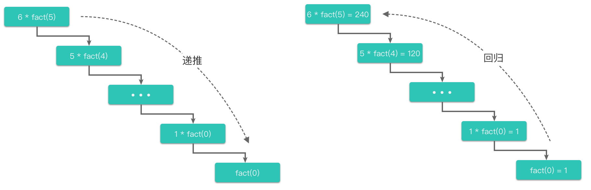
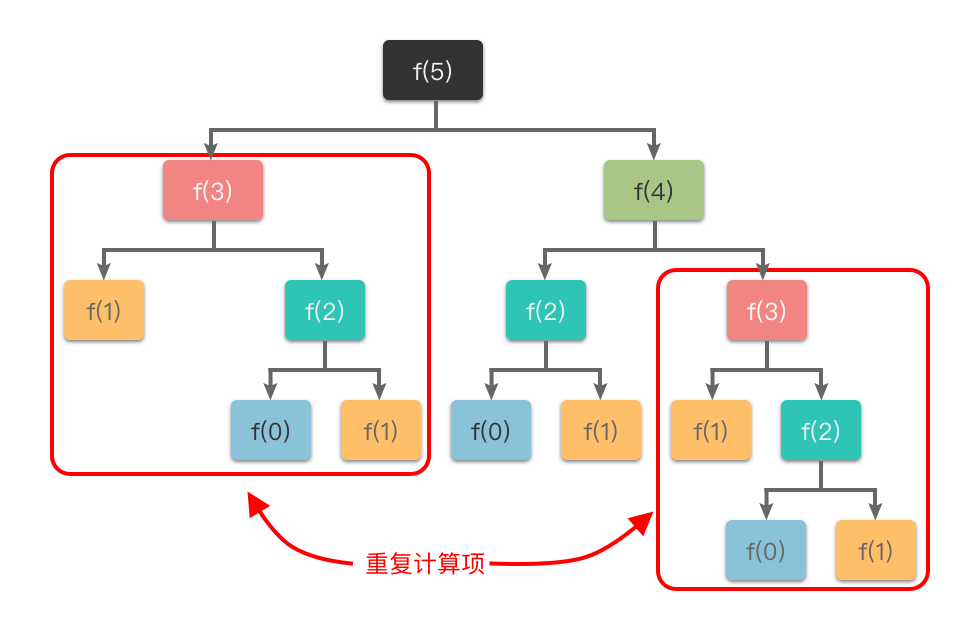
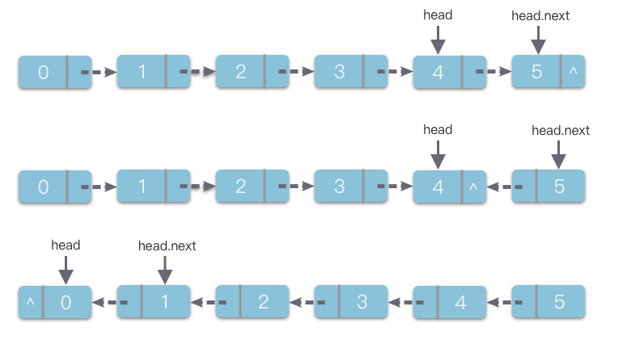
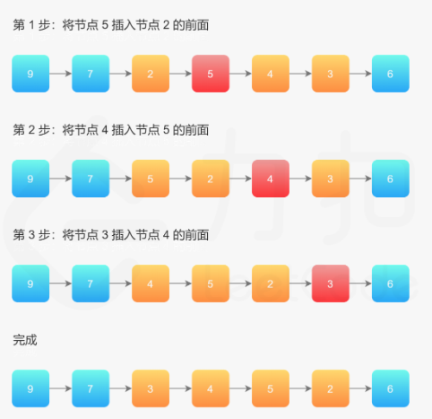

# 2.递归算法

## 1.递归简介

> **递归（Recursion）**：指的是一种通过重复**将原问题分解为同类的子问题而解决的方法**。在绝大数编程语言中，可以通过在函数中再次调用函数自身的方式来实现递归。

举个简单的例子来了解一下递归算法。比如阶乘的计算方法在数学上的定义为：

$$
f a c t(n)=\left\{\begin{array}{ll}1 & \mathbf{n}=0 \\ n * f a c t(n-1) & \mathbf{n}>0\end{array}\right.
$$

根据阶乘计算方法的数学定义，我们可以使用调用函数自身的方式来实现阶乘函数 `fact(n)`，其实可以写作：

```python
def fact(n):
    if n == 0:
        return 1
    return n * fact(n - 1)

```

根据上面的描述，可以把阶乘函数的递归计算过程分为两个部分：

1.  先逐层向下调用自身，直到达到结束条件（n==0）
2.  然后向上逐层返回结果，直到返回原问题的解。

这两个部分也可以叫做“递推过程”和“回归过程”，如下图所示：



如上面所说，可以把「递归」分为两个部分：「递推过程」和「回归过程」。

-   **递推过程**：指的是将原问题一层一层地分解为与原问题形式相同、规模更小的子问题，直到达到结束条件时停止，此时返回最底层子问题的解。
-   **回归过程**：指的是从最底层子问题的解开始，逆向逐一回归，最终达到递推开始时的原问题，返回原问题的解。

「递推过程」和「回归过程」是递归算法的精髓。从这个角度来理解递归，递归的基本思想就是： **把规模大的问题不断分解为子问题来解决****。** ​

同时，因为解决原问题和不同规模的小问题往往使用的是相同的方法，所以就产生了函数调用函数自身的情况，这也是递归的定义所在。

## 2.递归三步走

具体步骤如下：

1.  **写出递推公式**：找到将原问题分解为子问题的规律，并且根据规律写出递推公式。
2.  **明确终止条件**：推敲出递归的终止条件，以及递归终止时的处理方法。
3.  **将递推公式和终止条件翻译成代码**：
    1.  定义递归函数（明确函数意义、传入参数、返回结果等）。
    2.  书写递归主体（提取重复的逻辑，缩小问题规模）。
    3.  明确递归终止条件（给出递归终止条件，以及递归终止时的处理方法）。

递归伪代码：

```python
def recursion(大规模问题):
    if 递归终止条件:
        递归终止时的处理方法
    
    return recursion(小规模问题)
```

## 3.递归的注意点

### 3.1 避免栈溢出

在程序执行中，**递归是利用堆栈来实现的**。每一次递推都需要一个栈空间来保存调用记录，每当进入一次函数调用，栈空间就会加一层栈帧。每一次回归，栈空间就会减一层栈帧。由于系统中的栈空间大小不是无限的，所以，**如果递归调用的次数过多，会导致栈空间溢出**。

### 3.2 避免重复计算

在使用递归算法时，还可能会出现重复运算的问题。

比如斐波那契数列的定义是：

$$
f(n)=\left\{\begin{array}{ll}0 & n=0 \\ 1 & n=1 \\ f(n-2)+f(n-1) & n>1\end{array}\right.
$$

其对应的递归过程如下图所示：



为了避免重复计算，**可以使用一个缓存（哈希表、集合或数组）来保存已经求解过的**\*\*`f(k)`的结果 \*\*，这也是动态规划算法中的做法。

## 4.实战题目

### 4.1 斐波那契数

[509. 斐波那契数 - 力扣（LeetCode）](https://leetcode.cn/problems/fibonacci-number/ "509. 斐波那契数 - 力扣（LeetCode）")

```.properties
斐波那契数 （通常用 F(n) 表示）形成的序列称为 斐波那契数列 。该数列由 0 和 1 开始，后面的每一项数字都是前面两项数字的和。也就是：

F(0) = 0，F(1) = 1
F(n) = F(n - 1) + F(n - 2)，其中 n > 1
给定 n ，请计算 F(n) 。

 

示例 1：

输入：n = 2
输出：1
解释：F(2) = F(1) + F(0) = 1 + 0 = 1
```

递归

```c++
class Solution {
public:
    int fib(int n) {
        if (n < 2) {
            return n;
        }

        return this->fib(n - 1) + this->fib(n - 2);
    }
};
```

动态规划

```c++
class Solution {
public:
    // 1.动态规划
    int fib1(int n) {
        if (n < 2) {
            return  n;
        }

        std::vector<int> dp(n + 1, 0);
        dp[0] = 0;
        dp[1] = 1;

        for (int i = 2; i <= n; i++) {
            dp[i] = dp[i - 1] + dp[i - 2];
        }

        return dp[n];
    }
};
```

### 4.2 二叉树的最大深度

[104. 二叉树的最大深度 - 力扣（LeetCode）](https://leetcode.cn/problems/maximum-depth-of-binary-tree/description/ "104. 二叉树的最大深度 - 力扣（LeetCode）")

```.properties
给定一个二叉树 root ，返回其最大深度。

二叉树的 最大深度 是指从根节点到最远叶子节点的最长路径上的节点数。

输入：root = [3,9,20,null,null,15,7]
输出：3

```

递归，深度优先搜索

```c++
class Solution {
public:
    // 1.递归，深度优先搜索
    int maxDepth(TreeNode* root) {
        if (root == nullptr) {
            return 0;
        }
        return std::max(this->maxDepth(root->left), this->maxDepth(root->right)) + 1;
    }
};
```

迭代，广度优先搜索，层序遍历

```c++
class Solution {
public:
    // 2.迭代，广度优先搜索
    int maxDepth(TreeNode* root) {
        if (root == nullptr) {
            return 0;
        }

        std::queue<TreeNode*> que;
        que.push(root);
        int depth = 0;

        while (!que.empty()) {
            int size = que.size();
            for (int i = 0; i < size; i++) {
                TreeNode* tmp_node = que.front();
                que.pop();

                if (tmp_node->left != nullptr) {
                    que.push(tmp_node->left);
                }

                if (tmp_node->right != nullptr) {
                    que.push(tmp_node->right);
                }
            }
            depth++;
        }

        return depth;
    } 
};
```

### 4.3 翻转二叉树

[226. 翻转二叉树 - 力扣（LeetCode）](https://leetcode.cn/problems/invert-binary-tree/ "226. 翻转二叉树 - 力扣（LeetCode）")

```.properties
给你一棵二叉树的根节点 root ，翻转这棵二叉树，并返回其根节点。

输入：root = [4,2,7,1,3,6,9]
输出：[4,7,2,9,6,3,1]

```

```c++
class Solution {
public:
    TreeNode* invertTree(TreeNode* root) {
        // 终止条件
        if (root == nullptr) {
            return nullptr;
        }

        // 翻转
        TreeNode* right = this->invertTree(root->right);
        TreeNode* left = this->invertTree(root->left);
        root->left = right;
        root->right = left;

        return root;
    }
};
```

### 4.4反转链表

[206. 反转链表 - 力扣（LeetCode）](https://leetcode.cn/problems/reverse-linked-list/description/ "206. 反转链表 - 力扣（LeetCode）")

```.properties
给你单链表的头节点 head ，请你反转链表，并返回反转后的链表。

输入：head = [1,2,3,4,5]
输出：[5,4,3,2,1]

```

#### 迭代

```c++
class Solution {
public:
    ListNode* reverseList(ListNode* head) {
        // 增加头结点，方便插入
        ListNode* head_point = new ListNode();
        head_point->next = nullptr;
        ListNode* node_ptr = head;
        while (node_ptr != nullptr) {
            // 暂存下一个结点
            ListNode* next_node = node_ptr->next;
            // step1:先将插入结点指针修改为头节点的后继
            node_ptr->next = head_point->next;
            // step2： 再将头节点L的后继更新为新插入结点
            head_point->next = node_ptr;

            // 更新下一个节点
            node_ptr = next_node;
        }
        // 注意，增加了头节点，需要去掉
        return head_point->next;
    }
};
```

#### 递归

具体做法如下：

1.  首先定义递归函数含义为：将链表反转，并返回反转后的头节点。
2.  然后从 `head.next` 的位置开始调用递归函数，即将 `head.next` 为头节点的链表进行反转，并返回该链表的头节点。
3.  递归到链表的最后一个节点，将其作为最终的头节点，即为 `new_head`。
4.  在每次递归函数返回的过程中，改变 `head` 和 `head.next` 的指向关系。也就是将 `head.next` 的`next` 指针先指向当前节点 `head`，即 `head.next.next = head` 。
5.  然后让当前节点 `head` 的 `next` 指针指向 `None`，从而实现从链表尾部开始的局部反转。
6.  当递归从末尾开始顺着递归栈的退出，从而将整个链表进行反转。
7.  最后返回反转后的链表头节点 `new_head`。



```c++
class Solution {
public:
    // 2.递归
    ListNode* reverseList(ListNode* head) {
        if (head == nullptr || head->next == nullptr) {
            return head;
        }
        ListNode* new_head = this->reverseList(head->next);
        head->next->next = head;
        head->next = nullptr;

        return new_head;
    }
};
```

### 4.5 反转链表Ⅱ

[92. 反转链表 II - 力扣（LeetCode）](https://leetcode.cn/problems/reverse-linked-list-ii/description/ "92. 反转链表 II - 力扣（LeetCode）")

```.properties
给你单链表的头指针 head 和两个整数 left 和 right ，其中 left <= right 。请你反转从位置 left 到位置 right 的链表节点，返回 反转后的链表 。
 

输入：head = [1,2,3,4,5], left = 2, right = 4
输出：[1,4,3,2,5]

```

在需要反转的区间里，每遍历到一个节点，让这个新节点来到反转部分的起始位置。下面的图展示了整个流程。



```c++
class Solution {
public:
    ListNode* reverseBetween(ListNode* head, int left, int right) {
        ListNode* head_node = new ListNode();
        head_node->next = head;
        ListNode* pre_node = head_node;
        for (int i = 0; i < left - 1; i++) {
            pre_node = pre_node->next;
        }
        

        ListNode* curr_ptr = pre_node->next;
        // std::cout << pre_node->val;

        for (int i = 0; i < right - left; i++) {
            ListNode* next_node = curr_ptr->next;

            curr_ptr->next = next_node->next;
            next_node->next = pre_node->next;

            pre_node->next = next_node;

        }

        return head_node->next;
    }
};
```

### 4.6 第k个语法符号

[779. 第K个语法符号 - 力扣（LeetCode）](https://leetcode.cn/problems/k-th-symbol-in-grammar/description/ "779. 第K个语法符号 - 力扣（LeetCode）")

```.properties
我们构建了一个包含 n 行( 索引从 1  开始 )的表。首先在第一行我们写上一个 0。接下来的每一行，将前一行中的0替换为01，1替换为10。

例如，对于 n = 3 ，第 1 行是 0 ，第 2 行是 01 ，第3行是 0110 。
给定行数 n 和序数 k，返回第 n 行中第 k 个字符。（ k 从索引 1 开始）


示例 1:

输入: n = 1, k = 1
输出: 0
解释: 第一行：0
```

可以发现：第`k`个数字是由上一位对应位置上的数字生成的

-   k为奇数时，由上一行`(k+1)/2`位置生成，且与上一行`(k+1)/2`位置相同
-   k为偶数时，由上一行`k/2`位置生成，且与上一行 `k/2`位置相反

```c++
class Solution {
public:
    int kthGrammar(int n, int k) {
        if (n == 0) {
            return 0;
        }

        if (k % 2 == 1) {
            return this->kthGrammar(n - 1, (k + 1) / 2);
        } else {
            return abs(this->kthGrammar(n - 1, k / 2) - 1);
        }
    }
};
```

### 4.7 破冰游戏

[LCR 187. 破冰游戏 - 力扣（LeetCode）](https://leetcode.cn/problems/yuan-quan-zhong-zui-hou-sheng-xia-de-shu-zi-lcof/description/ "LCR 187. 破冰游戏 - 力扣（LeetCode）")

```c++
社团共有 num 为成员参与破冰游戏，编号为 0 ~ num-1。成员们按照编号顺序围绕圆桌而坐。社长抽取一个数字 target，从 0 号成员起开始计数，排在第 target 位的成员离开圆桌，且成员离开后从下一个成员开始计数。请返回游戏结束时最后一位成员的编号。

 

示例 1：

输入：num = 7, target = 4
输出：1
示例 2：

输入：num = 12, target = 5
输出：0
```

长度为 num 的序列会先删除第 `target % num` 个元素，然后剩下一个长度为 `num - 1` 的序列。那么，可以递归地求解 `f(num - 1, target)`，就可以知道对于剩下的 `num - 1 `个元素，最终会留下第几个元素，设答案为 `x = f(num - 1, target)`。

由于删除了第 `target % num` 个元素，将序列的长度变为 `num - 1`。当知道了` f(num - 1, target)` 对应的答案 x 之后，也就可以知道，长度为 num 的序列最后一个删除的元素，应当是从 `target % num` 开始数的第 x 个元素。因此有 `f(num, target) = (target % num + x) % num = (target + x) % num`。

```c++
class Solution {
public:
    int iceBreakingGame(int num, int target) {
        return this->f(num, target);
    }

    int f(int num, int target) {
        if (num == 1) {
            return 0;
        }
        int x = this->f(num - 1, target);
        return (target + x) % num;
    }
};
```
