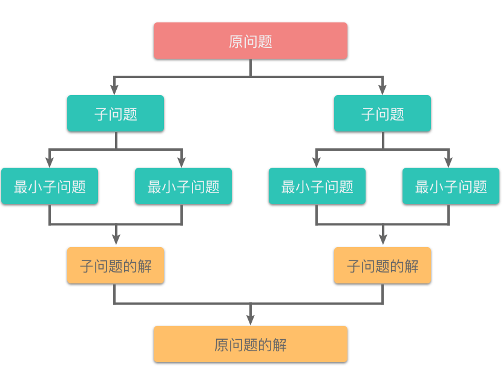
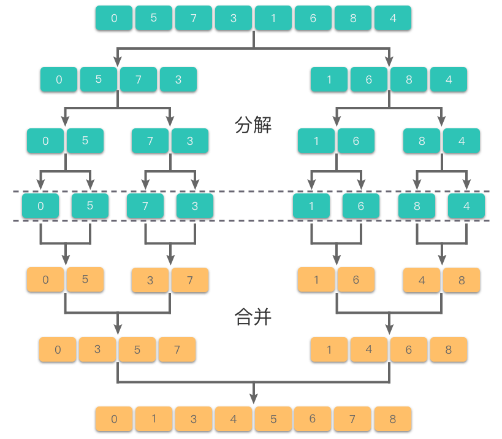

# 3.分治算法

## 1.分治算法

### 1.1 分治算法简介

> **分治算法（Divide and Conquer）**：字面上的解释是「分而治之」，就是把一个复杂的问题分成两个或更多的相同或相似的子问题，直到最后子问题可以简单的直接求解，原问题的解即子问题的解的合并。

简单来说，分治算法的基本思想就是： **把规模大的问题不断分解为子问题，使得问题规模减小到可以直接求解为止****。** ​



### 1.2 分治算法使用条件

分治算法能够解决的问题，一般需要满足以下 4 个条件：

1.  **可分解**：原问题可以分解为若干个规模较小的相同子问题。
2.  **子问题可独立求解**：分解出来的子问题可以独立求解，即子问题之间不包含公共的子子问题。
3.  **具有分解的终止条件**：当问题的规模足够小时，能够用较简单的方法解决。
4.  **可合并**：子问题的解可以合并为原问题的解，并且合并操作的复杂度不能太高，否则就无法起到减少算法总体复杂度的效果了。

## 2.分治算法步骤

使用分治算法解决问题主要分为 3 个步骤：

1.  **分解**：把要解决的问题分解为成若干个规模较小、相对独立、与原问题形式相同的子问题。
2.  **求解**：递归求解各个子问题。
3.  **合并**：按照原问题的要求，将子问题的解逐层合并构成原问题的解。

按照分而治之的策略，在编写分治算法的代码时，也是按照上面的 3个步骤来编写的，其对应的伪代码如下：

```python
def divide_and_conquer(problems_n):             # problems_n 为问题规模
    if problems_n < d:                          # 当问题规模足够小时，直接解决该问题
        return solove()                         # 直接求解
    
    problems_k = divide(problems_n)             # 将问题分解为 k 个相同形式的子问题
    
    res = [0 for _ in range(k)]                 # res 用来保存 k 个子问题的解
    for problem_k in problems_k:
        res[i] = divide_and_conquer(problem_k)  # 递归的求解 k 个子问题
    
    ans = merge(res)                            # 合并 k 个子问题的解
    return ans                                  # 返回原问题的解
```

## 3.分治算法复杂度分析

分治算法中，在不断递归后，最后的子问题将变得极为简单，可在常数操作时间内予以解决，其带来的时间复杂度在整个分治算法中的比重微乎其微，可以忽略不计。所以，**分治算法的时间复杂度实际上是由「分解」和「合并」两个部分构成的**。

一般来讲，分治算法将一个问题划分为 `a` 个形式相同的子问题，每个子问题的规模为&#x20;
`n/b`，则总的时间复杂度的递归表达式可以表示为：

$$
T(n)=\left\{\begin{array}{cc}\Theta(1) & n=1 \\ a \times T(n / b)+f(n) & n>1\end{array}\right.
$$

其中，每次分解时产生的子问题个数是 `a`，每个子问题的规模是原问题规模的 `1/b`，分解和合并`a`个子问题的时间复杂度是`f(n)`。

## 4.实战题目

### 4.1 归并排序



```c++
class Solution {
public:
    vector<int> sortArray(vector<int>& nums) {
        if (nums.size() == 0) {
            return {};
        }

        //归并排序
        this->merge_sort(nums, 0, nums.size() - 1);

        return nums;
    }
private:

    // 3.1 归并排序
    // 先排序左右子数组，然后合并两个有序子数组
    // 1. 把长度为n的输入序列分成两个长度为n/2的子序列
    // 2. 对这两个子序列分别采用归并排序:
    // 3. 将两个排序好的子序列合并成一个最终的排序序列
    void merge(std::vector<int>& nums, int left, int mid, int right)
    {
        // 辅助数组
        std::vector<int> tmp(right - left + 1);
        // // 表nums中的元素，全部复制到tmp中
        // for (int k = left; k <= right; k++)
        //     tmp[k] = nums[k];
        int left_idx = left;
        int right_idx = mid + 1;
        int tmp_index = 0;
        // 比较tmp的左右两段中的元素,将较小值复制到L中
        while (left_idx <= mid && right_idx <= right)
        {
            // 两个元素相等时，优先使用靠前的那个（稳定性）
            if (nums[left_idx] <= nums[right_idx])
                tmp[tmp_index++] = nums[left_idx++];
            else
                tmp[tmp_index++] = nums[right_idx++];
        }

        // 若第一个表未检测完，复制
        while(left_idx <= mid)
            tmp[tmp_index++] = nums[left_idx++];
        // 若第二个表未检测完，复制
        while (right_idx <= right)
            tmp[tmp_index++] = nums[right_idx++];

        // 复制tmp到nums
        for (int k = 0; k < tmp.size(); k++) {
            nums[left + k] = tmp[k];
        }

    }
    void merge_sort(std::vector<int>& nums, int left, int right)
    {
        if (left < right)
        {
            int mid = left + (right - left) / 2;
            this->merge_sort(nums, left, mid);
            this->merge_sort(nums, mid + 1, right);
            this->merge(nums, left, mid, right);
        }
    }

};
```

### 4.2 二分查找

[704. 二分查找 - 力扣（LeetCode）](https://leetcode.cn/problems/binary-search/description/ "704. 二分查找 - 力扣（LeetCode）")

```.properties
给定一个 n 个元素有序的（升序）整型数组 nums 和一个目标值 target  ，写一个函数搜索 nums 中的 target，如果目标值存在返回下标，否则返回 -1。


示例 1:

输入: nums = [-1,0,3,5,9,12], target = 9
输出: 4
解释: 9 出现在 nums 中并且下标为 4
```

```c++
class Solution {
public:
    int search(vector<int>& nums, int target) {
        int left = 0;
        int right = nums.size() - 1;
        while (left <= right) {
            int mid = left + (right - left) / 2;
            if (nums[mid] == target) {
                return mid;
            } else if (nums[mid] > target) {
                right = mid - 1;
            } else {
                left = mid + 1;
            }
        }
        return -1;
    }
};
```

着重强调容易出错的三个地方：

1.  **循环退出条件**：注意是`low<=high`，而不是`low<high`。
2.  **mid的取值**：`mid=(low+high)/2`这种写法是有问题的。因为如果low和high比较大的话，两者之和就有可能会溢出。改进的方法是将mid的计算方式写成`low+(high - low)/2`。更进一步，如果要将性能优化到极致的话，可以将这里的除以2操作转化成位运算`low+((high-low)>>1`)。因为相比除法运算来说，计算机处理位运算要快得多。
3.  **low和high的更新**：`low=mid+1`，`high=mid-1`。注意这里的+1和-1，如果直接写成`low=mid`或者`high=mid`，就可能会发生死循环。比如，当high=3， low=3时，如果a\[3]不等于value，就会导致一直循环不退出。

### 4.3 Pow

[50. Pow(x, n) - 力扣（LeetCode）](https://leetcode.cn/problems/powx-n/description/ "50. Pow(x, n) - 力扣（LeetCode）")

```.properties
实现 pow(x, n) ，即计算 x 的整数 n 次幂函数（即，xn ）。


示例 1：

输入：x = 2.00000, n = 10
输出：1024.00000
```

根据n的奇偶性，可以得到以下结论：

-   如果n为偶数：$x^n=x^{n/2} \times x^{n/2}$
-   如果n为奇数：$x^n=x \times x^{(n-1)/2} \times x^{(n-1)/2}$

```c++
class Solution {
public:
    // 分治，递归
    // 2^10  -> 2^5 -> 2^2 * 2
    double myPow(double x, int n) {
        long long N = n;
        // 如果n是负数，特殊处理
        return N >=0 ? this->fast_pow(x, N) : this->fast_pow(1/x, -N);
    }

    double fast_pow(double x, int n) {
        if (n == 0) {
            return 1.0;
        }

        double sub_result = this->fast_pow(x, n / 2);
        // 奇偶数特殊处理
        return n % 2 == 0 ? sub_result * sub_result : x * sub_result * sub_result;
    }

};
```

### 4.4 多数元素

[169. 多数元素 - 力扣（LeetCode）](https://leetcode.cn/problems/majority-element/description/ "169. 多数元素 - 力扣（LeetCode）")

```.properties
给定一个大小为 n 的数组 nums ，返回其中的多数元素。多数元素是指在数组中出现次数 大于 ⌊ n/2 ⌋ 的元素。

你可以假设数组是非空的，并且给定的数组总是存在多数元素。

 

示例 1：

输入：nums = [3,2,3]
输出：3
示例 2：

输入：nums = [2,2,1,1,1,2,2]
输出：2
```

1.  哈希表，统计元素的出现次数
2.  排序，中间那个元素

```c++
class Solution {
public:
    // 1.哈希表，统计元素次数
    int majorityElement1(vector<int>& nums) {
        std::unordered_map<int, int> counts;
        int max_cnt = 0;
        int max_elem = 0;
        for (auto& n : nums) {
            counts[n]++;
            if (counts[n] > max_cnt) {
                max_cnt = counts[n];
                max_elem = n;
            }
        }

        return max_elem;
    }

    // 2.排序，取中间元素
    int majorityElement(vector<int>& nums) {
        std::sort(nums.begin(), nums.end());
        return nums[nums.size() / 2];
    }
};
```

### 4.5 最大数组和

[53. 最大子数组和 - 力扣（LeetCode）](https://leetcode.cn/problems/maximum-subarray/description/ "53. 最大子数组和 - 力扣（LeetCode）")

```.properties
给你一个整数数组 nums ，请你找出一个具有最大和的连续子数组（子数组最少包含一个元素），返回其最大和。

子数组 是数组中的一个连续部分。

 

示例 1：

输入：nums = [-2,1,-3,4,-1,2,1,-5,4]
输出：6
解释：连续子数组 [4,-1,2,1] 的和最大，为 6 。
```

1、动态规划

-   分治：如果第i个元素，则序列和？
-   状态定义：`f(1)`
-   DP方程：`f(1) = max(f(i - 1), 0) + a[i]`

```c++
class Solution {
public:
    // 1.动态规划
    int maxSubArray(vector<int>& nums) {
        std::vector<int> dp(nums.size());
        dp[0] = nums[0] > 0 ? nums[0] : 0;
        int max_sum = nums[0];

        for (int i = 1; i < nums.size(); i++) {
            dp[i] = std::max(dp[i - 1], 0) + nums[i];
            max_sum = std::max(dp[i], max_sum);
        }

        return max_sum;
    }
};
```

2、分治算法

将数组 `nums` 根据中心位置分为左右两个子数组。则具有最大和的连续子数组可能存在以下3种情况：

1.  具有最大和的连续子数组在左子数组中。
2.  具有最大和的连续子数组在右子数组中。
3.  具有最大和的连续子数组跨过中心位置，一部分在左子数组中，另一部分在右子树组中。

那么要求出具有最大和的连续子数组的最大和，则分别对上面3种情况求解即可。具体步骤如下：

1.  将数组 `nums` 根据中心位置递归分为左右两个子数组，直到所有子数组长度为1 。
2.  长度为1 的子数组最大和肯定是数组中唯一的数，将其返回即可。
3.  求出左子数组的最大和 `left_max`。
4.  求出右子树组的最大和 `right_max`。
5.  求出跨过中心位置，一部分在左子数组中，另一部分在右子树组的子数组最大和 `left_total + right_total`。
6.  求出3 、4、5 中的最大值，即为当前数组的最大和，将其返回即可。

```c++
class Solution {
public:
    // 2.分治算法
    int maxSubArray(vector<int>& nums) {
        return this->max_sub_array(nums, 0, nums.size() - 1);
    }
    int max_sub_array(std::vector<int>& nums, int low, int high) {
        if (low == high) {
            return nums[low];
        }

        int mid = low + (high - low) / 2;
        int left_max = this->max_sub_array(nums, low, mid);
        int right_max = this->max_sub_array(nums, mid + 1, high);

        int total = 0;
        int left_total = INT_MIN;
        for (int i = mid; i <= low; i--) {
            total += nums[i];
            left_total = std::max(left_total, total);
        }

        total = 0;
        int right_total = INT_MIN;
        for (int i = mid + 1; i <= high; i++) {
            total += nums[i];
            right_total = std::max(right_total, total);
        }

        return std::max(std::max(left_max, right_max), left_total + right_total);
    }
};
```

### 4.6 漂亮数组

[932. 漂亮数组 - 力扣（LeetCode）](https://leetcode.cn/problems/beautiful-array/description/ "932. 漂亮数组 - 力扣（LeetCode）")

```.properties
如果长度为 n 的数组 nums 满足下述条件，则认为该数组是一个 漂亮数组 ：

- nums 是由范围 [1, n] 的整数组成的一个排列。
- 对于每个 0 <= i < j < n ，均不存在下标 k（i < k < j）使得 2 * nums[k] == nums[i] + nums[j] 。
给你整数 n ，返回长度为 n 的任一 漂亮数组 。本题保证对于给定的 n 至少存在一个有效答案。

 

示例 1 ：

输入：n = 4
输出：[2,1,4,3]
```

根据题目要求，可以得到以下信息：

1.  题目要求 $2 \times nums[k] == nums[i] + nums[j], (0 \le i < k < j < n)$ 不能成立，可知：**等式左侧必为偶数，只要右侧和为奇数则等式不成立**。
2.  已知：奇数 + 偶数 = 奇数，则令 $nums[i]$ 和 $nums[j]$ 其中一个为奇数，另一个为偶数，即可保证 $nums[i] + nums[j]$ 一定为奇数。这里不妨令 $nums[i]$ 为奇数，令 $nums[j]$ 为偶数。
3.  如果数组 $nums$ 是漂亮数组，那么对数组 $nums$ 的每一位元素乘以一个常数或者加上一个常数之后，$nums$ 仍是漂亮数组。即如果 $[a_1, a_2, ..., a_n]$ 是一个漂亮数组，那么 $[k \times a_1 + b, k \times a_2 + b, ..., k \times a_n + b]$ 也是漂亮数组。

那么，可以按照下面的规则构建长度为 $n$ 的漂亮数组。

1.  当 $n = 1$ 时，返回 $[1]$。此时数组 $nums$ 中仅有 $1$ 个元素，并且满足漂亮数组的条件。
2.  当 $n > 1$ 时，我们将 $nums$ 分解为左右两个部分：`left_nums`、`right_nums`。如果左右两个部分满足：
    1.  数组 `left_nums` 中元素全为奇数（可以通过 `nums[i] * 2 - 1` 将 `left_nums` 中元素全部映射为奇数）。
    2.  数组 `right_nums` 中元素全为偶数（可以通过 `nums[i] * 2` 将 `right_nums` 中元素全部映射为偶数）。
    3.  `left_nums` 和 `right_nums` 都是漂亮数组。
3.  那么 `left_nums + right_nums` 构成的数组一定也是漂亮数组，即 $nums$ 为漂亮数组，将 $nums$ 返回即可。

```c++
class Solution {
public:
    vector<int> beautifulArray(int n) {
        if (n == 1) {
            return {1};
        }
        std::vector<int> ans(n, 0);
        int left_cnt = (n + 1) / 2;
        int right_cnt = n - left_cnt;

        std::vector<int> left_nums = this->beautifulArray(left_cnt);
        std::vector<int> right_nums = this->beautifulArray(right_cnt);
        // 奇数
        for (int i = 0; i < left_cnt; i++) {
            ans[i] = 2 * left_nums[i] - 1;
        }
        // 偶数
        for (int i = 0; i < right_cnt; i++) {
            ans[left_cnt + i] = 2 * right_nums[i];
        }

        return ans;
    }
};
```

### 4.7 为运算符表达式设计优先级

[241. 为运算表达式设计优先级 - 力扣（LeetCode）](https://leetcode.cn/problems/different-ways-to-add-parentheses/description/ "241. 为运算表达式设计优先级 - 力扣（LeetCode）")

```.properties
给你一个由数字和运算符组成的字符串 expression ，按不同优先级组合数字和运算符，计算并返回所有可能组合的结果。你可以 按任意顺序 返回答案。

生成的测试用例满足其对应输出值符合 32 位整数范围，不同结果的数量不超过 104 。


示例 1：

输入：expression = "2-1-1"
输出：[0,2]
解释：
((2-1)-1) = 0 
(2-(1-1)) = 2
```

给定的字符串 `expression` 只包含有数字和字符，可以写成类似 `x op y` 的形式，其中 $x$、$y$ 为表达式或数字，$op$ 为字符。

则可以根据字符的位置，将其递归分解为 $x$、$y$ 两个部分，接着分别计算 $x$ 部分的结果与 $y$ 部分的结果。然后再将其合并。

```c++
class Solution {
public:
    vector<int> diffWaysToCompute(string expression) {
        std::vector<int> ans;
        
        if (expression.size() == 0) {
            return {};
        }

        if (expression.size() <= 2) {
            ans.push_back(std::stoi(expression));
            return ans;
        }

        for (int i = 0; i < expression.size(); i++) {
            char ch = expression[i];
            if (ch == '+' || ch == '-' || ch == '*') {
                std::vector<int> left_cnts = this->diffWaysToCompute(expression.substr(0, i));
                std::vector<int> right_cnts = this->diffWaysToCompute(expression.substr(i + 1, expression.size() - i - 1));
                for (auto& left : left_cnts) {
                    for (auto& right : right_cnts) {
                        if (ch == '+') {
                            ans.push_back(left + right);
                        } else if (ch == '-') {
                            ans.push_back(left - right);
                        } else if (ch == '*') {
                            ans.push_back(left * right);
                        }
                    }
                }
            }
        }

        return ans;
    }
};
```

### 4.8 合并k个升序链表

[23. 合并 K 个升序链表 - 力扣（LeetCode）](https://leetcode.cn/problems/merge-k-sorted-lists/description/ "23. 合并 K 个升序链表 - 力扣（LeetCode）")

```.properties
给你一个链表数组，每个链表都已经按升序排列。

请你将所有链表合并到一个升序链表中，返回合并后的链表。

 

示例 1：

输入：lists = [[1,4,5],[1,3,4],[2,6]]
输出：[1,1,2,3,4,4,5,6]
解释：链表数组如下：
[
  1->4->5,
  1->3->4,
  2->6
]
将它们合并到一个有序链表中得到。
1->1->2->3->4->4->5->6
```

```c++
class Solution {
public:
    ListNode* mergeKLists(vector<ListNode*>& lists) {
        ListNode* ans = nullptr;

        for (int i = 0; i < lists.size(); i++) {
            ans = this->mergeTwoLists(ans, lists[i]);
        }

        return ans;
    }

private:
    // 合并两个有序链表
    ListNode* mergeTwoLists(ListNode* list1, ListNode* list2) {
        ListNode* list1_ptr = list1;
        ListNode* list2_ptr = list2;

        ListNode* head = new ListNode();
        head->next = nullptr;
        ListNode* head_ptr = head;

        while (list1_ptr != nullptr && list2_ptr != nullptr) {
            if (list1_ptr->val <= list2_ptr->val) {
                head_ptr->next = list1_ptr;
                head_ptr = head_ptr->next;
                list1_ptr = list1_ptr->next;
            } else if (list1_ptr->val > list2_ptr->val) {
                head_ptr->next = list2_ptr;
                head_ptr = head_ptr->next;
                list2_ptr = list2_ptr->next;
            }
        }

        // 如果 a b两个中其中一个没有结束，接在后面
        // head_ptr->next = list1_ptr != nullptr ? list1_ptr : list2_ptr;

        while (list1_ptr != nullptr) {
            head_ptr->next = list1_ptr;
            head_ptr = head_ptr->next;
            list1_ptr = list1_ptr->next;
        }

        while (list2_ptr != nullptr) {
            head_ptr->next = list2_ptr;
            head_ptr = head_ptr->next;
            list2_ptr = list2_ptr->next;
        }

        return head->next;
    }
};
```
