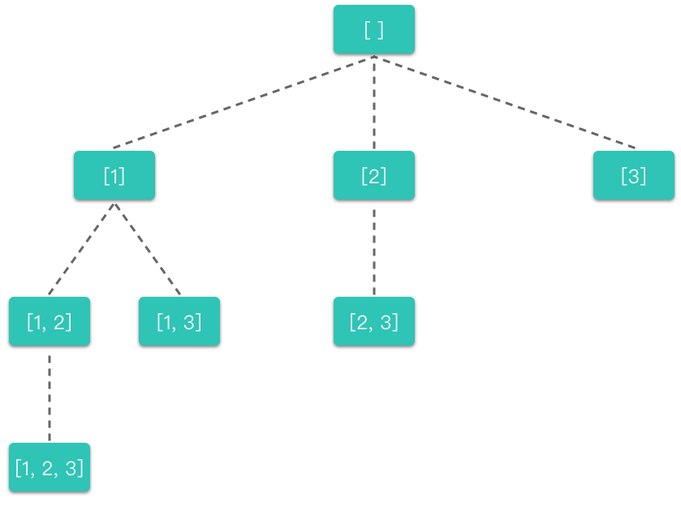

# 4.回溯算法

## 1.回溯算法

### 1.1 简介

> **回溯算法（Backtracking）**：一种能避免不必要搜索的穷举式的搜索算法。采用试错的思想，在搜索尝试过程中寻找问题的解，当探索到某一步时，发现原先的选择并不满足求解条件，或者还需要满足更多求解条件时，就退回一步（回溯）重新选择，这种走不通就退回再走的技术称为「回溯法」，而满足回溯条件的某个状态的点称为「回溯点」。

简单来说，回溯算法采用了一种 **「****走不通就回退****」** 的算法思想。

回溯算法通常用简单的递归方法来实现，在进行回溯过程中更可能会出现两种情况：

1.  找到一个可能存在的正确答案；
2.  在尝试了所有可能的分布方法之后宣布该问题没有答案。

### 1.2 以全排列理解回溯算法

全排列的回溯过程：

-   **按顺序枚举每一位上可能出现的数字，之前已经出现的数字在接下来要选择的数字中不能再次出现****。** ​
-   对于每一位，进行如下几步：
    1.  **选择元素**：从可选元素列表中选择一个之前没有出现过的元素。
    2.  **递归搜索**：从选择的元素出发，一层层地递归搜索剩下位数，直到遇到边界条件时，不再向下搜索。
    3.  **撤销选择**：一层层地撤销之前选择的元素，转而进行另一个分支的搜索。直到完全遍历完所有可能的路径。

对于上述决策过程，我们也可以用一棵决策树来表示：


从全排列的决策树中我们可以看出：

-   每一层中有一个或多个不同的节点，这些节点以及节点所连接的分支代表了「不同的选择」。
-   每一个节点代表了求解全排列问题的一个「状态」，这些状态是通过「不同的值」来表现的。
-   每向下递推一层就是在「可选元素列表」中选择一个「元素」加入到「当前状态」。
-   当一个决策分支探索完成之后，会逐层向上进行回溯。
-   每向上回溯一层，就是把所选择的「元素」从「当前状态」中移除，回退到没有选择该元素时的状态（或者说重置状态），从而进行其他分支的探索。

示例代码如下：

```python
class Solution:
    def permute(self, nums: List[int]) -> List[List[int]]:
        # 存放所有符合条件结果的集合
        res = []
        # 存放当前符合条件的结果
        path = []
        def backtracking(nums):
            # 说明找到了一组符合条件的结果
            if lebn(path) == len(nums):
                # 将当前符合条件的结果放入集合中
                res.append(path[:])
                return
            
            # 枚举可选元素列表
            for i in range(len(nums)):
                # 从当前路径中没有出现的数字中选择
                if nums[i] not in path:
                    # 选择元素
                    path.append(nums[i])
                    # 递归搜索
                    backtracking(nums)
                    # 撤销选择
                    path.pop()

        backtracking(nums)

        return res
```

```c++
class Solution {
public:
    vector<vector<int>> permute(vector<int>& nums) {
        std::vector<std::vector<int>> ans;
        std::vector<int> tmp_vec;
        this->dfs(0, tmp_vec, nums, ans);
        return ans;
    }

private:
    void dfs(int curr, std::vector<int>& tmp_vec, std::vector<int>& nums, std::vector<std::vector<int>>& ans) {
        // 终止条件
        if (curr == nums.size()) {
            ans.push_back(tmp_vec);
            return;
        }

        // 处理当前层
        for (int i = 0; i < nums.size(); i++) {
            // 从当前路径中没有出现的数字中选择
            if (std::find(tmp_vec.begin(), tmp_vec.end(), nums[i]) != tmp_vec.end()) {
                continue;
            }
            // 选择元素
            tmp_vec.push_back(nums[i]);
            // 继续递归下一层
            this->dfs(curr + 1, tmp_vec, nums, ans);
            // 撤销操作
            tmp_vec.pop_back();
        }
    }
};
```

### 1.3 回溯算法通用模板

根据上文全排列的回溯算法代码，可以提炼出回溯算法的通用模板，回溯算法的通用模板代码如下所示：

```python
res = []    # 存放所欲符合条件结果的集合
path = []   # 存放当前符合条件的结果
def backtracking(nums):             # nums 为选择元素列表
    if 遇到边界条件:                  # 说明找到了一组符合条件的结果
        res.append(path[:])         # 将当前符合条件的结果放入集合中
        return

    for i in range(len(nums)):      # 枚举可选元素列表
        path.append(nums[i])        # 选择元素
        backtracking(nums)          # 递归搜索
        path.pop()                  # 撤销选择

backtracking(nums)

```

## 2.回溯算法解题步骤

回溯算法的基本思想是：**以深度优先搜索的方式，根据产生子节点的条件约束，搜索问题的解。当发现当前节点已不满足求解条件时，就「回溯」返回，尝试其他的路径****。** ​

1.  **明确所有选择**：画出搜索过程的决策树，根据决策树来确定搜索路径。
2.  **明确终止条件**：推敲出递归的终止条件，以及递归终止时的要执行的处理方法。
3.  **将决策树和终止条件翻译成代码****：** ​
    1.  定义回溯函数（明确函数意义、传入参数、返回结果等）。
    2.  书写回溯函数主体（给出约束条件、选择元素、递归搜索、撤销选择部分）。
    3.  明确递归终止条件（给出递归终止条件，以及递归终止时的处理方法）。

## 3.实战题目

### 3.1 全排列II

[47. 全排列 II - 力扣（LeetCode）](https://leetcode.cn/problems/permutations-ii/description/ "47. 全排列 II - 力扣（LeetCode）")

```纯文本
给定一个可包含重复数字的序列 nums ，按任意顺序 返回所有不重复的全排列。

 

示例 1：

输入：nums = [1,1,2]
输出：
[[1,1,2],
 [1,2,1],
 [2,1,1]]
示例 2：

输入：nums = [1,2,3]
输出：[[1,2,3],[1,3,2],[2,1,3],[2,3,1],[3,1,2],[3,2,1]]
 
```

重点如何去重！！！

可以先对数组 `nums` 进行排序，然后使用一个数组 `visited` 标记该元素在当前排列中是否被访问过。

如果未被访问过则将其加入排列中，并在访问后将该元素变为未访问状态。

然后再递归遍历下一层元素之前，增加一句语句进行判重：`if i > 0 and nums[i] == nums[i - 1] and not visited[i - 1]: continue`。

然后再进行回溯遍历。

```c++
class Solution {
public:
    vector<vector<int>> permuteUnique(vector<int>& nums) {
        m_ans.clear();
        m_tmp_vec.clear();
        std::vector<bool> visited(nums.size(), false);
        sort(nums.begin(), nums.end());
        // 排序
        this->dfs(0, nums, visited);
        return m_ans;
    }
private:
    void dfs(int curr, std::vector<int>& nums, std::vector<bool>& visited) {
        // 终止条件
        if (curr == nums.size()) {
            m_ans.push_back(m_tmp_vec);
            return;
        }

        // 处理当前层
        for (int i = 0; i < nums.size(); i++) {
            // 1.当前结点访问过
            // 2.跳过重复元素
            if (visited[i] || (i > 0 && nums[i] == nums[i - 1]) && !visited[i-1]) {
                continue;
            }
            visited[i] = true;
            // 选择元素
            m_tmp_vec.push_back(nums[i]);
            // 继续递归下一层
            this->dfs(curr + 1, nums, visited);
            // 撤销操作
            m_tmp_vec.pop_back();
            visited[i] = false;
        }
    }

    std::vector<std::vector<int>> m_ans;
    std::vector<int> m_tmp_vec;
};
```

### 3.2 括号生成

[22. 括号生成 - 力扣（LeetCode）](https://leetcode.cn/problems/generate-parentheses/description/ "22. 括号生成 - 力扣（LeetCode）")

```纯文本
数字 n 代表生成括号的对数，请你设计一个函数，用于能够生成所有可能的并且 有效的 括号组合。


示例 1：

输入：n = 3
输出：["((()))","(()())","(())()","()(())","()()()"]
示例 2：

输入：n = 1
输出：["()"]
```

递归：

-   左括号：随时添加，只要不超标
-   右括号：必须之前有左括号，且左括号个数 > 右括号个数

```c++
class Solution {
public:
    // 递归
    // 左括号: 随时加，只要不超标
    // 右括号 : 必须之前有左括号，且左括号个数 > 右括号个数
    vector<string> generateParenthesis(int n) {
        std::vector<std::string> ans;
        std::string tmp_str;

        this->dfs(0, 0, n, tmp_str, ans);

        return ans;
    }

    void dfs(int left, int right, int n, std::string tmp_str, std::vector<std::string>& ans) {
        // 终止条件
        if (left == n && right == n) {
            ans.push_back(tmp_str);
            // std::cout << "left: " << left << " " << tmp_str << std::endl;
            return;
        }

        // 递归处理
        if (left < n) {
            this->dfs(left + 1, right, n, tmp_str + "(", ans);
        }

        if (left > right) {
            this->dfs(left, right + 1, n, tmp_str + ")", ans);
        }
    }
};
```

### 3.3 电话号码的字母组合

[17. 电话号码的字母组合 - 力扣（LeetCode）](https://leetcode.cn/problems/letter-combinations-of-a-phone-number/description/ "17. 电话号码的字母组合 - 力扣（LeetCode）")

```纯文本
给定一个仅包含数字 2-9 的字符串，返回所有它能表示的字母组合。答案可以按 任意顺序 返回。

给出数字到字母的映射如下（与电话按键相同）。注意 1 不对应任何字母。

示例 1：

输入：digits = "23"
输出：["ad","ae","af","bd","be","bf","cd","ce","cf"]
示例 2：

输入：digits = ""
输出：[]

```

用哈希表保存每个数字键位对应的所有可能的字母，然后进行回溯操作。

回溯过程中，维护一个字符串 combination，表示当前的字母排列组合。初始字符串为空，每次取电话号码的一位数字，从哈希表中取出该数字所对应的所有字母，并将其中一个插入到 combination 后面，然后继续处理下一个数字，知道处理完所有数字，得到一个完整的字母排列。开始进行回退操作，遍历其余的字母排列。

```c++
class Solution {
public:
    vector<string> letterCombinations(string digits) {
        if (digits.size() == 0) {
            return {};
        }
        std::vector<std::string> ans;

        std::unordered_map<char, std::string> map{
            {'2', "abc"},
            {'3', "def"},
            {'4', "ghi"},
            {'5', "jkl"},
            {'6', "mno"},
            {'7', "pqrs"},
            {'8', "tuv"},
            {'9', "wxyz"}
        };

        this->search("", digits, 0, ans, map);

        return ans;
    }
private:
    void search(std::string s, std::string& digits, int idx, std::vector<std::string>& ans,
        std::unordered_map<char, std::string>& map) {
        // 1.终止条件
        if (idx == digits.size()) {
            ans.push_back(s);
            return;
        }

        // 处理当前层
        std::string letters = map.at(digits[idx]);
        for (int i = 0; i < letters.size(); i++) {
            this->search(s + letters[i], digits, idx + 1, ans, map);
        }
    }
};
```

### 3.4 组合总和

[39. 组合总和 - 力扣（LeetCode）](https://leetcode.cn/problems/combination-sum/description/ "39. 组合总和 - 力扣（LeetCode）")

```纯文本
给你一个 无重复元素 的整数数组 candidates 和一个目标整数 target ，找出 candidates 中可以使数字和为目标数 target 的 所有 不同组合 ，并以列表形式返回。你可以按 任意顺序 返回这些组合。

candidates 中的 同一个 数字可以 无限制重复被选取 。如果至少一个数字的被选数量不同，则两种组合是不同的。 

对于给定的输入，保证和为 target 的不同组合数少于 150 个。

 

示例 1：

输入：candidates = [2,3,6,7], target = 7
输出：[[2,2,3],[7]]
解释：
2 和 3 可以形成一组候选，2 + 2 + 3 = 7 。注意 2 可以使用多次。
7 也是一个候选， 7 = 7 。
仅有这两种组合。
```

```c++
class Solution {
public:
    vector<vector<int>> combinationSum(vector<int>& candidates, int target) {
        std::vector<std::vector<int>> ans;
        std::vector<int> tmp_vec;
        if (candidates.size() == 0) {
            return ans;
        }

        // 排序，方便后续剪枝
        std::sort(candidates.begin(), candidates.end());

        this->dfs(0, candidates, target, tmp_vec, ans);
        return ans;
    }

    void dfs(int curr, std::vector<int>& candidates, int target, 
        std::vector<int> tmp_vec, std::vector<std::vector<int>>& ans) {
        // 终止条件，等于0，因为小于0的被剪枝完了
        if (target == 0) {
            ans.push_back(tmp_vec);
            return;
        } else if (target < 0) {
            return;
        }

        for (int i = curr; i < candidates.size(); i++) {
            // 因为数组提前排序了，这儿可以直接剪枝
            if (target - candidates[i] < 0) {
                break;
            }

            tmp_vec.push_back(candidates[i]);
            this->dfs(i, candidates, target - candidates[i], tmp_vec, ans);
            tmp_vec.pop_back();
        }
    }
};
```

### 3.5 组合总和Ⅱ

[40. 组合总和 II - 力扣（LeetCode）](https://leetcode.cn/problems/combination-sum-ii/description/ "40. 组合总和 II - 力扣（LeetCode）")

```纯文本
给定一个候选人编号的集合 candidates 和一个目标数 target ，找出 candidates 中所有可以使数字和为 target 的组合。

candidates 中的每个数字在每个组合中只能使用 一次 。

注意：解集不能包含重复的组合。 

 

示例 1:

输入: candidates = [10,1,2,7,6,1,5], target = 8,
输出:
[
[1,1,6],
[1,2,5],
[1,7],
[2,6]
]
```

关键在于去重

在回溯遍历的时候，下一层递归的 `curr_index` 要从当前节点的后一位开始遍历，即 `i + 1` 位开始。而且统一递归层不能使用相同的元素，即需要增加一句判断 `if i > start_index and candidates[i] == candidates[i - 1]: continue`。

```c++
class Solution {
public:
    vector<vector<int>> combinationSum2(vector<int>& candidates, int target) {
        std::vector<std::vector<int>> ans;
        std::vector<int> tmp_vec;
        if (candidates.size() == 0) {
            return ans;
        }

        // 排序，方便后续剪枝
        std::sort(candidates.begin(), candidates.end());

        this->dfs(0, candidates, target, tmp_vec, ans);
        return ans;
    }

    void dfs(int curr, std::vector<int>& candidates, int target, 
        std::vector<int> tmp_vec, std::vector<std::vector<int>>& ans) {
        // 终止条件，等于0，因为小于0的被剪枝完了
        if (target == 0) {
            ans.push_back(tmp_vec);
            return;
        } else if (target < 0 || curr >= candidates.size()) {
            return;
        }

        for (int i = curr; i < candidates.size(); i++) {
            // 因为数组提前排序了，这儿可以直接剪枝
            if (target - candidates[i] < 0) {
                break;
            }
            // 去重
            if (i > curr && candidates[i] == candidates[i - 1]) {
                continue;
            }

            tmp_vec.push_back(candidates[i]);
            this->dfs(i + 1, candidates, target - candidates[i], tmp_vec, ans);
            tmp_vec.pop_back();
        }
    }
};
```

### 3.6 子集

[78. 子集 - 力扣（LeetCode）](https://leetcode.cn/problems/subsets/description/ "78. 子集 - 力扣（LeetCode）")

```text
给你一个整数数组 nums ，数组中的元素 互不相同 。返回该数组所有可能的子集（幂集）。

解集 不能 包含重复的子集。你可以按 任意顺序 返回解集。


示例 1：

输入：nums = [1,2,3]
输出：[[],[1],[2],[1,2],[3],[1,3],[2,3],[1,2,3]]
```

数组的每个元素都有两个选择：选与不选。可以通过向当前子集数组中添加可选元素来表示选择该元素。也可以在当前递归结束之后，将之前添加的元素从当前子集数组中移除（也就是回溯）来表示不选择该元素。



```c++
class Solution {
public:
    vector<vector<int>> subsets(vector<int>& nums) {
        std::vector<std::vector<int>> ans;
        std::vector<int> tmp_vec;
        if (nums.size() == 0) {
            return ans;
        }

        this->dfs(0, nums, tmp_vec, ans);

        return ans;
    }

    void dfs(int curr, std::vector<int>& nums, std::vector<int> tmp_vec, 
        std::vector<std::vector<int>>& ans) {
        if (curr == nums.size()) {
            ans.push_back(tmp_vec);
            return;
        }

        // 不选择当前结点
        this->dfs(curr + 1, nums, tmp_vec, ans);

        // 选择当前结点值
        tmp_vec.push_back(nums[curr]);
        this->dfs(curr + 1, nums, tmp_vec, ans);
        tmp_vec.pop_back();
    }
};

```

### 3.7 子集Ⅱ

[90. 子集 II - 力扣（LeetCode）](https://leetcode.cn/problems/subsets-ii/description/ "90. 子集 II - 力扣（LeetCode）")

```纯文本
给你一个整数数组 nums ，其中可能包含重复元素，请你返回该数组所有可能的子集（幂集）。

解集 不能 包含重复的子集。返回的解集中，子集可以按 任意顺序 排列。


示例 1：

输入：nums = [1,2,2]
输出：[[],[1],[1,2],[1,2,2],[2],[2,2]]
示例 2：

输入：nums = [0]
输出：[[],[0]]
```

数组的每个元素都有两个选择：选与不选。

**可以通过向当前子集数组中添加可选元素来表示选择该元素**。**也可以在当前递归结束之后，将之前添加的元素从当前子集数组中移除（也就是回溯）来表示不选择该元素**。

因为数组中可能包含重复元素，所以可以先将数组排序，然后在回溯时，判断当前元素是否和上一个元素相同，如果相同，则直接跳过，从而去除重复元素。

```c++
class Solution {
public:
    vector<vector<int>> subsetsWithDup(vector<int>& nums) {
        std::vector<std::vector<int>> ans;
        std::vector<int> tmp_vec;
        if (nums.size() == 0) {
            return ans;
        }
        // 排序，用于后续剪枝
        std::sort(nums.begin(), nums.end());

        this->dfs(0, nums, tmp_vec, ans);

        return ans;
    }

    void dfs(int curr, std::vector<int>& nums, std::vector<int> tmp_vec, 
        std::vector<std::vector<int>>& ans) {
        // 加入结果中
        ans.push_back(tmp_vec);

        for (int i = curr; i < nums.size(); i++) {
            // 去重
            if (i > curr && nums[i] == nums[i - 1]) {
                continue;
            }
            // 可以通过向当前子集数组中添加可选元素来表示选择该元素。
            // 也可以在当前递归结束之后，
            // 将之前添加的元素从当前子集数组中移除（也就是回溯）来表示不选择该元素。
            tmp_vec.push_back(nums[i]);
            this->dfs(i + 1, nums, tmp_vec, ans);
            tmp_vec.pop_back();
        }
    }
};
```

### 3.8 单词搜索

[79. 单词搜索 - 力扣（LeetCode）](https://leetcode.cn/problems/word-search/description/ "79. 单词搜索 - 力扣（LeetCode）")

```纯文本
给定一个 m x n 二维字符网格 board 和一个字符串单词 word 。如果 word 存在于网格中，返回 true ；否则，返回 false 。

单词必须按照字母顺序，通过相邻的单元格内的字母构成，其中“相邻”单元格是那些水平相邻或垂直相邻的单元格。同一个单元格内的字母不允许被重复使用。

输入：board = [["A","B","C","E"],["S","F","C","S"],["A","D","E","E"]], word = "ABCCED"
输出：true

```

-   **递归参数**： 当前元素在矩阵 `board `中的行列索引 `i` 和 `j` ，当前目标字符在 word 中的索引 `word_idx `。
-   **终止条件**：
    1.  返回 `false `： (1) 行或列索引越界 或 (2) 当前矩阵元素与目标字符不同  。
    2.  返回 `true `：字符串 word 已全部匹配。
-   **递推工作**：
    1.  标记当前矩阵元素： 将` board[i][j]` 修改为 空字符 `'\0'` ，代表此元素已访问过，防止之后搜索时重复访问。
    2.  搜索下一单元格： 朝当前元素的 上、下、左、右 四个方向开启下层递归，使用 或 连接 （代表只需找到一条可行路径就直接返回，不再做后续 DFS ），并记录结果至 res 。
        还原当前矩阵元素： 将 `board[i][j]` 元素还原至初始值。
-   **返回值**： 返回布尔量 `res `，代表是否搜索到目标字符串。

```c++
class Solution {
public:
    bool exist(vector<vector<char>>& board, string word) {
        m_board = board;
        m_word = word;

        for (int i = 0; i < m_board.size(); i++) {
            for (int j = 0; j < m_board[i].size(); j++) {
                if (this->dfs(i, j, 0)) {
                    return true;
                }
            }
        }

        return false;
    }

private:
    // 方向
    int m_dx[4] = {-1, 1, 0, 0};
    int m_dy[4] = {0, 0, -1, 1};

    std::vector<std::vector<char>> m_board;
    std::string m_word;

    bool dfs(int i, int j, int word_idx) {
        // 终止条件
        // 1.行列越界
        // 2.当前矩阵元素与目标元素不同
        if (i < 0 || i >= m_board.size() 
            || j < 0 || j >= m_board[i].size() 
            || m_board[i][j] != m_word[word_idx]) {
            return false;
        }
        // 3.字符串 word 已全部匹配
        if (word_idx == m_word.size() - 1) {
            return true;
        }

        bool res = false;
        m_board[i][j] = '\0';
        for (int k = 0; k < 4; k++) {
            int x = i + m_dx[k];
            int y = j + m_dy[k];

            res = res || this->dfs(x, y, word_idx + 1);
        }

        m_board[i][j] = m_word[word_idx];

        return res;
    }

};
```
