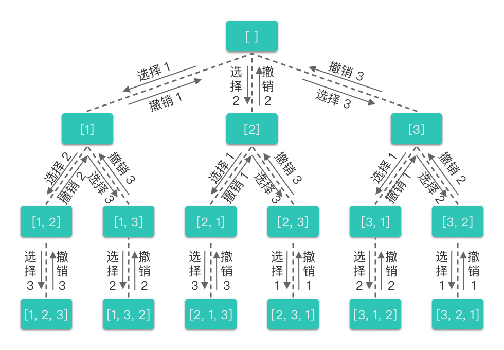

# 4.回溯算法

## 1.回溯算法

### 1.1 简介

> **回溯算法（Backtracking）**：一种能避免不必要搜索的穷举式的搜索算法。采用试错的思想，在搜索尝试过程中寻找问题的解，当探索到某一步时，发现原先的选择并不满足求解条件，或者还需要满足更多求解条件时，就退回一步（回溯）重新选择，这种走不通就退回再走的技术称为「回溯法」，而满足回溯条件的某个状态的点称为「回溯点」。

简单来说，回溯算法采用了一种 **「****走不通就回退****」** 的算法思想。

回溯算法通常用简单的递归方法来实现，在进行回溯过程中更可能会出现两种情况：

1.  找到一个可能存在的正确答案；
2.  在尝试了所有可能的分布方法之后宣布该问题没有答案。

### 1.2 以全排列理解回溯算法

全排列的回溯过程：

-   **按顺序枚举每一位上可能出现的数字，之前已经出现的数字在接下来要选择的数字中不能再次出现****。** ​
-   对于每一位，进行如下几步：
    1.  **选择元素**：从可选元素列表中选择一个之前没有出现过的元素。
    2.  **递归搜索**：从选择的元素出发，一层层地递归搜索剩下位数，直到遇到边界条件时，不再向下搜索。
    3.  **撤销选择**：一层层地撤销之前选择的元素，转而进行另一个分支的搜索。直到完全遍历完所有可能的路径。

对于上述决策过程，我们也可以用一棵决策树来表示：



从全排列的决策树中我们可以看出：

-   每一层中有一个或多个不同的节点，这些节点以及节点所连接的分支代表了「不同的选择」。
-   每一个节点代表了求解全排列问题的一个「状态」，这些状态是通过「不同的值」来表现的。
-   每向下递推一层就是在「可选元素列表」中选择一个「元素」加入到「当前状态」。
-   当一个决策分支探索完成之后，会逐层向上进行回溯。
-   每向上回溯一层，就是把所选择的「元素」从「当前状态」中移除，回退到没有选择该元素时的状态（或者说重置状态），从而进行其他分支的探索。

示例代码如下：

```python
class Solution:
    def permute(self, nums: List[int]) -> List[List[int]]:
        # 存放所有符合条件结果的集合
        res = []
        # 存放当前符合条件的结果
        path = []
        def backtracking(nums):
            # 说明找到了一组符合条件的结果
            if lebn(path) == len(nums):
                # 将当前符合条件的结果放入集合中
                res.append(path[:])
                return
            
            # 枚举可选元素列表
            for i in range(len(nums)):
                # 从当前路径中没有出现的数字中选择
                if nums[i] not in path:
                    # 选择元素
                    path.append(nums[i])
                    # 递归搜索
                    backtracking(nums)
                    # 撤销选择
                    path.pop()

        backtracking(nums)

        return res
```
