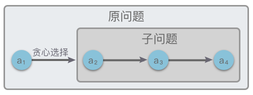
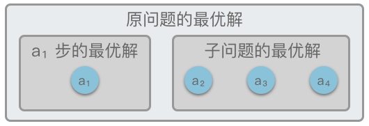
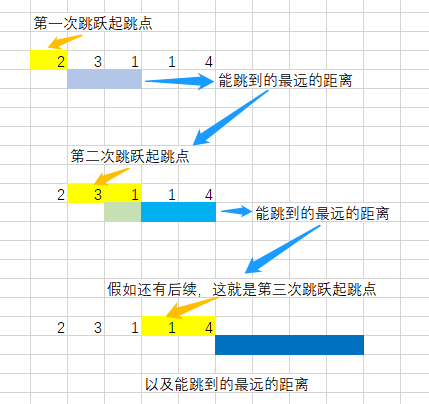

# 5.贪心算法

## 1.贪心算法

### 1.1 简介

> **贪心算法（Greedy Algorithm）**：一种在每次决策时，**总是采取在当前状态下的最好选择**，从而希望导致结果是最好或最优的算法。

贪心算法是一种改进的「分步解决算法」，其核心思想是：将求解过程分成「若干个步骤」，然后根据题意选择一种「度量标准」，每个步骤都应用「贪心原则」，选取当前状态下「最好 / 最优选择（局部最优解）」，并以此希望最后得出的结果也是「最好 / 最优结果（全局最优解）」。

### 1.2 贪心算法特征

对许多问题来说，可以使用贪心算法，通过局部最优解而得到整体最优解或者是整体最优解的近似解。但并不是所有问题，都可以使用贪心算法的。

一般来说，这些能够使用贪心算法解决的问题必须满足下面的两个特征：

1.  **贪⼼选择性质**
2.  **最优子结构**

#### （1）贪心选择性质

> **贪心选择性质**：指的是一个问题的全局最优解可以通过一系列局部最优解（贪心选择）来得到。

换句话说，当进行选择时，**直接做出在当前问题中看来最优的选择，而不用去考虑子问题的解**。在做出选择之后，才会去求解剩下的子问题，如下图所示。



#### （4）最优子结构性质

> **最优子结构性质**：指的是**一个问题的最优解包含其子问题的最优解**。

问题的最优子结构性质是该问题能否用贪心算法求解的关键。



在做了贪心选择后，满足最优子结构性质的原问题可以分解成规模更小的类似子问题来解决，并且可以通过贪心选择和子问题的最优解推导出问题的最优解。

反之，如果不能利用子问题的最优解推导出整个问题的最优解，那么这种问题就不具有最优子结构。

## 2.贪心算法步骤

1.  **转换问题**：将优化问题转换为具有贪心选择性质的问题，即先做出选择，再解决剩下的一个子问题。
2.  **贪心选择性质**：根据题意选择一种度量标准，制定贪心策略，选取当前状态下「最好 / 最优选择」，从而得到局部最优解。
3.  **最优子结构性质**：根据上一步制定的贪心策略，将贪心选择的局部最优解和子问题的最优解合并起来，得到原问题的最优解。

## 3.实战题目

### 3.1 分发饼干

[455. 分发饼干 - 力扣（LeetCode）](https://leetcode.cn/problems/assign-cookies/description/ "455. 分发饼干 - 力扣（LeetCode）")

```纯文本
假设你是一位很棒的家长，想要给你的孩子们一些小饼干。但是，每个孩子最多只能给一块饼干。

对每个孩子 i，都有一个胃口值 g[i]，这是能让孩子们满足胃口的饼干的最小尺寸；并且每块饼干 j，都有一个尺寸 s[j] 。如果 s[j] >= g[i]，我们可以将这个饼干 j 分配给孩子 i ，这个孩子会得到满足。你的目标是尽可能满足越多数量的孩子，并输出这个最大数值。

 
示例 1:

输入: g = [1,2,3], s = [1,1]
输出: 1
解释: 
你有三个孩子和两块小饼干，3个孩子的胃口值分别是：1,2,3。
虽然你有两块小饼干，由于他们的尺寸都是1，你只能让胃口值是1的孩子满足。
所以你应该输出1。
```

贪心算法，排序后，遍历满足

```c++
class Solution {
public:
    // 贪心算法，先排序，然后匹配两个升序数组
    int findContentChildren(vector<int>& g, vector<int>& s) {
        int ans = 0;
        if (g.size() == 0 || s.size() == 0) {
            return ans;
        }

        // 排序 
        std::sort(g.begin(), g.end());
        std::sort(s.begin(), s.end());

        // 遍历，匹配两个升序数组
        for (int i = 0, j = 0; i < g.size() && j < s.size(); ) {
            // 可以满足胃口，把饼干喂给小朋友
            if (g[i] <= s[j]) {
                ans++;

                i++;
                j++;
            } else {
                // 不满足胃口，看下一块
                j++;
            }
        }

        return ans;
    }
};
```

### 3.2 柠檬水找零

[860. 柠檬水找零 - 力扣（LeetCode）](https://leetcode.cn/problems/lemonade-change/description/ "860. 柠檬水找零 - 力扣（LeetCode）")

```纯文本
在柠檬水摊上，每一杯柠檬水的售价为 5 美元。顾客排队购买你的产品，（按账单 bills 支付的顺序）一次购买一杯。

每位顾客只买一杯柠檬水，然后向你付 5 美元、10 美元或 20 美元。你必须给每个顾客正确找零，也就是说净交易是每位顾客向你支付 5 美元。

注意，一开始你手头没有任何零钱。

给你一个整数数组 bills ，其中 bills[i] 是第 i 位顾客付的账。如果你能给每位顾客正确找零，返回 true ，否则返回 false 。

 

示例 1：

输入：bills = [5,5,5,10,20]
输出：true
解释：
前 3 位顾客那里，我们按顺序收取 3 张 5 美元的钞票。
第 4 位顾客那里，我们收取一张 10 美元的钞票，并返还 5 美元。
第 5 位顾客那里，我们找还一张 10 美元的钞票和一张 5 美元的钞票。
由于所有客户都得到了正确的找零，所以我们输出 true。
```

分情况讨论，直接模拟就行

```c++
class Solution {
public:
    bool lemonadeChange(vector<int>& bills) {
        int five = 0;
        int ten = 0;
        for (auto& bill : bills) {
            if (bill == 5) {
                five++;
            } else if (bill == 10) {
                if (five == 0) {
                    return false;
                }
                five--;
                ten++;
            } else {
                if (five > 0 && ten > 0) {
                    five--;
                    ten--;
                } else if (five >= 3) {
                    five -= 3;
                } else {
                    return false;
                }
            }
        }

        return true;
    }
};
```

### 3.3 分发糖果

[135. 分发糖果 - 力扣（LeetCode）](https://leetcode.cn/problems/candy/description/ "135. 分发糖果 - 力扣（LeetCode）")

```纯文本
n 个孩子站成一排。给你一个整数数组 ratings 表示每个孩子的评分。

你需要按照以下要求，给这些孩子分发糖果：

每个孩子至少分配到 1 个糖果。
相邻两个孩子评分更高的孩子会获得更多的糖果。
请你给每个孩子分发糖果，计算并返回需要准备的 最少糖果数目 。


示例 1：

输入：ratings = [1,0,2]
输出：5
解释：你可以分别给第一个、第二个、第三个孩子分发 2、1、2 颗糖果。
```

「每个孩子至少得 1 个糖果」：说明糖果数目至少为 N 个。

「评分更高的孩子必须比他两侧相邻位置上的孩子分得更多的糖果」：可以看做为以下两种条件：

-   左规则：当 $ratings[i - 1] < ratings[i]$ 时，第 i 个孩子的糖果数量比第 $i - 1$ 个孩子的糖果数量多；
-   右规则当 $ratings[i] > ratings[i + 1]$ 时，第 i 个孩子的糖果数量比第$i + 1$ 个孩子的糖果数量多。

根据以上信息，可以设定一个长度为 N 的数组 sweets 来表示每个孩子分得的最少糖果数，初始每个孩子分得糖果数都为 1。

然后遍历两遍数组，第一遍遍历满足当 $ratings[i - 1] < ratings[i]$ 时，第 $i$ 个孩子的糖果数量比第 $i - 1$ 个孩子的糖果数量多 $1$ 个。第二遍遍历满足当 $ratings[i] > ratings[i + 1]$ 时，第 $i$ 个孩子的糖果数量取「第 $i + 1$ 个孩子的糖果数量多 $1$ 个」和「第 $i + 1$ 个孩子目前拥有的糖果数量」中的最大值。

然后再遍历求所有孩子的糖果数量和即为答案。

```c++
class Solution {
public:
    // 两次遍历，分别处理
    // 左规则：当 ratings[i−1]<ratings[i] 时，i 号学生的糖果数量将比i − 1 号孩子的糖果数量多。
    // 右规则：当 ratings[i]>ratings[i+1]时，i 号学生的糖果数量将比 i + 1 号孩子的糖果数量多。
    int candy(vector<int>& ratings) {
        int n = ratings.size();
        // 初始化，人手最少一个
        std::vector<int> sweets(n, 1);
        
        // 第一遍遍历，左规则
        for (int i = 1; i < n; i++) {
            if (ratings[i] > ratings[i - 1]) {
                sweets[i] = sweets[i - 1] + 1;
            }
        }

        // 第二次遍历，右规则
        for (int i = n - 2; i >= 0; i--) {
            if (ratings[i] > ratings[i + 1]) {
                sweets[i] = std::max(sweets[i], sweets[i + 1] + 1);
            }
        }

        // 求和返回
        return std::accumulate(sweets.begin(), sweets.end(), 0);
    }
};
```

### 3.4 跳跃游戏

[55. 跳跃游戏 - 力扣（LeetCode）](https://leetcode.cn/problems/jump-game/description/ "55. 跳跃游戏 - 力扣（LeetCode）")

```纯文本
给你一个非负整数数组 nums ，你最初位于数组的 第一个下标 。数组中的每个元素代表你在该位置可以跳跃的最大长度。

判断你是否能够到达最后一个下标，如果可以，返回 true ；否则，返回 false 。

 

示例 1：

输入：nums = [2,3,1,1,4]
输出：true
解释：可以先跳 1 步，从下标 0 到达下标 1, 然后再从下标 1 跳 3 步到达最后一个下标。
```

贪心算法，从后往前贪心

当前跳跃步数如果能大于当前位置到终点的距离，更新终点，继续便利

```c++
class Solution {
public:
    // 贪心算法，从后往前贪心
    bool canJump(vector<int>& nums) {
        if (nums.size() == 0) {
            return false;
        }

        int end_reachable = nums.size() - 1;
        // 从前往后贪心，
        // 当前跳跃步数如果能大于当前位置到终点的距离，更新终点，继续便利
        for (int i = nums.size() - 1; i >= 0; i--) {
            if (nums[i] + i >= end_reachable) {
                end_reachable = i;
            }
        }

        return end_reachable == 0;
    }
};
```

动态规划

动态定义：dp\[i]：从位置0出发，在i个位置，可以跳出的最远距离

状态转移方程：

-   如果能通过 $0 \sim i - 1$ 个位置到达 $i$，即 $dp[i-1] \le i$，则 $dp[i] = max(dp[i-1], i + nums[i])$。
-   如果不能通过 $0 \sim i - 1$ 个位置到达 $i$，即 $dp[i - 1] < i$，则 $dp[i] = dp[i - 1]$。

初始状态下，从 $0$ 出发，经过 $0$，可以跳出的最远距离为 `nums[0]`，即 `dp[0] = nums[0]`。

```c++
class Solution {
public:
    // 2.动态规划
    bool canJump(vector<int>& nums) {
        std::vector<int> dp(nums.size(), 0);
        dp[0] = nums[0];

        for (int i = 1; i < nums.size(); i++) {
            if (i <= dp[i - 1]) {
                dp[i] = std::max(dp[i - 1], i + nums[i]);
            } else {
                dp[i] = dp[i - 1];
            }
        }

        return dp[nums.size() - 1] >= nums.size() - 1;
    }
};
```

### 3.5 跳跃游戏Ⅱ

[45. 跳跃游戏 II - 力扣（LeetCode）](https://leetcode.cn/problems/jump-game-ii/description/ "45. 跳跃游戏 II - 力扣（LeetCode）")

```纯文本
给定一个长度为 n 的 0 索引整数数组 nums。初始位置为 nums[0]。

每个元素 nums[i] 表示从索引 i 向前跳转的最大长度。换句话说，如果你在 nums[i] 处，你可以跳转到任意 nums[i + j] 处:

- 0 <= j <= nums[i] 
- i + j < n

返回到达 nums[n - 1] 的最小跳跃次数。生成的测试用例可以到达 nums[n - 1]。

 

示例 1:

输入: nums = [2,3,1,1,4]
输出: 2
解释: 跳到最后一个位置的最小跳跃数是 2。
     从下标为 0 跳到下标为 1 的位置，跳 1 步，然后跳 3 步到达数组的最后一个位置。
```

1.  如果某一个作为 起跳点 的格子可以跳跃的距离是 3，那么表示后面 3 个格子都可以作为 起跳点。**可以对每一个能作为 起跳点 的格子都尝试跳一次，把 能跳到最远的距离 不断更新**。
2.  如果从这个 起跳点 起跳叫做第 1 次 跳跃，那么从后面 3 个格子起跳 都 可以叫做第 2 次 跳跃。所以，当一次 跳跃 结束时，从下一个格子开始，到现在 能跳到最远的距离，都 是下一次 跳跃 的 起跳点。
3.  对每一次 跳跃 用 for 循环来模拟。
    1.  跳完一次之后，更新下一次 起跳点 的范围。
    2.  在新的范围内跳，更新 能跳到最远的距离。
4.  记录 跳跃 次数，如果跳到了终点，就得到了结果。



```c++
class Solution {
public:
    int jump(vector<int>& nums) {
        int ans = 0;
        // 起跳点
        int start = 0;
        // 下次起跳点开始位置
        int end = 1;

        while (end < nums.size()) {
            int max_pos = 0;
            // 选择能跳到的最远位置
            for (int i = start; i < end; i++) {
                max_pos = std::max(max_pos, i + nums[i]);
            }

            // 更新位置
            // 下次起跳点开始位置
            start = end;
            // 下次起跳点结束位置
            end = max_pos + 1;

            ans++;
        }

        return ans;
    }
};
```

### 3.6 救生艇

[881. 救生艇 - 力扣（LeetCode）](https://leetcode.cn/problems/boats-to-save-people/description/ "881. 救生艇 - 力扣（LeetCode）")

```纯文本
给定数组 people 。people[i]表示第 i 个人的体重 ，船的数量不限，每艘船可以承载的最大重量为 limit。

每艘船最多可同时载两人，但条件是这些人的重量之和最多为 limit。

返回 承载所有人所需的最小船数 。

 

示例 1：

输入：people = [1,2], limit = 3
输出：1
解释：1 艘船载 (1, 2)

示例 2：

输入：people = [3,2,2,1], limit = 3
输出：3
解释：3 艘船分别载 (1, 2), (2) 和 (3)

```

贪心算法 + 双指针：让最重的和最轻的人一起走。这样一只船就可以尽可能的带上两个人

1.  先对数组进行升序排序，使用 `ans` 记录所需最小船数。
2.  使用两个指针 `left`、`right`。`left` 指向数组开始位置，`right` 指向数组结束位置。
3.  判断 `people[left]` 和 `people[right]` 加一起是否超重。
    1.  如果 `people[left] + people[right] > limit`，则让重的人上船，船数量 + 1，令 `right` 左移，继续判断。
    2.  如果 `people[left] + people[right] <= limit`，则两个人都上船，船数量 + 1，并令 `left` 右移，`right` 左移，继续判断。
4.  如果 `lefft == right`，则让最后一个人上船，船数量 + 1。并返回答案。

```c++
class Solution {
public:
    // 贪心算法 + 双指针
    // 排序后，让最最重的和最轻的先走
    int numRescueBoats(vector<int>& people, int limit) {
        // 排序
        std::sort(people.begin(), people.end());
        int left = 0;
        int right = people.size() - 1;
        int ans = 0;

        while (left < right) {
            if (people[left] + people[right] > limit) {
                right--;
            } else {
                left++;
                right--;
            }
            ans++;
        }
        // 处理最后一个
        if (left == right) {
            ans++;
        }

        return ans;
    }
};
```

### 3.7 无重叠区间

[435. 无重叠区间 - 力扣（LeetCode）](https://leetcode.cn/problems/non-overlapping-intervals/description/ "435. 无重叠区间 - 力扣（LeetCode）")

```c++
给定一个区间的集合 intervals ，其中 intervals[i] = [starti, endi] 。返回 需要移除区间的最小数量，使剩余区间互不重叠 。

 

示例 1:

输入: intervals = [[1,2],[2,3],[3,4],[1,3]]
输出: 1
解释: 移除 [1,3] 后，剩下的区间没有重叠。
示例 2:

输入: intervals = [ [1,2], [1,2], [1,2] ]
输出: 2
解释: 你需要移除两个 [1,2] 来使剩下的区间没有重叠。
```

转换思维：求所有区间中不重叠区间最多个数

从贪心算法的角度来考虑，**应该将区间按照结束时间排序。每次选择结束时间最早的区间**，然后再在剩下的时间内选出最多的区间。

1.  将区间集合按照结束坐标升序排列，然后维护两个变量，一个是当前不重叠区间的结束时间 `end_pos`，另一个是不重叠区间的个数 `count`。初始情况下，结束坐标 `end_pos` 为第一个区间的结束坐标，`count` 为 `1`。
2.  依次遍历每段区间。对于每段区间：`intervals[i]`：如果 `end_pos <= intervals[i][0]`，即 `end_pos` 小于等于区间起始位置，则说明出现了不重叠区间，令不重叠区间数 `count` 加 `1`，`end_pos` 更新为新区间的结束位置。
3.  最终返回「总区间个数 - 不重叠区间的最多个数」即 `len(intervals) - count` 作为答案。

```c++
class Solution {
public:
    int eraseOverlapIntervals(vector<vector<int>>& intervals) {
        if (intervals.size() == 0) {
            return 0;
        }

        // 按照区间结束位置排序
        std::sort(intervals.begin(), intervals.end(), [](const auto& u, const auto& v){
            return u[1] < v[1];
        });
        // 初始化结束位置
        int end_pos = intervals[0][1];
        int count = 1;

        for (int i = 1; i < intervals.size(); i++) {
            // 更新end_pos，
            if (end_pos <= intervals[i][0]) {
                count++;
                end_pos = intervals[i][1];
            }
        }

        return intervals.size() - count;
    }
};
```

### 3.8 用最少数量的箭引爆气球

[452. 用最少数量的箭引爆气球 - 力扣（LeetCode）](https://leetcode.cn/problems/minimum-number-of-arrows-to-burst-balloons/description/ "452. 用最少数量的箭引爆气球 - 力扣（LeetCode）")

```c++
有一些球形气球贴在一堵用 XY 平面表示的墙面上。墙面上的气球记录在整数数组 points ，其中points[i] = [xstart, xend] 表示水平直径在 xstart 和 xend之间的气球。你不知道气球的确切 y 坐标。

一支弓箭可以沿着 x 轴从不同点 完全垂直 地射出。在坐标 x 处射出一支箭，若有一个气球的直径的开始和结束坐标为 xstart，xend， 且满足  xstart ≤ x ≤ xend，则该气球会被 引爆 。可以射出的弓箭的数量 没有限制 。 弓箭一旦被射出之后，可以无限地前进。

给你一个数组 points ，返回引爆所有气球所必须射出的 最小 弓箭数 。

 
示例 1：

输入：points = [[10,16],[2,8],[1,6],[7,12]]
输出：2
解释：气球可以用2支箭来爆破:
-在x = 6处射出箭，击破气球[2,8]和[1,6]。
-在x = 11处发射箭，击破气球[10,16]和[7,12]。
示例 2：

输入：points = [[1,2],[3,4],[5,6],[7,8]]
输出：4
解释：每个气球需要射出一支箭，总共需要4支箭。
```

思维转换：如何寻找区间重叠最多的地方？

-   将 `points` 按结束坐标升序排序。
-   然后维护两个变量：一个是当前弓箭的坐标 `arrow_pos`、另一个是弓箭的数目 `count`。
-   为了尽可能的穿过更多的区间，所以每一支弓箭都应该尽可能的**从区间的结束位置穿过**，这样才能覆盖更多的区间。
-   初始情况下，第一支弓箭的坐标为第一个区间的结束位置，然后弓箭数为 1。然后依次遍历每段区间。
-   如果**遇到弓箭坐标小于区间起始位置的情况**，说明该弓箭不能引爆该区间对应的气球，需要用新的弓箭来射，所以弓箭数加 1，弓箭坐标也需要更新为新区间的结束位置。
-   最终返回弓箭数目。

```c++
class Solution {
public:
    // 贪心 ： 如何寻找区间重叠最多的地
    // 为了尽可能的穿过更多的区间，
    // 所以每一支弓箭都应该尽可能的从区间的结束位置穿过，这样才能覆盖更多的区间。
    int findMinArrowShots(vector<vector<int>>& points) {
        if (points.size() == 0) {
            return 0;
        }
        // 按照区间结束位置排序
        std::sort(points.begin(), points.end(), [](const auto& u, const auto& v){
            return u[1] < v[1];
        });

        // 当前弓箭的坐标 
        int arrow_pos = points[0][1];
        int count = 1;

        for (int i = 1; i < points.size(); i++) {
            // 需要更新箭，弓箭坐标也更新
            if (arrow_pos < points[i][0]) {
                count++;
                arrow_pos = points[i][1];
            }
        }

        return count;
    }
};
```

### 3.9 卡车上的最大单元数

[1710. 卡车上的最大单元数 - 力扣（LeetCode）](https://leetcode.cn/problems/maximum-units-on-a-truck/description/ "1710. 卡车上的最大单元数 - 力扣（LeetCode）")

```c++
请你将一些箱子装在 一辆卡车 上。给你一个二维数组 boxTypes ，其中 boxTypes[i] = [numberOfBoxesi, numberOfUnitsPerBoxi] ：

- numberOfBoxesi 是类型 i 的箱子的数量。
- numberOfUnitsPerBoxi 是类型 i 每个箱子可以装载的单元数量。

整数 truckSize 表示卡车上可以装载 箱子 的 最大数量 。只要箱子数量不超过 truckSize ，你就可以选择任意箱子装到卡车上。

返回卡车可以装载 单元 的 最大 总数。

 

示例 1：

输入：boxTypes = [[1,3],[2,2],[3,1]], truckSize = 4
输出：8
解释：箱子的情况如下：
- 1 个第一类的箱子，里面含 3 个单元。
- 2 个第二类的箱子，每个里面含 2 个单元。
- 3 个第三类的箱子，每个里面含 1 个单元。
可以选择第一类和第二类的所有箱子，以及第三类的一个箱子。
单元总数 = (1 * 3) + (2 * 2) + (1 * 1) = 8
```

按照每个箱子可以装载的单元数量对数组 `boxTypes` 从大到小排序。然后优先选取装载单元数量多的箱子。

1.  对数组 `boxTypes` 按照每个箱子可以**装载的单元数量从大到小**排序。使用变量 `res` 记录卡车可以装载的最大单元数量。
2.  遍历数组 `boxTypes`，对于当前种类的箱子 `box`：
    1.  如果 `truckSize > box[0]`，说明当前种类箱子可以全部装载。则答案数量加上该种箱子的单元总数，即 `box[0] * box[1]`，并且最大数量 `truckSize` 减去装载的箱子数。
    2.  如果 `truckSize <= box[0]`，说明当前种类箱子只能部分装载。则答案数量加上 `truckSize * box[1]`，并跳出循环。
3.  最后返回答案 `res`。

```c++
class Solution {
public:
    // 贪心
    // 按照每个箱子可以装载的单元数量对数组 boxTypes 从大到小排序。
    // 然后优先选取装载单元数量多的箱子。
    int maximumUnits(vector<vector<int>>& boxTypes, int truckSize) {
        if (boxTypes.size() == 0) {
            return 0;
        }

        // 按照每个箱子可以装载的单元数量从大到小排序
        std::sort(boxTypes.begin(), boxTypes.end(), [](const auto& u, const auto& v){
            return u[1] > v[1];
        });

        int res = 0;

        for (const auto& box : boxTypes) {
            // 当前种类的箱子数量少于需求数量，全部加入
            if (box[0] < truckSize) {
                res += box[0] * box[1];
                truckSize -= box[0];
            } else {
                res += truckSize * box[1];
                break;
            }
        }

        return res;
    }
};
```
