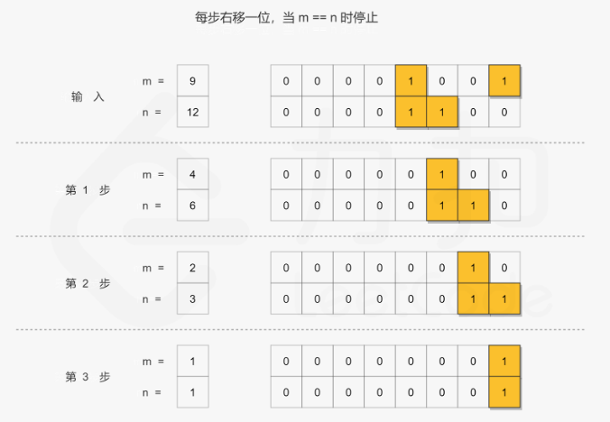

# 6.位运算

## 1.位运算

### 1.1 位运算简介

> **位运算（Bit Operation）**：在计算机内部，数是以「二进制（Binary）」的形式来进行存储。位运算就是直接对数的二进制进行计算操作，在程序中使用位运算进行操作，会大大提高程序的性能。

> **二进制数（Binary）**：由0和1两个数码来表示的数。二进制数中每一个0或每一个1都称为一个「位（Bit）」。

### 1.2 位运算基础操作

在二进制的基础上，可以对二进制数进行相应的位运算。基本的位运算共有 $6$ 种：

| 运算符  | 描述          | 规则                                                |
| ---- | ----------- | ------------------------------------------------- |
| `\|` | 按位**或**运算符  | 只要对应的两个二进位有一个为 $1$ 时，结果位就为 $1$。                   |
| `&`  | 按位**与**运算符  | 只有对应的两个二进位都为 $1$ 时，结果位才为 $1$。                     |
| `<<` | **左移**运算符   | 将二进制数的各个二进位全部左移若干位。`<<` 右侧数字指定了移动位数，高位丢弃，低位补 $0$。 |
| `>>` | **右移**运算符   | 对二进制数的各个二进位全部右移若干位。`>>` 右侧数字指定了移动位数，低位丢弃，高位补 $0$。 |
| `^`  | 按位**异或**运算符 | 对应的两个二进位相异时，结果位为 $1$，二进位相同时则结果位为 $0$。             |
| `~`  | **取反**运算符   | 对二进制数的每个二进位取反，使数字 $1$ 变为 $0$，$0$ 变为 $1$。          |

## 2.位运算应用

### 2.1 判断整数奇偶

一个整数，只要是偶数，其对应二进制数的末尾一定为 $0$；只要是奇数，其对应二进制数的末尾一定为 $1$。所以，通过与 $1$ 进行按位与运算，即可判断某个数是奇数还是偶数。

1.  `(x & 1) == 0` 为**偶数**。
2.  `(x & 1) == 1` 为**奇数**。

### 2.2 二进制数选取指定位

如果想要从一个二进制数 $X$ 中取出某几位，使取出位置上的二进位保留原值，其余位置为 $0$，则可以使用另一个二进制数 $Y$，使**该二进制数上对应取出位置为 **$1$**，其余位置为 **$0$。然后令两个数进行**按位与**运算（`X & Y`），即可得到想要的数。

举个例子，比如要取二进制数 $X = 01101010_{(2)}$ 的末尾 $4$ 位，则只需将 $X = 01101010_{(2)}$ 与 $Y = 00001111_{(2)}$ (末尾 $4$ 位为 $1$，其余位为 $0$) 进行按位与运算，即 `01101010 & 00001111 == 00001010`。其结果 $00001010$ 就是我们想要的数（即二进制数 $01101010_{(2)}$ 的末尾 $4$ 位）。

### 2.3 将指定位设置为 $1$

如果想要把一个二进制数 $X$ 中的某几位设置为 $1$，其余位置保留原值，则可以使用另一个二进制数 $Y$，使得**该二进制上对应选取位置为 **$1$**，其余位置为 **$0$。然后令两个数进行**按位或**运算（`X | Y`），即可得到想要的数。

举个例子，比想要将二进制数 $X = 01101010_{(2)}$ 的末尾 $4$ 位设置为 $1$，其余位置保留原值，则只需将 $X = 01101010_{(2)}$  与 $Y = 00001111_{(2)}$（末尾 $4$ 位为 $1$，其余位为 $0$）进行按位或运算，即 `01101010 | 00001111 = 01101111`。其结果 $01101111$ 就是我们想要的数（即将二进制数 $01101010_{(2)}$ 的末尾 $4$ 位设置为 $1$，其余位置保留原值）。

### 2.4 反转指定位

如果想要把一个二进制数 $X$ 的某几位进行反转，则可以使用另一个二进制数 $Y$，使得**该二进制上对应选取位置为 **$1$**，其余位置为 **$0$。然后令两个数进行**按位异或**运算（`X ^ Y`），即可得到想要的数。

举个例子，比如想要将二进制数 $X = 01101010_{(2)}$ 的末尾 $4$ 位进行反转，则只需将 $X = 01101010_{(2)}$ 与 $Y = 00001111_{(2)}$（末尾 $4$ 位为 $1$，其余位为 $0$）进行按位异或运算，即 `01101010 ^ 00001111 = 01100101`。其结果 $01100101$ 就是我们想要的数（即将二进制数 $X = 01101010_{(2)}$ 的末尾 $4$ 位进行反转）。

### 2.5 交换两个数

通过按位异或运算可以实现交换两个数的目的（**只能用于交换两个整数**）。

```python
a, b = 10, 20
a ^= b
b ^= a
a ^= b
print(a, b)
```

### 2.6 将二进制最右侧为 $1$ 的二进位改为 $0$

如果想要将一个二进制数 $X$ 最右侧为 $1$ 的二进制位改为 $0$，则只需通过 `X & (X - 1)`  的操作即可完成。

比如 $X = 01101100_{(2)}$，$X - 1 = 01101011_{(2)}$，则 `X & (X - 1) == 01101100 & 01101011 == 01101000`，结果为 $01101000_{(2)}$（即将 $X$ 最右侧为 $1$ 的二进制为改为 $0$）。

### 2.7 计算二进制中二进位为 $1$ 的个数

从 2.6 中得知，通过 `X & (X - 1)` 可以将二进制 $X$ 最右侧为 $1$ 的二进制位改为 $0$，那么如果我们不断通过 `X & (X - 1)` 操作，最终将二进制 $X$ 变为 $0$，并统计执行次数，则可以得到二进制中二进位为 $1$ 的个数。

具体代码如下：

```python
class Solution:
    def hammingWeight(self, n: int) -> int:
        cnt = 0
        while n:
            n = n & (n - 1)
            cnt += 1
        return cnt
```

### 2.8 判断某数是否为 $2$ 的幂次方

通过判断 `X & (X - 1) == 0`  是否成立，即可判断 $X$ 是否为 $2$ 的幂次方。

这是因为：

1.  凡是 $2$ 的幂次方，其二进制数的某一高位为 $1$，并且仅此高位为 $1$，其余位都为 $0$。比如：$4_{(10)} = 00000100_{(2)}$、$8_{(10)} = 00001000_{(2)}$。
2.  不是 $2$ 的幂次方，其二进制数存在多个值为 $1$ 的位。比如：$5_{10} = 00000101_{(2)}$、$6_{10} = 00000110_{(2)}$。

接下来我们使用 `X & (X - 1)` 操作，将原数对应二进制数最右侧为 $1$ 的二进位改为 $0$ 之后，得到新值：

1.  如果原数是 $2$ 的幂次方，则通过 `X & (X - 1)` 操作之后，新值所有位都为 $0$，值为 $0$。
2.  如果该数不是 $2$ 的幂次方，则通过 `X & (X - 1)` 操作之后，新值仍存在不为 $0$ 的位，值肯定不为 $0$。

所以我们可以通过是否为 $0$ 即可判断该数是否为 $2$ 的幂次方。

### 2.9 位运算的常用操作总结

| 功 能                                 | 位运算                              | 示例                        |
| ----------------------------------- | -------------------------------- | ------------------------- |
| \*\*从右边开始，把最后一个 **$1$** 改写成 \*\*$0$ | `x & (x - 1)`                    | `100101000 -> 100100000`  |
| **去掉右边起第一个 **$1$** 的左边**            | `x & (x ^ (x - 1))` 或 `x & (-x)` | `100101000 -> 1000`       |
| **去掉最后一位**                          | `x >> 1`                         | `101101 -> 10110`         |
| **取右数第 **$k$** 位**                  | `x >> (k - 1) & 1`               | `1101101 -> 1, k = 4`     |
| **取末尾 **$3$** 位**                   | `x & 7`                          | `1101101 -> 101`          |
| **取末尾 **$k$** 位**                   | `x & 15`                         | `1101101 -> 1101, k = 4`  |
| \*\*只保留右边连续的 \*\*$1$                | `(x ^ (x + 1)) >> 1`             | `100101111 -> 1111`       |
| **右数第 **$k$** 位取反**                 | `x ^ (1 << (k - 1))`             | `101001 -> 101101, k = 3` |
| \*\*在最后加一个 \*\*$0$                  | `x << 1`                         | `101101 -> 1011010`       |
| \*\*在最后加一个 \*\*$1$                  | `(x << 1) + 1`                   | `101101 -> 1011011`       |
| \*\*把右数第 **$k$** 位变成 \*\*$0$        | `x & ~(1 << (k - 1))`            | `101101 -> 101001, k = 3` |
| \*\*把右数第 **$k$** 位变成 \*\*$1$        | `x \| (1 << (k - 1))`            | `101001 -> 101101, k = 3` |
| \*\*把右边起第一个 **$0$** 变成 \*\*$1$      | `x \| (x + 1)`                   | `100101111 -> 100111111`  |
| \*\*把右边连续的 **$0$** 变成 \*\*$1$       | `x \| (x - 1)`                   | `11011000 -> 11011111`    |
| \*\*把右边连续的 **$1$** 变成 \*\*$0$       | `x & (x + 1)`                    | `100101111 -> 100100000`  |
| \*\*把最后一位变成 \*\*$0$                 | `x \| 1 - 1`                     | `101101 -> 101100`        |
| \*\*把最后一位变成 \*\*$1$                 | `x \| 1`                         | `101100 -> 101101`        |
| \*\*把末尾 **$k$** 位变成 \*\*$1$         | `x \| (1 << k - 1)`              | `101001 -> 101111, k = 4` |
| **最后一位取反**                          | `x ^ 1`                          | `101101 -> 101100`        |
| **末尾 **$k$** 位取反**                  | `x ^ (1 << k - 1)`               | `101001 -> 100110, k = 4` |

## 3.实战题目

### 3.1 颠倒二进制位

[190. 颠倒二进制位 - 力扣（LeetCode）](https://leetcode.cn/problems/reverse-bits/ "190. 颠倒二进制位 - 力扣（LeetCode）")

```c++
颠倒给定的 32 位无符号整数的二进制位。

提示：

请注意，在某些语言（如 Java）中，没有无符号整数类型。在这种情况下，输入和输出都将被指定为有符号整数类型，并且不应影响您的实现，因为无论整数是有符号的还是无符号的，其内部的二进制表示形式都是相同的。
在 Java 中，编译器使用二进制补码记法来表示有符号整数。因此，在 示例 2 中，输入表示有符号整数 -3，输出表示有符号整数 -1073741825。
 

示例 1：

输入：n = 00000010100101000001111010011100
输出：964176192 (00111001011110000010100101000000)
解释：输入的二进制串 00000010100101000001111010011100 表示无符号整数 43261596，
     因此返回 964176192，其二进制表示形式为 00111001011110000010100101000000。
```

-   将n不断进行右移（即 `n>>1`）,从地位到高位进行枚举，此时n的最低位就是我们枚举的二进制位。
-   同时将res不断左移（即`res<< 1`），并将当前枚举的二进制位翻转后的结果（即`n&1`）拼接到res的末尾（即 `(res << 1) | (n & 1)`）

```c++
class Solution {
public:
    // 不断把n的最后一位输送到res的最后一位，res再不断的左移
    uint32_t reverseBits1(uint32_t n) {
        uint32_t res = 0;
        // 操作32此移位操作
        int idx = 32;
        while (idx--) {
            // 结果左移一位，空出位置与n的最后一位相加
            res <<= 1;
            // 加上n的最后一位
            res += n & 1;
            // n右移一位，供下一轮与结果相加
            n >>= 1;
        }
        
        return res;
    }

    // 多次移位
    uint32_t reverseBits(uint32_t n) {

        uint32_t res = 0;
        // // 操作32此移位操作
        // int idx = 32;
        // while (idx--) {
        //     // 结果左移一位，空出位置与n的最后一位相加
        //     res <<= 1;
        //     // 加上n的最后一位
        //     res += n & 1;
        //     // n右移一位，供下一轮与结果相加
        //     n >>= 1;
        // }
        for ( int i = 0; i < 32; i++) {
            if (n & (1 << i)) {
                res |= 1 << (31 - i);
            }
        }
        
        return res;
    }
};
```

### 3.2 位1的个数

[191. 位1的个数 - 力扣（LeetCode）](https://leetcode.cn/problems/number-of-1-bits/description/ "191. 位1的个数 - 力扣（LeetCode）")

```c++
编写一个函数，输入是一个无符号整数（以二进制串的形式），返回其二进制表达式中数字位数为 '1' 的个数（也被称为汉明重量）。

 

提示：

- 请注意，在某些语言（如 Java）中，没有无符号整数类型。在这种情况下，输入和输出都将被指定为有符号整数类型，并且不应影响您的实现，因为无论整数是有符号的还是无符号的，其内部的二进制表示形式都是相同的。
- 在 Java 中，编译器使用二进制补码记法来表示有符号整数。因此，在 示例 3 中，输入表示有符号整数 -3。
 

示例 1：

输入：n = 00000000000000000000000000001011
输出：3
解释：输入的二进制串 00000000000000000000000000001011 中，共有三位为 '1'。
```

从 2.6 中得知，通过 `X & (X - 1)` 可以将二进制 $X$ 最右侧为 $1$ 的二进制位改为 $0$，那么如果我们不断通过 `X & (X - 1)` 操作，最终将二进制 $X$ 变为 $0$，并统计执行次数，则可以得到二进制中二进位为 $1$ 的个数。

具体代码如下：

```c++
class Solution {
public:
    // 1. 循环和位移动
    // 遍历数字的32位，如果某一位为1，计数器加一
    int hammingWeight1(uint32_t n) {
        int count = 0;
        int mask  = 1;
        for (int i = 0; i < 32; i++) {
            if ((n & mask) != 0) {
                count++;
            }

            mask <<= 1;
        }

        return count;
    }

    // 2.位操作
    // 不断把数字最后一个1翻转，并计数+1.当数字变为0时，此时没有1了
    // n 和 n-1 做与运算，会把最后一个1变为0
    int hammingWeight(uint32_t n) {
        int count = 0;
        while (n != 0) {
            count++;
            n &= (n - 1);
        }

        return count;
    }
};
```

### 3.3 数字范围按位与

[201. 数字范围按位与 - 力扣（LeetCode）](https://leetcode.cn/problems/bitwise-and-of-numbers-range/description/ "201. 数字范围按位与 - 力扣（LeetCode）")

```c++
给你两个整数 left 和 right ，表示区间 [left, right] ，返回此区间内所有数字 按位与 的结果（包含 left 、right 端点）。


示例 1：

输入：left = 5, right = 7
输出：4
```

将两个数字不断向右移动，直到数字相等，即数字被缩减为它们的公共前缀。然后，通过将公共前缀向左移动，将零添加到公共前缀的右边以获得最终结果。



算法由两个步骤组成：

-   通过右移，将两个数字压缩为它们的公共前缀。在迭代过程中，计算执行的右移操作数
-   将得到的公共前缀左移相同的操作数得到结果

```c++
class Solution {
public:
    int rangeBitwiseAnd(int left, int right) {
        int shift = 0;
        // 找到公共前序
        while (left < right) {
            left = left >> 1;
            right = right >> 1;
            shift += 1;
        }

        return left << shift;
    }
};
```

### 3.4 只出现一次的数字

[136. 只出现一次的数字 - 力扣（LeetCode）](https://leetcode.cn/problems/single-number/ "136. 只出现一次的数字 - 力扣（LeetCode）")

```c++
给你一个 非空 整数数组 nums ，除了某个元素只出现一次以外，其余每个元素均出现两次。找出那个只出现了一次的元素。

你必须设计并实现线性时间复杂度的算法来解决此问题，且该算法只使用常量额外空间。


示例 1 ：

输入：nums = [2,2,1]
输出：1
```

如果没有时间复杂度和空间复杂度的限制，可以使用哈希表 / 集合来存储每个元素出现的次数，如果哈希表中没有该数字，则将该数字加入集合，如果集合中有了该数字，则从集合中删除该数字，最终成对的数字都被删除了，只剩下单次出现的元素。

但是题目要求不使用额外的存储空间，就需要用到位运算中的异或运算。

> 异或运算 $\oplus$ 的三个性质：
>
> 1\. 任何数和 $0$ 做异或运算，结果仍然是原来的数，即 $a \oplus 0 = a$。
> 2\. 数和其自身做异或运算，结果是 $0$，即 $a \oplus a = 0$。
> 3\. 异或运算满足交换率和结合律：$a \oplus b \oplus a = b \oplus a \oplus a = b \oplus (a \oplus a) = b \oplus 0 = b$。

根据异或运算的性质，对 $n$ 个数不断进行异或操作，最终可得到单次出现的元素。

```c++
class Solution {
public:
    int singleNumber(vector<int>& nums) {
        if (nums.size() == 1) {
            return nums[0];
        }
        int count = 0;
        for (int i = 0; i < nums.size(); i++) {
            count ^= nums[i];
        }

        return count;
    }
};
```

### 3.5 只出现一次的数字Ⅱ

[137. 只出现一次的数字 II - 力扣（LeetCode）](https://leetcode.cn/problems/single-number-ii/description/ "137. 只出现一次的数字 II - 力扣（LeetCode）")

```c++
给你一个整数数组 nums ，除某个元素仅出现 一次 外，其余每个元素都恰出现 三次 。请你找出并返回那个只出现了一次的元素。

你必须设计并实现线性时间复杂度的算法且使用常数级空间来解决此问题。


示例 1：

输入：nums = [2,2,3,2]
输出：3
```

1、哈希表

-   利用哈希表统计出每个元素的出现次数。
-   再遍历一次哈希表，找到仅出现一次的元素。

```c++
class Solution {
public:
    // 1.哈希表，利用哈希表统计出每个元素出现的次数
    int singleNumber(vector<int>& nums) {
        std::unordered_map<int, int> freq;
        for (int num : nums)
        {
            freq[num]++;
        }
        int ans = 0;
        for (auto [num, time] : freq)
        {
            if (time == 1)
            {
                ans = num;
                break;
            }
        }

        return ans;
    }
    // 2.
};
```

### 3.6 只出现一次的数字Ⅲ

[260. 只出现一次的数字 III - 力扣（LeetCode）](https://leetcode.cn/problems/single-number-iii/description/ "260. 只出现一次的数字 III - 力扣（LeetCode）")

```c++
给你一个整数数组 nums，其中恰好有两个元素只出现一次，其余所有元素均出现两次。 找出只出现一次的那两个元素。你可以按 任意顺序 返回答案。

你必须设计并实现线性时间复杂度的算法且仅使用常量额外空间来解决此问题。


示例 1：

输入：nums = [1,2,1,3,2,5]
输出：[3,5]
解释：[5, 3] 也是有效的答案。
```

1、哈希表

-   利用哈希表统计出每个元素的出现次数。
-   再遍历一次哈希表，找到仅出现一次的元素。

```c++
class Solution {
public:
    vector<int> singleNumber(vector<int>& nums) {
        std::unordered_map<int, int> freq;
        for (int num : nums) {
            freq[num]++;
        }
        std::vector<int> ans;
        for (auto [num, time] : freq) {
            if (time == 1) {
                ans.push_back(num);
            }
        }

        return ans;

    }
};
```
