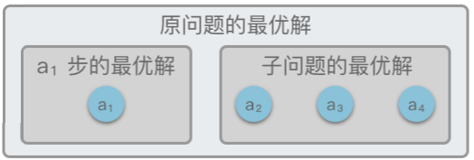
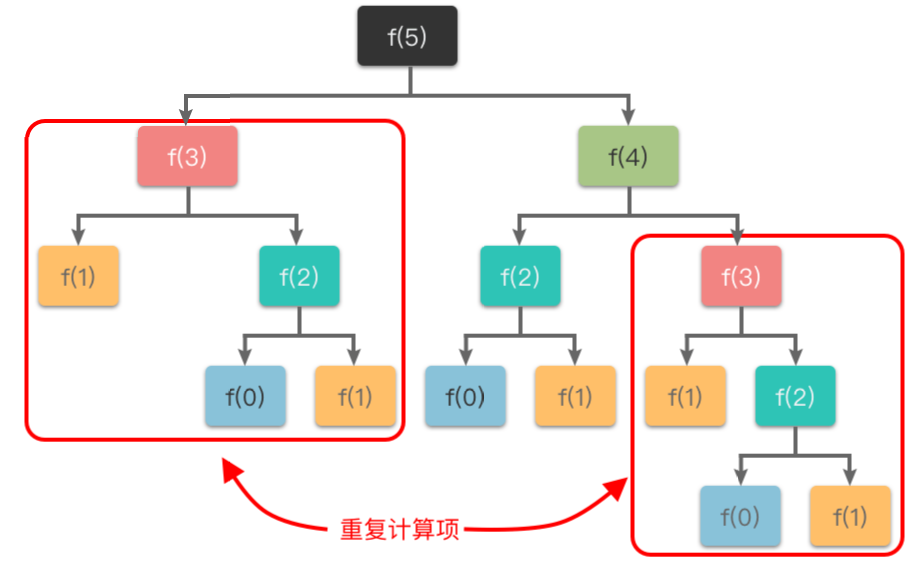
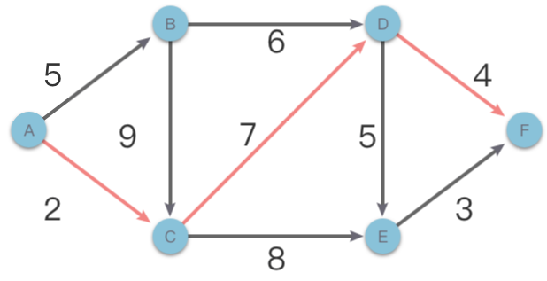
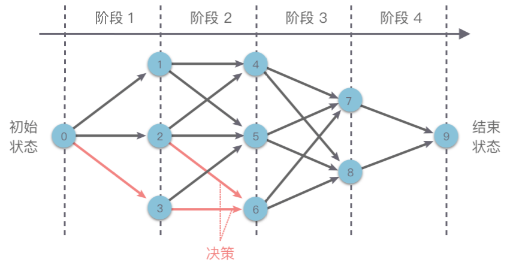

# 1.动态规划基础、记忆化搜索

## 1.动态规划简介

### 1.1 定义

> **动态规划（Dynamic Programming）**：简称 **DP**，是一种求解多阶段决策过程最优化问题的方法。在动态规划中，通过把原问题分解为相对简单的子问题，先求解子问题，再由子问题的解而得到原问题的解。

动态规划最早由理查德 · 贝尔曼于 1957 年在其著作「动态规划（Dynamic Programming）」一书中提出。这里的 Programming 并不是编程的意思，而是指一种「表格处理方法」，即将每一步计算的结果存储在表格中，供随后的计算查询使用。

### 1.2 核心思想

> 1\.  **把「原问题」分解为「若干个重叠的子问题」**，每个子问题的求解过程都构成一个 **「阶段」**。在完成一个阶段的计算之后，动态规划方法才会执行下一个阶段的计算。
> 2\.  在求解子问题的过程中，按照「自顶向下的记忆化搜索方法」或者「自底向上的递推方法」求解出「子问题的解」，把结果存储在表格中，当需要再次求解此子问题时，直接从表格中查询该子问题的解，从而避免了大量的重复计算。

这看起来很像是分治算法，但动态规划与分治算法的不同点在于：

1.  适用于动态规划求解的问题，在分解之后得到的子问题往往是相互联系的，会出现若干个重叠子问题。
2.  使用动态规划方法会将这些重叠子问题的解保存到表格里，供随后的计算查询使用，从而避免大量的重复计算。

## 2.动态规划特征

能够使用动态规划方法解决的问题必须满足以下三个特征：

1.  **最优子结构性质**
2.  **重叠子问题性质**
3.  **无后效性**

### 2.1 最优子结构

> **最优子结构**：指的是一个问题的最优解包含其子问题的最优解。

举个例子，如下图所示，原问题 $S = \lbrace a_1, a_2, a_3, a_4 \rbrace$，在 $a_1$ 步选出一个当前最优解之后，问题就转换为求解子问题 $S_{子问题} = \lbrace a_2, a_3, a_4 \rbrace$。如果原问题 $S$ 的最优解可以由「第 $a_1$ 步得到的局部最优解」和「 $S_{子问题}$ 的最优解」构成，则说明该问题满足最优子结构性质。

也就是说，如果原问题的最优解包含子问题的最优解，则说明该问题满足最优子结构性质。



### 2.2 重叠子问题

> **重叠子问题性质**：指的是在求解子问题的过程中，有大量的子问题是重复的，一个子问题在下一阶段的决策中可能会被多次用到。如果有大量重复的子问题，那么只需要对其求解一次，然后用表格将结果存储下来，以后使用时可以直接查询，不需要再次求解。



### 2.3 无后效性

> **无后效性**：指的是子问题的解（状态值）只与之前阶段有关，而与后面阶段无关。当前阶段的若干状态值一旦确定，就不再改变，不会再受到后续阶段决策的影响。

也就是说，**一旦某一个子问题的求解结果确定以后，就不会再被修改**。

举个例子，下图是一个有向无环带权图，在求解从 $A$ 点到 $F$ 点的最短路径问题时，假设当前已知从 $A$ 点到 $D$ 点的最短路径（$2 + 7 = 9$）。那么无论之后的路径如何选择，都不会影响之前从 $A$ 点到 $D$ 点的最短路径长度。这就是「无后效性」。

而如果一个问题具有「后效性」，则可能需要先将其转化或者逆向求解来消除后效性，然后才可以使用动态规划算法。



## 3.动态规划基本思路

如下图所示，在使用动态规划方法解决某些最优化问题时，可以将解决问题的过程按照一定顺序（时间顺序、空间顺序或其他顺序）分解为若干个相互联系的「阶段」。然后按照顺序对每一个阶段做出「决策」，这个决策既决定了本阶段的效益，也决定了下一阶段的初始状态。依次做完每个阶段的决策之后，就得到了一个整个问题的决策序列。

这样就将一个原问题分解为了一系列的子问题，再通过逐步求解从而获得最终结果。



这种前后关联、具有链状结构的多阶段进行决策的问题也叫做「多阶段决策问题」。

通常使用动态规划方法来解决问题的基本思路如下：

1.  **划分阶段**：将原问题按顺序（时间顺序、空间顺序或其他顺序）分解为若干个相互联系的「阶段」。划分后的阶段⼀定是有序或可排序的，否则问题⽆法求解。
    -   这里的「阶段」指的是⼦问题的求解过程。每个⼦问题的求解过程都构成⼀个「阶段」，在完成前⼀阶段的求解后才会进⾏后⼀阶段的求解。
2.  **定义状态**：将和子问题相关的某些变量（位置、数量、体积、空间等等）作为一个「状态」表示出来。状态的选择要满⾜⽆后效性。
    -   一个「状态」对应一个或多个子问题，所谓某个「状态」下的值，指的就是这个「状态」所对应的子问题的解。
3.  **状态转移**：根据「上一阶段的状态」和「该状态下所能做出的决策」，推导出「下一阶段的状态」。或者说根据相邻两个阶段各个状态之间的关系，确定决策，然后推导出状态间的相互转移方式（即「状态转移方程」）。
4.  **初始条件和边界条件**：根据问题描述、状态定义和状态转移方程，确定初始条件和边界条件。
5.  **最终结果**：确定问题的求解目标，然后按照一定顺序求解每一个阶段的问题。最后根据状态转移方程的递推结果，确定最终结果。

## 4.记忆化搜索

**记忆化搜索（Memoization Search）**：是一种通过存储已经遍历过的状态信息，从而避免对同一状态重复遍历的搜索算法。

### 4.1 记忆化搜索与递推区别

「记忆化搜索」与「递推」都是**动态规划的实现方式**，但是两者之间有一些区别。

**记忆化搜索**：「自顶向下」的解决问题，采用自然的递归方式编写过程，在过程中会保存每个子问题的解（通常保存在一个数组或哈希表中）来避免重复计算。

-   优点：代码清晰易懂，可以有效的处理一些复杂的状态转移方程。有些状态转移方程是非常复杂的，使用记忆化搜索可以将复杂的状态转移方程拆分成多个子问题，通过递归调用来解决。
-   缺点：可能会因为递归深度过大而导致栈溢出问题。

**递推**：「自底向上」的解决问题，采用循环的方式编写过程，在过程中通过保存每个子问题的解（通常保存在一个数组或哈希表中）来避免重复计算。

-   优点：避免了深度过大问题，不存在栈溢出问题。计算顺序比较明确，易于实现。
-   缺点：无法处理一些复杂的状态转移方程。有些状态转移方程非常复杂，如果使用递推方法来计算，就会导致代码实现变得非常困难。

根据记忆化搜索和递推的优缺点，可以在不同场景下使用这两种方法。

适合使用「记忆化搜索」的场景：

1.  问题的状态转移方程比较复杂，递推关系不是很明确。
2.  问题适合转换为递归形式，并且递归深度不会太深。

适合使用「递推」的场景：

1.  问题的状态转移方程比较简单，递归关系比较明确。
2.  问题不太适合转换为递归形式，或者递归深度过大容易导致栈溢出。

### 4.2 记忆化搜索解题步骤

在使用记忆化搜索解决问题的时候，其基本步骤如下：

1.  写出问题的动态规划「状态」和「状态转移方程」。
2.  定义一个缓存（数组或哈希表），用于保存子问题的解。
3.  定义一个递归函数，用于解决问题。在递归函数中，首先检查缓存中是否已经存在需要计算的结果，如果存在则直接返回结果，否则进行计算，并将结果存储到缓存中，再返回结果。
4.  在主函数中，调用递归函数并返回结果。

## 5.实战题目

### 5.1 斐波那契数

[509. 斐波那契数 - 力扣（LeetCode）](https://leetcode.cn/problems/fibonacci-number/description/ "509. 斐波那契数 - 力扣（LeetCode）")

```python
斐波那契数 （通常用 F(n) 表示）形成的序列称为 斐波那契数列 。该数列由 0 和 1 开始，后面的每一项数字都是前面两项数字的和。也就是：

F(0) = 0，F(1) = 1
F(n) = F(n - 1) + F(n - 2)，其中 n > 1
给定 n ，请计算 F(n) 。
```

1.  **划分阶段**：可以按照整数顺序进行阶段划分，将其划分为整数 $0 \sim n$。
2.  **定义状态**：$dp[i]$ 为：第 $i$ 个斐波那契数。
3.  **状态转移方程**：根据题目中所给的斐波那契数列的定义 $f(n) = f(n - 1) + f(n - 2)$，则直接得出状态转移方程为 $dp[i] = dp[i - 1] + dp[i - 2]$。
4.  **初始条件**：根据题目中所给的初始条件 $f(0) = 0, f(1) = 1$ 确定动态规划的初始条件，即 $dp[0] = 0, dp[1] = 1$。
5.  **最终结果**：根据状态定义，最终结果为 $dp[n]$，即第 $n$ 个斐波那契数为 $dp[n]$。

```c++
class Solution {
public:
    int fib(int n) {
        if (n < 2) {
            return n;
        }
        std::vector<int> dp(n + 1, 0);
        dp[0] = 0;
        dp[1] = 1;

        for (int i = 2; i <= n; i++) {
            dp[i] = dp[i - 1] + dp[i - 2];
        }

        return dp[n];
    }
};
```

### 5.2 爬楼梯

[70. 爬楼梯 - 力扣（LeetCode）](https://leetcode.cn/problems/climbing-stairs/description/ "70. 爬楼梯 - 力扣（LeetCode）")

```python
假设你正在爬楼梯。需要 n 阶你才能到达楼顶。

每次你可以爬 1 或 2 个台阶。你有多少种不同的方法可以爬到楼顶呢？


示例 1：

输入：n = 2
输出：2
解释：有两种方法可以爬到楼顶。
1. 1 阶 + 1 阶
2. 2 阶
```

1.  **划分阶段**：按照台阶的阶层划分阶段，将其划分为 $0 \sim n$ 阶。
2.  **定义状态**： $dp[i]$ 为：爬到第 $i$ 阶台阶的方案数。
3.  状态转移方程:根据题目大意，每次只能爬 $1$ 或 $2$ 个台阶。则第 $i$ 阶楼梯只能从第 $i - 1$ 阶向上爬 $1$ 阶上来，或者从第 $i - 2$ 阶向上爬 $2$ 阶上来。所以可以推出状态转移方程为 $dp[i] = dp[i - 1] + dp[i - 2]$。
4.  **初始条件**

-   第 $0$ 层台阶方案数：可以看做 $1$ 种方法（从 $0$ 阶向上爬 $0$ 阶），即 $dp[1] = 1$。
-   第 $1$ 层台阶方案数：$1$ 种方法（从 $0$ 阶向上爬 $1$ 阶），即 $dp[1] = 1$。
-   第 $2$ 层台阶方案数：$2$ 中方法（从 $0$ 阶向上爬 $2$ 阶，或者从 $1$ 阶向上爬 $1$ 阶）。

1.  **最终结果**：根据状态定义，最终结果为 $dp[n]$，即爬到第 $n$ 阶台阶（即楼顶）的方案数为 $dp[n]$。

```c++
class Solution {
public:
    int climbStairs(int n) {
        if (n <= 2) {
            return n;
        }
        std::vector<int> dp(n + 1, 0);
        // dp[0] = 0;
        dp[1] = 1;
        dp[2] = 2;
        for (int i = 3; i <= n; i++) {
            dp[i] = dp[i - 1] + dp[i - 2];
        }

        return dp[n];
    }
};
```

### 5.3 不同路径

[62. 不同路径 - 力扣（LeetCode）](https://leetcode.cn/problems/unique-paths/ "62. 不同路径 - 力扣（LeetCode）")

```python
一个机器人位于一个 m x n 网格的左上角 （起始点在下图中标记为 “Start” ）。

机器人每次只能向下或者向右移动一步。机器人试图达到网格的右下角（在下图中标记为 “Finish” ）。

问总共有多少条不同的路径？

示例 2：

输入：m = 3, n = 2
输出：3
解释：
从左上角开始，总共有 3 条路径可以到达右下角。
1. 向右 -> 向下 -> 向下
2. 向下 -> 向下 -> 向右
3. 向下 -> 向右 -> 向下

```

1.  **划分阶段**：按照路径的结尾位置（行位置、列位置组成的二维坐标）进行阶段划分。
2.  **定义状态** ： $dp[i][j]$ 为：从左上角 $(0, 0)$ 到达 $(i, j)$ 位置的路径数量。
3.  **状态转移方程**：因为每次只能向右、或者向下移动一步，因此想要走到  $(i, j)$，只能从 $(i - 1, j)$ 向下走一步走过来；或者从 $(i, j - 1)$ 向右走一步走过来。所以可以写出状态转移方程为：$dp[i][j] = dp[i - 1][j] + dp[i][j - 1]$，此时 $i > 0，j > 0$。
4.  **初始条件**

-   从左上角走到 $(0, 0)$ 只有一种方法，**可以扩充一行一列**，即 $dp[0][1] = 1$。

1.  最终结果：根据状态定义，最终结果为 $dp[m][n]$，即从左上角到达右下角 $(m, n)$ 位置的路径数量为 $dp[m][n]$。

```c++
class Solution {
public:
    // 1.动态规划
    // 状态定义：dp[i][j] : 从0，0出发到第i行j列所走的方式个数
    // 递归方程： dp[i][j] = dp[i-1][j] + dp[i][j-1]
    int uniquePaths(int m, int n) {
        std::vector<std::vector<int>> dp(m + 1, std::vector<int>(n + 1, 0));
        dp[0][1] = 1;
        for (int i = 1; i <= m; i++) {
            for (int j = 1; j <= n; j++) {
                dp[i][j] = dp[i - 1][j] + dp[i][j - 1];
            }
        }

        return dp[m][n];
    }

};
```

### 5.4 目标和

[494. 目标和 - 力扣（LeetCode）](https://leetcode.cn/problems/target-sum/description/ "494. 目标和 - 力扣（LeetCode）")

```bash
给你一个非负整数数组 nums 和一个整数 target 。

向数组中的每个整数前添加 '+' 或 '-' ，然后串联起所有整数，可以构造一个 表达式 ：

- 例如，nums = [2, 1] ，可以在 2 之前添加 '+' ，在 1 之前添加 '-' ，然后串联起来得到表达式 "+2-1" 。
返回可以通过上述方法构造的、运算结果等于 target 的不同 表达式 的数目。

 

示例 1：

输入：nums = [1,1,1,1,1], target = 3
输出：5
解释：一共有 5 种方法让最终目标和为 3 。
-1 + 1 + 1 + 1 + 1 = 3
+1 - 1 + 1 + 1 + 1 = 3
+1 + 1 - 1 + 1 + 1 = 3
+1 + 1 + 1 - 1 + 1 = 3
+1 + 1 + 1 + 1 - 1 = 3
```

\*\*1、深度优先搜索 \*\*

1.  定义从位置 `0`、和为 `0` 开始，到达数组尾部位置为止，和为 `target` 的方案数为 `dfs(0, 0)`。
2.  下面从位置 `0`、和为 `0` 开始，以深度优先搜索遍历每个位置。
3.  如果当前位置 `i` 遍历完所有位置：
    1.  如果和 `cur_sum` 等于目标和 `target`，则返回方案数 `1`。
    2.  如果和 `cur_sum` 不等于目标和 `target`，则返回方案数 `0`。
4.  如果当前位置 `i`、和为 `cur_sum` 之前没有记录过，则：
    1.  递归搜索 `i + 1` 位置，和为 `cur_sum - nums[i]` 的方案数。
    2.  递归搜索 `i + 1` 位置，和为 `cur_sum + nums[i]` 的方案数。
5.  最终方案数为 `dfs(0, 0)`，将其作为答案返回即可。

**2、动态规划**

假设数组中所有元素和为 `sum`，数组中所有符号为 `+` 的元素为 `sum_x`，符号为 `-` 的元素和为 `sum_y`。则 `target = sum_x - sum_y`。

而 `sum_x + sum_y = sum`。根据两个式子可以求出 `2 * sum_x = target + sum` ，即 `sum_x = (target + sum) / 2`。

那么这道题就变成了，如何在数组中找到一个集合，使集合中元素和为 `(target + sum) / 2`。这就变为了求容量为 `(target + sum) / 2` 的 01 背包问题。

-   状态定义：`dp[i]`: 填满容量为i的背包，有`dp[i]`种方法
-   状态转移方程：`dp[i] = dp[i] + dp[i - num]`。不使用当前 `num`：只使用之前元素填满容量为 `i` 的背包的方法数。使用当前 `num`：填满容量 `i - num` 的包的方法数，再填入 `num` 的方法数。
-   初始化：默认填满容量为 `0` 的背包有 `1` 种办法。即 `dp[i] = 1`

```c++
class Solution {
public:
    // 1.深度优先搜索 + 记忆化搜索
    int findTargetSumWays1(vector<int>& nums, int target) {

        return this->dfs(0, 0, nums, target);
    }
    int dfs(int idx, int curr_sum, std::vector<int>& nums, int target) {
        if (idx == nums.size()) {
            if (curr_sum == target) {
                return 1;
            } else {
                return 0;
            }
        }

        int ans = this->dfs(idx+1, curr_sum-nums[idx], nums, target) 
                + this->dfs(idx+1, curr_sum+nums[idx], nums, target);

        return ans;
    }

    // 2.动态规划
    int findTargetSumWays(vector<int>& nums, int target) {
        int sum_nums = accumulate(nums.begin(), nums.end(), 0);
        if (abs(target) > abs(sum_nums) || (target + sum_nums) % 2 == 1) {
            return 0;
        }
        int size = (target + sum_nums) / 2;
        std::vector<int> dp(size + 1, 0);
        dp[0] = 1;
        for (auto& num : nums) {
            for (int i = size; i  > num - 1; i--) {
                dp[i] = dp[i] + dp[i - num];
            }
        }

        return dp[size];
    }
};
```

### 5.5 第N个泰波那契数

[1137. 第 N 个泰波那契数 - 力扣（LeetCode）](https://leetcode.cn/problems/n-th-tribonacci-number/description/ "1137. 第 N 个泰波那契数 - 力扣（LeetCode）")

```bash
泰波那契序列 Tn 定义如下： 

T0 = 0, T1 = 1, T2 = 1, 且在 n >= 0 的条件下 Tn+3 = Tn + Tn+1 + Tn+2

给你整数 n，请返回第 n 个泰波那契数 Tn 的值。

 

示例 1：

输入：n = 4
输出：4
解释：
T_3 = 0 + 1 + 1 = 2
T_4 = 1 + 1 + 2 = 4
```

动态规划

```c++
class Solution {
public:
    int tribonacci(int n) {
        if (n < 2) {
            return n;
        } 

        std::vector<int> dp(n + 1);
        dp[0] = 0;
        dp[1] = 1;
        dp[2] = 1;

        for (int i = 3; i <= n; i++) {
            dp[i] = dp[i - 1] + dp[i - 2] + dp[i - 3];
        }

        return dp[n];
    }
};
```

### 5.6 出界的路径数

[576. 出界的路径数 - 力扣（LeetCode）](https://leetcode.cn/problems/out-of-boundary-paths/description/ "576. 出界的路径数 - 力扣（LeetCode）")

```bash
给你一个大小为 m x n 的网格和一个球。球的起始坐标为 [startRow, startColumn] 。你可以将球移到在四个方向上相邻的单元格内（可以穿过网格边界到达网格之外）。你 最多 可以移动 maxMove 次球。

给你五个整数 m、n、maxMove、startRow 以及 startColumn ，找出并返回可以将球移出边界的路径数量。因为答案可能非常大，返回对 10^9 + 7 取余 后的结果。

输入：m = 2, n = 2, maxMove = 2, startRow = 0, startColumn = 0
输出：6 
```

1、记忆化搜索

1.  问题的状态定义为：从位置 `(i,j)` 出发，最多使用 `move_count `步，可以将球移出边界的路径数量。
2.  定义一个 `(m, n, maxMove+1)` 的三维数组 `memo `用于记录已经计算过的路径数量。
3.  定义递归函数 `dfs(i, j, move_count, memo)` 用于计算路径数量。
    1.  如果 (i,j) 已经出界，则说明找到了一条路径，返回方案数为 1。
    2.  如果没有移动次数了，则返回方案数为 0。
    3.  定义方案数 `ans`，遍历四个方向，递归计算四个方向的方案数，累积到 `ans `中，并进行取余。
    4.  返回方案数 `ans`。
4.  调用递归函数 `dfs(startRow,startColumn,maxMove)`，并将其返回值作为答案进行返回。

2、动态规划

需要统计从 `(startRow,startColumn)` 位置出发，最多移动 maxMove次能够穿过边界的所有路径数量。则可以根据位置和移动步数来划分阶段和定义状态。

1.  划分状态：按照位置进行阶段划分。
2.  定义状态` dp[i][j][k]` 表示为：从位置 `(i,j)` 最多移动 `k` 次最终穿过边界的所有路径数量。
3.  状态转移方程：因为可以在上下左右四个方向上进行移动，所以对于位置 `(i,j)`，最多移动 `k `次最终穿过边界的所有路径数量取决于周围四个方向上最多经过 `k−1` 次穿过对应位置上的所有路径数量和。即：$dp[i][j][k] = dp[i-1][j][k-1] + dp[i+1][j][k-1] + dp[i][j-1][k-1]+ dp[i][j+1][k-1]$
4.  初始条件：如果位置 `[i,j]` 已经处于边缘，只差一步就穿过边界。则此时位置 `(i,j)` 最多移动 `k` 次最终穿过边界的所有路径数量取决于有相邻多少个方向是边界。也可以通过对上面 (i−1,j)、(i+1,j)、(i,j−1)、(i,j+1) 是否已经穿过边界进行判断（每一个方向穿过一次，就累积一次），来计算路径数目。然后将其作为初始条件。
5.  最终结果：根据之前定义的状态，`dp[i][j][k]`  表示为：从位置 `(i,j) `最多移动 `k` 次最终穿过边界的所有路径数量。则最终答案为 `dp[startRow][startColumn][maxMove]`。

```c++
class Solution {
public:
    // 1.记忆化搜索
    int findPaths1(int m, int n, int maxMove, int startRow, int startColumn) {
        std::vector<std::vector<std::vector<int>>> memo(m, 
            std::vector<std::vector<int>>(n, std::vector<int>(maxMove + 1, -1)));

        return this->dfs(startRow, startColumn, maxMove, memo);
    }

    // 2.动态规划
    int findPaths(int m, int n, int maxMove, int startRow, int startColumn) {
        std::vector<std::vector<std::vector<int>>> dp(m, 
            std::vector<std::vector<int>>(n, std::vector<int>(maxMove + 1, 0)));

        for (int k = 1; k <= maxMove; k++) {
            for (int i = 0; i < m; i++) {
                for (int j = 0; j < n; j++) {
                    for (int idx = 0; idx < 4; idx++) {
                        int x = i + m_dx[idx];
                        int y = j + m_dy[idx];
                        if (x >= 0 && x < m && y >= 0 && y < n) {
                            dp[i][j][k] = (dp[i][j][k] + dp[x][y][k-1]) % m_mod;
                        } else {
                            dp[i][j][k] = (dp[i][j][k] + 1) % m_mod;
                        }
                    }
                }
            }
        }

        return dp[startRow][startColumn][maxMove];
    }
private :
    // 方向
    int m_dx[4] = {-1, 1, 0, 0};
    int m_dy[4] = {0, 0, -1, 1};
    long long m_mod = 1e9 + 7;

    int dfs(int i, int j, int move_count, std::vector<std::vector<std::vector<int>>>& memo) {
        if (i < 0 || i >= memo.size() || j < 0 || j >= memo[i].size()) {
            return 1;
        }
        if (move_count == 0) {
            return 0;
        }

        if (memo[i][j][move_count] != -1) {
            return memo[i][j][move_count];
        }

        int ans = 0;
        for (int k = 0; k < 4; k++) {
            int x = i + m_dx[k];
            int y = j + m_dy[k];

            ans += this->dfs(x, y, move_count - 1, memo);
            ans %= m_mod;
        }
        memo[i][j][move_count] = ans;

        return ans;
    }

};
```
