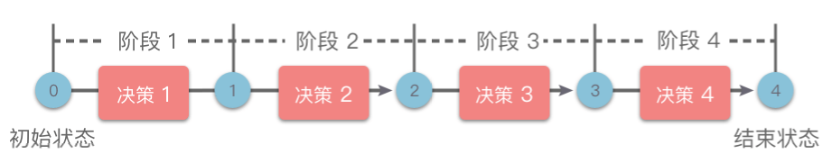
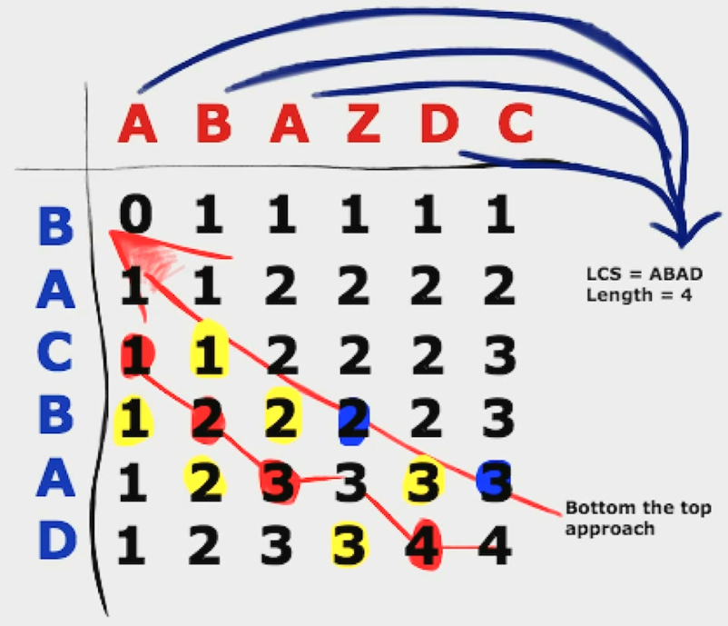
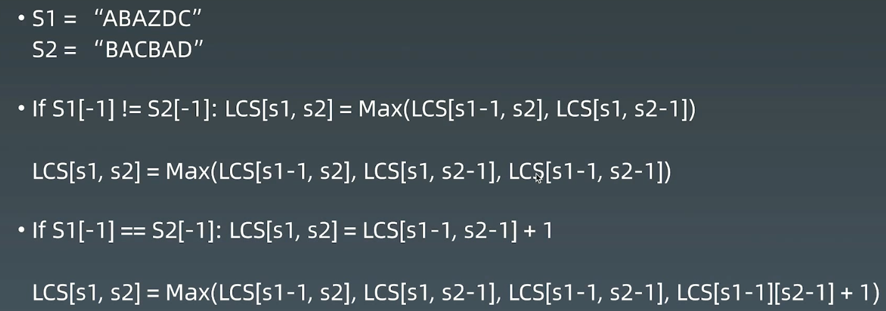
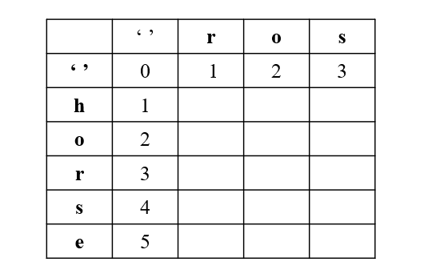

# 2.线性动态规划

## 1.线性动态规划简介

> **线性动态规划**：具有「线性」阶段划分的动态规划方法统称为线性动态规划（简称为「线性 DP」），如下图所示。



如果状态包含多个维度，但是每个维度上都是线性划分的阶段，也属于线性 DP。比如背包问题、区间 DP、数位 DP 等都属于线性 DP。

线性 DP 问题的划分方法有多种方式。

-   如果按照「状态的维度数」进行分类，可以将线性 DP 问题分为：一维线性 DP 问题、二维线性 DP 问题，以及多维线性 DP 问题。
-   如果按照「问题的输入格式」进行分类，可以将线性 DP 问题分为：单串线性 DP 问题、双串线性 DP 问题、矩阵线性 DP 问题，以及无串线性 DP 问题。

## 2.单串线性DP问题

> **单串线性 DP** 问题：问题的输入为单个数组或单个字符串的线性 DP 问题。

状态一般可定义为 $dp[i]$，表示为：

1.  「**以数组中第 **$i$** 个位置元素 **$nums[i]$** 为结尾的子数组（**$nums[0]...nums[i]$**）**」的相关解。
2.  「以数组中第 $i - 1$ 个位置元素 $nums[i - 1]$ 为结尾的子数组（$nums[0]...nums[i - 1]$）」的相关解。
3.  「以数组中前 $i$ 个元素为子数组（$nums[0]...nums[i - 1]$）」的相关解。

这 $3$ 种状态的定义区别在于相差一个元素 $nums[i]$。

1.  第 $1$ 种状态：子数组的长度为 $i + 1$，子数组长度不可为空；
2.  第 $2$ 种状态、第 $3$ 种状态：这两种状态描述是相同的。子数组的长度为 $i$，子数组长度可为空。在 $i = 0$ 时，方便用于表示空数组（以数组中前 $0$ 个元素为子数组）。

单串线性 DP 问题中最经典的问题就是「最长递增子序列（Longest Increasing Subsequence，简称 LIS）」。

## 3.双串线性DP问题

> **双串线性 DP 问题**：问题的输入为两个数组或两个字符串的线性 DP 问题。

状态一般可定义为 $dp[i][j]$，表示为：

1.  「以第一个数组中第 $i$ 个位置元素 $nums1[i]$ 为结尾的子数组（$nums1[0]...nums1[i]$）」与「以第二个数组中第 $j$ 个位置元素 $nums2[j]$ 为结尾的子数组（$nums2[0]...nums2[j]$）」的相关解。
2.  「以第一个数组中第 $i - 1$ 个位置元素 $nums1[i - 1]$ 为结尾的子数组（$nums1[0]...nums1[i - 1]$）」与「以第二个数组中第 $j - 1$ 个位置元素 $nums2[j - 1]$ 为结尾的子数组（$nums2[0]...nums2[j - 1]$）」的相关解。
3.  「以第一个数组中前 $i$ 个元素为子数组（$nums1[0]...nums1[i - 1]$）」与「以第二个数组中前 $j$ 个元素为子数组（$nums2[0]...nums2[j - 1]$）」的相关解。

这 $3$ 种状态的定义区别在于相差一个元素 $nums1[i]$ 或 $nums2[j]$。

1.  第 $1$ 种状态：子数组的长度为 $i + 1$ 或 $j + 1$，子数组长度不可为空
2.  第 $2$ 种状态、第 $3$ 种状态：子数组的长度为 $i$ 或 $j$，子数组长度可为空。$i = 0$ 或 $j = 0$ 时，方便用于表示空数组（以数组中前 $0$ 个元素为子数组）。

## 4.矩阵线性DP问题

**矩阵线性 DP 问题**：问题的输入为二维矩阵的线性 DP 问题。状态一般可定义为 $dp[i][j]$，表示为：从「位置 $(0, 0)$」到达「位置 $(i, j)$」的相关解。

## 5.无串线性DP问题

**无串线性 DP 问题**：问题的输入不是显式的数组或字符串，但依然可分解为若干子问题的线性 DP 问题。

## 6.实战题目

### 6.1 最长递增子序列 - 单串线性DP

[300. 最长递增子序列 - 力扣（LeetCode）](https://leetcode.cn/problems/longest-increasing-subsequence/description/ "300. 最长递增子序列 - 力扣（LeetCode）")

```bash
给你一个整数数组 nums ，找到其中最长严格递增子序列的长度。

子序列 是由数组派生而来的序列，删除（或不删除）数组中的元素而不改变其余元素的顺序。例如，[3,6,2,7] 是数组 [0,3,1,6,2,2,7] 的子序列。

 
示例 1：

输入：nums = [10,9,2,5,3,7,101,18]
输出：4
解释：最长递增子序列是 [2,3,7,101]，因此长度为 4 。
```

动态规划

1.  **划分阶段**：按照子序列的结尾位置进行阶段划分。
2.  **定义状态**： $dp[i]$ 表示为：以 $nums[i]$ 结尾的最长递增子序列长度。
3.  **状态转移方程**

对于满足 $0 \le j < i$ 的数组元素 $nums[j]$ 和 $nums[i]$ 来说：

-   如果 $nums[j] < nums[i]$，则 $nums[i]$ 可以接在 $nums[j]$ 后面，此时以 $nums[i]$ 结尾的最长递增子序列长度会在「以 $nums[j]$ 结尾的最长递增子序列长度」的基础上加 $1$，即：$dp[i] = dp[j] + 1$。
-   如果 $nums[j] \le nums[i]$，则 $nums[i]$ 不可以接在 $nums[j]$ 后面，可以直接跳过。

综上，的状态转移方程为：$dp[i] = max(dp[i], dp[j] + 1)，0 \le j < i，nums[j] < nums[i]$。

1.  **初始条件**：默认状态下，把数组中的每个元素都作为长度为 $1$ 的递增子序列。即 $dp[i] = 1$。
2.  **最终结果**：$dp[i]$ 表示为：以 $nums[i]$ 结尾的最长递增子序列长度。那为了计算出最大的最长递增子序列长度，则需要再遍历一遍 $dp$ 数组，求出最大值即为最终结果。

```c++
class Solution {
public:
    // 1.动态规划
    int lengthOfLIS1(vector<int>& nums) {
        int n = nums.size();
        if (n == 0) {
            return 0;
        }

        int max_len = 1;

        std::vector<int> dp(n, 0);
        for (int i = 0; i < n; i++) {
            dp[i] = 1;
            for (int j = 0; j < i; j++) {
                if (nums[j] < nums[i]) {
                    dp[i] = std::max(dp[i], dp[j] + 1);
                    max_len = std::max(max_len, dp[i]);
                }
            }
        }

        return max_len;
    }

    // 2.贪心+ 二分查找
    int lengthOfLIS(vector<int>& nums) {
        int n = nums.size();
        if (n == 0) {
            return 0;
        }

        // 当前已求出的最长上升子序列d的长度为 len（初始时为 1）
        std::vector<int> d(n + 1, 0);
        int len = 1;
        d[len] = nums[0];

        // 遍历nums
        for (int i = 1; i < n; i++) {
            // 如果 nums[i]>d[len] ，则直接加入到 d 数组末尾，并更新 len=len+1；
            // 否则，在 d 数组中二分查找，找到第一个比 nums[i]小的数 d[k]，
            // 并更新 d[k+1]=nums[i]
            if (nums[i] > d[len]) {
                len++;
                d[len] = nums[i];
            } else {
                int left = 1;
                int right = len;
                int pos = 0;
            
                while (left <= right) {
                    int mid = left + (right - left) / 2;
                    if (d[mid] < nums[i]) {
                        pos = mid;
                        left = mid + 1;
                    } else {
                        right = mid - 1;
                    }
                }
                d[pos + 1] = nums[i];
            }
        }

        return len;
    }
};
```

### 6.2 最大子数组和 - 单串线性DP

[53. 最大子数组和 - 力扣（LeetCode）](https://leetcode.cn/problems/maximum-subarray/ "53. 最大子数组和 - 力扣（LeetCode）")

```bash
给你一个整数数组 nums ，请你找出一个具有最大和的连续子数组（子数组最少包含一个元素），返回其最大和。

子数组 是数组中的一个连续部分。

示例 1：

输入：nums = [-2,1,-3,4,-1,2,1,-5,4]
输出：6
解释：连续子数组 [4,-1,2,1] 的和最大，为 6 。
```

1、动态规划

-   状态定义：`f(1)`
-   DP方程：`f(1) = max(f(i - 1), 0) + a[i]`

```c++
class Solution {
public:
    // 1.动态规划
    int maxSubArray(vector<int>& nums) {
        std::vector<int> dp(nums.size());
        dp[0] = nums[0] > 0 ? nums[0] : 0;
        int max_sum = nums[0];

        for (int i = 1; i < nums.size(); i++) {
            dp[i] = std::max(dp[i - 1], 0) + nums[i];
            max_sum = std::max(dp[i], max_sum);
        }

        return max_sum;
    }
};
```

2、分治算法

将数组 `nums` 根据中心位置分为左右两个子数组。则具有最大和的连续子数组可能存在以下3种情况：

1.  具有最大和的连续子数组在左子数组中。
2.  具有最大和的连续子数组在右子数组中。
3.  具有最大和的连续子数组跨过中心位置，一部分在左子数组中，另一部分在右子树组中。

那么要求出具有最大和的连续子数组的最大和，则分别对上面3种情况求解即可。具体步骤如下：

1.  将数组 `nums` 根据中心位置递归分为左右两个子数组，直到所有子数组长度为1 。
2.  长度为1 的子数组最大和肯定是数组中唯一的数，将其返回即可。
3.  求出左子数组的最大和 `left_max`。
4.  求出右子树组的最大和 `right_max`。
5.  求出跨过中心位置，一部分在左子数组中，另一部分在右子树组的子数组最大和 `left_total + right_total`。
6.  求出3 、4、5 中的最大值，即为当前数组的最大和，将其返回即可。

```c++
class Solution {
public:
    // 2.分治算法
    int maxSubArray(vector<int>& nums) {
        return this->max_sub_array(nums, 0, nums.size() - 1);
    }
    int max_sub_array(std::vector<int>& nums, int low, int high) {
        if (low == high) {
            return nums[low];
        }

        int mid = low + (high - low) / 2;
        int left_max = this->max_sub_array(nums, low, mid);
        int right_max = this->max_sub_array(nums, mid + 1, high);

        int total = 0;
        int left_total = INT_MIN;
        for (int i = mid; i <= low; i--) {
            total += nums[i];
            left_total = std::max(left_total, total);
        }

        total = 0;
        int right_total = INT_MIN;
        for (int i = mid + 1; i <= high; i++) {
            total += nums[i];
            right_total = std::max(right_total, total);
        }

        return std::max(std::max(left_max, right_max), left_total + right_total);
    }
};
```

### 6.3 最长的斐波那契子序列长度 - 单串线性DP

[873. 最长的斐波那契子序列的长度 - 力扣（LeetCode）](https://leetcode.cn/problems/length-of-longest-fibonacci-subsequence/ "873. 最长的斐波那契子序列的长度 - 力扣（LeetCode）")

```python
如果序列 X_1, X_2, ..., X_n 满足下列条件，就说它是 斐波那契式 的：

- n >= 3
- 对于所有 i + 2 <= n，都有 X_i + X_{i+1} = X_{i+2}

给定一个严格递增的正整数数组形成序列 arr ，找到 arr 中最长的斐波那契式的子序列的长度。如果一个不存在，返回  0 。

（回想一下，子序列是从原序列 arr 中派生出来的，它从 arr 中删掉任意数量的元素（也可以不删），而不改变其余元素的顺序。例如， [3, 5, 8] 是 [3, 4, 5, 6, 7, 8] 的一个子序列）

 

示例 1：

输入: arr = [1,2,3,4,5,6,7,8]
输出: 5
解释: 最长的斐波那契式子序列为 [1,2,3,5,8] 。
```

1.  划分阶段：按照斐波那契式子序列相邻两项的结尾位置进行阶段划分。
2.  定义状态： $dp[i][j]$ 表示为：以 $arr[i]$、$arr[j]$ 为结尾的斐波那契式子序列的最大长度。
3.  状态转移方程：以 $arr[j]$、$arr[k]$ 结尾的斐波那契式子序列的最大长度 = 满足 $arr[i] + arr[j] = arr[k]$ 条件下，以 $arr[i]$、$arr[j]$ 结尾的斐波那契式子序列的最大长度加 $1$。即状态转移方程为：$dp[j][k] = max_{(A[i] + A[j] = A[k]，i < j < k)}(dp[i][j] + 1)$。
4.  初始条件：默认状态下，数组中任意相邻两项元素都可以作为长度为 $2$ 的斐波那契式子序列，即 $dp[i][j] = 2$。
5.  最终结果：$dp[i][j]$ 表示为：以 $arr[i]$、$arr[j]$ 为结尾的斐波那契式子序列的最大长度。那为了计算出最大的最长递增子序列长度，则需要在进行状态转移时，求出最大值 $ans$ 即为最终结果。

因为题目定义中，斐波那契式中 $n \ge 3$，所以只有当 $ans \ge 3$ 时，返回 $ans$。如果 $ans < 3$，则返回 $0$。

```c++
class Solution {
public:
    int lenLongestFibSubseq(vector<int>& arr) {
        int arr_size = arr.size();
        std::vector<std::vector<int>> dp(arr_size, std::vector<int>(arr_size, 0));
        int ans = 0;

        // 初始化dp
        for (int i = 0; i < arr_size; i++) {
            for (int j = i + 1; j < arr_size; j++) {
                dp[i][j] = 2;
            }
        }

        std::unordered_map<int, int> idx_map;
        // 降 value:idx映射为哈希表，可以快速通过value获得idx
        for (int idx = 0; idx < arr_size; idx++) {
            idx_map[arr[idx]] = idx;
        }

        for (int i = 0; i < arr_size; i++) {
            for (int j = i + 1; j < arr_size; j++) {
                if (idx_map.count(arr[i] + arr[j])) {
                    // 获取 arr[i] + arr[j] 的 idx，即斐波那契式子序列下一项元素
                    int k = idx_map[arr[i] + arr[j]];

                    dp[j][k] = std::max(dp[j][k], dp[i][j] + 1);
                    ans = std::max(ans, dp[j][k]);
                }
            }
        }

        if (ans >= 3) {
            return ans;
        }
        return 0;
    }
};
```

### 6.4 最长公共子序列  - 双串线性DP

[1143. 最长公共子序列 - 力扣（LeetCode）](https://leetcode.cn/problems/longest-common-subsequence/description/ "1143. 最长公共子序列 - 力扣（LeetCode）")

```python
给定两个字符串 text1 和 text2，返回这两个字符串的最长 公共子序列 的长度。如果不存在 公共子序列 ，返回 0 。

一个字符串的 子序列 是指这样一个新的字符串：它是由原字符串在不改变字符的相对顺序的情况下删除某些字符（也可以不删除任何字符）后组成的新字符串。

- 例如，"ace" 是 "abcde" 的子序列，但 "aec" 不是 "abcde" 的子序列。
两个字符串的 公共子序列 是这两个字符串所共同拥有的子序列。

 

示例 1：

输入：text1 = "abcde", text2 = "ace" 
输出：3  
解释：最长公共子序列是 "ace" ，它的长度为 3 。
```

方法1：暴力方法：生成字符串一的所有子序列，在字符串二中验证；生成方式：递归判断每一个字符是取还是不取

方法2：找重复性：

两个字符串分别为一个二维数组的行和列，数组中的数组为当前行列之前字符串的公共子串个数；

-   初始时，第一行和第一列可以先求出来；
-   如3行6列的数值3，表示"ABAZDC" 和 "BAC" 的最长子序列， 发现两个字符串的最后一个字符是一样的，可以转换成求 "ABAZD" 和 "BA" 这两个序列的最长子序列 `+1`，即 `2+1=3`
-   DP方程：
-   $if(s_1[n-1] ≠ s_2[n-1]) ~:~ LCS[s_1, s_2] = Max(LSC[s_1 - 1, s_2], LSC[s_1, s_2-1])$
-   $if(s_1[n-1] == s_2[n-1]) ~:~ LCS[s_1, s_2] = LSC[s_1 - 1, s_2 - 1] + 1$





```python
class Solution:
    def longestCommonSubsequence(self, text1: str, text2: str) -> int:
        if not text1 or not text2:
            return 0
        m = len(text1)
        n = len(text2)
        dp = [[0]*(n + 1) for _ in range(m + 1)]

        for i in range(1, m + 1):
            for j in range(1, n + 1):
                if text1[i - 1] == text2[j - 1]:
                    dp[i][j] = dp[i - 1][j - 1] + 1
                else:
                    dp[i][j] = max(dp[i][j - 1], dp[i - 1][j])

        return dp[m][n]
```

```c++
class Solution {
public:
    int longestCommonSubsequence(string text1, string text2) {
        int m = text1.size();
        int n = text2.size();

        if (m == 0 || n == 0) {
            return 0;
        }

        std::vector<std::vector<int>> dp(m + 1, std::vector<int>(n + 1, 0));

        for (int i = 1; i <= m; i++) {
            for (int j = 1; j <= n; j++) {
                if (text1.at(i - 1) == text2.at(j - 1)) {
                    dp[i][j] = dp[i - 1][j - 1] + 1;
                } else {
                    dp[i][j] = std::max(dp[i][j - 1], dp[i - 1][j]);
                }
            }
        }

        return dp[m][n];
    }
};
```

### 6.5 最长重复子数组 - 双串线性DP

[718. 最长重复子数组 - 力扣（LeetCode）](https://leetcode.cn/problems/maximum-length-of-repeated-subarray/description/ "718. 最长重复子数组 - 力扣（LeetCode）")

```python
给两个整数数组 nums1 和 nums2 ，返回 两个数组中 公共的 、长度最长的子数组的长度 。

 

示例 1：

输入：nums1 = [1,2,3,2,1], nums2 = [3,2,1,4,7]
输出：3
解释：长度最长的公共子数组是 [3,2,1] 。
```

1.  划分阶段：按照子数组结尾位置进行阶段划分。
2.  定义状态：$dp[i][j]$ 为：「以 $nums1$ 中前 $i$ 个元素为子数组」和「以 $nums2$ 中前 $j$ 个元素为子数组（$nums2[0]...nums2[j - 1]$）」的最长公共子数组长度。
3.  状态转移方程
    1.  如果 $nums1[i] = nums2[j]$，则当前元素可以构成公共子数组，此时 $dp[i][j] = dp[i - 1][j - 1] + 1$。
    2.  如果 $nums1[i] \ne nums2[j]$，则当前元素不能构成公共子数组，此时 $dp[i][j] = 0$。
4.  初始条件

-   当 $i = 0$ 时，$nums1[0]...nums1[i - 1]$ 表示的是空数组，空数组与 $nums2[0]...nums2[j - 1]$ 的最长公共子序列长度为 $0$，即 $dp[0][j] = 0$。
-   当 $j = 0$ 时，$nums2[0]...nums2[j - 1]$ 表示的是空数组，空数组与 $nums1[0]...nums1[i - 1]$ 的最长公共子序列长度为 $0$，即 $dp[i][0] = 0$。

###### 5. 最终结果

-   根据状态定义， $dp[i][j]$ 为：「以 $nums1$ 中前 $i$ 个元素为子数组」和「以 $nums2$ 中前 $j$ 个元素为子数组（$nums2[0]...nums2[j - 1]$）」的最长公共子数组长度。在遍历过程中，我们可以使用 $res$ 记录下所有 $dp[i][j]$ 中最大值即为答案。

```c++
class Solution {
public:
    int findLength(vector<int>& nums1, vector<int>& nums2) {
        int m = nums1.size();
        int n = nums2.size();
        std::vector<std::vector<int>> dp(m+1, std::vector<int>(n+1, 0));
        int ans = 0;

        for (int i = 1; i <= m; i++) {
            for (int j = 1; j <= n; j++) {
                if (nums1[i - 1] == nums2[j - 1]) {
                    dp[i][j] = dp[i - 1][j - 1] + 1;
                } 
                ans = std::max(ans, dp[i][j]);
            }
        }

        return ans;
    }
};
```

### 6.6 编辑距离 - 双串线性DP

[72. 编辑距离 - 力扣（LeetCode）](https://leetcode.cn/problems/edit-distance/description/ "72. 编辑距离 - 力扣（LeetCode）")

```bash
给你两个单词 word1 和 word2， 请返回将 word1 转换成 word2 所使用的最少操作数。

你可以对一个单词进行如下三种操作：

- 插入一个字符
- 删除一个字符
- 替换一个字符
```

1.  BFS + 剪枝（单词的长度范围）
2.  DP
    1.  状态定义：`dp[0..i][0..j]`， i表示第一个字符串匹配到第二个字符串的长度；j表示第二个字符串匹配到第一个字符串的长度；`word1.substr(0, i)` 与 `word2.substr(0, j)`之间的编辑距离

**w1和w2的最后一个字符一样**

> w1 : ...x (i)
> w2 : ...x (j)&#x20;

`edit_dist(w1, w2) = edit_dist(w1[0 : i -1], w2[0, j - 1])`

`edit_dist(i, j) = edit_dist(i - 1, j - 1)`

**w1和w2的最后一个字符不一样**

> w1 : ...x (i)
> w2 : ...y (j)&#x20;

`edit_dist(i, j) = ``min``(edit_dist(i - 1, j - 1) + 1 , edit_dist(i - 1, j ) + 1, edit_dist(i, j - 1) + 1)`

-   `edit_dist(i - 1, j - 1) + 1` :  替换，编辑距离 + 1
-   `edit_dist(i - 1, j) + 1` : 删除word1最后一个字符， 编辑距离 + 1
-   `edit_dist(i , j - 1) + 1` : 删除 word2最后一个字符，编辑距离 + 1

注意，针对第一行，第一列要单独考虑，我们引入 `''` 下图所示：



第一行，是 `word1` 为空变成 `word2` 最少步数，就是插入操作

第一列，是 `word2` 为空，需要的最少步数，就是删除操作

```c++
class Solution {
public:
    int minDistance(string word1, string word2) {
        int n1 = word1.size();
        int n2 = word2.size();
        std::vector<std::vector<int>> dp(n1 + 1, std::vector<int>(n2 + 1, 0));

        // 第一行
        for (int j = 1; j <= n2; j++) {
            dp[0][j] = dp[0][j - 1] + 1;
        }

        // 第一列
        for (int i = 1; i <= n1; i++) {
            dp[i][0] = dp[i - 1][0] + 1;
        }

        for (int i = 1; i <= n1; i++) {
            for (int j = 1; j <= n2; j++) {
                if (word1.at(i - 1) == word2.at(j - 1)) {
                    dp[i][j] = dp[i - 1][j - 1];
                } else {
                    dp[i][j] = std::min(std::min(dp[i - 1][j - 1], dp[i - 1][j]), dp[i][j - 1]) + 1;
                }
            }
        }

        return dp[n1][n2];
    }
};
```

### 6.7 最小路径和 - 矩阵线性DP问题

[64. 最小路径和 - 力扣（LeetCode）](https://leetcode.cn/problems/minimum-path-sum/description/ "64. 最小路径和 - 力扣（LeetCode）")

```python
给定一个包含非负整数的 m x n 网格 grid ，请找出一条从左上角到右下角的路径，使得路径上的数字总和为最小。

说明：每次只能向下或者向右移动一步。

```

状态定义：`dp[i][j]` : 从00出发到i，j的最短路径

状态转移方程：`dp[i][j] = std::min(dp[i - 1][j], dp[i][j - 1]) + grid[i - 1][j - 1];`

注意，实现是可以扩一行和一列

```c++
class Solution {
public:
    // 1.动态规划
    // 状态定义：dp[i][j] : 从00出发到i，j的最短路径
    // 状态转移方程：dp[i][j] = std::min(dp[i - 1][j], dp[i][j - 1]) + grid[i - 1][j - 1];
    int minPathSum(vector<vector<int>>& grid) {
        int row = grid.size();
        int col = grid[0].size();
        std::vector<std::vector<int>> dp(row + 1, std::vector<int>(col + 1, INT_MAX));
        dp[0][1] = 0;
        for (int i = 1; i <= row; i++) {
            for (int j = 1; j <= col; j++) {
                // 注意dp和grid的索引不一样
                dp[i][j] = std::min(dp[i - 1][j], dp[i][j - 1]) + grid[i - 1][j - 1];
            }
        }

        return dp[row][col];
    }
};
```

### 6.8 最大正方形 - 矩阵线性DP问题

[221. 最大正方形 - 力扣（LeetCode）](https://leetcode.cn/problems/maximal-square/ "221. 最大正方形 - 力扣（LeetCode）")

```python
在一个由 '0' 和 '1' 组成的二维矩阵内，找到只包含 '1' 的最大正方形，并返回其面积。


输入：matrix = [["1","0","1","0","0"],["1","0","1","1","1"],["1","1","1","1","1"],["1","0","0","1","0"]]
输出：4

```

动态规划

1.  划分阶段：按照正方形的右下角坐标进行阶段划分。
2.  定义状态：$dp[i][j]$ 表示为：以矩阵位置 $(i, j)$ 为右下角，且值包含 $1$ 的正方形的最大边长。
3.  状态转移方程

只有当矩阵位置 $(i, j)$ 值为 $1$ 时，才有可能存在正方形。

-   如果矩阵位置 $(i, j)$ 上值为 $0$，则 $dp[i][j] = 0$。
-   如果矩阵位置 $(i, j)$ 上值为 $1$，则 $dp[i][j]$ 的值由该位置上方、左侧、左上方三者共同约束的，为三者中最小值加 $1$。即：$dp[i][j] = min(dp[i - 1][j - 1], dp[i - 1][j], dp[i][j - 1]) + 1$。

1.  初始条件：默认所有以矩阵位置 $(i, j)$ 为右下角，且值包含 $1$ 的正方形的最大边长都为 $0$，即 $dp[i][j] = 0$。
2.  最终结果： $dp[i][j]$ 表示为：以矩阵位置 $(i, j)$ 为右下角，且值包含 $1$ 的正方形的最大边长。则最终结果为所有 $dp[i][j]$ 中的最大值。

```c++
class Solution {
public:
    int maximalSquare(vector<vector<char>>& matrix) {
        int row = matrix.size();
        int col = matrix[0].size();
        std::vector<std::vector<int>> dp(row+1, std::vector<int>(col+1, 0));

        int max_size = 0;

        for (int i = 0; i < row; i++) {
            for (int j = 0; j < col; j++) {
                if (matrix[i][j] == '1') {
                    if (i == 0 || j == 0) {
                        dp[i][j] = 1;
                    } else {
                        dp[i][j] = std::min(std::min(dp[i-1][j-1], dp[i-1][j]), 
                                            dp[i][j-1]) + 1;
                    }
                    max_size = std::max(max_size, dp[i][j]);
                }
            }
        }

        return max_size * max_size;
    }
};
```

### 6.9 整数拆分 - 无串线性DP问题

[343. 整数拆分 - 力扣（LeetCode）](https://leetcode.cn/problems/integer-break/description/ "343. 整数拆分 - 力扣（LeetCode）")

```python
给定一个正整数 n ，将其拆分为 k 个 正整数 的和（ k >= 2 ），并使这些整数的乘积最大化。

返回 你可以获得的最大乘积 。

 

示例 1:

输入: n = 2
输出: 1
解释: 2 = 1 + 1, 1 × 1 = 1。

输入: n = 10
输出: 36
解释: 10 = 3 + 3 + 4, 3 × 3 × 4 = 36。

```

1.  划分阶段：按照正整数进行划分。
2.  定义状态：$dp[i]$ 表示为：将正整数 $i$ 拆分为至少 $2$ 个正整数的和之后，这些正整数的最大乘积。
3.  状态转移方程：

当 $i \ge 2$ 时，假设正整数 $i$ 拆分出的第 $1$ 个正整数是 $j(1 \le j < i)$，则有两种方法：

1.  将 $i$ 拆分为 $j$ 和 $i - j$ 的和，且 $i - j$ 不再拆分为多个正整数，此时乘积为：$j \times (i - j)$。
2.  将 $i$ 拆分为 $j$ 和 $i - j$ 的和，且 $i - j$ 继续拆分为多个正整数，此时乘积为：$j \times dp[i - j]$。

则 $dp[i]$ 取两者中的最大值。即：$dp[i] = max(j \times (i - j), j \times dp[i - j])$。

由于 $1 \le j < i$，需要遍历 $j$ 得到 $dp[i]$ 的最大值，则状态转移方程如下：

$dp[i] = max_{1 \le j < i}\lbrace max(j \times (i - j), j \times dp[i - j]) \rbrace$。

1.  初始条件：$0$ 和 $1$ 都不能被拆分，所以 $dp[0] = 0, dp[1] = 0$。
2.  最终结果：$dp[i]$ 表示为：将正整数 $i$ 拆分为至少 $2$ 个正整数的和之后，这些正整数的最大乘积。则最终结果为 $dp[n]$。

```c++
class Solution {
public:
    int integerBreak(int n) {
        std::vector<int> dp(n+1, 0);
        for (int i = 2; i <= n; i++) {
            for (int j = 0; j < i; j++) {
                dp[i] = std::max(std::max(dp[i], (i-j)*j), dp[i-j]*j);
            }
        }
        return dp[n];
    }
};
```

### 6.10 两个键的键盘

[650. 两个键的键盘 - 力扣（LeetCode）](https://leetcode.cn/problems/2-keys-keyboard/description/ "650. 两个键的键盘 - 力扣（LeetCode）")

```python
最初记事本上只有一个字符 'A' 。你每次可以对这个记事本进行两种操作：

- Copy All（复制全部）：复制这个记事本中的所有字符（不允许仅复制部分字符）。
- Paste（粘贴）：粘贴 上一次 复制的字符。

给你一个数字 n ，你需要使用最少的操作次数，在记事本上输出 恰好 n 个 'A' 。返回能够打印出 n 个 'A' 的最少操作次数。

示例 1：

输入：3
输出：3
解释：
最初, 只有一个字符 'A'。
第 1 步, 使用 Copy All 操作。
第 2 步, 使用 Paste 操作来获得 'AA'。
第 3 步, 使用 Paste 操作来获得 'AAA'。
```

1.  划分阶段：按照字符 `'A'`  的个数进行阶段划分。
2.  定义状态：$dp[i]$ 表示为：通过「复制」和「粘贴」操作，得到 $i$ 个字符 `'A'`，最少需要的操作数。
3.  状态转移方程
    1.  对于 $i$ 个字符 `'A'`，如果 $i$ 可以被一个小于 $i$ 的整数 $j$ 除尽（$j$ 是 $i$ 的因子），则说明 $j$ 个字符 `'A'` 可以通过「复制」+「粘贴」总共 $\frac{i}{j}$ 次得到 $i$ 个字符 `'A'`。
    2.  而得到 $j$ 个字符 `'A'`，最少需要的操作数可以通过 $dp[j]$ 获取。
        则可以枚举 $i$ 的因子，从中找到在满足 $j$ 能够整除 $i$ 的条件下，最小的 $dp[j] + \frac{i}{j}$，即为 $dp[i]$，即 $dp[i] = min_{j | i}(dp[i], dp[j] + \frac{i}{j})$。
    由于 $j$ 能够整除 $i$，则 $j$ 与 $\frac{i}{j}$ 都是 $i$ 的因子，两者中必有一个因子是小于等于 $\sqrt{i}$ 的，所以在枚举 $i$ 的因子时，我们只需要枚举区间 $[1, \sqrt{i}]$ 即可。

    综上所述，状态转移方程为：$dp[i] = min_{j | i}(dp[i], dp[j] + \frac{i}{j}, dp[\frac{i}{j}] + j)$。
4.  初始条件：当 $i = 1$ 时，最少需要的操作数为 $0$。所以 $dp[1] = 0$。
5.  最终结果：$dp[i]$ 表示为：通过「复制」和「粘贴」操作，得到 $i$ 个字符 `'A'`，最少需要的操作数。 所以最终结果为 $dp[n]$。

```c++
class Solution {
public:
    int minSteps(int n) {
        std::vector<float> dp(n+1, 0);
        for (int i = 2; i <= n; i++) {
            dp[i] = INT_MAX;
            for (int j = 1; j <= sqrt(n); j++) {
                if (i % j == 0) {
                    dp[i] = std::min(std::min(dp[i], dp[j] + i / j), dp[i / j] + j);
                }
            }
        }
        return dp[n];
    }
};
```
