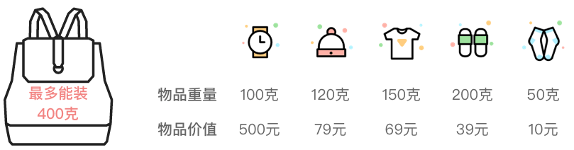
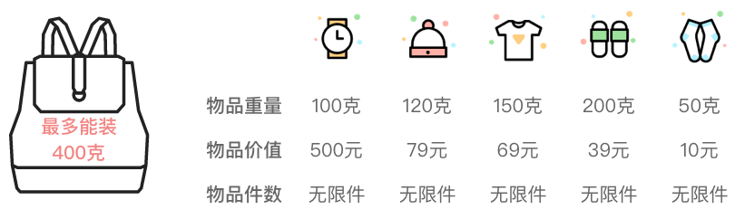
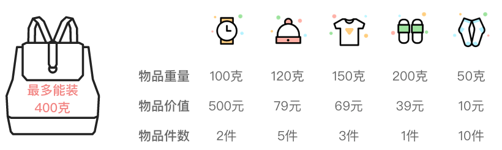
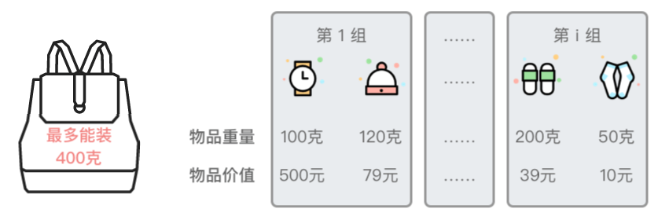
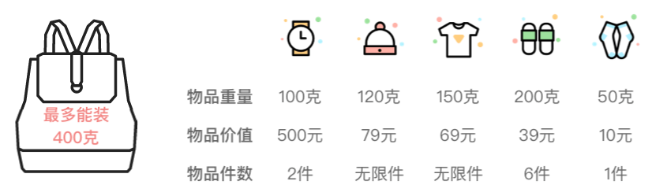

# 3.背包问题

## 1.背包问题简介

### 1.1 问题定义

**背包问题**：背包问题是线性 DP 问题中一类经典而又特殊的模型。

背包问题可以描述为：给定一组物品，每种物品都有自己的重量、价格以及数量。再给定一个最多能装重量为W的背包。现在选择将一些物品放入背包中，请问在总重量不超过背包载重上限的情况下，能装入背包的最大价值总和是多少？



根据物品限制条件的不同，背包问题可分为：0-1 背包问题、完全背包问题、多重背包问题、分组背包问题，以及混合背包问题等。

### 1.2 背包问题暴力求解思路

背包问题的暴力解题思路比较简单。假设有 $n$ 件物品。先枚举出这 $n$ 件物品所有可能的组合。然后再判断这些组合中的物品是否能放入背包，以及是否能得到最大价值。这种做法的时间复杂度是 $O(2^n)$。

背包问题暴力解法的时间复杂度是指数级别的，可以利用动态规划算法减少一下时间复杂度。

## 2.0-1背包问题

**0-1 背包问题**：有 $n$ 件物品和有一个最多能装重量为 $W$ 的背包。第 $i$ 件物品的重量为 $weight[i]$，价值为 $value[i]$，每件物品有且只有 $1$ 件。请问在总重量不超过背包载重上限的情况下，能装入背包的最大价值是多少？

### 2.1 基本思路：动态规划

1.  **划分阶段**

按照物品的序号、当前背包的载重上限进行阶段划分。

1.  **定义状态**

定义状态 $dp[i][w]$ 表示为：前 $i$ 件物品放入一个最多能装重量为 $w$ 的背包中，可以获得的最大价值。

状态 $dp[i][w]$ 是一个二维数组，其中第一维代表「当前正在考虑的物品」，第二维表示「当前背包的载重上限」，二维数组值表示「可以获得的最大价值」。

1.  **状态转移方程**

对于「\*\*将前 **$i$** 件物品放入一个最多能装重量为 **$w$** 的背包中，可以获得的最大价值 \*\*」这个子问题，如果只考虑第 $i - 1$ 件物品（前 $i$ 件物品中最后一件物品）的放入策略（放入背包和不放入背包两种策略）。则问题可以转换为一个只跟前 $i - 1$ 件物品相关的问题。

1.  **第 **$i - 1$** 件物品不放入背包**：问题转换为「\*\*前 **$i - 1$** 件物品放入一个最多能装重量为 **$w$** 的背包中 ，可以获得的最大价值」为 \*\*$dp[i - 1][w]$。
2.  **第 **$i - 1$** 件物品放入背包**：问题转换为\*\*「前 **$i - 1$** 件物品放入一个最多能装重量为 **$w - weight[i - 1]$** 的背包中，可以获得的最大价值」为 **$dp[i - 1][w - weight[i - 1]]$**，再加上「放入的第 **$i - 1$** 件物品的价值」为 \*\*$value[i - 1]$，则此时可以获得的最大价值为 $dp[i - 1][w - weight[i - 1]] + value[i - 1]$。

接下来再来考虑一下第 $i - 1$ 件物品满足什么条件时才能考虑是否放入背包，并且在什么条件下一定不能放入背包。

1.  如果当前背包的载重不足时（即 $w < weight[i - 1]$）：第 $i - 1$ 件物品一定不能放入背包，此时背包的价值 $dp[i][w]$ 仍为 $dp[i - 1][w]$ 时的价值，即 $dp[i][w] = dp[i - 1][w]$。
2.  如果当前背包的载重足够时（即 $w \ge weight[i - 1]$）：**第 **$i - 1$** 件物品可以考虑放入背包，或者不放入背包，此时背包的价值取两种情况下的最大值**，即 $dp[i][w] = max \lbrace dp[i - 1][w], dp[i - 1][w - weight[i - 1]] + value[i - 1] \rbrace$。

则状态转移方程为：

$dp[i][w] = \begin{cases} dp[i - 1][w] & w < weight[i - 1] \cr max \lbrace dp[i - 1][w], \quad dp[i - 1][w - weight[i - 1]] + value[i - 1] \rbrace & w \ge weight[i - 1] \end{cases}$

1.  **初始条件**

-   如果背包载重上限为 $0$，则无论选取什么物品，可以获得的最大价值一定是 $0$，即 $dp[i][0] = 0，0 \le i \le size$。
-   无论背包载重上限是多少，前 $0$ 件物品所能获得的最大价值一定为 $0$，即 $dp[0][w] = 0，0 \le w \le W$。

1.  **最终结果**

根据之前定义的状态，$dp[i][w]$ 表示为：前 $i$ 件物品放入一个最多能装重量为 $w$ 的背包中，可以获得的最大价值。则最终结果为 $dp[size][W]$，其中 $size$ 为物品的件数，$W$ 为背包的载重上限。

### 2.2 滚动数组优化

根据之前的求解过程可以看出：当依次处理前 $1 \sim n$ 件物品时，「前 $i$ 件物品的处理结果」只跟「前 $i - 1$ 件物品的处理结果」，而跟之前更早的处理结果没有太大关系。

也就是说在状态转移的过程中，只用到了当前行（第 $i$ 行）的 $dp[i][w]$ 以及上一行（第 $i - 1$ 行）的 $dp[i - 1][w]$、$dp[i - 1][w - weight[i - 1]]$。

所以没必要保存所有阶段的状态，**只需要保存上一阶段的所有状态和当前阶段的所有状态就可以了**，这样使用两个一维数组分别保存相邻两个阶段的所有状态就可以实现了。即：用 $dp[0][w]$ 保存原先 $dp[i - 1][w]$ 的状态，用 $dp[1][w]$ 保存当前 $dp[i][w]$ 的状态。

其实还可以进一步进行优化，只需要使用一个一维数组 $dp[w]$ 保存上一阶段的所有状态，采用使用「滚动数组」的方式对空间进行优化（去掉动态规划状态的第一维）。

1.  划分阶段：按照当前背包的载重上限进行阶段划分。
2.  &#x20;定义状态： $dp[w]$ 表示为：将物品装入最多能装重量为 $w$ 的背包中，可以获得的最大价值。
3.  状态转移方程

$dp[w] = \begin{cases} dp[w] & w < weight[i - 1] \cr max \lbrace dp[w], dp[w - weight[i - 1]]  + value[i - 1] \rbrace & w \ge weight[i - 1] \end{cases}$

在第 $i$ 轮计算之前，$dp[w]$ 中保存的是「第 $i - 1$ 阶段的所有状态值」。在第 $i$ 轮计算之后，$d[w]$ 中保存的是「第 $i$ 阶段的所有状态值」。

为了保证第 $i$ 轮计算过程中，$dp[w]$ 是由第 $i - 1$ 轮中 $dp[w]$ 和 $dp[w - weight[i - 1]]$ 两个状态递推而来的值，我们需要按照「从 $W \sim 0$ 逆序的方式」倒推 $dp[w]$。

这是因为如果我们采用「从 $0 \sim W$ 正序递推的方式」递推 $dp[w]$，如果当前状态 $dp[w - weight[i]]$ 已经更新为当前第 $i$ 阶段的状态值。那么在向右遍历到 $dp[w]$ 时，我们需要的是第 $i - 1$ 阶段的状态值（即上一阶段的 $dp[w - weight[i - 1]]$），而此时 $dp[w - weight[i - 1]]$ 已经更新了，会破坏当前阶段的状态值，从而无法推出正确结果。

而如果按照「从 $W \sim 0$ 逆序的方式」倒推 $dp[w]$ 则不会出现该问题。

因为 $w < weight[i - 1]$ 时，$dp[w]$ 只能取上一阶段的 $dp[w]$，其值相当于没有变化，这部分可以不做处理。所以我们在逆序倒推 $dp[w]$ 时，只需遍历到 $weight[i - 1]$ 时即可。

1.  初始条件：无论背包载重上限为多少，只要不选择物品，可以获得的最大价值一定是 $0$，即 $dp[w] = 0，0 \le w \le W$。
2.  最终结果：$dp[w]$ 表示为：将物品装入最多能装重量为 $w$ 的背包中，可以获得的最大价值。则最终结果为 $dp[W]$，其中 $W$ 为背包的载重上限。

```python
class ZeroOnePack:
    """ 0-1背包问题
    """
    def zero_ont_pack_method1(self, weight:[int], value:[int], W:int):
        """ 思路1 : 动态规划 + 二维基本思路
        """
        size = len(weight)
        dp = [[0 for _ in range(W + 1)] for _ in range(size + 1)]

        # 枚举前i中物品
        for i in range(1, size + 1):
            # 枚举背包装载重量
            for w in range(W + 1):
                # 第 i - 1件物品装不下
                if w < weight[i - 1]:
                    # dp[i][w] 取「前 i - 1 件物品装入载重为 w 的背包中的最大价值」
                    dp[i][w] = dp[i - 1][w]
                else:
                    # dp[i][w] 取「前 i - 1 件物品装入载重为 w 的背包中的最大价值」
                    # 与「前 i - 1 件物品装入载重为 w - weight[i - 1] 的背包中，
                    # 再装入第 i - 1 物品所得的最大价值」两者中的最大值
                    dp[i][w] = max(dp[i-1][w], dp[i-1][w - weight[i-1]] + value[i-1])

        return dp[size][W]
    
    def zero_ont_pack_method2(self, weight:[int], value:[int], W:int):
        """ 思路2 : 动态规划 + 滚动数组优化
        """
        size = len(weight)
        dp = [0 for _ in range(W + 1)]

        # 枚举前i种物品
        for i in range(1, size+1):
            # 逆序枚举背包装载重量（避免错误值状态）
            for w in range(W, weight[i - 1] - 1, -1):
                # dp[w] 取「前 i - 1 件物品装入载重为 w 的背包中的最大价值」
                # 与「前 i - 1 件物品装入载重为 w - weight[i - 1] 的背包中，
                # 再装入第 i - 1 物品所得的最大价值」两者中的最大值
                dp[w] = max(dp[w], dp[w-weight[i-1]] + value[i-1])

        return dp[W]
```

## 3.完全背包问题

> **完全背包问题**：有 $n$ 种物品和一个最多能装重量为 $W$ 的背包，第 $i$ 种物品的重量为 $weight[i]$，价值为 $value[i]$，每种物品数量没有限制。请问在总重量不超过背包载重上限的情况下，能装入背包的最大价值是多少？



### 3.1 基本思路

> **完全背包问题的特点**：每种物品有无限件。

可以参考「0-1 背包问题」的状态定义和基本思路，对于容量为 $w$ 的背包，最多可以装 $\frac{w}{weight[i - 1]}$ 件第 $i - 1$ 件物品。那么可以多加一层循环，枚举第 $i - 1$ 件物品可以选择的件数（$0 \sim \frac{w}{weight[i - 1]}$），从而将「完全背包问题」转换为「0-1 背包问题」。

**思路 1：动态规划 + 二维基本思路**

1.  划分阶段：按照物品种类的序号、当前背包的载重上限进行阶段划分
2.  定义状态：$dp[i][w]$ 表示为：前 $i$ 种物品放入一个最多能装重量为 $w$ 的背包中，可以获得的最大价值。

    状态 $dp[i][w]$ 是一个二维数组，其中第一维代表「当前正在考虑的物品种类」，第二维表示「当前背包的载重上限」，二维数组值表示「可以获得的最大价值」。
3.  状态转移方程

    由于每种物品可选的数量没有限制，因此状态 $dp[i][w]$ 可能从以下方案中选择最大值：
    1.  选择 $0$ 件第 $i - 1$ 件物品：可以获得的最大价值为 $dp[i - 1][w]$
    2.  选择 $1$ 件第 $i - 1$ 件物品：可以获得的最大价值为 $dp[i - 1][w - weight[i - 1]] + value[i - 1]$。
    3.  选择 $2$ 件第 $i - 1$ 件物品：可以获得的最大价值为 $dp[i - 1][w - 2 \times weight[i - 1]] + 2 \times value[i - 1]$。
    4.  ……
    5.  选择 $k$ 件第 $i - 1$ 件物品：可以获得的最大价值为 $dp[i - 1][w - k \times weight[i - 1]] + k \times value[i - 1]$。
    > 注意：选择 $k$ 件第 $i - 1$ 件物品的条件是 $0 \le k \times weight[i - 1] \le w$。
    > 则状态转移方程为：
    $dp[i][w] = max \lbrace dp[i - 1][w - k \times weight[i - 1]] + k \times value[i - 1] \rbrace，\quad 0 \le k \times weight[i - 1] \le w$。
4.  初始条件

-   如果背包载重上限为 $0$，则无论选取什么物品，可以获得的最大价值一定是 $0$，即 $dp[i][0] = 0，0 \le i \le size$。
-   无论背包载重上限是多少，前 $0$ 种物品所能获得的最大价值一定为 $0$，即 $dp[0][w] = 0，0 \le w \le W$。

1.  最终结果：$dp[i][w]$ 表示为：前 $i$ 种物品放入一个最多能装重量为 $w$ 的背包中，可以获得的最大价值。则最终结果为 $dp[size][W]$，其中 $size$ 为物品的种类数，$W$ 为背包的载重上限。

```python
class CompletePack:
    """ 完全背包问题
    """
    def complete_pack_method1(self, weight:[int], value:[int], W:int):
        """ 思路1：动态规划 + 二维基本思路
        """
        size = len(weight)
        dp = [[0 for _ in range(W + 1)] for _ in range(size + 1)]

        # 枚举前i种物品
        for i in range(1, size + 1):
            # 枚举背包装载重量
            for w in range(W + 1):
                # 枚举第 i-1种物品能取个数
                for k in range(w // weight[i - 1] + 1):
                    # dp[i][w] 取所有 dp[i - 1][w - k * weight[i - 1] + k * value[i - 1] 中最大值
                    dp[i][w] = max(dp[i][w], dp[i-1][w-k*weight[i-1]] + k*value[i-1])
        
        return dp[size][W]
```

### 3.2 状态转移方程优化

上之前的思路中，对于每种物品而言，每次都需要枚举所有可行的物品数目 $k$，这就大大增加了时间复杂度。

实际上，可以对之前的状态转移方程进行一些优化，从而减少一下算法的时间复杂度。

将之前的状态转移方程&#x20;

$dp[i][w] = max \lbrace dp[i - 1][w - k \times weight[i - 1]] + k \times value[i - 1] \rbrace，\quad 0 \le k \times weight[i - 1] \le w$ &#x20;

进行展开：

$(1) \quad dp[i][w] = max \begin{cases} dp[i - 1][w] \cr dp[i - 1][w - weight[i - 1]] + value[i - 1]  \cr dp[i - 1][w - 2 \times weight[i - 1]] + 2 \times value[i - 1] \cr …… \cr  \cr dp[i - 1][w - k \times weight[i - 1]] + k \times value[i - 1] \end{cases}，\quad 0 \le k \times weight[i - 1] \le w$ &#x20;

而对于 $dp[i][w - weight[i - 1]]$ 我们有：

$(2) \quad dp[i][w - weight[i - 1]] = max \begin{cases} dp[i - 1][w - weight[i - 1]] \cr dp[i - 1][w - 2 \times weight[i - 1]] + value[i - 1]  \cr dp[i - 1][w - 3 \times weight[i - 1]] + 2 \times value[i - 1] \cr …… \cr dp[i - 1][w - k \times weight[i - 1]] + (k - 1) \times value[i - 1] \end{cases}，\quad weight[i - 1] \le k \times weight[i - 1] \le w$ &#x20;

通过观察可以发现：

1.  $(1)$ 式中共有 $k + 1$ 项，$(2)$ 式中共有 $k$ 项；
2.  $(2)$ 式整个式子与 $(1)$ 式第 $1 \sim k + 1$ 项刚好相差一个 $value[i - 1]$。

则将 $(2)$ 式加上 $value[i - 1]$，再代入 $(1)$ 式中，可得到简化后的「状态转移方程」为：

$(3) \quad dp[i][w] = max \lbrace dp[i - 1][w], \quad dp[i][w - weight[i - 1]] + value[i - 1]  \rbrace, \quad 0 \le weight[i - 1] \le w$。

简化后的「状态转移方程」去除了对物品件数的依赖，也就不需要遍历 $k$ 了，三层循环降为了两层循环。

> 注意：式 $(3)$ 的满足条件为 $0 \le weight[i - 1] \le w$。当 $w < weight[i - 1]$ 时，$dp[i][w] = dp[i - 1][w]$。

则状态转移方程为：

$\quad dp[i][w] = \begin{cases}  dp[i - 1][w] & w < weight[i - 1] \cr max \lbrace dp[i - 1][w], \quad dp[i][w - weight[i - 1]] + value[i - 1]  \rbrace & w \ge weight[i - 1] \end{cases}$

从上述状态转移方程我们可以看出：该式子与 0-1 背包问题中「思路 1」的状态转移式极其相似。

> 唯一区别点在于：
> 1\. 0-1 背包问题中状态为 $dp[i - 1][w - weight[i - 1]] + value[i - 1]$，这是第 $i - 1$ 阶段上的状态值。
> 2\. 完全背包问题中状态为 $dp[i][w - weight[i - 1]] + value[i - 1]$，这是第 $i$ 阶段上的状态值。

**思路 2：动态规划 + 状态转移方程优化**

1.  划分阶段：按照物品种类的序号、当前背包的载重上限进行阶段划分。
2.  定义状态

-   定义状态 $dp[i][w]$ 表示为：前 $i$ 种物品放入一个最多能装重量为 $w$ 的背包中，可以获得的最大价值。
-   状态 $dp[i][w]$ 是一个二维数组，其中第一维代表「当前正在考虑的物品种类」，第二维表示「当前背包的载重上限」，二维数组值表示「可以获得的最大价值」。

1.  状态转移方程

$\quad dp[i][w] = \begin{cases}  dp[i - 1][w] & w < weight[i - 1] \cr max \lbrace dp[i - 1][w], \quad dp[i][w - weight[i - 1]] + value[i - 1]  \rbrace & w \ge weight[i - 1] \end{cases}$

1.  初始条件

-   如果背包载重上限为 $0$，则无论选取什么物品，可以获得的最大价值一定是 $0$，即 $dp[i][0] = 0，0 \le i \le size$。
-   无论背包载重上限是多少，前 $0$ 种物品所能获得的最大价值一定为 $0$，即 $dp[0][w] = 0，0 \le w \le W$。

1.  最终结果：$dp[i][w]$ 表示为：前 $i$ 种物品放入一个最多能装重量为 $w$ 的背包中，可以获得的最大价值。则最终结果为 $dp[size][W]$，其中 $size$ 为物品的种类数，$W$ 为背包的载重上限。

```python
class CompletePack:
    """ 完全背包问题
    """
    def complete_pack_method2(self, weight:[int], value:[int], W:int):
        """ 思路2：动态规划 + 状态转移方程优化
        """
        size = len(weight)
        dp = [[0 for _ in range(W+1)] for _ in range(size + 1)]

        # 枚举前i种物品
        for i in range(1, size + 1):
            # 枚举背包状态重量
            for w in range(W + 1):
                # 第 i - 1 件物品装不下
                if w < weight[i - 1]:
                    # dp[i][w]取“前i-1种物品装入载重为w的背包种的最大价值”
                    dp[i][w] = dp[i - 1][w]
                else:
                    # dp[i][w] 取「前 i - 1 种物品装入载重为 w 的背包中的最大价值」
                    # 与「前 i 种物品装入载重为 w - weight[i - 1] 的背包中，
                    # 再装入 1 件第 i - 1 种物品所得的最大价值」两者中的最大值
                    dp[i][w] = max(dp[i-1][w], dp[i][w-weight[i-1]] + value[i-1])
        
        return dp[size[W]]
```

### 3.3 滚动数组优化

通过观察「思路 2」中的状态转移方程&#x20;

$dp[i][w] = \begin{cases}  dp[i - 1][w] & w < weight[i - 1] \cr max \lbrace dp[i - 1][w], \quad dp[i][w - weight[i - 1]] + value[i - 1]  \rbrace & w \ge weight[i - 1] \end{cases}$

可以看出：只用到了当前行（第 $i$ 行）的 $dp[i][w]$、$dp[i][w - weight[i - 1]]$，以及上一行（第 $i - 1$ 行）的 $dp[i - 1][w]$。

所以没必要保存所有阶段的状态，只需要使用一个一维数组 $dp[w]$ 保存上一阶段的所有状态，采用使用「滚动数组」的方式对空间进行优化（去掉动态规划状态的第一维）。

**思路 3：动态规划 + 滚动数组优化**

1.  划分阶段：按照当前背包的载重上限进行阶段划分。
2.  定义状态：$dp[w]$ 表示为：将物品装入最多能装重量为 $w$ 的背包中，可以获得的最大价值。
3.  状态转移方程

    $dp[w] = \begin{cases}  dp[w] & w < weight[i - 1] \cr max \lbrace dp[w], \quad dp[w - weight[i - 1]]  + value[i - 1] \rbrace & w \ge weight[i - 1] \end{cases}$
    > 注意：这里的 $dp[w - weight[i - 1]]$ 是第 $i$ 轮计算之后的「第 $i$ 阶段的状态值」。
    > 因为在计算 $dp[w]$ 时，我们需要用到第 $i$ 轮计算之后的 $dp[w - weight[i - 1]]$，所以我们需要按照「从 $0 \sim W$ 正序递推的方式」递推 $dp[w]$，这样才能得到正确的结果。
    因为 $w < weight[i - 1]$ 时，$dp[w]$ 只能取上一阶段的 $dp[w]$，其值相当于没有变化，这部分可以不做处理。所以我们在正序递推 $dp[w]$ 时，只需从 $weight[i - 1]$ 开始遍历即可。
4.  初始条件：无论背包载重上限为多少，只要不选择物品，可以获得的最大价值一定是 $0$，即 $dp[w] = 0，0 \le w \le W$。
5.  最终结果：$dp[w]$ 表示为：将物品装入最多能装重量为 $w$ 的背包中，可以获得的最大价值。则最终结果为 $dp[W]$，其中 $W$ 为背包的载重上限。

```python
class CompletePack:
    """ 完全背包问题
    """
    def completePackMethod3(self, weight: [int], value: [int], W: int):
        """ 思路 3：动态规划 + 滚动数组优化
        """
        size = len(weight)
        dp = [0 for _ in range(W + 1)]
        
        # 枚举前 i 种物品
        for i in range(1, size + 1):
            # 正序枚举背包装载重量
            for w in range(weight[i - 1], W + 1):
                # dp[w] 取「前 i - 1 种物品装入载重为 w 的背包中的最大价值」
                # 与「前 i 种物品装入载重为 w - weight[i - 1] 的背包中，
                # 再装入 1 件第 i - 1 种物品所得的最大价值」两者中的最大值
                dp[w] = max(dp[w], dp[w - weight[i - 1]] + value[i - 1])
                
        return dp[W]
```

## 4.多重背包问题

> **多重背包问题**：有 $n$ 种物品和一个最多能装重量为 $W$ 的背包，第 $i$ 种物品的重量为 $weight[i]$，价值为 $value[i]$，件数为 $count[i]$。请问在总重量不超过背包载重上限的情况下，能装入背包的最大价值是多少？



### 4.1 基本思路

可以参考「0-1 背包问题」的状态定义和基本思路，对于容量为 $w$ 的背包，最多可以装 $min \lbrace count[i - 1]，\frac{w}{weight[i - 1]} \rbrace$ 件第 $i - 1$ 件物品。那么可以多加一层循环，枚举第 $i - 1$ 件物品可以选择的件数（$0 \sim min \lbrace count[i - 1]，\frac{w}{weight[i - 1]} \rbrace$），从而将「完全背包问题」转换为「0-1 背包问题」。

**思路1：动态规划 + 二维基本思路**

1.  划分阶段：按照物品种类的序号、当前背包的载重上限进行阶段划分。
2.  定义状态：$dp[i][w]$ 表示为：前 $i$ 种物品放入一个最多能装重量为 $w$ 的背包中，可以获得的最大价值。状态 $dp[i][w]$ 是一个二维数组，其中第一维代表「当前正在考虑的物品种类」，第二维表示「当前背包的载重上限」，二维数组值表示「可以获得的最大价值」。
3.  状态转移方程

$dp[i][w] = max \lbrace dp[i - 1][w - k \times weight[i - 1]] + k \times value[i - 1] \rbrace，\quad 0 \le k \le min \lbrace count[i - 1]，\frac{w}{weight[i - 1]} \rbrace$。

1.  初始条件

-   如果背包载重上限为 $0$，则无论选取什么物品，可以获得的最大价值一定是 $0$，即 $dp[i][0] = 0，0 \le i \le size$。
-   无论背包载重上限是多少，前 $0$ 种物品所能获得的最大价值一定为 $0$，即 $dp[0][w] = 0，0 \le w \le W$。

1.  最终结果：$dp[i][w]$ 表示为：前 $i$ 种物品放入一个最多能装重量为 $w$ 的背包中，可以获得的最大价值。则最终结果为 $dp[size][W]$，其中 $size$ 为物品的种类数，$W$ 为背包的载重上限。

```python
class MultiplePack:
    """ 多重背包问题
    """
    def multiple_pack_method1(self, weight:[int], value:[int], count:[int], W:int):
        """ 思路1：动态规划 + 二维基本思路
        """
        size = len(weight)
        dp = [[0 for _ in range(W + 1)] for _ in range(size + 1)]

        # 枚举前i种物品
        for i in range(1, size+1):
            # 枚举背包装载重量
            for w in range(W + 1):
                # 枚举第i-1种物品能取的个数
                for k in range(min(count[i - 1], w // weight[i-1] - 1)):
                    # dp[i][w]取所有dp[i-1][w-k*weight[i-1]] + k* value[i-1]中最大值
                    dp[i][w] = max(dp[i][w], dp[i-1][w-k*weight[i-1]] + k*value[i-1])

        return dp[size][W]
```

### 4.2 滚动数组优化

在「完全背包问题」中，通过优化「状态转移方程」的方式，成功去除了对物品件数 $k$ 的依赖，从而将时间复杂度下降了一个维度。

而在「多重背包问题」中，在递推 $dp[i][w]$ 时，是无法从 $dp[i][w - weight[i - 1]]$ 状态得知目前究竟已经使用了多个件第 $i - 1$ 种物品，也就无法判断第 $i - 1$ 种物品是否还有剩余数量可选。这就导致了无法通过优化「状态转移方程」的方式将「多重背包问题」的时间复杂度降低。

但是可以参考「完全背包问题」+「滚动数组优化」的方式，将算法的空间复杂度下降一个维度。

**思路 2：动态规划 + 滚动数组优化**

1.  划分阶段：按照当前背包的载重上限进行阶段划分。
2.  定义状态：$dp[w]$ 表示为：将物品装入最多能装重量为 $w$ 的背包中，可以获得的最大价值。
3.  状态转移方程：$dp[w] = max \lbrace dp[w - k \times weight[i - 1]] + k \times value[i - 1] \rbrace , \quad 0 \le k \le min \lbrace count[i - 1]，\frac{w}{weight[i - 1]} \rbrace$
4.  初始条件：无论背包载重上限为多少，只要不选择物品，可以获得的最大价值一定是 $0$，即 $dp[w] = 0，0 \le w \le W$。
5.  最终结果： $dp[w]$ 表示为：将物品装入最多能装重量为 $w$ 的背包中，可以获得的最大价值。则最终结果为 $dp[W]$，其中 $W$ 为背包的载重上限。

```python
class MultiplePack:
    """ 多重背包问题
    """    
    def multiplePackMethod2(self, weight: [int], value: [int], count: [int], W: int):
        """ 思路 2：动态规划 + 滚动数组优化
        """
        size = len(weight)
        dp = [0 for _ in range(W + 1)]
        
        # 枚举前 i 种物品
        for i in range(1, size + 1):
            # 逆序枚举背包装载重量（避免状态值错误）
            for w in range(W, weight[i - 1] - 1, -1):
                # 枚举第 i - 1 种物品能取个数
                for k in range(min(count[i - 1], w // weight[i - 1]) + 1):
                    # dp[w] 取所有 dp[w - k * weight[i - 1]] + k * value[i - 1] 中最大值
                    dp[w] = max(dp[w], dp[w - k * weight[i - 1]] + k * value[i - 1])
                
        return dp[W]
```

## 5.分组背包问题

> **分组背包问题**：有 $n$ 组物品和一个最多能装重量为 $W$ 的背包，第 $i$ 组物品的件数为 $group\underline{}count[i]$，第 $i$ 组的第 $j$ 个物品重量为 $weight[i][j]$，价值为 $value[i][j]$。每组物品中最多只能选择 $1$ 件物品装入背包。请问在总重量不超过背包载重上限的情况下，能装入背包的最大价值是多少？



### 5.1 基本思路

**思路 1：动态规划 + 二维基本思路**

1.  划分阶段：按照物品种类的序号、当前背包的载重上限进行阶段划分。
2.  定义状态

-   定义状态 $dp[i][w]$ 表示为：前 $i$ 组物品放入一个最多能装重量为 $w$ 的背包中，可以获得的最大价值。
-   状态 $dp[i][w]$ 是一个二维数组，其中第一维代表「当前正在考虑的物品组数」，第二维表示「当前背包的载重上限」，二维数组值表示「可以获得的最大价值」。

1.  状态转移方程

    由于可以不选择 $i - 1$ 组物品中的任何物品，也可以从第 $i - 1$ 组物品的第 $0 \sim group\underline{}count[i - 1] - 1$ 件物品中随意选择 $1$ 件物品，所以状态 $dp[i][w]$ 可能从以下方案中选择最大值：
    1.  不选择第 $i - 1$ 组中的任何物品：可以获得的最大价值为 $dp[i - 1][w]$。
    2.  选择第 $i - 1$ 组物品中第 $0$ 件：可以获得的最大价值为 $dp[i - 1][w - weight[i - 1][0]] + value[i - 1][0]$。
    3.  选择第 $i - 1$ 组物品中第 $1$ 件：可以获得的最大价值为 $dp[i - 1][w - weight[i - 1][1]] + value[i - 1][1]$。
    4.  ……
    5.  选择第 $i - 1$ 组物品中最后 $1$ 件：假设 $k =  group\underline{}count[i - 1] - 1$，则可以获得的最大价值为 $dp[i - 1][w - weight[i - 1][k]] + value[i - 1][k]$。
        则状态转移方程为：
    $dp[i][w] = max \lbrace dp[i - 1][w]，dp[i - 1][w - weight[i - 1][k]] + value[i - 1][k] \rbrace , \quad 0 \le k \le group\underline{}count[i - 1]$
2.  初始条件

-   如果背包载重上限为 $0$，则无论选取什么物品，可以获得的最大价值一定是 $0$，即 $dp[i][0] = 0，0 \le i \le size$。
-   无论背包载重上限是多少，前 $0$ 组物品所能获得的最大价值一定为 $0$，即 $dp[0][w] = 0，0 \le w \le W$。

1.  最终结果：根据之前定义的状态，$dp[i][w]$ 表示为：前 $i$ 组物品放入一个最多能装重量为 $w$ 的背包中，可以获得的最大价值。则最终结果为 $dp[size][W]$，其中 $size$ 为物品的种类数，$W$ 为背包的载重上限。

```python
class Solution:
    # 思路 1：动态规划 + 二维基本思路
    def groupPackMethod1(self, group_count: [int], weight: [[int]], value: [[int]], W: int):
        size = len(group_count)
        dp = [[0 for _ in range(W + 1)] for _ in range(size + 1)]
        
        # 枚举前 i 组物品
        for i in range(1, size + 1):
            # 枚举背包装载重量
            for w in range(W + 1):
                # 枚举第 i - 1 组物品能取个数
                dp[i][w] = dp[i - 1][w]
                for k in range(group_count[i - 1]):
                    if w >= weight[i - 1][k]:
                        # dp[i][w] 取所有 dp[i - 1][w - weight[i - 1][k]] + value[i - 1][k] 中最大值
                        dp[i][w] = max(dp[i][w], dp[i - 1][w - weight[i - 1][k]] + value[i - 1][k])
```

### 2.2 滚动数组优化

思路 2：动态规划 + 滚动数组优化

1.  划分阶段：按照当前背包的载重上限进行阶段划分。
2.  定义状态：$dp[w]$ 表示为：将物品装入最多能装重量为 $w$ 的背包中，可以获得的最大价值。
3.  状态转移方程：$dp[w] = max \lbrace dp[w], \quad dp[w - weight[i - 1][k]]  + value[i - 1][k] \rbrace ，\quad 0 \le k \le group\underline{}count[i - 1]$
4.  初始条件：无论背包载重上限为多少，只要不选择物品，可以获得的最大价值一定是 $0$，即 $dp[w] = 0，0 \le w \le W$。
5.  最终结果：$dp[w]$ 表示为：将物品装入最多能装重量为 $w$ 的背包中，可以获得的最大价值。则最终结果为 $dp[W]$，其中 $W$ 为背包的载重上限。

```python
class Solution:
    # 思路 2：动态规划 + 滚动数组优化
    def groupPackMethod2(self, group_count: [int], weight: [[int]], value: [[int]], W: int):
        size = len(group_count)
        dp = [0 for _ in range(W + 1)]
        
        # 枚举前 i 组物品
        for i in range(1, size + 1):
            # 逆序枚举背包装载重量
            for w in range(W, -1, -1):
                # 枚举第 i - 1 组物品能取个数
                for k in range(group_count[i - 1]):
                    if w >= weight[i - 1][k]:
                        # dp[w] 取所有 dp[w - weight[i - 1][k]] + value[i - 1][k] 中最大值
                        dp[w] = max(dp[w], dp[w - weight[i - 1][k]] + value[i - 1][k])
                        
        return dp[W]
```

## 6.混合背包问题

> **混合背包问题**：有 $n$ 种物品和一个最多能装重量为 $W$ 的背包，第 $i$ 种物品的重量为 $weight[i]$，价值为 $value[i]$，件数为 $count[i]$。其中：
>
> 1.当 $count[i] = -1$ 时，代表该物品只有 $1$ 件。
> 2\. 当 $count[i] = 0$ 时，代表该物品有无限件。
> 3\. 当 $count[i] > 0$ 时，代表该物品有 $count[i]$ 件。
>
> 请问在总重量不超过背包载重上限的情况下，能装入背包的最大价值是多少？



**动态规划**

混合背包问题其实就是将「0-1 背包问题」、「完全背包问题」和「多重背包问题」这 $3$ 种背包问题综合起来，有的是能取 $1$ 件，有的能取无数件，有的只能取 $count[i]$ 件。

其实只要理解了之前讲解的这 $3$ 种背包问题的核心思想，只要将其合并在一起就可以了。

并且在「多重背包问题」中，曾经使用「二进制优化」的方式，将「多重背包问题」转换为「0-1 背包问题」，那么在解决「混合背包问题」时，也可以先将「多重背包问题」转换为「0-1 背包问题」，然后直接再区分是「0-1 背包问题」还是「完全背包问题」就可以了。

```python
class Solution:
    def mixedPackMethod1(self, weight: [int], value: [int], count: [int], W: int):
        weight_new, value_new, count_new = [], [], []
        
        # 二进制优化
        for i in range(len(weight)):
            cnt = count[i]
            # 多重背包问题，转为 0-1 背包问题
            if cnt > 0:
                k = 1
                while k <= cnt:
                    cnt -= k
                    weight_new.append(weight[i] * k)
                    value_new.append(value[i] * k)
                    count_new.append(1)
                    k *= 2
                if cnt > 0:
                    weight_new.append(weight[i] * cnt)
                    value_new.append(value[i] * cnt)
                    count_new.append(1)
            # 0-1 背包问题，直接添加
            elif cnt == -1:
                weight_new.append(weight[i])
                value_new.append(value[i])
                count_new.append(1)
            # 完全背包问题，标记并添加
            else:
                weight_new.append(weight[i])
                value_new.append(value[i])
                count_new.append(0)
                
        dp = [0 for _ in range(W + 1)]
        size = len(weight_new)
    
        # 枚举前 i 种物品
        for i in range(1, size + 1):
            # 0-1 背包问题
            if count_new[i - 1] == 1:
                # 逆序枚举背包装载重量（避免状态值错误）
                for w in range(W, weight_new[i - 1] - 1, -1):
                    # dp[w] 取「前 i - 1 件物品装入载重为 w 的背包中的最大价值」与「前 i - 1 件物品装入载重为 w - weight_new[i - 1] 的背包中，再装入第 i - 1 物品所得的最大价值」两者中的最大值
                    dp[w] = max(dp[w], dp[w - weight_new[i - 1]] + value_new[i - 1])
            # 完全背包问题
            else:
                # 正序枚举背包装载重量
                for w in range(weight_new[i - 1], W + 1):
                    # dp[w] 取「前 i - 1 种物品装入载重为 w 的背包中的最大价值」与「前 i 种物品装入载重为 w - weight[i - 1] 的背包中，再装入 1 件第 i - 1 种物品所得的最大价值」两者中的最大值
                    dp[w] = max(dp[w], dp[w - weight_new[i - 1]] + value_new[i - 1])
                    
        return dp[W]
```

## 6.实战题目

### 6.1 分割等和自己 - 01背包

[416. 分割等和子集 - 力扣（LeetCode）](https://leetcode.cn/problems/partition-equal-subset-sum/ "416. 分割等和子集 - 力扣（LeetCode）")

```python
给你一个 只包含正整数 的 非空 数组 nums 。请你判断是否可以将这个数组分割成两个子集，使得两个子集的元素和相等。

 

示例 1：

输入：nums = [1,5,11,5]
输出：true
解释：数组可以分割成 [1, 5, 5] 和 [11] 。
```

这道题换一种说法就是：从数组中选择一些元素组成一个子集，使子集的元素和恰好等于整个数组元素和的一半。

这样的话，这道题就可以转变为「0-1 背包问题」。

1.  把整个数组中的元素和记为 $sum$，把元素和的一半 $target = \frac{sum}{2}$ 看做是「0-1 背包问题」中的背包容量。
2.  把数组中的元素 $nums[i]$ 看做是「0-1 背包问题」中的物品。
3.  第 $i$ 件物品的重量为 $nums[i]$，价值也为 $nums[i]$。
4.  因为物品的重量和价值相等，如果能装满载重上限为 $target$ 的背包，那么得到的最大价值也应该是 $target$。

这样问题就转变为：**给定一个数组 **$nums$** 代表物品，数组元素和的一半 **$target = \frac{sum}{2}$** 代表背包的载重上限**。其中第 $i$ 件物品的重量为 $nums[i]$，价值为 $nums[i]$，每件物品有且只有 $1$ 件。请问在总重量不超过背包载重上限的情况下，能否将背包装满从而得到最大价值？

1.  划分阶段：按照当前背包的载重上限进行阶段划分。
2.  定义状态：$dp[w]$ 表示为：从数组 $nums$ 中选择一些元素，放入最多能装元素和为 $w$ 的背包中，得到的元素和最大为多少。
3.  **状态转移方程**

$dp[w] = \begin{cases} dp[w] & w < nums[i - 1] \cr max \lbrace dp[w], \quad dp[w - nums[i - 1]] + nums[i - 1] \rbrace & w \ge nums[i - 1] \end{cases}$

1.  初始条件：无论背包载重上限为多少，只要不选择物品，可以获得的最大价值一定是 $0$，即 $dp[w] = 0，0 \le w \le W$。

###### 5. 最终结果：$dp[target]$ 表示为：从数组 $nums$ 中选择一些元素，放入最多能装元素和为 $target = \frac{sum}{2}$ 的背包中，得到的元素和最大值。&#x20;

所以最后判断一下 $dp[target]$ 是否等于 $target$。如果 $dp[target] == target$，则说明集合中的子集刚好能够凑成总和 $target$，此时返回 `True`；否则返回 `False`。

```c++
class Solution {
public:
    bool canPartition(vector<int>& nums) {
        int sum_num = accumulate(nums.begin(), nums.end(), 0);
        if (sum_num%2 == 1) {
            return false;
        }
        int target = sum_num / 2;
        return this->zero_ont_pack_method2(nums, nums, target) == target;
    }

    // 思路2：动态规划 + 滚动数组优化
    int zero_ont_pack_method2(std::vector<int>& weight, std::vector<int>& value, int W) {
        int size = weight.size();
        std::vector<int> dp(W+1, 0);

        // 枚举前i种物品
        for (int i = 1; i <= size; i++) {
            // 逆序枚举背包装载重量（避免状态值错误）
            for (int w = W; w > weight[i - 1] - 1; w--) {
                // dp[w] 取「前 i - 1 件物品装入载重为 w 的背包中的最大价值」
                // 与「前 i - 1 件物品装入载重为 w - weight[i - 1] 的背包中，
                // 再装入第 i - 1 物品所得的最大价值」两者中的最大值
                dp[w] = std::max(dp[w], dp[w-weight[i-1]] + value[i-1]);
            }
        }
        return dp[W];
    }
};
```

### 6.2 最后一块石头的重量Ⅱ

[1049. 最后一块石头的重量 II - 力扣（LeetCode）](https://leetcode.cn/problems/last-stone-weight-ii/ "1049. 最后一块石头的重量 II - 力扣（LeetCode）")

```python
有一堆石头，用整数数组 stones 表示。其中 stones[i] 表示第 i 块石头的重量。

每一回合，从中选出任意两块石头，然后将它们一起粉碎。假设石头的重量分别为 x 和 y，且 x <= y。那么粉碎的可能结果如下：

- 如果 x == y，那么两块石头都会被完全粉碎；
- 如果 x != y，那么重量为 x 的石头将会完全粉碎，而重量为 y 的石头新重量为 y-x。
最后，最多只会剩下一块 石头。返回此石头 最小的可能重量 。如果没有石头剩下，就返回 0。

输入：stones = [2,7,4,1,8,1]
输出：1
解释：
组合 2 和 4，得到 2，所以数组转化为 [2,7,1,8,1]，
组合 7 和 8，得到 1，所以数组转化为 [2,1,1,1]，
组合 2 和 1，得到 1，所以数组转化为 [1,1,1]，
组合 1 和 1，得到 0，所以数组转化为 [1]，这就是最优值。
```

这个问题其实可以转化为：把一堆石头尽量平均的分成两对，求两堆石头重量差的最小值。

这就和「[0416. 分割等和子集](https://leetcode.cn/problems/partition-equal-subset-sum/ "0416. 分割等和子集")」有点相似。两堆石头的重量要尽可能的接近数组总数量和的一半。

进一步可以变为：「0-1 背包问题」。

1.  假设石头总重量和为 $sum$，将一堆石头放进载重上限为 $sum / 2$ 的背包中，获得的最大价值为 $max\underline{}weight$（即其中一堆石子的重量）。另一堆石子的重量为 $sum - max\underline{}weight$。
2.  则两者的差值为 $sum - 2 \times max\underline{}weight$，即为答案。

动态规划步骤

1.  划分阶段：按照石头的序号进行阶段划分。
2.  定义状态：$dp[w]$ 表示为：将石头放入载重上限为 $w$ 的背包中可以获得的最大价值。
3.  状态转移方程：$dp[w] = max \lbrace dp[w], dp[w - stones[i - 1]] + stones[i - 1] \rbrace$。
4.  初始条件：无论背包载重上限为多少，只要不选择石头，可以获得的最大价值一定是 $0$，即 $dp[w] = 0，0 \le w \le W$。
5.  最终结果：$dp[w]$ 表示为：将石头放入载重上限为 $w$ 的背包中可以获得的最大价值，即第一堆石头的价值为 $dp[size]$，第二堆石头的价值为 $sum - dp[size]$，最终答案为两者的差值，即 $sum - dp[size] \times 2$。

```c++
class Solution {
public:
    int lastStoneWeightII(vector<int>& stones) {
        int W = 1500;
        int size = stones.size();
        std::vector<int> dp(W + 1, 0);
        int sum_num = accumulate(stones.begin(), stones.end(), 0);
        int target = sum_num / 2;

        for (int i = 1; i <= size; i++) {
            for (int w = target; w >= stones[i-1]; w--) {
                dp[w] = std::max(dp[w], dp[w-stones[i-1]] + stones[i-1]);
            }
        }

        return sum_num - dp[target] * 2;
    }
};
```

### 6.3 一和零

[474. 一和零 - 力扣（LeetCode）](https://leetcode.cn/problems/ones-and-zeroes/description/ "474. 一和零 - 力扣（LeetCode）")

```python
给你一个二进制字符串数组 strs 和两个整数 m 和 n 。

请你找出并返回 strs 的最大子集的长度，该子集中 最多 有 m 个 0 和 n 个 1 。

如果 x 的所有元素也是 y 的元素，集合 x 是集合 y 的 子集 。
 

示例 1：

输入：strs = ["10", "0001", "111001", "1", "0"], m = 5, n = 3
输出：4
解释：最多有 5 个 0 和 3 个 1 的最大子集是 {"10","0001","1","0"} ，因此答案是 4 。
其他满足题意但较小的子集包括 {"0001","1"} 和 {"10","1","0"} 。{"111001"} 不满足题意，因为它含 4 个 1 ，大于 n 的值 3 。
```

这道题可以转换为「二维 0-1 背包问题」来做。

把 $0$ 的个数和 $1$ 的个数视作一个二维背包的容量。每一个字符串都当做是一件物品，其成本为字符串中 $1$ 的数量和 $0$ 的数量，每个字符串的价值为 $1$。

1.  划分阶段：按照物品的序号、当前背包的载重上限进行阶段划分。
2.  定义状态：$dp[i][j]$ 表示为：最多有 $i$ 个 $0$ 和 $j$ 个 $1$ 的字符串 $strs$ 的最大子集的大小。
3.  状态转移方程

填满最多由 $i$ 个 $0$ 和 $j$ 个 $1$ 构成的二维背包的最多物品数为下面两种情况中的最大值：

-   使用之前字符串填满容量为 $i - zero\underline{}num$、$j - one\underline{}num$ 的背包的物品数 + 当前字符串价值
-   选择之前字符串填满容量为 $i$、$j$ 的物品数。

则状态转移方程为：$dp[i][j] = max(dp[i][j], dp[i - zero\underline{}num][j - one\underline{}num] + 1)$。

1.  初始条件：无论有多少个 $0$，多少个 $1$，只要不选 $0$，也不选 $1$，则最大子集的大小为 $0$。
2.  最终结果：$dp[i][j]$ 表示为：最多有 $i$ 个 $0$ 和 $j$ 个 $1$ 的字符串 $strs$ 的最大子集的大小。所以最终结果为 $dp[m][n]$。

```c++
class Solution {
public:
    int findMaxForm(vector<string>& strs, int m, int n) {
        std::vector<std::vector<int>> dp(m+1, std::vector<int>(n+1, 0));

        for (auto& str : strs) {
            int one_num = 0;
            int zero_num = 0;

            for (auto& ch : str) {
                if (ch == '0') {
                    zero_num++;
                } else {
                    one_num++;
                }
            }
            for (int i = m; i >= zero_num; i--) {
                for (int j = n; j >= one_num; j--) {
                    dp[i][j] = std::max(dp[i][j], dp[i - zero_num][j - one_num] + 1);
                }
            }
        }

        return dp[m][n];
    }
};
```
