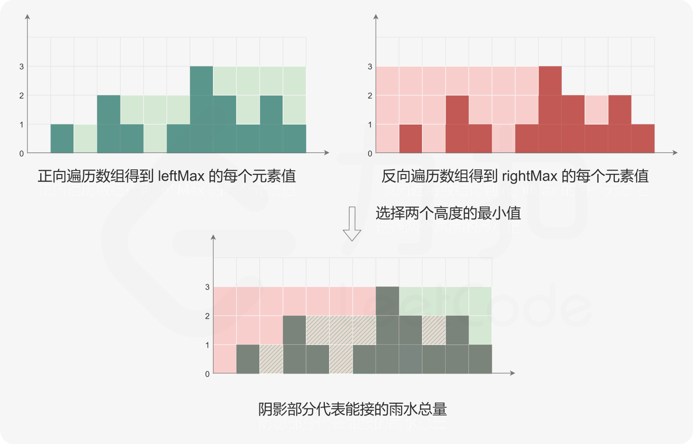

# 02双指针

# 1.零移动

[283. 移动零 - 力扣（LeetCode）](https://leetcode.cn/problems/move-zeroes/description/?envType=study-plan-v2\&envId=top-100-liked "283. 移动零 - 力扣（LeetCode）")

```bash
给定一个数组 nums，编写一个函数将所有 0 移动到数组的末尾，同时保持非零元素的相对顺序。

请注意 ，必须在不复制数组的情况下原地对数组进行操作。

```

用一个指针，记录0元素的位置，每次循环到非零元素，将非零元素放置到记录0元素的位置，并移动记录0元素位置指针

```c++
class Solution {
public:
    // 用一个指针，记录0元素的位置，每次循环到非零元素，
    // 将非零元素放置到记录0元素的位置，并移动记录0元素位置指针
    void moveZeroes(vector<int>& nums) {
        // j 记录每次循环中的非零元素下标
        int j = 0;
        for (int i = 0; i < nums.size(); i++) {
            if (nums[i] != 0) {
                nums[j] = nums[i];
                // 处理最后一个数
                if (i != j) {
                    nums[i] = 0;
                }
                j++;
            }
        }
    }

    void moveZeroes_swap(vector<int>& nums) {
        // j 记录每次循环中的非零元素下标
        int j = 0;
        for (int i = 0; i < nums.size(); i++) {
            if (nums[i] != 0) {
                int tmp = nums[j];
                nums[j] = nums[i];
                nums[i] = tmp;
                j++;
            }
        }
    }
};
```

# 2.盛最多水的容器

[11. 盛最多水的容器 - 力扣（LeetCode）](https://leetcode.cn/problems/container-with-most-water/description/?envType=study-plan-v2\&envId=top-100-liked "11. 盛最多水的容器 - 力扣（LeetCode）")

```bash
给定一个长度为 n 的整数数组 height 。有 n 条垂线，第 i 条线的两个端点是 (i, 0) 和 (i, height[i]) 。

找出其中的两条线，使得它们与 x 轴共同构成的容器可以容纳最多的水。

返回容器可以储存的最大水量。

说明：你不能倾斜容器。
```

1.枚举两个边，left bar x, right bar y, (x - y)\*height\_diff， 超出时间限制

2\. 双指针，left和right两个指针，那么bar的高度小，那个往里面移动

```c++
class Solution {
public:
    // 1.枚举： left bar x, right bar y, (x-y)*height_diff
    // 超出时间限制
    // O(n^2)
    int maxArea1(vector<int>& height) {
        int max_water = 0;
        for (int i = 0; i < height.size() - 1; i++) {
            for (int j = i + 1; j < height.size(); j++) {
                int tmp = std::min(height[i], height[j]) * (j - i);
                max_water = std::max(max_water, tmp);
            }
        }

        return max_water;
    }

    // 2.双指针
    // left和right两个指针，那么bar的高度小，那个往里面移动
    // O(n)
    int maxArea2(vector<int>& height) {
        int left = 0;
        int right = height.size() - 1;
        int max_water = 0;

        while(left < right) {
            int tmp = std::min(height[left], height[right]) * (right - left);
            max_water = tmp > max_water ? tmp : max_water;

            if (height[left] < height[right]) {
                left++;
            } else {
                right--;
            }
        }

        return max_water;
    }
    // 另一种双指针简单的写法
    int maxArea(vector<int>& height) {
        int max_water = 0;
        for (int i = 0, j = height.size() - 1; i < j; ) {
            int min_height = height[i] < height[j] ? height[i ++] : height[j --];
            max_water = std::max(max_water, (j - i + 1) * min_height);
        }

        return max_water;
    }

};
```

# 3.三数之和

[15. 三数之和 - 力扣（LeetCode）](https://leetcode.cn/problems/3sum/description/?envType=study-plan-v2\&envId=top-100-liked "15. 三数之和 - 力扣（LeetCode）")

```bash
给你一个整数数组 nums ，判断是否存在三元组 [nums[i], nums[j], nums[k]] 满足 i != j、i != k 且 j != k ，同时还满足 nums[i] + nums[j] + nums[k] == 0 。请

你返回所有和为 0 且不重复的三元组。

注意：答案中不可以包含重复的三元组。
```

1.  暴力求解，需要三重循环
2.  hash表来记录，a+b到hash表中去查，是否存在-c
3.  左右下标推进；固定3个指针中最左数字的指针k，双指针i，j分设在数据两端；通过双指针交替向中间移动，记录对于每个固定指针k所有满足；`nums[k] + nums[i] + nums[j] == 0` 的 i, j 组合

```c++
// 1.暴力求解，需要三重循环 O(n^3)
// 2.hash表来记录， a+b到hash表中去查，是否存在-c
// 3.左右下标推进
class Solution {
public:
    // 1.暴力求解方法
    vector<vector<int>> threeSum1(vector<int>& nums) {
        std::vector<std::vector<int>> ans;
        for (int i = 0; i < nums.size() - 2; i++) {
            for (int j = i + 1; j < nums.size() - 1; j++) {
                for (int k = j + 1; k < nums.size(); k++) {
                    if (nums[i] + nums[j] + nums[k] == 0) {
                        ans.push_back({nums[i], nums[j], nums[k]});
                    }
                }
            }
        }

        return ans;
    }

    // 3.左右下标推进
    // 固定3个指针中最左数字的指针k，双指针i，j分设在数据两端
    // 通过双指针交替向中间移动，记录对于每个固定指针k所有满足
    // nums[k] + nums[i] + nums[j] == 0 的 i, j 组合
    vector<vector<int>> threeSum(vector<int>& nums) {
        int size = nums.size();
        if (size < 3)
            return {};
        std::vector<std::vector<int>> res;
        // 排序
        std::sort(nums.begin(), nums.end());
        // 固定第一个数，转化为求两数之和
        for(int i = 0; i < size; i++)
        {
            // 如果第一个数为正数，因为是递增的，后面你的数不可能为0了
            if (nums[i] > 0)
                return res;
            // 去重，如果被选过了，跳过
            if (i > 0 && nums[i] == nums[i-1])
                continue;
            // 双指针在nums[i]后面的区间中寻找和为0-nums[i]的另外两个数
            int left = i + 1;
            int right = size - 1;
            while(left < right)
            {
                // 两数之和太大，右指针左移
                if (nums[left] + nums[right] > -nums[i])
                    right--;
                // 两数之和太小，左指针右移
                else if(nums[left] + nums[right] < -nums[i])
                    left++;
                else
                {
                    // 找到一个和为零的三元组，添加到结果中，左右指针内缩，继续寻找
                    res.push_back(std::vector<int>{nums[i], nums[left], nums[right]});
                    left++;
                    right--;

                    // 去重：第二个数和第三个数也不重复选取
                    // 例如：[-4,1,1,1,2,3,3,3], i=0, left=1, right=5
                    while (left < right && nums[left] == nums[left-1])  left++;
                    while (left < right && nums[right] == nums[right+1])    right--;
                }
            }
        }

        return res;
    }
};
```

# 4.接雨水

[42. 接雨水 - 力扣（LeetCode）](https://leetcode.cn/problems/trapping-rain-water/description/?envType=study-plan-v2\&envId=top-100-liked "42. 接雨水 - 力扣（LeetCode）")

```bash
给定 n 个非负整数表示每个宽度为 1 的柱子的高度图，计算按此排列的柱子，下雨之后能接多少雨水。
```

`当前列可以承载的雨滴数= min(当前列左右两侧的最大值)-当前列的大小；`

朴素的做法是对于数组 height 中的每个元素，分别向左和向右扫描并记录左边和右边的最大高度，然后计算每个下标位置能接的雨水量。假设数组 height 的长度为 n，该做法需要对每个下标位置使用 O(n)的时间向两边扫描并得到最大高度，因此总时间复杂度是O(n^2)。

如果已经知道每个位置两边的最大高度，则可以在 O(n)的时间内得到能接的雨水总量。使用动态规划的方法，可以在 O(n)的时间内预处理得到每个位置两边的最大高度。

创建两个长度为 n 的数组 leftMax 和 rightMax。对于 0≤i\<n，leftMax\[i]表示下标 i 及其左边的位置中，height的最大高度，rightMax\[i] 表示下标 i 及其右边的位置中，height的最大高度。



```c++
class Solution {
public:
    // 当前列可以承载的雨滴数= min(当前列左右两侧的最大值)-当前列的大小；
    int trap(vector<int>& height) {
        int n = height.size();
        if (n == 0)
            return 0;
        // 向右扫描，记录第i点左侧的最大高度
        std::vector<int> left_max(n);
        left_max[0] = height[0];
        for(int i = 1; i < n; i++)
        {
            left_max[i] = std::max(left_max[i - 1], height[i]);
        }

        // 向左扫描，记录第i点，右侧的最大高度
        std::vector<int> right_max(n);
        right_max[n - 1] = height[n - 1];
        for (int i = n - 2; i >= 0; i--)
        {
            right_max[i] = std::max(right_max[i + 1], height[i]);
        }
        // 下标i处能接的雨水总量：min(left_max[i], right_max[i]) - height[i]
        int ans = 0;
        for (int i = 0; i < n; i++)
        {
            ans += std::min(left_max[i], right_max[i]) - height[i];
        }

        return ans;
    }
};
```
