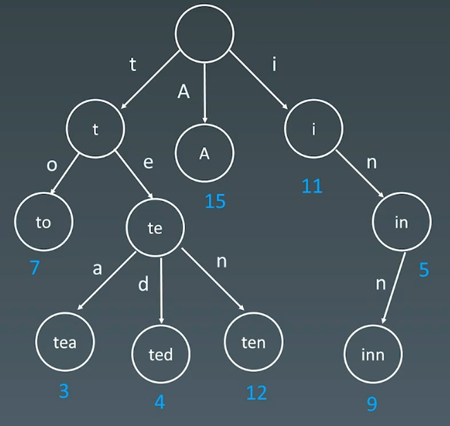
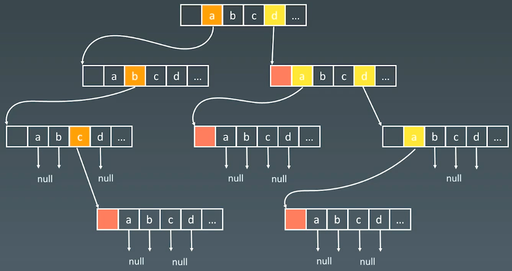

# 09 Graph

# 1.岛屿数量

[200. 岛屿数量 - 力扣（LeetCode）](https://leetcode.cn/problems/number-of-islands/description/?envType=study-plan-v2\&envId=top-100-liked "200. 岛屿数量 - 力扣（LeetCode）")

```json
给你一个由 '1'（陆地）和 '0'（水）组成的的二维网格，请你计算网格中岛屿的数量。

岛屿总是被水包围，并且每座岛屿只能由水平方向和/或竖直方向上相邻的陆地连接形成。

此外，你可以假设该网格的四条边均被水包围。


示例 1：

输入：grid = [
  ["1","1","1","1","0"],
  ["1","1","0","1","0"],
  ["1","1","0","0","0"],
  ["0","0","0","0","0"]
]
输出：1
```

洪水算法（填海造陆）：遍历地图，遇到一个1，将1进行BFS/DFS遍历，将周围的1全部变为0，操作记作一次1，操作次数就是岛屿的数量。

```c++
class Solution {
public:
    // 1.填海造陆：遍历地图，遇到一个1，将1进行BFS/DFS遍历，将周围的1全部变为0，操作记为一次
    // 操作次数就是岛屿数量
    int numIslands(vector<vector<char>>& grid) {
        int island_num = 0;
        m_grid = grid;

        for (int i = 0; i < m_grid.size(); i++) {
            for (int j = 0; j < m_grid[i].size(); j++) {
                if (m_grid[i][j] == '0') {
                    continue;
                }
                island_num += this->sink(i, j);
            }
        }

        return island_num;
    }

private:
    // 方向
    int m_dx[4] = {-1, 1, 0, 0};
    int m_dy[4] = {0, 0, -1, 1};
    // 全局地图
    std::vector<std::vector<char>> m_grid;

    // bfs遍历
    int sink(int i, int j) {
        if (m_grid[i][j] == '0') {
            return 0;
        }

        // 将 i, j 的 1 变为0
        m_grid[i][j] = '0';
        // 开始遍历四个方向，填海造陆
        for (int k = 0; k < 4; k++) {
            int x = i + m_dx[k];
            int y = j + m_dy[k];

            if (x >= 0 && x < m_grid.size() && y >= 0 && y < m_grid[i].size()) {
                // 遇到0跳过
                // 遇到1，开始递归
                if (m_grid[x][y] == '0') {
                    continue;
                }
                this->sink(x, y);
            }
        }
        return 1;
    }
};
```

# 2.腐烂的橘子

[994. 腐烂的橘子 - 力扣（LeetCode）](https://leetcode.cn/problems/rotting-oranges/description/?envType=study-plan-v2\&envId=top-100-liked "994. 腐烂的橘子 - 力扣（LeetCode）")

```json
在给定的 m x n 网格 grid 中，每个单元格可以有以下三个值之一：

值 0 代表空单元格；
值 1 代表新鲜橘子；
值 2 代表腐烂的橘子。
每分钟，腐烂的橘子 周围 4 个方向上相邻 的新鲜橘子都会腐烂。

返回 直到单元格中没有新鲜橘子为止所必须经过的最小分钟数。如果不可能，返回 -1 。


输入：grid = [[2,1,1],[1,1,0],[0,1,1]]
输出：4
示例 2：

输入：grid = [[2,1,1],[0,1,1],[1,0,1]]
输出：-1
解释：左下角的橘子（第 2 行， 第 0 列）永远不会腐烂，因为腐烂只会发生在 4 个正向上。

```

多源广度优先搜索

思路：

1.  刚开始将所有烂橘子位置压入队列,并统计新鲜橘子数量;
2.  bfs从烂橘子位置开始遍历,让所有新鲜橘子摆烂,并且把本次摆烂的橘子压入队列;
3.  由上一层摆烂的橘子继续向其四周扩散,以此层层迭代;
4.  随着摆烂蔓延,新鲜橘子越来越少,最后判断时间;

```c++
class Solution {
public:
    //思路：
    //1.刚开始将所有烂橘子位置压入队列,并统计新鲜橘子数量;
    //2.bfs从烂橘子位置开始遍历,让所有新鲜橘子摆烂,并且把本次摆烂的橘子压入队列;
    //3.由上一层摆烂的橘子继续向其四周扩散,以此层层迭代;
    //4.随着摆烂蔓延,新鲜橘子越来越少,最后判断时间;
    int orangesRotting(vector<vector<int>>& grid) {
        int row = grid.size();
        int col = grid[0].size();

        // 新鲜橘子个数
        int flash_cnt = 0;
        // 感染次数
        int step = 0;
        std::queue<std::pair<int, int>> que;

        // 遍历地图，统计新鲜橘子数量，并将腐烂的橘子加入队列
        for (int i = 0; i < row; i++) {
            for (int j = 0; j < col; j++) {
                if (grid[i][j] == 1) {
                    flash_cnt += 1;
                } else if (grid[i][j] == 2) {
                    que.push(std::make_pair(i, j));
                }
            }
        }

        // 广度遍历 ： 遍历所有腐烂橘子，同时感染四周
        while (flash_cnt > 0 && !que.empty()) {
            step++;
            // 队列中现有的都要感染一次
            int size = que.size();
            for (int s = 0; s < size; s++) {
                // 取出腐烂的橘子
                std::pair<int, int> coord = que.front();
                que.pop();
                // 四个方向
                for (int k = 0; k < 4; k++) {
                    int x = coord.first + m_dx[k];
                    int y = coord.second + m_dy[k];

                    // x，y不越界，并且只感染新鲜橘子
                    if (x >= 0 && x < row && y >= 0 && y < col && grid[x][y] == 1) {
                        grid[x][y] = 2;
                        // 把感染的橘子加入队列
                        que.push(std::make_pair(x, y));
                        // 新鲜橘子 -1
                        flash_cnt--;
                    }
                }
            }
        }

        // 如果BFS感染结束还有新鲜橘子
        if (flash_cnt > 0) {
            return -1;
        } else {
            return step;
        }

    }
private:
    // 方向
    int m_dx[4] = {-1, 1, 0, 0};
    int m_dy[4] = {0, 0, -1, 1};

};
```

# 3.课程表

[207. 课程表 - 力扣（LeetCode）](https://leetcode.cn/problems/course-schedule/description/?envType=study-plan-v2\&envId=top-100-liked "207. 课程表 - 力扣（LeetCode）")

```json
你这个学期必须选修 numCourses 门课程，记为 0 到 numCourses - 1 。

在选修某些课程之前需要一些先修课程。 先修课程按数组 prerequisites 给出，其中 prerequisites[i] = [ai, bi] ，表示如果要学习课程 ai 则 必须 先学习课程  bi 。

例如，先修课程对 [0, 1] 表示：想要学习课程 0 ，你需要先完成课程 1 。
请你判断是否可能完成所有课程的学习？如果可以，返回 true ；否则，返回 false 。

 

示例 1：

输入：numCourses = 2, prerequisites = [[1,0]]
输出：true
解释：总共有 2 门课程。学习课程 1 之前，你需要完成课程 0 。这是可能的。
```

-   [拓扑排序](https://wdndev.github.io/note/cs/ds/graph/dfs%E6%8B%93%E6%89%91%E6%8E%92%E5%BA%8F/dfs%E6%8B%93%E6%89%91%E6%8E%92%E5%BA%8F.html "拓扑排序")
-   [拓扑排序解法](https://leetcode.cn/problems/course-schedule/solutions/18806/course-schedule-tuo-bu-pai-xu-bfsdfsliang-chong-fa/?envType=study-plan-v2\&envId=top-100-liked "拓扑排序解法")

解题思路：

-   本题可约化为： 课程安排图是否是 **有向无环图(DAG)**。即课程间规定了前置条件，但不能构成任何环路，否则课程前置条件将不成立。
-   思路是通过 **拓扑排序** 判断此课程安排图是否是 **有向无环图(DAG)** 。&#x20;
-   拓扑排序原理： 对 DAG 的顶点进行排序，使得对每一条有向边 $(u, v)$，均有 $u$（在排序记录中）比 $v$ 先出现。亦可理解为对某点 $v$ 而言，只有当 $v$ 的所有源点均出现了，$v$ 才能出现。
-   通过课程前置条件列表 prerequisites 可以得到课程安排图的 **邻接表** adjacency，以降低算法时间复杂度，以下两种方法都会用到邻接表。

## （1）广度优先遍历（拓扑排序，入度表）

1.  统计课程安排图中每个节点的入度，生成 **入度表** `indegrees`。
2.  借助一个队列 `queue`，将所有入度为 0 的节点入队。
3.  当 `queue `非空时，依次将队首节点出队，在课程安排图中删除此节点 `pre`：
    1.  并不是真正从邻接表中删除此节点 `pre`，而是将此节点对应所有邻接节点 cur 的入度 `-1`，即` indegrees[cur] -= 1`。
    2.  当入度 `−1`后邻接节点 cur 的入度为 `0`，说明 cur 所有的前驱节点已经被 “删除”，此时将 cur 入队。
4.  在每次 pre 出队时，执行 `numCourses--`；
    1.  若整个课程安排图是有向无环图（即可以安排），则所有节点一定都入队并出队过，即完成拓扑排序。换个角度说，若课程安排图中存在环，一定有节点的入度始终不为 0。
    2.  因此，拓扑排序出队次数等于课程个数，返回 `numCourses == 0 `判断课程是否可以成功安排。

```c++
class Solution {
public:
    bool canFinish(int numCourses, vector<vector<int>>& prerequisites) {
        // 入度表
        std::vector<int> indegrees(numCourses, 0);
        // 邻接矩阵
        std::vector<std::vector<int>> adjacency(numCourses);
        // 队列
        std::queue<int> que;
        
        // 构造邻接矩阵
        for (auto& vec : prerequisites) {
            // 入度++
            indegrees[vec[0]]++;
            adjacency[vec[1]].push_back(vec[0]);
        }

        // 将入度为0的结点加入队列，表示没有任何前置课程
        for (int i = 0; i < numCourses; i++) {
            if (indegrees[i] == 0) {
                que.push(i);
            }
        }

        // BFS遍历，
        while (!que.empty()) {
            int pre = que.front();
            que.pop();
            numCourses--;

            // 遍历邻接矩阵，将入度为0的结点加入队列
            for (auto curr : adjacency[pre]) {
                indegrees[curr]--;
                if (indegrees[curr] == 0) {
                    que.push(curr);
                }
            }
        }

        return numCourses == 0;
    }
};
```

## （2）深度优先遍历（判环）

1.  借助一个标志列表 visited，用于判断每个节点 i （课程）的状态：
    1.  未被 DFS 访问：`i == 0`；
    2.  已被其他节点启动的 DFS 访问：`i == 2`；
    3.  已被当前节点启动的 DFS 访问：`i == 1`。
2.  对 numCourses 个节点依次执行 DFS，判断每个节点起步 DFS 是否存在环，若存在环直接返回 False。DFS 流程；
    1.  终止条件：
        1.  当 `flag[i] == 2`，说明当前访问节点已被其他节点启动的 DFS 访问，无需再重复搜索，直接返回 True。
        2.  当 `flag[i] == 1`，说明在本轮 DFS 搜索中节点 i 被第 2 次访问，即 课程安排图有环 ，直接返回 False。
    2.  将当前访问节点 i 对应` flag[i]` 置 1，即标记其被本轮 DFS 访问过；
    3.  递归访问当前节点 i 的所有邻接节点 j，当发现环直接返回 False；
    4.  当前节点所有邻接节点已被遍历，并没有发现环，则将当前节点 visited置为 2 并返回 True。
3.  若整个图 DFS 结束并未发现环，返回 True。

```c++
class Solution {
public:
    // 2.DPS判环
    bool canFinish(int numCourses, vector<vector<int>>& prerequisites) {
        // 邻接表
        std::vector<std::vector<int>> adjacency(numCourses);
        
        // 构造邻接表
        for (auto& vec : prerequisites) {
            adjacency[vec[1]].push_back(vec[0]);
        }

        // 访问状态表
        // 0 : 未被访问过
        // 1 : 正在被当前结点访问
        // 2 ：已经访问过
        std::vector<int> visited(numCourses, 0);

        // dfs遍历
        for (int i = 0; i < numCourses; i++) {
            if (!this->dfs(adjacency, visited, i)) {
                return false;
            }
        }

        return true;
    }
    
    bool dfs(std::vector<std::vector<int>>& adjacency, std::vector<int>& visited, int i) {
        if (visited[i] == 1) {
            return false;
        }

        if (visited[i] == 2) {
            return true;
        }

        visited[i] = 1;
        // 遍历邻接矩阵
        for (auto curr : adjacency[i]) {
            if (!this->dfs(adjacency, visited, curr)) {
                return false;
            }
        }
        visited[i] = 2;
        return true;
    }
};
```

# 4.实现Trie（前缀树）

[208. 实现 Trie (前缀树) - 力扣（LeetCode）](https://leetcode.cn/problems/implement-trie-prefix-tree/description/?envType=study-plan-v2\&envId=top-100-liked "208. 实现 Trie (前缀树) - 力扣（LeetCode）")

```json
Trie（发音类似 "try"）或者说 前缀树 是一种树形数据结构，用于高效地存储和检索字符串数据集中的键。这一数据结构有相当多的应用情景，例如自动补完和拼写检查。

请你实现 Trie 类：

- Trie() 初始化前缀树对象。
- void insert(String word) 向前缀树中插入字符串 word 。
- boolean search(String word) 如果字符串 word 在前缀树中，返回 true（即，在检索之前已经插入）；否则，返回 false 。
- boolean startsWith(String prefix) 如果之前已经插入的字符串 word 的前缀之一为 prefix ，返回 true ；否则，返回 false 。
```

字典树，即 Trie 树，又称单词查找树或键树，是一种树形结构。典型应用是用于统计和排序大量的字符串(但不仅限于字符串)，所以经常被搜索引擎系统用于文本词频统计。

它的优点是：**最大限度地减少无谓的字符串比较，查询效率比哈希表高**。

结点可以存储额外信息：

如下图中，数字表示单词出现的频次



结点的内部实现



核心思想

-   Trie树的核心思想：空间换时间
-   利用字符串的公共前缀来降低查询时间的开销，以达到提高效率的目的

```c++
class Trie {
public:
    Trie() : m_children(26), m_is_end(false) {

    }
    
    // 插入字符串，从根开始，判断下面两种情况：
    // 1.子节点存在。沿着指针移动到子节点，继续处理下一个字符
    // 2.子节点不存在。创建一个新的子节点，记录在children数组的对应位置上，
    //   然后沿着指针移动到子节点，继续搜索下一个字符
    void insert(string word) {
        Trie* node = this;
        for (auto ch : word) {
            ch -= 'a';
            if (node->m_children[ch] == nullptr) {
                node->m_children[ch] = new Trie();
            }
            node = node->m_children[ch];
        }
        node->m_is_end = true;
    }
    
    // 搜索字符串是否存在
    // 若搜索到了前缀的末尾，就说明字典树中存在该前缀。
    // 此外，若前缀末尾对应结点 is_end 为真，则说明字典树中存在该字符串
    bool search(string word) {
        Trie* node = this->search_prefix(word);
        return node != nullptr && node->m_is_end;
    }
    
    // 搜索前缀
    // 如果之前已经插入的字符串 word 的前缀之一为 prefix ，返回 true ；
    // 否则，返回 false 。
    bool startsWith(string prefix) {
        Trie* node = this->search_prefix(prefix);
        return node != nullptr;
    }

private:
    // 指向子节点的指针数组 children，数组长度为26，即小写英文字母的数量
    std::vector<Trie*> m_children;
    // 表示该节点是否为字符串的结尾
    bool m_is_end;

    // 查找前缀，对于当前字符对应的子节点，有两种情况
    // 1.子节点存在。沿着指针移动到子节点，继续搜索下一个字符
    // 2.子节点不存在。说明字典树中不包含该前缀，返回空指针
    Trie* search_prefix(std::string& prefix) {
        Trie* node = this;
        for (auto ch : prefix) {
            ch -= 'a';
            if (node->m_children[ch] == nullptr) {
                return nullptr;
            }
            node = node->m_children[ch];
        }
        return node;
    }
};
```
