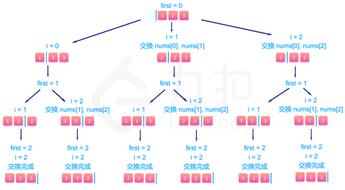

# 10 backtracking&#x20;

# 1.全排列

[46. 全排列 - 力扣（LeetCode）](https://leetcode.cn/problems/permutations/description/?envType=study-plan-v2\&envId=top-100-liked "46. 全排列 - 力扣（LeetCode）")

```json
给定一个不含重复数字的数组 nums ，返回其 所有可能的全排列 。你可以 按任意顺序 返回答案。

示例 1：

输入：nums = [1,2,3]
输出：[[1,2,3],[1,3,2],[2,1,3],[2,3,1],[3,1,2],[3,2,1]]
```

定义递归函数 backtrack(first,output),表示从左往右填到第 first 个位置，当前排列为 output。 那么整个递归函数分为两个情况：

1.  如果 first=n，说明我们已经填完了 n 个位置（注意下标从 000 开始），找到了一个可行的解，我们将 output 放入答案数组中，递归结束。
2.  如果 first\<n，要考虑这第 first 个位置我们要填哪个数。根据题目要求不能填已经填过的数，因此很容易想到的一个处理手段是定义一个标记数组 vis来标记已经填过的数，那么在填第 first个数的时候我们遍历题目给定的 n 个数，如果这个数没有被标记过，就尝试填入，并将其标记，继续尝试填下一个位置，即调用函数 backtrack(first+1,output)。回溯的时候要撤销这一个位置填的数以及标记，并继续尝试其他没被标记过的数。

-   已经填到第 first个位置，那么 nums 数组中 \[0,first−1]是已填过的数的集合，\[first,n−1]是待填的数的集合。我们肯定是尝试用 \[first,n−1] 里的数去填第 first个数，假设待填的数的下标为 i，那么填完以后我们将第 i 个数和第 first个数交换，即能使得在填第 first+1个数的时候 nums数组的 \[0,first]部分为已填过的数，\[first+1,n−1] 为待填的数，回溯的时候交换回来即能完成撤销操作。



```c++
class Solution {
public:
    vector<vector<int>> permute(vector<int>& nums) {
        std::vector<std::vector<int>> ans;
        this->dfs(0, nums, ans);
        return ans;
    }

private:
    void dfs(int curr, std::vector<int>& nums, std::vector<std::vector<int>>& ans) {
        // 终止条件
        if (curr == nums.size()) {
            ans.push_back(nums);
            return;
        }

        // 处理当前层
        for (int i = curr; i < nums.size(); i++) {
            // 动态维护数组
            swap(nums[i], nums[curr]);
            // 继续递归下一层
            this->dfs(curr + 1, nums, ans);
            // 撤销操作
            swap(nums[i], nums[curr]);
        }
    }
};
```

# 2.子集

[78. 子集 - 力扣（LeetCode）](https://leetcode.cn/problems/subsets/description/?envType=study-plan-v2\&envId=top-100-liked "78. 子集 - 力扣（LeetCode）")

```json
给你一个整数数组 nums ，数组中的元素 互不相同 。返回该数组所有可能的子集（幂集）。

解集 不能 包含重复的子集。你可以按 任意顺序 返回解集。

示例 1：

输入：nums = [1,2,3]
输出：[[],[1],[2],[1,2],[3],[1,3],[2,3],[1,2,3]]

```

类似爬楼梯，可选可不选

```c++
class Solution {
public:
    vector<vector<int>> subsets(vector<int>& nums) {
        std::vector<std::vector<int>> ans;
        std::vector<int> tmp_vec;
        if (nums.size() == 0) {
            return ans;
        }

        this->dfs(0, nums, tmp_vec, ans);

        return ans;
    }

    void dfs(int curr, std::vector<int>& nums, std::vector<int> tmp_vec, 
        std::vector<std::vector<int>>& ans) {
        if (curr == nums.size()) {
            ans.push_back(tmp_vec);
            return;
        }

        // 不选则当前结点值
        this->dfs(curr + 1, nums, tmp_vec, nums);

        // 选择当前结点值
        tmp_vec.push_back(nums[curr]);
        this->dfs(curr + 1, nums, tmp_vec, nums);
        tmp_vec.pop_back();
    }
};
```

# 3.电话号码的字母组合

[17. 电话号码的字母组合 - 力扣（LeetCode）](https://leetcode.cn/problems/letter-combinations-of-a-phone-number/description/?envType=study-plan-v2\&envId=top-100-liked "17. 电话号码的字母组合 - 力扣（LeetCode）")

```json
给定一个仅包含数字 2-9 的字符串，返回所有它能表示的字母组合。答案可以按 任意顺序 返回。

给出数字到字母的映射如下（与电话按键相同）。注意 1 不对应任何字母。

示例 1：

输入：digits = "23"
输出：["ad","ae","af","bd","be","bf","cd","ce","cf"]

```

回溯过程中维护一个字符串，表示已有的字母排列（如果未遍历完电话号码的所有数字，则已有的字母排列是不完整的）。

该字符串初始为空。每次取电话号码的一位数字，从哈希表中获得该数字对应的所有可能的字母，并将其中的一个字母插入到已有的字母排列后面，然后继续处理电话号码的后一位数字，直到处理完电话号码中的所有数字，即得到一个完整的字母排列。然后进行回退操作，遍历其余的字母排列。

```c++
class Solution {
public:
    vector<string> letterCombinations(string digits) {
        if (digits.size() == 0) {
            return {};
        }
        std::vector<std::string> ans;

        this->search(0, digits, "", ans);

        return ans;
    }

private:
    std::unordered_map<char, std::string> m_map {
        {'2', "abc"},
        {'3', "def"},
        {'4', "ghi"},
        {'5', "jkl"},
        {'6', "mno"},
        {'7', "pqrs"},
        {'8', "tuv"},
        {'9', "wxyz"}   
    };

    void search(int idx, std::string& digits, std::string s, 
        std::vector<std::string>& ans) {
        // 终止条件
        if (idx == digits.size()) {
            ans.push_back(s);
            return;
        }

        // 处理
        std::string letters = m_map.at(digits[idx]);
        for (int i = 0; i < letters.size(); i++) {
            // 递归
            this->search(idx + 1, digits, s + letters[i], ans);
        }
    }
};
```

# 4.组合总和

[39. 组合总和 - 力扣（LeetCode）](https://leetcode.cn/problems/combination-sum/description/?envType=study-plan-v2\&envId=top-100-liked "39. 组合总和 - 力扣（LeetCode）")

```json
给你一个 无重复元素 的整数数组 candidates 和一个目标整数 target ，找出 candidates 中可以使数字和为目标数 target 的 所有 不同组合 ，并以列表形式返回。你可以按 任意顺序 返回这些组合。

candidates 中的 同一个 数字可以 无限制重复被选取 。如果至少一个数字的被选数量不同，则两种组合是不同的。 

对于给定的输入，保证和为 target 的不同组合数少于 150 个。

 

示例 1：

输入：candidates = [2,3,6,7], target = 7
输出：[[2,2,3],[7]]
解释：
2 和 3 可以形成一组候选，2 + 2 + 3 = 7 。注意 2 可以使用多次。
7 也是一个候选， 7 = 7 。
仅有这两种组合。
```


```c++
class Solution {
public:
    vector<vector<int>> combinationSum(vector<int>& candidates, int target) {
        std::vector<std::vector<int>> ans;
        std::vector<int> tmp_vec;
        if (candidates.size() == 0) {
            return ans;
        }

        // 排序，方便后续剪枝
        std::sort(candidates.begin(), candidates.end());

        this->dfs(0, candidates, target, tmp_vec, ans);
        return ans;
    }

    void dfs(int curr, std::vector<int>& candidates, int target, 
        std::vector<int> tmp_vec, std::vector<std::vector<int>>& ans) {
        // 终止条件，等于0，因为小于0的被剪枝完了
        if (target == 0) {
            ans.push_back(tmp_vec);
            return;
        } else if (target < 0) {
            return;
        }

        for (int i = curr; i < candidates.size(); i++) {
            // 因为数组提前排序了，这儿可以直接剪枝
            if (target - candidates[i] < 0) {
                break;
            }

            tmp_vec.push_back(candidates[i]);
            this->dfs(i, candidates, target - candidates[i], tmp_vec, ans);
            tmp_vec.pop_back();
        }
    }
};
```

# 5.括号生成

[22. 括号生成 - 力扣（LeetCode）](https://leetcode.cn/problems/generate-parentheses/description/?envType=study-plan-v2\&envId=top-100-liked "22. 括号生成 - 力扣（LeetCode）")

```json
数字 n 代表生成括号的对数，请你设计一个函数，用于能够生成所有可能的并且 有效的 括号组合。

 

示例 1：

输入：n = 3
输出：["((()))","(()())","(())()","()(())","()()()"]
示例 2：

输入：n = 1
输出：["()"]
```

递归

-   左括号: **随时加，只要不超标**
-   右括号 : 必须之前有左括号，且`左括号个数 > 右括号个数`

```c++
class Solution {
public:
    // 递归
    // 左括号: 随时加，只要不超标
    // 右括号 : 必须之前有左括号，且左括号个数 > 右括号个数
    vector<string> generateParenthesis(int n) {
        std::vector<std::string> ans;
        std::string tmp_str;

        this->dfs(0, 0, n, "", ans);

        return ans;
    }

    void dfs(int left, int right, int n, std::string tmp_str, std::vector<std::string>& ans) {
        // 终止条件
        if (left == n && right == n) {
            ans.push_back(tmp_str);
            // std::cout << "left: " << left << " " << tmp_str << std::endl;
            return;
        }

        // 递归处理
        if (left < n) {
            this->dfs(left + 1, right, n, tmp_str + "(", ans);
        }

        if (left > right) {
            this->dfs(left, right + 1, n, tmp_str + ")", ans);
        }
    }
};
```

# 6.单词搜索

[79. 单词搜索 - 力扣（LeetCode）](https://leetcode.cn/problems/word-search/description/?envType=study-plan-v2\&envId=top-100-liked "79. 单词搜索 - 力扣（LeetCode）")

```python
给定一个 m x n 二维字符网格 board 和一个字符串单词 word 。如果 word 存在于网格中，返回 true ；否则，返回 false 。

单词必须按照字母顺序，通过相邻的单元格内的字母构成，其中“相邻”单元格是那些水平相邻或垂直相邻的单元格。同一个单元格内的字母不允许被重复使用。
```

-   **递归参数**： 当前元素在矩阵 board 中的行列索引 i 和 j ，当前目标字符在 word 中的索引 k 。
-   **终止条件**：
    1.  返回 false ： (1) 行或列索引越界 或 (2) 当前矩阵元素与目标字符不同 或 (3) 当前矩阵元素已访问过 （ (3) 可合并至 (2) ） 。
    2.  返回 true ： k = len(word) - 1 ，即字符串 word 已全部匹配。
-   **递推工作**：
    1.  标记当前矩阵元素： 将 board\[i]\[j] 修改为 空字符 '' ，代表此元素已访问过，防止之后搜索时重复访问。
    2.  搜索下一单元格： 朝当前元素的 上、下、左、右 四个方向开启下层递归，使用 或 连接 （代表只需找到一条可行路径就直接返回，不再做后续 DFS ），并记录结果至 res 。
        还原当前矩阵元素： 将 board\[i]\[j] 元素还原至初始值，即 word\[k] 。
-   **返回值**： 返回布尔量 res ，代表是否搜索到目标字符串。

```c++
class Solution {
public:
    bool exist(vector<vector<char>>& board, string word) {
        m_board = board;
        m_word = word;

        for (int i = 0; i < m_board.size(); i++) {
            for (int j = 0; j < m_board[i].size(); j++) {
                if (this->dfs(i, j, 0)) {
                    return true;
                }
            }
        }

        return false;
    }

private:
    // 方向
    int m_dx[4] = {-1, 1, 0, 0};
    int m_dy[4] = {0, 0, -1, 1};

    std::vector<std::vector<char>> m_board;
    std::string m_word;

    bool dfs(int i, int j, int word_idx) {
        if (i < 0 || i >= m_board.size() || j < 0 || j >= m_board[i].size() || m_board[i][j] != m_word[word_idx]) {
                return false;
        }

        if (word_idx == m_word.size() - 1) {
            return true;
        }

        bool res = false;
        m_board[i][j] = '\0';
        for (int k = 0; k < 4; k++) {
            int x = i + m_dx[k];
            int y = j + m_dy[k];

            res = res || this->dfs(x, y, word_idx + 1);
        }

        m_board[i][j] = m_word[word_idx];

        return res;
    }

};
```

# 7.分割回文串

[131. 分割回文串 - 力扣（LeetCode）](https://leetcode.cn/problems/palindrome-partitioning/description/?envType=study-plan-v2\&envId=top-100-liked "131. 分割回文串 - 力扣（LeetCode）")

```python
给你一个字符串 s，请你将 s 分割成一些子串，使每个子串都是 回文串 。返回 s 所有可能的分割方案。

回文串 是正着读和反着读都一样的字符串。


示例 1：

输入：s = "aab"
输出：[["a","a","b"],["aa","b"]]
```

可以从 i 开始，从小到大依次枚举 j。对于当前枚举的 j 值，使用双指针的方法判断 `s[i..j] `是否为回文串：如果 `s[i..j] `是回文串，那么就将其加入答案数组 `ans` 中，并以 `j+1` 作为新的 `i` 进行下一层搜索，并在未来的回溯时将 `s[i..j]` 从 `ans`中移除。

```c++
class Solution {
public:
    vector<vector<string>> partition(string s) {
        std::vector<std::vector<std::string>> ans;
        std::vector<std::string> tmp_str;

        this->dfs(0, s, tmp_str, ans);

        return ans;
    }

private:
    void dfs(int i, const std::string& s, std::vector<std::string> tmp_str, 
        std::vector<std::vector<std::string>>& ans) {
        if (i == s.size()) {
            ans.push_back(tmp_str);
            return;
        }

        for (int j = i; j < s.size(); j++) {
            if (this->is_palindrome(s, i, j)) {
                tmp_str.push_back(s.substr(i, j - i + 1));
                this->dfs(j + 1, s, tmp_str, ans);
                tmp_str.pop_back();
            }
        }
    }

    // 判断是否为回文字符串
    bool is_palindrome(const std::string& s, int start, int end) {
        while (start <= end) {
            if (s[start] != s[end]) {
                return false;
            }
            start++;
            end--;
        } 
        return true;
    }
};
```

# 8.N皇后

[51. N 皇后 - 力扣（LeetCode）](https://leetcode.cn/problems/n-queens/description/ "51. N 皇后 - 力扣（LeetCode）")

```bash
按照国际象棋的规则，皇后可以攻击与之处在同一行或同一列或同一斜线上的棋子。

n 皇后问题 研究的是如何将 n 个皇后放置在 n×n 的棋盘上，并且使皇后彼此之间不能相互攻击。

给你一个整数 n ，返回所有不同的 n 皇后问题 的解决方案。

每一种解法包含一个不同的 n 皇后问题 的棋子放置方案，该方案中 'Q' 和 '.' 分别代表了皇后和空位。
```

```python
class Solution:
    def solveNQueens(self, n: int) -> List[List[str]]:
        if n < 1:
            return []
        
        self.result = []

        # 之前的皇后所占的位置 (列, pie, na)
        self.cols = set()
        self.pie = set()
        self.na = set()

        self.dfs(n, 0, [])

        return self._generate_result(n)


    def dfs(self, n, row, curr_state):
        # 终止条件
        if row >= n:
            self.result.append(curr_state)
            return

        # 当前层处理
        for col in range(n):
            if col in self.cols or row + col in self.pie or row - col in self.na:
                # 不能放
                continue
            
            # 更新标志位
            self.cols.add(col)
            self.pie.add(row + col)
            self.na.add(row - col)

            self.dfs(n, row + 1, curr_state + [col])

            self.cols.remove(col)
            self.pie.remove(row + col)
            self.na.remove(row - col)

    def _generate_result(self, n):
        board = []
        for res in self.result:
            for i in res:
                board.append("." * i + "Q" + "." * (n - i - 1))
        
        return [board[i : i + n] for i in range(0, len(board), n)]
```

```c++
class Solution {
public:
    vector<vector<string>> solveNQueens(int n) {
        std::vector<std::string> curr_state(n, std::string(n, '.'));
        this->dfs(curr_state, 0, n);

        return m_ans;
    }

private:
    std::vector<std::vector<std::string>> m_ans;

    void dfs(std::vector<std::string>& curr_state, int row, int n) {
        // 终止条件
        if (row == n) {
            m_ans.push_back(curr_state);
            return;
        }

        // 循环每列，
        for (int col = 0; col < n; col++) {
            if (this->is_valid(curr_state, row, col)) {
                // doing
                curr_state[row][col] = 'Q';
                // 下一行
                this->dfs(curr_state, row + 1, n);
                // reverse
                curr_state[row][col] = '.';
            }
        }
    }

    bool is_valid(const std::vector<std::string>& curr_state, int row, int col) {
        int n = curr_state.size();

        // 上
        for (int i = 0; i < n; i++) {
            if (curr_state[i][col] == 'Q') {
                return false;
            }
        }

        // 左上
        for (int i = row, j = col; i >= 0 && j >= 0; i--, j--) {
            if (curr_state[i][j] == 'Q') {
                return false;
            }
        }

        // 右上
        for (int i = row, j = col; i >= 0 && j < n; i--, j++) {
            if (curr_state[i][j] == 'Q') {
                return false;
            }
        }

        // 其他方向都是未放过皇后的，不可能为false
        return true;
    }

};
```

写的很好的代码

```python
class Solution:
    # 写的很好的python代码
    def solveNQueens(self, n: int) -> List[List[str]]:
        def dfs(queens, xy_dif, xy_sum):
            p = len(queens)
            if p == n:
                result.append(queens)
                return None
            for q in range(n):
                if q not in queens and p-q not in xy_dif and p+q not in xy_sum:
                    dfs(queens + [q], xy_dif+[p-q], xy_sum+[p+q])
        result = []
        dfs([], [], [])
        return [["."*i + "Q" + "."*(n-i-1) for i in sol] for sol in result]
```
