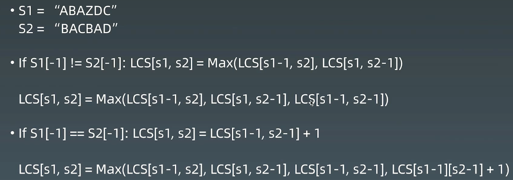

# 16 多维动态规划

# 1.不同路径

[62. 不同路径 - 力扣（LeetCode）](https://leetcode.cn/problems/unique-paths/description/?envType=study-plan-v2\&envId=top-100-liked "62. 不同路径 - 力扣（LeetCode）")

```.properties
一个机器人位于一个 m x n 网格的左上角 （起始点在下图中标记为 “Start” ）。

机器人每次只能向下或者向右移动一步。机器人试图达到网格的右下角（在下图中标记为 “Finish” ）。

问总共有多少条不同的路径？
```

递推公式：$f(x, y) = f(x - 1, y) + f(x, y - 1)$

```c++
class Solution {
public:
    // 1.递归
    int uniquePaths1(int m, int n) {
        return this->dfs(m, n);
    }
    int dfs(int x, int y) {
        if (x <= 0 || y <= 0) {
            return 0;
        }
        if (x == 1 && y == 1) {
            return 1;
        }
        return this->dfs(x - 1, y) + this->dfs(x, y - 1);
    }

    // 2.递归 + 记忆化搜索
    int uniquePaths2(int m, int n) {
        std::vector<std::vector<int>> memo(m + 1, std::vector<int>(n + 1, -1));

        return this->dfs_memo(m, n, memo);
    }
    int dfs_memo(int x, int y, std::vector<std::vector<int>>& memo) {
        if (x <= 0 || y <= 0) {
            return 0;
        }
        if (x == 1 && y == 1) {
            return 1;
        }
        
        if (memo[x][y] == -1) {
            memo[x][y] = this->dfs_memo(x - 1, y, memo) + this->dfs_memo(x, y - 1, memo);
        }

        return memo[x][y];
    }

    // 3.动态规划
    int uniquePaths(int m, int n) {

        std::vector<std::vector<long long>> dp(m, std::vector<long long>(n, 0));

        dp[m - 1][n - 1] = 1;

        // 处理最后一列
        for (int i = m - 2; i >= 0; i--) {
            dp[i][n - 1] = 1;
        }

        // 处理最后一行
        for (int j = n - 2; j >= 0; j--) {
            if (dp[m - 1][j + 1] == 0) {
                dp[m - 1][j] = 0;
            } else {
                dp[m - 1][j] = 1;
            }
        }

        for (int i = m - 2; i >= 0; i--) {
            for (int j = n - 2; j >= 0; j--) {
                dp[i][j] = dp[i + 1][j] + dp[i][j + 1];
            }
        }

        return dp[0][0];
    }
    
    int uniquePaths(int m, int n) {
        std::vector<std::vector<int>> dp(m+1,std::vector<int>(n+1, 0));
        dp[0][1] = 1;
        for (int i = 1; i <= m; i++) {
            for (int j = 1; j <= n; j++) {
                dp[i][j] = dp[i - 1][j] + dp[i][j - 1];
            }
        }
        return dp[m][n];
    }
};
```

# 2.最小路径和

[64. 最小路径和 - 力扣（LeetCode）](https://leetcode.cn/problems/minimum-path-sum/description/?envType=study-plan-v2\&envId=top-100-liked "64. 最小路径和 - 力扣（LeetCode）")

```.properties
给定一个包含非负整数的 m x n 网格 grid ，请找出一条从左上角到右下角的路径，使得路径上的数字总和为最小。

说明：每次只能向下或者向右移动一步。

输入：grid = [[1,3,1],[1,5,1],[4,2,1]]
输出：7
解释：因为路径 1→3→1→1→1 的总和最小。
示例 2：

输入：grid = [[1,2,3],[4,5,6]]
输出：12

```

创建二维数组dp，与原始网格大小一样，dp\[i]\[j]表示从左上角出发到(i,j)的最小位置和

递推公式：$dp[i][j]=min(dp[i−1][j],dp[i][j−1])+grid[i][j]$

```c++
class Solution {
public:
    int minPathSum(vector<vector<int>>& grid) {
        int m = grid.size();
        int n = grid[0].size();
        std::vector<std::vector<int>> dp(m+1,std::vector<int>(n+1, INT_MAX));
        dp[0][1] = 0;
        for (int i = 1; i <= m; i++) {
            for (int j = 1; j <= n; j++) {
                // 注意，加grid[i - 1][j - 1]这个，矩阵扩了一行和一列
                dp[i][j] = std::min(dp[i - 1][j], dp[i][j - 1]) + grid[i - 1][j - 1];
            }
        }
        return dp[m][n];
    }
};
```

# 3.最长回文子串

[5. 最长回文子串 - 力扣（LeetCode）](https://leetcode.cn/problems/longest-palindromic-substring/description/?envType=study-plan-v2\&envId=top-100-liked "5. 最长回文子串 - 力扣（LeetCode）")

```.properties
给你一个字符串 s，找到 s 中最长的回文子串。

如果字符串的反序与原始字符串相同，则该字符串称为回文字符串。

 

示例 1：

输入：s = "babad"
输出："bab"
解释："aba" 同样是符合题意的答案。
示例 2：

输入：s = "cbbd"
输出："bb"
```

#### 暴力求解

```c++
// 1.暴力求解，列举所有的子串，判断是否为回文串
class Solution {
public:
    string longestPalindrome(string s) {
        if (s.size() <= 1) {
            return s;
        }
        std::string ans;
        int max_len = 0;
        
        for (int i = 0; i < s.size() - 1; i++) {
            for (int j = i + 1; j < s.size(); j++) {
                std::string tmp_str = s.substr(i, j - i + 1);
                if (this->check_palindrome(tmp_str) && tmp_str.size() > max_len) {
                    ans = tmp_str;
                    max_len = tmp_str.size();
                }
            }
        }

        return ans;
    }

    // 检查字符串子串是不是回文串
    bool check_palindrome(std::string& s) {
        for (int i = 0, j = s.size() - 1; i < j; i++, j--) {
            if (s[i] != s[j]) {
                return false;
            }
        }

        return true;
    }
};
```

#### 暴力 + 动态规划

去掉一些暴力解法中重复的判断。可以基于下边的发现，进行改进。

状态定义：`P(i, j) = true,` `s[i,j]`是回文串；`P(i, j) = false`, `s[i,j]`不是是回文串；

接下来$P(i,j)=(P(i+1,j−1) ~ \&\& ~ S[i]==S[j])$

所以如果想知道$P（i,j）$的情况，不需要调用判断回文串的函数了，只需要知道$P（i + 1，j - 1）$的情况就可以了，这样时间复杂度就少了 O(n)。因此可以用动态规划的方法，空间换时间，把已经求出的$  P（i，j） $存储起来。

```c++
// 2.暴力 + 动态规划
class Solution {
public:
    string longestPalindrome(string s) {
        int str_len = s.size();
        if (str_len < 2) {
            return s;
        }

        std::vector<std::vector<bool>> dp(str_len, std::vector<bool>(str_len));
        // 最长子串的开始位置和最大长度
        int max_len = 0;
        int begin = 0;

        // 遍历所有长度
        for (int len = 1; len <= str_len; len++) {
            // 枚举左边界
            for (int start = 0; start < str_len; start++) {
                // 根据左边界和长度，确定结束位置
                int end = start + len - 1;
                // 下标越界
                if (end >= str_len) {
                    break;
                }
                // dp[i][j] = dp[i + 1][j - 1] && s[i] == s[j]
                dp[start][end] = s[start] == s[end] && (len == 1 || len == 2 || dp[start + 1][end - 1]);

                if (dp[start][end] && len > max_len)  {
                    max_len = len;
                    begin = start;
                }
            }
        }

        return s.substr(begin, max_len);
    }
};
```

#### 中心扩散

回文串一定是对称的，所以可以每次循环选择一个中心，进行左右扩展，判断左右字符是否相等即可。

由于存在奇数的字符串和偶数的字符串，所以需要从一个字符开始扩展，或者从两个字符之间开始扩展，所以总共有 `n+n-1` 个中心。&#x20;

```c++
class Solution {
public:
    string longestPalindrome(string s) {
        int len = s.size();
        if (len < 2) {
            return s;
        }

        for (int i = 0; i < len - 1; i++) {
            // 奇数长度
            this->extend_palindrome(s, i, i);
            // 偶数长度
            this->extend_palindrome(s, i, i + 1);
        }

        return s.substr(m_start, m_max_len);
    }

    void extend_palindrome(std::string& s, int left, int right) {
        while (left >= 0 && right < s.size() && s[left] == s[right]) {
            left--;
            right++;
        }

        if (m_max_len < right - left - 1) {
            m_start = left + 1;
            m_max_len = right - left - 1;
        }
    }
private:
    int m_start;
    int m_max_len;
};
```

# 4.最长公共子序列

[1143. 最长公共子序列 - 力扣（LeetCode）](https://leetcode.cn/problems/longest-common-subsequence/description/?envType=study-plan-v2\&envId=top-100-liked "1143. 最长公共子序列 - 力扣（LeetCode）")

```.properties
给定两个字符串 text1 和 text2，返回这两个字符串的最长 公共子序列 的长度。如果不存在 公共子序列 ，返回 0 。

一个字符串的 子序列 是指这样一个新的字符串：它是由原字符串在不改变字符的相对顺序的情况下删除某些字符（也可以不删除任何字符）后组成的新字符串。

- 例如，"ace" 是 "abcde" 的子序列，但 "aec" 不是 "abcde" 的子序列。

两个字符串的 公共子序列 是这两个字符串所共同拥有的子序列。 

示例 1：

输入：text1 = "abcde", text2 = "ace" 
输出：3  
解释：最长公共子序列是 "ace" ，它的长度为 3 。
```

```bash
给定两个字符串 text1 和 text2，返回这两个字符串的最长 公共子序列 的长度。如果不存在 公共子序列 ，返回 0 。

一个字符串的 子序列 是指这样一个新的字符串：它是由原字符串在不改变字符的相对顺序的情况下删除某些字符（也可以不删除任何字符）后组成的新字符串。

例如，"ace" 是 "abcde" 的子序列，但 "aec" 不是 "abcde" 的子序列。
两个字符串的 公共子序列 是这两个字符串所共同拥有的子序列。
```

方法1：暴力方法：生成字符串一的所有子序列，在字符串二中验证；生成方式：递归判断每一个字符是取还是不取

方法2：找重复性：

两个字符串分别为一个二维数组的行和列，数组中的数组为当前行列之前字符串的公共子串个数；

-   初始时，第一行和第一列可以先求出来；
-   如3行6列的数值3，表示"ABAZDC" 和 "BAC" 的最长子序列， 发现两个字符串的最后一个字符是一样的，可以转换成求 "ABAZD" 和 "BA" 这两个序列的最长子序列 `+1`，即 `2+1=3`
-   DP方程：
-   $if(s_1[n-1] ≠ s_2[n-1]) ~:~ LCS[s_1, s_2] = Max(LSC[s_1 - 1, s_2], LSC[s_1, s_2-1])$
-   $if(s_1[n-1] == s_2[n-1]) ~:~ LCS[s_1, s_2] = LSC[s_1 - 1, s_2 - 1] + 1$




```python
class Solution:
    def longestCommonSubsequence(self, text1: str, text2: str) -> int:
        if not text1 or not text2:
            return 0
        m = len(text1)
        n = len(text2)
        dp = [[0]*(n + 1) for _ in range(m + 1)]

        for i in range(1, m + 1):
            for j in range(1, n + 1):
                if text1[i - 1] == text2[j - 1]:
                    dp[i][j] = dp[i - 1][j - 1] + 1
                else:
                    dp[i][j] = max(dp[i][j - 1], dp[i - 1][j])

        return dp[m][n]
```

```c++
class Solution {
public:
    int longestCommonSubsequence(string text1, string text2) {
        int m = text1.size();
        int n = text2.size();

        if (m == 0 || n == 0) {
            return 0;
        }

        std::vector<std::vector<int>> dp(m + 1, std::vector<int>(n + 1, 0));

        for (int i = 1; i <= m; i++) {
            for (int j = 1; j <= n; j++) {
                if (text1.at(i - 1) == text2.at(j - 1)) {
                    dp[i][j] = dp[i - 1][j - 1] + 1;
                } else {
                    dp[i][j] = std::max(dp[i][j - 1], dp[i - 1][j]);
                }
            }
        }

        return dp[m][n];
    }
};
```

# 5.编辑距离

[72. 编辑距离 - 力扣（LeetCode）](https://leetcode.cn/problems/edit-distance/description/ "72. 编辑距离 - 力扣（LeetCode）")

```bash
给你两个单词 word1 和 word2， 请返回将 word1 转换成 word2 所使用的最少操作数。

你可以对一个单词进行如下三种操作：

- 插入一个字符
- 删除一个字符
- 替换一个字符
```

1.  BFS + 剪枝（单词的长度范围）
2.  DP
    1.  状态定义：`dp[0..i][0..j]`， i表示第一个字符串匹配到第二个字符串的长度；j表示第二个字符串匹配到第一个字符串的长度；`word1.substr(0, i)` 与 `word2.substr(0, j)`之间的编辑距离
    2.

**w1和w2的最后一个字符一样**

> w1 : ...x (i)
> w2 : ...x (j)&#x20;

`edit_dist(w1, w2) = edit_dist(w1[0 : i -1], w2[0, j - 1])`

`edit_dist(i, j) = edit_dist(i - 1, j - 1)`

**w1和w2的最后一个字符不一样**

> w1 : ...x (i)
> w2 : ...y (j)&#x20;

`edit_dist(i, j) = ``min``(edit_dist(i - 1, j - 1) + 1 , edit_dist(i - 1, j ) + 1, edit_dist(i, j - 1) + 1)`

-   `edit_dist(i - 1, j - 1) + 1` :  替换，编辑距离 + 1
-   `edit_dist(i - 1, j) + 1` : 删除word1最后一个字符， 编辑距离 + 1
-   `edit_dist(i , j - 1) + 1` : 删除 word2最后一个字符，编辑距离 + 1

注意，针对第一行，第一列要单独考虑，我们引入 `''` 下图所示：


第一行，是 `word1` 为空变成 `word2` 最少步数，就是插入操作

第一列，是 `word2` 为空，需要的最少步数，就是删除操作

```c++
class Solution {
public:
    int minDistance(string word1, string word2) {
        int n1 = word1.size();
        int n2 = word2.size();
        std::vector<std::vector<int>> dp(n1 + 1, std::vector<int>(n2 + 1, 0));

        // 第一行
        for (int j = 1; j <= n2; j++) {
            dp[0][j] = dp[0][j - 1] + 1;
        }

        // 第一列
        for (int i = 1; i <= n1; i++) {
            dp[i][0] = dp[i - 1][0] + 1;
        }

        for (int i = 1; i <= n1; i++) {
            for (int j = 1; j <= n2; j++) {
                if (word1.at(i - 1) == word2.at(j - 1)) {
                    dp[i][j] = dp[i - 1][j - 1];
                } else {
                    dp[i][j] = std::min(std::min(dp[i - 1][j - 1], dp[i - 1][j]), dp[i][j - 1]) + 1;
                }
            }
        }

        return dp[n1][n2];
    }
};
```


